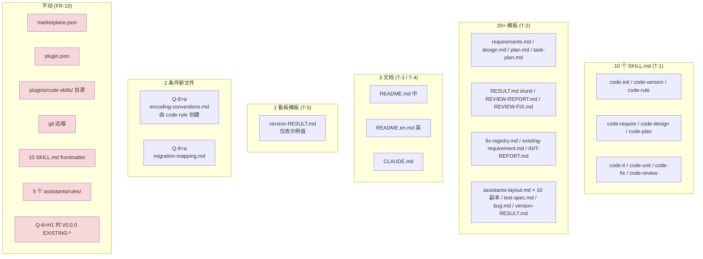

# 概要设计 — REQ-00002(编码格式统一:REQ/TASK/BUG 均 5 位)

- 需求编码:REQ-00002
- 所属版本:V0.0.1
- 设计版本:v1
- 状态:已完成(首次设计)
- 责任人:wangmiao
- 创建:2026-06-03
- 最近更新:2026-06-03 20:25
- **上游**:`./assistants/V0.0.1/require/REQ-00002/RESULT.md`(v3,10 FR / 7 NFR / 11 AC / 5 项待澄清;Q-7 已锁定)
- **遵循规范**:`./assistants/rules/` 下 5 个文件(详见 §11 与 `rule-compliance.md`)

---

## 1. 设计概述

本需求是 **"横切协议文本的批量字符串变更"**,**不新增任何应用模块、不修改任何代码结构、不引入任何依赖**。设计核心是回答 4 个"如何做"的策略问题:

1. **编辑粒度**:按"文件类型"分组 vs 按"技能"分组 → 选 A(详见 §3 Q-4)
2. **任务拆分粒度**:10 SKILL.md + 20+ 模板 + 3 文档 + 1 看板模板 + (条件)2 新文件 = 预想 11 个子任务
3. **regex / 编号分配逻辑升级**:code-it / code-plan / code-review 三个技能的逻辑变更算法(详见 §3 Q-5/Q-6/Q-7)
4. **5 项 Q 默认值采纳**:Q-6(H1 保留 EXISTING-)/ Q-8(a 新建规则)/ Q-9(a 持久化映射)/ Q-10(b 不加 cache 提示)/ Q-12(a 仅数字段)

> 本设计是"在 `code-require` 已锁定的范围内,对实施策略与子任务拆分做可执行级细化",不重新讨论"是否统一格式"或"统一为几位"。

---

## 2. 架构视图

### 2.1 组件图(Mermaid)



> 图例:🔴 红色=本需求严禁修改 / 黄色=本需求将修改(图中未标色,因类型多)/ 绿色=条件新增(未标色)

### 2.2 变更传播路径

```
code-require (REQU 阶段)  → 锁定 10 FR / 7 NFR / 11 AC / Q-7 G4 已锁定
                                    ↓
code-design (本设计阶段)   → 锁定 8 项 Q 默认值 + 11 个子任务预想
                                    ↓
code-plan                   → 把 11 个预想拆为 N 个开发任务 + 验证任务
                                    ↓
code-it (实施阶段)
   ├─→ T-1: 10 SKILL.md 逐处 Edit (不动 frontmatter)
   ├─→ T-2: 20+ 模板逐处 Edit (占位符 + 示例值)
   ├─→ T-3: README.md + README.en.md (同次提交)
   ├─→ T-4: CLAUDE.md
   ├─→ T-5: version-RESULT.md 模板 (示例值)
   ├─→ T-9 (Q-8=a): code-rule 创建 encoding-conventions.md
   └─→ T-10 (Q-9=a): 写 migration-mapping.md
                                    ↓
code-review
   ├─→ 穷举式 Grep: REQ-2026- / BUG-NNN[^N] / <任务编码> + 格式 / <需求编号>-<任务序号>
   ├─→ diff 审阅每个修改文件
   └─→ 中英 README 同次提交核查
                                    ↓
/reload-plugins (用户手动)  → cache 同步 (超出本仓库可控范围)
```

### 2.3 验证路径

```
1. SKILL.md 旧格式 0 残留
   ├─→ Grep "REQ-YYYY" → 0 命中
   ├─→ Grep "BUG-NNN[^N]" → 0 命中
   ├─→ Grep "<任务编码>" + "格式 `<需求编号>-<任务序号>`" → 0 命中
   ├─→ Grep "^REQ-\\d{4}-\\d{4}-\\d{3}$" → 0 命中
   ├─→ Grep "^TASK-\\d{5}$" → 0 命中 (确认 G1 未残留)
   └─→ Grep "^TASK-(REQ|BUG)-\\d{5}-\\d{5}$" → 命中 (确认 G4 已落地)

2. 模板旧格式 0 残留
   ├─→ 同 1 的 Grep 模式,范围 plugins/code-skills/skills/*/templates/**
   ├─→ Grep "REQ-2026-0001-001" → 0 命中
   └─→ Grep "TASK-REQ-00001-00001" → 命中

3. README 中英同次提交
   ├─→ Grep 关键短语 0 命中
   ├─→ 二级标题并列对仗
   └─→ git log --oneline -- README.md README.en.md 确认同 commit

4. CLAUDE.md 已同步
   └─→ Grep 关键短语 0 命中

5. 看板模板与 V0.0.1 看板同步
   ├─→ V0.0.1 看板"需求清单"行使用 REQ-00001 / REQ-00002
   └─→ (Q-8=a) "变更记录"含"新建 encoding-conventions.md"条目

6. (Q-8=a) 各 SKILL.md 引用 encoding-conventions.md
   └─→ Grep "encoding-conventions.md" → 10 命中 (每个 SKILL.md 至少 1 处引用)

7. (Q-9=a) migration-mapping.md 存在
   └─→ Read 文件,确认含 REQ-2026-0001 → REQ-00001 一行

8. 不变量验证
   ├─→ 不触发 marketplace-protocol §规则 1
   ├─→ 不触发 skill-conventions §规则 1 (frontmatter 完整)
   ├─→ (Q-6=H1) V0.0.0/EXISTING- 文件名保持
   └─→ 中英 README 结构对仗
```

---

## 3. 关键设计决策(对应 design-notes.md)

### Q-1:用什么工具修改 SKILL.md 与模板?
- **选定**:`Edit` 工具,逐处精确替换
- **理由**:风险低,只动指定行;保留 frontmatter(SKILL.md `name` / `description` 不动)
- **规范依据**:`skill-conventions.md §规则 1`(frontmatter 必含且不可破坏);`module-conventions.md §规则 1`

### Q-2:用什么工具修改 README / CLAUDE.md?
- **选定**:`Edit` 工具,逐处精确替换
- **理由**:与 Q-1 同等收益;保留中英结构对仗
- **规范依据**:`doc-conventions.md §规则 1`(中英结构对仗);`§规则 2`(命令反映实际)

### Q-3:`version-RESULT.md` 模板如何处理?
- **选定**:`Edit` 工具,只改示例值
- **判定**:`dashboard-conventions.md §规则 1` **不触发** — 本需求只改示例值,不改字段语义 / 区段结构 / 表格列
- **规范依据**:`dashboard-conventions.md §规则 1`(纯排版/格式调整例外)

### Q-4:子任务拆分粒度?
- **选定**:**按"文件类型"分组**,预想 11 个子任务(T-1 ~ T-11)
- **理由**:边界清晰,code-review 可独立验收;失败重试粒度合适
- **预想子任务清单**:
  - T-1: 同步 10 个 SKILL.md
  - T-2: 同步 20+ 模板
  - T-3: 同步 README.md + README.en.md
  - T-4: 同步 CLAUDE.md
  - T-5: 同步 version-RESULT.md 模板
  - T-6/T-7/T-8: code-it regex + code-plan 编号分配 + code-review 派生规则(由 T-1 覆盖)
  - T-9 (Q-8=a): 由 `code-rule` 创建 `encoding-conventions.md`
  - T-10 (Q-9=a): 写 `migration-mapping.md`
  - T-11: 全仓库穷举式 Grep 验证

### Q-5:code-plan 任务编号分配算法(Q-7 锁定后)
- **算法**:
  1. 解析父级类型(从 TASK 编码第 2 段 `REQ` / `BUG` 推断)
  2. `Glob` 该父级下所有 TASK 编码
  3. `Grep ^TASK-(REQ|BUG)-<父级数字段>-\d{5}` 取父级内已用最大值
  4. 新任务 = 父级内 max + 1,格式化为 5 位
  5. 拼装:`TASK-REQ-<父级>-NNNNN` 或 `TASK-BUG-<父级>-NNNNN`
- **依据**:Q-7 锁定 + REQU §7 交互 2

### Q-6:code-it 双路径解析
- **算法**:
  1. 用 `^TASK-(REQ|BUG)-\d{5}-\d{5}$` 验证
  2. 提取第 2 段:
     - `REQ` → `./assistants/V<版本号>/plan/<REQ 数字段>-NNNNN/`
     - `BUG` → `./assistants/V<版本号>/fix/<BUG 数字段>-NNNNN/`
  3. 提取第 4 段作为任务在父级内的序号
- **依据**:Q-7 锁定 + REQU FR-2

### Q-7:code-review 派生任务编码
- **算法**:在原任务所属父级(REQ 或 BUG)内继续递增
- **示例**:原 `TASK-REQ-00001-00001` → 派生 `TASK-REQ-00001-00002`
- **依据**:REQU §7 交互 2 + §8 实体关系

### Q-8:Q-6 (EXISTING-) 默认值
- **选定**:**H1(保留 EXISTING- 前缀)**
- **理由**:保留基线语义;code-init 改动最小;NFR-5 最小化
- **回退路径**:若 H2,新增 FR-11 覆盖 V0.0.0 全量迁移;若 H3,引入新字段违反 marketplace-protocol §规则 1(不推荐)

### Q-9:Q-8 (encoding-conventions.md) 默认值
- **选定**:**(a) 新建**(由 `code-rule` 创建)
- **理由**:NFR-1 强烈建议单一事实源;符合 `code-rule` 语义边界
- **实施约束**:本需求不直接写入 `./assistants/rules/`(REQU FR-7 显式)

### Q-10:Q-9 (migration-mapping.md) 默认值
- **选定**:**(a) 持久化**
- **理由**:NFR-3 长期追溯
- **实施位置**:`./assistants/V0.0.1/require/REQ-00002/migration-mapping.md`

### Q-11:Q-10 (cache 同步 README 提示) 默认值
- **选定**:**b(不加)**
- **理由**:NFR-5 最小化;cache 同步超出仓库可控范围
- **回退路径**:若 a,在 README 加一句"实施完成后请执行 /reload-plugins",doc-conventions §规则 1 同步触发

### Q-12:Q-12 (TASK 嵌套前缀) 默认值
- **选定**:**a(仅数字段)**
- **理由**:字面简洁(18 字符 vs 23);正则更短;与 §Q-12 推荐一致
- **示例**:`TASK-REQ-00001-00001` / `TASK-BUG-00001-00001`
- **回退路径**:若 b,批量更新所有正则与示例为 `TASK-REQ-REQ-00001-00001`

---

## 4. 模块清单(对应 module-breakdown.md)

本需求**不新增、不修改任何应用模块**。变更仅限 5 类文件 + 2 条件新文件,详见 `module-breakdown.md`:

| # | 文件类型 | 数量 | 状态 | 详见 |
| --- | --- | --- | --- | --- |
| 1 | 10 个 SKILL.md | 10 | 修改(不动 frontmatter) | `module-breakdown.md` §1 |
| 2 | 20+ 模板 | 20+ | 修改(占位符 + 示例值) | §2 |
| 3 | README.md + README.en.md | 2 | 修改(同次提交) | §3 |
| 4 | CLAUDE.md | 1 | 修改 | §4 |
| 5 | version-RESULT.md 模板 | 1 | 修改(只改示例值) | §5 |
| 6 | (Q-8=a) `encoding-conventions.md` | 1 | 可能新增(`code-rule` 创建) | §6 |
| 7 | (Q-9=a) `migration-mapping.md` | 1 | 可能新增 | §7 |
| 8 | (Q-6=H2) V0.0.0 EXISTING-* 内文本 | 10 | 可能修改(默认 H1 不改) | §8 |

### 强约束不动的文件

| 文件 / 目录 | 约束来源 |
| --- | --- |
| `marketplace.json` 任何字段 | `marketplace-protocol.md §规则 1`;REQU FR-10 |
| `plugin.json` 任何字段 | 同上 |
| `plugins/code-skills/` 目录 | NFR-2;REQU FR-10 |
| git 远端仓库名 | NFR-2;REQU FR-10 |
| 10 SKILL.md frontmatter | `skill-conventions.md §规则 1` |
| 5 个现有 `./assistants/rules/` | REQU FR-7(本需求不直接操作) |
| V0.0.0 EXISTING- 目录名(Q-6=H1) | REQU FR-10;基线特例保持 |
| `.claude/` 本地配置 | 不在 `git` 跟踪范围 |

---

## 5. 关键不变量(本需求严禁破坏)

| 不变量 | 来源 | 验证方式 |
| --- | --- | --- |
| `marketplace.json` 任何字段 | `marketplace-protocol.md §规则 1`;REQU FR-10 | `git diff --stat` |
| `plugin.json` 任何字段 | 同上 | 同上 |
| `plugins/code-skills/` 目录名 | REQU FR-10 | `ls plugins/` |
| git 远端仓库名 | REQU FR-10 | `git remote -v` |
| 10 SKILL.md frontmatter(`name` + `description`) | `skill-conventions.md §规则 1` | `Grep "^name: code-" + "^description: "` |
| 10 SKILL.md `name` 与目录名一致 | 同上 | 人工核对 |
| 模板文件位置(`templates/` / `checklists/` / `guidelines/`) | `module-conventions.md §规则 1` | `ls skills/<技能>/` |
| V0.0.0 EXISTING- 目录名(Q-6=H1 时) | REQU FR-10 + Q-6 决策 | `ls V0.0.0/require/` |
| (Q-6=H1) V0.0.0 EXISTING- 文件**内**旧编码 | 不变(基线特例) | 保持 |
| 中英 README 结构对仗 | `doc-conventions.md §规则 1` | 并列 diff |
| (Q-6=H1) code-init 产生 EXISTING- 的逻辑 | 保持 | Read 确认 |

---

## 6. 接口与数据结构(对应 REQU FR-1 / FR-2 / FR-7)

### 6.1 编码格式定义(权威源)

| 实体 | 格式 | 正则 | 容量 | 递增 |
| --- | --- | --- | --- | --- |
| 需求(REQ) | `REQ-NNNNN` | `^REQ-\d{5}$` | 99999 | 全局连续 |
| 任务(TASK)需求 | `TASK-REQ-<REQ 数字段>-NNNNN` | `^TASK-REQ-\d{5}-\d{5}$` | 每父级 99999 | 父级内连续 |
| 任务(TASK)修复 | `TASK-BUG-<BUG 数字段>-NNNNN` | `^TASK-BUG-\d{5}-\d{5}$` | 每父级 99999 | 父级内连续 |
| 缺陷(BUG) | `BUG-NNNNN` | `^BUG-\d{5}$` | 99999 | 全局连续 |

> 跳号视为留白(不重用);TASK 序号自带父子关系(无需 PLAN.md 加"所属需求"列)

### 6.2 待替换字面量清单(供 `code-it` 阶段 `Grep`)

| 改前 | 改后 | 适用文件 |
| --- | --- | --- |
| `REQ-2026-0001` | `REQ-00001` | SKILL.md / 模板 / README / CLAUDE.md |
| `BUG-001`(裸 3 位) | `BUG-00001` | SKILL.md / 模板 / README / CLAUDE.md |
| `BUG-002` ~ `BUG-999` | `BUG-00002` ~ `BUG-00999` | 同上 |
| `REQ-2026-0001-001`(旧嵌套) | `TASK-REQ-00001-00001` | SKILL.md / 模板 / README |
| `REQ-YYYY-NNNN`(占位符) | `REQ-NNNNN` | 模板 / 文档 |
| `BUG-NNN`(占位符) | `BUG-NNNNN` | 模板 / 文档 |
| `<任务编码>`(旧嵌套) | `<TASK-REQ-NNNNN-NNNNN>` 或 `<TASK-BUG-NNNNN-NNNNN>` | 模板 |
| `<需求编号>-<任务序号>`(占位符) | `<TASK-REQ-NNNNN-NNNNN>` 或 `<TASK-BUG-NNNNN-NNNNN>` | 模板 |
| `^REQ-\d{4}-\d{4}-\d{3}$`(regex) | `^TASK-(REQ|BUG)-\d{5}-\d{5}$` | code-it SKILL.md |
| `T-001` / `T-002` / `T-XXX` | `TASK-REQ-<父级>-00001` 等 | version-RESULT.md 模板 |

---

## 7. 三方依赖

**本需求不新增任何第三方依赖**。详细评估见 `dependencies.md`。

---

## 8. 关联设计

| 关联设计 | 关联点 | 影响 | 备注 |
| --- | --- | --- | --- |
| [design/REQ-00001/RESULT.md](REQ-00001/RESULT.md)(Marketplace 改名) | 弱耦合 — 仅在 README 与 CLAUDE.md 处有交集 | 弱 | 两需求改的内容维度不同;`code-it` 阶段需协调子任务边界 |

详见 `related-designs.md`。

---

## 9. 验收标准覆盖矩阵

| AC | 对应需求 | 由谁验证 | 验证方式 |
| --- | --- | --- | --- |
| AC-1 | FR-1, FR-7 | code-it + code-review | Read 权威源文件 |
| AC-2 | FR-2 | code-review | Grep 5 个反例 + 1 个正例 |
| AC-3 | FR-3 | code-review | Grep 模板范围 |
| AC-4 | FR-4 | code-review | Grep + 并列 diff + git log |
| AC-5 | FR-5 | code-review | Grep CLAUDE.md |
| AC-6 | FR-6 | code-it + code-review | 目录列举 + 本工作空间 Grep |
| AC-7(条件 Q-8=a) | FR-7 | code-it + code-review | Read + Grep 引用 |
| AC-8(条件 Q-9=a) | FR-8 | code-it | Read migration-mapping.md |
| AC-9 | FR-9 | code-it 收尾 | Read V0.0.1/RESULT.md |
| AC-10 | FR-10 | code-review | `git diff --stat` |
| AC-11 | NFR-2 | code-review | Grep frontmatter |

---

## 10. 边界与异常

| 场景 | 处理方式 |
| --- | --- |
| 编号超过 99999 | 当前不可预见(超出可见用量);若必要,扩展至 6 位需新建独立 REQ |
| 重命名时漏掉某文件的旧编码字符串 | `code-review` 阶段穷举 Grep `REQ-2026-0001`、`BUG-NNN`(无后续 5 位)、`REQ-YYYY` |
| Q-6 选 H1 后,用户重跑 code-init 期望按新格式生成 EXISTING- 失败 | code-init SKILL.md 明确"EXISTING- 不参与本次编码统一,保留 3 位前缀 NNN";若用户希望新项目按 REQ-NNNNN 起步,可直接调 code-require 而非 code-init |
| TASK 全局计数与 PLAN.md 中"所属需求"列脱钩 | v2 锁定 G4 后,TASK 编码自带父子关系,PLAN.md **无需**"所属需求"列;原风险项失效 |
| 实施过程中 REQ-2026-0001 与 REQ-00002 工作目录并存 | 文档内显式标注"过渡期:见 migration-mapping.md" |
| cache 副本未及时刷新导致 AI 仍按旧规则产出 | README 提示"实施后必须 /reload-plugins";不在本仓库可控范围 |
| git 历史 commit log 含旧编码 | 不修改 git 历史;新提交 commit message 注明"格式变更见 REQ-00002" |
| 用户在过渡期同时跑 REQ-00001 与 REQ-00002 的下游阶段 | 推荐 related-requirements.md §实施顺序建议;若坚持并行,FR-6 范围需手动扩展 |
| Q-8 / Q-9 用户在 code-plan 前改主意 | 通过 `clarifications.md` 记录 + 触发本设计 v2 增量更新 |

---

## 11. 规范遵循

**无偏离、无冲突、无授权偏离**。详细记录见 `rule-compliance.md`。

| 规范文件 | 关联强度 | 适用条款 |
| --- | --- | --- |
| `./assistants/rules/dashboard-conventions.md` | 条件触发(本需求不触发) | §规则 1(纯排版/示例值调整例外) |
| `./assistants/rules/doc-conventions.md` | **强** | §规则 1(中英同次提交);§规则 2(命令反映实际) |
| `./assistants/rules/marketplace-protocol.md` | 弱(不触发) | §规则 1(本需求不改协议清单) |
| `./assistants/rules/module-conventions.md` | 弱(不触发) | §规则 1(本需求不创建新资源) |
| `./assistants/rules/skill-conventions.md` | 中(不改 frontmatter) | §规则 1(SKILL.md 正文改不影响) |

### 11.1 规范触发的关键工作流约束(本设计采纳清单)

| 规范条款 | 触发的工作流约束 | 本设计的实现 |
| --- | --- | --- |
| `dashboard-conventions.md §规则 1` | (条件)看板字段约定扩展需三处同步 | **本需求不触发** — 只改 `version-RESULT.md` 中的示例值,不改字段语义 / 区段结构 / 表格列 |
| `doc-conventions.md §规则 1` | README 中英同次提交 | `code-it` 阶段 T-3 子任务同时修改 `README.md` + `README.en.md`(1 个 commit) |
| `doc-conventions.md §规则 2` | README 中命令/路径反映实际 | T-3 子任务的全部替换都是"为反映新格式而更新" |
| `skill-conventions.md §规则 1` | SKILL.md frontmatter 必含 `name` + `description` | T-1 子任务的 `Edit` 操作**锁定只改正文**,不触碰 frontmatter |
| `module-conventions.md §规则 1` | 资源在固定子目录 | 本需求不创建新资源(除条件 Q-8=a 的 `encoding-conventions.md` 在 `rules/`,由 `code-rule` 创建) |
| `marketplace-protocol.md §规则 1` | `marketplace.json` / `plugin.json` 字段约束 | FR-10 显式禁止修改;`code-it` 阶段 `git diff --stat` 兜底 |

### 11.2 待澄清项的默认值均未触发规范违反

| Q | 默认值 | 规范层面是否合规 |
| --- | --- | --- |
| Q-6 (EXISTING- 是否改 REQ-NNNNN) | 不改(保留 EXISTING-) | ✅ 符合 `module-conventions.md §规则 1`;`doc-conventions §规则 1` 不约束基线版本 |
| Q-8 (encoding-conventions.md 新建) | 新建(由 `code-rule` 创建) | ✅ 符合 `code-rule` 语义边界 |
| Q-9 (migration-mapping.md 持久化) | 持久化 | ✅ 符合 NFR-3,无规范冲突 |
| Q-10 (cache 同步 README 提示) | 不加(沿用现状) | ✅ 符合 NFR-5(最小化) |
| Q-12 (TASK 嵌套前缀) | 仅数字段(`TASK-REQ-00001-00001`) | ✅ 符合 NFR-5(简洁) |

---

## 12. 与下游的衔接

### 12.1 `code-plan` 阶段输入
- 本设计 RESULT.md
- 7 个过程文档(`materials-index.md` / `design-notes.md` / `module-breakdown.md` / `dependencies.md` / `related-designs.md` / `rule-compliance.md` / `clarifications.md`)
- 5 项 Q 默认值(Q-6 / Q-8 / Q-9 / Q-10 / Q-12),由 `code-plan` 阶段开始前最终确认

### 12.2 `code-plan` 阶段产出
- `code/<任务编码>/RESULT.md`(N 个任务改修正文,每个含 file_path:line_number)
- `plan/REQ-00002/PLAN.md`(任务清单)
- 任务编码采用**新格式**:`TASK-REQ-00002-NNNNN` / `TASK-BUG-00002-NNNNN`(本需求 Q-7 = G4 已锁定)

### 12.3 任务拆分预想(供 `code-plan` 参考)

| 任务编码(预想) | 标题 | 主要修改文件 | 备注 |
| --- | --- | --- | --- |
| `TASK-REQ-00002-00001` | 同步 10 个 SKILL.md | 10 SKILL.md | 不动 frontmatter |
| `TASK-REQ-00002-00002` | 同步 20+ 模板 | 全部 `templates/*.md` | 占位符 + 示例值 |
| `TASK-REQ-00002-00003` | 同步中英 README | `README.md` + `README.en.md` | 同次提交 |
| `TASK-REQ-00002-00004` | 同步 CLAUDE.md | `CLAUDE.md` | — |
| `TASK-REQ-00002-00005` | 同步 version-RESULT.md 模板 | `templates/version-RESULT.md` | 只改示例值 |
| `TASK-REQ-00002-00006` | (条件 Q-8=a) 由 `code-rule` 创建 `encoding-conventions.md` | `assistants/rules/encoding-conventions.md` | 由用户调 `code-rule` 实施 |
| `TASK-REQ-00002-00007` | (条件 Q-9=a) 持久化 `migration-mapping.md` | `assistants/V0.0.1/require/REQ-00002/migration-mapping.md` | — |
| `TASK-REQ-00002-00008` | 全仓库穷举式 Grep 验证 | 无文件修改 | 产出偏差日志 |

> 注:任务编码为预想,实际以 `code-plan` 阶段拆分为准。**TASK 编码采用新格式**(与 REQU FR-1 锁定 + 本设计 Q-12 默认 (a) 一致)。

---

## 13. 待澄清 / 未决项

| 编号 | 状态 | 问题 | 影响范围 | 阻塞方 | 期望回复时间 |
| --- | --- | --- | --- | --- | --- |
| Q-6 | 待澄清 | V0.0.0 下 EXISTING-001~010 是否一并纳入"追溯覆盖"?H1=保留(本设计默认) / H2=改 REQ-NNNNN / H3=折中 | 影响 FR-10 范围、code-init SKILL.md 是否需重写、`migration-mapping.md` 行数 | 用户 | `code-plan` 前确认 |
| Q-7 | **已锁定**(2026-06-03 20:18) | TASK 编码结构 → 采纳 G4 新嵌套式 `TASK-(REQ\|BUG)-NNNNN-NNNNN` | — | — | — |
| Q-8 | 待澄清 | 是否新建 `./assistants/rules/encoding-conventions.md`?a=是(本设计默认) / b=否 | 影响 FR-7 是否落地、AC-7 是否适用 | 用户 | `code-plan` 前确认 |
| Q-9 | 待澄清 | 是否持久化 `migration-mapping.md`?a=写入(本设计默认) / b=仅 commit log / c=不记录 | 影响 FR-8 是否落地、AC-8 是否适用 | 用户 | `code-plan` 前确认 |
| Q-10 | 待澄清 | cache 同步是否需要在 README 增加显式提示?a=加 / b=不加(本设计默认) | 影响 README 是否再加一句 | 用户 | `code-it` 前确认 |
| Q-11 | 待澄清(措辞已调整) | 本需求与 REQ-00001(原 REQ-2026-0001)的实施顺序是否采用推荐顺序? | 影响 FR-6 范围(若反序,需扩展 FR-6 至 REQ-00001 下游各阶段产出物) | 用户 | `code-plan` 前确认 |
| Q-12 | 待澄清(本设计默认 a) | "需求编码"在 TASK 编码中是否含 `REQ-` 前缀?a=仅数字段(本设计默认) / b=含 `REQ-` 前缀 | 影响 FR-1 正则字面量、FR-2 各 SKILL.md 文本、FR-3 模板示例、AC-2/AC-3 Grep 模式 | 用户 | `code-plan` 前确认 |

> 这 5 项**不阻塞** `code-plan` 阶段;用户随时可改主意,本设计已记录回退路径(详见 `clarifications.md`)。

---

## 14. 变更记录

| 时间 | 版本 | 变更类型 | 变更摘要 | 变更人 |
| --- | --- | --- | --- | --- |
| 2026-06-03 20:25 | v1 | 设计新增 | 完成首次概要设计:锁定 8 项设计决策(Q-1~Q-12 中 Q-1~Q-5 为方法论,Q-6~Q-12 为 Q 默认值,均采纳 REQU 文档默认),5 个修改文件类型 + 2 条件新文件,11 个子任务预想,11 条不变量;规范遵循 100% 合规(条件不触发 `dashboard-conventions §规则 1`);Q-7 已锁定 v2 G4 新嵌套式;Q-6/Q-8/Q-9/Q-10/Q-12 采用 REQU 文档默认值 | wangmiao |
