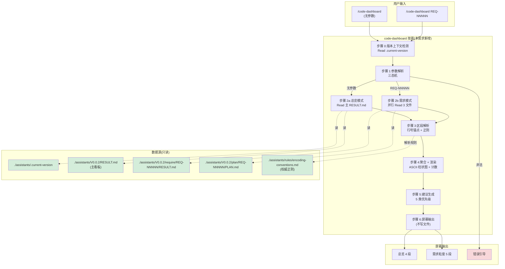

# 概要设计 — REQ-00004(添加 `/code-dashboard` 开发看板技能)

- 需求编码:REQ-00004
- 所属版本:V0.0.2
- 设计版本:v1
- 状态:已完成(首次设计)
- 责任人:wangmiao
- 创建:2026-06-04
- 最近更新:2026-06-04 15:50
- **上游**:`./assistants/V0.0.2/require/REQ-00004/RESULT.md`(v1,10 FR / 7 NFR / 30 AC / 3 项已锁定 Q-1~Q-3 / 2 项采纳默认 Q-4~Q-5 / 2 项未采用 Q-7~Q-8)
- **遵循规范**:`./assistants/rules/` 下 9 个相关文件(详见 §11 与 `rule-compliance.md`)

---

## 1. 设计概述

本需求新增**第 11 个** `code-*` 技能 `code-dashboard`,作为 `code-skills` 仓库的"只读型"全局看板入口。其本质是:

- **新增 1 个技能目录** + **1 个 `SKILL.md` 文件**;**不修改**任何既有模块
- **不引入**任何运行时依赖(NFR-1 锁)
- **不修改**看板 / 模板 / `marketplace.json` / `plugin.json` / 其他 10 个 SKILL.md(NFR-6 锁)
- **支持双粒度**:无参数(版本总览)/ 指定 `REQ-NNNNN`(需求粒度)
- **自动生成**最多 5 条下一步建议(可执行命令 + 依据 + 优先级)

设计核心是回答 6 个"如何做"的策略问题(详见 `design-notes.md`):
1. `SKILL.md` 章节结构(完全复用既有 10 个技能骨架)
2. `RESULT.md` 解析器架构(单遍扫描 + 行号锚点)
3. 任务编号解析(新格式优先 + 旧格式透传)
4. 下一步建议生成器(5 类建议 + 优先级排序)
5. ASCII 渲染器(固定 12 字符 + `█` / `░` / `▓`)
6. 参数解析(三态机 + 严格正则)

> 本设计是"在 `code-require` 已锁定的范围内,对实施策略做可执行级细化",不重新讨论"是否要加看板技能"或"展示形态"。

---

## 2. 架构视图

### 2.1 组件图(Mermaid)



> 图例:🟢 绿色=只读数据源;🔴 红色=用户错误引导;无色=本技能内部流程
> 关键属性:`code-dashboard` 自身**不**出现在数据源或输出区段;它只是"读 + 渲染"的中间层

### 2.2 数据流(总览模式)

```
┌──────────────────┐
│  /code-dashboard │
└────────┬─────────┘
         ↓
┌────────────────────────────────────┐
│ Read ./.claude/.../.current-version│  ← 1 次 IO
└────────┬───────────────────────────┘
         ↓ (内容: "V0.0.2")
┌────────────────────────────────────┐
│ Read ./assistants/V0.0.2/RESULT.md │  ← 1 次 IO(单次读全文)
└────────┬───────────────────────────┘
         ↓
┌────────────────────────────────────┐
│ 行号锚点定位:                        │
│   ## 需求清单   @ 47-65              │
│   ## 任务清单   @ 117-140            │
│   ## 缺陷清单   @ 143-150            │
│   ## 里程碑     @ 35-46(可选)        │
└────────┬───────────────────────────┘
         ↓
┌────────────────────────────────────┐
│ 表格行提取 + 列切分:                 │
│   reqs: 10 行(REQs)                 │
│   tasks: 0 行(TASKs)                │
│   bugs: 0 行(BUGs)                  │
└────────┬───────────────────────────┘
         ↓
┌────────────────────────────────────┐
│ 聚合 + 渲染:                         │
│   段 1: 需求进度 3/10/0/0/0/0       │
│   段 2: 任务进度 0/0/0/0/0          │
│   段 3: 缺陷 (无)                    │
│   段 4: 5 条建议                     │
└────────┬───────────────────────────┘
         ↓
┌────────────────────────────────────┐
│ 屏幕打印 stdout                      │
│ (NFR-7 幂等:不写任何文件)            │
└────────────────────────────────────┘
```

### 2.3 数据流(需求模式)

```
┌────────────────────────────────┐
│ /code-dashboard REQ-00001     │
└────────┬───────────────────────┘
         ↓
┌────────────────────────────────────┐
│ Read .current-version (1 次)       │
└────────┬───────────────────────────┘
         ↓
┌────────────────────────────────────┐
│ 并行 Read 3 文件:                   │
│   ↘ V0.0.2/RESULT.md               │
│   ↘ V0.0.2/require/REQ-00001/RESULT.md
│   ↘ V0.0.2/plan/REQ-00001/PLAN.md  │
└────────┬───────────────────────────┘
         ↓
┌────────────────────────────────────┐
│ 解析:                                │
│   - 需求元信息(标题/状态)            │
│   - 任务清单(从 PLAN.md)            │
│   - 关联缺陷(从主看板筛 关联任务含 REQ-00001-)
└────────┬───────────────────────────┘
         ↓
┌────────────────────────────────────┐
│ 渲染:                                │
│   === REQ-00001 进度概览 ===          │
│   需求 / 状态 / 概要设计 / 详细设计   │
│   任务清单(表格)                     │
│   关联缺陷(列表)                     │
│   下一步建议(最多 5 条)              │
└────────┬───────────────────────────┘
         ↓
┌────────────────────────────────────┐
│ 屏幕打印                              │
└────────────────────────────────────┘
```

---

## 3. 模块拆分

> 详见 `module-breakdown.md`。本节给"概要"。

### 3.1 新增模块
- `plugins/code-skills/skills/code-dashboard/`
  - `SKILL.md`(主入口,1 个文件)
  - **不**新增 `templates/` / `checklists/` / `guidelines/` 子目录(无独立资源)

### 3.2 复用既有模块
- `code-review` 行为契约(只读型 + 工具集 `Read` / `Glob` / `Grep`);**不修改**其任何内容

### 3.3 修改既有模块
- **0 个**(NFR-6 严守)

### 3.4 可选修改(用户授权才触发)
- `plugins/code-skills/CLAUDE.md` "AI 工作约定"小节追加 1 段(留作 `code-rule` 沉淀)
- `plugins/code-skills/README.md` + `README.en.md` 技能清单各追加 1 行(中英同次提交)
- 本设计**建议不**触发,避免与 V0.0.2 并发需求产生冲突

---

## 4. 接口与数据结构

### 4.1 CLI 入口

| 调用 | 模式 | 输入 | 输出 |
| --- | --- | --- | --- |
| `/code-dashboard` | 总览 | 无 | 4 段总览(段 1 需求 + 段 2 任务 + 段 3 缺陷 + 段 4 建议) |
| `/code-dashboard REQ-NNNNN` | 需求 | 5 位数字 | 5 段详情(元信息 + 任务清单 + 关联缺陷 + 建议) |
| `/code-dashboard <非法>` | 错误 | 任意 | 用法示例 + 退出 |

### 4.2 文件契约(只读)

| 路径 | 总览模式 | 需求模式 | 字段用途 |
| --- | --- | --- | --- |
| `./assistants/.current-version` | ✅ 必读 | ✅ 必读 | 决定激活版本(1 行) |
| `./assistants/<版本>/RESULT.md` | ✅ 必读 | ✅ 必读 | 主数据源(7 区段) |
| `./assistants/<版本>/require/<REQ>/RESULT.md` | ❌ | ✅ 必读 | 需求元信息(标题 / 状态) |
| `./assistants/<版本>/plan/<REQ>/PLAN.md` | ❌ | ✅ 必读 | 任务清单(表格) |
| `./assistants/rules/encoding-conventions.md` | ✅ 解析时参考 | ✅ 解析时参考 | 任务编号正则权威 |

### 4.3 解析锚点(看板区段,NFR-2 缺失不崩溃)

| 区段 | 起锚点正则 | 止锚点 | 总览模式 | 需求模式 |
| --- | --- | --- | --- | --- |
| 需求清单 | `^## 需求清单$` | 下一 `^## ` 或 `^---$` | ✅ 必读 | ❌ |
| 任务清单 | `^## 任务清单$` | 同上 | ✅ 必读 | ❌ |
| 缺陷清单 | `^## 缺陷清单$` | 同上 | ✅ 必读 | 部分(关联任务筛) |
| 里程碑 | `^## 里程碑$` | 同上 | ⚠️ 副显(可选) | ❌ |
| 概要设计清单 | `^## 概要设计清单$` | 同上 | ❌(Q-D2 锁定) | ❌ |
| 详细设计与任务计划汇总 | `^## 详细设计与任务计划汇总$` | 同上 | ❌ | ❌ |

### 4.4 任务编号数据结构(NFR-3)

```ts
type TaskId = {
  format: "new" | "old",    // 字面格式标识
  type: "REQ" | "BUG",      // 父级类型
  parentNum: string,        // 5 位父级数字段
  taskNum: string,          // 5 位任务序号
  displayId: string         // 字面原样(用于展示)
}

function parseTaskId(raw: string): TaskId | null {
  // 新格式优先
  let m = raw.match(/^TASK-(REQ|BUG)-(\d{5})-(\d{5})$/)
  if (m) return { format: "new", type: m[1], parentNum: m[2], taskNum: m[3], displayId: raw }
  // 旧格式透传
  m = raw.match(/^(REQ|BUG)-(\d{5})-(\d{5})$/)
  if (m) return { format: "old", type: m[1], parentNum: m[2], taskNum: m[3], displayId: raw }
  return null
}
```

### 4.5 建议数据结构(FR-4)

```ts
type Suggestion = {
  command: string,              // 如 "/code-it TASK-REQ-00004-001"
  reason: string,               // 如 "任务 ... 开发状态=待开始,排在本版本所有待开始任务的最前"
  priority: "高" | "中" | "低" | "—"
}
```

### 4.6 与既有 7 个 `code-*` 技能接口对齐

| 接口 | `code-dashboard` 是否触发 | 说明 |
| --- | --- | --- |
| `marketplace.json` `plugins[0].skills[]` | ❌(NFR-6) | 走 Claude Code 技能协议自动发现,无需登记 |
| `plugin.json` 字段 | ❌(NFR-6) | 同上 |
| 看板 7 区段(读) | ✅(NFR-2) | 只读,不写 |
| `require/<REQ>/RESULT.md` 字段 | ✅(只读) | 读元信息 |
| `plan/<REQ>/PLAN.md` 表格 | ✅(只读) | 读任务清单 |
| 编码权威源 `encoding-conventions.md` | ✅(NFR-3) | 读正则 |

---

## 5. 关键设计决策(对应 `design-notes.md`)

### Q-1:SKILL.md 结构
- **选定**:完全复用既有 10 个技能骨架(目标 / 适用 / 不适用 / 目录 / 输入 / 输出 / 工具 / 步骤 / 边界 / 衔接 / 不要做)
- **理由**:与既有风格一致;`code-dashboard` 与 `code-design` 同为"读取型",步骤同构
- **规范依据**:`skill-conventions §规则 1` 隐含风格一致

### Q-2:解析器架构
- **选定**:单遍扫描 + 行号锚点定位
- **算法**:1 次 `Read` 全文 → 正则定位 `^## .*$` → 按目标区段提取行区间 → `^\| .* \|$` 匹配表格行
- **规范依据**:NFR-4 性能(< 5 秒)+ NFR-1 零依赖

### Q-3:任务编号解析(NFR-3)
- **选定**:新格式优先 + 旧格式透传
- **算法**:见 §4.4;旧格式不参与"路径生成",仅 `displayId` 保留
- **规范依据**:`encoding-conventions §规则 3` + NFR-3

### Q-4:建议生成器(FR-4)
- **选定**:5 类建议 + 优先级排序 + 最多 5 条
- **算法**:
  - 优先级 P0(高):无需求 / P0 缺陷 / 缺概要设计
  - 优先级 P1(中):任务待开始 / 缺详细设计
  - 优先级 P2(低):测试待运行 / 待评审
  - 特殊:全完成 → 推荐 `code-version V0.0.x`
- **命令格式**:严格按既有 10 个 SKILL.md frontmatter 中的真实语法
- **规范依据**:FR-4 + AC-4.1/4.2/4.3

### Q-5:ASCII 渲染器
- **选定**:固定 12 字符 + `█` 实心 / `░` 空心 / `▓` 半实心
- **算法**:`blocks = round(percent / 100 * 12)`,前缀 `[`,后缀 `] NN%`
- **规范依据**:Q-1 + Q-3 锁定

### Q-6:参数解析
- **选定**:三态机(无参 / `^REQ-\d{5}$` / 非法)
- **规范依据**:FR-6 + `encoding-conventions §规则 1`

### Q-7:性能
- **选定**:并行 Read + 单遍解析;估算 < 1 秒(V0.0.2 看板 280 行)
- **规范依据**:NFR-4 + NFR-7 幂等

### Q-8:错误处理(NFR-2)
- **选定**:3 层退化(L1 启动错误退出 / L2 数据缺失显示 `(无)` / L3 异常兜底)
- **规范依据**:NFR-2 + FR-5 + 边界 E-1~E-10

---

## 6. 页面与界面(输出形态)

### 6.1 总览模式(FR-2)的 4 段结构

| 段 | 内容 | 数据源 | 展示形式 |
| --- | --- | --- | --- |
| 段 1:需求进度 | 总计 / 已完成 / 进行中 / 待开始 / 已取消 / 阻塞 | 看板"需求清单" | ASCII 进度表 + 12 字符比例条 |
| 段 2:任务进度 | 总计 / 已完成 / 测试通过 / 真正可发布 | 看板"任务清单" | ASCII 进度表 + 12 字符比例条 |
| 段 3:缺陷(高优先级) | P0 待修复 + P1 待修复(醒目标记) | 看板"缺陷清单" | `█` 实心 / `▓` 半实心 + 数字 |
| 段 4:下一步建议 | 最多 5 条(命令 / 依据 / 优先级) | 上述 3 段派生 | 3 行 / 条 |

### 6.2 段 1 详细布局(示例:V0.0.2 当前状态)

```
=== V0.0.2 开发看板 ===

需求进度
────────
总计: 10
已完成: ██░░░░░░░░░░ 3
进行中: ░░░░░░░░░░░░ 0
待开始: ████████████ 7
已取消: ░░░░░░░░░░░░ 0
阻塞: ░░░░░░░░░░░░ 0
已完成率: [██░░░░░░░░░░] 30%

任务进度
────────
总计: 0
已完成: ░░░░░░░░░░░░ 0
测试通过: 0 (全部不适用)
真正可发布: ░░░░░░░░░░░░ 0
完成率: [░░░░░░░░░░░░] 0%

缺陷(高优先级)
──────────────
P0 待修复: (无)
P1 待修复: (无)

下一步建议
──────────
> 建议: 执行 /code-design REQ-00004
> 依据: 需求 REQ-00004 状态=已完成(需求分析)但概要设计=未开始
> 优先级: 高

> 建议: 执行 /code-design REQ-00005
> 依据: 需求 REQ-00005 状态=已完成(需求分析)但概要设计=未开始
> 优先级: 高

> 建议: 执行 /code-design REQ-00006
> 依据: 需求 REQ-00006 状态=已完成(需求分析)但概要设计=未开始
> 优先级: 高
```

### 6.3 段 3 缺陷段布局(FR-2.4,Q-3 锁定)

```
缺陷(高优先级)
──────────────
P0 待修复: █ 2    # P0 标记:█(实心)
P1 待修复: ▓ 1    # P1 标记:▓(半实心)
```

P2 / P3 不单列(若用户需要全部,留作 v2)。

### 6.4 段 4 详细布局(FR-4)

每条建议固定 3 行:
```
> 建议: <可执行命令>
> 依据: <状态描述>
> 优先级: 高/中/低/—
```

### 6.5 需求粒度布局(FR-3)

```
=== REQ-00001 进度概览 ===

需求: REQ-00001 Marketplace 根名称添加 -marketplace 后缀
状态: 已完成
概要设计: [已完成] 详细设计: [已完成]

任务清单
────────
| 任务编码            | 标题                          | 开发状态 | 测试状态 |
| REQ-00001-001       | 改 marketplace.json 根 name   | 已完成   | 不适用   |
| REQ-00001-002       | 同步中英 README               | 已完成   | 不适用   |
| REQ-00001-003       | 核查 CLAUDE.md                | 已完成   | 不适用   |
| REQ-00001-004       | 全仓库 Grep + commit          | 已完成   | 不适用   |
| REQ-00001-005       | 同步 GitHub URL(审查派生)    | 已完成   | 不适用   |

任务进度: 5 / 5 已完成 (100%)
关联缺陷: 无

下一步建议
──────────
> 该需求已全部完成,无需后续动作
> 依据: 5 任务全已完成,无未修复缺陷
> 优先级: —
```

---

## 7. 交互逻辑(状态机)

### 7.1 单次调用状态机

```
[启动]
  ↓
[Read .current-version]
  ├─ 文件不存在 → [L1 错误: 引导 + 退出(FR-5)]
  ├─ 指向不存在版本 → [L1 错误: 提示修复]
  └─ 成功 → [参数解析]
              ↓
       ┌──────┼──────┐
       │      │      │
   [无参数] [REQ-NNNNN] [非法]
       ↓      ↓          ↓
   [总览]   [需求]     [L2 错误: 用法 + 退出(FR-6)]
       ↓      ↓
       └──────┴──────→ [Read 主 RESULT.md]
                         ↓
                  [行号锚点定位区段]
                         ↓
                  [L2 退化: 缺失区段显示 (无)]
                         ↓
                  [需求模式: 并行 Read 2 文件]
                         ↓
                  [聚合 + 渲染 4/5 段]
                         ↓
                  [建议生成(最多 5 条)]
                         ↓
                  [屏幕打印 stdout]
                         ↓
                     [退出]
```

### 7.2 建议生成算法(伪代码)

```ts
function generateSuggestions(state, mode): Suggestion[] {
  const all: Suggestion[] = []

  if (mode === "总览") {
    // P0 高
    if (state.reqs.total === 0)
      all.push({ cmd: "/code-require", reason: "当前版本无任何需求", priority: "高" })
    for (const bug of state.bugs.filter(b => b.severity === "P0" && b.status !== "已修复"))
      all.push({ cmd: `/code-fix ${bug.displayId}`, reason: `缺陷 ${bug.displayId} P0 待修复`, priority: "高" })
    for (const req of state.reqs.filter(r => r.status === "已完成(需求分析)" && r.design === "未开始"))
      all.push({ cmd: `/code-design ${req.id}`, reason: `需求 ${req.id} 概要设计=未开始`, priority: "高" })

    // P1 中
    for (const task of state.tasks.filter(t => t.devStatus === "待开始"))
      all.push({ cmd: `/code-it ${task.displayId}`, reason: `任务 ${task.displayId} 开发状态=待开始`, priority: "中" })
    for (const req of state.reqs.filter(r => r.design === "已完成" && r.plan === "未开始"))
      all.push({ cmd: `/code-plan ${req.id}`, reason: `需求 ${req.id} 详细设计=未开始`, priority: "中" })

    // P2 低
    for (const task of state.tasks.filter(t => t.testStatus === "已编写"))
      all.push({ cmd: `/code-unit ${task.displayId}`, reason: `任务 ${task.displayId} 测试已编写未运行`, priority: "低" })
  } else { // mode === "需求"
    const req = state.targetReq
    for (const task of req.tasks.filter(t => t.devStatus === "待开始"))
      all.push({ cmd: `/code-it ${task.displayId}`, reason: `任务 ${task.displayId} 开发状态=待开始`, priority: "中" })
    // ...
  }

  // 特殊:全完成
  if (all.length === 0 && state.reqs.total > 0 && state.reqs.allCompleted && state.tasks.allCompleted)
    all.push({ cmd: "/code-version V0.0.x", reason: "该版本已全部完成,可发布或启动新版本", priority: "高" })

  return all.slice(0, 5)
}
```

### 7.3 性能预期(NFR-4 < 5 秒)

| 阶段 | IO 次数 | 估算耗时 |
| --- | --- | --- |
| 启动(读 `.current-version`) | 1 | < 50ms |
| 总览模式: 读主 `RESULT.md` | 1 | < 200ms |
| 需求模式: 并行读 3 文件 | 3(并行) | < 500ms |
| 解析(O(N) 扫行) | 0 | < 100ms |
| 渲染(O(M) 输出) | 0 | < 100ms |
| 建议生成 | 0 | < 50ms |
| **总耗时** | — | **< 1 秒**(典型) |

### 7.4 多需求折叠(Q-5 默认,> 20 时触发)

- 触发条件:总览模式 + 需求数 > 20
- 策略:显示前 10 + 概要 "其余 11+ 需求状态见 `RESULT.md`"
- 需求模式:不折叠(任务数 N 较小,Q-D4 锁定)

---

## 8. 边界与异常(NFR-2 + FR-5/6/7)

| 场景 | 触发条件 | 处理 | 对应 AC |
| --- | --- | --- | --- |
| E-1 | `.current-version` 不存在 | `✗ 未检测到激活的版本工作空间` + 提示 `code-version` | FR-5.AC-5.1/5.2 |
| E-2 | `.current-version` 指向不存在版本 | 提示"版本 <X> 工作空间不存在" | NFR-2 |
| E-3 | 需求编号在当前版本不存在 | 列出本版本所有需求(若有)+ 提示 | FR-6.AC-6.1/6.2 |
| E-4 | 参数格式不匹配 `^REQ-\d{5}$` | 打印用法示例 + 退出 | FR-6.AC-6.3 |
| E-5 | 看板区段缺失(## 需求清单 等) | 显示 `(无)`,不报错 | NFR-2 |
| E-6 | 看板表格列错位 | 退化到原始 markdown 块 | NFR-2 |
| E-7 | 全版本无任何需求 | 建议 `/code-require`(高优先级) | FR-4.AC-4.4 |
| E-8 | 全版本已完成 | 建议 `/code-version V0.0.x`(高优先级) | FR-4.AC-4.4 |
| E-9 | 旧格式任务编号 `REQ-NNNNN-NNNNN` | 字面透传显示 + 不解析路径 | NFR-3 |
| E-10 | `code-dashboard` 自身异常(递归/越界) | 退出(无内部状态可污染) | FR-7.AC-7.1 |

---

## 9. 三方依赖(详见 `dependencies.md`)

| 维度 | 结论 |
| --- | --- |
| 新增依赖 | **0** |
| 使用工具 | `Read` / `Glob` / `Grep`(与 `code-review` 一致) |
| 文档产出 | **0**(屏幕输出,NFR-7 幂等) |
| 规范触发 | `dependency-conventions §规则 1`(占位)无冲突;NFR-1 直接锁 |

---

## 10. 验收标准(AC 总览,继承 `require/.../RESULT.md` §10)

| FR/NFR | AC 数 | 验证方式 |
| --- | --- | --- |
| FR-1 | 3 | `Read SKILL.md` 验证 YAML frontmatter |
| FR-2 | 5 | 手动 `/code-dashboard` 在空/有状态 2 种场景下,人工对比输出 |
| FR-3 | 5 | `/code-dashboard REQ-00001` 在 V0.0.1 环境下(有 5 任务) |
| FR-4 | 4 | 4 种状态场景(全完成 / 有 P0 缺陷 / 有待开始任务 / 全空) |
| FR-5 | 2 | `rm .current-version` 后调 `/code-dashboard` |
| FR-6 | 3 | `/code-dashboard REQ-99999` / `/code-dashboard xxx` |
| FR-7 | 2 | `git status` 验证 clean |
| NFR-1 | 1 | 静态检查:无 package.json / requirements.txt 等 |
| NFR-2 | 1 | 4 种异常场景(空/缺区段/列错位/版本不存) |
| NFR-3 | 1 | `/code-dashboard REQ-00001` 显示旧格式任务字面 |
| NFR-4 | 1 | `time /code-dashboard` 在 V0.0.x 规模下 < 5 秒 |
| NFR-6 | 1 | `git diff marketplace.json plugin.json` 为空 |
| NFR-7 | 1 | 连续调 2 次输出完全相同 |

**总计**:30 条 AC(与上游一致,无新增)

---

## 11. 规范遵循(详见 `rule-compliance.md`)

### 11.1 直接约束的规范
- `skill-conventions.md §规则 1`:SKILL.md frontmatter 必含 name + description,name 与目录名一致
- `dashboard-conventions.md §规则 1`:**不触发**(`code-dashboard` 纯只读,不写看板)
- `encoding-conventions.md §规则 1/3`:任务编号解析严格按嵌套式正则;NFR-3 兼容旧格式
- `marketplace-protocol.md §规则 1`:不动 marketplace.json / plugin.json
- `doc-conventions.md §规则 1/2`:若改 README 必须中英同次提交
- `dependency-conventions.md §规则 1`(占位):无冲突,NFR-1 直接锁零依赖

### 11.2 显式记录的偏离
详见 `rule-compliance.md §4 用户授权的偏离`:
- A-1:本技能不新增 `templates/` / `checklists/` / `guidelines/` 子目录(无资源)
- A-2:本技能不修改 `marketplace.json`(走 Claude Code 技能自动发现协议)
- A-3:本技能不提供"切到 V0.0.x 历史版本"能力(Q-8 未采用)

### 11.3 规范 vs 现状偏离
- D-1:`module-conventions.md` DEPRECATED 后 `directory-conventions.md §规则 1` 仍占位 → 本设计按"既有惯例"落地
- D-2:`code-review/SKILL.md` frontmatter `<version>` 笔误 → 超出本需求范围,留作 follow-up
- D-3:`README.md` / `README.en.md` 是否追加 → 本设计**建议不**触发
- D-4:`CLAUDE.md` "AI 工作约定"小节 → 留作 `code-rule` 沉淀

---

## 12. 衔接

- **上游**:
  - `./assistants/V0.0.2/require/REQ-00004/RESULT.md`(需求分析,v1 已锁定)
  - `./assistants/rules/encoding-conventions.md`(任务编号正则权威)
  - `./assistants/V0.0.2/RESULT.md`(主看板,只读)
  - `./assistants/V0.0.2/require/<REQ>/RESULT.md` + `plan/<REQ>/PLAN.md`(需求模式)
- **下游**:
  - `code-plan REQ-00004`(将本设计拆为开发任务:T-1 必须,T-2/T-3 可选)
  - `code-it TASK-REQ-00004-00001`(实施 SKILL.md)
  - `code-review REQ-00004`(对实施结果评审)
  - `code-unit`(无 — `code-dashboard` 无单元测试需求,纯渲染型)
- **横向**:
  - 与 10 个既有 `code-*` 技能正交(不修改其 frontmatter / 行为)
  - 与 `code-fix` 的"BUG-NNNNN"格式对齐(同走 `encoding-conventions §规则 1/3`)

---

## 13. 风险与遗留

| 风险 | 缓解 | 跟踪 |
| --- | --- | --- |
| `code-review/SKILL.md` frontmatter `<version>` 笔误 | 超出本需求范围 | follow-up F-1 |
| V0.0.x+ 看板列结构可能微调 | 解析器按列名定位,不假设列数 | `code-design` 步骤 7B 触发条件 |
| 跨版本汇总能力(Q-7 未采用) | 留作 v2 | follow-up F-3 |
| `code-dashboard` 自身被并发需求误调 | 边界 E-10 退出(无内部状态) | NFR-7 兜底 |
| 6 个 `rules/*.md` 占位规则未来生效 | 本设计不依赖其细则(已显式标注) | `code-design` 步骤 7B 触发 |

---

## 14. 变更记录

| 时间 | 版本 | 变更摘要 | 变更人 |
| --- | --- | --- | --- |
| 2026-06-04 15:50 | v1 | 初始创建:8 个关键设计问题(Q-1~Q-8)+ 4 段总览 + 5 段需求粒度 + 10 项边界 + 0 新增依赖 + 30 AC 全继承;新增 `code-dashboard` 单文件技能;NFR-1/3/4/6/7 全锁;Q-1/2/3 锁定(继承上游);Q-D1/2/3/4 本轮新增默认 | wangmiao |
