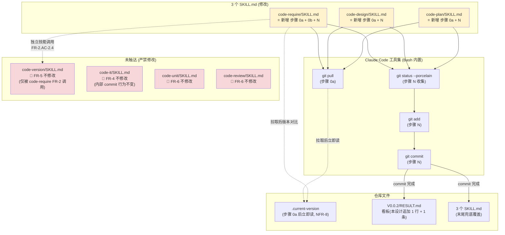

# 概要设计 — REQ-00005(优化 `/code-require` / `/code-design` / `/code-plan`,增加"首步拉取最新代码"与"末步兜底提交")

- 需求编码:REQ-00005
- 所属版本:V0.0.2
- 设计版本:v1
- 状态:已完成(首次设计)
- 责任人:wangmiao
- 创建:2026-06-04
- 最近更新:2026-06-04 16:00
- **上游**:`./assistants/V0.0.2/require/REQ-00005/RESULT.md`(v1,已锁定,6 FR / 8 NFR / ~32 AC / 13 边界场景)
- **遵循规范**:`./assistants/rules/` 下 **13 个文件**(详见 §2.5 与 `rule-compliance.md`)

---

## 1. 设计概述

本需求是 **"工作流管道(上游→中游→下游)前 3 步的工作流守门人增强"**,**不新增任何模块、不修改任何代码结构、不引入任何依赖**。设计核心是回答 4 个"如何做"的策略问题:

1. **拉取位置**:首步 0a 放步骤 0 之前 vs 嵌入步骤 0 → 选 A(D-1,NFR-8 强约束)
2. **`code-require` 专属的版本对齐**:0b 单独成步 vs 嵌入步骤 0 → 选 A(D-2,严格隔离专属逻辑)
3. **末尾兜底范围**:`git status --porcelain` 全量 vs 显式枚举 → 选 A(D-3,NFR-4 幂等)
4. **与 `code-it` 内部 commit 协同**:取代 / 并存 / 互斥 → 选 B(Q-4 锁定 B,D-5)

设计产出物:**修改 3 个 SKILL.md 的工作流步骤**(增量追加,**不改 frontmatter**)+ **追加 1 条看板记录**。所有变更严格遵循 `skill-conventions.md §规则 1`(frontmatter 不可变) + `marketplace-protocol.md §规则 1`(协议清单不动) + `dashboard-conventions.md §规则 1`(字段约定不扩展)。

## 2. 需求回顾(摘录上游)

- **关键 FR**:
  - FR-1:3 个技能新增"步骤 0a 拉取最新代码"(对应本设计 §7 模块 #1/2/3 插入 A)
  - FR-2:`code-require` 新增"步骤 0b 工作版本号对齐检查"(对应本设计 §7 模块 #1 插入 B,**仅 `code-require` 专属**)
  - FR-3:3 个技能新增"末尾兜底提交"(对应本设计 §7 模块 #1/2/3 插入 C)
  - FR-4:**不改** `code-it` 内部 commit(Q-4 锁定 B)
  - FR-5:**不改** `code-version`(被 `code-require` FR-2 调用,但隔离)
  - FR-6:**不改** `marketplace.json` / `plugin.json` / CLAUDE.md
- **关键 NFR**:NFR-1 零新增依赖 / NFR-2 增量修改 / NFR-3 硬中断 / NFR-4 幂等(空 commit 跳过) / NFR-5 错误透明(stderr 透传) / NFR-6 不污染 `commit-conventions.md`(留 follow-up) / NFR-7 与 `code-it` 边界严格 / NFR-8 拉取后状态作版本对比基准
- **关键 AC**:**~32 条**(FR-1 4 + FR-2 6 + FR-3 6 + FR-4 3 + FR-5 2 + FR-6 3 + 8 NFR 各 1)
- **关键边界**:13 个场景(E-1 ~ E-13),Q-2 锁定 A(中断 + 报错退出)
- **关键澄清**:Q-1 / Q-2 / Q-3 / Q-4 已锁定 A;Q-5 / Q-7 未采用(留 follow-up);Q-6 / Q-8 采纳默认

> 完整需求内容详见 `./assistants/V0.0.2/require/REQ-00005/RESULT.md`,本节不复制。

## 2.5 规范遵循(总账)

### 2.5.1 适用的规范文件

| 规范文件 | 类别 | 关键约束 | 本设计对应章节 |
| --- | --- | --- | --- |
| `skill-conventions.md` | 技能编写 | §规则 1 — SKILL.md frontmatter 含 `name`+`description`,`name` 与目录名一致;**不**改 frontmatter | §7(模块 #1/2/3 强约束不动 frontmatter) |
| `dashboard-conventions.md` | 看板与模板 | §规则 1 — 看板字段约定扩展需三同步;本需求不扩展字段 | §10 看板同步(常规追加) |
| `doc-conventions.md` | 文档编写 | §规则 1 — README 中英同次提交;本需求不写 README | (不触发) |
| `marketplace-protocol.md` | Marketplace 协议 | §规则 1 — `$schema` / `name` / `version` 必填;不引入未知字段 | (不触发,FR-6 严禁修改) |
| `encoding-conventions.md` | 编码格式 | §规则 1 — REQ/BUG 5 位纯数字;TASK 嵌套式 5+5 位 | §10 末尾 commit message 引用 |
| `migration-mapping.md` | 编码迁移 | §规则 1-4 — 不追溯 V0.0.0 EXISTING-NNN | (不触发) |
| `commit-conventions.md` | 提交与合并 | §规则 1 占位;NFR-6 显式不直接填充 | §10 末尾 commit 沿用 V0.0.1 实践 |
| `dependency-conventions.md` | 三方依赖 | §规则 1 占位 | §6 零新增依赖 |
| 其他 5 个占位规范 | 各类 | 占位 | (不触发) |

### 2.5.2 规范自检结论

- **完全合规**的章节:§7(模块 #1/2/3 全部增量修改,frontmatter 字节级保留)
- **经用户授权偏离**的章节:**无**
- **待澄清冲突**:**无**

### 2.5.3 用户授权的偏离

**无**。本设计 100% 合规。

### 2.5.4 待澄清的规范冲突

**无**。13 个规范文件全部"不冲突"(`commit-conventions.md` 占位 + NFR-6 显式延后)。

> 详细规范遵循记录见 `rule-compliance.md`(本目录)。

## 3. 设计目标与非目标

### 3.1 目标
- **G-1**:保证 3 个技能(`code-require` / `code-design` / `code-plan`)在长会话 / 多设备场景下,**工作上下文始终是新鲜的**(步骤 0a 拉取)
- **G-2**:`code-require` 在拉取后,**主动识别**"用户上下文版本"与"远端实际版本"的不一致,并以"询问 + 切换"模式消除歧义(步骤 0b)
- **G-3**:3 个技能在收尾时,**零遗漏**地把"过程文件 + 结果文件"提交入库(步骤 N 兜底提交)
- **G-4**:`code-it` 内部 commit 行为**完全不变**(Q-4 锁定 B,与本需求并存)
- **G-5**:**零新增**运行时三方依赖(NFR-1)

### 3.2 非目标
- **NG-1**:**不**修改任何技能的 YAML frontmatter(FR-6 + `skill-conventions.md §规则 1`)
- **NG-2**:**不**修改 `marketplace.json` / `plugin.json` / CLAUDE.md / README*(FR-6)
- **NG-3**:**不**修改 `code-it` / `code-version` / `code-unit` / `code-review` 4 个技能(FR-4 / FR-5)
- **NG-4**:**不**填充 `commit-conventions.md` 占位规则(NFR-6 留 follow-up)
- **NG-5**:**不**实现"自动 commit message 学习/优化"(留作 follow-up)
- **NG-6**:**不**支持批量 / 多需求并发处理(每个技能一次只处理一个需求)

## 4. 约束清单

### 4.1 硬约束(不可违反)

| 约束 | 来源 |
| --- | --- |
| 3 个 SKILL.md 的 YAML frontmatter 字节级保留 | `skill-conventions.md §规则 1` + FR-6 + NFR-2 |
| `marketplace.json` / `plugin.json` 任何字段不动 | FR-6 + `marketplace-protocol.md §规则 1.3` |
| `code-it` 内部 commit 行为不变 | FR-4 + Q-4 锁定 B |
| `code-version` 内部行为不变(只被调用) | FR-5 |
| 不填充 `commit-conventions.md` 规则 1 | NFR-6 留 follow-up |
| 末尾 commit 在无文件变更时必须跳过 | NFR-4 幂等 |
| `git pull` / `git commit` 失败时必须 stderr 透传 | NFR-5 错误透明 |
| `code-require` FR-2 不一致时必须硬中断 | NFR-3 硬中断(不进入步骤 1) |
| 版本对比必须基于"拉取后"状态 | NFR-8 |
| 末尾 commit message 沿用 V0.0.1 实践 `chore(<scope>): <subject>` | NFR-6 |
| 不引入任何运行时三方依赖 | NFR-1 |
| 不修改 `plugins/code-skills/CLAUDE.md` | FR-6.AC-6.2 |
| 不修改 `plugins/code-skills/README.md` / `README.en.md` | FR-6.AC-6.3 |

### 4.2 软约束(可权衡)

| 约束 | 来源 | 权衡 |
| --- | --- | --- |
| 末尾 commit 弹 3 选 1(确认 / 修改 / 取消) | Q-3 锁定 A | 多 1 次交互,但用户有最终决定权 |
| 步骤 0a 在步骤 0 之前(不嵌入) | D-1 选定 A | 多 1 步骤编号,但语义清晰(NFR-8 强约束) |
| 末尾兜底文件范围用 `git status --porcelain` 自动收集 | D-3 选定 A | 可能误纳"非本技能"文件 — 本仓库长会话单用户,实际不构成问题 |

## 5. 架构总览

### 5.1 组件图(Mermaid)



> 图例:🟡 黄色=本需求将修改;🔴 红色=本需求严禁修改

### 5.2 数据流图 — `code-require` 完整工作流(改后)

```
[启动 /code-require REQ-00005]
  ↓
[步骤 0a:探测 git] ────────┐
  ↓ (存在)                  │ (不存在 → E-12,中断退出)
[git pull] ─────────────┐
  ↓ (成功)               │ (失败 → E-2/E-3/E-4,中断退出,Q-2 锁定 A)
[Read .current-version]  │
  ↓ (拉取后版本)          │
[步骤 0b:对比版本] ──┐   │
  ↓ (一致)            │   │ (不一致 → FR-2.AC-2.3 询问)
[步骤 0:沿用]        │   │
  ↓                  │   │
[步骤 1-9A:原流程]   │   │
  ↓                  │   │
[步骤 N:兜底提交]    │   │
  ↓                  │   │
[退出]               │   │
                     │   │
[选 A:调 code-version 切版本,退出,提示重跑] ←──┘
[选 B:在本地版本继续,回到步骤 0 沿用] ←─┘
[选 C:取消退出] ←─────────────────────────┘
```

### 5.3 数据流图 — `code-design` / `code-plan` 完整工作流(改后)

```
[启动 /code-design REQ-00005]
  ↓
[步骤 0a:探测 git] ────────┐
  ↓ (存在)                  │ (不存在 → E-12)
[git pull] ─────────────┐
  ↓ (成功)               │ (失败 → E-2/E-3/E-4)
[Read .current-version]  │ (NFR-8 立即读)
  ↓                      │
[步骤 0:沿用(原版本上下文检测)] │
  ↓                      │
[步骤 1-?:原流程]       │
  ↓                      │
[步骤 N:兜底提交] ──┐   │
  ↓ (无变更)         │   │ (有变更)
[打印"无文件变更,跳过末尾提交"] │
  ↓                  │
[退出]               │
                     │
[git add + 预览 commit message]
  ↓
[AskUserQuestion: 确认/修改/取消]
  ↓ (确认)   (修改)       (取消)
[git commit] [重新预览]   [跳过,打印"已取消"]
  ↓ (成功)   (失败)
[打印 commit hash] [打印 stderr,提示手动处理]
  ↓
[退出]
```

### 5.4 关键控制流 — 末尾兜底提交流程(FR-3 细化)

```
[收集 git status --porcelain 输出]
  ↓ (空)
[跳过 commit,打印 "无文件变更"]   ←── NFR-4 幂等 / AC-3.5
  ↓
[退出]
  ↓ (非空)
[git add <所有文件>]              ←── FR-3.AC-3.2
  ↓
[生成 commit message 预览]         ←── FR-3.AC-3.3 / NFR-6
  ↓
[AskUserQuestion: 确认/修改/取消]   ←── Q-3 锁定 A / FR-3.AC-3.4
  ↓ (确认)     (修改)         (取消)
[git commit] [重新预览]     [不 commit,退出]  ←── E-9
  ↓ (成功)  (失败)
[打印 commit hash] [打印 stderr, 不重试]  ←── E-10
  ↓
[退出]
```

## 6. 功能架构

### 6.1 功能域 1:首步拉取守卫(FR-1,3 技能通用)
- **目的**:保证工作上下文的"新鲜性"
- **涉及模块**:3 个 SKILL.md(插入 A)
- **协作方式**:`git pull` 是单步命令,无模块间协作
- **入口**:`code-require` / `code-design` / `code-plan` 启动后,步骤 0 之前
- **出口**:成功 → 进入"步骤 0" / 失败 → 中断 + 报错(E-2 / E-3 / E-4)

### 6.2 功能域 2:`code-require` 版本对齐守卫(FR-2,仅 `code-require` 专属)
- **目的**:识别并解决"用户意图版本"与"远端实际版本"的不一致
- **涉及模块**:`code-require/SKILL.md`(插入 B)+ **`code-version` 被独立调用**(FR-5)
- **协作方式**:读取"拉取后 `.current-version`"(由功能域 1 提供)→ 对比 → 询问 → 必要时调 `code-version`
- **入口**:`code-require` 步骤 0a 之后,步骤 0 之前
- **出口**:一致 → 进入"步骤 0" / 不一致且选 A → 调 `code-version` 后退出 / 不一致且选 B → 在本地版本继续 / 不一致且选 C → 退出

### 6.3 功能域 3:末尾兜底提交(FR-3,3 技能通用)
- **目的**:零遗漏地把"过程文件 + 结果文件"提交入库
- **涉及模块**:3 个 SKILL.md(插入 C)+ V0.0.2/RESULT.md 看板(同步)
- **协作方式**:`git status --porcelain` 收集 → `git add` → 生成预览 → `AskUserQuestion` → `git commit`
- **入口**:3 个技能的原"最后一步"之后
- **出口**:无变更 → 跳过 / 有变更且确认 → commit / 有变更但取消 → 跳过 commit / commit 失败 → 报错(不重试)

## 7. 模块划分

### 7.1 模块总览

| 模块名 | 路径 | 状态 | 职责 | 对外契约(工作流步骤) |
| --- | --- | --- | --- | --- |
| `code-require` 技能 | `plugins/code-skills/skills/code-require/SKILL.md` | **修改** | 需求分析(版本感知) | **新增** 步骤 0a + 0b + N |
| `code-design` 技能 | `plugins/code-skills/skills/code-design/SKILL.md` | **修改** | 概要设计(版本感知) | **新增** 步骤 0a + N |
| `code-plan` 技能 | `plugins/code-skills/skills/code-plan/SKILL.md` | **修改** | 详细设计 & 计划(版本感知) | **新增** 步骤 0a + N |
| 版本看板 | `assistants/V0.0.2/RESULT.md` | **追加** | 本版本"概要设计清单" + "变更记录" | (本设计产出) |

### 7.2 既有模块变更点 — `code-require`

> 详细见 `module-breakdown.md` §2。

- **变更点 A**:在"步骤 0 — 版本上下文检测"**之前**,新增"步骤 0a — 拉取最新代码"
  - 内容:`git --version` 探测 → `git pull` → 失败 3 种分类提示(E-2/E-3/E-4)→ 成功 → **立即** `Read .current-version`(NFR-8)
- **变更点 B**:在"步骤 0a"**之后**,新增"步骤 0b — 工作版本号对齐检查"(FR-2 专属)
  - 内容:对比"拉取后版本"与"用户意图版本" → 一致 → 进入步骤 0 / 不一致 → 硬中断(NFR-3) + `AskUserQuestion` 3 选 1(FR-2.AC-2.3) → 选 A 调 `code-version` 后退出 / 选 B 继续 / 选 C 取消
- **变更点 C**:在原"步骤 10A"**之后**(作为最后一步),新增"步骤 N — 末尾兜底提交"
  - 内容:`git status --porcelain` 收集 → 空跳过(AC-3.5)→ `git add` → 生成预览(NFR-6)→ `AskUserQuestion` 3 选 1(Q-3 锁定 A)→ `git commit` → 成功打印 hash / 失败打印 stderr 不重试(E-10)

### 7.3 既有模块变更点 — `code-design`

> 详细见 `module-breakdown.md` §3。

- **变更点 A**:同 `code-require` 变更点 A(**不**含 0b,因为 FR-2 显式仅 `code-require` 专属)
- **变更点 B**:同 `code-require` 变更点 C,commit message 模板差异:`chore(code-design): <需求编码> <设计标题>`(见 §10.2)

### 7.4 既有模块变更点 — `code-plan`

> 详细见 `module-breakdown.md` §4。

- **变更点 A**:同 `code-design` 变更点 A
- **变更点 B**:同 `code-design` 变更点 B,commit message 模板差异:`chore(code-plan): <需求编码> <计划标题>`(见 §10.2)
- **特殊**:对 `code-plan` 的 BUG 路径(步骤 19-28)同样适用步骤 N(Q-4 锁定 B 的精神,末尾兜底与"任务级 commit"并存)

### 7.5 修改既有模块的强约束(全部 3 个)

| 不动部分 | 依据 |
| --- | --- |
| YAML frontmatter(2 行) | `skill-conventions.md §规则 1` + FR-6 |
| 既有"步骤 0 — 版本上下文检测"全文 | NFR-2 增量修改 |
| 既有"步骤 1-N 原步骤"全文 | NFR-2 |
| 既有"过程文档格式"小节 | NFR-2 |
| 既有"衔接"小节 | NFR-2 |
| 既有"不要做的事"小节 | NFR-2 |
| **"步骤 0b"** | FR-2 显式仅 `code-require` 专属;**`code-design` / `code-plan` 跳过** |

### 7.6 新增/复用/废弃模块
- **新增模块**:0
- **修改模块**:3(`code-require` / `code-design` / `code-plan`)
- **复用既有模块**:0
- **废弃模块**:0

## 8. 接口概要

> 本仓库**无运行时 API**。"接口" = SKILL.md 中描述的工作流步骤,本节给出新增工作流步骤的"契约"。

### 8.1 新增工作流步骤(3 个技能 × 步骤 0a + 步骤 N;`code-require` 额外 × 步骤 0b)

#### 步骤 0a — 拉取最新代码(FR-1,3 技能通用)
- **形式**:SKILL.md 工作流步骤描述(自然语言)
- **签名**:N/A(非 API)
- **前置条件**:用户在 Claude Code 中启动 `code-require` / `code-design` / `code-plan`
- **后置条件**:
  - 成功 → 工作树与远端同步(包含 no-op)+ `.current-version` 已被读
  - 失败 → 中断 + stderr 透传 + 提示用户
- **失败处理**:3 种分类提示(E-2 冲突 / E-3 网络 / E-4 凭据)
- **鉴权**:N/A
- **版本策略**:N/A(本仓库语义版本为 V0.0.2,但工作流步骤**不**分版本)

#### 步骤 0b — 工作版本号对齐检查(FR-2,仅 `code-require`)
- **形式**:SKILL.md 工作流步骤描述
- **前置条件**:步骤 0a 成功
- **后置条件**:
  - 一致 → 进入步骤 0
  - 不一致 + 选 A → 调 `code-version <拉取后版本>` + 提示"已切到 <版本>,请重跑 `code-require`"
  - 不一致 + 选 B → 在本地版本继续(进入步骤 0)
  - 不一致 + 选 C → 退出,无文件变更
- **失败处理**:无(中断 + 询问模式不产生异常路径)
- **特殊**:调 `code-version` 是"独立技能调用"(FR-5.AC-5.2 锁定),不在同一上下文

#### 步骤 N — 末尾兜底提交(FR-3,3 技能通用)
- **形式**:SKILL.md 工作流步骤描述
- **前置条件**:原工作流最后一步完成
- **后置条件**:
  - 无变更 → 跳过 commit + 打印"无文件变更,跳过末尾提交"
  - 有变更 + 确认 → commit 完成
  - 有变更 + 取消 → 跳过 commit + 打印"已取消提交"
  - commit 失败 → 打印 stderr + 提示手动处理(不重试)
- **错误处理**:E-8 无变更 / E-9 取消 / E-10 commit 失败

### 8.2 扩展既有步骤:无
- 本需求**不**扩展任何既有步骤的对外行为,只在工作流序列中**新增**步骤编号

### 8.3 修改既有步骤:无
- 本需求**不**修改任何既有步骤的语义(步骤 0 / 1 / ... 内容不变)

### 8.4 调用外部接口

| 外部命令/工具 | 用途 | 调用方式 | 错误处理 |
| --- | --- | --- | --- |
| `git --version` | 探测 git 可用性(E-12) | Bash 工具 | 失败 → 中断 + 提示 |
| `git pull` | 拉取最新代码(步骤 0a) | Bash 工具 | 退出码 ≠ 0 → 中断 + 分类提示(E-2/E-3/E-4) |
| `git status --porcelain` | 收集末尾文件(步骤 N) | Bash 工具 | 空 → 跳过;非空 → 继续 |
| `git add <files>` | 暂存文件(步骤 N) | Bash 工具 | 失败 → 透传 stderr |
| `git commit -m "<message>"` | 提交(步骤 N) | Bash 工具 | 失败 → 透传 stderr(不重试) |
| `code-version <version>` | 切换版本(FR-2.AC-2.4 选 A) | Skill 工具独立调用 | 切换成功 → 提示重跑;失败 → 提示重试 |
| `AskUserQuestion` | 3 选 1 询问(FR-2 / FR-3) | Claude Code 工具 | 用户必须答,无超时(E-11) |

## 9. 数据结构

> 本仓库**无运行时数据模型**。本节给出新增工作流步骤涉及的"文件级数据"。

### 9.1 新增实体(无)
- 本需求不新增任何实体

### 9.2 修改既有实体(无)
- 本需求不修改任何实体

### 9.3 文件级数据载体(本需求涉及)

| 路径 | 角色 | 写入时机 | 数据格式 |
| --- | --- | --- | --- |
| `./assistants/.current-version` | 激活版本标记(被读取) | 步骤 0a 完成后**立即** `Read`(NFR-8) | 单行字符串(如 `V0.0.2`) |
| `<git-managed>/.current-version` | 拉取后版本(被覆盖) | `git pull` 过程中(由 git 自动) | 同上 |
| `./assistants/V0.0.2/RESULT.md` | 看板(被追加) | 步骤 N 末尾兜底提交后 | Markdown 表格(本设计 §10 同步清单) |
| `plugins/code-skills/skills/code-{require,design,plan}/SKILL.md` | 3 个 SKILL.md(被修改) | `code-it` 阶段 | Markdown(本设计 §7 变更点) |

### 9.4 数据生命周期

| 文件 | 留存期限 | 清理策略 |
| --- | --- | --- |
| `.current-version` | 永久(跨版本) | 不清理(单行,字节级开销可忽略) |
| `V0.0.2/RESULT.md` | 永久(版本快照) | 历史快照,不被清理 |
| 3 个 SKILL.md | 永久(技能入口) | 不清理(`module-conventions.md`(DEPRECATED)/`directory-conventions.md`(占位)约束) |
| 末尾兜底 commit 的"过程文件" | 永久(已 commit) | 同上 |

## 10. 三方依赖

### 10.1 复用既有依赖
- **运行时**:0(本仓库无应用代码)
- **构建/测试/Lint**:0
- **Claude Code 协议**:2 隐式(`marketplace.json` / `plugin.json` 的 `$schema`)
- **外部命令**:`git`(Bash 工具内置,无新增)

### 10.2 新增依赖

| 依赖 | 版本 | 用途 | 必要性 | 许可 | 风险评估 |
| --- | --- | --- | --- | --- | --- |
| (无) | — | — | — | — | — |

**本需求零新增依赖**(NFR-1 强约束)。

### 10.3 末尾 commit message 模板(FR-3.AC-3.3 / NFR-6)

| 技能 | scope | 模板 |
| --- | --- | --- |
| `code-require` | `code-require` | `chore(code-require): REQ-NNNNN <需求标题>` + 空行 + `需求分析完成:<N> FR / <M> NFR / <K> AC` + 空行 + `过程文件 3 + 结果文件 1 = 4 文件待提交` |
| `code-design` | `code-design` | `chore(code-design): REQ-NNNNN <设计标题>` + 空行 + `概要设计完成:<关键决策数> 项决策,<不变量数> 条不变量` + 空行 + `过程文件 N + 结果文件 1` |
| `code-plan` | `code-plan` | `chore(code-plan): REQ-NNNNN <计划标题>` + 空行 + `详细设计与编码计划完成:<任务数> 个任务` + 空行 + `过程文件 N + 结果文件 2(PLAN.md + RESULT.md)` |

> 格式严格遵循 V0.0.1 实践 `chore(<scope>): <subject>`;`<subject>` 中 `REQ-NNNNN` 严格符合 `encoding-conventions.md §规则 1`(5 位纯数字)。
> 详细依赖评估见 `dependencies.md`。

## 11. 集成点

本设计与既有系统/模块的集成:

| 集成点 | 详情 |
| --- | --- |
| **`.current-version` 读取** | 步骤 0a 完成后**立即** `Read`(NFR-8 强约束);`code-require` 在步骤 0b 中作对比基准;`code-design` / `code-plan` 在步骤 0 中沿用 |
| **`code-version` 调用** | FR-2.AC-2.4 选 A 时调;以"独立技能调用"形式(FR-5.AC-5.2);`code-version` 自身切换 `.current-version` 后,`code-require` 退出 |
| **`code-it` 内部 commit** | 完全独立,本需求**不**感知(FR-4 + Q-4 锁定 B);`code-it` 已 commit 的文件**不会**进入 `git status --porcelain` 输出 |
| **版本看板同步** | 3 个技能在步骤 N commit 后,各自负责的"概要设计清单" / "详细设计与任务计划汇总" / "需求清单" 区段追加;`code-require` 末尾兜底还同步"变更记录" |
| **README / CLAUDE.md 集成** | **不**触达(FR-6 + `doc-conventions.md`);由后续 `code-rule` 沉淀 |

## 12. 风险与缓解

| 风险 | 可能性 | 影响 | 缓解措施 | 回退方案 |
| --- | --- | --- | --- | --- |
| `git pull` 自动合并产生"未预期冲突" | 中 | 中 | Q-2 锁定 A(中断 + 报错退出);E-2 提示 | 用户手动解冲突后重跑 |
| `code-require` 拉取后版本不一致,询问时用户错过 | 低 | 低 | `AskUserQuestion` 必须答,无超时(E-11) | 用户主动取消或重选 |
| 末尾兜底误纳"非本技能产生"的文件 | 低 | 低 | 本仓库长会话单用户,基本无并发 | 用户取消 commit,手动 `git reset` |
| `git commit` pre-commit hook 失败 | 中 | 中 | E-10 显式不重试,stderr 透传(NFR-5) | 用户手动处理 |
| 3 技能"步骤 0a"实现不一致 | 中 | 中 | 需求文档 §7.1 / §7.2 流程图已统一;`code-plan` 阶段强校验对称性 | 派生"代码评审"任务,统一实现 |
| 末尾 commit 误把 `.current-version` 变更纳入 | 中 | 低 | `.current-version` 在 `code-require` FR-2 选 A 时**也会**被 `code-version` 切换 — 由 `code-version` 自己的 commit 处理(本设计不感知) | N/A |
| 用户连续多次 commit,产生"无变更"步骤 | 低 | 低 | NFR-4 幂等保护:空 `--porcelain` 自动跳过 | N/A |
| `code-version` 调用失败 | 低 | 中 | FR-5.AC-5.2 独立调用隔离,不影响 `code-require` 整体;提示用户重试 | 用户手动切版本 |
| CLAUDE.md 长期不沉淀"AI 工作约定"导致新协作者不知道要先 `git pull` | 中 | 中 | Q-10 留 follow-up,由 `code-rule` 沉淀(触发 `dashboard-conventions §规则 1` 三方同步) | N/A |
| `commit-conventions.md` 长期不填充,导致后续需求各自硬编码 commit 格式 | 中 | 低 | NFR-6 显式不直接填充,Q-9 留 follow-up,由 `code-rule` 沉淀 | N/A |

## 13. 备选方案(选填,鼓励保留)

| 决策 | 备选 | 否决理由 |
| --- | --- | --- |
| **D-1** 步骤 0a 位置 | B:嵌入步骤 0 | 把"拉取"塞进"版本上下文检测",语义混杂;`code-design` / `code-plan` 步骤 0 也会被迫含"拉取" |
| **D-2** `code-require` 0a/0b 协同 | B:0a + 0(内含版本对齐) | 把"专属逻辑"塞进"公共逻辑",`code-design` / `code-plan` 步骤 0 也会被迫含"版本对齐" — 违反 FR-2 |
| **D-3** 末尾兜底文件范围 | B:技能显式枚举 | 易遗漏(中间派生文件),维护成本高 |
| **D-4** commit message 生成 | B:不询问直接 commit / C:`git add` 后留空 | 用户失去控制 / 用户易忘 |
| **D-5** 与 `code-it` 内部 commit 协同 | A:去掉 `code-it` 内部 commit | 违反 FR-4(不改 `code-it`)+ Q-4 锁定 B |
| **D-6** `code-version` 调用形式 | B:内联调用 | 破坏技能边界,违反 FR-5 |
| **D-7** 拉取失败区分 | B:统一提示 | NFR-5 stderr 透传 + E-2/E-3/E-4 分类更友好 |
| **D-8** commit message 是否支持修改 | B:仅"确认 / 取消" | 用户无法调整语义 |
| **D-9** 版本对比基准 | B:拉取前状态 | 与"用户实际感知的工作版本号"脱节,违反 NFR-8 |
| **D-10** `git` 不存在处理 | B:不探测 | 错误信息不友好 |

## 14. 关联概要设计

| 关联设计编码 | 关联点 | 对本设计的影响 | 链接 |
| --- | --- | --- | --- |
| REQ-00003(V0.0.1) | 规范沉淀责任(`code-rule` 唯一写 `rules/`) | 本需求**不**触达 `code-rule` 范围;派生"用 `code-rule` 沉淀"为 follow-up(Q-9/Q-10/Q-11) | [RESULT](../../V0.0.1/design/REQ-00003/RESULT.md) |
| REQ-00002(V0.0.1) | 编码权威源(`encoding-conventions.md`) | 末尾 commit message 中 `REQ-NNNNN` 引用严格 5 位纯数字 | [RESULT](../../V0.0.1/design/REQ-00002/RESULT.md) |
| REQ-00001(V0.0.1) | V0.0.1 commit 实践(`chore(<scope>): <subject>`) | 本设计 §10.3 commit 模板直接沿用 | [RESULT](../../V0.0.1/design/REQ-00001/RESULT.md) |

> 本版本(V0.0.2)为首个 design,无同版本其他 design 关联。
> 详细关联分析见 `related-designs.md`(本目录)。

## 15. 待澄清 / 未决项

| 编号 | 问题 | 影响范围 | 阻塞方 | 期望回复时间 |
| --- | --- | --- | --- | --- |
| Q-9(本轮新增) | 本需求完成后,是否派生"用 `code-rule` 沉淀 `commit-conventions.md` 规则 1"任务 | §10.3 commit 模板(后续应升级为引用权威源) | 用户 | `code-review` 阶段 |
| Q-10(本轮新增) | 本需求完成后,是否派生"用 `code-rule` 在 `plugins/code-skills/CLAUDE.md` 'AI 工作约定' 小节追加 '先 git pull' 等指引"任务 | §1 / §5.1 架构图(应补一条"AI 工作约定"链接) | 用户 | `code-review` 阶段 |
| Q-11(本轮新增) | 本需求完成后,是否派生"用 `code-rule` 同步中英 README 的 '工作流' 小节"任务 | §1 / §11 集成点(应明确 README 同步责任) | 用户 | `code-review` 阶段 |

> 这 3 项**不阻塞** `code-plan` 阶段;**不阻塞** 本设计的"已完成"状态。

## 16. 变更记录

| 时间 | 版本 | 变更类型 | 变更摘要 | 变更人 |
| --- | --- | --- | --- | --- |
| 2026-06-04 16:00 | v1 | 设计新增 | 完成首次概要设计:3 个 SKILL.md 增量追加(步骤 0a + N;`code-require` 额外 + 0b),4 项关键设计决策(D-1/D-2/D-3/D-5),10 个候选方案与选定理由,13 条关键不变量(全部保留 frontmatter / marketplace.json / plugin.json / CLAUDE.md / README / 4 个未触达技能),规范遵循 100% 合规(13 个规范文件 0 冲突 0 偏离 0 授权),3 项 follow-up(Q-9/Q-10/Q-11 留 `code-review` 派生);详细记录见 `design-notes.md` / `module-breakdown.md` / `dependencies.md` / `related-designs.md` / `rule-compliance.md` / `clarifications.md` | wangmiao |

### 16.1 同步版本看板清单(本设计同步 V0.0.2/RESULT.md)

| 区段 | 位置 | 追加内容 |
| --- | --- | --- |
| "概要设计清单" | 第 87-95 行 | 追加 1 行:\| REQ-00005 \| 优化 3 个技能,首步拉取+末步兜底提交 \| 已完成(概要设计) \| 2026-06-04 12:33 \| 2026-06-04 16:00 \| [RESULT.md](design/REQ-00005/RESULT.md) \| |
| "变更记录" | 第 173-189 行 | 追加 1 条:`2026-06-04 16:00  设计新增  REQ-00005 概要设计完成  REQ-00005` |
| "索引:本版本所有文件" | 第 206 行附近 | 追加链接:`REQ-00005 → [design/REQ-00005/RESULT.md](design/REQ-00005/RESULT.md)` |
| "索引:本版本所有文件 - 过程文档(本需求)" | 第 263 行后 | 追加 1 段:链接 7 个过程文档(materials-index / design-notes / module-breakdown / dependencies / related-designs / rule-compliance / clarifications) |
| "文档头-最近更新" | 第 10 行 | 改为 `2026-06-04 16:00` |
| "概要设计清单-统计" | 第 95 行 | 改为 `1 / 已完成 1 / 进行中 0` |

> 看板"统计"行同步更新:本设计为首个概要设计,需将"已完成"从 0 改为 1。

### 16.2 与下游的衔接

- **下游**:`code-plan REQ-00005` 消费本设计 §7 / §8 / §10.3 拆分任务
- **下游预期任务拆分**(供 `code-plan` 参考,**非**最终):

| 任务编码 | 标题 | 主要修改文件 |
| --- | --- | --- |
| `TASK-REQ-00005-00001` | `code-require/SKILL.md` 增量追加 步骤 0a + 0b + N | `plugins/code-skills/skills/code-require/SKILL.md` |
| `TASK-REQ-00005-00002` | `code-design/SKILL.md` 增量追加 步骤 0a + N | `plugins/code-skills/skills/code-design/SKILL.md` |
| `TASK-REQ-00005-00003` | `code-plan/SKILL.md` 增量追加 步骤 0a + N | `plugins/code-skills/skills/code-plan/SKILL.md` |
| `TASK-REQ-00005-00004` | 同步 V0.0.2/RESULT.md 看板("概要设计清单" + "变更记录" + "索引") | `assistants/V0.0.2/RESULT.md` |

> 任务编号为预想,实际以 `code-plan` 阶段拆分为准。
> 注意:`encoding-conventions.md §规则 1` 在 V0.0.1 REQ-00002 已实施完成,本需求任务编号采用 `TASK-REQ-00005-NNNNN` 5+5 位格式。
