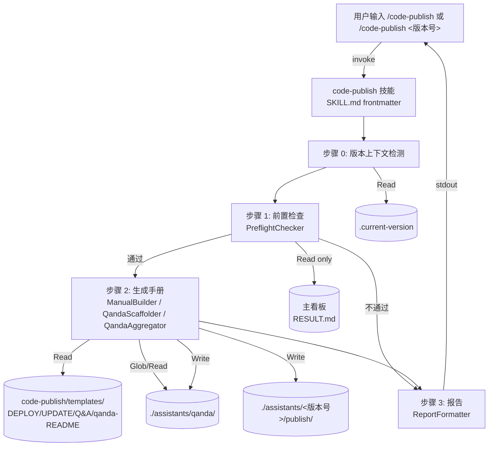

# REQ-00006 — 概要设计:`/code-publish` 发布部署技能

- 需求编码:`REQ-00006`
- 所属版本:`V0.0.2`
- 上游:`./assistants/V0.0.2/require/REQ-00006/RESULT.md` (v1,已锁定)
- 遵循规范:`./assistants/rules/` 下 4 个有效约束 + 6 个占位 + 3 个不相关(共 13 个文件;详见 §2.5)
- 状态:已完成(首次概要设计)
- 责任人:wangmiao
- 创建:2026-06-04
- 最近更新:2026-06-04 16:48
- 当前版本:v1

---

## 1. 设计概述

新增第 11 个 `code-*` 技能 `code-publish`(用户口语化称作"第 9 个 code-* 技能"),专门覆盖"开发完成 → 部署上线"环节。技能由 4 步组成:**(0) 版本上下文 → (1) 前置检查(看板 3 区段全检查最严) → (2) 生成 3 份手册到 `<版本号>/publish/` → (3) 报告**。手册分别是 `DEPLOY.md`(全新部署,始终生成)、`UPDATE.md`(从上一版升级,基线跳过)、`Q&A.md`(从 `assistants/qanda/` 聚合;空时为占位)。本需求**顺带**创建项目级 `assistants/qanda/` 骨架。3 份手册全部为**通用骨架 + placeholder + 最常见部署方式默认示例**,用户必须手动补全才能执行。

**范围**:
- **新增**:`plugins/code-skills/skills/code-publish/`(1 个 SKILL.md + 5 份模板,共 6 个文件)+ `assistants/qanda/` + `assistants/qanda/README.md`
- **修改**:0 个(严格遵循 FR-8.AC-8.1 ~ AC-8.4)
- **可选附加**:`plugins/code-skills/README.md` + `README.en.md`"主要能力"段同次追加一行(由 `code-plan` 决定是否拆为独立任务)

---

## 2. 需求回顾

引用上游 `./assistants/V0.0.2/require/REQ-00006/RESULT.md`(v1):

### 2.1 关键 FR 列表(对应到本设计的模块)
| FR | 描述 | 对应模块 |
| --- | --- | --- |
| FR-1 | 发布前置检查(全检查最严) | PreflightChecker(§7.2.2) |
| FR-2 | 生成 3 份手册(基线跳过 UPDATE) | ManualBuilder(§7.2.4) |
| FR-3 | DEPLOY.md 模板(通用骨架) | `templates/DEPLOY.md`(§7.2.8) |
| FR-4 | UPDATE.md 模板(从上一版升级) | `templates/UPDATE.md`(§7.2.9) |
| FR-5 | Q&A.md 模板(从 qanda/ 抽取) | QandaAggregator(§7.2.6)+ `templates/Q&A.md`(§7.2.10) |
| FR-6 | 创建 `assistants/qanda/` 骨架 | QandaScaffolder(§7.2.5)+ `templates/qanda-README.md`(§7.2.11) |
| FR-7 | 错误处理与边界 | 各模块的异常路径(§6.3) |
| FR-8 | 不修改其他 8 技能 / marketplace / plugin | §7.4 修改既有模块(0 个) |
| FR-9 | 报告与建议 | ReportFormatter(§7.2.7) |

### 2.2 关键 NFR
| NFR | 描述 | 设计响应 |
| --- | --- | --- |
| NFR-1 | 零新增依赖 | §10.2 = 空 |
| NFR-2 | 纯只读检查 | PreflightChecker 只用 `Read`,不用 `Edit`/`Write` 到看板 |
| NFR-3 | 不自动 commit | 工作流不含 `git commit`;由用户手动 |
| NFR-4 | 不参与 REQ-00005 改写 | SKILL.md 不含"首步拉取"与"末步提交"段 |
| NFR-5 | 通用性优先 | 3 份手册 = 通用骨架 + placeholder + 默认示例 |
| NFR-6 | 幂等覆盖 | D-7 始终覆盖 + 报告 |
| NFR-7 | 基线识别规则 1 | BaselineDetector 用字典序最小 |
| NFR-8 | 与 dashboard 数据源一致 | PreflightChecker 与 dashboard 共用解析锚点 |
| NFR-9 | 可读性优先 | 手册全部 Markdown(标题层级 + 代码块) |

### 2.3 关键 AC(影响设计走向的)
- AC-1.1 ~ AC-1.5:看板 3 区段解析规则(影响 §7.2.2 PreflightChecker 实现)
- AC-2.1 ~ AC-2.5:`publish/` 目录管理(影响 §7.2.4 ManualBuilder 与 §6.3 异常路径)
- AC-5.1 ~ AC-5.4:Q&A.md 聚合规则(影响 §7.2.6 QandaAggregator)
- AC-6.1 ~ AC-6.3:`qanda/` 骨架创建(影响 §7.2.5 QandaScaffolder)
- AC-7.1 ~ AC-7.4:错误处理(影响 §6.3 / §12 风险与缓解)

### 2.4 需求中的"待澄清"项(可能影响设计)
- Q-10 派生任务预警:本设计已**全部接受**,在 §15 明示等待 `code-review` 决策

---

## 2.5 规范遵循

本节是规范约束的**总账**,后续每节涉及规范时只引用本节条目,不再重复描述。

### 2.5.1 适用的规范文件

| 规范文件 | 类别 | 关键约束 | 本设计对应章节 |
| --- | --- | --- | --- |
| `./assistants/rules/dashboard-conventions.md` | 看板与版本工作空间 | §规则 1:字段约定扩展需 3 处同步 | §7.4(0 触发) |
| `./assistants/rules/doc-conventions.md` | 文档编写 | §规则 1:README 多语言对仗;§规则 2:README 持续维护 | §7.4(若追加 README 行需同次提交) |
| `./assistants/rules/module-conventions.md` | 模块规划(DEPRECATED 但沿用) | §规则 1:templates/ / checklists/ / guidelines/ 固定子目录 | §7(模板全在 `templates/`) |
| `./assistants/rules/skill-conventions.md` | 技能编写 | §规则 1:SKILL.md frontmatter 必含 name + description | §7.2.1 |

**占位规范(6 个,不影响)**:`coding-style.md` / `commit-conventions.md` / `dependency-conventions.md` / `framework-conventions.md` / `naming-conventions.md` / `directory-conventions.md`

**不相关规范(3 个)**:`encoding-conventions.md`(本设计不产生新编码)/ `marketplace-protocol.md`(本设计不修改 marketplace.json)/ `migration-mapping.md`(本设计无追溯)

### 2.5.2 规范自检结论
- **完全合规**的章节:§5 / §6 / §7 / §8 / §9 / §10 / §11
- **经用户授权偏离**的章节:**0**(详见 §2.5.3)
- **待澄清冲突**:**0**(详见 §2.5.4)

### 2.5.3 用户授权的偏离
- **无**

### 2.5.4 待澄清的规范冲突
- **无**

---

## 3. 设计目标与非目标

### 3.1 目标
- **G-1 自动化前置检查**:`code-publish` 一次调用即可输出"是否可发布 + 未完成项明细"
- **G-2 一键产出 3 份手册**:目标版本通过检查后,自动写入 `publish/` 下 3 份手册骨架(基线版本 2 份)
- **G-3 严格保持只读 + 不影响其他技能**:符合 NFR-2 / NFR-4 / FR-8
- **G-4 与 `code-dashboard` 数据源强一致**:NFR-8
- **G-5 通用脚手架**:NFR-5(本仓库不是"被发布软件",`code-publish` 是给"用本仓库开发的项目"用的)
- **G-6 幂等可重跑**:NFR-6

### 3.2 非目标
- **非目标 1**:实际"执行"部署(本技能只生成"步骤手册",不执行 SSH/Docker/SQL 等命令)
- **非目标 2**:智能填充手册细节(用户必须手动补全 placeholder;Q-6 默认)
- **非目标 3**:跨多版本归档发布(只对 `<版本号>` 单版本工作)
- **非目标 4**:自动 commit(NFR-3 + Q-9 默认)
- **非目标 5**:`--force` 强制发布(D-5 决策:v1 不实现,留作 v2)
- **非目标 6**:UPDATE.md 的多源版本(只支持"从字典序前一版本升级",不支持任意源版本)
- **非目标 7**:发布规范 `publish-conventions.md`(留作 follow-up,由 `code-rule` 沉淀)

---

## 4. 约束清单

### 4.1 硬约束(不可违反)
- **H-1 Claude Code 协议**:技能必须以 SKILL.md + YAML frontmatter 启动(`skill-conventions.md §规则 1`)
- **H-2 工作目录**:`./assistants/<版本号>/publish/` 与 `./assistants/qanda/` 路径不可变更
- **H-3 看板解析锚点**:`^## 需求清单` / `^## 任务清单` / `^## 缺陷清单`(已在 V0.0.1 稳定)
- **H-4 状态枚举值**:沿用 V0.0.1 看板(`已完成`/`已运行-通过`/`不适用`/`已修复` 等),不新增枚举
- **H-5 不修改其他 8/10 技能 / marketplace / plugin / rules**:FR-8 + NFR
- **H-6 零新增依赖**:NFR-1

### 4.2 软约束(可权衡)
- **S-1 字典序作为基线判定**:当前 V0.0.0/V0.0.1/V0.0.2 字典序与 SemVer 一致;若未来出现 `2026-Q2` 等非 SemVer 版本号,可能误判(低风险,见 §12 R-1)
- **S-2 手册模板的"默认示例"详细度**:取"最常见部署方式"作为合理默认(NFR-5)
- **S-3 报告格式**:纯文本 + 少量图标(D-8;NFR-9)

---

## 5. 架构总览

### 5.1 组件图(Mermaid)



### 5.2 数据流图(主路径:S-1 可发布版本)

```
用户                .current-version            主看板             模板                 publish/        qanda/
 |                       |                        |                  |                    |              |
 | /code-publish         |                        |                  |                    |              |
 |--------------------->Step0                     |                  |                    |              |
 |                       |  Read                  |                  |                    |              |
 |                       |---------> "V0.0.2"     |                  |                    |              |
 |                       |  ←---------------------                   |                    |              |
 |                       Step1                                       |                    |              |
 |                       |  Read                                     |                    |              |
 |                       |------------------------>                  |                    |              |
 |                       |  ←------------------(3 区段内容)                                |              |
 |                       |  解析 + 判定:通过                                                |              |
 |                       Step2                                       |                    |              |
 |                       |  BaselineDetector: Glob ./assistants/V*/                       |              |
 |                       |  → "V0.0.2 ≠ 最小(V0.0.0)" → 非基线 → 生成 UPDATE                |              |
 |                       |  Read templates/DEPLOY.md ------------->  |                    |              |
 |                       |  Read templates/UPDATE.md -------------> |                    |              |
 |                       |  Read templates/Q&A.md  ---------------> |                    |              |
 |                       |  Write publish/DEPLOY.md --------------------------------> ✓   |              |
 |                       |  Write publish/UPDATE.md --------------------------------> ✓   |              |
 |                       |  QandaScaffolder: ls ./assistants/qanda/                       |              |
 |                       |    存在 → 跳过                                                  |              |
 |                       |  QandaAggregator: Glob ./assistants/qanda/*.md ---------> ✓   ⟶ 0 个非 README |
 |                       |    → 用占位模板                                                  |              |
 |                       |  Write publish/Q&A.md ----------------------------------> ✓   |              |
 |                       Step3                                                            |              |
 |  ✓ 3 份手册已生成报告 ←-                                                                   |              |
 ←-----------------------                                                                  |              |
```

### 5.3 控制流图(分支)

```
[启动 /code-publish [<版本号>]]
  ↓
[Step 0: 版本上下文检测]
  ├─ .current-version 不存在 ∧ 无参数 → [E-5 提示 code-version] → 退出
  ├─ <版本号>/RESULT.md 不存在 → [E-2 看板不完整] → 退出
  └─ 成功 ↓
[Step 1: 前置检查]
  ├─ 看板缺区段 → [E-2 退化:全未解决] → 不通过报告 → 退出
  ├─ 累积未完成项非空 → [S-2 不通过] → 报告 + 退出
  └─ 累积未完成项空 → [通过] ↓
[Step 2.0: BaselineDetector]
  ├─ <版本号> == 字典序最小 → [基线] → 跳过 UPDATE
  └─ 非基线 → 生成 UPDATE
  ↓
[Step 2: ManualBuilder]
  ├─ mkdir publish/ 失败(权限) → [E-7] → 报错退出,不留半成品
  └─ 成功 → Write DEPLOY.md / [UPDATE.md] / Q&A.md ↓
[Step 2.5: QandaScaffolder(条件)]
  ├─ qanda/ 已存在 → 跳过
  ├─ qanda/ 不存在 ∧ mkdir 成功 → Write qanda/README.md
  └─ qanda/ 不存在 ∧ mkdir 失败 → 跳过 + 在报告中标注(FR-7.AC-7.4)
  ↓
[Step 2.6: QandaAggregator]
  ├─ qanda/ 空 ∨ 只有 README → 用占位模板
  └─ 非空 → 聚合 + 每节加来源标注
  ↓
[Step 3: ReportFormatter]
  → 用户终端
```

### 5.4 部署视角
- **运行时**:Claude Code(`claude` CLI)在用户机器本地执行
- **网络**:无网络依赖(本技能纯本地文件操作)
- **权限**:需要对 CWD 下 `./assistants/<版本号>/publish/` 与 `./assistants/qanda/` 的读写权限

---

## 6. 功能架构

### 6.1 功能域 1:前置检查(Preflight)
- **目的**:确保本版本"开发完成 → 可发布"的不变式成立,否则阻断发布
- **涉及模块**:PreflightChecker
- **协作方式**:Read 看板 → 解析 3 区段 → 行级判定 → 累积未完成项 → 通过/不通过决策
- **入口**:Step 1
- **出口**:`{通过: bool, 未完成项: [(类型, 编码, 当前状态, 期望状态), ...], 统计: {需求, 任务, 缺陷}}`

### 6.2 功能域 2:手册生成(ManualBuild)
- **目的**:把"通过的版本"物化为可执行的 3 份骨架手册,供运维 / 现场支持参考
- **涉及模块**:BaselineDetector / ManualBuilder / QandaScaffolder / QandaAggregator
- **协作方式**:
  1. BaselineDetector 判定是否生成 UPDATE.md
  2. ManualBuilder 加载模板,替换 placeholder(`<本版本号>` / `<源版本>`),Write 文件
  3. QandaScaffolder 视情况创建 `qanda/` 骨架
  4. QandaAggregator 聚合 qanda 内容到 Q&A.md
- **入口**:Step 2(在 Step 1 通过后激活)
- **出口**:`publish/` 下 2 或 3 份手册 + `qanda/` 骨架(可选)

### 6.3 功能域 3:报告(Reporting)
- **目的**:把检查结果与生成结果以**纯文本 + 少量 ✓/✗/⚠ 图标**回报给用户
- **涉及模块**:ReportFormatter
- **协作方式**:汇总前 2 功能域结果,按场景模板(§S-1 ~ §S-5)输出
- **入口**:Step 3(在 Step 1 不通过或 Step 2 完成后激活)
- **出口**:多行文本到 stdout

### 6.4 异常路径(对应 needs §9 E-1 ~ E-10)

| 异常 ID | 触发场景 | 设计响应 |
| --- | --- | --- |
| E-1 | 前置检查不通过 | Step 1 → Step 3 不通过模板;不生成手册;退出 |
| E-2 | 看板缺区段 | 退化"全未解决";Step 3 报告"看板不完整";退出 |
| E-3 | 本版本是基线 | BaselineDetector 返回 true;ManualBuilder 跳过 UPDATE.md |
| E-4 | `qanda/` 目录不存在 | QandaScaffolder 创建骨架;失败时跳过 Q&A.md 占位 + 正常完成 |
| E-5 | 无 `.current-version` + 无参数 | Step 0 → 提示调 `code-version`;退出 |
| E-6 | `publish/` 已存在 + 有手册 | ManualBuilder 覆盖 + 在 Step 3 报告"已覆盖 N 个文件" |
| E-7 | `publish/` 写入失败(权限) | ManualBuilder 报错 + 退出,**不**留半成品 |
| E-8 | 用户希望强制发布(`--force`) | **v1 不实现**(D-5);用户手动写 publish/ 作为逃逸阀 |
| E-9 | 看板"任务清单"含旧格式编号 | PreflightChecker 视为字符串处理(NFR-8),不强制新格式 |
| E-10 | 用户多次重跑 | NFR-6 幂等;ManualBuilder 覆盖 + Step 3 报告"已覆盖" |

---

## 7. 模块划分

### 7.1 模块总览

详细模块清单见 `module-breakdown.md`。本节给出一览表:

| 模块名 | 路径 | 状态 | 职责 | 对外接口 | 依赖 |
| --- | --- | --- | --- | --- | --- |
| `code-publish` 技能 | `plugins/code-skills/skills/code-publish/SKILL.md` | **新增** | Claude Code 协议触发入口 + 工作流 | `/code-publish [<版本号>]` | `.current-version` / 主看板 / 模板 |
| PreflightChecker(逻辑) | SKILL.md 步骤 1 | **新增** | 解析看板 3 区段,生成未完成项明细 | 无(SKILL 内部) | `Read` 工具 + 看板格式 |
| BaselineDetector(逻辑) | SKILL.md 步骤 2.0 | **新增** | 判定是否基线(字典序最小) | 无 | `Glob` 工具 |
| ManualBuilder(逻辑) | SKILL.md 步骤 2 | **新增** | 生成 2 或 3 份手册 + placeholder 填充 | 无 | `Bash`/`Read`/`Write` |
| QandaScaffolder(逻辑) | SKILL.md 步骤 2.5 | **新增** | 创建 `qanda/` 骨架 | 无 | `Bash`/`Write` |
| QandaAggregator(逻辑) | SKILL.md 步骤 2.6 | **新增** | 聚合 qanda 到 Q&A.md | 无 | `Glob`/`Read`/`Write` |
| ReportFormatter(逻辑) | SKILL.md 步骤 3 | **新增** | 生成最终多行文本报告 | 终端 stdout | 前 6 模块结果 |
| `templates/DEPLOY.md` | `plugins/code-skills/skills/code-publish/templates/DEPLOY.md` | **新增** | 全新部署手册骨架模板 | 被 ManualBuilder 消费 | 无 |
| `templates/UPDATE.md` | 同上目录 | **新增** | 升级手册骨架模板 | 同上 | 无 |
| `templates/Q&A.md` | 同上目录 | **新增** | Q&A 手册占位模板 | 同上 | 无 |
| `templates/qanda-README.md` | 同上目录 | **新增** | qanda/README.md 骨架 | 被 QandaScaffolder 消费 | 无 |
| `templates/assistants-layout.md` | 同上目录 | **新增** | 工作目录约定摘要(标准技能资产) | 文档参考 | 无 |
| `./assistants/qanda/` | 项目级目录 | **新增**(本需求顺带) | Q&A 长期沉淀位置 | 被 QandaAggregator 读 | 无 |
| `./assistants/qanda/README.md` | 同上 | **新增**(本需求顺带) | qanda 目录用途说明 | 无 | 无 |

### 7.2 新增模块详解

#### 7.2.1 `code-publish` 技能(SKILL.md)

- **路径**:`plugins/code-skills/skills/code-publish/SKILL.md`
- **职责**:Claude Code 在用户输入 `/code-publish [版本号]` 时触发本技能;正文是 Claude 执行的自然语言指令
- **关键设计点**:
  - frontmatter 严格符合 `skill-conventions.md §规则 1`:`name: code-publish` + 完整 `description`
  - 工作流 4 大步,每步独立可恢复
  - 异常路径用清晰短语标注(`中止` / `跳过` / `退出`)
- **对外接口**:
  - 入口:`/code-publish` 或 `/code-publish <版本号>`
  - 输出:文件系统(publish/ + qanda/) + 终端报告
- **依赖**:`.current-version` / 主看板 / `assistants/qanda/` / 5 份模板
- **理由**:与已有 10 技能保持架构一致;新增第 11 个 SKILL.md 比扩展任一既有技能更清晰
- **符合规范**:`skill-conventions.md §规则 1` ✓ / `module-conventions.md §规则 1` ✓

#### 7.2.2 PreflightChecker(逻辑模块,SKILL.md §步骤 1)

- **路径**:`SKILL.md` "## 步骤 1:前置检查"小节
- **职责**:解析看板 3 区段,生成未完成项明细 + 判定
- **关键设计点**:
  - 一次性 `Read` 整个 `RESULT.md`
  - 区段定位:正则 `^## 需求清单` / `^## 任务清单` / `^## 缺陷清单`,各自取到"下一个 `^## `"
  - 表格行识别:`^\| ` 起始,跳过分隔行 `^\|---` 和统计行 `^\*\*统计`
  - 列识别:取每段首行(`| 字段A | 字段B | ... |`)→ split → trim → 作为列名;后续行按列名索引取值
  - 状态判定(沿用 needs §8.3):
    - **需求解决** = 状态 ∈ {`已完成`};未解决 = 其余
    - **任务解决** = 开发状态 ∈ {`已完成`} ∧ 测试状态 ∈ {`已运行-通过`, `不适用`};未解决 = 其余
    - **缺陷解决** = 状态 ∈ {`已修复`};未解决 = 其余
  - 累积未完成项:`{类型, 编码, 标题, 当前状态, 期望状态}`
  - 区段缺失退化:**全未解决**(E-2)
- **对外接口**:无(SKILL 内部)
- **依赖**:`Read` 工具 + 主看板稳定结构
- **理由**:NFR-1 + NFR-2 + NFR-8 联合约束 → 按行硬解析(决策 D-2)
- **符合规范**:无规范覆盖此模块

#### 7.2.3 BaselineDetector(逻辑模块,SKILL.md §步骤 2.0)

- **路径**:`SKILL.md` "## 步骤 2.0:基线识别"
- **职责**:判定 `<版本号>` 是否是基线
- **关键设计点**:
  - `Glob "./assistants/*/"` → 过滤掉 `rules/` 和文件
  - 字典序排序,取最小
  - 若 == `<版本号>` → 基线;否则非基线
- **对外接口**:无
- **依赖**:`Glob`
- **理由**:NFR-7 锁定规则 1
- **符合规范**:无

#### 7.2.4 ManualBuilder(逻辑模块,SKILL.md §步骤 2)

- **路径**:`SKILL.md` "## 步骤 2:生成手册"
- **职责**:生成 DEPLOY.md / [UPDATE.md] / Q&A.md
- **关键设计点**:
  - `mkdir -p ./assistants/<版本号>/publish/`(若不存在;失败 → E-7 报错退出)
  - 写文件前 `ls -la publish/`,记录已有文件数 N(报告中用)
  - 模板加载:`Read templates/DEPLOY.md` 等
  - placeholder 替换:
    - `<本版本号>` ← `<版本号>`
    - `<源版本>` ← BaselineDetector 字典序的前一个版本(非基线时)
    - 其他 placeholder 保留(用户补全)
  - 写入:`Write publish/DEPLOY.md`(始终)/ `Write publish/UPDATE.md`(非基线)/ `Write publish/Q&A.md`(始终,内容由 QandaAggregator 提供)
  - 覆盖策略:D-7 始终覆盖
- **对外接口**:无
- **依赖**:`Bash`(mkdir/ls)/ `Read`(模板)/ `Write`(目标)
- **理由**:FR-2 / FR-3 / FR-4 / NFR-6
- **符合规范**:无

#### 7.2.5 QandaScaffolder(逻辑模块,SKILL.md §步骤 2.5)

- **路径**:`SKILL.md` "## 步骤 2.5:创建 qanda/ 骨架(条件)"
- **职责**:若 `assistants/qanda/` 不存在,创建目录 + README.md
- **关键设计点**:
  - `ls assistants/qanda/` 检测
  - 不存在 → `mkdir -p` + `Read templates/qanda-README.md` + `Write assistants/qanda/README.md`
  - 存在 → 跳过
  - 失败(权限)→ 不阻塞,在报告中标注(FR-7.AC-7.4)
- **对外接口**:无
- **依赖**:`Bash`(mkdir/ls)/ `Read`(模板)/ `Write`(README.md)
- **理由**:FR-6
- **符合规范**:无

#### 7.2.6 QandaAggregator(逻辑模块,SKILL.md §步骤 2.6)

- **路径**:`SKILL.md` "## 步骤 2.6:聚合 Q&A 内容"
- **职责**:聚合 `assistants/qanda/*.md`(排除 README)到 Q&A.md
- **关键设计点**:
  - `Glob "./assistants/qanda/*.md"`,过滤掉 `README.md`(大小写不敏感)
  - 空列表 → 用 `templates/Q&A.md` 占位模板原样写入(AC-5.1 / AC-5.2)
  - 非空 → 占位模板 + 每个文件:
    ```
    ## <文件名去后缀>
    > 来源:qanda/<文件名>
    
    <文件内容>
    ```
  - 在 Q&A.md 文首总加版本号 + 聚合时间
- **对外接口**:把渲染后的内容交给 ManualBuilder 写入 `publish/Q&A.md`
- **依赖**:`Glob`/`Read`
- **理由**:FR-5
- **符合规范**:无

#### 7.2.7 ReportFormatter(逻辑模块,SKILL.md §步骤 3)

- **路径**:`SKILL.md` "## 步骤 3:报告"
- **职责**:输出最终多行纯文本报告
- **关键设计点**:5 种场景模板(需求 §S-1 ~ §S-5),含图标 ✓/✗/⚠ + 统计 + 下一步建议
- **对外接口**:终端 stdout
- **依赖**:前 6 模块结果汇总
- **理由**:FR-9 + NFR-9
- **符合规范**:无

#### 7.2.8 ~ 7.2.12 5 份模板

- 7.2.8 `templates/DEPLOY.md`:见 §6.1 需求节选;8 章节 + placeholder + 默认示例(FR-3)
- 7.2.9 `templates/UPDATE.md`:见 §6.2 需求节选;DEPLOY 结构 + §8 回滚方案(FR-4)
- 7.2.10 `templates/Q&A.md`:见 §6.3 需求节选;占位模板(FR-5)
- 7.2.11 `templates/qanda-README.md`:目录用途 / 命名建议 / 引用规范 / 维护方式(FR-6)
- 7.2.12 `templates/assistants-layout.md`:工作目录约定(标准技能资产)

详细模板内容见 `module-breakdown.md` §2.8 ~ §2.12;具体字段在 `code-it` 阶段写出。

### 7.3 复用既有模块

| 既有 | 复用方式 | 引用位置 |
| --- | --- | --- |
| `.current-version` 读取范式 | 沿用相同 `Read "./assistants/.current-version"` | `code-version/SKILL.md` 步骤 1 |
| 看板模板结构 | **只读**作解析锚点参考 | `plugins/code-skills/skills/code-version/templates/version-RESULT.md` |
| `assistants-layout.md` 范式 | 复制到本技能同名文件 | `code-version/templates/assistants-layout.md`(及其他多个) |

### 7.4 修改既有模块

- **0 个**(严格遵循 FR-8.AC-8.1 ~ AC-8.4)
- **特别声明**:
  - **不**修改 `marketplace.json` / `plugin.json`(FR-8.AC-8.1)— 这意味着 `code-publish` **不会**出现在 marketplace 的 `plugins[].skills[]` 列表中;**本设计显式接受该约束**,留作 v2 follow-up
  - **不**修改其他 10 个 `code-*` SKILL.md(FR-8.AC-8.2)
  - **不**修改 `./assistants/rules/` 下任何规范(FR-8.AC-8.3)
  - **不**填充 `commit-conventions.md §规则 1`(FR-8.AC-8.4)
  - **不**追加 `plugins/code-skills/CLAUDE.md` "AI 工作约定"小节(Q-8 默认)
- **可选附加任务**(由 `code-plan` 决定是否拆为独立任务):
  - 在 `plugins/code-skills/README.md` + `README.en.md`"主要能力"段同次追加一行 `code-publish` 介绍(需求 §2.3 末尾"若需要..." + `doc-conventions §规则 1` 必须同次提交)

---

## 8. 接口概要

本技能**无对外编程接口**(SDK / REST / gRPC);所有交互通过 Claude Code 协议 + 文件系统。

### 8.1 新增接口(用户视角)

#### 接口 1:`/code-publish` CLI(空参)
- **形式**:Claude Code 协议触发
- **签名**:`/code-publish`(等价于 `/code-publish <.current-version>`)
- **请求结构**:无参数
- **响应结构**:终端多行文本(报告)+ 文件系统副作用(`<版本号>/publish/` 下 2 或 3 份手册)
- **错误码**:
  - E-5(无 .current-version):报错退出,提示 `code-version`
  - E-1 / E-2(前置检查不通过 / 看板不完整):报告 + 退出,不生成手册
  - E-7(publish/ 写入失败):报错退出,不留半成品
- **鉴权**:本机文件系统权限
- **版本策略**:v1;未来若加 `--force` / `--auto-commit` 等参数 → v2

#### 接口 2:`/code-publish <版本号>` CLI(显式版本)
- **形式**:同上
- **签名**:`/code-publish <版本号>`(如 `/code-publish V0.0.2` 或 `/code-publish V0.0.0`)
- **请求结构**:1 个位置参数 = 版本号字符串
- **响应结构**:同接口 1
- **错误码**:同接口 1;另加 `<版本号>/RESULT.md 不存在` → 退出
- **鉴权**:同上
- **版本策略**:同上

### 8.2 扩展既有接口

- **无**

### 8.3 修改既有接口

- **无**(FR-8)

### 8.4 调用外部接口

- **无**(NFR-1)

---

## 9. 数据结构

本技能**不**新增持久化实体;所有"状态"都在文件系统(已存在)与运行时内存中。

### 9.1 新增运行时数据结构(内存,SKILL 解释执行时)

#### 实体:`PreflightResult`
| 字段 | 类型 | 约束 | 说明 |
| --- | --- | --- | --- |
| `通过` | bool | required | 全部 3 区段均无未解决 → true |
| `未完成项` | list | required(可空) | 元素见下表 |
| `统计` | object | required | `{需求: {总, 已完成, 待开始, 进行中, 已取消, 阻塞}, 任务: {总, 真正可发布, ...}, 缺陷: {总, 已修复, 待修复}}` |

#### 实体:`UncompletedItem`
| 字段 | 类型 | 约束 | 说明 |
| --- | --- | --- | --- |
| `类型` | enum | required | `需求` / `任务` / `缺陷` |
| `编码` | string | required | 如 `REQ-00005` / `TASK-REQ-00005-00005` / `BUG-00003` |
| `标题` | string | optional | 看板中"标题"列(可缺) |
| `当前状态` | string | required | 看板中实际状态值 |
| `期望状态` | string | required | 判定规则中要求的状态 |

#### 实体:`BaselineResult`
| 字段 | 类型 | 约束 | 说明 |
| --- | --- | --- | --- |
| `是基线` | bool | required | true → 跳过 UPDATE.md |
| `前一版本` | string | optional | 非基线时填,用于 UPDATE.md placeholder |

#### 实体:`ManualBuildResult`
| 字段 | 类型 | 约束 | 说明 |
| --- | --- | --- | --- |
| `已生成` | list[string] | required | 生成的文件路径列表(0~3 项) |
| `已覆盖` | list[string] | required | 覆盖的文件路径列表(子集) |
| `qanda 状态` | enum | required | `已存在` / `本次创建` / `创建失败` |

### 9.2 修改既有实体

- **无**(NFR-2 纯只读,看板不修改)

### 9.3 数据生命周期
- 运行时内存:技能调用结束即销毁
- 文件系统:
  - `<版本号>/publish/` 3 份手册:用户手动管理(由本技能覆盖)
  - `assistants/qanda/`:长期沉淀,用户手动管理(本技能只在不存在时创建骨架)
- 备份策略:依赖用户的 git 工作流(`code-publish` 留 dirty tree,用户自行 `git add` / `commit`)

---

## 10. 三方依赖

详见 `dependencies.md`。

### 10.1 复用既有依赖

- **Claude Code 内置工具**:`Read` / `Glob` / `Bash` / `Write`
- **项目内既有资产**:`.current-version` / 主看板 / `code-version/templates/version-RESULT.md`(结构参考)

### 10.2 新增依赖

| 依赖 | 版本 | 用途 | 必要性 | 许可 | 风险 |
| --- | --- | --- | --- | --- | --- |
| **无** | — | — | — | — | — |

### 10.3 拒绝引入的依赖及理由

| 候选 | 拒绝理由 |
| --- | --- |
| Markdown 解析库(remark/mistletoe) | 违反 NFR-1;按行硬解析在 V0.0.1 已稳定 |
| YAML/JSON 状态镜像 | 强迫上游 7 技能改动,违反 FR-8 + 触发 dashboard-conventions §规则 1 |
| `git` 自动 commit | NFR-3 显式禁止;Q-9 默认 |
| `git log` 抽取(变更说明自动填) | Q-6 默认采纳"不自动抽取";v2 可加 |
| 模板引擎(jinja/mustache) | 简单字符串替换即可,无引擎必要 |

---

## 11. 集成点

### 11.1 与既有版本看板集成

- **读侧**:PreflightChecker 只读 3 区段,沿用 V0.0.1+ 稳定的 Markdown 表格结构
- **写侧**:**无**(NFR-2);本技能**不**修改主看板
- **风险**:看板字段约定若未来扩展(由 `dashboard-conventions §规则 1` 触发),PreflightChecker 仍按"标记区段 + 列识别"工作,**只要 3 个区段还在 + 状态枚举不变 → 无需修改**

### 11.2 与 `.current-version` 标记集成

- 沿用 `code-version`/`code-require`/`code-design`/`code-plan`/`code-it`/`code-unit`/`code-review` 7 个版本感知技能的相同方式

### 11.3 与 `code-dashboard`(REQ-00004)集成

- **数据源强一致**(NFR-8):本技能"解决判定"必须 ≥ `code-dashboard` 的"真正可发布"定义
- **同时存在**:用户可以先 `code-dashboard` 看进度,再 `code-publish` 决定是否发布;两者**互不干扰**
- **未来**:`code-dashboard` 的"全完成 → 调 `code-version <新版本号>`"建议可升级为"... 或 `code-publish`"(由 REQ-00004 设计阶段决定,与本设计 0 冲突)

### 11.4 与 `code-auto`(REQ-00007)集成

- **本技能不被 `code-auto` 驱动**(用户需求 §13 默认采纳):`code-auto` 仅驱动 `code-require → code-design → code-plan → code-it → code-unit → code-review` 主管道 6 技能
- **用户在 `code-auto` 跑完之后,手动调 `/code-publish`**

### 11.5 与 marketplace 集成

- **不集成**(FR-8.AC-8.1):`code-publish` **不**出现在 `marketplace.json` 的 `plugins[].skills[]` 数组
- **后果**:用户 `claude plugin install code-skills@code-skills` 之后,**找不到** `/code-publish`;需要手动用 `--skill code-publish` 或类似方式
- **本设计显式接受该约束** → 留作 v2 follow-up(由 `code-review` 派生独立任务)

### 11.6 与 `assistants/qanda/`(本需求顺带)集成
- **生命周期独立**:`qanda/` 是项目级共享(跨版本);本技能只**首次**创建,后续不修改
- **维护方式**:人工(Q-2 锁定)
- **未来**:可由独立技能管理(v2,本设计不阻塞)

---

## 12. 风险与缓解

| 风险 | 可能性 | 影响 | 缓解措施 | 回退方案 |
| --- | --- | --- | --- | --- |
| **R-1 基线识别失误**:若用户用非 SemVer 版本号(如 `2026-Q2`),字典序判定可能误判 | 低 | 中(UPDATE.md 可能多写或少写) | 在 Step 3 报告中显式说"识别为基线/非基线,前一版本=`<X>`",用户可纠错 | 用户手动删多余 UPDATE.md;v2 升级规则 2/3 或加 `--baseline` 参数 |
| **R-2 看板结构变更破坏解析**:若未来 `dashboard-conventions §规则 1` 触发,改变 3 区段的表格列,PreflightChecker 失效 | 中(长期) | 高(全检查可能误报) | NFR-8 强约束 + 列识别(按列名,不按列号)→ 增加新列不破坏旧解析;若删除关键列(如"状态")→ 显式失败提示 | 用户告知 → 修订 SKILL.md;`dashboard-conventions §规则 1` 已保证 3 处同步,本设计随之更新 |
| **R-3 模板 placeholder 用户未补全直接执行** | 高 | 高(部署失败) | DEPLOY/UPDATE 文首"使用说明"段明确警示 + Step 3 报告中"⚠ 提示"再次提醒 + `Q&A.md` 占位提醒 | 用户文档化 + 手册首行警告(已设计) |
| **R-4 `qanda/` 创建失败(权限)** | 低 | 低(Q&A.md 仍为占位) | FR-7.AC-7.4 + QandaScaffolder 不阻塞;在报告中标注 | 用户手动创建 `qanda/` |
| **R-5 `publish/` 写入失败(权限/磁盘满)** | 低 | 高(无产出) | E-7 + ManualBuilder 报错退出,不留半成品 | 用户解决权限后重跑;NFR-6 幂等 |
| **R-6 `code-publish` 不在 marketplace 注册** | 高(本设计接受) | 中(用户找不到命令) | 在本设计 §15 标注 follow-up;`code-review` 派生注册任务 | v2 由独立 PR 修复 |
| **R-7 重跑覆盖了用户已补全的手册内容** | 中 | 中(用户工作丢失) | D-7 始终覆盖;Step 3 报告"将覆盖 N 个文件"事前提示;用户审阅 `git diff` 决定是否 commit | 用户用 `git stash` / `git checkout` 恢复 |
| **R-8 用户在 `code-auto` 里期望也跑 `code-publish`** | 低 | 低(用户体感问题) | 在 SKILL.md 中明示"本技能不被 `code-auto` 驱动" + 在 README 加说明 | 用户手动调 `/code-publish` |

---

## 13. 备选方案(被否决)

### 决策 D-1:`code-publish` 在管道中的位置
- **选定**:独立第 11 个 `code-*` 技能(横向/支线)
- **被否决备选 1**:作为 `code-review` 之后的主管道第 8 步 — 主管道按"需求/任务"运转,publish 按"版本"运转,粒度不一致,会让管道语义混乱
- **被否决备选 2**:隐藏在 `code-review` 的"全通过"分支中(由 review 触发)— 用户语义是"主动调用一个技能",不是"review 副作用";且 review 在"无变化"时也可能不跑,影响发布触发可达性

### 决策 D-2:看板解析的实现路径
- **选定**:按行硬解析(Read + 正则 + split)
- **被否决备选 1**:引入第三方 Markdown 库 — 违反 NFR-1
- **被否决备选 2**:把看板状态写成 JSON 镜像 — 强迫 7 个上游技能改动,违反 FR-8 + 触发 `dashboard-conventions §规则 1` 大联动

### 决策 D-5:`--force` 强制发布
- **选定**:v1 不实现
- **被否决备选 1**:加 `--force` 位置参数 — 增加复杂度,且需求 §S-6 未在 FR/AC 显式
- **被否决备选 2**:不通过时弹 `AskUserQuestion`"是否强制" — 更安全,但**仍非 v1 范围**;留作 v2 优选

(完整决策对比表见 `design-notes.md` §"选定方案与备选方案否决理由总览")

---

## 14. 关联概要设计

详见 `related-designs.md`。本节给出关联点一览:

| 关联设计编码 | 关联点 | 对本设计的影响 | 链接 |
| --- | --- | --- | --- |
| (V0.0.2 尚无其他 design) | — | — | — |
| REQ-00001(V0.0.1)| 基线版本约定 | NFR-7 规则 1 | [V0.0.1/design/REQ-00001/RESULT.md](../../../V0.0.1/design/REQ-00001/RESULT.md) |
| REQ-00002(V0.0.1)| 编码格式统一(读为字符串) | 不影响本设计 | [V0.0.1/design/REQ-00002/RESULT.md](../../../V0.0.1/design/REQ-00002/RESULT.md) |
| REQ-00003(V0.0.1)| 规范沉淀渠道 | 留作 follow-up | [V0.0.1/design/REQ-00003/RESULT.md](../../../V0.0.1/design/REQ-00003/RESULT.md) |

**需求层面**(需求已分析,但设计未做)的关联(详 `related-designs.md` §3):
- REQ-00004:同看板数据源(NFR-8 强一致)
- REQ-00005:不在改写范围(NFR-4)
- REQ-00007:不被 `code-auto` 驱动(0 集成)
- REQ-00008:与 REVIEW.md 0 冲突(路径不同)
- REQ-00009:测试状态枚举对齐(`不适用`)
- REQ-00010:开发状态判定同口径
- REQ-00011:不涉及"设计目标确认"
- REQ-00012:不受 README/CLAUDE.md 移位影响
- REQ-00013:报告暂沿用"REQ-NNNNN" 朴素格式(留作 follow-up)

---

## 15. 待澄清 / 未决项

| 编号 | 问题 | 影响范围 | 阻塞方 | 期望回复时间 |
| --- | --- | --- | --- | --- |
| Q-D-1 | `code-publish` 是否注册到 `marketplace.json` + `plugin.json`? | §7.4 / §11.5 | `code-review` 决定是否派生独立任务 | code-review 阶段 |
| Q-D-2 | `code-publish` 在 `plugins/code-skills/README.md` + `README.en.md`"主要能力"段是否追加? | §7.4 | `code-plan` 拆任务时决定;若追加必须同次提交 | code-plan 阶段 |
| Q-D-3 | 未来是否沉淀 `publish-conventions.md`(由 `code-rule`)? | 跨需求 | code-review 决定 | code-review 阶段 |
| Q-D-4 | 未来是否让 `code-dashboard`(REQ-00004)的"全完成"建议升级为推荐 `code-publish`? | REQ-00004 范围 | REQ-00004 设计阶段 | REQ-00004 进入 design |
| Q-D-5 | 未来是否把 `code-publish` 加入 REQ-00005 的"首步拉取+末步提交"3 技能之一? | REQ-00005 范围 | code-review / 新 REQ | code-review 阶段 |
| Q-D-6 | `--force` 强制发布在 v2 用 `AskUserQuestion`(反向问)还是位置参数? | v2 范围 | 用户使用反馈 | v2 |
| Q-D-7 | `code-publish` 的报告是否升级为 REQ-00013 "REQ-NNNNN · 标题"格式? | §6.3 / §11.5 | 用户决定 | code-review 阶段或独立 REQ |

**本设计 0 阻塞项**:全部 Q-D-1 ~ Q-D-7 都是"良好的 follow-up 候选",**不影响 `code-it` 实施本设计**。详细回应见 `clarifications.md`。

---

## 16. 变更记录

| 时间 | 版本 | 变更类型 | 变更摘要 | 变更人 |
| --- | --- | --- | --- | --- |
| 2026-06-04 16:48 | v1 | 初始创建 | 完成首次概要设计(7 个新增模块 + 5 份模板 + 0 修改既有 + 0 新增依赖);决策 D-1 ~ D-8 全部演绎得出(0 阻塞);7 项 Q-D 待澄清留作 follow-up | wangmiao |
