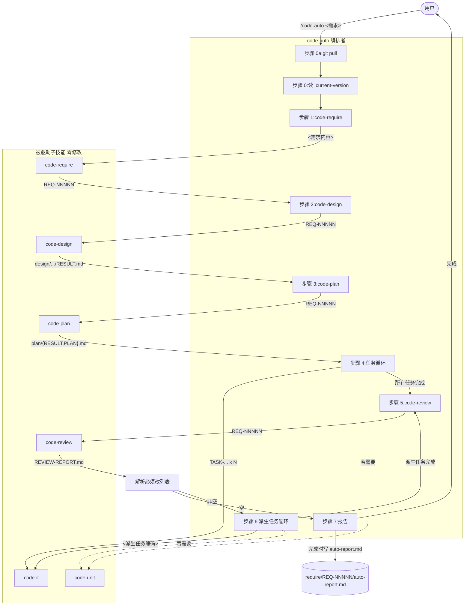

# REQ-00007 — 概要设计:增加 `/code-auto` 自动开发技能

- 需求编码:`REQ-00007`
- 所属版本:`V0.0.2`
- 上游:`./assistants/V0.0.2/require/REQ-00007/RESULT.md` (v1,已锁定,10 FR / 10 NFR / ~40 AC)
- 遵循规范:`./assistants/rules/` 下 13 个文件(7 强约束 + 6 占位 + 1 DEPRECATED;详见 §2.5)
- 状态:已完成(首次概要设计)
- 责任人:wangmiao
- 创建:2026-06-05
- 最近更新:2026-06-05 09:40
- 当前版本:v1

---

## 1. 设计概述

新增第 12 个 `code-*` 技能 `code-auto`("编排者"角色),在 Claude Code 内部**串行**驱动 6 个子技能(`code-require` → `code-design` → `code-plan` → `code-it`(+ `code-unit` 按需)→ `code-review` 循环)完成完整开发周期;所有 `AskUserQuestion` 通过 `code-auto` 自身 SKILL.md 中的"约束子技能行为的 prompt"总选"推荐项"(Q-4 锁定 A,FR-6);`code-review` 派生任务自动驱动 `code-it` / `code-unit` 完成,复评至"无必须改"为止(Q-1 锁定 A,无轮数上限,FR-5);异常立即中断 + 报告(NFR-7),`Ctrl+C` 中止时仅屏幕输出不落盘。

**范围**:
- **新增**:`plugins/code-skills/skills/code-auto/SKILL.md`(1 个新文件,预计 ~600 行)
- **新增**(运行时产物):`./assistants/<版本号>/require/REQ-NNNNN/auto-report.md`(由 `code-auto` 完成后写入)
- **修改**:**0 个**(严格遵循 FR-8.AC-8.1 / NFR-4)
- **新增依赖**:**0 个**(NFR-1 强约束)
- **同次提交追加**(由 `code-it` 任务执行,不在本设计阶段):
  - `./plugins/code-skills/README.md` + `README.en.md` "主要能力"段追加 1 行(FR-8.AC-8.5)
  - `./.claude-plugin/marketplace.json` `plugins[].skills` 数组追加 `./skills/code-auto`(`marketplace-protocol §规则 1`)

---

## 2. 需求回顾(摘录上游)

> 完整需求详见 `./assistants/V0.0.2/require/REQ-00007/RESULT.md`,本节不复制。

### 2.1 关键 FR 列表(对应到本设计的模块)

| FR | 描述 | 对应模块 / 章节 |
| --- | --- | --- |
| FR-1 | `code-auto` 技能定义与元信息 | M-1 `SKILL.md` frontmatter(§7.2 / module-breakdown §2.2) |
| FR-2 | 接收需求内容 + 启动编排 | M-1 §7 步骤 0 / 输入解析(§AC-2.1 ~ AC-2.3) |
| FR-3 | 子技能调用顺序与依赖(串行) | M-1 §7 步骤 1-3 + 状态机(§5) |
| FR-4 | 任务循环(对 `PLAN.md` 任务总览的每个任务) | M-1 §7 步骤 4(§AC-4.1 ~ AC-4.4) |
| FR-5 | 评审循环(对 `code-review` 派生任务) | M-1 §7 步骤 5/6(§AC-5.1 ~ AC-5.6) |
| FR-6 | 用户确认自动化(选推荐项) | M-1 §7 步骤 1-6 通用 prompt(§AC-6.1 ~ AC-6.3) |
| FR-7 | 异常立即中断 + 报告 | M-1 §7 步骤 7 异常路径(§AC-7.1 ~ AC-7.5) |
| FR-8 | 不修改其他 9 个 `code-*` 技能 | M-1 全局(§AC-8.1 ~ AC-8.5) |
| FR-9 | 完整报告(屏幕 + 磁盘) | M-2 `auto-report.md`(§AC-9.1 ~ AC-9.4) |
| FR-10 | 报告留痕 | M-2 路径与时机(§AC-10.1 ~ AC-10.4) |

### 2.2 关键 NFR(影响设计走向)

| NFR | 描述 | 设计响应 |
| --- | --- | --- |
| NFR-1 | 零新增依赖 | §10 依赖评估 = 0 |
| NFR-2 | 串行而非并发 | §5 状态机(无并发分支) |
| NFR-3 | `code-auto` 自身不自动 commit | §7 步骤 N 不含 `git commit` |
| NFR-4 | 不引入"批量模式" | 6 个子技能零修改(FR-8.AC-8.1) |
| NFR-5 | 与 `code-dashboard` 数据源严格一致 | §7 步骤 5/6 解析锚点沿用 `code-dashboard` |
| NFR-6 | 与 `code-publish` 数据源严格一致 | §7 步骤 0 沿用 `code-publish` 解析锚点 |
| NFR-7 | 中止约定(完成时写 / 中止时不写 `auto-report.md`) | §7 步骤 7 + §10.3 |
| NFR-8 | 不增量恢复 | §7 状态机不维护内存计数器(Q-A2 锁定 C) |
| NFR-9 | 与 REQ-00005 / 06 / 04 协同 | §2.5 + related-designs.md §2 |
| NFR-10 | 可观察性(每步打印进度) | §6.1 进度输出格式 |

### 2.3 关键 AC(影响设计走向)

- **AC-1.1 ~ AC-1.3**:`SKILL.md` frontmatter 含 `name` + `description`,`name` 与目录名一致(影响 §7.2)
- **AC-3.1 ~ AC-3.5**:严格串行,等子技能完成才下一步,退出码 ≠ 0 中断(影响 §5 状态机)
- **AC-4.1 ~ AC-4.4**:任务编码双格式兼容(`TASK-...` 新格式 + `REQ-...-...` 旧格式)(影响 §7 步骤 4)
- **AC-5.1 ~ AC-5.6**:`code-review` 循环,无轮数上限(影响 §5 状态机的"评审循环"分支)
- **AC-7.1 ~ AC-7.5**:异常立即中断 + 报告,`Ctrl+C` 同(影响 §7 步骤 7 异常路径)
- **AC-9.1 ~ AC-9.4**:完整报告字段(影响 §10 报告输出格式)
- **AC-10.1 ~ AC-10.4**:`auto-report.md` 路径与时机(影响 §7 步骤 7 + §10.3)

### 2.4 需求中的"待澄清"项(可能影响设计)

- Q-1 ~ Q-5:已锁定(上游) — 本设计直接采纳,无新增澄清
- Q-6 ~ Q-12:采纳默认(上游) — 本设计直接采纳,无新增澄清
- Q-13:建议派生(上游) — 本设计在 §15 风险与缓解中显式列出
- Q-A1 / Q-A2:本轮新增(概要设计阶段)— 涉及 SKILL.md 内部组织风格,**不**与上游冲突

---

## 2.5 规范遵循(总账)

### 2.5.1 适用的规范文件

| 规范文件 | 类别 | 关键约束 | 本设计对应章节 |
| --- | --- | --- | --- |
| `./assistants/rules/skill-conventions.md` | 技能编写 | §规则 1:SKILL.md frontmatter 必含 `name` + `description`,`name` 与目录名 kebab-case 严格一致 | §7.2 / module-breakdown §2.2 |
| `./assistants/rules/module-conventions.md` | 模块规划(DEPRECATED 但沿用) | §规则 1:资源放 `templates/` / `checklists/` / `guidelines/` 固定子目录 | §7.1 / module-breakdown §1 |
| `./assistants/rules/dashboard-conventions.md` | 看板与版本工作空间 | §规则 1:字段约定扩展需 3 处同步;本设计不扩展字段,只追加"概要设计清单"行 | §10 看板同步 |
| `./assistants/rules/doc-conventions.md` | 文档编写 | §规则 1:README 中英同次提交 + 结构对仗;§规则 2:README 必须存在并持续维护 | §10.4(同次提交追加 1 行,由 code-it 任务) |
| `./assistants/rules/marketplace-protocol.md` | Marketplace 协议 | §规则 1:`$schema` / `name` / `version` 必填;`source` 必须 `./` 开头;`skills` 必须是 `./` 开头的相对路径数组 | §10.5(由 code-it 任务追加 skills[]) |
| `./assistants/rules/encoding-conventions.md` | 编码格式 | §规则 1-4:REQ/BUG `^REQ-\d{5}$` / `^BUG-\d{5}$`;TASK 嵌套式 `^TASK-(REQ\|BUG)-\d{5}-\d{5}$`;§规则 4 实施流程 | §7 步骤 4 / §7 步骤 5-6 任务编码解析 |
| `./assistants/rules/migration-mapping.md` | 编码迁移 | §规则 1-4:已落地/理论/通用公式/EXISTING-NNN 不追溯 | (不触发) |

**占位规范(6 个,不影响)**:`directory-conventions.md` / `coding-style.md` / `commit-conventions.md` / `dependency-conventions.md` / `framework-conventions.md` / `naming-conventions.md`

### 2.5.2 规范自检结论

- **完全合规**的章节:§1 / §2 / §3 / §4 / §5 / §6 / §7 / §8 / §9 / §10 / §11 / §12 / §13 / §14 / §15
- **经用户授权偏离**的章节:**0**(详见 §2.5.3)
- **待澄清冲突**:**0**(详见 §2.5.4)

### 2.5.3 用户授权的偏离

**无**。本设计 100% 合规。

### 2.5.4 待澄清的规范冲突

**无**。13 个规范文件全部"不冲突"。

> 详细规范遵循记录见 `rule-compliance.md`(本目录)。

---

## 3. 设计目标与非目标

### 3.1 目标

- **G-1 一键全自动**:`/code-auto "<需求>"` 一次调用即跑通完整开发周期(需求 → 设计 → 计划 → 编码 → 单测 → 评审通过)
- **G-2 编排者边界**:`code-auto` 是"驱动者",9 个被驱动子技能(本需求触达 6 个)零修改(FR-8.AC-8.1)
- **G-3 完全无人确认**:所有 `AskUserQuestion` 通过 prompt 约束总选推荐项(FR-6 + Q-4 锁定 A)
- **G-4 评审循环自动化**:`code-review` 派生任务自动 `code-it` / `code-unit` 完成,复评至"无必须改"(FR-5 + Q-1 锁定 A,无轮数上限)
- **G-5 异常立即中断**:任何子技能崩溃或用户 `Ctrl+C`,立即输出报告(FR-7 + Q-2/Q-3 锁定 A)
- **G-6 报告留痕**:完成时写 `auto-report.md`(FR-10),中止时不写(NFR-7)
- **G-7 零新增依赖**(NFR-1 强约束):仅复用 Claude Code 平台工具集

### 3.2 非目标

- **非目标 1**:实际"执行"部署(`code-auto` 完成后,建议用户调 `code-publish`,但自身不调 — 沿用 Q-6 采纳默认)
- **非目标 2**:智能填充中间产物细节(各子技能仍按各自原设计运行,不引入批量模式 — NFR-4)
- **非目标 3**:增量恢复(中止后用户重跑,从头开始 — NFR-8 + Q-11 锁定)
- **非目标 4**:自动 commit(`code-auto` 自身不 commit,各子技能按各自规则 commit — NFR-3)
- **非目标 5**:`code-auto` 自身触发 `AskUserQuestion`(本技能无歧义需澄清,FR-6.AC-6.3)
- **非目标 6**:`code-auto` 解析子技能内部 prompt(零侵入子技能,FR-8.AC-8.1)
- **非目标 7**:`code-auto` 跨多需求编排(每次只跑 1 个需求,完成或中断后退出)
- **非目标 8**:新增 `auto-conventions.md` 规范文件(留作 follow-up,Q-13 派生)

---

## 4. 约束清单

### 4.1 硬约束(不可违反)

| 约束 | 来源 | 应对 |
| --- | --- | --- |
| 零新增依赖 | NFR-1 | §10 依赖评估 = 0 |
| 子技能零修改 | FR-8.AC-8.1 | §7 全局不修改子技能 SKILL.md |
| 不引入批量模式 | NFR-4 | §7 全局不向子技能传特殊参数 |
| `code-auto` 自身不 commit | NFR-3 | §7 步骤 N 不含 `git commit` |
| 串行而非并发 | NFR-2 + Q-7 | §5 状态机无并发分支 |
| 异常立即中断 | FR-7 + Q-2 | §7 步骤 7 异常路径 |
| 评审循环无轮数上限 | Q-1 | §5 状态机"评审循环"分支无 break 条件(仅"必须改"列表空) |
| 中止时不写 `auto-report.md` | NFR-7 | §7 步骤 7 中止分支 |
| 不增量恢复 | NFR-8 + Q-11 | §5 状态机无"恢复"状态 |
| SKILL.md frontmatter 合规 | `skill-conventions §规则 1` | §7.2 |
| `code-auto/` 无子目录 | `module-conventions §规则 1` | §7.1 单文件技能 |
| `marketplace.json` 不在 design 阶段修改 | `marketplace-protocol §规则 1` | §10.5 由 code-it 任务执行 |

### 4.2 软约束(可权衡,本设计全部采纳最强项)

| 约束 | 来源 | 应对 |
| --- | --- | --- |
| 状态机显式可读 | Q-A1 锁定 A | §5 Mermaid 状态机 + §6 子技能调用表 |
| 评审轮次不落盘 | Q-A2 锁定 C | §5 状态机无"轮次计数器",仅屏幕输出"第 N 轮" |
| 报告屏幕 + 磁盘双通道 | FR-9 / FR-10 | §10 报告输出格式 |
| 同次提交追加中英 README | FR-8.AC-8.5 | §10.4 由 code-it 任务同次执行 |
| 复用既有 6 个子技能 | FR-3 ~ FR-5 | §6 子技能调用表 |

---

## 5. 架构总览

### 5.1 组件图(Mermaid)



### 5.2 数据流图(关键路径)

```
用户输入("/code-auto <需求>")
  ↓
[A0a] git pull → 仓库最新代码
  ↓
[A0] 读 ./.assistants/.current-version → V0.0.2
  ↓
[A1] Skill(code-require, "<需求>")
  ↓ 输出:require/REQ-NNNNN/RESULT.md(子技能写盘)
[A2] Skill(code-design, "REQ-NNNNN")
  ↓ 输出:design/REQ-NNNNN/RESULT.md
[A3] Skill(code-plan, "REQ-NNNNN")
  ↓ 输出:plan/REQ-NNNNN/{RESULT,PLAN}.md
[A4] 解析 PLAN.md 任务总览 → 任务列表
  ↓ 对每个任务:
[A4.1] Skill(code-it, <任务编码>) → code/TASK-.../RESULT.md
[A4.2] (若 code-it 输出含 "测试需要=Y") Skill(code-unit, <任务编码>) → test/TASK-.../RESULT.md
  ↓
[A5] Skill(code-review, "REQ-NNNNN") → review/REQ-NNNNN/REVIEW-REPORT.md
  ↓
[解析必须改列表] 读 REVIEW-REPORT.md
  ├─ 空 → [A7] 完成
  └─ 非空 → [A6] 派生任务循环
              ↓ 对每个派生任务:
              Skill(code-it, <派生>) → 写盘
              (若需要) Skill(code-unit, <派生>) → 写盘
              ↓
              回到 [A5]
[A7] 屏幕输出报告(用户看到)
  + Write require/REQ-NNNNN/auto-report.md(完成时)
  ↓
退出 0
```

### 5.3 异常路径

```
[A1-A6 任意步骤] 子技能退出码 ≠ 0
  ↓
[中断路径] 屏幕输出"✗ code-auto 中断"报告(中断格式)
  ↓
退出 ≠ 0(NFR-7 显式不写 auto-report.md)

[任意步骤] 用户按 Ctrl+C(SIGINT)
  ↓
[中止路径] 屏幕输出"⏹ code-auto 用户中止"报告(中止格式)
  ↓
退出 130(NFR-7 显式不写 auto-report.md)

[完成路径] 所有步骤通过 + 必须改列表空
  ↓
[完成路径] 屏幕输出"✓ code-auto 完成"报告
  + Write require/REQ-NNNNN/auto-report.md
  ↓
退出 0
```

---

## 6. 功能架构

### 6.1 进度输出(每步,NFR-10)

```
[code-auto] 步骤 0a:git pull(沿用 REQ-00005 模式)
[code-auto] 步骤 0:读 .current-version → V0.0.2
[code-auto] 步骤 1/6:code-require "<需求内容>"
[code-auto]   → 产出 REQ-NNNNN
[code-auto] 步骤 2/6:code-design REQ-NNNNN
[code-auto]   → 产出 design/REQ-NNNNN/RESULT.md
[code-auto] 步骤 3/6:code-plan REQ-NNNNN
[code-auto]   → 拆 N 个任务
[code-auto] 步骤 4/6:任务循环(N 个)
[code-auto]   → 1/N:code-it TASK-... ✓
[code-auto]   → 1/N:code-unit TASK-... ✓ (跳过,无需测试)
[code-auto]   → 2/N:code-it TASK-... ✓
[code-auto]   → ...
[code-auto] 步骤 5/6:code-review REQ-NNNNN(第 1 轮)
[code-auto]   → "必须改"任务 2 个
[code-auto] 步骤 6/6:评审循环
[code-auto]   → 1/2:code-it F-1 ✓
[code-auto]   → 2/2:code-it F-2 ✓ + code-unit F-2 ✓
[code-auto]   → code-review 第 2 轮:无"必须改" → 结束
```

### 6.2 子技能调用表(Q-A1 锁定 A)

| 步骤 | 子技能 | 输入参数 | 期望产物 | 失败处理 |
| --- | --- | --- | --- | --- |
| 0a | (Bash git pull) | — | 仓库最新 | 报错退出(E-2/3/4) |
| 0 | (Read) | — | `.current-version` | 提示调 `code-version`(E-1) |
| 1 | `code-require` | `"<原需求内容>"` | `require/REQ-NNNNN/RESULT.md` | 中断 + 报告 |
| 2 | `code-design` | `REQ-NNNNN` | `design/REQ-NNNNN/RESULT.md` | 中断 + 报告 |
| 3 | `code-plan` | `REQ-NNNNN` | `plan/REQ-NNNNN/{RESULT,PLAN}.md` | 中断 + 报告 |
| 4 | `code-it` | `TASK-REQ-NNNNN-NNNNN` | `code/TASK-.../RESULT.md` | 中断 + 报告 |
| 4 | `code-unit` | `TASK-REQ-NNNNN-NNNNN` | `test/TASK-.../RESULT.md` | 中断 + 报告(按需) |
| 5 | `code-review` | `REQ-NNNNN` | `review/REQ-NNNNN/REVIEW-REPORT.md` | 中断 + 报告 |
| 6 | `code-it` | `<派生任务编码>` | `code/.../RESULT.md` | 中断 + 报告 |
| 6 | `code-unit` | `<派生任务编码>` | `test/.../RESULT.md` | 中断 + 报告(按需) |

### 6.3 状态机(详细,Q-A1 锁定 A)

```
[启动]
  ↓
[步骤 0a:git pull] ──┐
  ↓ 成功             │ 失败 → E-2/3/4
[步骤 0:读版本]      │
  ↓ 成功             │ 失败 → E-1
[步骤 1:Skill(code-require, "<需求>")]
  ↓ 成功(返回 REQ-NNNNN)
[步骤 2:Skill(code-design, REQ-NNNNN)]
  ↓ 成功
[步骤 3:Skill(code-plan, REQ-NNNNN)]
  ↓ 成功
[步骤 4:任务循环]
  ↓ 解析 plan/PLAN.md 任务总览
  ↓ 对每个任务编码:
     Skill(code-it, <任务编码>)
     若 code-it 输出含 "测试需要=Y" → Skill(code-unit, <任务编码>)
  ↓ 全部完成
[步骤 5:Skill(code-review, REQ-NNNNN)]
  ↓ 成功(返回 REVIEW-REPORT.md)
[解析"必须改"列表]
  ├─ 空 → [完成] ──→ 写 auto-report.md → 退出 0
  └─ 非空 → [步骤 6:派生任务循环]
              ↓ 对每个派生任务编码:
                 Skill(code-it, <派生>)
                 若需要 → Skill(code-unit, <派生>)
              ↓
              回到 [步骤 5]
              (无轮数上限,Q-1 锁定 A)

[异常路径]:任意步骤退出码 ≠ 0 → 中断 + 报告(不写 auto-report.md) → 退出 ≠ 0
[中止路径]:任意步骤 SIGINT → 中止 + 报告(不写 auto-report.md) → 退出 130
```

### 6.4 派生任务识别(D-3 选定 A)

读 `review/REQ-NNNNN/REVIEW-REPORT.md`:
- 锚点 1:`^## 评审发现汇总$`(定位区段)
- 锚点 2:`^\| .* \|$`(定位表格行)
- 筛选:`级别` = `必须改` **且** `状态` ≠ `已处理`
- 提取每行的"任务编码"列(若有)

> 备注:`REVIEW-REPORT.md` 区段结构由 `code-review` 既有 SKILL.md 决定;本设计**不**修改 `code-review`(FR-8.AC-8.1)。

### 6.5 任务编码解析(D-3 选定 A 沿用)

- **新格式正则**:`^TASK-(REQ|BUG)-\d{5}-\d{5}$`
- **旧格式正则**:`^(REQ|BUG)-\d{5}-\d{5}$`
- **双格式兼容**:新格式优先;旧格式透传(沿用 `code-dashboard` NFR-3)
- **依据**:`encoding-conventions.md §规则 1` + §规则 3

---

## 7. 模块划分

### 7.1 模块总览

| # | 模块 | 路径 | 状态 | 职责 |
| --- | --- | --- | --- | --- |
| M-1 | `code-auto` | `plugins/code-skills/skills/code-auto/SKILL.md` | **新增** | 编排者,串行驱动 6 子技能 + 评审循环 + 自动选推荐项 |
| M-2 | `auto-report.md` | `./assistants/<版本号>/require/REQ-NNNNN/auto-report.md` | **新增**(运行时) | 完整执行报告留痕 |

**说明**:**新增 = 1 个新文件**(SKILL.md)+ **运行时产物 = 1 个**;**修改 = 0**;**复用 = 6 个子技能 + 3 个数据源**。

### 7.2 M-1 详细 — `code-auto/SKILL.md`

#### 7.2.1 路径
`plugins/code-skills/skills/code-auto/SKILL.md`(新文件,预计 ~600 行 Markdown,无子目录)

#### 7.2.2 frontmatter(严格遵循 `skill-conventions §规则 1`)
```yaml
---
name: code-auto
description: 自动开发编排(版本感知)。接收 1 个需求内容,按 `code-require` → `code-design` → `code-plan` → `code-it`(+ `code-unit` 条件)→ `code-review` 循环(派生任务自动修复)的固定顺序,串行驱动 6 个子技能完成完整开发周期,过程中所有 `AskUserQuestion` 自动选推荐项,完全无需用户确认;支持 `Ctrl+C` 中止 + 异常立即中断 + 完成时输出报告到 `auto-report.md`。在 `code-version` 之后、其他 `code-*` 之前作为顶层入口使用;也可用作"从需求到代码 + 单测 + 评审全自动跑通"的一键命令。
---
```

#### 7.2.3 SKILL.md 内部章节(Q-A1 锁定 A:显式状态机 + 子技能调用表)

| 章节 | 内容 | 行数预算 |
| --- | --- | --- |
| §1 目标 | 一句话讲清"做什么、何时用" | ~30 |
| §2 适用场景 | 适用 / 不适用 | ~40 |
| §3 工作目录约定 | 强制 `.current-version` + 缺失时中止 | ~30 |
| §4 输入与输出 | 输入=1 字符串;输出=屏幕+磁盘 | ~50 |
| §5 状态机总览 | Mermaid 状态机 + 文字说明 | ~80 |
| §6 子技能调用表 | 7 步 × (调谁/传什么/期望产物/失败处理) | ~80 |
| §7 工作流步骤 | 步骤 0a / 0 / 1 / 2 / 3 / 4 / 5 / 6 / 7 详细描述 | ~200 |
| §8 数据解析 | PLAN.md 任务总览 + REVIEW-REPORT.md"必须改"解析 | ~50 |
| §9 中断与异常 | SIGINT + 子技能退出码 + 报告留痕 | ~40 |
| §10 报告输出 | 屏幕 + `auto-report.md` | ~40 |
| §11 边界与异常 | E-1 ~ E-10(沿用需求文档) | ~30 |
| §12 上下游衔接 | 上游=`code-version`;下游=`code-dashboard` / `code-publish` | ~30 |
| §13 关联需求 | REQ-00004 / 05 / 06 / 08 / 09 / 10 / 11 | ~20 |
| §14 工具使用约定 | Skill / Read / Write / Bash | ~30 |
| §15 变更记录 | 留空,首版 | ~5 |
| **合计** | | **~755** |

> 备注:行数预算是上限估算,实际由 `code-it` 任务 T-1 实施时调整。

### 7.3 M-2 详细 — `auto-report.md`

#### 7.3.1 路径
`./assistants/<版本号>/require/REQ-NNNNN/auto-report.md`

#### 7.3.2 写入时机(NFR-7)
- **写入**:`code-auto` 正常完成(全部步骤通过 + 必须改列表空)→ 一次性 `Write`
- **不写入**:
  - 子技能退出码 ≠ 0 → 异常中断(避免半成品)
  - SIGINT → 用户中止(避免半成品)
  - `code-auto` 自身崩溃 → 不写
  - `Write` 失败 → stderr 警告,不中断(报告已落屏幕)

#### 7.3.3 内容结构(FR-9 报告字段)
```markdown
# auto-report — REQ-NNNNN(<需求标题>)

- 需求编码:REQ-NNNNN
- 所属版本:V0.0.2
- code-auto 起始时间:YYYY-MM-DD HH:mm
- code-auto 结束时间:YYYY-MM-DD HH:mm
- 总状态:✓ 完成
- 总子技能调用次数:N

## 执行摘要
| 子技能 | 调用次数 |
| --- | --- |
| code-require | 1 |
| code-design | 1 |
| code-plan | 1 |
| code-it | N1 |
| code-unit | N2 |
| code-review | N3 |

## 最终状态
- REQ-NNNNN 状态:已完成
- 任务清单:TASK-... × N,均已完成
- 缺陷:0
- 派生任务:N,均已完成

## 后续建议
- 执行 /code-dashboard 查看完整状态
- 执行 /code-publish 生成发布手册
```

---

## 8. 接口与数据契约

### 8.1 `code-auto` 对外契约

- **触发**:`Skill` 工具(`/code-auto "<需求内容>"` 或 `/code-auto arg1 arg2 ...` 拼接)
- **输入**:1 个字符串参数(= 需求内容,自然语言)
- **输出**:
  - **屏幕**:进度日志(每步)+ 完成/中断/中止报告
  - **磁盘**(完成时):`./assistants/<版本号>/require/REQ-NNNNN/auto-report.md`
- **退出码**:
  - `0` = 正常完成
  - `≠ 0` = 异常中断
  - `130` = 用户中止(SIGINT)

### 8.2 `code-auto` 对子技能的契约

- **调用方式**:`Skill` 工具
- **参数**:
  - `code-require`:`<需求内容>`(字符串)
  - `code-design`:`<需求编码>`(5 位格式 `REQ-NNNNN`)
  - `code-plan`:`<需求编码>`
  - `code-it`:`<任务编码>`(新格式 `TASK-REQ-NNNNN-NNNNN` 或旧格式 `REQ-NNNNN-NNNNN`)
  - `code-unit`:`<任务编码>`(同 `code-it`)
  - `code-review`:`<需求编码>`
- **附加约束**(通过 prompt engineering 注入,FR-6 + D-2 选定 A):
  > "在执行本任务时,若 Claude Code 触发 `AskUserQuestion` 询问用户,**总选第一项 / 标注 (推荐) 的项**;不向用户提问"
- **不向子技能传任何特殊参数**(D-5 选定 A:无显式契约)

### 8.3 `code-auto` 对数据源的契约

- **读 `.current-version`**:1 行字符串
- **读 `plan/REQ-NNNNN/PLAN.md`**:
  - 锚点:`^## 任务总览$`(定位区段)
  - 解析:`^\| .* \|$`(表格行)
  - 提取每行第 1 列(任务编码)
- **读 `review/REQ-NNNNN/REVIEW-REPORT.md`**:
  - 锚点:`^## 评审发现汇总$`(定位区段)
  - 解析:`^\| .* \|$`(表格行)
  - 筛选:`级别` = `必须改` **且** `状态` ≠ `已处理`

---

## 9. 边界与异常(沿用需求 §9 E-1 ~ E-10)

| ID | 场景 | 处理 | 对应 FR/NFR |
| --- | --- | --- | --- |
| E-1 | 无 `.current-version` | 提示调 `code-version`,退出 | FR-3.AC-3.1 前置 |
| E-2 | `git pull` 冲突 | 报错退出 | 沿用 REQ-00005 |
| E-3 | `git pull` 网络失败 | 报错退出 | 沿用 REQ-00005 |
| E-4 | `git pull` 凭据失败 | 报错退出 | 沿用 REQ-00005 |
| E-5 | 子技能退出码 ≠ 0 | 立即中断 + 报告(不写 auto-report.md) | FR-7.AC-7.1 + NFR-7 |
| E-6 | 用户 `Ctrl+C` | 报告(中止格式,不写 auto-report.md) | FR-7.AC-7.5 + NFR-7 |
| E-7 | 评审循环无收敛 | 持续循环(Q-1 锁定 A:无上限);用户可 `Ctrl+C` | FR-5.AC-5.5 |
| E-8 | 子技能耗时过长 | 接受;中止靠 `Ctrl+C` | NFR-7 |
| E-9 | `code-auto` 自身崩溃 | 报告(部分);不写 auto-report.md | NFR-7 |
| E-10 | `auto-report.md` 写入失败 | 警告不中断(报告已落屏幕) | D-6 选定 A |
| E-11 | `plan/PLAN.md` 缺失 | 中断 + 报告 | FR-7 |
| E-12 | `REVIEW-REPORT.md` 缺失 | 中断 + 报告 | FR-7 |
| E-13 | `git` 不可用 | 报错退出 | 沿用 REQ-00005 |

---

## 10. 跨流程协同与依赖

### 10.1 上下游衔接

```
上游(必选):code-version(激活版本,提供 .current-version)
  ↓
本技能:code-auto(本次设计)
  ↓
下游(建议):code-dashboard / code-publish(Q-6 采纳默认)
```

### 10.2 与 REQ-00005 的协同

- 沿用其"步骤 0a 拉取"模式(本设计 步骤 0a)
- 沿用其"末尾兜底提交"模式(**由子技能各自完成**,`code-auto` 自身不 commit — NFR-3)
- 不引入"批量模式"(NFR-4)

### 10.3 与 REQ-00004 / REQ-00006 的数据源一致性

- 解析锚点(`^## .*$` 区段 + `^\| .* \|$` 表格行)与 `code-dashboard` 完全一致
- 解析锚点与 `code-publish` 的 PreflightChecker 完全一致
- NFR-5 / NFR-6 强约束

### 10.4 中英 README 追加(由 `code-it` 任务执行,FR-8.AC-8.5)

- `plugins/code-skills/README.md` "主要能力"段追加 1 行
- `plugins/code-skills/README.en.md` 同步追加 1 行
- **同次提交**(遵循 `doc-conventions §规则 1`)

### 10.5 marketplace.json 追加(由 `code-it` 任务执行)

- `.claude-plugin/marketplace.json` 的 `plugins[].skills` 数组追加 `./skills/code-auto`
- 严格遵循 `marketplace-protocol.md §规则 1`(`./` 开头相对路径)
- **本设计阶段不修改**(避免越权)

### 10.6 看板同步(本设计阶段执行)

- `./assistants/V0.0.2/RESULT.md` "概要设计清单"区段追加 1 行(本设计完成)
- `./assistants/V0.0.2/RESULT.md` "变更记录"区段追加 1 行

### 10.7 依赖清单

- **新增三方依赖**:**0**(NFR-1 强约束)
- **复用 Claude Code 工具**:`Skill` / `Read` / `Write` / `Bash` / `Glob` / `Grep`(均已存在)
- **复用子技能**:`code-require` / `code-design` / `code-plan` / `code-it` / `code-unit` / `code-review`(均已存在)

---

## 11. 风险与缓解

| # | 风险 | 级别 | 缓解 |
| --- | --- | --- | --- |
| R-1 | 评审循环无收敛(修改引入新问题) | 中 | 接受(Q-1 锁定 A);NFR-10 打印"第 N 轮"提示;用户可 `Ctrl+C` 中止 |
| R-2 | 子技能首步 `git pull` × N 次,慢 | 低 | 接受(NFR-4 不引入批量模式);Q-2 采纳默认 |
| R-3 | 派生任务无"触发/来源"标识,识别失败 | 中 | 沿用 `code-review` 既有模式(写 `plan/PLAN.md` 任务总览);`code-auto` 步骤 5/6 解析"必须改"列表 |
| R-4 | `code-auto` SKILL.md ~600 行,可读性下降 | 低 | 显式状态机 + 子技能调用表(Q-A1 锁定 A);章节化(§1 ~ §15) |
| R-5 | `code-auto` 自身崩溃(E-9) | 低 | 报告(部分);不写 auto-report.md;用户可重跑(Q-11 采纳默认) |
| R-6 | `auto-report.md` 写入失败(E-10) | 低 | 警告不中断(D-6 选定 A);报告已落屏幕 |
| R-7 | 跨会话上下文限制(token 上限) | 中 | 接受(无法预判;V0.0.2 阶段不实现分片) |
| R-8 | 6 个子技能未来新增"特殊模式"参数,`code-auto` 不知情 | 低 | 接受(子技能零修改 = `code-auto` 沿用通用参数);由 `code-review` 派生"参数一致性"审查任务 |

---

## 12. 派生任务建议(由 `code-review` 决定)

> 来自上游 Q-13 建议派生;本设计显式列出,**不**在本需求中实施。

1. **用 `code-rule` 沉淀 `auto-conventions.md`**(自动化边界 / 终止条件 / 中止开关)— 由 `code-rule` 技能执行
2. **把 `code-auto` 加入 `code-publish` 的"发布前置检查"说明** — 由 `code-publish` 技能执行
3. **`code-dashboard` 升级"全完成"建议为 `code-auto` + `code-publish`** — 由 `code-dashboard` 技能执行
4. **CLAUDE.md "AI 工作约定"小节追加 `code-auto` 工作约定** — 由 `code-rule` 技能执行(Q-8 采纳默认)
5. **`commit-conventions.md` 规则沉淀** — 由 `code-rule` 技能执行(Q-9 采纳默认)

---

## 13. 变更记录

| 时间 | 版本 | 变更摘要 | 变更人 |
| --- | --- | --- | --- |
| 2026-06-05 09:40 | v1 | 初始创建:1 个新增技能(`code-auto`)+ 1 个运行时产物(`auto-report.md`)+ 0 修改 + 0 依赖;7 步骤状态机 + 子技能调用表(Q-A1 锁定 A);评审轮次仅屏幕(Q-A2 锁定 C);M-1 模块 100% 合规 `skill-conventions §规则 1` + `module-conventions §规则 1`;M-2 写入时机严格遵循 NFR-7;子技能零修改(FR-8.AC-8.1 强约束) | wangmiao |
