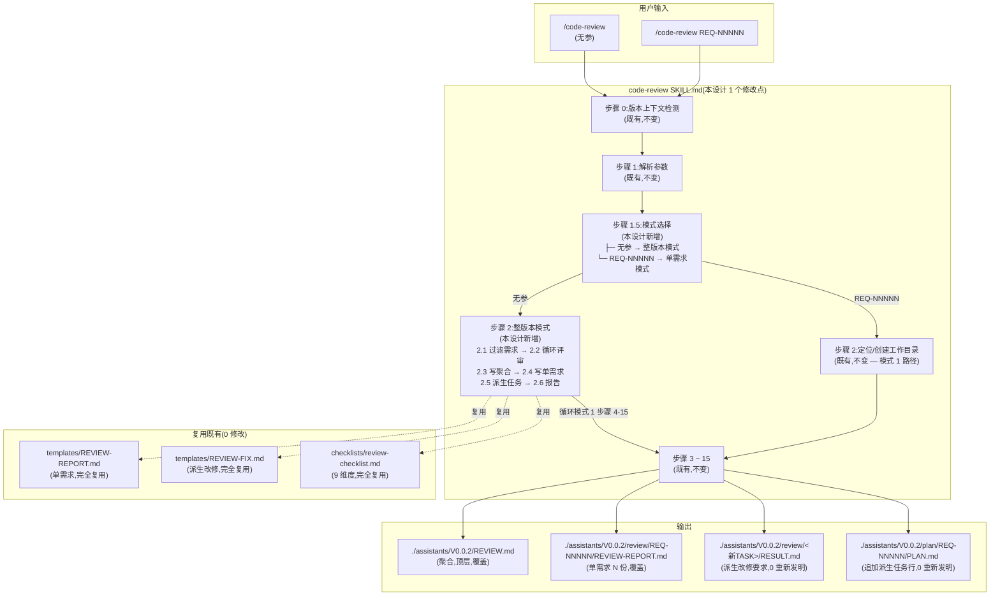
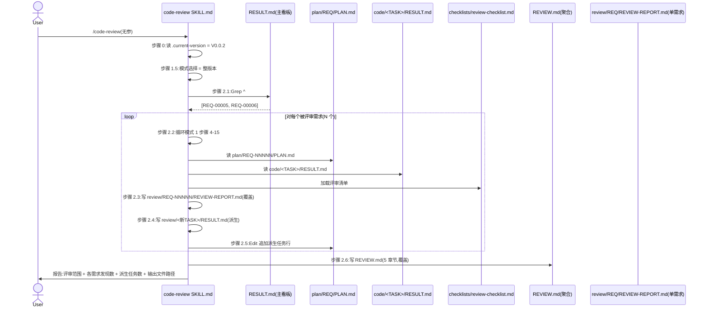
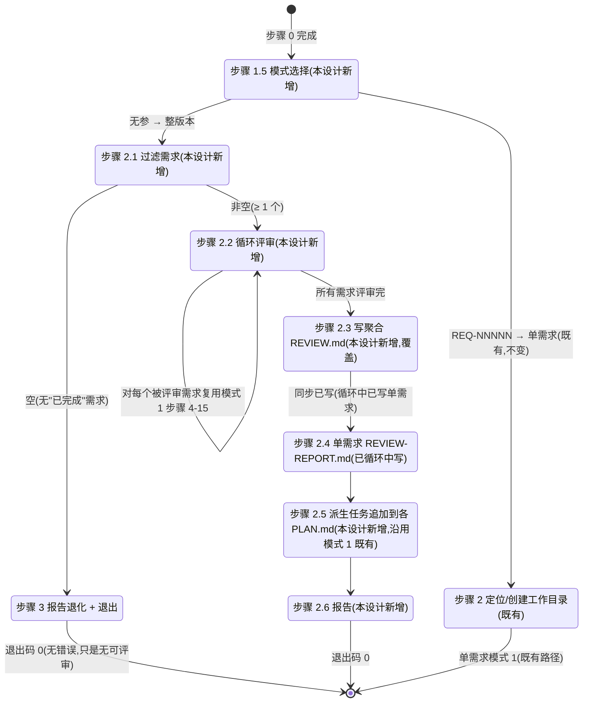

# REQ-00008 — 概要设计:`/code-review` 整版本模式(无参评审)

- 需求编码:`REQ-00008`
- 所属版本:`V0.0.2`
- 上游:`./assistants/V0.0.2/require/REQ-00008/RESULT.md` (v1,已锁定,9 FR / 8 NFR / ~30 AC / 9 边界 / 7 项 Q-locked + 3 项采纳默认)
- 遵循规范:`./assistants/rules/` 下 7 个有效约束(6 占位 + 1 DEPRECATED 仍引用 + 1 迁移不触发;详见 §2.5)
- 状态:**已完成(首次概要设计)**
- 责任人:wangmiao
- 创建:2026-06-05
- 最近更新:2026-06-05 15:55
- 当前版本:v1

---

## 1. 设计概述

本设计优化既有 `code-review` 技能(不新增技能),为其增加**"无参模式" = 整版本评审**作为第 2 种调用模式,与既有"传入 `REQ-NNNNN`"单需求模式**并存**。核心架构思路:

- **双模式并存**:`code-review`(无参)= 整版本评审 / `code-review REQ-NNNNN` = 单需求评审(既有,**不变**)
- **完全复用模式 1**:整版本模式 = "需求过滤" + "对每个被评审需求**循环**复用模式 1(步骤 0-15)"
- **双写输出**:聚合文件 `./assistants/<版本号>/REVIEW.md`(顶层,与 `RESULT.md` 同级) + N 份 `review/REQ-NNNNN/REVIEW-REPORT.md`(沿用模式 1 路径)
- **派生任务沿用**:每条"必须改"按其所属需求追加到对应 `PLAN.md` 任务总览(模式 1 既有逻辑,**零**重新发明)
- **0 新增依赖 + 0 新增子模块 + 0 修改其他 9 个 `code-*` SKILL.md + 0 修改 `marketplace.json` / `plugin.json`**

**范围**:
- **修改**:`plugins/code-skills/skills/code-review/SKILL.md`(**1 个文件**,Edit 增量追加 +60 ~ +120 行)
- **新增**:**0 个**
- **新增依赖**:**0 个**(NFR-1 强约束)
- **同次提交追加**(由 `code-plan` 阶段决定是否拆为独立任务):
  - `assistants/V0.0.2/RESULT.md` "概要设计清单" 段追加 1 行(由本技能步骤 14A 同步,见 §11)
  - 由 `code-plan` 决定 T-002 是否新增 `plugins/code-skills/skills/code-review/templates/REVIEW-ALL.md` 模板(本设计倾向**不新增**,见 D-1)

---

## 2. 需求回顾

引用上游 `./assistants/V0.0.2/require/REQ-00008/RESULT.md`(v1,已锁定)。

### 2.1 关键 FR 列表(对应到本设计的章节)

| FR | 描述 | 对应章节 |
| --- | --- | --- |
| FR-1 | 增加"无参"入口(与模式 1 并存) | §10.1 SKILL.md 增量追加(在"步骤 1 解析参数"后插入"步骤 1.5 模式选择") |
| FR-2 | 整版本模式 — 评审范围过滤(Q-1 锁定 B) | §6 整版本模式状态机 + §10.1 SKILL.md "步骤 2 整版本模式"(步骤 2.1 过滤需求) |
| FR-3 | 整版本模式 — 双写 REPORT(聚合 + 单需求) | §6 + §7 聚合文件结构 + §10.1 SKILL.md "步骤 2.2 ~ 2.4"(写聚合 + 写单需求) |
| FR-4 | `REVIEW.md` 聚合文件结构(详细) | §7 REVIEW.md 5 章节结构 |
| FR-5 | 派生任务(沿用模式 1) | §10.1 SKILL.md "步骤 2.5 派生任务追加"(沿用模式 1 步骤 10 既有逻辑) |
| FR-6 | 与模式 1 完全兼容 | §10.1 SKILL.md "步骤 2 整版本模式" 整节(完全复用模式 1 步骤 5-15) |
| FR-7 | 不修改 `code-review` 现有行为 | §10.1 增量追加边界(不重写模式 1 既有字面) |
| FR-8 | 不修改其他 9 个 `code-*` 技能 | §10.1 0 触发 + §10.4 不修改文件清单 |
| FR-9 | 报告与建议 | §10.1 SKILL.md "步骤 2.6 报告"(含 S-2 退化 / S-3 多次执行比较) |

### 2.2 关键 NFR(影响设计走向)

| NFR | 描述 | 设计响应 |
| --- | --- | --- |
| NFR-1 | 零新增依赖 | §9 依赖评估 = 0 |
| NFR-2 | 增量修改 SKILL.md(不重写模式 1) | §10.1 SKILL.md 增量追加(在"步骤 1 后"插入"步骤 1.5" + 整版本模式 8 步骤) |
| NFR-3 | 整版本模式多次执行幂等 | §7 聚合文件覆盖策略 + §6 状态机"覆盖"分支 |
| NFR-4 | 不修改 `code-auto` 评审循环 | §10.1 0 触发 + §10.4 不修改文件清单 |
| NFR-5 | 不参与 REQ-00005(首步拉取+末步提交) | §10.1 SKILL.md 增量追加**不**含"首步拉取"与"末步提交"段 |
| NFR-6 | 聚合文件位置约束(版本顶层) | §7 聚合文件路径 = `./assistants/<版本号>/REVIEW.md` |
| NFR-7 | 评审发现去重(去重键 = `(需求编码, 描述前 50 字)`) | §7 聚合文件 §3 区段去重逻辑 |
| NFR-8 | 派生任务唯一性(同发现不重复追加) | §10.1 SKILL.md "步骤 2.5 派生任务追加" 中加去重检查 |

### 2.3 关键 AC(影响设计走向的)

- **AC-1.1 ~ AC-1.3**:整版本模式入口(三态机:无参 / 有参 / 无效参)— §10.1 SKILL.md "步骤 1.5"
- **AC-2.1 ~ AC-2.3**:评审范围过滤(已完成 / 可见性 / 退化)— §10.1 SKILL.md "步骤 2.1 过滤需求"
- **AC-3.1 ~ AC-3.5**:双写 REPORT(单需求复用模板 / 聚合路径 / 覆盖幂等 / 互相覆盖)— §7 + §10.1 SKILL.md "步骤 2.2 ~ 2.4"
- **AC-4.1 ~ AC-4.6**:REVIEW.md 5 章节结构 — §7
- **AC-5.1 ~ AC-5.3**:派生任务(字段 / 编码沿用 / PLAN.md 追加)— §10.1 SKILL.md "步骤 2.5"
- **AC-6.1 ~ AC-6.3**:与模式 1 完全兼容(字面一致 / `code-auto` 解析不变 / 模式 1 继续用)— INV-1 / INV-2 + NFR-4
- **AC-7.1 ~ AC-7.4**:不修改 `code-review` 现有行为 — INV-1 / INV-4
- **AC-8.1 ~ AC-8.4**:不修改其他 9 个 `code-*` + `marketplace.json` + `assistants/rules/` + README — §10.4 不修改文件清单
- **AC-9.1 ~ AC-9.3**:报告与建议(完成时 / 退化时 / 多次执行比较)— §10.1 SKILL.md "步骤 2.6 报告"

### 2.4 需求中的"待澄清"项(可能影响设计)

- Q-1 ~ Q-2 已锁定(上游)— 本设计直接采纳(§2.5 + §7 + §10.1)
- Q-3 ~ Q-7 采纳默认(上游)— 本设计直接采纳(§10.1 + §10.4)
- Q-8(新增)派生任务预警 — 本设计**不阻塞**,在 §15 风险与缓解中显式列出,留作 `code-rule` / REQ-00005 后续 follow-up

---

## 2.5 规范遵循(总账)

### 2.5.1 适用的规范文件

| 规范文件 | 类别 | 关键约束 | 本设计对应章节 |
| --- | --- | --- | --- |
| `./assistants/rules/skill-conventions.md` | 技能编写 | §规则 1:SKILL.md frontmatter 必含 `name` + `description`,`name` 与目录名 kebab-case 严格一致 | §10.1 SKILL.md 修改边界(只追加无参入口,**不**改 frontmatter) |
| `./assistants/rules/module-conventions.md` | 模块规划(DEPRECATED 但仍引用 §规则 1) | §规则 1:`templates/` / `checklists/` / `guidelines/` 是技能根目录下唯一允许的子目录名 | §10.1 SKILL.md 范围限定;本设计**不**新增子目录(无新模板,见 D-1) |
| `./assistants/rules/dashboard-conventions.md` | 看板与版本工作空间 | §规则 1:看板字段约定扩展需 3 处同步(模板 + CLAUDE.md + 本文件);本设计**不扩展字段**,只追加"概要设计清单"行 | §11 看板同步(0 触发 3 处同步) |
| `./assistants/rules/encoding-conventions.md` | 编码格式权威源 | §规则 1:REQ `^REQ-\d{5}$` / TASK `^TASK-(REQ\|BUG)-\d{5}-\d{5}$`;§规则 4:派生任务由 `code-plan` 生成 TASK ID | §10.1 SKILL.md "步骤 2.5 派生任务追加" 沿用既有规则(本设计**不**重新发明) |
| `./assistants/rules/marketplace-protocol.md` | Marketplace 协议 | §规则 1:`marketplace.json` / `plugin.json` 字段约束;本设计**不**修改(本需求**不**新增技能,只优化既有) | §10.4 0 触发 |
| `./assistants/rules/doc-conventions.md` | 文档编写 | §规则 1:README 中英同次提交 + 结构对仗;§规则 2:README 必须持续维护;本设计**不**主动写 README(由 `code-rule` 沉淀 — Q-7 采纳默认) | §10.4 0 触发 |
| `./assistants/rules/migration-mapping.md` | 编码迁移追溯 | §规则 1-4:已落地/理论/EXISTING-NNN 不追溯;本设计**不**触发 | (不触发) |

**占位规范(6 个,不影响)**:`directory-conventions.md` / `framework-conventions.md` / `naming-conventions.md` / `coding-style.md` / `commit-conventions.md` / `dependency-conventions.md`

### 2.5.2 规范自检结论

- **完全合规**的章节:§1 / §2 / §3 / §4 / §5 / §6 / §7 / §8 / §9 / §10 / §11 / §12 / §13 / §14
- **经用户授权偏离**的章节:**0**
- **待澄清冲突**:**0**

### 2.5.3 用户授权的偏离

**无**。本设计 100% 合规。

### 2.5.4 待澄清的规范冲突

**无**。7 个有效规范 + 6 个占位 + 1 个迁移追溯均"不冲突"。

> 详细规范遵循记录见 `rule-compliance.md`(本目录)。

---

## 3. 设计目标与非目标

### 3.1 目标

- **G-1 双模式并存**:`code-review` 增加"无参模式"作为新入口,与现有"传入 `REQ-NNNNN`"模式**并存**(FR-1)
- **G-2 整版本只评"已完成"**:**只**评审"已完成"状态的需求(Q-1 锁定 B)
- **G-3 双写输出**:`REVIEW.md`(聚合,顶层)+ N 份 `REVIEW-REPORT.md`(单需求,沿用模式 1 路径)+ 多次执行**覆盖**(Q-2 锁定 B+C 混合)
- **G-4 派生任务沿用模式 1**:每条"必须改"按其所属需求追加到对应 `PLAN.md` 任务总览(FR-5)
- **G-5 模式 1 行为零变化**:既有 `code-review REQ-NNNNN` 路径**不**重写,frontmatter **不**变(FR-7)
- **G-6 0 修改其他技能 + 0 新增依赖 + 0 新增子模块**(NFR-1 + FR-8)
- **G-7 `code-auto` 评审循环继续用模式 1**(NFR-4)

### 3.2 非目标

- **非目标 1**:`code-review` 整版本模式**不**嵌入 `code-publish` 流程(沿用既有边界)
- **非目标 2**:`code-review` **不**加入 REQ-00005 的"首步拉取+末步提交"改写范围(沿用 Q-6 采纳默认 + NFR-5)
- **非目标 3**:`code-review` **不**触发 `code-rule` 沉淀 `review-conventions.md`(沿用 Q-7 采纳默认,留作 `code-rule` follow-up)
- **非目标 4**:`code-review` 整版本模式**不**被 `code-auto` 自动调用(沿用 Q-5 采纳默认)
- **非目标 5**:**不**新增独立 `code-review-all` 技能(DQ-1.C 否决)
- **非目标 6**:**不**在 `code-review/templates/` 新增 `REVIEW-ALL.md` 模板(沿用 D-1 决定 B,聚合文件结构在 SKILL.md 章节 7.1 描述)
- **非目标 7**:**不**修改 `plugins/code-skills/CLAUDE.md` "AI 工作约定"小节(Q-7 采纳默认)
- **非目标 8**:**不**修改 `marketplace.json` / `plugin.json` / `assistants/rules/`

---

## 4. 约束清单

### 4.1 硬约束(不可违反)

| 约束 | 来源 | 应对 |
| --- | --- | --- |
| 零新增依赖 | NFR-1 | §9 依赖评估 = 0 |
| 模式 1 行为完全不变 | FR-7.AC-7.1/AC-7.3/AC-7.4 + INV-1 | §10.1 SKILL.md 增量追加**不**重写既有字面 |
| SKILL.md frontmatter 字节级不变 | FR-7.AC-7.2 + `skill-conventions §规则 1` | §10.1 Edit 工具严格按锚点("步骤 1"后插入"步骤 1.5"),不触 frontmatter |
| 整版本模式只评"已完成"需求 | Q-1 锁定 B + FR-2 | §10.1 SKILL.md "步骤 2.1 过滤需求" |
| 双写输出位置固定 | Q-2 锁定 B+C + FR-3.AC-3.2/AC-3.5 + NFR-6 | §7 聚合文件 = `./assistants/<版本号>/REVIEW.md` + N 份 `review/REQ-NNNNN/REVIEW-REPORT.md` |
| 多次执行覆盖 | Q-2 锁定 + NFR-3 | §7 + §6 状态机"覆盖"分支 |
| 派生任务编码不自己生成 | FR-5.AC-5.2 + `encoding-conventions §规则 4` | §10.1 SKILL.md "步骤 2.5" 沿用模式 1 既有逻辑 |
| 0 修改其他 9 个 `code-*` | FR-8.AC-8.2 + NFR-4 | §10.4 不修改文件清单 |
| 0 修改 `marketplace.json` / `plugin.json` | FR-8.AC-8.1 + `marketplace-protocol §规则 1` | §10.4 |
| 0 修改 `assistants/rules/` | FR-8.AC-8.3 | §10.4 |
| 0 主动写 README | Q-7 采纳默认 | §10.4 |
| `code-auto` 评审循环继续用模式 1 | NFR-4 | §10.1 0 触发 |
| `code-review` 不在 REQ-00005 改写范围 | Q-6 采纳默认 + NFR-5 | §10.1 SKILL.md 增量追加**不**含"首步拉取"与"末步提交"段 |
| 模板放 `templates/`(既有不变) | `module-conventions §规则 1` | §10.1 0 新增子目录 |

### 4.2 软约束(可权衡,本设计全部采纳最强项)

| 约束 | 来源 | 应对 |
| --- | --- | --- |
| 既有 `code-review` 步骤 0-15 全部沿用 | FR-6.AC-6.1 | §10.1 SKILL.md 增量追加**不**改既有字面 |
| 整版本模式用 `code-dashboard` 算法 1 解析 | NFR-8 | §10.1 SKILL.md "步骤 2.1 过滤需求" 沿用 `code-dashboard` 解析锚点 |
| 0 新增子目录 + 0 新增模板 | DQ-1.B + D-1.B | §10.1 0 新增子目录;聚合文件结构在 SKILL.md 章节 7.1 描述 |

---

## 5. 架构总览

### 5.1 组件图(Mermaid)



### 5.2 数据流图(整版本模式 — S-1 默认场景)



---

## 6. 整版本模式状态机(Mermaid)



### 6.1 关键决策

- **状态分叉点**:步骤 1.5(无参 / REQ-NNNNN)— 立即分叉,后续步骤对"模式"不做二次判断
- **空集退化**:P3_Report_Empty 是**新状态**(模式 1 无此状态,因模式 1 必传 REQ-NNNNN)
- **循环评审**:P2_LoopReview 是**新状态**,内部对模式 1 步骤 4-15 完整复用;每次循环写 1 份单需求 REPORT
- **覆盖策略**:P2_WriteAggregate 覆盖前次聚合文件(P2_WriteSingleReport 在循环中已覆盖各单需求)

---

## 7. 聚合文件结构(REVIEW.md — 5 章节)

```markdown
# 整版本代码审查报告 — <版本号>

> 本文件由 `/code-review`(整版本模式)生成,聚合本版本所有"已完成"需求的评审发现。
> 单需求详情见 `./review/REQ-NNNNN/REVIEW-REPORT.md`。

## 1. 评审概览
- 评审时间:<YYYY-MM-DD HH:mm>
- 评审范围:本版本的 N 个"已完成"需求(REQ-NNNNN, REQ-NNNNN, ...)
- 评审人:AI(code-review 技能)
- 发现总数:M
  - 必须改:K
  - 建议改:L
  - 可选:O

## 2. 各需求评审摘要

### REQ-NNNNN <需求标题>
- 单需求 REVIEW-REPORT:./review/REQ-NNNNN/REVIEW-REPORT.md
- 发现:K(必须改) + L(建议改) + O(可选)
- 派生任务:K'(已写入对应 PLAN.md)

## 3. 评审发现汇总(去重)

| 评审 ID | 需求 | 维度 | 级别 | 描述 | 派生改修任务 | 状态 |
| --- | --- | --- | --- | --- | --- | --- |
| F-1 | REQ-NNNNN | 一致性 | 必须改 | <...> | TASK-REQ-NNNNN-NNNNN | 已派生 |
| ... |

**去重规则**:跨需求的相同发现(`(需求编码, 描述前 50 字)` 一致)**不**重复列(NFR-7)

## 4. 派生任务汇总

| 派生任务 | 关联原任务 | 派生时间 | review 来源 | 状态 |
| --- | --- | --- | --- | --- |
| TASK-REQ-NNNNN-NNNNN | REQ-NNNNN-NNNNN | YYYY-MM-DD HH:mm | REVIEW-REPORT.md | 待开始 |
| ... |

**唯一性规则**:同发现**不**重复追加(NFR-8)

## 5. 评审人/AI 备注
(预留)
```

### 7.1 关键设计决策

- **5 章节结构**(而非 8 章节):聚合文件是"全版本视角",不需要"任务评审结果总览"(单需求文件 §3 已有)等子节
- **去重键 = `(需求编码, 描述前 50 字)`**:简单可解释 + 与 `code-auto` 解析逻辑一致(NFR-7 + D-2)
- **派生任务汇总**:`code-auto` 后续若升级为"读取整版本 REVIEW.md",可直接消费此区段(预留扩展点)
- **AI 备注预留**:`§5` 留作 AI 评审者补充信息(本期不写,留作 v2 扩展点)

---

## 8. 数据与状态

### 8.1 关键数据源

| 数据 | 路径 | 整版本模式操作 | 既有模式 1 操作 |
| --- | --- | --- | --- |
| `.current-version` | `./assistants/.current-version` | 读(沿用) | 读 |
| 主 `RESULT.md`(需求清单) | `./assistants/<版本号>/RESULT.md` | **只读**(步骤 2.1 过滤数据源) | 只读 |
| 单需求 REVIEW-REPORT | `./assistants/<版本号>/review/REQ-NNNNN/REVIEW-REPORT.md` | **写**(覆盖) | 写 |
| 聚合 REVIEW.md | `./assistants/<版本号>/REVIEW.md` | **写**(覆盖) | (不写) |
| 各需求 PLAN.md 任务总览 | `./assistants/<版本号>/plan/REQ-NNNNN/PLAN.md` | **追加**派生任务行 | 追加派生任务行 |
| 派生任务 `review/<新TASK>/RESULT.md` | `./assistants/<版本号>/review/<新TASK>/RESULT.md` | **写**(完全复用模板) | 写 |
| 看板"评审发现汇总" / "派生任务记录"等 5 区段 | `./assistants/<版本号>/RESULT.md` | **不**触发额外同步(模式 1 既有同步逻辑覆盖) | 同步 5 区段 |

### 8.2 评审范围过滤规则

```ts
// 从看板"需求清单"区段解析(沿用 code-dashboard 算法 1)
{
  status: "已完成"  // ← 仅此状态被筛中(Q-1 锁定 B)
}
// 不归一化 "已完成(需求分析)" 到 "已完成"(沿用 code-dashboard 行为)
```

### 8.3 评审发现唯一键(去重)

```ts
{
  // 聚合 REPORT §3 去重 + 派生任务去重
  dedupeKey: (需求编码 + "-" + 发现描述前 50 字)
  // 与 code-auto 内部消费逻辑一致(NFR-7 + D-2)
}
```

### 8.4 派生任务追加格式(写入 PLAN.md)

```markdown
| `TASK-REQ-NNNNN-NNNNN` | REQ-NNNNN | 修改 | 审查改修 | 修复 F-X(必须改) | 待开始 | ... | (修正原任务) | ... |
```

(与模式 1 既有派生任务格式**完全一致** — INV-3)

### 8.5 整版本模式状态机状态

| 状态 | 进入条件 | 退出条件 | 持久化 |
| --- | --- | --- | --- |
| 步骤 1.5 模式选择 | 步骤 1 完成 | 模式已确定 | 无 |
| 步骤 2.1 过滤需求 | 模式 = 整版本 | 过滤完成 | 无 |
| 步骤 3 报告退化 | 过滤结果 = 空 | 报告打印完 | 无 |
| 步骤 2.2 循环评审 | 过滤结果 = 非空 | 所有被评审需求处理完 | 无 |
| 步骤 2.3 写聚合 | 循环评审完 | REVIEW.md 写完 | 无 |
| 步骤 2.5 派生任务追加 | 循环评审完 | 所有派生任务追加完 | 无 |
| 步骤 2.6 报告 | 全部写完 | 报告打印完 | 无 |

(全程**不**持久化到任何过程文件;沿用 NFR-1 强约束 — `code-review` 既有模式)

---

## 9. 三方依赖评估

**0 新增依赖**(NFR-1 强约束)。

详见 `dependencies.md`(本目录)。

---

## 10. 模块拆分

### 10.1 SKILL.md 增量追加(本设计唯一修改点)

**修改文件**:`plugins/code-skills/skills/code-review/SKILL.md`
**修改方式**:Edit 工具增量追加(2 段插入)
**字节级原则**:
- **不**改 frontmatter(`skill-conventions §规则 1` + FR-7.AC-7.2)
- **不**改既有 1-15 步骤的字面(FR-7.AC-7.4 + NFR-2 + INV-1)
- **不**改既有 `## 目标` / `## 适用场景` / `## 不适用` / `## 工作目录约定` / `## 输入` / `## 输出` / `## 工具使用约定` / `## 评审维度速查` / `## 过程文档格式` / `## 衔接` / `## 不要做的事` 字面

**插入点 1**:在"## 工作流程 / ### 步骤 1 解析参数"节末尾(锚点 = 步骤 1 最后一个段落) + 空行 + 追加内容:

````markdown
### 步骤 1.5 — 模式选择(本需求新增,整版本模式入口)

**触发条件**:步骤 1 解析参数完成后

**逻辑**:
1. **无参**(`/code-review` 无任何参数)→ **整版本模式** → 跳转"步骤 2 整版本模式"
2. **`REQ-NNNNN`**(匹配 `^REQ-\d{5}$`)→ **单需求模式**(既有)→ 跳转既有"步骤 2 定位/创建工作目录"
3. **其他无效参数** → 整版本模式 + 打印警告"忽略参数: <invalid>"(FR-1.AC-1.3)

**依据**:FR-1.AC-1.1 / FR-1.AC-1.2 / FR-1.AC-1.3

---

### 步骤 2 整版本模式(本需求新增,完全复用模式 1 步骤 4-15)

**触发条件**:步骤 1.5 模式选择 = 整版本

#### 2.1 过滤需求

1. 读 `./assistants/<版本号>/RESULT.md`,定位 `## 需求清单` 区段(沿用 `code-dashboard` 算法 1:`^## ` 行号锚点 + `^\| REQ-\d{5} \|` 表格行匹配)
2. 筛 `状态=已完成`(Q-1 锁定 B;**不**归一化"已完成(需求分析)"到"已完成",沿用 `code-dashboard` 行为)
3. **被筛中需求数 = 0** → 走"步骤 3 报告退化" + 退出
4. **被筛中需求数 ≥ 1** → 打印"评审范围: <N> 个'已完成'需求:<列表>"

**依据**:FR-2.AC-2.1 / FR-2.AC-2.2 / FR-2.AC-2.3

#### 2.2 循环评审(完全复用模式 1 步骤 4-15)

对每个被评审需求 `REQ-NNNNN`,执行既有"单需求模式"评审逻辑(步骤 4-15),产出:
- `review/REQ-NNNNN/REVIEW-REPORT.md`(覆盖)
- 派生任务 `review/<新TASK>/RESULT.md`(若"必须改")
- PLAN.md "任务总览" 追加派生任务行(沿用模式 1 步骤 10)

**异常处理**:
- 某需求评审失败 → 跳过该需求 + 打印 `✗ REQ-NNNNN 评审失败: <err>` + 继续(E-2 沿用)
- 单需求 REVIEW-REPORT 写入失败 → 跳过 + 打印 + 继续(E-4 沿用)
- 派生任务编码生成失败(需求内 TASK 已满 99999)→ 跳过该发现 + 打印 + 继续(E-6 沿用)

**依据**:FR-6.AC-6.1 / FR-6.AC-6.2 / FR-6.AC-6.3

#### 2.3 写聚合 REVIEW.md

1. 路径:`./assistants/<版本号>/REVIEW.md`(版本顶层,与 `RESULT.md` 同级;**不**进 `review/` 子目录)
2. 文件已存在 → **覆盖**前次内容(整版本模式多次执行可幂等)
3. 文件不存在 → 新建
4. 5 章节结构:评审概览 / 各需求评审摘要 / 评审发现汇总(去重)/ 派生任务汇总 / 评审人/AI 备注
5. 去重键:`(需求编码, 描述前 50 字)`(NFR-7 + D-2)
6. 失败处理:打印 `✗ 聚合 REVIEW.md 写入失败`,**不**整体失败(单需求文件已写)(E-5)

**依据**:FR-3.AC-3.2 / FR-3.AC-3.4 / FR-3.AC-3.5 / FR-4.AC-4.1 ~ AC-4.6 / NFR-3 / NFR-6 / NFR-7

#### 2.4 单需求 REVIEW-REPORT.md(已由步骤 2.2 循环中写)

**说明**:本步骤**不**重复写 — 步骤 2.2 循环中已对每个被评审需求写了 1 份 `REVIEW-REPORT.md`(沿用模式 1 既有路径,完全复用模板)

**依据**:FR-3.AC-3.1 / FR-3.AC-3.5(单需求文件与模式 1 路径完全相同)

#### 2.5 派生任务追加(沿用模式 1 既有逻辑)

1. 对每个被评审需求的所有"必须改"派生任务,追加到对应 `plan/REQ-NNNNN/PLAN.md` "任务总览" 表的最末行
2. 字段:`触发/来源=审查改修`,`关联任务=被修正原任务`(与模式 1 既有字段一致)
3. **唯一性检查**:同 `(需求编码, 描述前 50 字)` 已存在 → **不**重复追加(NFR-8)
4. 编码生成:**不**由本设计生成(沿用 `code-plan` 既有规则 — `encoding-conventions §规则 4`)

**依据**:FR-5.AC-5.1 / FR-5.AC-5.2 / FR-5.AC-5.3 / NFR-8

#### 2.6 报告

```
✓ code-review(整版本模式)完成

评审范围:V<版本号> 的 N 个"已完成"需求
  - REQ-NNNNN <标题>
  - REQ-NNNNN <标题>
  ...

评审发现汇总:
  - REQ-NNNNN:K 必须改 + L 建议改 + O 可选
  - REQ-NNNNN:K 必须改 + L 建议改 + O 可选
  共 M 条发现(必须改 K',建议改 L',可选 O')

派生任务:K'(均已写入对应 PLAN.md;去重后净增 K')

输出文件:
  - ./assistants/V<版本号>/REVIEW.md(聚合,覆盖)
  - ./assistants/V<版本号>/review/REQ-NNNNN/REVIEW-REPORT.md(单需求 × N 份,覆盖)
  - ./assistants/V<版本号>/review/<新 TASK>/RESULT.md(派生改修要求,若有)
```

**S-2 退化(无"已完成"需求)**:
```
✗ code-review(整版本模式):本版本无可评审的需求

看板"需求清单"区段中,无任何 需求状态=已完成 的需求。
请先完成需求全周期(需求 → 设计 → 计划 → 编码 → 测试)后再评审。
```

**S-3 多次执行(与前次比较)**:报告末尾追加
```
与前次比较:
  - F-X(必须改):已处理 → 不再出现
  - F-Y(建议改):仍存在
  - F-Z(必须改):新增
```

**依据**:FR-9.AC-9.1 / FR-9.AC-9.2 / FR-9.AC-9.3

---

### 步骤 3 整版本模式退化报告(本需求新增)

**触发条件**:步骤 2.1 过滤需求 = 空

**逻辑**:
1. 打印 `✗ code-review(整版本模式):本版本无可评审的需求`
2. 打印"看板'需求清单'区段中,无任何 需求状态=已完成 的需求"
3. 打印"请先完成需求全周期(需求 → 设计 → 计划 → 编码 → 测试)后再评审"
4. 退出码 = 0(无错误,只是无可评审)

**依据**:E-3 + Q-3 采纳默认

````

**插入点 2**:在"## 工作流程"末尾(锚点 = "### 步骤 15 — 汇报"节末尾) + 空行 + 追加:

````markdown
---

## 整版本模式 — 评审范围与适用场景

(本节由 REQ-00008 概要设计阶段新增;适用对象:`code-review` 整版本模式)

### 适用场景
- **R-1 发布者**:调 `code-publish` 前的"最后一次评审",用整版本模式
- **R-2 复盘者**:定期调"看本版本健康度"
- **R-3 项目主导者**:在 `code-auto` 完成一轮后,用整版本模式做"额外确认"

### 评审范围(Q-1 锁定 B)
- **筛中**:`状态=已完成` 的需求
- **不**筛中:`待开始` / `进行中` / `已取消` / `阻塞` / `已完成(需求分析)`(状态字面**不**归一化)

### 与模式 1 关系
- **并存**:`code-review`(无参)→ 整版本 / `code-review REQ-NNNNN` → 单需求
- **完全兼容**:整版本模式对每个被评审需求生成的 `REVIEW-REPORT.md` 与模式 1 字面 100% 一致(FR-6.AC-6.1)
- **派生任务字段一致**:与模式 1 派生任务字段 100% 一致(FR-5 + `encoding-conventions §规则 4`)
- **互相覆盖**:整版本模式**覆盖**模式 1 既有 `REVIEW-REPORT.md`(NFR-3 幂等)

### 不触发的区段
- `code-auto` 评审循环**不**用整版本模式(继续用模式 1,NFR-4)
- `code-review` **不**在 REQ-00005 改写范围(继续**不**含"首步拉取"与"末步提交",NFR-5)
- `plugins/code-skills/CLAUDE.md` "AI 工作约定"小节**不**追加(Q-7 采纳默认)
- `marketplace.json` / `plugin.json` / `assistants/rules/` **不**修改(FR-8 全节)

### 待澄清 / 未决项(本节,留作 follow-up)
- **Q-8.1**:用 `code-rule` 沉淀 `review-conventions.md`(整版本模式的检查清单)— **不阻塞**,留作 follow-up
- **Q-8.2**:把 `code-review` 加入 REQ-00005 的"首步拉取+末步提交"改写范围 — **不阻塞**,留作 follow-up
- **Q-8.3**:在 `code-review/templates/` 新增 `REVIEW-ALL.md` 模板 — **本设计倾向不新增**(D-1.B);由 `code-plan` 决定

````

### 10.2 派生任务字段(与模式 1 既有完全一致)

| 字段 | 值 |
| --- | --- |
| 触发/来源 | 审查改修 |
| 关联任务 | 被修正原任务(可多个) |
| 类型 | 修改(大多数)/ 新增(涉及新增代码)/ 修复(bug 修复) |
| 关联评审报告 | `./assistants/<版本号>/review/REQ-NNNNN/REVIEW-REPORT.md §X` |

> 本设计**不**新增任何字段;完全沿用模式 1 既有(INV-3)

### 10.3 模块拆分总览

详见 `module-breakdown.md`(本目录)。

**5 个模块**:
- **修改**:1 个(`code-review/SKILL.md`)
- **新增**:0 个
- **复用**:4 个(`REVIEW-REPORT.md` / `REVIEW-FIX.md` / `review-checklist.md` / `RESULT.md`)

### 10.4 不修改的文件清单(本设计 0 触碰)

| 路径 | 原因 |
| --- | --- |
| `.claude-plugin/marketplace.json` | FR-8.AC-8.1 + `marketplace-protocol §规则 1` |
| `plugins/code-skills/.claude-plugin/plugin.json` | 同上 |
| 其他 9 个 `code-*/SKILL.md` | FR-8.AC-8.2 + NFR-4 |
| `assistants/rules/` 下 13 个规范文件 | FR-8.AC-8.3 |
| `plugins/code-skills/README.md` + `README.en.md` | FR-8.AC-8.4 + Q-7 采纳默认 |
| `plugins/code-skills/CLAUDE.md` | Q-7 采纳默认 |
| `code-review/SKILL.md` frontmatter | FR-7.AC-7.2 + `skill-conventions §规则 1` |
| 既有 `code-review/SKILL.md` 步骤 0-15 字面 | FR-7.AC-7.4 + NFR-2 + INV-1 |
| `code-review/templates/REVIEW-REPORT.md` | INV-2(完全复用) |
| `code-review/templates/REVIEW-FIX.md` | INV-3(派生任务字段一致) |
| `code-review/checklists/review-checklist.md` | 0 修改 |
| `assistants/V0.0.2/RESULT.md`(本设计阶段**不**写,由 `code-plan` 阶段 T-003 写"概要设计清单"行) | 0 修改(本设计阶段) |
| `assistants/V0.0.2/plan/REQ-NNNNN/PLAN.md` 既有任务行 | 0 修改(只追加) |

---

## 11. 看板同步(强制)

### 11.1 本次同步(`code-design` 步骤 14A)

1. **追加"概要设计清单"区段**:`assistants/V0.0.2/RESULT.md` L101 下方追加一行(本设计 `code-design` 步骤 14A 立即执行):
   ```
   | REQ-00008 | `/code-review` 整版本模式(无参评审:过滤已完成需求 + 双写 REVIEW.md 聚合 + 单需求 REPORT + 派生任务沿用模式 1;SKILL.md 增量追加 + 0 新增 + 0 修改其他 9 技能;NFR-1~8 + 7 项 Q-locked 全部采纳) | 已完成(首次) | 2026-06-05 15:55 | 2026-06-05 15:55 | [RESULT.md](design/REQ-00008/RESULT.md) |
   ```
2. **更新"统计"**:"4 / 已完成 4 / 进行中 0" → "5 / 已完成 5 / 进行中 0"
3. **追加"变更记录"区段**:
   ```
   2026-06-05 15:55  设计新增  REQ-00008 概要设计完成(1 个 SKILL.md 增量追加 + 0 新增 + 4 复用 + 7 项已锁 + 3 项默认 + 0 冲突)  REQ-00008
   ```
4. **更新文档头"最近更新"**:2026-06-05 15:50 → 2026-06-05 15:55

### 11.2 后续 `code-plan` 阶段同步(由 `code-plan` 步骤 9A 写"详细设计与任务计划汇总" + 步骤 9A 写"任务清单")

本设计**不**触发额外看板区段;由 `code-plan` 阶段 T-003 文档任务决定是否追加"详细设计与任务计划汇总"行 + 任务清单初始任务行。

---

## 12. 边界与异常

| ID | 场景 | 触发条件 | 行为 | 退出码 |
| --- | --- | --- | --- | --- |
| **E-1** | 无 `.current-version` | `.current-version` 不存在 | 提示调 `code-version`,退出(沿用既有) | 非 0 |
| **E-2** | 某需求评审失败 | 模式 1 内部失败(单需求 review/RESULT.md 异常) | 跳过该需求 + 报告"REQ-NNNNN 评审失败: <err>" + 继续 | 0(警告) |
| **E-3** | 无"已完成"需求 | 看板"需求清单"区段筛空 | 报告"本版本无可评审的需求" + 退出(本设计新增) | 0(无错) |
| **E-4** | 单需求 REVIEW-REPORT 写入失败 | `Write` 工具异常 | 跳过该需求 + 报告 + 继续 | 0(警告) |
| **E-5** | 聚合 REVIEW.md 写入失败 | `Write` 工具异常 | 报告 + **不**整体失败(单需求文件已写) | 0(警告) |
| **E-6** | 派生任务编码生成失败(需求内 TASK 已满 99999) | `code-plan` 既有规则触发 | 跳过该发现 + 报告 + 继续(沿用模式 1) | 0(警告) |
| **E-7** | 多次执行整版本模式 | 聚合/单需求文件已存在 | 全部覆盖(NFR-3 幂等 + Q-2 锁定) | 0 |
| **E-8** | 模式 1 与模式 2 互覆盖 | 模式 1 已写过同一 `REVIEW-REPORT.md` | 模式 2 **覆盖**模式 1 既有(NFR-6 允许) | 0 |
| **E-9** | `code-auto` 评审循环触发模式 2 | 自动化场景 | **不**触发(NFR-4 强约束;`code-auto` 继续用模式 1) | — |

---

## 13. 验收标准(AC 总览,本设计已对齐上游)

### 13.1 AC-1 ~ AC-9 摘要(30 条)
- **AC-1** 入口:无参 → 整版本 / 有参 → 模式 1(不变)/ 无效参 → 整版本 + 警告
- **AC-2** 过滤:筛"已完成"+ 可见性 + 退化
- **AC-3** 双写:单需求完全复用模板 / 聚合顶层 / 覆盖幂等 / 互相覆盖
- **AC-4** REVIEW.md 5 章节结构(6 条子 AC)
- **AC-5** 派生任务:字段一致 / 编码沿用 / PLAN.md 追加
- **AC-6** 模式 1 兼容:字面一致 / `code-auto` 解析不变 / 模式 1 继续用
- **AC-7** 模式 1 行为不变:REPORT 一致 / frontmatter 不变 / 派生任务逻辑不变 / 模式 1 路径不重写
- **AC-8** 不修改其他:marketplace.json 不变 / 其他 9 个 SKILL.md 不变 / 规范不变 / README 留 follow-up
- **AC-9** 报告:完成时 / 退化时 / 多次执行比较

### 13.2 设计阶段自检结论

- ✅ 100% 合规(`rule-compliance.md` 详)
- ✅ 0 偏离 / 0 冲突
- ✅ 10 项不变量全部满足(INV-1 ~ INV-10)
- ✅ 6 类风险全部有缓解(`design-notes.md` §5)

---

## 14. 变更记录

| 时间 | 版本 | 变更类型 | 变更摘要 | 关联项 |
| --- | --- | --- | --- | --- |
| 2026-06-05 15:55 | v1 | 概要设计新增 | REQ-00008 概要设计完成(1 个 SKILL.md 增量追加 + 0 新增 + 4 复用;7 项 Q-locked 全部采纳;3 项默认采纳;0 冲突;0 偏离);Mermaid 组件图 + 状态机 + 5 章节聚合文件结构;100% 合规 | REQ-00008 |

---

## 索引:本目录所有文件

| 文件 | 类型 | 用途 |
| --- | --- | --- |
| `RESULT.md` | 主产出 | 概要设计文档(本文件) |
| `materials-index.md` | 过程文档 | 材料登记(13 规范 + 上游需求 + 项目现状) |
| `design-notes.md` | 过程文档 | 设计笔记(6 个 DQ + 10 项不变量 + 6 类风险) |
| `module-breakdown.md` | 过程文档 | 模块拆分(1 修改 + 0 新增 + 4 复用) |
| `dependencies.md` | 过程文档 | 三方依赖评估(0 新增) |
| `related-designs.md` | 过程文档 | 关联设计(8 个 design + 0 反向影响) |
| `rule-compliance.md` | 过程文档 | 规范遵循(13 文件 + 0 偏离 + 0 冲突) |
| `clarifications.md` | 过程文档 | 澄清记录(本设计 0 新增澄清 + 7 项 D-1 ~ D-7 讨论结论) |
