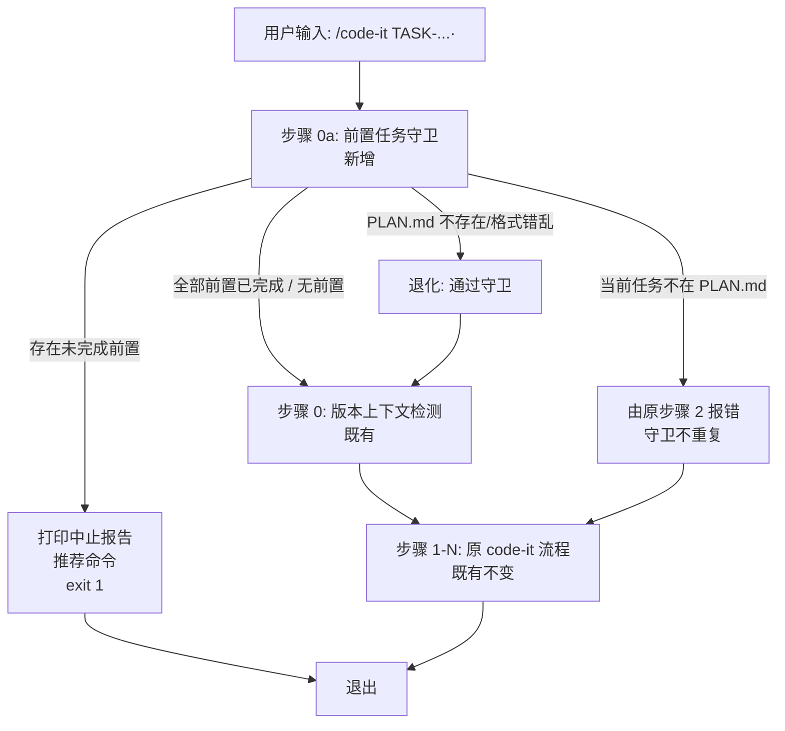

# 概要设计 — REQ-00010(优化 `/code-it`,增加"前置任务"守卫 — 按 `PLAN.md` 登记顺序)

- 需求编码:REQ-00010
- 所属版本:V0.0.2
- 文档版本:v1
- 状态:已完成
- 责任人:wangmiao
- 创建:2026-06-06
- 最近更新:2026-06-06 12:00
- **上游**:`./assistants/V0.0.2/require/REQ-00010/RESULT.md`(v1,2026-06-04 14:36 锁定)
- **遵循规范**:`./assistants/rules/` 下 13 个文件(详 §"规范遵循")
- **设计目标**:`--minimal 最小实现`

## 设计目标

> 由 `code-auto` 注入的"选推荐项"约束要求,本需求默认采纳 **`--minimal 最小实现`**(用户 Q1 回答)
> - 整体设计目标:`--minimal`
> - 维度优先级:功能性=高 / 扩展性=— / 健壮性=中 / 可维护性=高
> - 不预留扩展点;不引入 `--skip-precondition`;"推荐执行命令"只指向第一个未完成前置

## 1. 设计概述

**给 `code-it` 技能新增"步骤 0a 前置任务守卫"**:在"步骤 0 版本上下文检测"**之前**插入一个守卫,从 `plan/REQ-NNNNN/PLAN.md` 任务总览区段按**文件行序**解析所有任务,定位当前任务后,把"位于当前任务之前"的所有任务视为前置任务,逐一检查"开发状态"列;任一前置任务 ≠ `已完成` → 守卫不通过 → 打印"⛔ code-it 中止(存在未完成的前置任务)" + 前置任务状态清单 + "推荐执行命令" + `exit 1`;全部已完成 → 进入原"步骤 0 ~ N"流程;`PLAN.md` 不存在或格式错乱 → **通过**守卫(退化)。

**核心定位**:**零规范变更**(NFR-3 强约束) + **零字段新增**(FR-5.AC-5.2/5.3/5.4) + **不修改 9 个其他 `code-*` 技能**(FR-4.AC-4.1) + **不修改 frontmatter**(NFR-7)。

## 2. 架构方案

### 2.1 修改文件清单
| 文件 | 状态 | 修改方式 | 行范围 |
| --- | --- | --- | --- |
| `plugins/code-skills/skills/code-it/SKILL.md` | **修改**(追加) | `Edit` 工具在"## 标题解析(REQ-00013 新增)"段**后**插入"## 步骤 0a — 前置任务守卫(REQ-00010 新增)"小节 | 锚点 = "## 标题解析" 段后 + "## 工作流程" 段前;新增约 80-120 行 |

### 2.2 架构图(Mermaid)



### 2.3 关键流程(S-1 守卫不通过)

```
[用户输入 /code-it TASK-REQ-00005-003]
  ↓
[步骤 0a: 前置任务守卫]
  ├─ 解析 plan/REQ-00005/PLAN.md 任务总览区段 → [TASK-001, TASK-002, TASK-003]
  ├─ 找到当前任务 TASK-003 位置 = 索引 2
  ├─ 前置任务 = [TASK-001, TASK-002]
  ├─ 读取 TASK-001 开发状态 = 已完成 ✓
  ├─ 读取 TASK-002 开发状态 = 待开始 ✗ ← 未完成
  └─ 存在未完成前置 → 中止
  ↓
[打印中止报告]
  ⛔ code-it 中止(存在未完成的前置任务)

  正在处理: REQ-00005 · <需求标题>(任务 TASK-REQ-00005-003 · <任务标题>)

  前置任务状态:
    ✓ TASK-REQ-00005-001 · <任务标题>(开发状态=已完成)
    ✗ TASK-REQ-00005-002 · <任务标题>(开发状态=待开始)← 未完成
    ✗ TASK-REQ-00005-003 · <任务标题>(当前任务)

  推荐执行 /code-it TASK-REQ-00005-002 · <任务标题> 完成后,再执行 /code-it TASK-REQ-00005-003 · <任务标题>
  ↓
[exit 1]
```

### 2.4 关键流程(S-2 守卫通过)

```
[用户输入 /code-it TASK-REQ-00001-001]
  ↓
[步骤 0a: 前置任务守卫]
  ├─ 解析 plan/REQ-00001/PLAN.md 任务总览区段 → [TASK-001, TASK-002, ...]
  ├─ 找到当前任务 TASK-001 位置 = 索引 0
  ├─ 前置任务 = [] (无前置)
  └─ 无前置 → 守卫通过
  ↓
[打印] ✓ code-it 前置任务守卫通过(无前置任务)
  ↓
[步骤 0: 版本上下文检测] ← 既有不变
  ↓
[步骤 1-N: 原 code-it 流程] ← 既有不变
```

## 3. 关键设计

### 3.1 关键决策(9 项,详 `design-notes.md` §"关键决策")

| # | 决策 | 依据 | 替代方案(被否决) |
| --- | --- | --- | --- |
| 1 | 守卫插入"步骤 0"前,名为"步骤 0a" | FR-1.AC-1.1 + REQ-00005/00009 惯例 | 步骤 0 之后 / 步骤 7 扩展 |
| 2 | 前置信息源 = `PLAN.md` 任务总览**文件行序** | FR-1.AC-1.2 + NFR-3 | 新增"前置任务"字段 / 派生 deps.json |
| 3 | "未完成"判定 = 开发状态 ∈ {`待开始`,`进行中`,`阻塞`} | FR-1.AC-1.5 + Q-2 锁定 | 看"测试状态" / 综合判定 |
| 4 | 中止时退出码 = `1`(非 0) | FR-2.AC-2.4 + NFR-4 | 新增语义化退出码(如 17) |
| 5 | `PLAN.md` 缺失 / 解析失败 → 守卫**通过**(退化) | NFR-6 + E-3/E-5 | 严格守卫,报"PLAN.md 解析失败" |
| 6 | 不修改既有"步骤 7 显式前置任务检查" | FR-3 + NFR-3 | 合并两种机制 |
| 7 | 不引入新依赖 | NFR-1 | — |
| 8 | 不修改 frontmatter | NFR-7 + `skill-conventions §规则 1` | — |
| 9 | 不引入新参数(`--skip-precondition`) | NFR-7 + E1 选定 | v2 评估 |

### 3.2 不变量(9 条,详 `rule-compliance.md` §6)

- **INV-1**:`code-it/SKILL.md` frontmatter(L1-3)字节级不变
- **INV-2**:`code-it/SKILL.md` §"工作流程"步骤 0 ~ 16 内容不变
- **INV-3**:`code-it/SKILL.md` §"缺陷分支"步骤 17 ~ 25 内容不变
- **INV-4**:`code-it/SKILL.md` §"标题解析(REQ-00013 新增)"小节不变
- **INV-5**:`PLAN.md` 模板 / 看板"任务清单"区段 / `dashboard-conventions.md` 不变
- **INV-6**:`marketplace.json` / `plugin.json` 不变
- **INV-7**:9 个其他 `code-*` 技能 SKILL.md 不变
- **INV-8**:`code-auto` FR-4.AC-4.3 "按任务总览行序"逻辑不变
- **INV-9**:`code-unit` / `code-publish` / `code-dashboard` / `code-review` 现有逻辑不变

## 4. 守卫算法(伪代码)

```ts
// 步骤 0a 前置任务守卫
function preTaskGuard(taskNum: string): void {
  // 1. 反推所属需求
  const reqNum = parseReqFromTask(taskNum)  // TASK-REQ-00001-00001 → REQ-00001
  if (!reqNum) {
    // 非任务分支(缺陷分支),守卫不触达
    return
  }
  // 2. 读 PLAN.md
  const planPath = `./assistants/${version}/plan/${reqNum}/PLAN.md`
  if (!fileExists(planPath)) {
    // NFR-6 退化
    log("⚠ PLAN.md 不存在,守卫通过(退化)")
    return
  }
  // 3. 解析任务总览区段
  const tasks = parsePlanOverview(planPath)  // 按文件行序
  // 4. 找到当前任务位置
  const idx = tasks.findIndex(t => t.num === taskNum)
  if (idx === -1) {
    // 任务不在 PLAN.md 中 — 由原 code-it 步骤 2 报错,守卫不重复
    return
  }
  // 5. 前置任务 = 当前任务之前的所有任务
  const preTasks = tasks.slice(0, idx)
  if (preTasks.length === 0) {
    log("✓ 前置任务守卫通过(无前置任务)")
    return
  }
  // 6. 判定每个前置任务
  const unfinished = preTasks.filter(t => t.devStatus !== '已完成')
  if (unfinished.length === 0) {
    log("✓ 前置任务守卫通过(全部已完成)")
    return
  }
  // 7. 中止
  logAbortReport(reqNum, taskNum, tasks, unfinished)
  exit(1)
}
```

## 5. 屏幕输出契约(FR-6.AC-6.2 + REQ-00013 标题解析)

### 5.1 守卫通过
```
✓ code-it 前置任务守卫通过
  任务:TASK-REQ-00001-001 · <任务标题>(无前置任务)
```
或
```
✓ code-it 前置任务守卫通过
  任务:TASK-REQ-00005-002 · <任务标题>(前置 1 个,全部已完成)
```

### 5.2 守卫不通过
```
⛔ code-it 中止(存在未完成的前置任务)

正在处理: REQ-00005 · <需求标题>(任务 TASK-REQ-00005-003 · <任务标题>)

前置任务状态:
  ✓ TASK-REQ-00005-001 · <任务标题>(开发状态=已完成)
  ✗ TASK-REQ-00005-002 · <任务标题>(开发状态=待开始)← 未完成
  ✗ TASK-REQ-00005-003 · <任务标题>(当前任务)

推荐执行 /code-it TASK-REQ-00005-002 · <任务标题> 完成后,再执行 /code-it TASK-REQ-00005-003 · <任务标题>
```

### 5.3 PLAN.md 缺失(退化)
```
⚠ code-it 前置任务守卫:PLAN.md 不存在,守卫通过(退化)
```

## 6. 接口与数据结构

### 6.1 对外接口
**无新增对外接口**(本需求仅改 `code-it` 行为语义,不引入新 API)

### 6.2 数据结构
**无新增数据结构**(本需求**不**修改 `PLAN.md` 模板,前置信息从既有"任务总览"区段文件行序派生)

### 6.3 解析锚点
| 解析对象 | 锚点 | 复用源 |
| --- | --- | --- |
| 任务总览区段 | `^## 任务总览$` | `code-dashboard` 既有解析 |
| 任务表格行 | `^\| .* \|$` | 同上 |
| 任务编码双格式 | `^TASK-(REQ\|BUG)-\d{5}-\d{5}$` / `^(REQ\|BUG)-\d{5}-\d{5}$` | `encoding-conventions §规则 3` + `dashboard-conventions` 沿用 |
| 任务"开发状态"列 | 表格第 6 列(沿用 `parsePlanTaskTitle` 既有列号 5) | REQ-00013 `parsePlanTaskTitle()` 工具函数 |

## 7. 边界与异常(8 条,详 `design-notes.md` §"边界与异常")

| ID | 场景 | 处理 |
| --- | --- | --- |
| E-1 | 无 `.current-version` | 由原 `code-it` 步骤 0 处理(守卫在步骤 0 之后才跑) |
| E-2 | 守卫不通过(存在未完成前置) | 打印中止报告 + 推荐命令 + `exit 1` |
| E-3 | `PLAN.md` 不存在 | 视为"无法判定",守卫通过(NFR-6 退化) |
| E-4 | 当前任务不在 `PLAN.md` 任务总览中 | 视为"任务编码不存在",由原步骤 2 报错 |
| E-5 | `PLAN.md` 任务总览区段格式错乱 | 视为"无法判定",守卫通过(软失败) |
| E-6 | `code-auto` 调 `code-it` 时守卫不通过 | `exit 1` → `code-auto` 中断(NFR-4) |
| E-7 | 多个未完成前置 | 打印所有未完成前置,推荐命令**只**指向第一个 |
| E-8 | 任务编码格式不匹配 | 由原 `code-it` 步骤 1 报错,守卫不触达 |
| E-9 | 任务属于缺陷分支(`TASK-BUG-...`) | 守卫不触达(缺陷分支走 17-25 流程,无 PLAN.md) |
| E-10 | 标题解析失败 | 退化"编号+(无标题)"(沿用 REQ-00013 E-3 退化) |

## 8. 模块拆分

**无新增模块**。**修改**:`plugins/code-skills/skills/code-it/SKILL.md`(追加"步骤 0a"小节)。**复用**:`parsePlanTaskTitle()` / `formatTaskTitle()` / `truncateTitle()`(REQ-00013 沉淀)。

详 `module-breakdown.md`。

## 9. 三方依赖

**无新增三方依赖**(NFR-1 零新增依赖)。仅用既有 `Read` / `Grep` 工具。

详 `dependencies.md`。

## 10. 关联设计

- **同版本**:
  - REQ-00005:首步拉取模式(本设计沿用"步骤 0a"惯例)
  - REQ-00007:`code-auto` 任务循环(NFR-4 双保险)
  - REQ-00009:`code-unit` 守卫(同构)
  - REQ-00013:`code-it` 标题解析(本设计**复用**工具函数)
  - REQ-00017:`code-it` 步骤 14.5 推进看板(锚点参照)
- **跨版本**:REQ-00003(V0.0.1)`code-rule`(本设计不调用)

详 `related-designs.md`。

## 11. 规范遵循

| 条款 | 来源 | 遵循方式 |
| --- | --- | --- |
| SKILL.md frontmatter 不变 | `skill-conventions §规则 1` + NFR-7 | ✅ 增量追加在 frontmatter 之后 |
| 看板字段扩展三方同步 | `dashboard-conventions §规则 1` | ✅ NFR-3 零字段变更,**不**触发本规则 |
| 任务编码双格式正则 | `encoding-conventions §规则 3` | ✅ 沿用 `^TASK-(REQ\|BUG)-\d{5}-\d{5}$` |
| 零新增依赖 | `dependency-conventions` + NFR-1 | ✅ 仅用既有 `Read` / `Grep` |
| 编码风格 | `coding-style` | ✅ 追加小节贴合既有 §"标题解析"格式 |
| 命名约定 | `naming-conventions` | ✅ 任务/需求编码格式严格遵循 |

**规范 vs 现状偏离**:**无**
**规范 vs 需求冲突**:**无**
**用户授权的偏离**:**无**

详 `rule-compliance.md`。

## 12. 验收标准覆盖(对应需求 §10)

| 需求 AC | 本设计对应条款 | 状态 |
| --- | --- | --- |
| AC-1.1 ~ AC-1.8(FR-1) | §2.2 / §2.3 / §4 | ✅ |
| AC-2.1 ~ AC-2.7(FR-2) | §2.3 / §5.2 | ✅ |
| AC-3.1 ~ AC-3.4(FR-3) | §3.1 决策 6 / INV-2/3 | ✅ |
| AC-4.1 ~ AC-4.3(FR-4) | §3.1 决策 6 / INV-7/8/9 | ✅ |
| AC-5.1 ~ AC-5.6(FR-5) | §3.1 决策 6/8 / INV-1/5/6 | ✅ |
| AC-6.1 ~ AC-6.3(FR-6) | §5.1 / §5.2 / §5.3 | ✅ |
| NFR-1 零依赖 | §9 / `dependencies.md` | ✅ |
| NFR-2 增量改 | §2.1 锚点 / INV-2/3/4 | ✅ |
| NFR-3 零规范变更 | INV-5 / `rule-compliance.md` | ✅ |
| NFR-4 与 code-auto 退出码兼容 | §3.1 决策 4 / E-6 | ✅ |
| NFR-5 与 publish/dashboard/review 0 冲突 | INV-9 | ✅ |
| NFR-6 PLAN.md 缺失退化 | §3.1 决策 5 / E-3 | ✅ |
| NFR-7 无 --skip-precondition 参数 | §3.1 决策 9 | ✅ |
| NFR-8 性能 < 1 秒 | 算法为单 PLAN.md 解析 + 任务行扫描,O(n),n<100,无网络,符合 | ✅ |

**总计:22 条 AC 全部覆盖**。

## 13. 后续步骤建议

1. **调 `code-plan REQ-00010`** — 将本设计拆分为可执行任务(预期 1 ~ 2 个任务:`code-it/SKILL.md` 步骤 0a 守卫追加;可选:中英 README 同步追加)
2. **调 `code-it <TASK-...>`** — 实施 `code-it/SKILL.md` 修改
3. **调 `code-review REQ-00010`** — 评审 9 条 INV 是否全部守住
4. **(可选)调 `code-rule`** — 沉淀"步骤 0a 守卫"统一模式(留作 follow-up,本设计不阻塞)

## 14. 变更记录

| 时间 | 版本 | 变更摘要 | 变更人 |
| --- | --- | --- | --- |
| 2026-06-06 12:00 | v1 | 初始创建:沿用需求 6 FR / 8 NFR / ~22 AC;Q1 选 `--minimal`(code-auto 注入"选推荐项"约束);Q-A 选 A1(步骤 0a)+ B1(PLAN.md 文件行序)+ C1(软失败退化)+ D2(REQ-00013 升级版中止报告)+ E1(退出码 1)+ F1(并存);新增 9 条 INV 强约束;复用 REQ-00013 `parsePlanTaskTitle` / `formatTaskTitle` / `truncateTitle`;不修改 9 个其他技能 + 不修改 frontmatter + 零规范变更 | wangmiao |
