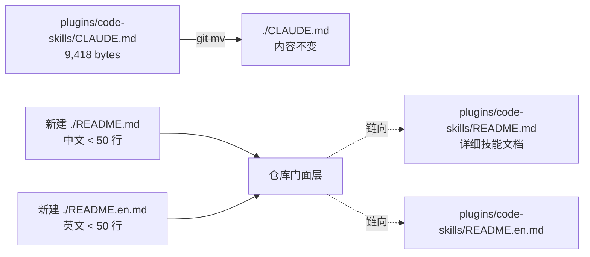

# 概要设计 — REQ-00012(在仓库根创建极简 README + 移动 CLAUDE.md 到根)

- 需求编码:REQ-00012
- 所属版本:V0.0.2
- 设计版本:v1
- 状态:已完成(首次设计)
- 责任人:wangmiao
- 创建:2026-06-05
- 最近更新:2026-06-05
- 上游:`./assistants/V0.0.2/require/REQ-00012/RESULT.md`
- 遵循规范:`./assistants/rules/` 下 13 个文件,核心约束来自 `doc-conventions.md §规则 1 / §规则 2`

---

## 1. 设计目标

把仓库根从"无门面"改造为"标准 GitHub 门面结构":

| 维度 | 改造前 | 改造后 |
| --- | --- | --- |
| 仓库根 `README.md` | 缺失 | 新建(中文,< 50 行) |
| 仓库根 `README.en.md` | 缺失 | 新建(英文,< 50 行,与 `README.md` 章节对仗) |
| 仓库根 `CLAUDE.md` | 缺失 | 由 `plugins/code-skills/CLAUDE.md` `git mv` 而来 |
| `plugins/code-skills/CLAUDE.md` | 存在(9,418 bytes) | **删除**(原位置不再保留) |
| `plugins/code-skills/README.md` | 存在(38,247 bytes) | 保留(详细技能文档) |
| `plugins/code-skills/README.en.md` | 存在(41,949 bytes) | 保留 |

## 2. 架构与数据流

本需求**不**涉及代码模块、API、数据结构,仅是文件系统级别的"门面改造"。架构图如下:

**关键不变量**:
- `git mv` 必须使用(保留 blame 历史,NFR-3)
- 中英 README 必须**同次提交**(`doc-conventions §规则 1`)
- 仓库根 README 严格 < 50 行(NFR-2)
- 原 `plugins/code-skills/CLAUDE.md` 移动后**不保留**(FR-3 AC-3.3 + NFR-8 不提供重定向)

## 3. 模块拆分(代码模块视角)

**本需求为零代码需求,无新增/修改代码模块。** 但从"文档模块"视角:

| 文档模块 | 路径 | 状态 | 职责 | 符合的规范 |
| --- | --- | --- | --- | --- |
| 根 README(中) | `./README.md` | 新建 | 仓库门面:简介 + 快速开始 + 主要能力 + 详细文档链 | `doc-conventions §规则 2` 核心小节 |
| 根 README(英) | `./README.en.md` | 新建 | 英文版,与中文版章节对仗 | `doc-conventions §规则 1` 同次提交 + 章节对仗 |
| 根 CLAUDE.md | `./CLAUDE.md` | 移动(从 `plugins/code-skills/CLAUDE.md`) | Claude Code 自动读取的指引 | N/A(内容移动,非修改) |
| 详细 README(中) | `plugins/code-skills/README.md` | 复用既有 | 详细技能文档(由 `plugins/code-skills/CLAUDE.md` 与本文件共同构成) | NFR-4 不破坏 |
| 详细 README(英) | `plugins/code-skills/README.en.md` | 复用既有 | 详细技能文档英文版 | NFR-4 不破坏 |
| 旧位 CLAUDE.md | `plugins/code-skills/CLAUDE.md` | **删除** | 移动到根目录后,原位置不保留 | FR-3 AC-3.3 + NFR-8 |

## 4. 接口与数据结构

**本需求不涉及对外 API / 数据结构 / 数据库 schema。** 文档模块的"接口"是 Markdown 内部链接:

| 来源 | 目标 | 链接形式 | 强制级别 |
| --- | --- | --- | --- |
| `./README.md` §📖 详细文档 | `plugins/code-skills/README.md` | 相对路径 `./plugins/code-skills/README.md` | FR-1 AC-1.5 |
| `./README.en.md` §📖 Detailed Documentation | `plugins/code-skills/README.md` | 同上 | 规则 1 对仗 |
| 根 README 主要能力 | 9 个 `code-*` 技能 | 列表(技能名 + 用途) | FR-1 AC-1.3(覆盖核心小节) |

## 5. 三方依赖评估

**零新增依赖**(NFR-1)。本需求不引入任何第三方库 / 工具 / 配置文件。

## 6. 关联概要设计

- **本版本(V0.0.2)其他 design**:
  - `./assistants/V0.0.2/design/REQ-00001~REQ-00011/*/RESULT.md`(已存在,8 个)
  - **本需求与上述 design 0 交集**:本需求落地后,**不**触发任何 8 个已落地需求的修改(FR-5 AC-5.5 + NFR-5 强制)
- **跨版本关联**:
  - `./assistants/V0.0.1/require/REQ-00001/RESULT.md` — `plugins/code-skills/README.md` 是 V0.0.1 主语言版本,本需求落地后"仓库根 README 成为新主语言版本"
  - `./assistants/V0.0.1/require/REQ-00003/RESULT.md` — `code-rule` 维护 `doc-conventions.md`,本需求**不**触发规则修订

## 7. 规范遵循与冲突解决

### 7.1 本次参考的规范文件

| 规范文件 | 类别 | 关键约束 |
| --- | --- | --- |
| `doc-conventions.md` | 文档 | §规则 1:中英 README 同次提交 + 章节对仗;§规则 2:核心小节覆盖 |
| `commit-conventions.md` | 提交 | NFR-7:1 行 commit message 习惯 |
| `directory-conventions.md` | 目录 | 占位规则(本次无直接约束) |
| 其他 10 个规范 | 编码/命名/数据等 | 本次不涉及 |

### 7.2 规范 vs 需求冲突

- **无冲突**。需求 FR-6 显式声明严格遵循 `doc-conventions §规则 1 / §规则 2`,与本设计完全一致。

### 7.3 规范 vs 现状偏离

- `doc-conventions §规则 2` 适用范围是 `plugins/code-skills/README.md`,**不**包括新创建的根 README。
  - 影响:根 README 仅受 §规则 1 约束(对仗),**不**强受 §规则 2 核心小节要求
  - 处理:但**实际**编写时,根 README 仍会覆盖"简介 / 快速开始 / 主要能力 / 详细文档链 / 许可证"等小节,以满足 GitHub 项目的"门面级"惯例(FR-1 AC-1.3 隐含)

### 7.4 用户授权的偏离

- 无(本需求所有决策均由 FR/NFR 锁定,无歧义需用户授权)

## 8. 待澄清 / 决策记录

- Q-1 极简度:采纳默认(< 50 行,只含"简介 + 快速开始 + 详细文档链")— 来自 REQ-00012 §12
- Q-2 CLAUDE.md 位置:采纳默认(移动到根目录) — 来自 REQ-00012 §12
- Q-3 旧位保留:采纳默认(不保留) — 来自 REQ-00012 §12
- Q-9 派生任务预警:由 `code-review` 决定(本设计不阻塞)

## 9. 变更记录

| 时间 | 版本 | 变更摘要 | 变更人 |
| --- | --- | --- | --- |
| 2026-06-05 | v1 | 初始创建:6 关键不变量 + 6 文档模块清单 + 0 API/数据/依赖 + 0 规范冲突 + 1 规范-现状偏离(`§规则 2` 适用范围) | wangmiao |
