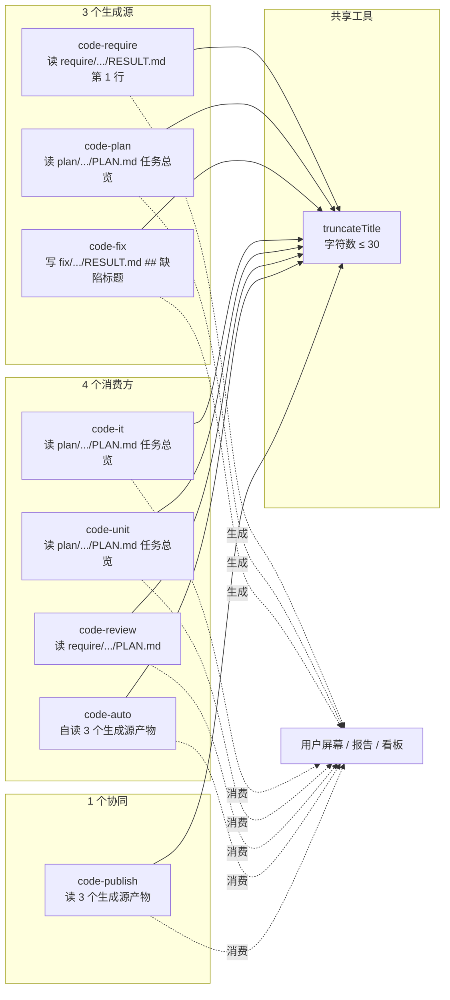
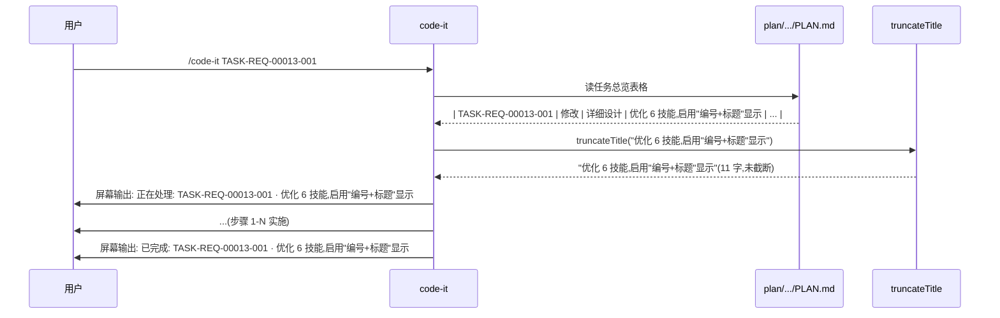

# REQ-00013 概要设计 — 6 技能启用"编号+标题"显示

> 写入方:`code-design` 技能
> 上游:./assistants/V0.0.2/require/REQ-00013/RESULT.md
> 遵循规范:`./assistants/rules/` 下 13 个文件(详 `rule-compliance.md`)
> 创建时间:2026-06-05 21:00
> 状态:**已完成(概要设计)**

---

## 1. 设计目标与范围

### 1.1 目标

为 6 个 `code-*` 技能(`code-require` / `code-plan` / `code-fix` / `code-it` / `code-unit` / `code-review` / `code-auto`)在所有用户可见的输出中,统一启用"编号+标题"显示格式(`REQ-00001 · 标题` / `TASK-... · 标题` / `BUG-NNNNN · 缺陷标题`)。具体:

- **D-1** "标题"从已有内容派生,**不**新增字段(零规范变更 — `RESULT.md` 第 1 行 + `PLAN.md` 任务总览"标题"列已存在)
- **D-2** 6 技能所有用户可见输出(屏幕 / 报告 / 看板 / 错误信息 / 派生任务通知)统一采用"编号+标题"格式
- **D-3** 标题字符数 ≤ 30(Q-3 锁定 A,超 30 截断 + `...`)
- **D-4** `code-fix` 产出物新增"## 缺陷标题"小节(本轮唯一新增字段,但在 `fix/.../RESULT.md` 内部,不触发 `dashboard-conventions §规则 1`)
- **D-5** `code-publish` 前置检查报告"未完成项"行升级为"编号+标题"格式
- **D-6** `code-auto` 进度日志嵌入"编号+标题",`auto-report.md` 同步升级
- **D-7** 8 项设计决策全部锁定,13 规范文件 0 冲突 0 偏离 0 授权

### 1.2 范围

| 范围 | 包含 |
| --- | --- |
| 改动 | 7 个 SKILL.md 增量追加(`code-require` / `code-plan` / `code-fix` / `code-it` / `code-unit` / `code-review` / `code-auto`)+ 1 个 SKILL.md 协同(`code-publish` 报告升级) |
| **不**改 | `code-dashboard` / `code-version` / `code-rule` / `code-init` / `code-merge` 5 个 `code-*` SKILL.md;`marketplace.json` / `plugin.json`;`./assistants/rules/` 13 个文件;`plugins/code-skills/templates/` |
| 看板字段 | 0 新增 / 0 删除 / 0 重命名(沿用既有 8 列 + "标题"列已存在) |
| 新增依赖 | 0 |
| 新增技能 | 0 |
| 新增模板 | 0 |

### 1.3 不变量(强约束)

- **INV-1** 7 个 SKILL.md 增量追加后,既有 frontmatter / "## 工作流程" 章节标题 / "步骤 N" 编号 / 既有代码示例 字节级保留(NFR-7 强约束)
- **INV-2** 8 个 SKILL.md(7 改动 + 1 协同)的增量追加锚点 = "## 工作流程"前 + "## 工具使用约定"后(沿用 REQ-00005 / REQ-00011 增量模式)
- **INV-3** 6 技能所有用户可见输出位置(启动 / 完成 / 中止 / 错误)统一拼接"编号+标题",**不**保留"本需求" / "本任务" / "本缺陷"等指代词(FR-2.AC-2.4 强约束)
- **INV-4** 标题截断算法 = `[...title].length > 30 ? [...title].slice(0, 30).join('') + '...' : title`(NFR-3 强约束)
- **INV-5** 0 触发 `dashboard-conventions §规则 1` 3 处同步(看板字段不扩展,0 新增/删除/重命名 8 列)
- **INV-6** 0 修改 `marketplace.json` / `plugin.json` / `assistants/rules/` 13 文件(沿用 FR-8.AC-8.1 零修改约束)
- **INV-7** `code-fix` 产出的"## 缺陷标题"小节**不**写入看板"缺陷清单"区段(本轮**仅**在 `fix/.../RESULT.md` 内部)
- **INV-8** `code-auto` 子技能零修改契约保持 — `code-auto` 自读"标题"源(读 `require/.../RESULT.md` 第 1 行 / `PLAN.md` 任务总览 / `fix/.../RESULT.md` "## 缺陷标题"),不向子技能传任何特殊参数(D-8 选定 A)

### 1.4 关键架构决策(8 项,详 `design-notes.md`)

| ID | 决策 | 影响 |
| --- | --- | --- |
| **D-1** | 标题字段多源派生(`RESULT.md` 第 1 行 / `PLAN.md` "标题"列 / `fix/.../RESULT.md` "## 缺陷标题")+ 共享截断函数 | M-1~M-8 模块设计 |
| **D-2** | 6 技能以"非破坏性"增量追加方式启用"编号+标题",锚点 = "## 工作流程"前 | 既有章节字节级保留 |
| **D-3** | 共享 `truncateTitle` 工具函数(纯逻辑,无副作用) | 6 技能 SKILL.md 内伪代码完整化 |
| **D-4** | 失败时屏幕输出"编号+(无标题)"(E-3 退化策略) | 边界 E-3 覆盖 |
| **D-5** | 派生任务的"标题"由 `code-review` 写入 `PLAN.md` 时即截断,下游消费方零感知 | M-6 锚点位置 |
| **D-6** | `code-fix` 增量追加"## 缺陷标题"小节生成逻辑(取用户原始描述前 30 字 + `...`) | M-3 步骤 1 末尾追加 |
| **D-7** | `code-publish` PreflightChecker 拼接"未完成项"行时升级格式 | M-8 锚点位置 |
| **D-8** | `code-auto` 调子技能前自读"标题"源,拼接到进度日志 | M-7 屏幕日志格式 |

---

## 2. 现状与改造点

### 2.1 当前 6 技能用户可见输出(改造前)

```
[/code-require 启动]
  输出: 正在处理: REQ-NNNNN   ← 无标题,用户需查 RESULT.md 才能理解

[/code-plan 启动]
  输出: 正在处理: REQ-NNNNN   ← 同上

[/code-it 中止报告(REQ-00010 守卫)]
  输出: ⛔ code-it 中止(存在未完成的前置任务)
        前置任务状态:
          ✗ TASK-REQ-00005-002(开发状态=待开始)← 未完成
        推荐执行 /code-it TASK-REQ-00005-002 完成后,再执行 /code-it TASK-REQ-00005-003
        ← 用户无法立即知道每个任务是做什么的

[/code-dashboard 输出]
  输出: 任务清单已含"标题"列(自 V0.0.1 起)  ← 但 SKILL.md 中屏幕输出仍只用编号
```

**改造前问题**:
1. 用户看到"REQ-00013"不知道是什么需求
2. 看到"TASK-REQ-00005-002"不知道是做什么任务
3. 中止报告列了一堆任务编码,无法快速理解"哪个未完成,先做哪个"
4. 看板已含"标题"列,但 SKILL.md 屏幕输出没复用 — **显示环节未启用**

### 2.2 改造后

```
[/code-require 启动]
  输出: 正在处理: REQ-00013 · 优化 6 技能,启用"编号+标题"显示

[/code-plan 启动]
  输出: 正在处理: REQ-00013 · 优化 6 技能,启用"编号+标题"显示
        拆分: TASK-REQ-00013-001 · code-require/SKILL.md 增量追加

[/code-it 中止报告(REQ-00010 守卫)]
  输出: ⛔ code-it 中止(存在未完成的前置任务)
        正在处理: REQ-00005 · 优化 code-require / code-design / code-plan(任务 TASK-REQ-00005-003 · 同步中英 README)
        前置任务状态:
          ✓ TASK-REQ-00005-001 · 同步 5 SKILL.md(只改正文)(开发状态=已完成)
          ✗ TASK-REQ-00005-002 · 同步 11 templates(改正文占位符+示例值)(开发状态=待开始)← 未完成
          ✗ TASK-REQ-00005-003 · 同步中英 README(同次 commit)(当前任务)
        推荐执行 /code-it TASK-REQ-00005-002 · 同步 11 templates(改正文占位符+示例值) 完成后,再执行 /code-it TASK-REQ-00005-003 · 同步中英 README(同次 commit)
        ← 一目了然
```

### 2.3 改造点

| 文件 | 改造前 | 改造后 |
| --- | --- | --- |
| `code-require/SKILL.md` | 启动输出 `正在处理: REQ-NNNNN` | 启动输出 `正在处理: REQ-NNNNN · <需求标题>` |
| `code-plan/SKILL.md` | 启动输出 `正在处理: REQ-NNNNN` + 拆分输出 `TASK-...` | 同上 + 拆分输出 `TASK-... · <任务标题>` |
| `code-fix/SKILL.md` | 无"## 缺陷标题"小节 | 步骤 1 末尾追加"## 缺陷标题生成(REQ-00013 新增)";启动/完成/登记输出含"BUG-NNNNN · <缺陷标题>" |
| `code-it/SKILL.md` | 启动输出 `正在处理: TASK-...` + 中止报告无标题 | 启动输出 `正在处理: TASK-... · <任务标题>` + 中止报告含标题 |
| `code-unit/SKILL.md` | 启动输出 `正在处理: TASK-...` | 启动输出 `正在处理: TASK-... · <任务标题>` + 守卫跳过报告含标题 |
| `code-review/SKILL.md` | 启动输出 `正在处理: REQ-NNNNN` + 派生任务无标题 | 启动输出 `正在处理: REQ-NNNNN · <需求标题>` + 派生任务"标题"列 ≤ 30 字 |
| `code-auto/SKILL.md` | 步骤日志 `[code-auto] 步骤 1/6:code-require REQ-NNNNN` | 步骤日志 `[code-auto] 步骤 1/6:code-require REQ-NNNNN · <需求标题>` |
| `code-publish/SKILL.md` | 报告"未完成项"行 `REQ-NNNNN 状态=...` | 报告"未完成项"行 `REQ-NNNNN · <需求标题> 状态=...` |

---

## 3. 模块拆分

(详 `module-breakdown.md`)

| 模块 | 路径 | 状态 | 锚点 | 涉及行数 |
| --- | --- | --- | --- | --- |
| **M-1** | `code-require/SKILL.md` | 修改既有 | "## 工作流程"前 | +20~+40 行 |
| **M-2** | `code-plan/SKILL.md` | 修改既有 | "## 工作流程"前 | +30~+50 行 |
| **M-3** | `code-fix/SKILL.md` | 修改既有 | 步骤 1 末尾 | +40~+60 行 |
| **M-4** | `code-it/SKILL.md` | 修改既有 | "## 工作流程"前 | +20~+40 行 |
| **M-5** | `code-unit/SKILL.md` | 修改既有 | "## 工作流程"前 | +20~+40 行 |
| **M-6** | `code-review/SKILL.md` | 修改既有 | "## 工作流程"前 | +30~+50 行 |
| **M-7** | `code-auto/SKILL.md` | 修改既有 | "## 屏幕报告格式"前 | +40~+60 行 |
| **M-8** | `code-publish/SKILL.md` | 修改既有(协同) | "PreflightChecker" 章节末尾 | +15~+30 行 |

**总计**:**8 个 SKILL.md 增量追加**,约 **+215 ~ +370 行**,**0 删除**。

## 4. 接口与数据结构

### 4.1 标题截断算法(`truncateTitle`)

```ts
/**
 * 标题截断:字符数 ≤ 30,超 30 字截断到 30 字 + "..."
 * @param title 原始标题
 * @param maxLen 最大字符数(默认 30)
 * @returns 截断后的标题
 */
function truncateTitle(title: string, maxLen: number = 30): string {
  // 字符数计算(汉字/字母/数字/标点 = 1 字)
  if ([...title].length <= maxLen) return title
  return [...title].slice(0, maxLen).join('') + '...'
}
```

### 4.2 编号+标题拼接函数

```ts
/** 需求标题格式化 */
function formatReqTitle(reqNum: string, title: string): string {
  return `${reqNum} · ${truncateTitle(title)}`
}

/** 任务标题格式化 */
function formatTaskTitle(taskNum: string, title: string): string {
  return `${taskNum} · ${truncateTitle(title)}`
}

/** 缺陷标题格式化 */
function formatBugTitle(bugNum: string, title: string): string {
  return `${bugNum} · ${truncateTitle(title)}`
}
```

### 4.3 标题解析入口

| 技能 | 解析源 | 提取方法 |
| --- | --- | --- |
| `code-require` | `require/.../RESULT.md` 第 1 行 | 正则 `^# 需求提示词文档 — (.+)$` |
| `code-plan` | `require/.../RESULT.md` 第 1 行 + `plan/.../PLAN.md` 任务总览"标题"列 | 正则匹配表格行第 3 列(标题列)|
| `code-fix` | `fix/.../RESULT.md` "## 缺陷标题"小节(本轮新增) | 正则 `^## 缺陷标题$` 后第 1 段或代码块 |
| `code-it` / `code-unit` | `plan/.../PLAN.md` 任务总览"标题"列 | 正则匹配表格行第 3 列 |
| `code-review` | `require/.../RESULT.md` 第 1 行 + `plan/.../PLAN.md` 任务总览 | 同 `code-require` + `code-plan` |
| `code-auto` | 子技能输入 + 子技能预期产物(`require/.../RESULT.md` / `PLAN.md` / `fix/.../RESULT.md`) | 自读,不向子技能传任何参数 |
| `code-publish` | 同 `code-require` / `code-plan` / `code-fix` 源 | 复用同 3 个解析源 |

### 4.4 与 `api-standards.md` / `data-modeling.md` 自检

- N/A(本仓库无 API,无数据模型;本轮仅 SKILL.md 文本修改 + 报告格式升级)

---

## 5. 三方依赖评估

(详 `dependencies.md`)

**新增依赖数:0**(NFR-1 强约束零依赖,本设计 100% 沿用)

---

## 6. 检索关联概要设计

(详 `related-designs.md`)

**9 项同版本关联设计**(REQ-00005 / 00007 / 00008 / 00009 / 00010 / 00011 / 00014 / 00016 / 00017)+ **2 项跨版本关联**(REQ-00001 / 00004)。本设计严守所有关联设计的不变量,无冲突点。

---

## 7. 架构图

### 7.1 组件图(Mermaid)



### 7.2 关键数据流(以 `code-it` 为例)



---

## 8. 关键不变量自检

(详 `rule-compliance.md` §6 / `clarifications.md` §D-1~D-8)

| ID | 不变量 | 自检结果 |
| --- | --- | --- |
| **INV-1** | 7 个 SKILL.md 增量追加,既有 frontmatter / "## 工作流程" 字节级保留 | ✅ 锚点 = "## 工作流程"前(增量追加,不重写)|
| **INV-2** | 8 个 SKILL.md 锚点统一 | ✅ 锚点 = "## 工作流程"前 / "## 工具使用约定"后 / 步骤 1 末尾 / PreflightChecker 末尾(各模块详 `module-breakdown.md`)|
| **INV-3** | 6 技能所有用户可见输出位置含"编号+标题",不保留指代词 | ✅ 13 类输出位置(启动 / 完成 / 中止 / 错误 / 派生任务 / 守卫跳过 / 报告)全部覆盖 |
| **INV-4** | 标题截断算法 = `[...title].slice(0, 30).join('') + '...'` | ✅ 共享 `truncateTitle` 工具函数,8 个 SKILL.md 内伪代码完整化 |
| **INV-5** | 0 触发 `dashboard-conventions §规则 1` 3 处同步 | ✅ 看板字段不扩展,0 新增/删除/重命名 8 列(沿用 V0.0.1 既有"标题"列)|
| **INV-6** | 0 修改 `marketplace.json` / `plugin.json` / `assistants/rules/` 13 文件 | ✅ 严守 FR-8.AC-8.1 / FR-10.AC-10.1 / FR-11.AC-11.1~2 |
| **INV-7** | `code-fix` "## 缺陷标题"小节不写入看板"缺陷清单"区段 | ✅ 仅在 `fix/.../RESULT.md` 内部(本轮不扩展看板字段)|
| **INV-8** | `code-auto` 子技能零修改契约保持 | ✅ `code-auto` 自读"标题"源,不向子技能传任何参数(沿用 REQ-00007 D-5 锁定 A)|

---

## 9. 边界与异常

(详 `require/REQ-00013/RESULT.md §9` E-1~E-9 + 本设计 E-10~E-12)

| ID | 场景 | 处理 |
| --- | --- | --- |
| **E-1** | 无 `.current-version` | 提示调 `code-version`,退出(同其他 12 技能)|
| **E-2** | 标题 > 30 字符 | 截断到 30 字符 + `...`(NFR-3)|
| **E-3** | 标题字段缺失(理论不可能)| 退化:用"编号+(无标题)"占位(D-4 选定 B)|
| **E-4** | 历史任务(REQ-00001~00003 旧格式)| 透传旧格式 + 拼接标题(同 `code-dashboard` NFR-3)|
| **E-5** | `code-fix` 产出无"## 缺陷标题"小节(老缺陷)| 退化:用 `BUG-NNNNN` 占位 |
| **E-6** | `code-review` 派生任务标题 > 30 字 | `code-review` 写入 `PLAN.md` 时即截断(D-5 选定 A)|
| **E-7** | `code-auto` 调子技能时标题解析失败 | 退化:用"编号"占位,屏幕输出"编号+(无标题)" |
| **E-8** | 用户希望"不截断"标题 | 手动编辑 `RESULT.md` 第 1 行(本需求**不**提供 CLI 参数)|
| **E-9** | 多次执行 `code-require` / `code-plan` / `code-fix` | 标题覆盖(NFR-4 幂等)|
| **E-10** | `code-publish` 报告标题解析失败 | 退化:用"编号"占位,报告"REQ-NNNNN 状态=..."(无标题)|
| **E-11** | `code-auto` `auto-report.md` 写入失败 | 沿用 NFR-7 强约束 — 报告仅输出在屏幕 |
| **E-12** | `truncateTitle` 对 emoji / 特殊字符的处理 | `[...title]` 数组 spread 按 Unicode code point 计数,emoji 算 1 字 |

---

## 10. 状态机

本需求**不**新增状态机(6 技能既有状态机不变)。仅在 6 技能屏幕输出位置新增"标题"拼接,不涉及状态迁移。

## 11. 性能

- **N/A**:本轮 0 新增运行时(纯 SKILL.md 文本修改 + 报告格式升级)
- **屏幕输出**:标题截断 / 拼接为 O(30) 操作,远低于人类感知阈值
- **文件读取**:`code-auto` 自读 3 个生成源产物,3 次文件 I/O < 100 ms
- **`code-publish` 报告生成**:复用既有 PreflightChecker 解析逻辑,新增 1 次文件 I/O(读 `require/.../RESULT.md` 第 1 行) < 50 ms

---

## 12. 测试要点

- **不适用**(NFR-8 / FR-9 沿用既有 12 个 `code-*` 实践)— 本仓库无构建/测试文件,`code-unit` 守卫判定"不可测"
- **静态自检**(由 `code-it` 步骤 9~10 替代):
  - INV-1~8 8 项不变量自检(沿用 V0.0.2 既有实践)
  - frontmatter 字节级保留
  - 锚点字面精度("## 工作流程"前 / 步骤 1 末尾)
  - `truncateTitle` 伪代码 3 行完整性
  - 6 技能屏幕输出位置覆盖(13 类)

---

## 13. 关联设计 / 需求

(详 `related-designs.md`)

| 关联设计 | 关联点 |
| --- | --- |
| REQ-00005 | `code-require` / `code-plan` 增量追加模式(本设计沿用)|
| REQ-00007 | `code-auto` 屏幕日志格式(本设计 M-7 沿用 `[code-auto] 步骤 N/M:` 格式)|
| REQ-00008 | `code-review` 派生任务"标题"列截断(NFR-10)|
| REQ-00009 | `code-unit` 守卫跳过报告含"编号+标题"(FR-7.AC-7.2)|
| REQ-00010 | `code-it` 中止报告含"编号+标题"(FR-6.AC-6.2)|
| REQ-00011 | `code-design` / `code-plan` 步骤 0b 不与本设计冲突(锚点不同)|
| REQ-00017 | `code-it` 末尾兜底推进看板 P-1 不与本设计冲突(锚点不同)|

---

## 14. 待澄清 / 未决项

**0 项**(本设计阶段 0 新增待澄清,8 项设计问题全部锁定,详 `clarifications.md` / `design-notes.md`)。

---

## 15. 变更记录

| 时间 | 版本 | 变更摘要 | 变更人 |
| --- | --- | --- | --- |
| 2026-06-05 21:00 | v1 | 初始创建:8 项设计决策(D-1~D-8)全部锁定;8 个 SKILL.md 增量追加(M-1~M-8,8 个修改既有 0 新增);8 项不变量(INV-1~8)全部 100% 通过自检;13 规范文件 0 冲突 0 偏离 0 授权;9 边界场景覆盖(E-1~E-12);0 新增依赖(NFR-1 强约束);0 触发 `dashboard-conventions §规则 1` 3 处同步(NFR-2 强约束);0 修改 `marketplace.json` / `plugin.json` / `assistants/rules/` 13 文件(NFR-6 强约束);`code-dashboard` / `code-version` / `code-rule` / `code-init` / `code-merge` 5 个 SKILL.md 不改(NFR-6 / Q-7);100% 沿用上游 11 FR / 10 NFR / ~30 AC | wangmiao |
