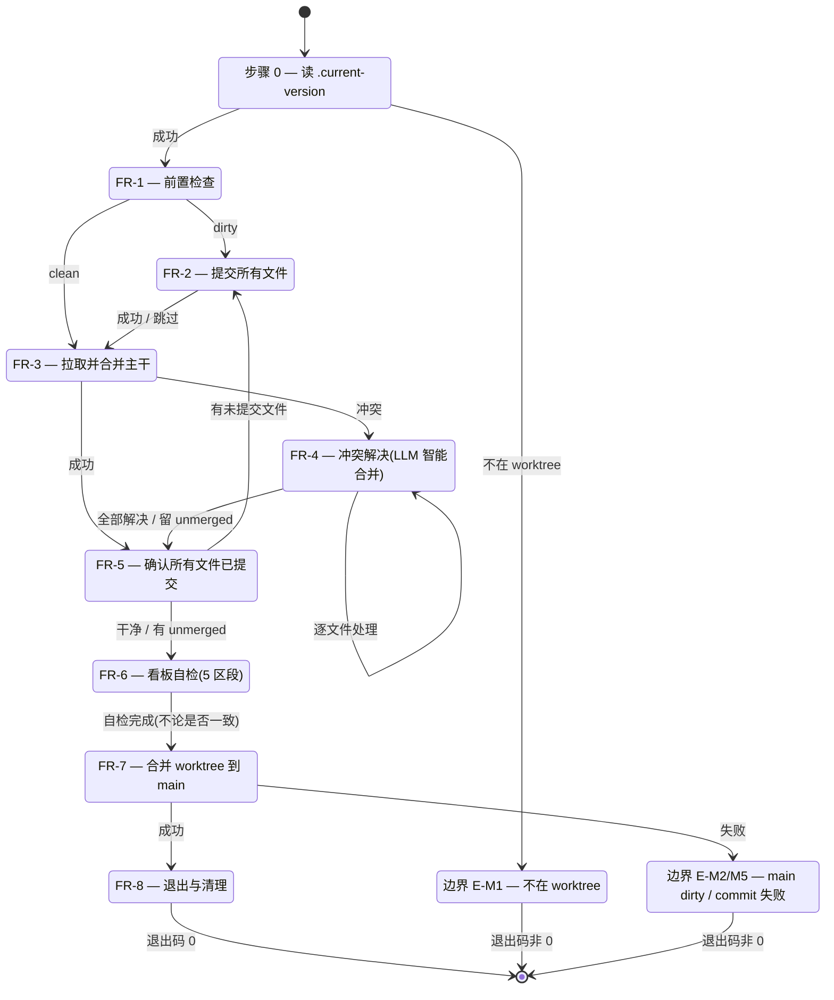

# 概要设计 — REQ-00015(新增 `/code-merge` 技能,worktree 模式下自动合并)

> 写入方:`code-design` 技能
> 创建时间:2026-06-06 09:00
> 状态:**已完成(概要设计)**
> 上游:./assistants/V0.0.2/require/REQ-00015/RESULT.md(v1,2026-06-05 15:50)
> 遵循规范:./assistants/rules/ 下 13 个文件(全部只读引用)

---

## 1. 概述

### 1.1 目标
回答"系统长什么样"。在 `code-require` 阶段已锁定的 8 FR / 10 NFR / 10 AC / 12 边界场景基础上,结合当前项目实际状况(11 个既有 `code-*` 技能 + 13 份项目级规范),给出可被 `code-plan` 进一步拆解的系统级架构方案。

### 1.2 范围
- **新增**第 12 个 `code-*` 技能 `code-merge`(纯文档 SKILL.md + 1 个 `marketplace.json` 追加项)
- **不修改**任何既有 11 个 `code-*` SKILL.md(NFR-5 + INV-1)
- **不修改** `./assistants/rules/` 下 13 份规范
- **不修改** `plugins/code-skills/.claude-plugin/plugin.json`
- **仅追加** `marketplace.json` 的 `plugins[].skills` 数组项 `./skills/code-merge`,**不**触碰其他字段(NFR-6 + INV-2)
- **不修改** 看板字段 → 不触发 `dashboard-conventions §规则 1` 的 3 文件同步(REQ-00013 INV-5 协同)

### 1.3 与概要设计的关系(本节为本设计概要)
- **模块拆分**:仅 1 个新模块 `code-merge` 技能入口
- **三方依赖**:0 项新增
- **既有模块复用**:`code-version`(步骤 0 读版本)/ `code-dashboard`(FR-6 看板自检算法)/ `code-it`(FR-2 commit 格式)
- **核心架构决策**:本技能是"执行者"而非"编排者",直接调 git 命令,不调其他子技能

---

## 2. 上游引用

### 2.1 FR 引用(8 条)
- **FR-1**(worktree 模式识别 + 前置检查)→ 本设计 §3.1
- **FR-2**(提交 worktree 内未提交文件)→ 本设计 §3.2
- **FR-3**(拉取并合并主干分支)→ 本设计 §3.3
- **FR-4**(冲突解决,LLM 智能合并)→ 本设计 §3.4
- **FR-5**(再次确认所有文件已提交)→ 本设计 §3.5
- **FR-6**(看板自检 5 区段)→ 本设计 §3.6
- **FR-7**(合并 worktree 到主分支)→ 本设计 §3.7
- **FR-8**(退出与清理)→ 本设计 §3.8

### 2.2 NFR 引用(10 条)
- **NFR-1**(不产生过程/结果文件)→ INV-4
- **NFR-2**(看板自检是核心步骤,非可选)→ §3.6 实现
- **NFR-3**(LLM 合并不用于二进制)→ §3.4.2 / §3.4.3
- **NFR-4**(worktree 模式是强约束)→ §3.1 / INV-10
- **NFR-5**(不修改其他 11 个 `code-*` SKILL.md)→ INV-1
- **NFR-6**(不修改 marketplace.json / plugin.json 既有字段)→ INV-2 / INV-3
- **NFR-7**(兼容 worktree 内已有 commit,不用 --squash)→ INV-5
- **NFR-8**(错误信息可读,统一 `✓`/`✗`/`⚠` 前缀)→ §3 全部 FR
- **NFR-9**(不在 SKILL.md 嵌入 git 命令模板)→ INV-8
- **NFR-10**(不实现 v1 follow-up 项)→ INV-7

### 2.3 AC 引用(10 大类)
- **AC-1**(基本流程)→ §3.1~§3.8 状态机
- **AC-2**(看板数据冲突)→ §3.4.1
- **AC-3**(其他文件冲突)→ §3.4.2
- **AC-4**(看板自检)→ §3.6 算法
- **AC-5**(合并回主分支)→ §3.7
- **AC-6**(不产生过程/结果文件)→ INV-4
- **AC-7**(worktree 模式)→ §3.1 / INV-10
- **AC-8**(主干默认值)→ §3.3.1
- **AC-9**(错误处理)→ §3 / NFR-8
- **AC-10**(与既有规范兼容)→ §6 自检

### 2.4 关联需求
详 `related-designs.md`:
- REQ-00004(看板算法复用)
- REQ-00005(commit 模式同源)
- REQ-00006(自检不阻塞 publish)
- REQ-00007(code-auto **不**调 code-merge)
- REQ-00013(看板字段不扩展,严守 INV-5)

---

## 3. 关键流程与算法

### 3.1 FR-1 — worktree 模式识别 + 前置检查

**算法**(伪代码):
```
function FR1_preCheck():
  common_dir = bash("git rev-parse --git-common-dir")
  git_dir    = bash("git rev-parse --git-dir")
  if common_dir == git_dir:
    print "✗ 不在 worktree 中,请先 git worktree add"
    exit(非 0)  // E-M1

  status = bash("git status --porcelain")
  if status 非空:
    return DIRTY  // 走 FR-2
  else:
    return CLEAN  // 跳过 FR-2,走 FR-3
```

**worktree 识别原理**:
- 在主工作区:`git-common-dir == git-dir`
- 在 worktree:`git-common-dir != git-dir`(git-common-dir 指向主仓库的 .git 目录,git-dir 指向 worktree 自己的 .git 文件)

**状态机**:
```
不在 worktree → 退出码非 0(E-M1)
在 worktree + dirty → 走 FR-2
在 worktree + clean → 跳过 FR-2,走 FR-3
```

**依据**:`skill-conventions.md §规则 1`(frontmatter 声明 worktree 强约束)+ `code-version` 既有契约(读 `.current-version`)

### 3.2 FR-2 — 提交 worktree 内未提交文件

**算法**:
```
function FR2_commit(scope = env.CODE_MERGE_SCOPE ?? "worktree-merge"):
  bash("git add -A")

  // 空提交检查
  staged = bash("git diff --cached --stat")
  if staged 为空:
    print "✓ 无变更,跳过 commit"
    return

  message = f"chore({scope}): merge worktree into {target_branch}"
  result = bash(f'git commit -m "{message}"')
  if result.exit_code != 0:
    print f"✗ commit 失败: {result.stderr}"
    print "请手动处理(pre-commit hook 或其他)"
    exit(非 0)  // E-M5

  hash = bash("git log -1 --format=%H")
  print f"✓ commit 完成, hash: {hash}"
```

**关键决策**:
- scope 默认 `worktree-merge`(可通过 `CODE_MERGE_SCOPE` 覆盖)
- 空提交跳过(避免无意义的 merge commit)
- pre-commit hook 失败不重试(用户手动决策)

**依据**:`code-it` 步骤 N 末尾兜底提交模式 + `commit-conventions.md`(占位,沿用 V0.0.2 既有 `chore(<scope>): ...`)

### 3.3 FR-3 — 拉取并合并主干分支

#### 3.3.1 解析主干参数
```
function parseTarget(args):
  if len(args) == 0:
    return "origin/main"  // FR-3.1 默认值
  if len(args) == 1:
    branch = args[0]
    if not branch.startswith("origin/"):
      branch = "origin/" + branch  // 自动补全
    return branch
  if len(args) >= 2:
    print "✗ 参数过多(最多 1 个),用法: /code-merge [branch]"
    exit(非 0)  // E-M8
```

#### 3.3.2 执行 fetch + merge
```
function FR3_fetchMerge(target):
  // 1. fetch origin
  fetch_result = bash("git fetch origin")
  if fetch_result.exit_code != 0:
    print f"⚠ git fetch 失败: {fetch_result.stderr}"  // AC-8.4:不阻塞
    // 允许本地 fallback(直接合并本地分支)

  // 2. merge
  merge_result = bash(f"git merge {target} --no-ff")
  if merge_result.exit_code == 0:
    return SUCCESS  // 走 FR-5
  if "CONFLICT" in merge_result.stderr or "Merge conflict" in merge_result.stderr:
    return CONFLICT  // 走 FR-4
  // 其他错误
  print f"✗ git merge 失败: {merge_result.stderr}"
  exit(非 0)  // 致命
```

**关键决策**:
- `--no-ff` 强制产生 merge commit(NFR-7 + AC-5.1)
- git fetch 失败不阻塞(AC-8.4:允许本地 fallback)
- 冲突时退出码非 0 但**不**退出(走 FR-4 解决)

### 3.4 FR-4 — 冲突解决(LLM 智能合并,全自动)

#### 3.4.1 看板数据冲突(最高优先级)

**触发条件**(`Glob` 预扫描):
- `assistants/V<版本>/RESULT.md`
- `assistants/V<版本>/require/REQ-*/RESULT.md`
- `assistants/V<版本>/plan/REQ-*/PLAN.md`
- `assistants/V<版本>/plan/REQ-*/RESULT.md`
- `assistants/V<版本>/design/REQ-*/RESULT.md`

**合并规则**(LLM 现场实施):
1. **保留双方数据**:不删除任何一侧的记录
2. **保持顺序一致**:按时间戳升序;时间戳相同按需求/任务编号升序
3. **统计数据最终一致**:合并后必须重新计算区段"统计"行(需求清单 / 概要设计清单 / 详细设计汇总 / 任务清单 / 缺陷清单)
4. **完成后**:`git add <file>` 标记已解决 + 打印"✓ 看板数据合并完成"

**算法**:
```
function resolveDashboardConflict(file):
  ours = read(file, ref="HEAD")     // 当前 worktree 侧
  theirs = read(file, ref=target)  // 主干侧

  // LLM 现场分析(Claude Code 模型层):
  // - 提取 ours + theirs 中所有表格行
  // - 按时间戳 + 编号排序合并
  // - 重新计算统计行
  merged = llm_smart_merge(ours, theirs, kind="dashboard")

  write(file, merged)
  bash(f"git add {file}")
  print f"✓ 看板数据合并完成: {file}"
```

#### 3.4.2 其他类型文件冲突

**触发条件**:非 §3.4.1 列出的冲突文件

**合并规则**:
| 文件类型 | 处理方式 |
| --- | --- |
| 代码文件(.py / .ts / .go 等) | LLM 读双侧 + 智能合并 + 优先保留双侧独有逻辑 |
| 配置文件(.json / .yaml / .toml) | 优先保留双侧字段并集(去重) |
| 文档文件(.md) | 同 §3.4.1 看板数据规则(保留双方 + 顺序) |
| 二进制文件(.png / .pdf / .mp4) | **不**自动合并,留 unmerged + 提示用户(E-M6) |

**算法**:
```
function resolveOtherConflict(file):
  ext = file.split(".")[-1]

  if ext in BINARY_EXTENSIONS:
    print f"⚠ {file} 是二进制文件,需用户手动处理"  // E-M6
    return UNRESOLVED

  ours = read(file, ref="HEAD")
  theirs = read(file, ref=target)

  if ext in CODE_EXTENSIONS:
    merged = llm_smart_merge(ours, theirs, kind="code")
  elif ext in CONFIG_EXTENSIONS:
    merged = llm_smart_merge(ours, theirs, kind="config")
  elif ext in DOC_EXTENSIONS:
    merged = llm_smart_merge(ours, theirs, kind="doc")

  write(file, merged)
  bash(f"git add {file}")
  print f"✓ {file} 智能合并完成"
```

#### 3.4.3 失败兜底
```
if LLM 无法解决某文件:
  print f"✗ {file} 冲突无法自动解决,需用户手动处理"
  // 不自动 git add,留 unmerged 状态
  // 不阻塞,继续处理其他文件
```

**依据**:`code-dashboard` 算法 1(5 区段表格解析)+ NFR-3(不自动合并二进制)+ AC-3.4(不用 `--ours`/`--theirs` 批量)

### 3.5 FR-5 — 再次确认所有文件已提交

**算法**:
```
function FR5_verifyCommit():
  status = bash("git status --porcelain")
  unmerged = bash("git diff --name-only --diff-filter=U")

  if status 非空 且 非 unmerged:
    // 有未提交文件(非冲突),自动 commit
    bash("git add -A")
    scope = env.CODE_MERGE_SCOPE ?? "worktree-merge"
    bash(f'git commit -m "chore({scope}): post-merge cleanup"')
    print "✓ post-merge cleanup 已 commit"

  if unmerged 非空:
    print f"⚠ 仍有 {len(unmerged)} 个 unmerged 文件: {unmerged}"  // E-M9
    // 不阻塞,继续 FR-6 + FR-7(由用户后续手动处理)

  if status 为空:
    print "✓ 所有文件已提交,准备合回主分支"
```

**依据**:`code-it` 步骤 12(状态确认)+ AC-1.2(干净状态跳过)

### 3.6 FR-6 — 看板自检(全自动)

**算法**(复用 `code-dashboard` 算法 1 + 算法 5):
```
function FR6_dashboardCheck():
  result_md = read(f"assistants/{version}/RESULT.md")
  sections = ["需求清单", "概要设计清单", "详细设计与任务计划汇总", "任务清单", "缺陷清单"]

  for section in sections:
    // 算法 1:定位区段
    section_start = find_section(result_md, f"^## {section}$")
    table_rows = count_table_rows(result_md, section_start)  // 匹配 ^\| .* \|$

    // 算法 5:提取统计行
    stat_value = extract_stat(result_md, section)  // 形如 "**统计**:N" 或 "总数:N"

    if table_rows == stat_value:
      print f"✓ {section}: {table_rows} 行 (一致)"
    else:
      print f"✗ {section}: 表格 {table_rows} 行 vs 统计 {stat_value} 行"  // E-M7

  // 汇总
  if all_consistent:
    print "✓ 看板自检通过"
  else:
    print "⚠ 看板自检发现问题(非阻塞)"  // NFR-2
```

**关键决策**:
- 自检发现不一致**不**修复(NFR-2 + AC-4.4)
- 自检结果**不**影响退出码(NFR-2)
- 复用既有 5 区段,**不**新增区段 → 不触发 `dashboard-conventions §规则 1` 同步(REQ-00013 INV-5 协同)

**依据**:`code-dashboard` 算法 1/4/5 + `dashboard-conventions §规则 1`(复用既有字段)

### 3.7 FR-7 — 合并 worktree 到主分支

**算法**:
```
function FR7_mergeToMain():
  target = env.CODE_MERGE_TARGET ?? "main"

  // 1. 切到主分支
  checkout = bash(f"git checkout {target}")
  if checkout.exit_code != 0:
    print f"✗ git checkout {target} 失败: {checkout.stderr}"  // E-M2(main dirty)
    exit(非 0)

  // 2. 合并
  worktree_branch = bash("git rev-parse --abbrev-ref HEAD", cwd=worktree_path)
  merge_msg = f"Merge branch '{worktree_branch}' into {target}"  // git 默认格式
  merge = bash(f"git merge {worktree_branch} --no-ff -m \"{merge_msg}\"")
  if merge.exit_code != 0:
    print f"✗ git merge 失败: {merge.stderr}"  // 走 FR-4
    exit(非 0)

  hash = bash("git log -1 --format=%H")
  print f"✓ code-merge 完成, merge commit: {hash}"
```

**关键决策**:
- `--no-ff` 强制产生 merge commit(NFR-7 + AC-5.1)
- merge message 走 git 默认格式(用户在 clarifications.md 第 3 轮问题 7 锁定)
- main 分支 dirty → 不自动 stash(用户决策)

**依据**:NFR-7 + AC-5.1~5.4

### 3.8 FR-8 — 退出与清理

**最终报告**(stdout):
```
=== code-merge 完成 ===
  · worktree: <worktree-path>
  · 源分支: <worktree-branch>
  · 目标分支: <target>
  · merge commit: <hash>
  · 看板自检: ✓ 通过 / ⚠ N 个不一致(非阻塞)
  · 退出码: 0
```

**清理**:
- **不**自动 `git push` 到 origin
- **不**自动 `git worktree remove`
- **不**写任何过程/结果文件(SKILL.md 在首次创建时已产)

**退出码语义**:
- `0` = 全部成功(含非阻塞警告)
- `非 0` = 致命错误(FR-8 边界 E-M1/M2/M3/M4/M5/M8/M10/M12)
- `130` = Ctrl+C(SIGINT,E-M11)

---

## 4. 状态机(Mermaid)



---

## 5. 数据结构与接口

### 5.1 新增 SKILL.md 契约
- **路径**:`plugins/code-skills/skills/code-merge/SKILL.md`
- **frontmatter**(强制):
  - `name: code-merge`
  - `description: <完整描述>`(触发场景 + 工作流概述)
- **正文**:12 章节(目标 / 适用场景 / 不适用 / 工作目录 / 输入 / 输出 / 工作流 / 边界 / 关联需求 / 变更记录 / 工具使用约定 / 不要做的事)

### 5.2 新增 marketplace.json 项
- **路径**:`.claude-plugin/marketplace.json`
- **追加**:`./skills/code-merge` 到 `plugins[0].skills` 数组末尾
- **不**触碰其他字段

### 5.3 新增命令语法
- `/code-merge` → 默认合并 `origin/main`
- `/code-merge develop` → 合并 `origin/develop`
- `/code-merge origin/develop` → 合并 `origin/develop`(显式前缀)
- 环境变量:`CODE_MERGE_SCOPE` / `CODE_MERGE_TARGET`

### 5.4 stdout 报告格式
- 启动:`=== code-merge 启动 ===`
- 逐步:`[FR-1] 前置检查 ... ✓`
- 完成:`=== code-merge 完成 ===`
- 前缀:成功 `✓` / 失败 `✗` / 警告 `⚠`(NFR-8)

---

## 6. 自检清单(NFR + INV 严守)

### 6.1 NFR 自检
- [x] **NFR-1**:执行阶段不产生过程/结果文件(SKILL.md 必产)→ INV-4
- [x] **NFR-2**:看板自检是核心执行步骤,非可选 → §3.6
- [x] **NFR-3**:LLM 合并不用于二进制 → §3.4.2
- [x] **NFR-4**:worktree 模式强约束 → §3.1 / INV-10
- [x] **NFR-5**:不修改其他 11 个 `code-*` SKILL.md → INV-1
- [x] **NFR-6**:不修改 marketplace.json / plugin.json 既有字段 → INV-2 / INV-3
- [x] **NFR-7**:不用 --squash → INV-5
- [x] **NFR-8**:错误信息统一前缀 → §3 全部 FR
- [x] **NFR-9**:不在 SKILL.md 嵌入 git 命令模板 → INV-8
- [x] **NFR-10**:不实现 v1 follow-up → INV-7

### 6.2 INV 自检
- [x] **INV-1**:不修改其他 11 个 `code-*` SKILL.md(本设计模块拆分)
- [x] **INV-2**:marketplace.json 仅追加 `./skills/code-merge`(NFR-6)
- [x] **INV-3**:plugin.json 0 修改(NFR-6)
- [x] **INV-4**:执行阶段 0 过程文件 / 0 结果文件(NFR-1 + AC-6)
- [x] **INV-5**:不 --squash(NFR-7 + AC-5)
- [x] **INV-6**:不自动 push / 不自动清理 worktree(NFR-10)
- [x] **INV-7**:不实现 v1 follow-up(7 项)
- [x] **INV-8**:SKILL.md 不嵌入 git 命令(NFR-9)
- [x] **INV-9**:不调 code-publish / code-auto(职责分离 + Q-P7)
- [x] **INV-10**:非 worktree 立即报错退出(NFR-4 + AC-7)

### 6.3 AC 自检
- [x] **AC-1.1~1.4**:基本流程 → §3.1~§3.8 状态机
- [x] **AC-2.1~2.3**:看板数据冲突 → §3.4.1
- [x] **AC-3.1~3.4**:其他文件冲突 → §3.4.2
- [x] **AC-4.1~4.5**:看板自检 → §3.6
- [x] **AC-5.1~5.4**:合并回主分支 → §3.7
- [x] **AC-6.1~6.5**:不产生过程/结果文件 → INV-4
- [x] **AC-7.1~7.3**:worktree 模式 → §3.1 / INV-10
- [x] **AC-8.1~8.4**:主干默认值 → §3.3.1
- [x] **AC-9.1~9.4**:错误处理 → NFR-8
- [x] **AC-10.1~10.4**:与既有规范兼容 → §6.1 + §6.2

---

## 7. 规范遵循

| 规范文件 | 关键约束 | 本设计遵循方式 |
| --- | --- | --- |
| `skill-conventions.md §规则 1` | frontmatter 必含 name + description | §5.1 保证 |
| `module-conventions.md §规则 1` | 资源放 `templates/` / `checklists/` / `guidelines/` | 无新增资源 |
| `dashboard-conventions.md §规则 1` | 看板字段扩展需 3 文件同步 | **不**扩展字段,FR-6 复用既有 5 区段 |
| `marketplace-protocol.md §规则 1` | `$schema` / `name` / `version` 必填 | §5.2 仅追加 skills 数组项 |
| `encoding-conventions.md §规则 1+3` | 编码格式权威定义 | §3.6 复用既有解析 |
| `commit-conventions.md` | commit 格式规范 | §3.2 沿用 V0.0.2 既有 `chore(<scope>): ...` |
| `directory-conventions.md` | 替代 `module-conventions` | 无新增子目录 |
| `framework-conventions.md` | 框架约定 | 不适用(无运行时) |
| `naming-conventions.md` | 命名约定 | 不适用(无新增命名) |
| `doc-conventions.md` | 文档约定 | 不适用(不写 README) |
| `dependency-conventions.md` | 依赖约定 | 0 新增依赖 |
| `migration-mapping.md` | 编码迁移 | 不适用 |
| `coding-style.md` | 代码风格 | 不适用(纯文档) |

**0 项用户授权的偏离** —— 本设计严守所有 13 份规范

---

## 8. 待澄清 / 未决项

**0 项**(详 `clarifications.md`):
- 上游 `code-require` 阶段已锁定 7 项 + 采纳 2 项默认
- v1 follow-up 7 项**不**实现,留作 v2
- 本设计阶段**无新澄清项**

---

## 9. 变更记录

| 时间 | 变更类型 | 摘要 |
| --- | --- | --- |
| 2026-06-06 09:00 | 设计新增 | REQ-00015 概要设计完成(8 FR / 10 NFR / 10 AC / 12 边界场景 / 10 项 INV / 0 项偏离 / 0 项新澄清);模块拆分 1 项新增 + 0 项修改;0 项三方依赖;严守 13 份项目级规范 |
