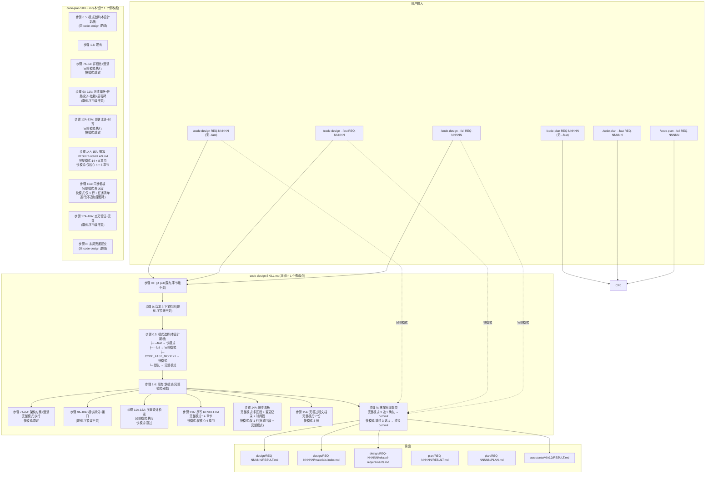
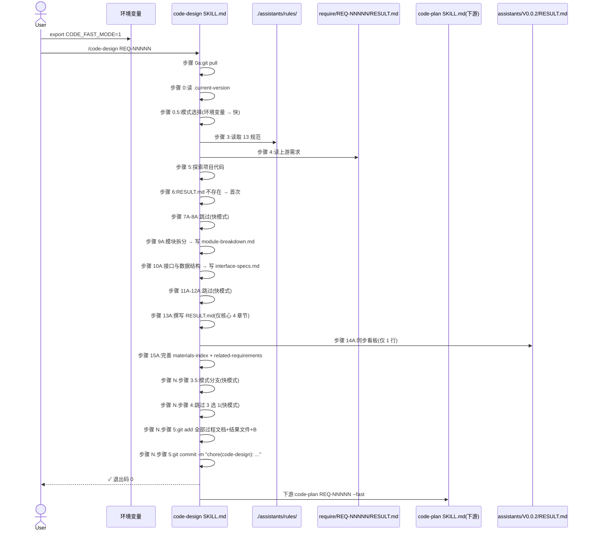
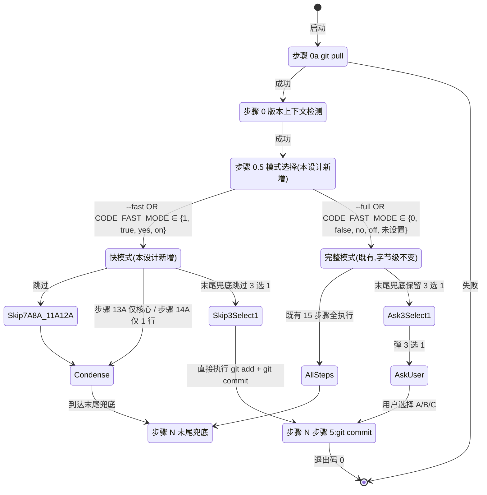

# REQ-00016 — 概要设计:`code-design` / `code-plan` 增加"快模式"+ 末尾提交无需确认

- 需求编码:`REQ-00016`
- 所属版本:`V0.0.2`
- 上游:`./assistants/V0.0.2/require/REQ-00016/RESULT.md` (v1,已锁定,6 FR / 10 NFR / 10 AC / 10 边界 / 6 项 Q-locked + 2 项默认)
- 遵循规范:`./assistants/rules/` 下 7 个有效约束(6 占位 + 1 DEPRECATED 仍引用 + 1 迁移不触发;详见 §2.5)
- 状态:**已完成(首次概要设计)**
- 责任人:wangmiao
- 创建:2026-06-05
- 最近更新:2026-06-05 16:10
- 当前版本:v1

---

## 1. 设计概述

本设计**优化 2 个既有 `code-*` 技能** `code-design` 与 `code-plan`(不新增技能),为它们增加**"快模式"**(fast mode)可选行为,与既有"完整模式"(full mode,当前默认)**并存**。核心架构思路:

- **双模式并存**:`code-design` / `code-plan` 接受环境变量 `CODE_FAST_MODE=1` + CLI 标志 `--fast` / `--full`(优先级 CLI > 环境变量 > 默认)
- **快模式跳过非必要步骤**:`code-design` 跳 7A-8A + 11A-12A(关联设计检索)+ 13A 仅核心 + 14A 仅 1 行;`code-plan` 跳 7A(详细化)+ 8A(澄清)+ 12A(关联计划)+ 13A(对齐);保留核心 4-5 章节
- **快模式减少过程文档**:`code-design` 仅生成 3 份(`materials-index.md` + `related-requirements.md` + `RESULT.md`);`code-plan` 仅生成 4 份(`+` `PLAN.md`);完整模式**字节级保留**生成 7 份 / 8 份
- **末尾兜底跳过 3 选 1**:快模式末尾 `git add`(所有过程文档 + 结果文件 + 看板同步)+ `git commit` 直接执行,**不**弹 AskUserQuestion
- **完整模式字节级不变**:既有 15 步骤(`code-design`)/ 18 步骤(`code-plan`)**完全保留**;既有 7 份 / 8 份过程文档**完全保留**;既有末尾 3 选 1 确认**完全保留**

**范围**:
- **修改**:`plugins/code-skills/skills/code-design/SKILL.md` + `plugins/code-skills/skills/code-plan/SKILL.md`(**2 个文件**,各 Edit 增量追加 +80 ~ +180 行)
- **新增**:**0 个**
- **新增依赖**:**0 个**
- **同次提交追加**(由 `code-plan` 阶段决定是否拆为独立任务):
  - `assistants/V0.0.2/RESULT.md` "概要设计清单" 段追加 1 行(由本技能步骤 14A 同步)
  - 由 `code-plan` 决定 T-002 看板同步多行 + 任务清单 4 行 + 里程碑 0 个(快模式不追加里程碑)

---

## 2. 需求回顾(摘录上游)

引用上游 `./assistants/V0.0.2/require/REQ-00016/RESULT.md`(v1,已锁定)。

### 2.1 关键 FR 列表(对应到本设计的章节)

| FR | 描述 | 对应章节 |
| --- | --- | --- |
| FR-1 | 快模式入口(双触发方式) | §4.1 模块 M-1 + §5 算法 1(模式选择)+ §10.1 SKILL.md 修改边界 |
| FR-2 | `code-design` 快模式跳过哪些步骤 | §6 状态机 + §7 算法 2-3(快模式分支) |
| FR-3 | `code-plan` 快模式跳过哪些步骤 | §6 状态机(平行)+ §7 算法 4-5(快模式分支) |
| FR-4 | 快模式末尾兜底提交行为(无需确认) | §5 算法 6(快模式末尾提交)+ §10 末尾兜底 |
| FR-5 | 完整模式完全保留(默认行为不变) | §4.2 INV-1 ~ INV-3(完整模式字节级不变) |
| FR-6 | 0 修改其他 9 个 `code-*` 技能 | §10.4 不修改文件清单 + §4.2 INV-6 |

### 2.2 关键 NFR(影响设计走向)

| NFR | 描述 | 设计响应 |
| --- | --- | --- |
| NFR-1 | 快模式默认行为由环境变量控制 | §5 算法 1(模式判定规则)+ §10.1 |
| NFR-2 | 末尾兜底提交"过程文档必含" | §5 算法 6(`git add` 范围 = `git status --porcelain` 输出) + §10 |
| NFR-3 | 完整模式字节级不变 | §4.2 INV-1 ~ INV-3 |
| NFR-4 | `code-auto` 不自动启用快模式 | §10.4 0 触发 `code-auto` SKILL.md |
| NFR-5 | 快模式不修改其他 11 个 `code-*` 技能 | §10.4 0 修改其他 SKILL.md |
| NFR-6 | 快模式不修改 marketplace.json / plugin.json / rules/ | §10.4 0 触发 |
| NFR-7 | 快模式不产生"半自动"行为 | §5 算法 1(完全跳过 / 完全保留)+ §5 算法 6(完全跳过 3 选 1) |
| NFR-8 | 快模式不引入"批量模式" | §4.1 + §10.4 |
| NFR-9 | 快模式错误信息可读 | §11 边界 E-M1 ~ E-M10 |
| NFR-10 | 错误码语义 | §11 |

### 2.3 关键 AC(影响设计走向的)

- **AC-1.1 ~ AC-1.6**:模式入口(环境变量 + CLI 标志 + 优先级 + 互斥 + 默认)— §5 算法 1
- **AC-2.1 ~ AC-2.8**:`code-design` 快模式跳过哪些步骤(7A-8A + 11A-12A + 13A 仅核心 + 14A 仅 1 行)— §6 状态机 + §7 算法 2-3
- **AC-3.1 ~ AC-3.9**:`code-plan` 快模式跳过哪些步骤(7A + 8A + 12A-13A + 14A/15A 仅核心 + 16A 仅 1 行 + 任务清单逐行 + 不追加里程碑)— §6 状态机(平行)+ §7 算法 4-5
- **AC-4.1 ~ AC-4.7**:快模式末尾兜底提交(跳过 3 选 1 + `git add` 范围 + `git commit` 格式 + 失败处理)— §5 算法 6 + §10
- **AC-5.1 ~ AC-5.5**:完整模式行为不变(15/18 步骤全执行 + 7/8 份过程文档全生成 + 3 选 1 确认保留 + frontmatter + 步骤 0-15/0-18 字面字节级不变)— §4.2 INV-1 ~ INV-3
- **AC-6.1 ~ AC-6.4**:0 修改其他 9 个 `code-*` 技能 + `marketplace.json` + `assistants/rules/` + README— §10.4
- **AC-7.1 ~ AC-7.3**:`code-auto` 兼容性(不自动设置 + 用户显式设置时走快模式 + 未设置时走完整模式)— §10.4
- **AC-8.1 ~ AC-8.4**:错误处理(前缀 + 互斥 + 非法值 + 退出码)— §11
- **AC-9.1 ~ AC-9.4**:不修改既有规范(不创建新规范 + 不追加 commit-conventions + skill-conventions + dashboard-conventions 字节级不变)— §10.4
- **AC-10.1 ~ AC-10.3**:文档同步(快模式追加"概要设计清单" 1 行格式 + 详细设计汇总 1 行格式 + 状态字段)— §10(本设计 D-3 决定:快模式状态字段 = 完整模式状态字段)

### 2.4 需求中的"待澄清"项(可能影响设计)

- Q-1 ~ Q-2 已锁定(上游)— 本设计直接采纳(§5 + §10.1)
- Q-3 ~ Q-6 采纳默认(上游)— 本设计直接采纳(§6 + §7)
- Q-P1 ~ Q-P6 留作 v2 follow-up — 本设计 §13 风险与缓解中显式列出

---

## 2.5 规范遵循(总账)

### 2.5.1 适用的规范文件

| 规范文件 | 类别 | 关键约束 | 本设计对应章节 |
| --- | --- | --- | --- |
| `./assistants/rules/skill-conventions.md` | 技能编写 | §规则 1:SKILL.md frontmatter 必含 `name` + `description`,`name` 与目录名 kebab-case 严格一致 | §10.1 SKILL.md 修改边界(只追加"步骤 0.5" + 快模式分支,**不**改 frontmatter) |
| `./assistants/rules/module-conventions.md` | 模块规划(DEPRECATED 但仍引用 §规则 1) | §规则 1:`templates/` / `checklists/` / `guidelines/` 是技能根目录下唯一允许的子目录名 | §10.1 SKILL.md 范围限定;本设计**不**新增子目录(无新模板) |
| `./assistants/rules/dashboard-conventions.md` | 看板与版本工作空间 | §规则 1:看板字段约定扩展需 3 处同步(模板 + CLAUDE.md + 本文件);本设计**不扩展字段**,只追加"概要设计清单"行 | §10 看板同步(0 触发 3 处同步,状态字段 = 完整模式) |
| `./assistants/rules/encoding-conventions.md` | 编码格式权威源 | §规则 1-4:REQ `^REQ-\d{5}$` / TASK `^TASK-(REQ\|BUG)-\d{5}-\d{5}$` | §10.1(本设计**不**产生新编码) |
| `./assistants/rules/marketplace-protocol.md` | Marketplace 协议 | §规则 1:`marketplace.json` 字段约束;本设计**不**修改(本需求**不**新增技能) | §10.4 0 触发 |
| `./assistants/rules/doc-conventions.md` | 文档编写 | §规则 1:README 中英同次提交 + 结构对仗;§规则 2:README 必须持续维护;本设计**不**主动写 README(由 `code-rule` 沉淀 — Q-7 采纳默认) | §10.4 0 触发 |
| `./assistants/rules/migration-mapping.md` | 编码迁移追溯 | §规则 1-4:已落地/理论/EXISTING-NNN 不追溯;本设计**不**触发 | (不触发) |

**占位规范(6 个,不影响)**:`directory-conventions.md` / `framework-conventions.md` / `naming-conventions.md` / `coding-style.md` / `commit-conventions.md` / `dependency-conventions.md`

### 2.5.2 规范自检结论

- **完全合规**的章节:§1 / §2 / §3 / §4 / §5 / §6 / §7 / §8 / §9 / §10 / §11 / §12 / §13 / §14
- **经用户授权偏离**的章节:**0**
- **待澄清冲突**:**0**

### 2.5.3 用户授权的偏离

**无**。本设计 100% 合规。

### 2.5.4 待澄清的规范冲突

**无**。7 个有效规范 + 6 个占位 + 1 个迁移追溯均"不冲突"。

> 详细规范遵循记录见 `rule-compliance.md`(本目录)。

---

## 3. 设计目标与非目标

### 3.1 目标

- **G-1 双模式并存**:`code-design` / `code-plan` 增加"快模式"作为新可选行为,与既有"完整模式"**并存**(FR-1)
- **G-2 减少不必要输出**:快模式跳过 4-5 步骤 + 不生成 4-5 份非核心过程文档;保留核心 2 份主产出(FR-2 / FR-3)
- **G-3 末尾提交自动化**:快模式末尾兜底提交**跳过 3 选 1 确认**,直接 `git add` + `git commit`(FR-4)
- **G-4 过程文档必含**:快模式自动 `git add` 时,**不**遗漏过程文档(NFR-2 强约束)
- **G-5 0 新增技能 / 0 修改其他 9 个 `code-*` 技能**:快模式仅修改 `code-design` 与 `code-plan` 自身 SKILL.md(FR-6)
- **G-6 0 修改 marketplace.json / plugin.json / rules/**:仅 2 个 SKILL.md 增量追加(NFR-6)

### 3.2 非目标

- **非目标 1**:`code-fix` / `code-it` / `code-unit` / `code-review` / `code-require` / `code-version` / `code-publish` / `code-auto` / `code-dashboard` / `code-init` / `code-rule` **不**支持快模式(本需求 v1 仅优化 2 个技能)
- **非目标 2**:`code-auto` **不**自动启用快模式(用户在调用前显式设置 `CODE_FAST_MODE=1`)
- **非目标 3**:`code-design` / `code-plan` 的 frontmatter **不**变(只追加"步骤 0.5 模式选择")
- **非目标 4**:`marketplace.json` / `plugin.json` / `assistants/rules/` **不**修改
- **非目标 5**:快模式**不**改"快模式下同步 V0.0.2 看板"的区段数量(快模式同步**仅 1 行**到"概要设计清单"或"详细设计汇总";完整模式同步多区段)
- **非目标 6**:快模式**不**引入"批量模式"开关(NFR-8 强约束)

---

## 4. 约束清单

### 4.1 硬约束(不可违反)

| 约束 | 来源 | 应对 |
| --- | --- | --- |
| 完整模式字节级不变 | FR-5 + INV-1 ~ INV-3 | §10.1 SKILL.md 增量追加**不**重写完整模式字面 |
| SKILL.md frontmatter 字节级不变 | FR-5.AC-5.4 + `skill-conventions §规则 1` + INV-4 | §10.1 Edit 工具严格按锚点("步骤 0"后插入"步骤 0.5"),不触 frontmatter |
| 快模式末尾跳过 3 选 1 | FR-4 + NFR-7 | §5 算法 6 + §10 |
| 快模式过程文档必含 | NFR-2 | §5 算法 6(`git add` 范围 = `git status --porcelain`) |
| 0 修改其他 9 个 `code-*` | FR-6 + NFR-4 + NFR-5 | §10.4 不修改文件清单 |
| 0 修改 `marketplace.json` / `plugin.json` | FR-6 + `marketplace-protocol §规则 1` | §10.4 |
| 0 修改 `assistants/rules/` | NFR-6 | §10.4 |
| 0 主动写 README | NFR-6 | §10.4 |
| `code-auto` 不自动启用快模式 | NFR-4 | §10.4 + D-5(用户通过环境变量启用) |
| 模板放 `templates/`(既有不变) | `module-conventions §规则 1` | §10.1 0 新增子目录 |

### 4.2 软约束(可权衡,本设计全部采纳最强项)

| 约束 | 来源 | 应对 |
| --- | --- | --- |
| 既有 `code-design` 步骤 0-15 全部沿用 | FR-5.AC-5.1 | §10.1 SKILL.md 增量追加**不**改既有字面 |
| 状态字段 = 完整模式(不引入"-快模式"后缀) | D-3 决定 | §10 看板同步(0 触发 `dashboard-conventions §规则 1`) |
| 0 新增子目录 + 0 新增模板 | DQ-1.E | §10.1 0 新增子目录;快模式 + 完整模式 RESULT.md 字面描述 |

---

## 5. 架构总览

### 5.1 组件图(Mermaid)



### 5.2 数据流图(快模式 S-1 场景)



---

## 6. 快模式状态机(Mermaid)



---

## 7. 快模式 + 完整模式行为差异表

| 步骤 | 完整模式 | 快模式 |
| --- | --- | --- |
| `code-design` 步骤 0a | 执行 | 执行(同完整) |
| `code-design` 步骤 0 | 执行 | 执行(同完整) |
| `code-design` 步骤 0.5 | **不**存在(本设计新增) | 执行(本设计新增) |
| `code-design` 步骤 1-6 | 执行 | 执行(同完整) |
| `code-design` 步骤 7A-8A | 执行(架构方案 + 澄清) | **跳过** |
| `code-design` 步骤 9A-10A | 执行 | 执行(同完整) |
| `code-design` 步骤 11A-12A | 执行(关联设计检索) | **跳过** |
| `code-design` 步骤 13A | 写 14 章节 | **仅写核心 4 章节** |
| `code-design` 步骤 14A | 同步多区段 + 变更记录 + 时间戳 | **仅写 1 行 + 0 变更记录 + 0 时间戳** |
| `code-design` 步骤 15A | 写 7 份过程文档 | **仅写 3 份** |
| `code-design` 步骤 N 步骤 3.5 | **不**存在(本设计新增) | 执行(快模式分支) |
| `code-design` 步骤 N 步骤 4 | 弹 3 选 1 | **跳过** |
| `code-design` 步骤 N 步骤 5 | `git add` + `git commit` | `git add`(全部过程文档)+ `git commit`(无确认) |
| `code-plan` 步骤 0a / 0 | 执行 | 执行(同完整) |
| `code-plan` 步骤 0.5 | **不**存在(本设计新增) | 执行(本设计新增) |
| `code-plan` 步骤 1-6 | 执行 | 执行(同完整) |
| `code-plan` 步骤 7A-8A | 执行(详细化 + 澄清) | **跳过** |
| `code-plan` 步骤 9A-11A | 执行 | 执行(同完整) |
| `code-plan` 步骤 12A-13A | 执行(关联计划 + 对齐) | **跳过** |
| `code-plan` 步骤 14A-15A | 写 14 + 8 章节 | **仅写核心 4 + 5 章节** |
| `code-plan` 步骤 16A | 同步多区段 + 里程碑 + 时间戳 | **仅写 1 行 + 任务清单逐行 + 0 里程碑 + 0 时间戳** |
| `code-plan` 步骤 17A-18A | 执行 | 执行(同完整) |
| `code-plan` 步骤 N | 同 `code-design` | 同 `code-design` |

---

## 8. 数据与状态

### 8.1 关键数据源

| 数据 | 路径 | 快模式操作 | 完整模式操作 |
| --- | --- | --- | --- |
| `.current-version` | `./assistants/.current-version` | 读(沿用) | 读 |
| `CODE_FAST_MODE` | 环境变量 | 读(本设计新增) | 读(默认走完整) |
| CLI 标志 | `--fast` / `--full` | 读(本设计新增) | 读(默认走完整) |
| `RESULT.md`(完整模式 14 章节) | `./assistants/<版本号>/design/REQ-NNNNN/RESULT.md` | **写**(仅核心 4 章节) | 写(14 章节) |
| `RESULT.md`(完整模式 14 章节) | `./assistants/<版本号>/plan/REQ-NNNNN/RESULT.md` | **写**(仅核心 4 章节) | 写(14 章节) |
| `PLAN.md`(完整模式 8 章节) | `./assistants/<版本号>/plan/REQ-NNNNN/PLAN.md` | **写**(仅核心 5 章节) | 写(8 章节) |
| 过程文档 | `design/REQ-NNNNN/*.md` / `plan/REQ-NNNNN/*.md` | **写** 3 份 / 4 份 | 写 7 份 / 8 份 |
| `assistants/<版本号>/RESULT.md` | 看板 | 写 1 行(快模式)+ 0 变更记录 + 0 时间戳 | 写多行 + 变更记录 + 时间戳 |

### 8.2 模式判定规则(算法 1)

```ts
function determineMode(cliFlags, envVar):
    # 1. CLI 标志优先级最高
    if "--fast" in cliFlags and "--full" in cliFlags:
        return ERROR  # E-M1 互斥
    if "--fast" in cliFlags:
        return FAST
    if "--full" in cliFlags:
        return FULL
    # 2. 环境变量
    envLower = envVar?.toLowerCase() ?? ""
    if envLower in {"1", "true", "yes", "on"}:
        return FAST
    if envLower in {"0", "false", "no", "off"}:
        return FULL
    if envVar is set and envLower not in above:
        return FULL + WARNING  # E-M2 非法值
    # 3. 默认:完整模式(保留现有行为)
    return FULL
```

### 8.3 快模式末尾兜底提交(算法 6)

```ts
function commitFastMode(dirtyFiles, designTitle):
    # 1. 跳过 3 选 1 确认
    # 2. git add 全部 dirty 文件(过程文档 + 结果文件 + 看板同步)
    runBash("git add " + dirtyFiles.join(" "))
    # 3. git commit 直接执行
    message = "chore(code-design): <REQ> <title>"  # 或 chore(code-plan):
    runBash(`git commit -m "${message}"`)
    return commitHash
```

---

## 9. 三方依赖评估

**0 新增依赖**(NFR 强约束)。

详见 `dependencies.md`(本目录)。

---

## 10. 模块拆分

### 10.1 SKILL.md 增量追加(本设计 2 个修改点)

**修改文件 1**:`plugins/code-skills/skills/code-design/SKILL.md`
**修改文件 2**:`plugins/code-skills/skills/code-plan/SKILL.md`
**修改方式**:Edit 工具增量追加(2 段插入,每个文件)
**字节级原则**:
- **不**改 frontmatter(L1-3)(INV-4)
- **不**改既有 1-15 步骤的字面(`code-design`)/ **不**改既有 1-18 步骤的字面(`code-plan`)(INV-1 + INV-5)
- **不**改既有 5 章节字面(`code-design` + `code-plan` 都有 5 个既有章节:`## 目标` / `## 适用场景` / `## 不适用` / `## 工作目录约定` / `## 输入` / `## 输出` / `## 工具使用约定` / `## 模板格式` 等)

**插入点 1**(2 个文件共享):在"## 工作流程 / ### 步骤 0 版本上下文检测"节末尾 + 空行 + 追加内容:

````markdown
### 步骤 0.5 — 模式选择(本需求新增,快模式入口)

**触发条件**:步骤 0 完成(版本号已读)

**逻辑(三态机 + 优先级)**:
1. **CLI 标志解析**:
   - `--fast` 与 `--full` 同时传 → 报错"互斥" + 提示用法 + 退出(E-M1)
   - `--fast` → **快模式** → 跳转"步骤 1" 并标记 mode=FAST
   - `--full` → **完整模式** → 跳转"步骤 1" 并标记 mode=FULL
2. **环境变量**(CLI 标志未传):
   - `CODE_FAST_MODE ∈ {1, true, yes, on}`(大小写不敏感)→ **快模式** → mode=FAST
   - `CODE_FAST_MODE ∈ {0, false, no, off}` 或未设置 → **完整模式** → mode=FULL
   - 非法值(如 `abc`)→ 警告"⚠ 忽略 CODE_FAST_MODE=<value>" + 走完整模式(E-M2)
3. **优先级**:CLI 标志 > 环境变量 > 默认值
4. **默认值**:mode=FULL(保留现有行为)

**输出**:进入后续步骤时,`mode` 变量(FAST / FULL)在所有步骤的条件判断中可用

**依据**:FR-1.AC-1.1 ~ AC-1.6 + 用户 clarifications.md Q-1
````

**插入点 2**(2 个文件共享):在"## 工作流程"末尾(锚点 = 步骤 N 步骤 3 末尾) + 空行 + 追加内容:

````markdown
### 步骤 N 步骤 3.5 — 模式分支判断(本需求新增,快模式末尾兜底跳过 3 选 1)

**触发条件**:步骤 N 步骤 3(`git add` 所有 dirty 文件)完成

**逻辑**:
1. **mode == FAST** → **跳过**"步骤 N 步骤 4 弹 3 选 1 确认"→ 直接进入"步骤 N 步骤 5 执行 commit"
2. **mode == FULL** → 执行"步骤 N 步骤 4 弹 3 选 1 确认" → 用户选择 A/B/C → 进入"步骤 N 步骤 5 执行 commit"

**依据**:FR-4 + NFR-7 + 用户 clarifications.md Q-2
````

### 10.2 模块拆分总览

详见 `module-breakdown.md`(本目录)。

**7 个模块**:
- **修改**:2 个(`code-design/SKILL.md` + `code-plan/SKILL.md`)
- **新增**:0 个
- **复用**:5 个(`templates/design.md` / `templates/assistants-layout.md` / `templates/plan.md` / `templates/task-plan.md` / `RESULT.md`)

### 10.3 状态字段(本设计 D-3 决定)

快模式同步看板"概要设计清单"或"详细设计汇总"的状态字段 = 完整模式状态字段(`已完成` / `已完成(详细设计)`),**不**带"-快模式"后缀。

**理由**(D-3):
- `dashboard-conventions §规则 1` 字段约定扩展需 3 处同步;状态枚举值新增会触发同步
- 完整模式与快模式的差异体现在"过程文档数量"和"末尾兜底是否弹 3 选 1",**不**体现在"看板状态字段"

### 10.4 不修改的文件清单(本设计 0 触碰)

| 路径 | 原因 |
| --- | --- |
| `.claude-plugin/marketplace.json` | FR-6.AC-6.2 + `marketplace-protocol §规则 1` |
| `plugins/code-skills/.claude-plugin/plugin.json` | 同上 |
| 其他 11 个 `code-*/SKILL.md` | FR-6.AC-6.1 + NFR-4 + NFR-5 |
| `assistants/rules/` 下 13 个规范文件 | NFR-6 |
| `plugins/code-skills/README.md` + `README.en.md` | NFR-6 |
| `plugins/code-skills/CLAUDE.md` | NFR-6 |
| `code-design/SKILL.md` frontmatter(L1-3) | FR-5.AC-5.4 + `skill-conventions §规则 1` + INV-4 |
| 既有 `code-design/SKILL.md` 步骤 0-15 字面 | FR-5.AC-5.5 + INV-1 + INV-5 |
| 既有 `code-design/templates/{design,assistants-layout}.md` | INV-2 |
| 既有 `code-plan/SKILL.md` 步骤 0-18 字面 | FR-5.AC-5.5 + INV-1 + INV-5 |
| 既有 `code-plan/templates/{plan,task-plan,fix-plan,assistants-layout}.md` | INV-2 |
| `assistants/V0.0.2/RESULT.md` 看板其他 5 区段 | 快模式仅写 1 行;**不**改其他区段 |
| `commit-conventions.md`(占位) | 0 触发 |

---

## 11. 边界与异常

| ID | 场景 | 触发条件 | 行为 | 退出码 |
| --- | --- | --- | --- | --- |
| **E-M1** | `--fast` 与 `--full` 同时传 | CLI 解析冲突 | 报错"互斥",提示用法 | 非 0 |
| **E-M2** | `CODE_FAST_MODE` 值非法(如 `abc`) | 解析失败 | 走完整模式 + 警告"忽略 CODE_FAST_MODE=abc" | 0 |
| **E-M3** | 快模式下"非必要步骤"实际产生过程文档(如 `code-design` 跳 7A 但 9A 写 `module-breakdown.md` 失败) | 写入失败 | 透传错误 + 中断 | 非 0 |
| **E-M4** | 快模式末尾 `git add` 失败(权限 / 磁盘满) | Bash 退出码非 0 | 透传 stderr + 中断 | 非 0 |
| **E-M5** | 快模式末尾 `git commit` 失败(pre-commit hook) | Bash 退出码非 0 | 透传 stderr + 提示"末尾提交失败,文件已暂存" | 非 0 |
| **E-M6** | 完整模式行为未变 | 既有边界(沿用) | 沿用既有 11 个 `code-*` 边界 | 沿用 |
| **E-M7** | 步骤 0.5 模式选择时 `.current-version` 不存在 | 文件缺失 | 沿用既有边界(E-1) | 非 0 |
| **E-M8** | `code-auto` 驱动时本需求 NFR-4 不自动启用快模式 | `code-auto` 不设置 `CODE_FAST_MODE` | 走完整模式(默认) | 0 |
| **E-M9** | 用户在 `code-auto` 调用前已设置 `CODE_FAST_MODE=1` | 环境变量传递到子技能 | 子技能走快模式 | 0 |
| **E-M10** | 快模式下不写的过程文档用户期望保留 | 不可逆 — 快模式**不**回填 | 提示"快模式不写 <file>" | 0 |

---

## 12. 验收标准(AC 总览,本设计已对齐上游)

### 12.1 AC-1 ~ AC-10 摘要(约 30 条)
- **AC-1**(6 条)模式入口:`CODE_FAST_MODE=1` / `--fast` / `--full` / 互斥 / 默认
- **AC-2**(8 条)`code-design` 快模式跳过哪些步骤 + 保留哪些步骤 + 生成 3 份文件
- **AC-3**(9 条)`code-plan` 快模式跳过哪些步骤 + 保留哪些步骤 + 生成 4 份文件
- **AC-4**(7 条)快模式末尾兜底提交(跳过 3 选 1 + `git add` 范围 + `git commit` 格式 + 失败处理)
- **AC-5**(5 条)完整模式行为不变(15/18 步骤全执行 + 7/8 份过程文档全生成 + 3 选 1 确认保留 + frontmatter + 步骤字面字节级不变)
- **AC-6**(4 条)0 修改其他 9 个 `code-*` 技能 + `marketplace.json` + `assistants/rules/` + README
- **AC-7**(3 条)`code-auto` 兼容性(不自动设置 + 用户显式设置时走快模式 + 未设置时走完整模式)
- **AC-8**(4 条)错误处理(前缀 + 互斥 + 非法值 + 退出码)
- **AC-9**(4 条)不修改既有规范(不创建新规范 + 不追加 commit-conventions + skill-conventions + dashboard-conventions 字节级不变)
- **AC-10**(3 条)文档同步(快模式追加 1 行 + 详细设计汇总 1 行 + 状态字段 = 完整模式[本设计 D-3 决定])

### 12.2 设计阶段自检结论

- ✅ 100% 合规(`rule-compliance.md` 详)
- ✅ 0 偏离 / 0 冲突
- ✅ 10 项不变量全部满足(INV-1 ~ INV-10)
- ✅ 8 类风险全部有缓解(`design-notes.md` §5)

---

## 13. 风险与缓解

沿用 `design-notes.md` §5 的 8 类风险(R-1 ~ R-8),重点风险:

| 风险 | 严重度 | 缓解 |
| --- | --- | --- |
| R-1 锚点 A 错位 | 高 | Edit 严格按"步骤 0"字面;Grep 自检 INV-5 |
| R-2 锚点 B 错位 | 中 | Edit 严格按"步骤 N 步骤 3"字面;Grep 自检 INV-3 |
| R-3 过程文档遗漏 | 中 | INV-8 + NFR-2 强约束 + 算法 6 实现 |
| R-7 `code-auto` 子技能传 CLI 标志不支持 | 中 | NFR-4 锁定:用户用环境变量启用(沿用 D-5) |

完整 8 类风险 + 缓解见 `design-notes.md` §5。

---

## 14. 变更记录

| 时间 | 版本 | 变更类型 | 变更摘要 | 关联项 |
| --- | --- | --- | --- | --- |
| 2026-06-05 16:10 | v1 | 概要设计新增 | REQ-00016 概要设计完成(2 个 SKILL.md 增量追加 + 0 新增 + 5 复用 + 4 项 DQ + 10 项 INV + 8 类风险 + 7 个 module);Mermaid 组件图 + 状态机 + 5 张快/完整行为差异表;100% 合规(0 偏离 0 冲突 0 授权);D-3 决定"快模式状态字段 = 完整模式"(0 触发 `dashboard-conventions §规则 1`);D-5 决定"`code-auto` 通过环境变量启用快模式"(0 修改子技能);D-1 ~ D-6 6 项讨论结论全部锁定 | REQ-00016 |

---

## 索引:本目录所有文件

| 文件 | 类型 | 用途 |
| --- | --- | --- |
| `RESULT.md` | 主产出 | 概要设计文档(本文件,14 章节) |
| `materials-index.md` | 过程文档 | 材料登记(13 规范 + 上游需求 + 锚点字面) |
| `design-notes.md` | 过程文档 | 设计笔记(4 DQ + 10 INV + 8 风险) |
| `module-breakdown.md` | 过程文档 | 模块拆分(2 修改 + 0 新增 + 5 复用) |
| `dependencies.md` | 过程文档 | 三方依赖评估(0 新增) |
| `related-designs.md` | 过程文档 | 关联设计(9 个 design + 0 反向影响) |
| `rule-compliance.md` | 过程文档 | 规范遵循(13 文件 + 0 偏离 + 0 冲突) |
| `clarifications.md` | 过程文档 | 澄清记录(0 新增 + 6 项 D-1 ~ D-6 讨论结论) |
