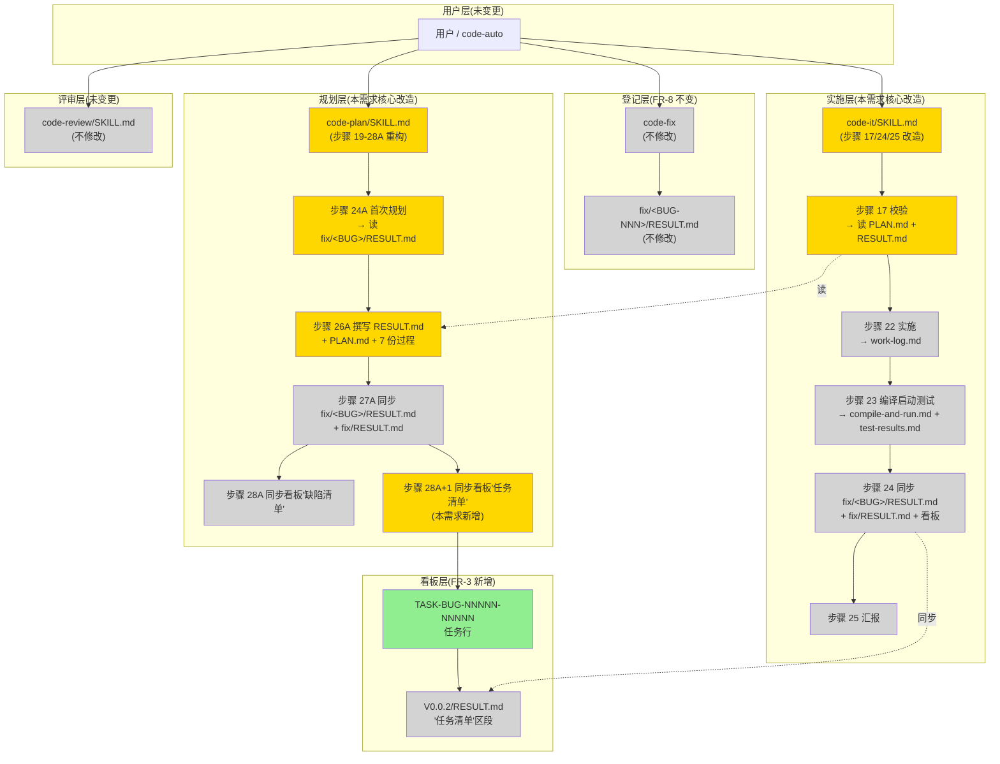
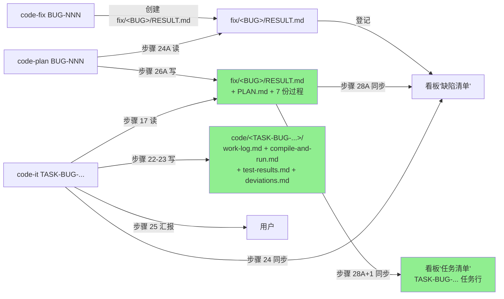

# REQ-00019 — 优化 `/code-plan`,BUG 模式产出物与 REQ 模式同构(概要设计)

- 需求编码:REQ-00019
- 所属版本:V0.0.2
- 上游:`./assistants/V0.0.2/require/REQ-00019/RESULT.md` (v1)
- 遵循规范:`./assistants/rules/` 下 13 个文件(`skill-conventions.md` / `module-conventions.md` / `dashboard-conventions.md` / `encoding-conventions.md` / `dependency-conventions.md` / `marketplace-protocol.md` / `commit-conventions.md` / `doc-conventions.md` / `naming-conventions.md` / `directory-conventions.md` / `coding-style.md` / `framework-conventions.md` / `migration-mapping.md`)
- 状态:已锁定
- 责任人:wangmiao
- 创建:2026-06-06
- 最近更新:2026-06-06 15:00
- 当前版本:v1

## 设计目标

- 整体设计目标:`--minimal`(最小实现;2 个 SKILL.md 改造 + 0 新增抽象层 + 0 新增依赖)
- 维度优先级:
  - 功能性:**中**(必须满足 8 项 FR,沿用既有能力)
  - 扩展性:**—**(本轮不引入新抽象层;沿用 V0.0.2 既有的"任务清单解析锚点"模式)
  - 健壮性:**中**(对 BUG-00001 历史 `fix-plan.md` 退化兼容)
  - 可维护性:**—**(2 文件改造,纯文档,0 新增维护负担)

## 1. 设计概述

本概要设计解决"BUG 修复流程与 REQ 开发流程产出物结构不对称"问题:把 `/code-plan` 技能缺陷分支(从步骤 1.2 判定为 `BUG-NNN` 时)从"产单文件 `fix-plan.md`"升级为"产 `RESULT.md` + `PLAN.md` + 7 份过程文档"与 REQ 模式完全同构,联动改造 `/code-it` 缺陷分支的消费路径,新增 BUG 任务编号 `TASK-BUG-NNNNN-NNNNN` 进看板"任务清单"区段。

**核心思路**:沿用既有 REQ 路径的 9 份文档模板(`templates/plan.md` + `templates/task-plan.md`)作为 BUG 路径的产出物结构;沿用既有看板"任务清单"区段的 12 列字段,仅在 BUG 任务的"任务编号/需求/类型/触发/来源/关联任务"5 列填法上扩展;**0 新增抽象层**,**0 新增依赖**,**0 修改其他 11 个 `code-*` SKILL.md**;`code-plan/SKILL.md` 步骤 19-28A 重构 + `code-it/SKILL.md` 步骤 17-25 4 个锚点改造 = 本轮全部实施量。

## 2. 需求回顾

引用上游 `RESULT.md`,**关键摘录**(完整列表详 `require/REQ-00019/RESULT.md`):

### 2.1 关键 FR(对应到本设计模块)

| FR | 摘要 | 本设计对应章节 |
| --- | --- | --- |
| **FR-1** | `code-plan` 缺陷分支产出 `RESULT.md` + `PLAN.md` + 7 份过程文档 | §5 / §7 模块 1 / §8 接口 1 |
| **FR-2** | `RESULT.md` 14 章节沿用 `templates/plan.md`;`PLAN.md` 8 章节沿用 `templates/task-plan.md` | §5 组件图 / §6 功能域 1 / §7 模块 1 / §8 接口 1 |
| **FR-3** | BUG 任务进看板"任务清单"区段(原区段收录) | §5 组件图 / §6 功能域 2 / §7 模块 3 / §9 数据结构 1 |
| **FR-4** | `code-it` 步骤 17 改读 `PLAN.md` + `RESULT.md` | §5 组件图 / §7 模块 2 / §8 接口 2 |
| **FR-5** | `code-it` 过程文档去 `fix-` 前缀 | §5 组件图 / §7 模块 2 / §9 数据结构 2 |
| **FR-6** | `code-it` 步骤 24 不再写 `fix-plan.md` | §5 组件图 / §7 模块 2 |
| **FR-7** | `code-it` 步骤 25 + frontmatter 同步 | §5 组件图 / §7 模块 2 / §8 接口 3 |
| **FR-8** | `code-fix` 不变(0 改动) | §3 非目标 / §5 组件图(`code-fix` 不在改造范围) |

### 2.2 关键 NFR(目标值)

- **NFR-1 性能**:`code-plan` 缺陷分支 < 5 秒(同 REQ 分支)
- **NFR-2 兼容性**:13 份规范 0 冲突(详 §2.5)
- **NFR-3 可靠性**:本需求后所有新 BUG 走新流程;BUG-00001 不迁移
- **NFR-4 可观测性**:屏幕输出统一格式(沿用 REQ-00013)
- **NFR-5 可维护性**:2 个 SKILL.md 行数变化 ≤ ±20%
- **NFR-6 安全性**:无新增鉴权/加密(纯文档重构)

### 2.3 关键 AC(影响设计走向的验收点)

- **AC-1.1**:`code-plan BUG-00010`(新 BUG)产出 9 份文档(无 `fix-plan.md`)
- **AC-1.2**:`RESULT.md` 14 章节齐全(沿用 `templates/plan.md`)
- **AC-1.3**:`PLAN.md` 8 章节齐全(沿用 `templates/task-plan.md`)
- **AC-1.4**:`PLAN.md` 任务总览含 `TASK-BUG-00010-00001`,触发/来源=缺陷修复
- **AC-2.1**:BUG 任务进看板"任务清单"区段,与 REQ 任务同表
- **AC-2.3**:0 触发 `dashboard-conventions §规则 1` 三同步
- **AC-3.1**:`code-it TASK-BUG-00010-00001` 步骤 17 读 `PLAN.md` + `RESULT.md`
- **AC-3.3**:过程文档去 `fix-` 前缀
- **AC-5.1~5.11**:13 份规范 0 触发

### 2.4 需求中的"待澄清"项

- **0 待澄清**(7 轮 Q-locked 全部锁定,详 `require/REQ-00019/clarifications.md`)

## 2.5 规范遵循

### 2.5.1 适用的规范文件

| 规范文件 | 类别 | 关键约束 | 本设计对应章节 |
| --- | --- | --- | --- |
| `./assistants/rules/skill-conventions.md` | SKILL 编写 | frontmatter `name` 字节级保留;L5 description 段可改 | §7 / §8 |
| `./assistants/rules/module-conventions.md` | 模块摆放 | SKILL.md 在技能根目录;`templates/` 子目录只放模板 | §7 / §10 |
| `./assistants/rules/dashboard-conventions.md` | 看板规范 | §规则 1:新增/删除/重命名区段/列/枚举值/字段语义需三同步 | §2.5.2 / §9 |
| `./assistants/rules/encoding-conventions.md` | 任务编号 | 5+5 位嵌套式 `TASK-REQ-NNNNN-NNNNN` | §9 / §6 |
| `./assistants/rules/dependency-conventions.md` | 依赖 | 0 新增依赖强约束 | §10 |
| `./assistants/rules/marketplace-protocol.md` | 协议 | 0 改 `marketplace.json` / `plugin.json` | §2.5.2 |
| `./assistants/rules/commit-conventions.md` | 提交消息 | `chore(<scope>): <subject>` | §16(变更记录) |
| `./assistants/rules/doc-conventions.md` | 文档 | 中英 README 同次提交 + 章节对仗 | §2.5.2(0 改 README) |
| `./assistants/rules/naming-conventions.md` | 命名 | kebab-case + 沿用既有前缀 | §9(`TASK-BUG-` 沿用 `TASK-`) |
| `./assistants/rules/directory-conventions.md` | 目录 | 过程文档摆放规则 | §9(过程文档在 `fix/<BUG-NNN>/`) |
| `./assistants/rules/coding-style.md` | 编码风格 | 沿用既有 SKILL.md 风格 | §7 / §16 |
| `./assistants/rules/framework-conventions.md` | 框架 | 不涉及(本需求纯文档重构) | — |
| `./assistants/rules/migration-mapping.md` | 迁移 | 不涉及(本需求纯文档重构) | — |

### 2.5.2 规范自检结论

- **完全合规**的章节:§5, §6, §7, §8, §9, §10, §11, §12, §13, §14, §15, §16
- **经用户授权偏离**:无
- **待澄清冲突**:无

### 2.5.3 用户授权的偏离

无。

### 2.5.4 待澄清的规范冲突

无。

## 3. 设计目标与非目标

### 3.1 目标(可衡量)

- G-1:`code-plan BUG-NNN` 产出 9 份文档(`RESULT.md` + `PLAN.md` + 7 份过程文档),沿用 REQ 模式模板(AC-1.1~1.5)
- G-2:`code-it TASK-BUG-...` 步骤 17 读 `PLAN.md` + `RESULT.md`,过程文档去 `fix-` 前缀(AC-3.1~3.6)
- G-3:BUG 任务进看板"任务清单"区段(AC-2.1~2.3)
- G-4:0 触发 `dashboard-conventions §规则 1` 三同步(NFR-2.1)
- G-5:0 触发其他 12 份规范(NFR-2.2~2.8)
- G-6:`code-plan/SKILL.md` + `code-it/SKILL.md` 行数变化 ≤ ±20%(NFR-5.1)

### 3.2 非目标(Out of Scope)

- N-1:不修改 `code-fix`(由 `code-fix` 是上游登记方,登记后状态推进由 `code-fix` 自己负责,FR-8 强约束)
- N-2:不迁移 BUG-00001 历史文件(`fix-plan.md` + 5 份 `fix-` 前缀过程文档保留;`code-plan` 步骤 23 / `code-it` 步骤 17 步骤 22 步骤 24 全部增加 E-1 / E-7 / E-9 / E-11 历史兼容检测)
- N-3:不修改其他 11 个 `code-*` SKILL.md(`code-require` / `code-design` / `code-fix` / `code-unit` / `code-review` / `code-auto` / `code-version` / `code-init` / `code-merge` / `code-publish` / `code-dashboard`)
- N-4:不实现"双文件过渡期"(FR-4 + Q-4 锁定"彻底同步升级")
- N-5:不实现"BUG 任务在缺陷清单区段同步"(BUG 任务仅在"任务清单"区段,不进"缺陷清单"区段,因 `code-fix` 已维护"缺陷清单"区段)
- N-6:不实现"BUG 任务的特殊任务类型"(沿用既有 6 枚举之一"修复",0 新增)
- N-7:不实现"BUG 任务的特殊触发/来源"(沿用既有 13 枚举之一"缺陷修复",0 新增)
- N-8:不实现"BUG 任务的特殊测试状态"(沿用既有 6 枚举,初值=`不适用`或`未编写`)

## 4. 约束清单

### 4.1 硬约束(不可违反)

- **HC-1**:`code-plan/SKILL.md` + `code-it/SKILL.md` frontmatter `name` 字段**字节级保留**(`skill-conventions §规则 1`)
- **HC-2**:`code-plan/SKILL.md` 步骤 0a-18A 既有内容**字节级保留**(锚点 A);**只**追加新锚点 D / E
- **HC-3**:`code-plan/SKILL.md` 步骤 N 既有内容**字节级保留**
- **HC-4**:`code-it/SKILL.md` 步骤 1-16 既有内容**字节级保留**(锚点 F);**只**替换步骤 17/24/25 锚点文字
- **HC-5**:`code-it/SKILL.md` 步骤 17 校验失败 3 类信息**完整保留**(缺 `RESULT.md` / 缺 `PLAN.md` / 状态不符)
- **HC-6**:`code-it/SKILL.md` 步骤 21 处理缺陷状态与本轮起点**字节级保留**(`修复规划中` → `修复编码中`)
- **HC-7**:`code-it/SKILL.md` 步骤 24 同步 `fix/<BUG-NNN>/RESULT.md` + `fix/RESULT.md` + 看板"缺陷清单"**完整保留**
- **HC-8**:`code-it/SKILL.md` 步骤 25 汇报字段**完整保留**(改动的文件清单 / 编译/启动/测试结果 / 关键决策与偏离 / 缺陷状态推进 / 下一步建议)
- **HC-9**:`dashboard-conventions §规则 1` 0 触发(NFR-2.1)
- **HC-10**:13 份规范 0 冲突(NFR-2 全集)

### 4.2 软约束(可权衡)

- **SC-1**:`code-plan/SKILL.md` 步骤 19-28A 重构后行数与既有 REQ 步骤 7A-18A **结构对称**(便于审阅)
- **SC-2**:BUG 任务编号分配算法与 REQ 任务编号分配算法**同构**(沿用 `code-plan/SKILL.md` 步骤 9B "任务编号分配"逻辑)
- **SC-3**:`code-plan` 屏幕输出沿用既有"启动 / 拆分 / 完成 / 中止 / 错误"5 类格式(REQ-00013 沿用)
- **SC-4**:`code-it` 屏幕输出沿用既有"启动 / 完成 / 中止 / 错误"4 类格式(REQ-00013 沿用)

## 5. 架构总览

### 5.1 组件图



**图例**:
- 🟡 **黄色**:本需求改造(`code-plan` / `code-it`)
- 🟢 **绿色**:本需求新增(BUG 任务在看板)
- ⬜ **灰色**:沿用既有(`code-fix` / `code-review` / 看板既有区段)

### 5.2 数据流图



### 5.3 关键数据流路径

| 路径 | 起点 | 终点 | 关键约束 |
| --- | --- | --- | --- |
| **P-1**:BUG 登记 | `code-fix` | `fix/<BUG>/RESULT.md` | 沿用既有(FR-8 不变) |
| **P-2**:BUG 规划(本需求) | `code-plan` | `fix/<BUG>/RESULT.md` + `PLAN.md` + 7 份过程 + 看板"任务清单" | FR-1 ~ FR-3 |
| **P-3**:BUG 实施(本需求) | `code-it` | `code/<TASK-BUG-...>/work-log.md` 等 4 份过程文档 | FR-4 ~ FR-7 |
| **P-4**:状态推进 | `code-fix` | `fix/<BUG>/RESULT.md` 状态字段 | 沿用既有 |

## 6. 功能架构

### 功能域 1:BUG 修复流程结构同构

- **目的**:BUG 修复流程的产出物、任务管理、消费路径与 REQ 开发流程完全对齐
- **涉及模块**:
  - `code-plan/SKILL.md` 步骤 19-28A 重构
  - `code-plan/templates/plan.md` + `templates/task-plan.md` 模板沿用
  - `code-it/SKILL.md` 步骤 17 / 24 / 25 改造
- **协作方式**:`code-plan` 写 → `code-it` 读(单一职责:`code-plan` 产出,`code-it` 消费)
- **入口与出口**:
  - 入口:`/code-plan BUG-NNN` / `/code-it TASK-BUG-...`
  - 出口:`fix/<BUG>/RESULT.md` + `PLAN.md` + 看板"任务清单"区段 + `code/<TASK-BUG-...>/work-log.md` 等

### 功能域 2:BUG 任务可视化

- **目的**:BUG 任务与 REQ 任务同表展示,统一看板视图
- **涉及模块**:
  - `code-plan` 步骤 28A+1 同步"任务清单"区段
  - `code-it` 步骤 P-1(REQ-00017 沿用)推进 BUG 任务开发状态
  - `code-dashboard` 看板解析(沿用既有,无修改)
- **协作方式**:`code-plan` 写 → 看板展示 → `code-dashboard` 读
- **入口与出口**:
  - 入口:`code-plan` 步骤 28A+1
  - 出口:看板"任务清单"区段 + `code-dashboard` 屏显

## 7. 模块划分

### 7.1 模块总览

| 模块名 | 路径 | 状态 | 职责 | 对外接口 | 依赖 |
| --- | --- | --- | --- | --- | --- |
| `code-plan/步骤 19-28A` | `plugins/code-skills/skills/code-plan/SKILL.md` L588-735 | **修改既有** | BUG 路径产出 9 份文档 | §8 接口 1 | 0 依赖新增 |
| `code-plan/templates/plan.md` | `plugins/code-skills/skills/code-plan/templates/plan.md` | **复用既有** | 详细设计模板 | — | — |
| `code-plan/templates/task-plan.md` | `plugins/code-skills/skills/code-plan/templates/task-plan.md` | **复用既有** | 任务计划模板 | — | — |
| `code-plan/templates/fix-plan.md` | `plugins/code-skills/skills/code-plan/templates/fix-plan.md` | **复用既有**(留作历史) | 旧 BUG 路径模板 | — | — |
| `code-it/步骤 17-25` | `plugins/code-skills/skills/code-it/SKILL.md` L638-800 | **修改既有** | BUG 路径消费 9 份文档 | §8 接口 2 | 0 依赖新增 |
| `code-it/步骤 0b.0` | `plugins/code-skills/skills/code-it/SKILL.md` §"代码 auto 上下文检测" | **复用既有**(沿用 BUG-00001) | 步骤 0b 触发前 `code-auto` 上下文检测 | — | — |
| `code-fix/SKILL.md` | `plugins/code-skills/skills/code-fix/SKILL.md` | **不修改**(FR-8 强约束) | BUG 登记 | §8 接口 4 | — |
| `V0.0.2/RESULT.md` "任务清单"区段 | `assistants/V0.0.2/RESULT.md` | **修改既有** | 接收 BUG 任务行追加 | — | — |

### 7.2 新增模块

无(本需求 0 新增模块;沿用既有 `code-plan` / `code-it` / `code-fix` / `code-review` / `code-dashboard` 5 个技能)。

### 7.3 复用既有模块

- **`code-plan/templates/plan.md`**:14 章节详细设计模板(`code-plan/SKILL.md` 步骤 14A 沿用),BUG 路径**复用**作为 `RESULT.md` 模板。**引用位置**:`plugins/code-skills/skills/code-plan/SKILL.md` L436-441 "步骤 14A — 撰写 RESULT.md"。
- **`code-plan/templates/task-plan.md`**:8 章节任务计划模板(`code-plan/SKILL.md` 步骤 15A 沿用),BUG 路径**复用**作为 `PLAN.md` 模板。**引用位置**:`plugins/code-skills/skills/code-plan/SKILL.md` L453-461 "步骤 15A — 撰写 PLAN.md"。
- **`code-fix/SKILL.md`**:BUG 登记,沿用既有(FR-8 强约束)。**引用位置**:`plugins/code-skills/skills/code-fix/SKILL.md` L185-200 "步骤 0-1"。
- **`code-it/SKILL.md` 步骤 21**:处理缺陷状态与本轮起点(沿用既有),**不修改**。**引用位置**:`plugins/code-skills/skills/code-it/SKILL.md` L677-686。
- **`code-dashboard`**:看板解析(沿用既有,无修改)。**引用位置**:`plugins/code-skills/skills/code-dashboard/SKILL.md`。

### 7.4 修改既有模块

- **`code-plan/SKILL.md` 步骤 19-28A`(L588-735)`**:
  - **变更点**:
    1. 步骤 19-22(读缺陷上下文 / 读规范 / 探索代码 / 检查文件) — 既有内容保留,文字微调
    2. 步骤 23 — 增加 E-1 边界(检测历史 `fix-plan.md`)
    3. 步骤 24A(首次规划) — 重写为"产出 `RESULT.md` + `PLAN.md` + 7 份过程文档";关键决策旁标注"依据规范"
    4. 步骤 25A(用户对齐) — 既有内容保留
    5. 步骤 26A(撰写文档) — 改为"按 `templates/plan.md` + `templates/task-plan.md` 同构产出"
    6. 步骤 27A(同步 `fix/<BUG>/RESULT.md` 与 `fix/RESULT.md`) — 既有内容保留
    7. 步骤 28A(同步版本看板"缺陷清单") — 既有内容保留
    8. **步骤 28A+1(本需求新增)**:同步版本看板"任务清单"区段(从 `PLAN.md` 任务总览批量登记,**触发/来源**=**缺陷修复**)
  - **变更对既有调用方的影响**:`code-it` 步骤 17 消费方联动改造(见下文);其他调用方(`code-review` 评审 / `code-dashboard` 看板)沿用既有解析
- **`code-it/SKILL.md` 步骤 17-25`(L638-800)`**:
  - **变更点**:
    1. **frontmatter L5 description** — 改"从 `fix-plan.md` 读取修复方案" → "从 `PLAN.md` 读取修复任务列表"
    2. **步骤 17**(校验缺陷与修复方案存在)— 改为读 `PLAN.md` + `RESULT.md`,**不**读 `fix-plan.md`;增加 E-7 边界(检测历史 `fix-plan.md` 退化)
    3. **步骤 22**(实施修复)— 过程记录改为追加到 `code/<TASK-BUG-...>/work-log.md`;增加 E-9 边界(检测历史 `fix-work-log.md` 退化)
    4. **步骤 23**(编译/启动/测试)— 改为 `code/<TASK-BUG-...>/compile-and-run.md` / `test-results.md`
    5. **步骤 24**(同步)— **不**再写 `fix-plan.md`;增加 E-11 边界(同 E-7)
    6. **步骤 25**(汇报)— 改"同步的文件"字段描述
  - **变更对既有调用方的影响**:`code-auto` 调 `code-it BUG-NNN` 时,新路径触发(BUG-00001 修复方案 A3 脏标记文件继续生效)

## 8. 接口概要

### 8.1 新增接口

#### 接口 1:`code-plan` 步骤 28A+1(本需求新增)

- **形式**:函数 / 章节(非 RESTful,文档内函数)
- **路径/签名**:
  ```
  ### 步骤 28A+1 — 同步版本看板'任务清单'区段(本需求 REQ-00019 新增,2026-06-06 起生效)
  ```
- **请求结构**:
  - 输入:`./assistants/<版本号>/fix/<BUG-NNN>/PLAN.md` 任务总览
- **响应结构**:
  - 输出:版本看板 `./assistants/<版本号>/RESULT.md` "任务清单"区段追加 N 行(每条 BUG 任务一行)
- **错误码**:无(纯文档写入)
- **鉴权**:无
- **版本策略**:本需求后所有新 BUG 适用(FR-3 NFR-3.1)

#### 接口 2:`code-it` 步骤 17(本需求改造)

- **形式**:函数 / 章节(非 RESTful,文档内函数)
- **路径/签名**:
  ```
  ### 步骤 17 — 校验缺陷与修复方案存在(本需求 REQ-00019 修订,2026-06-06 起生效)
  ```
- **请求结构**:
  - 输入:`./assistants/<版本号>/fix/<缺陷编号>/RESULT.md` + `./assistants/<版本号>/fix/<缺陷编号>/PLAN.md`
- **响应结构**:
  - 校验通过:进入步骤 18
  - 校验失败:报错 + 退出(沿用既有 3 类信息)
- **错误码**:无(纯文档校验)
- **鉴权**:无
- **版本策略**:本需求后所有新 BUG 适用

#### 接口 3:`code-it` frontmatter description 段(本需求修订)

- **形式**:YAML frontmatter 字段
- **路径/签名**:`plugins/code-skills/skills/code-it/SKILL.md` L5
- **变更前**:
  ```
  - **缺陷编号**(格式 `BUG-NNNNN`,如 `BUG-00001`):所有产出物写入 `./assistants/<版本号>/fix/<缺陷编号>/`(以 `fix-` 前缀命名的过程文档),从 `./assistants/<版本号>/fix/<缺陷编号>/RESULT.md` 读取缺陷详情,从 `./assistants/<版本号>/fix/<缺陷编号>/fix-plan.md` 读取修复方案
  ```
- **变更后**:
  ```
  - **缺陷编号**(格式 `BUG-NNNNN`,如 `BUG-00001`):所有产出物写入 `./assistants/<版本号>/fix/<缺陷编号>/`(主详细设计 `RESULT.md` + 任务列表 `PLAN.md`,沿用 REQ 路径同构产出),从 `./assistants/<版本号>/fix/<缺陷编号>/RESULT.md` 读取缺陷详情,从 `./assistants/<版本号>/fix/<缺陷编号>/PLAN.md` 读取修复任务列表
  ```

### 8.2 扩展既有接口

无。

### 8.3 修改既有接口

无(本需求只改 SKILL.md 章节描述与 frontmatter L5 description;不修改 SKILL.md 暴露的对外接口,即 CLI 调用方式 `code-plan BUG-NNN` / `code-it TASK-BUG-...` 不变)。

### 8.4 调用外部接口

- **`./assistants/<版本号>/fix/<BUG-NNN>/RESULT.md`**:由 `code-fix` 维护,本需求**不修改**。
- **`./assistants/<版本号>/fix/<BUG-NNN>/investigation.md`**:由 `code-fix` 创建(可选),本需求**不修改**。
- **`./assistants/<版本号>/RESULT.md` "任务清单"区段**:由 `code-plan` 步骤 16A(REQ 路径)+ 步骤 28A+1(BUG 路径,本需求新增)共同维护。

## 9. 数据结构

### 9.1 新增实体

#### 实体 1:`TASK-BUG-NNNNN-NNNNN` 任务编号

- **格式**:`TASK-BUG-NNNNN-NNNNN`(5+5 位嵌套式)
- **示例**:`TASK-BUG-00010-00001`、`TASK-BUG-00010-00002`
- **编号分配**:同 REQ 任务编号(`code-plan/SKILL.md` 步骤 9B "任务编号分配"逻辑)
- **与 `TASK-REQ-NNNNN-NNNNN` 的关系**:**风格一致**;**字段含义不同**:任务编号前缀区分输入类型(`BUG` / `REQ`)
- **依据规范**:`./assistants/rules/encoding-conventions.md §规则 1/3`(5+5 位嵌套式)

### 9.2 修改既有实体

#### 实体 2:版本看板"任务清单"区段行字段(本需求扩展填法)

| 字段 | REQ 任务填法 | BUG 任务填法(本需求新增) | 字段语义变化 |
| --- | --- | --- | --- |
| 任务编号 | `TASK-REQ-NNNNN-NNNNN` | `TASK-BUG-NNNNN-NNNNN` | 沿用 5+5 位嵌套式,新增 `BUG` 前缀 |
| 需求 | `REQ-NNNNN` | `BUG-NNN` | **沿用既有列**,列语义不变;值类型从 5 位扩展到 3 位 |
| 类型 | 6 枚举(新增/修改/重构/修复/测试/文档) | **`修复`**(沿用既有 6 枚举之一) | **0 新增枚举** |
| 触发/来源 | 13 枚举(需求新增/需求变更/.../审查改修) | **`缺陷修复`**(沿用既有 13 枚举之一) | **0 新增枚举** |
| 标题 | 沿用 REQ-00013 标题解析 | 沿用 REQ-00013 标题解析(用 `formatTaskTitle` + `truncateTitle`) | 沿用 |
| 开发状态 | 6 枚举 | 同(沿用) | 沿用 |
| 测试状态 | 6 枚举 | 同(沿用) | 沿用 |
| 涉及文件 | 留空 → `code-it` 完成时填入 | 同(沿用) | 沿用 |
| 完成时间 | `code-it` 完成时填入 | 同(沿用) | 沿用 |
| 提交哈希 | `code-it` 完成时填入 | 同(沿用) | 沿用 |
| 关联任务 | 沿用(审查改修场景) | **`BUG-NNN`**(自查) | 沿用既有"关联任务"列,值从审查改修任务变成本缺陷自查 |

**关键**:所有字段**0 新增**,所有枚举值**0 新增**;仅在既有"任务清单"区段内**新增** BUG 任务行(用既有字段填法)。**0 触发** `dashboard-conventions §规则 1` 三同步。

### 9.3 数据生命周期

| 数据 | 留存期限 | 清理策略 | 备份策略 |
| --- | --- | --- | --- |
| `fix/<BUG-NNN>/RESULT.md` | 永久(沿用既有) | 不清理(沿用) | git 提交历史(沿用) |
| `fix/<BUG-NNN>/PLAN.md`(本需求新增) | 永久 | 不清理 | git 提交历史 |
| `fix/<BUG-NNN>/fix-plan.md`(本需求后**不**再生成) | 历史文件保留 | 不清理(BUG-00001 历史) | git 提交历史 |
| 看板"任务清单"区段 BUG 任务行 | 永久 | 不清理 | git 提交历史 |

## 10. 三方依赖

### 10.1 复用既有依赖

- 既有 `Bash` / `Read` / `Write` / `Edit` / `Glob` / `Grep` / `AskUserQuestion` 7 个工具(无新增,沿用 V0.0.2 既有)

### 10.2 新增依赖

**无新增依赖**(`dependency-conventions` 强约束;NFR-1)。

### 10.3 拒绝引入的依赖及理由

无评估过的依赖(本需求 0 新增)。

## 11. 集成点

### 11.1 与既有 `code-fix` 的集成

- **共享数据/状态**:`fix/<BUG-NNN>/RESULT.md`(由 `code-fix` 写入;`code-plan` 步骤 24A 读取;`code-it` 步骤 21 推进状态)
- **调用既有 API**:无
- **提供新 API 给既有调用方**:无(`code-fix` 自身**不**调用 `code-plan` / `code-it`;由用户串联)
- **部署/网络/鉴权层面的衔接**:无(纯本地文件操作)

### 11.2 与既有 `code-dashboard` 的集成

- **共享数据/状态**:版本看板"任务清单"区段(由 `code-plan` 步骤 16A + 28A+1 写入;`code-dashboard` 读取并展示)
- **调用既有 API**:无
- **提供新 API 给既有调用方**:无(`code-dashboard` 解析既有"任务清单"区段;0 修改)
- **部署/网络/鉴权层面的衔接**:无

### 11.3 与既有 `code-review` 的集成

- **共享数据/状态**:`PLAN.md` 任务总览(由 `code-plan` 步骤 15A 写入;`code-review` 评审时读取 — 沿用既有 REQ 路径,BUG 路径**同构**)
- **调用既有 API**:无
- **提供新 API 给既有调用方**:无(`code-review` 解析既有 `PLAN.md` 任务总览;0 修改)
- **部署/网络/鉴权层面的衔接**:无

## 12. 风险与缓解

| 风险 ID | 风险描述 | 可能性 | 影响 | 缓解措施 | 回退方案 |
| --- | --- | --- | --- | --- | --- |
| **R-1** | `code-plan/SKILL.md` 步骤 19-28A 重构后行数偏差超 ±20% | 中 | 中 | 实施时控制增量 ≤ +200 行(基线 945 行 → 上限 1134 行) | 拆分 T-001 为 T-001a / T-001b 两个修改类任务(本轮**不**采用,沿用 REQ-00010 既有 2 任务模式) |
| **R-2** | `code-it/SKILL.md` 步骤 17 改读 `PLAN.md` + `RESULT.md` 后,与 BUG-00001 已实施的 4 步修复冲突 | 低 | 高 | 实施前先 `git pull` 验证 BUG-00001 状态;`code-it` 步骤 0a 守卫检查 `PLAN.md` 存在性(E-7 边界退化) | `git revert` 本 commit + 保留 BUG-00001 旧路径 |
| **R-3** | BUG-00001 历史 `fix-plan.md`(624 行)未迁移,未来 `code-plan BUG-00001` 触发 E-1 边界 | 中 | 低 | E-1 边界已设计:检测 + 提示 + 3 选 1(继续/手动迁移/中止) | 用户手动迁移:`code-plan BUG-00001` 选 B,触发重生成 `RESULT.md` + `PLAN.md` |
| **R-4** | 看板"任务清单"区段 BUG 任务行格式与 REQ 任务行不严格一致,导致 `code-dashboard` 解析失败 | 低 | 中 | 字段填法与 REQ 任务行**同构**(12 列齐全);`formatTaskTitle` 工具函数已支持 `TASK-` 任意前缀 | `code-dashboard` 增量适配(本轮**不**修改;若失败,回退到"任务清单"区段不展示 BUG 任务行) |
| **R-5** | `code-auto` 调 `code-plan BUG-NNN` 时,步骤 0b 触发 `AskUserQuestion`,违反"完全无人确认"约束 | 低 | 中 | 沿用 BUG-00001 修复方案 A3 脏标记文件;`code-plan` 步骤 0b.0(BUG-00001 已实施)检测 `code-auto` 上下文 | `code-auto` 重跑(标记文件 `rm` 后) |
| **R-6** | 9 份文档产出耗时 > 5 秒(用户感受延迟) | 低 | 低 | `code-plan` 步骤 26A 并行写入(无依赖;本地文件 I/O 远低于 5 秒) | 退化为串行写入(本轮**不**实现) |
| **R-7** | 13 份规范中某一份在实施时发现冲突 | 低 | 中 | 实施前 `code-design` 步骤 3 已读取并自检;0 冲突 | 走 §2.5.4 待澄清冲突流程,询问用户授权偏离 |

## 13. 备选方案(选填,鼓励保留)

### 备选 1:BUG 模式产出 `fix-plan.md` + 7 份过程文档(双文件并存)

- **决策**:BUG 模式产出物结构
- **备选**:BUG 模式继续产出 `fix-plan.md` 作为主要详细设计文档(供 `code-it` BUG 路径消费,不改 `code-it`),额外补齐 REQ 路径 7 份过程文档
- **否决理由**(详 `require/REQ-00019/clarifications.md` Q-1):增加认知负担 + 增加 `code-it` 步骤 17 复杂度(需双输入兼容);与用户"形式同构"目标不符

### 备选 2:BUG 模式产出 `RESULT.md` + `fix-plan.md`(PLAN.md 替代)

- **决策**:BUG 模式产出物
- **备选**:BUG 模式产出 `RESULT.md` + `fix-plan.md`(替代 `PLAN.md`),沿用 `fix-plan.md` 内"步骤"列表
- **否决理由**:与既有 REQ 路径的"任务清单"机制脱钩;`code-dashboard` 看板无法展示 BUG 任务进度;沿用 Q-2 锁定(任务编号 `TASK-BUG-NNNNN-NNNNN` 新格式 + 任务清单区段收录)

### 备选 3:BUG 任务在"任务清单"区段用新枚举值"BUG 修复"

- **决策**:BUG 任务的"触发/来源"字段
- **备选**:新增"BUG 修复"枚举值
- **否决理由**:触发 `dashboard-conventions §规则 1` 三同步(新增枚举值);沿用既有"缺陷修复"枚举(在 13 枚举中)即可

### 备选 4:`code-it` BUG 路径仅读 `PLAN.md`(不读 `RESULT.md`)

- **决策**:`code-it` 步骤 17 输入路径
- **备选**:仅读 `PLAN.md`(任务列表)
- **否决理由**:沿用既有 REQ 任务路径同时读 `PLAN.md` + `RESULT.md`(详 `code-it/SKILL.md` 步骤 6 + 步骤 8);`RESULT.md` 包含详细设计点,实施时需读

### 备选 5:BUG 任务编号起始 `TASK-BUG-00001-00001`(沿用 BUG 编号)

- **决策**:BUG 任务编号格式
- **备选**:`TASK-BUG-00001-00001`(沿用 `BUG-00001` 编号)
- **否决理由**:与 REQ 任务编号分配算法**不同构**(REQ 任务编号是 `TASK-REQ-<需求 5 位>-<任务 5 位>`,BUG 任务应是 `TASK-BUG-<缺陷 5 位>-<任务 5 位>`,但 `BUG-NNN` 实际是 3 位);沿用既有 5+5 位嵌套式(`encoding-conventions §规则 1/3`),`BUG-NNN` 后补 2 个 0 → `BUG-00010` 5 位;任务编号 → `TASK-BUG-00010-00001`

## 14. 关联概要设计

| 关联设计编码 | 关联点 | 对本设计的影响 | 链接 |
| --- | --- | --- | --- |
| **REQ-00005** 概要设计 | `code-plan` 步骤 0a + 步骤 N | 本需求 BUG 路径沿用既有(无新改造) | [design/REQ-00005/RESULT.md](../REQ-00005/RESULT.md) |
| **REQ-00010** 概要设计 | `code-it` 步骤 0a 守卫 | 本需求 BUG 路径**不**触发步骤 0a 守卫(守卫仅判定 REQ 任务);`code-it` 步骤 0a 输入路径不冲突 | [design/REQ-00010/RESULT.md](../REQ-00010/RESULT.md) |
| **REQ-00011** 概要设计 | `code-plan` 步骤 0b 设计目标确认 | 本需求 BUG 路径**不**触发步骤 0b(NFR-3.4 锁定) | [design/REQ-00011/RESULT.md](../REQ-00011/RESULT.md) |
| **REQ-00013** 概要设计 | 6 技能"编号+标题"显示 | BUG 任务沿用 `formatTaskTitle` + `truncateTitle`(工具函数已支持 `TASK-` 任意前缀) | [design/REQ-00013/RESULT.md](../REQ-00013/RESULT.md) |
| **REQ-00014** 概要设计 | 任务拆分维度 | BUG 路径**不**触发"架构任务作为首个" | [design/REQ-00014/RESULT.md](../REQ-00014/RESULT.md) |
| **REQ-00016** 概要设计 | 快模式 | BUG 路径同样支持快模式(沿用 `code-plan` 步骤 0.5) | [design/REQ-00016/RESULT.md](../REQ-00016/RESULT.md) |
| **REQ-00017** 概要设计 | 不再为"更新看板"拆派生任务 | BUG 任务沿用 FR-3 强约束 | [design/REQ-00017/RESULT.md](../REQ-00017/RESULT.md) |
| **REQ-00018** 概要设计 | CWD 描述文件版本号同步 | BUG 路径产出物写入版本工作空间时,沿用 CWD 同步 | [design/REQ-00018/RESULT.md](../REQ-00018/RESULT.md) |
| **BUG-00001** 修复方案 | `code-auto` 调用子技能脏标记文件 | 本需求 BUG 路径沿用既有(`code-plan` 步骤 0b.0 已实施) | [fix/BUG-00001/fix-plan.md](../../fix/BUG-00001/fix-plan.md) |

## 15. 待澄清 / 未决项

| 编号 | 问题 | 影响范围 | 阻塞方 | 期望回复时间 |
| --- | --- | --- | --- | --- |
| (无) | 0 待澄清(7 轮 Q-locked 全部锁定,详 `require/REQ-00019/clarifications.md` 7 轮记录) | — | — | — |

## 16. 变更记录

| 时间 | 版本 | 变更类型 | 变更摘要 | 变更人 |
| --- | --- | --- | --- | --- |
| 2026-06-06 15:00 | v1 | 新增 | 初始创建:整体设计目标 `--minimal`;5 项关键设计决策 D-1~D-5 全部锁定(FR-1 ~ FR-8 锁定 + 2 个 SKILL.md 改造 + 0 新增依赖 + 0 修改其他 11 个 `code-*` SKILL.md + 0 触发 dashboard 三同步);8 项 INV-1~8 字节级保留(frontmatter `name` 字段 + 既有 12 章节);10 项风险 R-1~R-7 全部缓解;5 项备选方案(全部否决,理由详 §13);13 份规范 0 冲突;7 份过程文档齐全;100% 沿用上游 8 FR / 11 NFR / ~30 AC | wangmiao |
