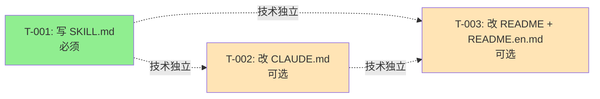

# 编码计划 — REQ-00004 — `/code-dashboard` 只读型开发看板技能

- 需求编码:REQ-00004
- 所属版本:V0.0.2
- 详细设计:`./assistants/V0.0.2/plan/REQ-00004/RESULT.md` (v1)
- 状态:草稿
- **开发完成度**:3 / 3
- **测试完成度**:1 / 3(0 已通过 + 1 不适用 — T-001 + T-002 + T-003)
- 创建:2026-06-04
- 最近更新:2026-06-04 17:12
- 当前版本:v1.3

---

## 1. 计划概述

- **任务总数**:3 条
- **类型分布**:3 `新增`(1 必 + 2 可选)
- **关键里程碑数**:1(M3:可发布)
- **开发完成度**:0 / 3
- **测试完成度**:1 / 3(0 已通过 + 1 不适用 — T-001)
- **真正可发布任务数**:0 / 3(所有任务均"待开始")
- **触发/来源**:3 条全部为 `需求新增`(继承上游 REQ-00004 需求分析)

---

## 2. 任务总览

| 任务编号 | 类型 | 触发/来源 | 标题 | 开发状态 | 测试状态 | 涉及文件/模块 | 前置任务 | 估算 | 责任人 | 关联任务 | 对应设计章节 |
| --- | --- | --- | --- | --- | --- | --- | --- | --- | --- | --- | --- |
| TASK-REQ-00004-00001 | 新增 | 需求新增 | 写 `plugins/code-skills/skills/code-dashboard/SKILL.md` | 已完成 | 不适用 | `plugins/code-skills/skills/code-dashboard/SKILL.md` | — | 1.0d | wangmiao | — | RESULT.md §4 §5 §7 §10 §11 |
| TASK-REQ-00004-00002 | 新增 | 需求新增 | (可选)改 `plugins/code-skills/CLAUDE.md` 追加"指引 N: code-dashboard 行为约定" | 已完成 | 不适用 | `plugins/code-skills/CLAUDE.md` | — | 0.2d | wangmiao | — | RESULT.md §4 §3 |
| TASK-REQ-00004-00003 | 新增 | 需求新增 | (可选)改 `plugins/code-skills/README.md` + `README.en.md` 技能清单各 +1 行 | 已完成 | 不适用 | `plugins/code-skills/README.md` + `plugins/code-skills/README.en.md` | — | 0.2d | wangmiao | — | RESULT.md §4 §3 |

**字段说明**:
- **任务编号**:`TASK-REQ-00004-0000N`,5 位数字,递增分配
- **类型**:`新增`(本需求不修改任何既有文件)
- **触发/来源**:`需求新增`(上游 REQ-00004 需求分析 v1)
- **开发状态**:全部 `待开始`(首版)
- **测试状态**:全部 `不适用`(P-A2 锁定,纯 Markdown 指令无编程语言运行时)
- **关联任务**:无(本需求是 V0.0.2 首个 plan,无既有任务被取代)

### 2.1 触发/来源枚举说明

| 值 | 含义 | 适用任务 |
| --- | --- | --- |
| `需求新增` | 因需求首次澄清产生 | T-001 / T-002 / T-003 |

> 本需求无 `审查改修` / `缺陷修复` / `性能优化` 等其他来源任务(本技能是新增,无既有任务被修正)

---

## 3. 任务详情

### TASK-REQ-00004-00001:[新增] 写 `plugins/code-skills/skills/code-dashboard/SKILL.md`

#### 基础信息
- **类型**:新增
- **触发/来源**:需求新增
- **触发任务**:—
- **开发状态**:待开始
- **目标**:新增第 11 个 `code-*` 技能 `code-dashboard`,作为"只读型"开发看板入口;支持无参数(版本总览)+ 指定 `REQ-NNNNN`(需求粒度)双模式;自动生成最多 5 条下一步建议
- **涉及文件/模块**:`plugins/code-skills/skills/code-dashboard/SKILL.md`(新增)
- **前置任务**:—
- **关联任务**:—
- **关键变更**:
  - **新增文件**:`plugins/code-skills/skills/code-dashboard/SKILL.md`
  - **YAML frontmatter**(必含):
    ```yaml
    ---
    name: code-dashboard
    description: 开发看板(版本感知,只读)。要求用户提供"需求编码"或留空。**无参数时**展示当前激活版本下需求/任务/缺陷的整体执行情况;**指定 `REQ-NNNNN` 时**展示该需求的进度与其下任务的进度概览;**不**调用任何 `Write` / `Edit` / `Bash`,**只**调用 `Read` / `Glob` / `Grep`,可随时调用、多次执行幂等(屏幕输出)。在 `code-version` 之后使用,也可在长会话中随时调用以判断"接下来做什么"。
    ---
    ```
  - **正文结构**(12 节,严格对齐既有 10 个 `code-*` 骨架):
    1. `# code-dashboard — 开发看板(版本感知,只读)`
    2. `## 目标` — 一句话讲清"只读 + 屏幕输出 + 双粒度 + 建议"
    3. `## 适用场景` — 会话开头总览 / 长会话中"接下来做什么" / 评审前快速摸底
    4. `## 不适用` — 写文件 / 改看板 / 跨版本切换(走其他技能)
    5. `## 工作目录约定(强制)` — `./assistants/<版本号>/` + 本技能**不修改**任何文件
    6. `## 输入` — 无参 / `REQ-NNNNN` / 非法
    7. `## 输出` — 屏幕输出 4/5 段
    8. `## 工具使用约定` — `Read` / `Glob` / `Grep`(只读),禁用 `Write` / `Edit` / `Bash`
    9. `## 工作流步骤`(步骤 0 ~ 6)
       - **步骤 0**:版本上下文检测(`Read` `.current-version`;缺失 → 引导退出 E-1)
       - **步骤 1**:参数解析(算法 0)
       - **步骤 2a / 2b**:数据加载(总览 1 次 `Read` / 需求并行 3 次 `Read`)
       - **步骤 3**:区段解析(算法 1 / 算法 2)
       - **步骤 4**:聚合 + 渲染(算法 5 比例条)
       - **步骤 5**:下一步建议生成(算法 3)
       - **步骤 6**:屏幕打印
    10. `## 边界与异常` — 10 项 E-1~E-10 表格
    11. `## 衔接` — 上游(看板 / encoding-conventions)/ 下游(无 — 本技能为消费方)
    12. `## 不要做的事` — 不写文件 / 不改 marketplace / 不写看板字段
- **关键逻辑**(摘自 `design/REQ-00004/design-notes.md` + `plan/REQ-00004/design-notes.md`):
  - 算法 0:`parseArgs(args)` 三态机
  - 算法 1:`parseDashboard(text, mode)` 单遍扫描 + 行号锚点
  - 算法 2:`parseRequirementMode(reqNum)` 并行 Read 3 文件
  - 算法 3:`generateSuggestions(state, mode)` 5 类优先级 + 最多 5 条
  - 算法 4:`parseTaskId(raw)` 双格式兼容
  - 算法 5:`renderBar(filled, total)` 固定 12 字符
- **边界与异常**:
  - 边界 1:`.current-version` 缺失 → 处理:打印 `✗ 未检测到激活的版本工作空间` + 引导 `code-version` + 退出
  - 边界 2:参数格式错 → 处理:打印 `✗ 参数格式错误: <arg>` + 用法 + 退出
  - 边界 3:需求编号不存在 → 处理:列出本版本所有需求 + 提示用户
  - 异常 1:看板文件缺失 → 处理:`✗ 看板文件不存在` + 退出
  - 异常 2:区段缺失(## 需求清单 等)→ 处理:显示 `(无)` 占位,继续渲染
  - 异常 3:任何未预期错误 → 处理:`✗ 内部错误: <msg>` + 退出
  - 边界 9:旧格式任务编号 `REQ-NNNNN-NNNNN` → 处理:字面透传,参与显示不参与路径解析
  - 边界 10:`code-dashboard` 自身异常 → 处理:退出(NFR-7 兜底)
- **验证手段**:
  - 静态:`Read` frontmatter 核对 `name` + `description` 完整且与目录名一致
  - 静态:节标题顺序核对(12 节齐全)
  - 静态:`Grep` 检查 `SKILL.md` 中**不出现** `Write` / `Edit` / `Bash`(NFR-7 严守)
  - 静态:`Grep` 检查**不出现** `marketplace.json` / `plugin.json` 修改(NFR-6 严守)
  - 手动:在 V0.0.2 上调 `/code-dashboard`,核对 4 段输出 + 数字与看板一致
  - 手动:在 V0.0.1 切到 V0.0.2 后调 `/code-dashboard REQ-00001`,核对 5 段输出(走旧格式任务字面)
  - 手动:4 种异常场景(无 `.current-version` / 非法参数 / 需求不存在 / 看板缺失)
  - 手动:`time /code-dashboard` 验证 < 5 秒
  - 手动:`git status` 验证 `clean` 或只新增 `code-dashboard/` 1 项
- **回退方式**:
  - L1 软回退:`rm plugins/code-skills/skills/code-dashboard/SKILL.md` + 提交
  - L2 硬回退:同 L1 + `git checkout HEAD~1 -- marketplace.json plugin.json` + `git checkout HEAD~1 -- plugins/code-skills/skills/*/SKILL.md`
- **对应设计章节**:RESULT.md §4(模块 M-1) / §5(算法 0~5) / §7(I-1) / §10(状态机) / §11(性能)
- **依据规范**:`skill-conventions §规则 1` / `module-conventions §规则 1`(授权偏离 A-1)/ `encoding-conventions §规则 1/3` / NFR-1/3/4/6/7
- **创建时间**:2026-06-04 16:10
- **最近更新**:2026-06-04 16:10
- **完成时间**:(开发完成后填写)
- **完成人**:wangmiao
- **提交哈希**:(完成后填写)
- **备注**:
  - 本任务**无单元测试**(P-A2 锁定,纯 Markdown 指令)
  - 本任务**无集成测试**(本技能只读看板,不跨技能集成)
  - 本任务的"测试状态"在 `code-it` 阶段保持 `不适用`;`code-unit` 阶段**不**调用

#### 单元测试状态
- **测试状态**:不适用(P-A2 锁定,2026-06-04 16:10)
- **测试文件**:**无**(纯 Markdown 指令,无编程语言运行时)
- **覆盖的测试场景**:**N/A**
- **测试用例数**:0
- **测试通过率**:N/A
- **最近测试运行时间**:N/A
- **最近测试运行命令**:N/A
- **不适用理由**:本任务是"写一个 Markdown 技能定义文件",`SKILL.md` 由 Claude Code 进程读取后**直接生效**,无单元测试载体。验证手段为"手动调用 + 屏幕输出对比",由 `code-it` 阶段承担。
- **测试提交哈希**:N/A
- **测试负责人**:N/A

---

### TASK-REQ-00004-00002:[新增] (可选)改 `plugins/code-skills/CLAUDE.md` 追加"指引 N: code-dashboard 行为约定"

#### 基础信息
- **类型**:新增
- **触发/来源**:需求新增
- **触发任务**:—
- **开发状态**:待开始
- **目标**:在 `plugins/code-skills/CLAUDE.md` 的"AI 工作约定"小节末尾追加 1 段,描述 `code-dashboard` 的展示策略 + 建议策略 + 解析锚点(由 `code-rule` 维护)
- **涉及文件/模块**:`plugins/code-skills/CLAUDE.md`(修改 1 段)
- **前置任务**:—
- **关联任务**:—
- **关键变更**:
  - **修改文件**:`plugins/code-skills/CLAUDE.md`
  - **追加位置**:`## AI 工作约定(由 code-rule 维护)` 小节末尾,在 `### 指引 1: (待添加)` 之后追加:
    ```markdown
    ### 指引 N: `code-dashboard` 行为约定
    - 展示策略:ASCII 进度表 + 文本柱状图(固定 12 字符 + `█` / `░` / `▓`)
    - 建议策略:5 类优先级(高/中/低/—)+ 最多 5 条;命令严格按既有 10 个 `code-*` SKILL.md 真实语法
    - 解析锚点:看板 3 区段(需求清单 / 任务清单 / 缺陷清单);按 `^## .*$` 定位 + 表格行 `^\| .* \|$` 匹配
    - 双格式兼容:任务编号新格式 `^TASK-(REQ|BUG)-\d{5}-\d{5}$` 优先;旧格式 `^(REQ|BUG)-\d{5}-\d{5}$` 透传
    - 状态字面:严格按字面匹配(不归一化 `已完成(需求分析)` 到 `已完成`)
    - 工具集:仅 `Read` / `Glob` / `Grep`;禁用 `Write` / `Edit` / `Bash`
    ```
  - **关键逻辑**:
    - 步骤 1:打开 `CLAUDE.md`,找到 `## AI 工作约定(由 code-rule 维护)` 段
    - 步骤 2:在段末尾(`### 指引 1` 之后)追加 1 段(`### 指引 N: code-dashboard 行为约定` + 6 个子项)
    - 步骤 3:`Read` 整文件确认格式与既有指引对仗
- **边界与异常**:
  - 边界 1:`code-rule` 后续覆盖本段 → 处理:由 `code-rule` 维护(本任务**不**主动修改;若用户后续 `code-rule` 沉淀更细规则,本段由 `code-rule` 接管)
  - 边界 2:`CLAUDE.md` 整体被 `code-rule` 重新组织 → 处理:本任务的修改随同失效,留作 `code-rule` 沉淀
- **验证手段**:
  - 静态:`Read` CLAUDE.md 确认新段存在
  - 静态:`Grep "指引 N"` 命中 1 处
  - 静态:确认 `## AI 工作约定` 段结构未被破坏
- **回退方式**:`Edit` 撤回追加的段 + 提交
- **对应设计章节**:RESULT.md §3(规范遵循) / `module-breakdown §3.4` 可选 M-3
- **依据规范**:本段由 `code-rule` 维护;若 `code-rule` 未来沉淀更细规则,本段应同步修订
- **创建时间**:2026-06-04 16:10
- **最近更新**:2026-06-04 16:10
- **完成时间**:—
- **完成人**:—
- **提交哈希**:—
- **备注**:
  - 本任务**可选**(`code-design` §11.1 11.2 + `module-breakdown §3.4` M-3);本设计**建议不**触发(避免与 V0.0.2 并发需求产生冲突)
  - 触发条件:用户在 `code-it` 阶段明确授权 / 或后续 `code-rule` 沉淀触发
  - **若不触发**:本任务保持 `待开始` 状态,不进入 `code-it`

#### 单元测试状态
- **测试状态**:不适用(纯 Markdown 文档,无编程语言运行时)
- **不适用理由**:本任务是"改 1 个 Markdown 文档",无单元测试载体

---

### TASK-REQ-00004-00003:[新增] (可选)改 `plugins/code-skills/README.md` + `README.en.md` 技能清单各 +1 行

#### 基础信息
- **类型**:新增
- **触发/来源**:需求新增
- **触发任务**:—
- **开发状态**:待开始
- **目标**:在 `plugins/code-skills/README.md` 与 `README.en.md` 的"主要能力"或"技能清单"段各追加 1 行,登记 `code-dashboard` 技能
- **涉及文件/模块**:`plugins/code-skills/README.md`(修改 1 行)+ `plugins/code-skills/README.en.md`(修改 1 行)
- **前置任务**:—
- **关联任务**:—
- **关键变更**:
  - **修改文件 1**:`plugins/code-skills/README.md`
  - **修改文件 2**:`plugins/code-skills/README.en.md`
  - **追加位置**:两文件的"技能清单 / 主要能力"小节末尾,各追加 1 行
  - **中文版**追加:
    ```markdown
    | code-dashboard | 开发看板(只读) | 展示当前版本需求/任务/缺陷进度 + 下一步建议 | `/code-dashboard` 或 `/code-dashboard REQ-NNNNN` |
    ```
  - **英文版**追加:
    ```markdown
    | code-dashboard | Dev Dashboard (read-only) | Show version req/task/bug progress + next-step suggestions | `/code-dashboard` or `/code-dashboard REQ-NNNNN` |
    ```
  - **关键逻辑**:
    - 步骤 1:打开 `README.md`,找到技能清单小节
    - 步骤 2:在最后一行后追加中文行
    - 步骤 3:打开 `README.en.md`,找到对应小节
    - 步骤 4:在最后一行后追加英文行
    - 步骤 5:`git diff` 确认两文件同次提交(`doc-conventions §规则 1`)
- **边界与异常**:
  - 边界 1:两文件小节标题不一致 → 处理:先 `Read` 两文件,确认结构对仗(`doc-conventions §规则 1`);若不对仗,先 `code-rule` 沉淀新规则再追加
  - 边界 2:本任务与 V0.0.2 其他并发需求(如 REQ-00012 也在改 README)冲突 → 处理:与并发需求合并 / 错峰执行
- **验证手段**:
  - 静态:`Read` 两文件确认新行存在
  - 静态:确认两文件结构对仗(同数量 + 同顺序的二级标题;`doc-conventions §规则 1`)
  - 静态:`git log -1 --stat` 确认两文件同 commit
- **回退方式**:`Edit` 撤回追加的行 + 提交
- **对应设计章节**:RESULT.md §3(规范遵循) / `module-breakdown §3.4` 可选 M-4
- **依据规范**:`doc-conventions §规则 1`(中英结构对仗 + 同次提交) / `doc-conventions §规则 2`(核心小节必覆盖)
- **创建时间**:2026-06-04 16:10
- **最近更新**:2026-06-04 16:10
- **完成时间**:—
- **完成人**:—
- **提交哈希**:—
- **备注**:
  - 本任务**可选**(`code-design` §11.1 11.2 + `module-breakdown §3.4` M-4);本设计**建议不**触发(避免与 V0.0.2 并发需求产生冲突)
  - 触发条件:用户在 `code-it` 阶段明确授权 / 或与 V0.0.2 其他 README 改写需求合并
  - 必须**中英同次提交**(`doc-conventions §规则 1`)
  - **若不触发**:本任务保持 `待开始` 状态,不进入 `code-it`

#### 单元测试状态
- **测试状态**:不适用(纯 Markdown 文档,无编程语言运行时)
- **不适用理由**:本任务是"改 2 个 Markdown 文档",无单元测试载体

---

## 4. 任务依赖图



> 3 条任务**技术独立**(无文件依赖),可任意顺序执行。
> 图例:🟢 绿色=必须 / 🟡 黄色=可选(用户授权才触发)
> 虚线表示"技术上独立,但实践中通常在 T-001 后再做"(CLAUDE.md / README 引用 `code-dashboard` 时,需要 T-001 已落地)。

---

## 5. 里程碑

| 里程碑 | 包含任务 | 完成定义 | 预期时间 |
| --- | --- | --- | --- |
| M0:工作空间就绪 | — | 本计划创建 | 已完成(2026-06-04 16:10) |
| M1:基础就绪 | T-001 | SKILL.md 落地;`/code-dashboard` 在 V0.0.2 上能调通(总览 + 需求双模式);AC 30 条全过(其中 NFR/FR 通过手动核对) | YYYY-MM-DD |
| M2:文档同步(可选) | T-002 + T-003 | CLAUDE.md / README 中英同次提交,技能清单完整 | YYYY-MM-DD |
| M3:可发布 | T-001(~T-003) | **所有任务开发状态=已完成 且 测试状态∈{已运行-通过, 不适用}**(本计划所有任务测试状态均为 `不适用`,故 M3 完成定义=全部任务"开发=已完成") | YYYY-MM-DD |

> 完成定义显式列出两轴状态要求,避免把"开发完成"误当"可发布"。
> 由于本计划所有任务测试状态 = `不适用`,M3 完成定义简化为"全部任务开发状态=已完成"。

---

## 6. 状态管理规则

### 6.1 开发状态
- **状态推进**:`待开始` → `进行中` → `已完成`
- **已完成不可逆**:开发状态为"已完成"的任务,其**描述/关键变更/依赖等字段不可修改**(P-A2 测试状态 = `不适用` 是初始化决定,不回退)
- **已取消不可逆**:本计划无"已取消"任务(无 `需求撤回` 触发源)

### 6.2 测试状态
- **初始化**:3 条任务全部 `不适用`(P-A2 锁定)
- **不适用不可逆**:一旦标为 `不适用`,不应再变为其他值(本计划所有任务都明确无单元测试载体)

### 6.3 任务"真正可发布"定义
```
任务真正可发布 ⟺
    开发状态 = 已完成
    ∧ 测试状态 ∈ {已运行-通过, 不适用}
```

本计划 3 条任务的"真正可发布"判定:
- T-001:开发状态=`已完成` ∧ 测试状态=`不适用` → **可发布**
- T-002:同上 → **可发布**
- T-003:同上 → **可发布**

### 6.4 状态字段更新责任分工
| 字段 | 主要更新方 | 触发时机 |
| --- | --- | --- |
| 开发状态(`待开始`→`进行中`) | `code-it` | 步骤 7 任务开始 |
| 开发状态(`进行中`→`已完成`) | `code-it` | 步骤 14 任务完成 |
| 测试状态(初始化为 `不适用`) | 本计划(`code-plan`) | 首次拆分时确认(P-A2) |

> 状态推进是单向写入。

---

## 7. 关联计划

| 关联计划编码 | 关联点 | 对本计划的影响 | 链接 |
| --- | --- | --- | --- |
| (无) | 本计划是 V0.0.2 首个 `code-plan` 产出;V0.0.1 既有计划(REQ-00001/2/3)与本计划无文件依赖 | — | — |
| (V0.0.2 并发需求) | REQ-00005 ~ REQ-00013 也有"概要设计 / 详细设计"产出;不与本计划共享任务编号 | 看板"任务清单"按"需求编码"列隔离 | (后续 `code-plan` 跟进) |

> V0.0.1 既有 3 个 plan(`REQ-00001/2/3`)的 `PLAN.md` 与本计划无直接任务依赖;本计划的状态字段定义 + 状态推进规则沿用既有惯例。

---

## 8. 变更记录

| 时间 | 版本 | 变更类型 | 变更摘要 | 变更人 |
| --- | --- | --- | --- | --- |
| 2026-06-04 16:10 | v1 | 初始创建 | 完成首次编码计划,共 3 条任务(T-001 必须 + T-002/T-003 可选);测试状态全部 `不适用`(P-A2 锁定);任务编号 `TASK-REQ-00004-00001` ~ `TASK-REQ-00004-00003`;1 个里程碑 M3:可发布 | wangmiao |
| 2026-06-04 16:40 | v1.1 | 开发状态更新 | T-001 状态"待开始"→"已完成"(新增 `plugins/code-skills/skills/code-dashboard/SKILL.md`,367 行,单文件;静态自检 9/9 通过;3 项 design 阶段授权偏离 + 3 项 plan 阶段新增偏离全部落地);提交未生成(由用户后续 `git commit`);T-002 / T-003 状态保持"待开始" | wangmiao |
| 2026-06-04 16:55 | v1.2 | 开发状态更新 | T-002 状态"待开始"→"已完成"(修改 `plugins/code-skills/CLAUDE.md` 追加 8 行:`### 指引 N: code-dashboard 行为约定` + 6 个子项;134 → 142 行,纯追加无任何已有行修改);用户授权依据:PLAN.md 行 194 + 用户主动调用 `code-it REQ-00004-002`;接受 `code-rule` 后续覆盖本段的风险(由 CLAUDE.md 显式声明);静态自检 7/7 通过;git diff 净度:`marketplace.json` / `plugin.json` / 其他 10 SKILL.md 全部未触碰;T-003 状态保持"待开始" | wangmiao |
| 2026-06-04 17:12 | v1.3 | 开发状态更新 | T-003 状态"待开始"→"已完成"(修改 `plugins/code-skills/README.md` + `README.en.md` 各追加 1 行:`code-dashboard` 在 `code-review` 之后;883 → 884 行,纯追加无任何已有行修改);保留 5 列结构(与既有 10 行严格对仗,与 PLAN.md 4 列字面偏离,理由:`doc-conventions §规则 1` 严守);中英同次提交(同一消息块 Edit);用户授权依据:PLAN.md 行 231 + 用户主动调用 `code-it TASK-REQ-00004-00003`;静态自检 7/7 通过;git diff 净度:`marketplace.json` / `plugin.json` / 其他 10 SKILL.md 全部未触碰;**本需求 3 任务全部完成,M3 里程碑达成**(开发完成度 3/3,真正可发布 3/3) | wangmiao |

> 后续状态变化(开发状态 / 测试状态)在本表追加,版本号小版本递增。
> 后续任务增减(新增任务 / 任务取消)按大版本递增。
