# REQ-00004 — 详细设计(`code-dashboard` 只读型开发看板技能)

- 需求编码:REQ-00004
- 所属版本:V0.0.2
- 上游需求:`./assistants/V0.0.2/require/REQ-00004/RESULT.md` (v1)
- 上游概要设计:`./assistants/V0.0.2/design/REQ-00004/RESULT.md` (v1)
- 遵循规范:`./assistants/rules/` 下 9 个相关文件(`skill-conventions` / `module-conventions` / `directory-conventions` / `dashboard-conventions` / `encoding-conventions` / `commit-conventions` / `dependency-conventions` / `doc-conventions` / `marketplace-protocol`)
- 状态:草稿
- 责任人:wangmiao
- 创建:2026-06-04
- 最近更新:2026-06-04 16:10
- 当前版本:v1

---

## 1. 详细设计概述

本详细设计在概要设计 v1 的基础上,**把 8 个关键设计问题(Q-1~Q-8)落地为 6 个可直接编码的算法**(算法 0~5),把"模块拆分 M-1"细化到"关键类/函数 + 调用顺序 + 并发模型 + 资源管理 + 错误处理范式 + 日志埋点"6 个维度,把"数据接口"细化到 8 个内存数据结构(`Suggestion` / `TaskId` / `ParseResult` / `TaskRow` / `RequirementRow` / `BugRow` / `RequirementDetail` / `ErrorInfo`)。

**关键决策**:
- **6 个算法的输入/输出/复杂度/伪代码均已给出**(对应概要设计 Q-1~Q-8)
- **状态机用 Mermaid 完整绘制**(单次调用生命周期 11 个状态)
- **3 项本阶段新增偏离**(`P-A1` ~ `P-A3`)显式记录在 `rule-compliance.md §5`
- **NFR-1 零依赖** + **NFR-6 不动其他技能** + **NFR-7 幂等** 全部锁在算法边界
- **任务计划 3 条**:`T-001`(必须)+ `T-002`(可选,CLAUDE.md)+ `T-003`(可选,README);对应 `PLAN.md`

---

## 2. 上游引用

### 需求
- 来源:`./assistants/V0.0.2/require/REQ-00004/RESULT.md` (v1)
- 关键摘录(10 FR / 7 NFR / 30 AC):
  - FR-1:SKILL.md frontmatter 必含 name + description
  - FR-2:总览模式 4 段(需求 / 任务 / 缺陷 / 建议)
  - FR-3:需求模式 5 段(元信息 / 任务清单 / 关联缺陷 / 建议)
  - FR-4:下一步建议(可执行命令 + 依据 + 优先级,最多 5 条)
  - FR-5:无激活版本引导
  - FR-6:参数校验
  - FR-7:纯只读
  - NFR-1:零外部依赖
  - NFR-2:不崩溃(3 层退化)
  - NFR-3:任务编号双格式兼容
  - NFR-4:性能 < 5 秒
  - NFR-6:不改其他技能
  - NFR-7:幂等

### 概要设计
- 来源:`./assistants/V0.0.2/design/REQ-00004/RESULT.md` (v1)
- 关键摘录:
  - §3 模块拆分(1 新增 + 1 复用 + 0 修改 + 2 可选)
  - §4 接口与数据结构(CLI 入口 + 文件契约 + TaskId + Suggestion)
  - §7 状态机 + 性能预期
  - §8 边界 E-1~E-10

### 规范
- 9 个规范文件(详见 §3 规范遵循)

---

## 3. 规范遵循

| 规范文件 | 引用条款 | 落点 | 自检结论 |
| --- | --- | --- | --- |
| `skill-conventions.md` | §规则 1 | `module-details §M-1` / T-001 frontmatter | **完全合规** |
| `module-conventions.md` | §规则 1 | T-001 不新增子目录(无独立资源) | **授权偏离 A-1**(已记录) |
| `directory-conventions.md` | §规则 1 占位 | 沿用既有惯例,等正式生效再校准 | **完全合规** |
| `dashboard-conventions.md` | §规则 1 | 不写看板字段扩展 | **完全合规**(不触发) |
| `encoding-conventions.md` | §规则 1/3/4 | `algorithm-4 parseTaskId` / `data-changes §D-2` | **完全合规** |
| `commit-conventions.md` | §规则 1 占位 | `code-it` 阶段遵循 conventional 风格 | **完全合规** |
| `coding-style.md` | §规则 1 占位 | SKILL.md 是 Markdown | **不适用** |
| `naming-conventions.md` | §规则 1 占位 | kebab-case 沿用既有 | **完全合规** |
| `framework-conventions.md` | §规则 1 占位 | 不适用 | **不适用** |
| `dependency-conventions.md` | §规则 1 占位 | 0 新增依赖 | **完全合规** |
| `doc-conventions.md` | §规则 1/2 | T-003 中英同次提交 | **完全合规**(T-003 触发条件) |
| `marketplace-protocol.md` | §规则 1 | 不动 marketplace.json / plugin.json | **完全合规** |
| `migration-mapping.md` | §规则 1/4 | 旧格式透传 | **完全合规** |

### 用户授权的偏离(继承 design 阶段 + 本阶段新增)
| 编号 | 偏离内容 | 授权时间 | 影响章节 |
| --- | --- | --- | --- |
| A-1 | T-001 不放 `templates/` / `checklists/` / `guidelines/` 子目录 | 2026-06-04 12:50 | `module-details §M-1` / T-001 |
| A-2 | 不改 `marketplace.json` 列表项 | 2026-06-04 12:50 | `module-details §M-1` |
| A-3 | 不提供"切到 V0.0.x 历史版本"能力 | 2026-06-04 12:50 | `interface-specs §I-1` |
| P-A1 | 任务编号解析时 V0.0.2 状态子状态 `已完成(需求分析)` 不归一化 | 2026-06-04 16:10 | `data-changes §D-5` |
| P-A2 | T-001 测试状态 = `不适用` | 2026-06-04 16:10 | `PLAN.md §2 任务总览` |
| P-A3 | 需求模式"里程碑"段不显示 | 2026-06-04 16:10 | `interface-specs §I-1` |

### 待澄清的冲突
- **0 项**(本阶段无新冲突;继承 4 项均已通过 `code-require` Q-1~Q-3 锁定,详见 `rule-compliance.md §3`)

---

## 4. 模块详细化(对应概要设计 §3)

> 详见 `module-details.md`。本节给"概要"。

### 模块 M-1:`code-dashboard` 技能
- **路径**:`plugins/code-skills/skills/code-dashboard/SKILL.md`(新增,单文件,无子目录)
- **关键类/函数**:`parseArgs()` / `readCurrentVersion()` / `parseDashboard()` / `parseRequirementMode()` / `parseTaskId()` / `aggregate()` / `renderBar()` / `generateSuggestions()` / `printOutput()`(详见 `module-details §M-1`)
- **内部状态**:**无**(NFR-7 幂等)
- **关键调用顺序**:总览 7 步 / 需求 9 步(详见 `module-details §M-1`)
- **并发模型**:无并发原语;需求模式 3 次 `Read` 并行触发
- **资源管理**:无连接/锁/缓存
- **错误处理范式**:L1 启动错退出 / L2 数据缺退化 / L3 异常兜底
- **日志埋点**:无结构化日志;屏幕输出即日志
- **依据规范**:`skill-conventions §规则 1` / `module-conventions §规则 1` (授权偏离 A-1)/ `marketplace-protocol §规则 1`

### 模块 M-2:`code-review` 行为契约(复用)
- **复用点**:只读契约 / 状态机范式 / NFR-7 幂等
- **差异点**:本技能输出屏幕,不写文件(`interface-specs.md` §I-2)
- **依据规范**:`skill-conventions §规则 1`(本设计不修改其 frontmatter)

---

## 5. 算法与逻辑(本节是详细设计区别于概要设计的核心)

> 6 个算法已在 `design-notes.md` 给出完整伪代码。本节给"输入/输出/复杂度/边界/对应任务"。

### 算法 0:`parseArgs(args)` — 参数解析
- **目的**:解析 `/code-dashboard` 的入参,决定调用模式
- **输入**:`args: string[]`
- **输出**:`{ mode: "总览" | "需求" | "错误", reqNum: string | null, error: ErrorInfo | null }`
- **复杂度**:O(1) 时间 + O(1) 空间
- **关键决策**:三态机;严格 `^REQ-\d{5}$` 校验(FR-6.AC-6.3)
- **边界**:空参 → 总览;1 参匹配 → 需求;1 参不匹配 / 多参 → 错误
- **对应任务**:T-001
- **依据规范**:`encoding-conventions §规则 1`

### 算法 1:`parseDashboard(text, mode)` — 看板区段解析
- **目的**:从 `RESULT.md` 文本中提取"需求 / 任务 / 缺陷"3 区段的表格行
- **输入**:`text: string` + `mode: "总览" | "需求"`
- **输出**:`ParseResult`(见 `data-changes §D-3`)
- **复杂度**:O(N) 时间 + O(N) 空间(N = 看板行数,典型 < 500)
- **依赖**:`extractTableRows()` 工具函数
- **关键决策**:单遍扫描 + 行号锚点 + 区间提取(NFR-4 + NFR-1)
- **边界**:锚点缺失 → `[]`(L2 退化);列错位 → 原始 markdown 块退化
- **对应任务**:T-001
- **依据规范**:`dashboard-conventions §规则 1`(看板字段约定扩展需 3 文件同步,本技能**不**扩展)

### 算法 2:`parseRequirementMode(reqNum)` — 需求模式解析
- **目的**:为 `/code-dashboard REQ-NNNNN` 准备 `ParseResult`
- **输入**:`reqNum: string`(5 位数字)
- **输出**:`ParseResult`(`mode = "需求"`)
- **依赖**:`algorithm-1` + 工具函数 `fileExists()` / `readMainDashboard()` / `readRequirementDoc()` / `readPlanDoc()`
- **关键决策**:`Promise.all` 并行 3 次 `Read`;关联缺陷按 `relatedTask` 前缀筛
- **边界**:需求目录不存在 → E-3 错误;子文件缺失 → `?` 占位
- **对应任务**:T-001
- **依据规范**:NFR-4(性能)+ FR-3(需求模式 5 段)

### 算法 3:`generateSuggestions(state, mode)` — 下一步建议生成
- **目的**:基于当前状态生成最多 5 条可执行命令建议
- **输入**:`state: ParseResult` + `mode`
- **输出**:`Suggestion[]`(最多 5 条)
- **复杂度**:O(N) 时间 + O(N) 空间
- **关键决策**:
  - 5 类优先级:P0 高(无需求 / P0 缺陷 / 缺设计)/ P1 中(任务待开始 / 缺详细)/ P2 低(测试待运行)/ 特殊(全完成)
  - 严格按字面 `===` 比较(P-A1 锁定:不归一化 `已完成(需求分析)`)
  - 命令格式严格按既有 10 个 SKILL.md frontmatter
- **边界**:全空 → "无后续动作" 段(AC-4.4);全完成 → `/code-version V0.0.x`(AC-4.4)
- **对应任务**:T-001
- **依据规范**:FR-4 + AC-4.1/4.2/4.3/4.4

### 算法 4:`parseTaskId(raw)` — 任务编号解析
- **目的**:同时识别新格式 `TASK-(REQ|BUG)-NNNNN-NNNNN` + 旧格式 `(REQ|BUG)-NNNNN-NNNNN`
- **输入**:`raw: string`
- **输出**:`TaskId | null`
- **复杂度**:O(1) 时间
- **关键决策**:新格式优先;旧格式透传(`displayId` 保留原字面)
- **边界**:解析失败 → `null`(调用方按字面显示,NFR-2 L2)
- **对应任务**:T-001
- **依据规范**:`encoding-conventions §规则 1/3` + NFR-3

### 算法 5:`renderBar(filled, total)` — ASCII 比例条
- **目的**:构造固定 12 字符的 ASCII 柱状图
- **输入**:`filled: number` + `total: number`
- **输出**:`[████░░░░░░░░] NN%`
- **复杂度**:O(1) 时间
- **关键决策**:`BAR_WIDTH = 12`(Q-D3 锁定);字符 `█` / `░`(Q-3 锁定)
- **边界**:`total === 0` → 空条 `0%`(避免除零)
- **对应任务**:T-001
- **依据规范**:Q-1 + Q-3 锁定

---

## 6. 数据结构完整变更(对应概要设计 §4)

> 详见 `data-changes.md`。本节给"总览"。

### 6.1 新增实体(内存)
- `Suggestion`(D-1):字段 3(`command` / `reason` / `priority`)
- `TaskId`(D-2):字段 5(`format` / `type` / `parentNum` / `taskNum` / `displayId`)
- `ParseResult`(D-3):字段 8(`mode` / `version` / `reqNum` / `requirements` / `tasks` / `bugs` / `targetReq` / `error`)
- `TaskRow`(D-4):字段 4(`taskId` / `title` / `devStatus` / `testStatus`)
- `RequirementRow`(D-5):字段 5(`id` / `title` / `status` / `design` / `plan`)
- `BugRow`(D-6):字段 5(`bugId` / `severity` / `title` / `status` / `relatedTask`)
- `RequirementDetail`(D-7):字段 6(同 D-5 + `tasks`)
- `ErrorInfo`(D-8):字段 3(`code` / `message` / `guide`)

### 6.2 修改实体
**0 个**(本技能无持久化数据)

### 6.3 数据迁移
- **无**(`Plan.md` 任务结构无数据迁移步骤)
- **回退方案**:`rm SKILL.md` 即可(NFR-7 幂等,无副作用)

---

## 7. 接口细节(对应概要设计 §4)

> 详见 `interface-specs.md`。本节给"总览"。

### 7.1 接口总览

| 接口 | 形式 | 状态 | 对应任务 | 依据规范 |
| --- | --- | --- | --- | --- |
| I-1:CLI 入口 `/code-dashboard` | Claude Code 技能协议 | **新增** | T-001 | `skill-conventions §规则 1` |
| I-2:文件契约(只读) | `Read` 工具 | **新增**(消费既有) | T-001 | `dashboard-conventions §规则 1` |
| I-3:数据契约(内部) | 内存对象 | **新增** | T-001 | `encoding-conventions §规则 3` |

### 7.2 关键决策
- **鉴权方式**:**无**(Claude Code 进程承载)
- **错误码体系**:10 个边界 E-1~E-10(屏幕前缀 `✗`)
- **限流策略**:**无**(用户手动触发,无 QPS 压力)
- **幂等保证**:NFR-7 锁;无内部状态,无副作用
- **链路追踪字段**:**无**(屏幕输出,无外部 API)

---

## 8. 异常处理(对应概要设计 §8)

> 详见 `risk-analysis.md §8`。

按 3 层退化组织(L1 / L2 / L3):
- **L1 启动错误**:`.current-version` 缺失(E-1)/ 指向不存在(E-2)/ 看板缺失(E-5)/ 参数格式错(E-4)/ 需求不存在(E-3)— 立即退出
- **L2 数据错误**:区段缺失 / 表格列错位 / 字段缺失 — 显示 `(无)` / `?` / 原始 markdown 块
- **L3 异常兜底**:任何未预期异常 — 显示 `✗ 内部错误: <msg>` + 退出
- **边界场景**:E-7 全空(建议 `code-require`)/ E-8 全完成(建议 `code-version`)/ E-9 旧格式(透传)/ E-10 自身异常(退出)

每条异常对应:触发条件 / 检测手段 / 处理策略 / 屏幕输出 / 对应任务(详见 `risk-analysis.md`)

---

## 9. 安全要求

- **鉴权**:**无 API 鉴权**(Claude Code 进程承载)
- **授权**:任何人可调用,但**只能读**(NFR-6/7 严守)
- **输入校验**:
  - 参数:严格 `^REQ-\d{5}$`(FR-6.AC-6.3)
  - 文件路径:由 `.current-version` 决定,**不接受**用户传入路径(避免路径注入)
- **敏感数据处理**:本技能**不读任何敏感数据**;**不写日志**(NFR-7)
- **防注入**:
  - **不执行任何命令**(`Bash` 工具**不使用**)
  - **不写任何文件**(`Write` / `Edit` 工具**不使用**)
  - **不调用网络**(`WebFetch` / `WebSearch` 工具**不使用**)
- **审计**:**不记录审计日志**(NFR-7 幂等)

**依据规范**:NFR-6 / NFR-7 / `marketplace-protocol §规则 1`

---

## 10. 状态机 / 流程(对应概要设计 §7.1)

```mermaid
stateDiagram-v2
    [*] --> Start
    Start --> ReadVersion: 步骤 0
    ReadVersion --> GuideExit: E-1 文件缺失
    ReadVersion --> GuideExit: E-2 指向不存在
    ReadVersion --> ParseArgs: 成功
    ParseArgs --> OverviewMode: 无参数
    ParseArgs --> RequirementMode: 1 参数 REQ-NNNNN
    ParseArgs --> UsageExit: 非法参数(E-4)
    OverviewMode --> ParseMainBoard: 步骤 2
    ParseMainBoard --> Render: 步骤 3-4
    RequirementMode --> ValidateReq: 步骤 2a
    ValidateReq --> ReqNotFound: E-3 不存在
    ValidateReq --> ParallelRead: 步骤 2b
    ParallelRead --> Render: 步骤 3-4
    Render --> Generate: 步骤 5
    Generate --> PrintOutput: 步骤 6
    PrintOutput --> [*]
    GuideExit --> [*]
    UsageExit --> [*]
    ReqNotFound --> [*]
```

11 个状态节点(Start / ReadVersion / GuideExit / ParseArgs / OverviewMode / RequirementMode / UsageExit / ParseMainBoard / ValidateReq / ReqNotFound / ParallelRead / Render / Generate / PrintOutput)+ 5 个出口状态。

---

## 11. 性能与资源(NFR-4 < 5 秒)

| 指标 | 目标 | 实测(预估) | 余量 |
| --- | --- | --- | --- |
| P50(空版本) | < 1s | < 200ms | 5x |
| P50(总览模式) | < 1s | < 500ms | 2x |
| P95(总览模式,V0.0.x 规模) | < 3s | < 2s | 1.5x |
| P95(需求模式) | < 3s | < 1s | 3x |
| 硬性上限(NFR-4) | < 5s | < 3s | 1.7x |

**并发上限**:**1 个**(无并发原语,串行执行);QPS 不适用
**资源限制**:单实例 < 1 MB(单次 1~3 个文件 Read + 内存解析)
**缓存策略**:**无**(NFR-7 幂等,缓存会破坏"读最新看板"语义)
**批量/异步**:需求模式 3 次 `Read` 并发触发
**降级策略**:不适用(无 QPS 压力)

**依据规范**:NFR-4 + NFR-7

---

## 12. 测试要点

- **单元测试**:**无**(NFR-1 零依赖;无编程语言运行时);**替代**:`code-it` 手动调用 + 截图对比
- **集成测试**:**无**(本技能只读看板,不跨技能集成);**替代**:`code-review` 评审 SKILL.md 行为契约
- **端到端测试**:**本需求无**(`code-unit` 只对代码类任务);**本技能测试状态 = `不适用`**(P-A2 锁定)
- **性能测试**:`time /code-dashboard` 在 2 种规模(空版本 / V0.0.2 当前)下手动计时;通过标准:`real < 5s`
- **安全测试**:`code-review` 阶段核对:
  - `git diff marketplace.json plugin.json` 为空
  - `git diff` 其他 10 个 SKILL.md frontmatter 为空
  - `git status` 干净(只新增 `plugins/code-skills/skills/code-dashboard/`)
- **回归测试**:**无影响**(本技能不调用其他 7 个技能,只读它们写入的看板)

**AC 对应**:30 条 AC 全继承(详见 `risk-analysis.md §11`)

---

## 13. 关联编码计划

- `PLAN.md` 中本详细设计对应的所有任务编号:`TASK-REQ-00004-00001`(T-001 必)+ `TASK-REQ-00004-00002`(T-002 可)+ `TASK-REQ-00004-00003`(T-003 可)
- 关键对应:
  - T-001 → 本 RESULT.md §4 / §5(6 个算法)/ §7(接口)/ §10(状态机)/ §11(性能)
  - T-002 → 本 RESULT.md §4(模块 M-1 可选 T-002)
  - T-003 → 本 RESULT.md §4(模块 M-1 可选 T-003)

---

## 14. 待澄清 / 未决项

继承上游 + 本阶段 4 项新 Q-P1 ~ Q-P4 均采纳默认,**无用户回复阻塞**。详见 `clarifications.md`。

| 编号 | 问题 | 状态 | 期望回复时间 |
| --- | --- | --- | --- |
| (无) | — | — | — |

---

## 15. 变更记录

| 时间 | 版本 | 变更类型 | 变更摘要 | 变更人 |
| --- | --- | --- | --- | --- |
| 2026-06-04 16:10 | v1 | 初始创建 | 完成首次详细设计,6 个算法(算法 0~5)+ 8 个内存数据结构 + 3 条任务(T-001 必 + T-002/003 可);继承 design 阶段 3 项授权偏离(A-1/2/3)+ 本阶段 3 项新增偏离(P-A1/2/3) | wangmiao |
