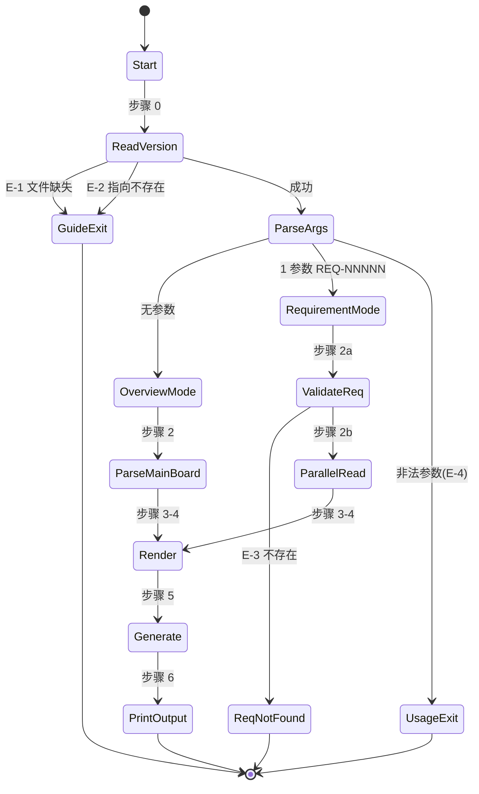

# 设计 notes — REQ-00004(详细设计阶段)

更新时间:2026-06-04 16:10
版本:V0.0.2

> 本文档记录详细设计阶段新增/细化的设计决策。概要设计阶段的决策见 `design/REQ-00004/design-notes.md`。

---

## 与概要设计的差异点

| 维度 | 概要设计 | 详细设计 | 差异理由 |
| --- | --- | --- | --- |
| 任务数 | 预想 1~3 条(必 T-1 + 可选 T-2/T-3) | **3 条**:`T-001`(必须)+ `T-002`(可选,CLAUDE.md)+ `T-003`(可选,README) | 概要设计为粗粒度预想;详细设计把"可选"显式拆为独立任务,便于用户授权时直接派工 |
| 测试状态 | 概要未细化 | T-001 测试状态 = `不适用`(纯 Markdown 指令,NFR-1 零依赖) | 详细设计阶段发现本技能无单元测试载体 |
| 状态枚举 | 概要列出 5+6+6+4 | 详细设计在 `data-changes §D-5` 显式处理 V0.0.2 "已完成(需求分析)" 子状态(避免归一化错误) | V0.0.2 实际看板"需求清单"列用了"阶段化"状态字面 |
| 算法伪代码 | 概要 §7.2 仅"建议生成"伪代码 | 详细设计给出 6 个算法伪代码(算法 0~5),含边界 | 详细设计须"可直接编码" |

---

## 本阶段新增设计决策(4 项,均默认采纳)

### Q-P1:任务编号是否"重命名"为新格式
- **背景**:V0.0.1 REQ-00001 任务字面是 `REQ-00001-001`(旧格式),与 `encoding-conventions §规则 3` 嵌套式不一致
- **选项**:
  - A. 严格按上游 NFR-3:旧格式透传,不解析(NFR-3 锁定)
  - B. 主动重命名为新格式(改看板字面)
- **本设计选择**:A(继承上游 NFR-3)
- **理由**:B 触发 FR-7 AC-7.1 "不修改看板"违规

### Q-P2:`code-dashboard` 在看板"已完成"状态子状态(`已完成(需求分析)`)上的行为
- **背景**:V0.0.2 看板"需求清单"列已用 `已完成(需求分析)`(需求分析阶段完成,但概要设计/详细设计/编码/评审未开始)
- **选项**:
  - A. 严格按字面匹配计数(本设计的"已完成" = `已完成` 而非 `已完成(需求分析)`)
  - B. 归一化到"已完成"桶
- **本设计选择**:A
- **理由**:B 会导致"code-plan / code-it" 看不到需求,违反"读最新看板"语义
- **影响**:`aggregate()` 中按字面 `===` 比较,不归一化

### Q-P3:`code-dashboard` 是否在需求模式显示"里程碑"段
- **背景**:概要设计 §6.1 段 1 / 段 2 / 段 3 之外,有"里程碑"段(Q-D2 锁定为"可选 / 副显")
- **选项**:
  - A. 不显示(Q-D2 默认)
  - B. 需求模式时显示"该需求相关里程碑"
- **本设计选择**:A
- **理由**:`/code-dashboard <REQ>` 的"需求粒度"语义是"该需求 + 其下任务",里程碑是"版本级"概念,不在该粒度范围
- **影响**:需求模式 5 段不包含"里程碑"

### Q-P4:任务编号解析失败时的退化
- **背景**:V0.0.x 历史任务可能含非标准字面(例如 `EXISTING-001-001` 或旧版 `BUG-001`)
- **选项**:
  - A. 解析失败 → 字面原样显示,不报警(NFR-2 L2 退化)
  - B. 解析失败 → 标 `?` 提示用户
- **本设计选择**:A
- **理由**:B 会污染"显示策略"(出现 `?` 让用户困惑)
- **影响**:`parseTaskId()` 返回 `null` 时,渲染时按字面显示

---

## 算法 0 ~ 5(供 `code-it` 阶段直接编码)

### 算法 0:参数解析(`parseArgs(args)`)
```ts
function parseArgs(args: string[]): { mode: "总览" | "需求" | "错误", reqNum: string | null, error: ErrorInfo | null } {
  if (args.length === 0) return { mode: "总览", reqNum: null, error: null }
  if (args.length > 1) return { mode: "错误", reqNum: null, error: { code: "E-4", message: `参数格式错误: 多余参数`, guide: "用法:\n  /code-dashboard\n  /code-dashboard REQ-NNNNN" } }
  const m = args[0].match(/^REQ-\d{5}$/)
  if (m) return { mode: "需求", reqNum: args[0], error: null }
  return { mode: "错误", reqNum: null, error: { code: "E-4", message: `参数格式错误: ${args[0]}`, guide: "用法:\n  /code-dashboard\n  /code-dashboard REQ-NNNNN(5 位数字)" } }
}
```

### 算法 1:看板解析(`parseDashboard(text, mode)`)
- 对应"步骤 3:区段解析"
- **输入**:`text`(主 `RESULT.md` 全文) + `mode`
- **输出**:`ParseResult`(见 `data-changes §D-3`)
- **复杂度**:O(N) 时间 + O(N) 空间(N = 看板行数,典型 < 500)
- **伪代码**:
  ```ts
  function parseDashboard(text: string, mode: "总览" | "需求"): ParseResult {
    const lines = text.split('\n')
    const anchors: Record<string, number> = {}
    for (let i = 0; i < lines.length; i++) {
      const m = lines[i].match(/^## (.+)$/)
      if (m) anchors[m[1].trim()] = i
    }
    const result: ParseResult = { mode, /* ... */, requirements: [], tasks: [], bugs: [] }
    if (mode === "总览") {
      result.requirements = extractTableRows(lines, anchors, "需求清单")
      result.tasks = extractTableRows(lines, anchors, "任务清单")
      result.bugs = extractTableRows(lines, anchors, "缺陷清单")
    }
    return result
  }
  
  function extractTableRows(lines: string[], anchors: Record<string, number>, sectionTitle: string): any[] {
    const start = anchors[sectionTitle]
    if (start === undefined) return []  // L2 退化
    let end = lines.length
    for (let i = start + 1; i < lines.length; i++) {
      if (/^## /.test(lines[i]) || /^---$/.test(lines[i])) { end = i; break }
    }
    const rows: any[] = []
    for (let i = start + 1; i < end; i++) {
      if (/^\| .* \|$/.test(lines[i]) && !/^\| ---/.test(lines[i])) {
        rows.push(parseTableRow(lines[i]))  // 按 | 切分
      }
    }
    return rows
  }
  ```
- **关键决策**:
  - 单遍扫描(避免多次 IO)
  - 锚点定位 + 区间提取(不假设区段顺序)
  - 表格行过滤 `^\| ---` 排除表头分隔行
- **边界**:
  - 锚点缺失 → 返回 `[]`(L2 退化)
  - 列错位 → 原始 markdown 块退化(本算法简化版不实现,留作 v2)

### 算法 2:需求模式解析(`parseRequirementMode(reqNum)`)
- 对应"步骤 2b(需求模式)+ 步骤 3"
- **输入**:`reqNum`(5 位数字)
- **输出**:`ParseResult`(`mode = "需求"`)
- **依赖**:`algorithm-1`(`parseDashboard` 用于筛关联缺陷)
- **伪代码**:
  ```ts
  async function parseRequirementMode(reqNum: string): Promise<ParseResult> {
    // 步骤 2a: 验证需求存在
    const reqPath = `./assistants/${version}/require/${reqNum}/`
    if (!await fileExists(reqPath)) {
      // E-3:列出本版本所有需求
      const allReqs = await listAllRequirements(version)
      return { mode: "错误", error: { code: "E-3", message: `在 ${version} 中未找到需求 ${reqNum}`, guide: formatReqList(allReqs) } }
    }
    // 步骤 2b: 并行读 3 文件
    const [mainBoard, reqDoc, planDoc] = await Promise.all([
      readMainDashboard(),
      readRequirementDoc(reqNum),
      readPlanDoc(reqNum)
    ])
    // 解析需求详情
    const targetReq: RequirementDetail = {
      id: reqNum,
      title: extractTitle(reqDoc),
      status: extractField(reqDoc, "状态"),
      design: extractDesignStatus(mainBoard, reqNum),
      plan: extractPlanStatus(mainBoard, reqNum),
      tasks: extractPlanTasks(planDoc)
    }
    // 关联缺陷(从主看板筛)
    const allBugs = parseDashboard(mainBoard, "总览").bugs
    const relatedBugs = allBugs.filter(b => b.relatedTask?.startsWith(reqNum + "-"))
    return { mode: "需求", reqNum, targetReq, bugs: relatedBugs, /* ... */ }
  }
  ```
- **关键决策**:
  - 并行 `Promise.all` 3 次 `Read`(Claude Code 工具并发)
  - 关联缺陷筛:按 `relatedTask` 前缀(支持新旧两种字面)
- **边界**:
  - 需求目录不存在 → E-3 错误模式
  - 子文件缺失 → 显示 `?` 占位

### 算法 3:建议生成(`generateSuggestions(state, mode)`)
- 对应"步骤 5"
- **输入**:`ParseResult` + `mode`
- **输出**:`Suggestion[]`(最多 5 条,按优先级降序)
- **复杂度**:O(N) 时间 + O(N) 空间(N = 状态行数)
- **伪代码**(已部分见概要设计 `design-notes.md` §7.2):
  ```ts
  function generateSuggestions(state: ParseResult, mode: "总览" | "需求"): Suggestion[] {
    const all: Suggestion[] = []
    if (mode === "总览") {
      // P0 高
      if (state.requirements.length === 0)
        all.push({ command: "/code-require", reason: "当前版本无任何需求", priority: "高" })
      for (const bug of state.bugs.filter(b => b.severity === "P0" && b.status !== "已修复"))
        all.push({ command: `/code-fix ${bug.bugId}`, reason: `缺陷 ${bug.bugId} P0 待修复`, priority: "高" })
      for (const req of state.requirements.filter(r => r.status === "已完成(需求分析)" && r.design === "未开始"))
        all.push({ command: `/code-design ${req.id}`, reason: `需求 ${req.id} 概要设计=未开始`, priority: "高" })
      // P1 中
      for (const task of state.tasks.filter(t => t.devStatus === "待开始"))
        all.push({ command: `/code-it ${task.taskId.displayId}`, reason: `任务 ${task.taskId.displayId} 开发状态=待开始`, priority: "中" })
      for (const req of state.requirements.filter(r => r.design === "已完成" && r.plan === "未开始"))
        all.push({ command: `/code-plan ${req.id}`, reason: `需求 ${req.id} 详细设计=未开始`, priority: "中" })
      // P2 低
      for (const task of state.tasks.filter(t => t.testStatus === "已编写"))
        all.push({ command: `/code-unit ${task.taskId.displayId}`, reason: `任务 ${task.taskId.displayId} 测试已编写未运行`, priority: "低" })
    } else { // mode === "需求"
      const req = state.targetReq
      if (!req) return []
      for (const task of req.tasks.filter(t => t.devStatus === "待开始"))
        all.push({ command: `/code-it ${task.taskId.displayId}`, reason: `任务 ${task.taskId.displayId} 开发状态=待开始`, priority: "中" })
      for (const task of req.tasks.filter(t => t.devStatus === "已完成" && t.testStatus === "未编写"))
        all.push({ command: `/code-unit ${task.taskId.displayId}`, reason: `任务 ${task.taskId.displayId} 测试未编写`, priority: "中" })
      if (req.design === "未开始")
        all.push({ command: `/code-design ${req.id}`, reason: `需求 ${req.id} 概要设计=未开始`, priority: "高" })
      if (req.plan === "未开始" && req.design === "已完成")
        all.push({ command: `/code-plan ${req.id}`, reason: `需求 ${req.id} 详细设计=未开始`, priority: "中" })
    }
    // 特殊:全完成
    if (all.length === 0 && state.mode === "总览" && state.requirements.length > 0 && state.requirements.every(r => r.status === "已完成"))
      all.push({ command: "/code-version V0.0.x", reason: "该版本已全部完成,可发布或启动新版本", priority: "高" })
    return all.slice(0, 5)
  }
  ```
- **关键决策**:
  - 5 类优先级:P0 高(无需求 / P0 缺陷 / 缺设计) / P1 中(任务待开始 / 缺详细) / P2 低(测试待运行) / 特殊(全完成)
  - 取前 5 条按优先级降序(AC-4.3)
  - 无任何建议触发时 → "无后续动作" 段(AC-4.4)

### 算法 4:任务编号解析(`parseTaskId(raw)`)
- 对应"NFR-3 双格式兼容"
- **输入**:`raw`(字面字符串)
- **输出**:`TaskId | null`
- **复杂度**:O(1) 时间
- **伪代码**:
  ```ts
  function parseTaskId(raw: string): TaskId | null {
    let m = raw.match(/^TASK-(REQ|BUG)-(\d{5})-(\d{5})$/)
    if (m) return { format: "new", type: m[1] as "REQ" | "BUG", parentNum: m[2], taskNum: m[3], displayId: raw }
    m = raw.match(/^(REQ|BUG)-(\d{5})-(\d{5})$/)
    if (m) return { format: "old", type: m[1] as "REQ" | "BUG", parentNum: m[2], taskNum: m[3], displayId: raw }
    return null
  }
  ```
- **关键决策**:
  - 新格式优先
  - 旧格式透传(`displayId` 保留原字面)
  - 解析失败 → `null`(调用方按字面显示)
- **依据规范**:`encoding-conventions.md §规则 1/3` + NFR-3

### 算法 5:ASCII 比例条(`renderBar(filled, total)`)
- **输入**:`filled`(已完成数) + `total`(总数)
- **输出**:固定 12 字符的 ASCII 比例条字符串
- **复杂度**:O(1)
- **伪代码**:
  ```ts
  const BAR_WIDTH = 12
  function renderBar(filled: number, total: number): string {
    if (total === 0) return `[${"░".repeat(BAR_WIDTH)}] 0%`
    const pct = Math.round(filled / total * 100)
    const blocks = Math.round(pct / 100 * BAR_WIDTH)
    return `[${"█".repeat(blocks)}${"░".repeat(BAR_WIDTH - blocks)}] ${pct}%`
  }
  ```
- **关键决策**:`BAR_WIDTH = 12`(Q-D3 锁定);`█` / `░` 字符(Q-3 锁定)
- **边界**:`total === 0` 时显示空条 `0%`,避免除零

---

## 状态机(对应概要设计 §7.1)



---

## 后续(供 `code-it` 阶段)

### 任务编码分配
- **T-001**:`TASK-REQ-00004-00001` — 写 SKILL.md
- **T-002**:`TASK-REQ-00004-00002` — 改 CLAUDE.md(可选)
- **T-003**:`TASK-REQ-00004-00003` — 改 README.md + README.en.md(可选)

### 任务依赖
```
[T-002] --> [T-001]  (T-001 落地后,T-002 才有引用基础;反向也可独立)
[T-003] --> [T-001]  (T-001 落地后,T-003 才有引用基础;反向也可独立)
```

### 任务粒度评估
- T-001:**必须**,主体
- T-002 / T-003:**可选**,取决于用户授权
- 三者**互不依赖**(技术上可并行);但都依赖"code-it 启动后用户授权"——本设计中作为"pending"任务
