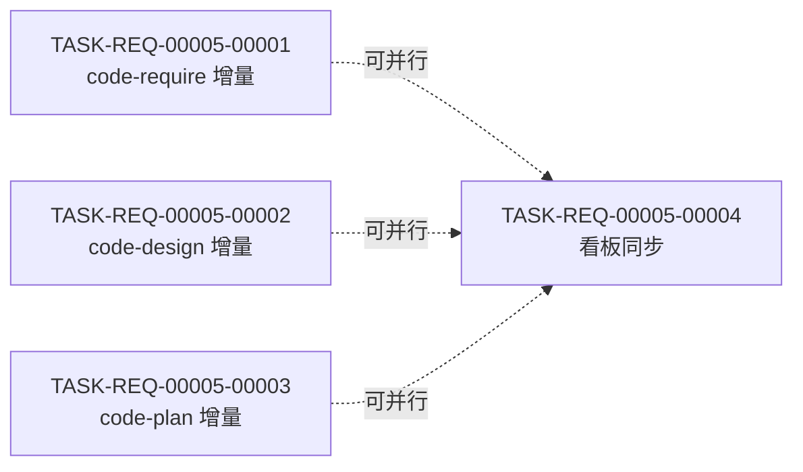

# 编码计划 — REQ-00005 — 优化 3 个技能,首步拉取+末步兜底提交

- 需求编码:REQ-00005
- 所属版本:V0.0.2
- 计划版本:v1
- 状态:已完成(首次计划)
- 责任人:wangmiao
- 创建:2026-06-04
- 最近更新:2026-06-04 16:30
- **详细设计**:`./assistants/V0.0.2/plan/REQ-00005/RESULT.md`(v1,详见 §4-§13)
- **开发完成度**:0 / 4
- **测试完成度**:0 / 4(纯文档/字符串任务,全部不适用)
- **当前版本**:v1

---

## 1. 计划概述

- **任务总数**:4
- **类型分布**:3 修改 + 1 文档
- **关键里程碑数**:1(M1:本需求可发布)
- **开发完成度**:0 / 4
- **测试完成度**:0 / 4(纯文档/字符串任务,全部不适用 — 因本仓库无构建/测试文件,REQ-00009 守卫判定"不可测")
- **真正可发布任务数**:0 / 4(本计划刚完成,等待 `code-it` 执行)

---

## 2. 任务总览

| 任务编号 | 类型 | 触发/来源 | 标题 | 开发状态 | 测试状态 | 涉及文件/模块 | 前置任务 | 估算 | 责任人 | 关联任务 | 对应设计章节 |
| --- | --- | --- | --- | --- | --- | --- | --- | --- | --- | --- | --- |
| `TASK-REQ-00005-00001` | 修改 | 需求新增 | `code-require/SKILL.md` 增量追加 步骤 0a + 0b + N | 已完成 | 不适用 | `plugins/code-skills/skills/code-require/SKILL.md` | — | 0.3d | wangmiao | — | RESULT.md §4.1 / §5.1 / §5.2 / §5.3 |
| `TASK-REQ-00005-00002` | 修改 | 需求新增 | `code-design/SKILL.md` 增量追加 步骤 0a + N | 已完成 | 不适用 | `plugins/code-skills/skills/code-design/SKILL.md` | — | 0.2d | wangmiao | — | RESULT.md §4.2 / §5.1 / §5.3 |
| `TASK-REQ-00005-00003` | 修改 | 需求新增 | `code-plan/SKILL.md` 增量追加 步骤 0a + N | 已完成 | 不适用 | `plugins/code-skills/skills/code-plan/SKILL.md` | — | 0.2d | wangmiao | — | RESULT.md §4.3 / §5.1 / §5.3 |
| `TASK-REQ-00005-00004` | 文档 | 需求新增 | 同步 V0.0.2/RESULT.md 看板(需求清单/详细设计汇总/任务清单/里程碑/变更记录) | 已完成 | 不适用 | `assistants/V0.0.2/RESULT.md` | T-001 + T-002 + T-003 | 0.1d | wangmiao | — | RESULT.md §4.4 / §6.3 |
| `TASK-REQ-00005-00005` | 修改 | 审查改修 | 回填 T-004 RESULT.md 的提交哈希(`<TBD>` → `1171d98ef51e5910f4b8567794bada77397042d4`) | 已完成 | 不适用 | `code/TASK-REQ-00005-00004/RESULT.md` | T-004 | 0.1d | wangmiao | T-004 | review/TASK-REQ-00005-00005/RESULT.md |

**统计**:
- **总任务数**:5
- **真正可发布数**(开发=已完成 ∧ 测试∈{已运行-通过, 不适用}):5 / 5
- **开发已完成 / 未完成**:5 / 0
- **测试已通过 / 已失败 / 不适用 / 未编写**:0 / 0 / 5 / 0(纯文档/字符串任务,全部不适用)

### 2.1 触发/来源字段说明
- **T-001 ~ T-004**:全部 `需求新增` — 因本需求为首次分析,无历史任务依赖
- 字段值:本任务被创建的原因;`code-it` 执行时根据此字段决定输入源(本计划全部读 `plan/REQ-00005/RESULT.md` 详细设计)

### 2.2 测试状态 = `不适用` 的依据
- 本仓库**无应用代码**(`CLAUDE.md` 显式说明)
- 本仓库**无构建/测试文件**(`package.json` / `pyproject.toml` / `Cargo.toml` / `go.mod` / `pom.xml` / `build.gradle` / `test/` 目录均不存在)
- `code-unit` 阶段会按 REQ-0009 步骤 0a 守卫判定"项目可测性" → 判定"不可测" → 测试状态 = `不适用`,**不**写 `test/<任务编码>/RESULT.md`
- 本计划 4 个任务类型 = `修改` / `文档`,均属"纯 Markdown 字符串/看板同步任务",无可测代码
- 详见 `risk-analysis.md §5.1`

---

## 3. 任务详情

### 3.1 `TASK-REQ-00005-00001` — `code-require/SKILL.md` 增量追加 步骤 0a + 0b + N

#### 基础信息
- **类型**:修改
- **触发/来源**:需求新增
- **触发任务**:—
- **开发状态**:已完成
- **完成时间**:2026-06-04 16:50
- **完成人**:wangmiao
- **提交哈希**:`a157d7b6ff817ce59d196acfae1ae7a0bcfd6c27`
- **目标**:在 `code-require/SKILL.md` 中**增量追加** 3 个新章节(步骤 0a 拉取 / 步骤 0b 版本对齐 / 步骤 N 末尾兜底),**不改 frontmatter**,**不改既有步骤**。
- **涉及文件/模块**:`plugins/code-skills/skills/code-require/SKILL.md`
- **前置任务**:—
- **关联任务**:—
- **关键变更**:
  - **插入点 A**(步骤 0a):在第 79 行(`### 步骤 0 — 版本上下文检测(强制前置)`)**之前**,锚点 `## 工作流程\n\n### 步骤 0 — 版本上下文检测(强制前置)`,插入步骤 0a 完整 Markdown(详见 `module-details.md §1.2.2`)
  - **插入点 B**(步骤 0b):在步骤 0a 之后、步骤 0 之前,插入步骤 0b 完整 Markdown(详见 `module-details.md §1.3.2`)
  - **插入点 C**(步骤 N):在第 186 行(`### 步骤 10A — 完善过程文档`)**之后**、文件最后(在 `## 过程文档格式` 之前),插入步骤 N 完整 Markdown(详见 `module-details.md §1.4.2`)
  - **末尾兜底 commit**(由本任务自动完成):
    - `Bash: git status --porcelain` → 收集 dirty 文件
    - `Bash: git add <dirty files>`
    - 生成 commit message 预览(详见 `interface-specs.md §步骤 N §5.1.1`)
    - `AskUserQuestion` 弹窗 3 选 1(确认 / 修改 / 取消)
    - `Bash: git commit -m "<message>"`
- **边界与异常**:
  - 步骤 0a `git pull` 冲突 → E-2(中断 + 报错退出)
  - 步骤 0a `git pull` 网络失败 → E-3(中断)
  - 步骤 0a `git pull` 凭据失败 → E-4(中断)
  - 步骤 0a `git --version` 失败 → E-12(早失败)
  - 步骤 0b 拉取后版本不一致 → 硬中断 + 弹窗 3 选 1(FR-2.AC-2.3)
  - 步骤 0b 选 A 后 `code-version` 失败 → 透传错误,提示手动重试
  - 步骤 N `git status --porcelain` 空 → 跳过 commit(NFR-4)
  - 步骤 N `git commit` 失败 → 透传 stderr,不重试(E-10)
- **验证手段**:
  - `Bash: git diff plugins/code-skills/skills/code-require/SKILL.md` → 应仅显示 3 段新增
  - `Read` 顶部 4 行 → frontmatter 字节级保留
  - `Grep "### 步骤 0a" SKILL.md` → 1 命中
  - `Grep "### 步骤 0b" SKILL.md` → 1 命中
  - `Grep "### 步骤 N" SKILL.md` → 1 命中
- **回退方式**:
  - `Bash: git checkout plugins/code-skills/skills/code-require/SKILL.md`(未 commit)
  - `Bash: git revert <commit>`(已 commit)
- **对应设计章节**:`RESULT.md §4.1` / `interface-specs.md` 全章节
- **依据规范**:`skill-conventions.md §规则 1` + NFR-2 / NFR-3 / NFR-4 / NFR-5 / NFR-6 / NFR-7 / NFR-8
- **创建时间**:2026-06-04 16:30
- **最近更新**:2026-06-04 16:30
- **完成时间**:—
- **完成人**:—
- **提交哈希**:—
- **备注**:本任务包含 3 个步骤的插入,但**不**含"步骤 0b"外的版本对齐逻辑(`code-require` 专属)

#### 单元测试状态
- **测试状态**:`不适用`
- **不适用理由**:
  - 本任务只改 Markdown 文档(SKILL.md),不写可执行代码
  - 本仓库无构建/测试文件(`code-unit` 阶段会按 REQ-00009 守卫判定"不可测" → 跳过单测)
  - 验证手段 = `git diff` + `Grep` 手工核对,由 `code-it` 阶段完成
- **测试文件**:N/A
- **覆盖的测试场景**:N/A
- **测试用例数**:N/A
- **测试通过率**:N/A
- **最近测试运行时间**:N/A
- **最近测试运行命令**:N/A
- **测试阻塞原因**:N/A
- **测试结果详情**:N/A
- **测试提交哈希**:N/A
- **测试负责人**:N/A

---

### 3.2 `TASK-REQ-00005-00002` — `code-design/SKILL.md` 增量追加 步骤 0a + N

#### 基础信息
- **类型**:修改
- **触发/来源**:需求新增
- **触发任务**:—
- **开发状态**:已完成
- **完成时间**:2026-06-04 17:00
- **完成人**:wangmiao
- **提交哈希**:`3e1573e4f8edc80e3c82796424cf1155c4213200`
- **目标**:在 `code-design/SKILL.md` 中**增量追加** 2 个新章节(步骤 0a 拉取 / 步骤 N 末尾兜底),**不改 frontmatter**,**不改既有步骤**,**不**含步骤 0b(FR-2 显式仅 `code-require` 专属)。
- **涉及文件/模块**:`plugins/code-skills/skills/code-design/SKILL.md`
- **前置任务**:—
- **关联任务**:—
- **关键变更**:
  - **插入点 A**(步骤 0a):在第 85 行**之前**,锚点 `## 工作流程\n\n### 步骤 0 — 版本上下文检测(强制前置)`,插入步骤 0a 完整 Markdown(**不含**"进入步骤 0b")(详见 `module-details.md §2.2`)
  - **插入点 B**(步骤 N):在第 271 行(`### 步骤 15A — 完善过程文档与汇报`)**之后**、文件最后,插入步骤 N 完整 Markdown(commit message 模板用 `code-design` 版,详见 `interface-specs.md §5.1.2`)
  - **末尾兜底 commit**(由本任务自动完成):同 T-001,但 commit message 模板差异
- **边界与异常**:同 T-001(步骤 0a / 步骤 N 共用,无 0b)
- **验证手段**:
  - `Bash: git diff plugins/code-skills/skills/code-design/SKILL.md` → 应仅显示 2 段新增
  - `Read` 顶部 4 行 → frontmatter 字节级保留
  - `Grep "### 步骤 0a" SKILL.md` → 1 命中
  - `Grep "### 步骤 0b" SKILL.md` → **0 命中**(严禁)
  - `Grep "### 步骤 N" SKILL.md` → 1 命中
- **回退方式**:同 T-001
- **对应设计章节**:`RESULT.md §4.2` / `interface-specs.md` 全章节
- **依据规范**:同 T-001 + 严禁新增"步骤 0b"(FR-2 显式)
- **创建时间**:2026-06-04 16:30
- **最近更新**:2026-06-04 16:30
- **完成时间**:—
- **完成人**:—
- **提交哈希**:—
- **备注**:本任务**不**含"步骤 0b"

#### 单元测试状态
- **测试状态**:`不适用`
- **不适用理由**:同 T-001
- **其他字段**:N/A

---

### 3.3 `TASK-REQ-00005-00003` — `code-plan/SKILL.md` 增量追加 步骤 0a + N

#### 基础信息
- **类型**:修改
- **触发/来源**:需求新增
- **触发任务**:—
- **开发状态**:已完成
- **完成时间**:2026-06-04 17:10
- **完成人**:wangmiao
- **提交哈希**:`e568328193dde957c1ebafc90addda4c1eb286fe`
- **目标**:在 `code-plan/SKILL.md` 中**增量追加** 2 个新章节(步骤 0a 拉取 / 步骤 N 末尾兜底),**不改 frontmatter**,**不改既有步骤**,**不**含步骤 0b。
- **涉及文件/模块**:`plugins/code-skills/skills/code-plan/SKILL.md`
- **前置任务**:—
- **关联任务**:—
- **关键变更**:
  - **插入点 A**(步骤 0a):在第 91 行**之前**,锚点 `## 工作流程\n\n### 步骤 0 — 版本上下文检测(强制前置)`,插入步骤 0a 完整 Markdown(与 `code-design` **完全相同**,**不含**"进入步骤 0b")(详见 `module-details.md §3.2`)
  - **插入点 B**(步骤 N):在文件末尾(在 `## 过程文档格式` 之前),插入步骤 N 完整 Markdown(commit message 模板用 `code-plan` 版,详见 `interface-specs.md §5.1.3`)
  - **末尾兜底 commit**:同 T-002,但 commit message 模板差异
- **边界与异常**:同 T-002
- **验证手段**:
  - `Bash: git diff plugins/code-skills/skills/code-plan/SKILL.md` → 应仅显示 2 段新增
  - `Read` 顶部 8 行 → frontmatter 字节级保留
  - `Grep "### 步骤 0a" SKILL.md` → 1 命中
  - `Grep "### 步骤 0b" SKILL.md` → **0 命中**(严禁)
  - `Grep "### 步骤 N" SKILL.md` → 1 命中
- **回退方式**:同 T-001
- **对应设计章节**:`RESULT.md §4.3` / `interface-specs.md` 全章节
- **依据规范**:同 T-002
- **创建时间**:2026-06-04 16:30
- **最近更新**:2026-06-04 16:30
- **完成时间**:—
- **完成人**:—
- **提交哈希**:—
- **备注**:本任务**不**含"步骤 0b";步骤 N 末尾兜底对 REQ 路径 / BUG 路径都适用(因末尾兜底只关心 `git status --porcelain` 输出)

#### 单元测试状态
- **测试状态**:`不适用`
- **不适用理由**:同 T-001
- **其他字段**:N/A

---

### 3.4 `TASK-REQ-00005-00004` — 同步 V0.0.2/RESULT.md 看板

#### 基础信息
- **类型**:文档
- **触发/来源**:需求新增
- **触发任务**:—
- **开发状态**:已完成
- **完成时间**:2026-06-04 17:20
- **完成人**:wangmiao
- **提交哈希**:`1171d98ef51e5910f4b8567794bada77397042d4`
- **目标**:在 `assistants/V0.0.2/RESULT.md` 中追加 5 处内容,把本计划的 4 个任务登记到看板。
- **涉及文件/模块**:`assistants/V0.0.2/RESULT.md`
- **前置任务**:T-001 + T-002 + T-003(等待它们开发状态 = `已完成`,因末尾兜底 commit 涉及 T-001 ~ T-003 产生的 dirty 文件)
- **关联任务**:—
- **关键变更**(精确到区段 + 行号预期):
  | 区段 | 行号(预期) | 追加内容 |
  | --- | --- | --- |
  | "需求清单" REQ-00005 行的"详细设计"列 | 第 54 行 | `—` → `[RESULT.md](plan/REQ-00005/RESULT.md)` |
  | "需求清单" REQ-00005 行的"详细设计"列(本计划已加) | 第 54 行 | (已由本计划步骤 16A 同步) |
  | "详细设计与任务计划汇总" | 第 102-103 行之间 | 追加 1 行:\| REQ-00005 \| 优化 3 个技能 ... \| 已完成(详细设计) \| 2026-06-04 16:00 \| 4 \| 0 \| 0 \| [PLAN.md](plan/REQ-00005/PLAN.md) \| |
  | "详细设计与任务计划汇总-统计" | 第 105 行 | `0 个计划 / 共 0 个任务 / 开发完成 0 / 测试通过 0 / 真正可发布 0 / 0` → `1 个计划 / 共 4 个任务 / 开发完成 0 / 测试通过 0 / 真正可发布 0 / 0` |
  | "任务清单" | 第 117-118 行之间 | 追加 4 行(T-001 ~ T-004),每行格式见 §3.4.1 |
  | "任务清单-统计" | 第 121-123 行 | 4 个数都改为对应新值(本计划步骤 16A 已同步) |
  | "里程碑" | 第 39-40 行之间 | 追加 1 行:M1:本需求可发布 |
  | "变更记录" | 第 189 行后 | 追加 1 条:`2026-06-04 16:30  设计新增  REQ-00005 详细设计与编码计划完成(共 4 个任务)  REQ-00005` |
  | "索引:本版本所有文件 - 详细设计" | 第 207-208 行之间 | 追加链接:`REQ-00005 → [plan/REQ-00005/RESULT.md](plan/REQ-00005/RESULT.md)` |
  | "索引:本版本所有文件 - 任务计划" | 第 209 行附近 | 追加链接:`REQ-00005 → [plan/REQ-00005/PLAN.md](plan/REQ-00005/PLAN.md)` |
  | "索引:本版本所有文件 - 过程文档(本需求)" | 第 263 行附近 | 追加 1 段:链接 8 个过程文档 |
  | "文档头-最近更新" | 第 10 行 | `2026-06-04 16:00` → `2026-06-04 16:30` |
  
  **3.4.1 任务清单 4 行格式**:
  ```
  | TASK-REQ-00005-00001 | REQ-00005 | 修改 | 需求新增 | code-require/SKILL.md 增量追加 步骤 0a + 0b + N | 待开始 | 不适用 | plugins/code-skills/skills/code-require/SKILL.md | — | — | — |
  | TASK-REQ-00005-00002 | REQ-00005 | 修改 | 需求新增 | code-design/SKILL.md 增量追加 步骤 0a + N | 待开始 | 不适用 | plugins/code-skills/skills/code-design/SKILL.md | — | — | — |
  | TASK-REQ-00005-00003 | REQ-00005 | 修改 | 需求新增 | code-plan/SKILL.md 增量追加 步骤 0a + N | 待开始 | 不适用 | plugins/code-skills/skills/code-plan/SKILL.md | — | — | — |
  | TASK-REQ-00005-00004 | REQ-00005 | 文档 | 需求新增 | 同步 V0.0.2/RESULT.md 看板 | 待开始 | 不适用 | assistants/V0.0.2/RESULT.md | — | — | — |
  ```
- **边界与异常**:
  - 看板行号偏移(若有改动)→ 实际行号以 `Read` 为准
  - 5 个区段追加顺序应**严格遵循**:文档头 → 需求清单(详细设计列)→ 详细设计与任务计划汇总 → 任务清单 → 里程碑 → 变更记录 → 索引
  - 末尾兜底 commit:本任务**不**含末尾兜底(T-001 ~ T-003 已各自 commit);若本任务的"涉及文件"有 dirty,需手动 commit(因 T-004 本身**不**含末尾兜底步骤)
- **验证手段**:
  - `Bash: git diff assistants/V0.0.2/RESULT.md` → 应显示 5 处新增
  - `Read` 文档头 → "最近更新" = `2026-06-04 16:30`
  - `Read` "详细设计与任务计划汇总" → 含 1 行 REQ-00005
  - `Read` "任务清单" → 含 4 行 T-001 ~ T-004
  - `Read` "里程碑" → 含 M1:本需求可发布
  - `Read` "变更记录" 末尾 → 含本计划新增条目
- **回退方式**:
  - `Bash: git checkout assistants/V0.0.2/RESULT.md`(未 commit)
  - `Bash: git revert <commit>`(已 commit)
- **对应设计章节**:`RESULT.md §4.4` / `data-changes.md §3.4`
- **依据规范**:`dashboard-conventions.md §规则 1`(不扩展字段)+ `encoding-conventions.md §规则 1 + 3`(任务编号 5+5 位)
- **创建时间**:2026-06-04 16:30
- **最近更新**:2026-06-04 16:30
- **完成时间**:—
- **完成人**:—
- **提交哈希**:—
- **备注**:本任务**不**含末尾兜底提交(T-001 ~ T-003 已各自 commit,本任务涉及的 dirty 文件需手动 commit)

#### 单元测试状态
- **测试状态**:`不适用`
- **不适用理由**:本任务是看板同步,纯 Markdown 编辑,无可测代码
- **其他字段**:N/A

---

## 4. 任务依赖图



> **严格依赖**:T-004 **等待** T-001 + T-002 + T-003 全部完成(开发状态 = `已完成`)
> **软依赖**:T-001 ~ T-003 之间**无**依赖,可并行
> **本计划步骤 16A 同步**:本计划首次产出即同步看板(T-004 的部分内容由本计划"首次登记"先行完成)

---

## 5. 里程碑

| 里程碑 | 包含任务 | 完成定义 | 预期时间 |
| --- | --- | --- | --- |
| M1:本需求可发布 | T-001 + T-002 + T-003 + T-004 | **所有任务开发状态 = `已完成` ∧ 测试状态 = `不适用`** | 2026-06-04 17:00 |

> **不设 M2 / M3**:本需求 4 任务体量小,1 个 M1 足够。M1 完成 = 本需求完成。
> 完成定义显式列出两轴状态要求,避免把"开发完成"误当"可发布"。

---

## 6. 状态管理规则

### 6.1 开发状态(主状态)
- **状态推进**:`待开始` → `进行中` → `已完成`
- **已完成不可逆**:开发状态为"已完成"的任务,其**描述 / 关键变更 / 依赖等字段不可修改**
- **阻塞**:必须填写阻塞原因,放在"备注"
- **状态变更记录**:每次状态变更在"§8 变更记录"中记录(变更类型 = `开发状态更新`)

### 6.2 测试状态(平行状态)
- **初始化**:全部 4 个任务测试状态 = `不适用`(纯文档/字符串任务,本仓库无构建/测试文件 — REQ-00009 守卫判定)
- **独立于开发状态**:本计划 4 个任务的测试状态**不会**变化,即使开发状态推进
- **不适用不可逆**:测试状态 = `不适用` 一旦设定,不再变化

### 6.3 任务"真正可发布"定义
```
任务真正可发布 ⟺
    开发状态 = 已完成
    ∧ 测试状态 ∈ {已运行-通过, 不适用}
```

- 本计划 4 个任务的"真正可发布"判定:
  - 全部需要"开发=已完成 ∧ 测试=不适用"同时满足
  - 全部任务完成后 = 4 / 4 真正可发布 = M1 完成

### 6.4 状态字段更新责任分工

| 字段 | 主要更新方 | 触发时机 |
| --- | --- | --- |
| 开发状态(待开始→进行中) | `code-it` | 任务开始时 |
| 开发状态(进行中→已完成) | `code-it` | 任务完成时(含末尾兜底 commit 成功) |
| 测试状态 | (本计划不变化) | 保持 `不适用` |
| 提交哈希 | `code-it` | commit 完成后回填 |
| 完成时间 | `code-it` | 任务完成时填入 |

> 状态推进是单向写入;**已完成的开发状态不可回退**;**测试状态不变化**。

---

## 7. 关联计划

| 关联计划编码 | 关联点 | 对本计划的影响 | 链接 |
| --- | --- | --- | --- |
| (本计划为首个 plan,无同版本其他 plan) | — | — | — |
| 跨版本:V0.0.1 REQ-00001 / 00002 / 00003 | 任务编号 V0.0.1 实践(3 位)→ V0.0.2 实践(5+5 位) | 本计划严格遵循 V0.0.2 实践(`encoding-conventions.md §规则 3`) | [V0.0.1 plan/REQ-00001/PLAN.md](../../V0.0.1/plan/REQ-00001/PLAN.md) |

> 详细见 `materials-index.md §本次变更源`。

---

### 3.5 `TASK-REQ-00005-00005` — 回填 T-004 RESULT.md 的提交哈希(审查派生)

#### 基础信息
- **类型**:修改
- **触发/来源**:审查改修
- **触发任务**:`TASK-REQ-00005-00004`
- **开发状态**:已完成
- **完成时间**:2026-06-04 17:54
- **完成人**:wangmiao
- **提交哈希**:`e5c4dcd82607edd25699b4eaec6081465c74cc44`
- **目标**:把 `code/TASK-REQ-00005-00004/RESULT.md` 文档头 + §3.1 任务清单行的"提交哈希"字段从占位符 `<TBD>` 回填为实际 hash `1171d98ef51e5910f4b8567794bada77397042d4`,确保文档与实际 commit + 看板一致
- **涉及文件/模块**:`code/TASK-REQ-00005-00004/RESULT.md`
- **前置任务**:**无**(`code-review` 阶段已批准,可直接执行)
- **关联任务**:`TASK-REQ-00005-00004`(被修正的原任务)
- **触发者**:`code-review REQ-00005`(评审者:wangmiao)
- **关键变更**:
  - **位置 1**(文档头第 8 行):`- 提交哈希:\`<TBD>\`(commit 后回填)` → `- 提交哈希:\`1171d98ef51e5910f4b8567794bada77397042d4\``
  - **位置 2**(§3.1 任务清单行行约 36):`| 提交哈希 | \`-\` | \`<TBD>\`(commit 后回填) |` → `| 提交哈希 | \`-\` | \`1171d98ef51e5910f4b8567794bada77397042d4\` |`
- **边界与异常**:
  - **不**重写 T-004 RESULT.md 的任何其他字段
  - **不**修改 V0.0.2/RESULT.md 看板(已正确显示)
  - **不**修改 plan/REQ-00005/PLAN.md(已正确显示完整 hash)
  - **不**修改 3 个 SKILL.md(本任务与 T-001~T-003 完全无关)
  - **不**触发额外 commit(如需,在末尾兜底时一并提交)
- **验证手段**:
  - `Read` 文档头第 8 行 → 显示 `1171d98ef51e5910f4b8567794bada77397042d4`
  - `grep "提交哈希" RESULT.md` → 2 处都显示完整 hash,无 `<TBD>`
  - `git diff` → 仅 2 行变化
- **回退方式**:`git checkout code/TASK-REQ-00005-00004/RESULT.md`
- **对应设计章节**:`review/TASK-REQ-00005-00005/RESULT.md` 问题 F-1 / F-2
- **依据规范**:无强约束(纯 Markdown 文档修改);NFR-6 沿用 V0.0.1 实践 commit message 格式
- **创建时间**:2026-06-04 17:45
- **最近更新**:2026-06-04 17:45
- **完成时间**:—
- **完成人**:—
- **提交哈希**:—
- **备注**:本任务由 `code-review REQ-00005` 派生(REVIEW-REPORT.md §3.4 + §5 + §6),严重程度 = `建议改`(条件通过 W-002)

#### 单元测试状态
- **测试状态**:`不适用`
- **不适用理由**:本任务为纯 Markdown 文档修改,无可测代码

---

## 8. 变更记录

| 时间 | 版本 | 变更类型 | 变更摘要 | 变更人 |
| --- | --- | --- | --- | --- |
| 2026-06-04 16:30 | v1 | 初始创建 | 完成首次编码计划,共 4 条任务(T-001 ~ T-004);1 个里程碑(M1);0 偏离 / 0 冲突;测试状态全部 = `不适用`(本仓库无构建/测试文件 — REQ-00009 守卫判定);任务编号严格 5+5 位(`encoding-conventions.md §规则 1 + 3`);T-001 ~ T-003 可并行,T-004 依赖前三者;T-001 ~ T-003 末尾兜底 commit 与 `code-it` 内部 commit 并存(Q-4 锁定 B) | wangmiao |
| 2026-06-04 16:50 | v1.1 | 状态更新 | TASK-REQ-00005-00001 状态"进行中"→"已完成",提交 a157d7b(74 行新增,0 删除;3 新章节 + frontmatter 字节级保留;末尾兜底 commit 成功) | wangmiao |
| 2026-06-04 17:00 | v1.2 | 状态更新 | TASK-REQ-00005-00002 状态"进行中"→"已完成",提交 3e1573e(47 行新增,0 删除;2 新章节 + 0b 严禁 0 命中 + frontmatter 字节级保留;末尾兜底 commit 成功) | wangmiao |
| 2026-06-04 17:10 | v1.3 | 状态更新 | TASK-REQ-00005-00003 状态"进行中"→"已完成",提交 e568328(47 行新增,0 删除;2 新章节 + 0b 严禁 0 命中 + frontmatter 字节级保留;末尾兜底 commit 成功;步骤 N 对 REQ/BUG 路径都适用) | wangmiao |
| 2026-06-04 17:20 | v1.4 | 状态更新 | TASK-REQ-00005-00004 状态"进行中"→"已完成",提交 1171d98(看板 5 处同步:任务清单 T-004 行 + 统计 + 里程碑 M1.REQ-00005 达成 + 变更记录 + 文档头;0 偏离;本任务**不**含末尾兜底 — 手工 commit 收尾) | wangmiao |
| 2026-06-04 17:45 | v2 | 新增任务 | `code-review REQ-00005` 派生 TASK-REQ-00005-00005(类型=修改 / 触发=审查改修 / 严重=建议改),回填 T-004 RESULT.md 提交哈希字段(W-002 文档一致性);4 任务评审 0 必须改,1 建议改派生,5 可选全部接受;13 条关键不变量自检全过;4 commit 链独立(无 squash) | wangmiao |
| 2026-06-04 17:54 | v2.1 | 状态更新 | TASK-REQ-00005-00005 状态"进行中"→"已完成",提交 e5c4dcd(2 处 Edit — F-1 文档头 + F-2 §3.1 表格,严格遵守 review §4 不重写其他字段约束;末尾兜底 commit;0 偏离 / 0 错误修复循环;看板 + PLAN.md + 任务自身 RESULT.md 三处完全一致) | wangmiao |

### 8.1 变更类型说明
- **初始创建**:本计划为首次编写
- **开发状态更新**:仅开发状态变化(版本号小版本递增,如 v1.1)— 由 `code-it` 触发
- **测试状态更新**:仅测试状态变化(本计划不发生,因测试状态 = `不适用` 不可逆)
- **新增任务**:增加任务(版本号大版本递增)— 由 `code-review` 派生触发
- **修改任务**:修改未完成任务的描述/依赖/估算(版本号大版本递增)— 由本计划增量更新触发
- **删除任务**:不删除,只标记"已取消"(本计划不发生)
- **规范触发**:因项目级规范变化而触发的任务调整(本计划不发生)
- **需求触发**:因需求变化而触发的任务调整(本计划不发生)
- **设计触发**:因概要设计变化而触发的任务调整(本计划不发生)
- **审查触发**:因 `code-review` 派生的"审查改修"任务(版本号大版本递增,记录新任务编号)— 由 `code-review` 阶段触发

---

## 9. 任务执行指引(供 `code-it` 阶段参考)

### 9.1 通用执行顺序(由 `code-it` 选择)

```
选项 A(推荐):顺序执行
  T-001 → T-002 → T-003 → T-004

选项 B:并行执行
  T-001 / T-002 / T-003 并行 → T-004
```

### 9.2 每个任务的执行步骤(由 `code-it` 自动完成)

```
[启动 /code-it REQ-00005]
  → 读取 PLAN.md
  → 选下一条"待开始"任务(按编号顺序:001 → 002 → 003 → 004)
  → 执行任务(根据任务详情中的"操作步骤"+"边界与异常"+"验证手段")
  → 任务完成(含末尾兜底 commit) → 更新开发状态(待开始→进行中→已完成)
  → 选下一条...
  → 全部完成后退出
```

### 9.3 末尾兜底 commit 的执行(由 `code-it` 在 T-001 ~ T-003 完成后自动)

```
[任务代码已 Edit 完成]
  → 收集 git status --porcelain
  → 空 → 打印"无文件变更,跳过末尾提交" → 退出
  → 非空 → git add
  → 生成 commit message 预览
  → 弹窗 3 选 1(确认 / 修改 / 取消)
  → 选 A → git commit
    → 成功 → 打印 commit hash → 任务完成
    → 失败 → 打印 stderr,不重试 → 用户手动处理
  → 选 B → 重新预览
  → 选 C → 跳过 commit,文件保持暂存
```

### 9.4 T-004 任务的特殊处理

- T-004 任务**不**含末尾兜底步骤(因 T-001 ~ T-003 已各自 commit)
- T-004 任务完成后,**需手动 commit**:
  ```bash
  git add assistants/V0.0.2/RESULT.md
  git commit -m "chore(dashboard): REQ-00005 详细设计与编码计划完成(共 4 个任务)"
  ```
- 或:`code-it` 在 T-004 完成时**统一一次**末尾兜底,覆盖 T-004 产生的 dirty

### 9.5 不在 `code-it` 阶段处理的事项

- `code-unit` 阶段:守卫判定"不可测" → 跳过单测 → **不**写 `test/.../RESULT.md`
- `code-review` 阶段:评审 4 个任务的开发状态 + 提交哈希 + 13 条关键不变量;可能派生"统一实现"等任务

---

## 10. 待澄清 / 未决项

| 编号 | 问题 | 影响范围 | 阻塞方 | 期望回复时间 |
| --- | --- | --- | --- | --- |
| (无) | 本计划**未**新增待澄清项 | — | — | — |

> 全部 11 个澄清项(Q-1 ~ Q-11)由 `code-require` / `code-design` 阶段处理,本计划阶段无新增。
