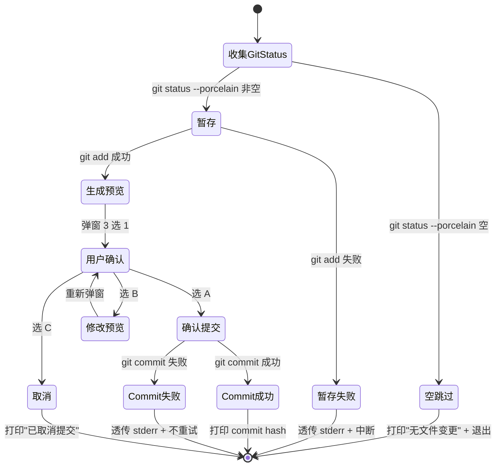
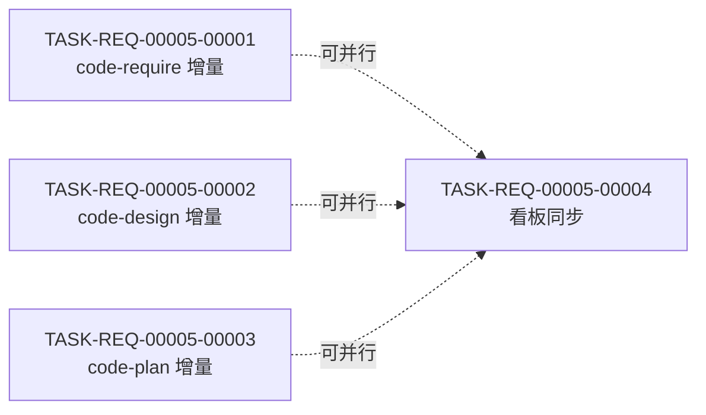

# 详细设计 — REQ-00005(优化 `/code-require` / `/code-design` / `/code-plan`,增加"首步拉取最新代码"与"末步兜底提交")

- 需求编码:REQ-00005
- 所属版本:V0.0.2
- 计划版本:v1
- 状态:已完成(首次设计)
- 责任人:wangmiao
- 创建:2026-06-04
- 最近更新:2026-06-04 16:30
- **上游需求**:`./assistants/V0.0.2/require/REQ-00005/RESULT.md`(v1,6 FR / 8 NFR / ~32 AC,已锁定)
- **上游概要设计**:`./assistants/V0.0.2/design/REQ-00005/RESULT.md`(v1,4 设计决策 / 13 不变量 / 100% 规范合规)
- **遵循规范**:`./assistants/rules/` 下 **13 个文件**(详见 §3 与 `rule-compliance.md`)

---

## 1. 详细设计概述

本计划是 `code-require` → `code-design` → **`code-plan`** 链路的第三步,把概要设计的"系统长什么样"落地为"如何具体改 + 哪些任务可被独立追踪"。

**核心目标**:把 3 个 SKILL.md 的**精确插入点(行号 + 锚点字符串 + 完整 Markdown 文本)** + 1 个看板同步任务关联起来,4 个任务可被独立追踪状态。

**与概要设计的关系**:本计划**不**重新讨论"插入哪些步骤",只细化:
- 每个插入点的**精确位置**(行号预期 + 锚点字符串 + 完整 Markdown)
- 每个工作流步骤的**完整伪代码 + 弹窗文本 + 错误码**
- 每个文件级变更的**字段级清单**
- 13 个边界场景的**触发条件 / 检测手段 / 处理策略 / 监控指标 / 回退方式**
- 4 个任务的**依赖 / 里程碑 / 状态管理细节**

---

## 2. 上游引用

| 来源 | 路径 | 版本 | 提取要点 |
| --- | --- | --- | --- |
| 需求 | `require/REQ-00005/RESULT.md` | v1 | 6 FR / 8 NFR / ~32 AC / 13 边界 / 8 澄清项(Q-1~Q-4 锁定) |
| 概要设计 | `design/REQ-00005/RESULT.md` | v1 | 3 SKILL.md 增量 / 4 决策(D-1/D-2/D-3/D-5)/ 13 不变量 / 100% 规范合规 |
| 概要过程文档 | `design/REQ-00005/{clarifications,design-notes,module-breakdown,dependencies,related-designs,rule-compliance,materials-index}.md` | v1 | Q 默认值 / 模块清单 / 依赖盘点 / 关联设计 / 规范遵循 |

**规范引用**:见 `rule-compliance.md`。

---

## 3. 规范遵循(总账)

### 3.1 适用的规范文件

| 规范文件 | 类别 | 关键约束 | 本计划对应章节 |
| --- | --- | --- | --- |
| `skill-conventions.md` | 技能编写 | §规则 1 — frontmatter 字节级保留 | §4(模块 #1/2/3 不动 frontmatter) |
| `dashboard-conventions.md` | 看板与模板 | §规则 1 — 字段扩展需三同步 | §10(看板同步仅追加,不扩展) |
| `doc-conventions.md` | 文档编写 | §规则 1 — README 中英同次提交 | (不触发,FR-6.AC-6.3) |
| `marketplace-protocol.md` | Marketplace 协议 | §规则 1 — `$schema` 等必填 | (不触发,FR-6 严禁) |
| `encoding-conventions.md` | 编码格式 | §规则 1 — REQ/BUG 5 位;§规则 3 — TASK 嵌套式 5+5 位 | §6.3 / §10(任务编号强约束) |
| `migration-mapping.md` | 编码迁移 | §规则 1-4(不触发) | — |
| `commit-conventions.md` | 提交与合并 | §规则 1 占位;NFR-6 显式不填充 | §7.2(commit 模板沿用 V0.0.1 实践) |
| `dependency-conventions.md` | 三方依赖 | §规则 1 占位 | §11(NFR-1 零新增) |
| 其他 5 个占位规范 | 各类 | 占位 | (不触发) |

### 3.2 规范自检结论
- **完全合规**:§4(模块 #1/2/3 全部增量修改,frontmatter 字节级保留)
- **经用户授权偏离**:**无**
- **待澄清冲突**:**无**

### 3.3 用户授权的偏离
**无**。本计划 100% 合规。

### 3.4 待澄清的规范冲突
**无**。完全继承 design 阶段的合规结论。

> 详细见 `rule-compliance.md`。

---

## 4. 模块详细化(对应概要设计 §7)

### 4.1 模块 #1 — `code-require`(对应概要设计 §7.2)

#### 4.1.1 关键变更点

| 插入点 | 位置(预期行号) | 锚点 | 插入内容 |
| --- | --- | --- | --- |
| 步骤 0a | 第 79 行**之前** | `## 工作流程\n\n### 步骤 0 — 版本上下文检测(强制前置)` | 步骤 0a 完整 Markdown(详见 `module-details.md §1.2.2`) |
| 步骤 0b | 步骤 0a **之后**,步骤 0 **之前** | 步骤 0a 最后一行(`4. 拉取成功...进入步骤 0b`) + 步骤 0 标题 | 步骤 0b 完整 Markdown(详见 `module-details.md §1.3.2`) |
| 步骤 N | 第 186 行**之后** | `### 步骤 10A — 完善过程文档` + 之后的 `## 过程文档格式` 之前 | 步骤 N 完整 Markdown(详见 `module-details.md §1.4.2`) |

#### 4.1.2 关键设计点
- **步骤 0a**:完整伪代码见 `interface-specs.md §步骤 0a`
- **步骤 0b**(仅 `code-require`):完整伪代码 + 弹窗文本见 `interface-specs.md §步骤 0b`
- **步骤 N**:完整伪代码 + 弹窗文本 + commit message 模板见 `interface-specs.md §步骤 N`

#### 4.1.3 强约束不动
- YAML frontmatter(1-4 行):字节级保留
- 既有"步骤 0 — 版本上下文检测":全文保留
- 既有"步骤 1-10A / 5B-10B":全文保留
- 既有"过程文档格式" / "衔接" / "不要做的事" 小节:全文保留

#### 4.1.4 状态归属
- 内部状态:N/A(本仓库无运行时)
- 外部状态:步骤 0a 读取 `.current-version`(NFR-8),步骤 0b 持有"拉取前/后版本"局部变量,步骤 N 操作 git 状态

#### 4.1.5 错误处理范式
- 异常类型:边界场景 E-1 ~ E-13(详见 `risk-analysis.md`)
- 返回值:N/A(无运行时)
- 全局兜底:N/A

#### 4.1.6 关键调用顺序
```
[启动 /code-require REQ-00005]
  → 步骤 0a(拉取 + 读 .current-version)
  → 步骤 0b(对比版本,不一致则询问)
  → 步骤 0(沿用)
  → 步骤 1-9A / 5B-10B(原流程)
  → 步骤 N(末尾兜底)
  → 退出
```

#### 4.1.7 依据规范
- `skill-conventions.md §规则 1`(frontmatter 不变)
- NFR-2(增量修改) / NFR-3(硬中断) / NFR-4(幂等) / NFR-5(错误透明) / NFR-6(commit 格式) / NFR-7(`code-it` 边界) / NFR-8(拉取后状态)

### 4.2 模块 #2 — `code-design`(对应概要设计 §7.3)

#### 4.2.1 关键变更点

| 插入点 | 位置(预期行号) | 锚点 | 插入内容 |
| --- | --- | --- | --- |
| 步骤 0a | 第 85 行**之前** | `## 工作流程\n\n### 步骤 0 — 版本上下文检测(强制前置)` | 步骤 0a 完整 Markdown(**不含**"进入步骤 0b") |
| 步骤 N | 第 271 行**之后** | `### 步骤 15A — 完善过程文档与汇报` + 之后的 `## 过程文档格式` 之前 | 步骤 N 完整 Markdown(commit message 模板用 `code-design` 版) |

#### 4.2.2 强约束不动
- YAML frontmatter(1-4 行)
- 既有"步骤 0 — 版本上下文检测"
- 既有"步骤 1-14A / 15A"
- 既有"过程文档格式" / "7B 增量更新" 小节
- **新增"步骤 0b"**:**禁止**(`code-design` 不做版本对齐)

#### 4.2.3 依据规范
- 同 §4.1.7

### 4.3 模块 #3 — `code-plan`(对应概要设计 §7.4)

#### 4.3.1 关键变更点

| 插入点 | 位置(预期行号) | 锚点 | 插入内容 |
| --- | --- | --- | --- |
| 步骤 0a | 第 91 行**之前** | `## 工作流程\n\n### 步骤 0 — 版本上下文检测(强制前置)` | 步骤 0a 完整 Markdown(**不含**"进入步骤 0b") |
| 步骤 N | 文件末尾(在 `## 过程文档格式` 之前) | `## 过程文档格式` 标题 | 步骤 N 完整 Markdown(commit message 模板用 `code-plan` 版) |

#### 4.3.2 强约束不动
- YAML frontmatter(1-8 行)
- 既有"步骤 0 — 版本上下文检测"
- 既有"步骤 1-18A / 13B / 19-28(BUG 路径)"
- **新增"步骤 0b"**:**禁止**

#### 4.3.3 依据规范
- 同 §4.1.7

### 4.4 模块 #4 — 版本看板同步(对应概要设计 §7.5 / §10)

#### 4.4.1 关键变更点
- 详见 `data-changes.md §3.4` 字段级清单
- 任务编号:`TASK-REQ-00005-00001 ~ 00004`(`encoding-conventions.md §规则 1 + 3` 强约束)

#### 4.4.2 依据规范
- `dashboard-conventions.md §规则 1`(不扩展字段,仅追加)
- `encoding-conventions.md §规则 1 + 3`(任务编号 5+5 位)

### 4.5 自检 — 强约束不动(完整自检表见 `module-details.md §自检`)

| 检查项 | 状态 |
| --- | --- |
| 3 个 SKILL.md frontmatter 字节级保留 | ✅ |
| 既有步骤 0-15A 全文保留 | ✅ |
| `code-version` / `code-it` / `code-unit` / `code-review` SKILL.md 不动 | ✅ |
| `marketplace.json` / `plugin.json` 不动 | ✅ |
| `CLAUDE.md` / README*.md 不动 | ✅ |
| 13 个规范文件不动 | ✅ |
| 新增"步骤 0b"仅在 `code-require` | ✅ |
| 任务编号遵循 `TASK-REQ-00005-NNNNN` 5+5 位 | ✅ |

---

## 5. 算法与逻辑(详细化)

### 5.1 算法 1:步骤 0a 拉取最新代码(对应概要设计 §5.2 / §5.3 / §6.1)

#### 5.1.1 目的
保证工作上下文的"新鲜性",在 3 个技能启动后立即与远端同步。

#### 5.1.2 输入/输出
- **输入**:无
- **输出**:`pulled_version` 字符串(供后续步骤 0b / 步骤 0 使用)

#### 5.1.3 复杂度
- **时间**:O(1)(Bash 命令调用,主要耗时在 `git pull` 网络,本仓库通常 < 2 秒)
- **空间**:O(1)

#### 5.1.4 伪代码
详见 `interface-specs.md §步骤 0a 完整伪代码`

#### 5.1.5 关键决策与权衡
- **探测 `git --version` 优先于 `git pull`**:E-12 早失败原则(避免后续奇怪错误)
- **3 种失败分类**(E-2/E-3/E-4):NFR-5 错误透明 + 用户体验
- **`Read .current-version` 立即读**:NFR-8 强约束(不缓存)

#### 5.1.6 边界条件
- **空仓库 / 无 remote**:`git pull` 失败 → 走 E-2/E-3/E-4(关键词匹配不上,落入"其他错误"分支)
- **极慢网络**:`git pull` 可能超时(取决于 git 配置),走 E-3
- **并发**:`code-require` / `code-design` / `code-plan` 是顺序工作流,无并发

#### 5.1.7 对应任务
- `TASK-REQ-00005-00001`(步骤 0a 部分)
- `TASK-REQ-00005-00002`(步骤 0a 部分)
- `TASK-REQ-00005-00003`(步骤 0a 部分)

#### 5.1.8 依据规范
- NFR-8(拉取后立即读)

### 5.2 算法 2:步骤 0b 版本对齐检查(对应概要设计 §5.2 / §6.2)

#### 5.2.1 目的
识别"用户意图版本"与"远端实际版本"的不一致,提供"切换 / 在本地继续 / 取消"三选一。

#### 5.2.2 输入/输出
- **输入**:`pulled_version` 字符串(算法 1 的输出)
- **输出**:`"proceed"`(进入步骤 0) / 退出(选 A) / 进入步骤 0(选 B) / 退出(选 C)

#### 5.2.3 复杂度
- **时间**:O(1) + 用户思考时间
- **空间**:O(1)

#### 5.2.4 伪代码
详见 `interface-specs.md §步骤 0b 完整伪代码`

#### 5.2.5 关键决策与权衡
- **硬中断(NFR-3)**:不一致时**不**进入步骤 1,避免"在错误版本上工作"
- **独立调 `code-version`(FR-5.AC-5.2)**:隔离 `code-require` 与 `code-version`,符合"独立技能调用"约定
- **不续跑 `code-require`**:切换后用户需重跑,符合"`code-version` 已执行完毕"语义

#### 5.2.6 边界条件
- **选 A 后 `code-version` 失败**:透传错误,提示手动重试
- **选 B 时用户在错误版本中创建需求**:由后续阶段(如 `code-design`)的步骤 0 验证发现
- **`AskUserQuestion` 协议层超时**:E-11 协议保证无超时

#### 5.2.7 对应任务
- `TASK-REQ-00005-00001`(步骤 0b 部分,仅 `code-require`)

#### 5.2.8 依据规范
- FR-2 + NFR-3(硬中断) + FR-5.AC-5.2(独立调用)

### 5.3 算法 3:步骤 N 末尾兜底提交(对应概要设计 §5.4 / §6.3)

#### 5.3.1 目的
零遗漏地把"过程文件 + 结果文件"提交入库。

#### 5.3.2 输入/输出
- **输入**:无(读 git 状态)
- **输出**:`"committed"` / `"skipped"` / `"cancelled"` / `"failed"`

#### 5.3.3 复杂度
- **时间**:O(N) 其中 N = dirty 文件数(本仓库 < 10,通常 < 1 秒)
- **空间**:O(N)(暂存文件列表)

#### 5.3.4 伪代码
详见 `interface-specs.md §步骤 N 完整伪代码`

#### 5.3.5 关键决策与权衡
- **空跳过(NFR-4)**:`git status --porcelain` 空时静默跳过,避免污染 commit 历史
- **不特判"已 commit 文件"**(Q-4 锁定 B):`code-it` 内部 commit 的文件**自然不在** `git status --porcelain` 输出中,无需特判
- **3 选 1 弹窗(Q-3 锁定 A)**:用户有最终决定权,符合"AI 协作"惯例
- **commit 失败不重试**(E-10):避免阻塞用户,透明化错误

#### 5.3.6 边界条件
- **用户在步骤 N 之前已 `git add` 但未 commit**:步骤 N 步骤 1 的 `git status --porcelain` 仍列出该文件(因未 commit),正常处理
- **用户在另一终端 `git pull` 后产生新 dirty**:本仓库长会话单用户,基本不发生
- **commit message 含特殊字符**:用 `shlex.quote` 转义

#### 5.3.7 对应任务
- `TASK-REQ-00005-00001`(步骤 N 部分)
- `TASK-REQ-00005-00002`(步骤 N 部分)
- `TASK-REQ-00005-00003`(步骤 N 部分)
- `TASK-REQ-00005-00004`(看板同步,因末尾 commit 涉及)

#### 5.3.8 依据规范
- FR-3 / NFR-4(幂等) / NFR-5(错误透明) / NFR-6(commit 格式) / NFR-7(与 `code-it` 边界)

### 5.4 状态机图(末尾兜底提交)



---

## 6. 数据结构完整变更(对应概要设计 §9)

详见过程文档 `data-changes.md`,本节只放总览。

### 6.1 新增实体
- **无**(本仓库无运行时实体)

### 6.2 修改实体
- **无**(本仓库无运行时实体)

### 6.3 文件级变更总览

| 文件 | 变更类型 | 涉及任务 |
| --- | --- | --- |
| `plugins/code-skills/skills/code-require/SKILL.md` | 增量追加 3 章节(0a/0b/N)+ frontmatter 字节级保留 | T-001 |
| `plugins/code-skills/skills/code-design/SKILL.md` | 增量追加 2 章节(0a/N)+ frontmatter 字节级保留 | T-002 |
| `plugins/code-skills/skills/code-plan/SKILL.md` | 增量追加 2 章节(0a/N)+ frontmatter 字节级保留 | T-003 |
| `assistants/V0.0.2/RESULT.md` | 追加 1 行(需求清单 REQ-00005 的"详细设计"列)+ 1 行(详细设计与任务计划汇总)+ 4 行(任务清单)+ 1 行(里程碑)+ 1 条(变更记录) | T-004 |
| `./assistants/.current-version` | **只读**(被步骤 0a `Read`,NFR-8) | (N/A,本计划不修改) |

### 6.4 任务编号分配(`encoding-conventions.md §规则 3` 嵌套式)

| 任务编号 | 父级 | 序号 | 任务标题 |
| --- | --- | --- | --- |
| `TASK-REQ-00005-00001` | `REQ-00005` | `00001` | `code-require/SKILL.md` 增量追加 |
| `TASK-REQ-00005-00002` | `REQ-00005` | `00002` | `code-design/SKILL.md` 增量追加 |
| `TASK-REQ-00005-00003` | `REQ-00005` | `00003` | `code-plan/SKILL.md` 增量追加 |
| `TASK-REQ-00005-00004` | `REQ-00005` | `00004` | V0.0.2/RESULT.md 看板同步 |

### 6.5 数据迁移
- **N/A**(本仓库无数据库,无迁移脚本)

### 6.6 灰度策略
- **N/A**(本需求 1 次性落地,4 个任务顺序执行)

### 6.7 回滚方案
- 单任务回退:`git checkout <file>`(详见 `risk-analysis.md §4.1`)
- 整体回退:`git revert <commit1> <commit2> ...`(详见 `risk-analysis.md §4.2`)

---

## 7. 接口细节(对应概要设计 §8)

详见过程文档 `interface-specs.md`,本节只放总览。

### 7.1 接口总览

| 接口名 | 形式 | 状态 | 对应任务 | 依据规范 |
| --- | --- | --- | --- | --- |
| 步骤 0a(拉取) | SKILL.md 步骤 + Bash | 新增(3 技能) | T-001 / T-002 / T-003 | NFR-8 / Q-2 |
| 步骤 0b(版本对齐) | SKILL.md 步骤 + Read + AskUserQuestion + Skill | 新增(仅 `code-require`) | T-001 | FR-2 / NFR-3 / Q-1 |
| 步骤 N(兜底提交) | SKILL.md 步骤 + Bash + AskUserQuestion | 新增(3 技能) | T-001 / T-002 / T-003 / T-004 | FR-3 / NFR-4~7 / Q-3 / Q-4 |

### 7.2 关键决策

| 决策 | 选定 |
| --- | --- |
| 鉴权方式 | N/A(本仓库无应用代码) |
| 错误码体系 | E-1 ~ E-13(详见 `risk-analysis.md §1`) |
| 限流策略 | N/A |
| 幂等保证 | NFR-4(空跳过)+ 步骤 0a 幂等(no-op) |
| 链路追踪字段 | N/A(无 trace_id) |
| commit message 格式 | 沿用 V0.0.1 实践 `chore(<scope>): <subject>`(NFR-6) |

### 7.3 接口契约(完整 schema)

详见 `interface-specs.md`:
- §步骤 0a 完整伪代码 + 错误码
- §步骤 0b 完整伪代码 + 弹窗 YAML
- §步骤 N 完整伪代码 + 弹窗 YAML + 3 个技能的 commit message 模板

---

## 8. 异常处理(对应概要设计 §12)

### 8.1 异常分类总览

| 异常类别 | 场景 | 处理策略 | 对应任务 |
| --- | --- | --- | --- |
| **输入校验** | (无) | N/A(本需求无输入) | N/A |
| **外部依赖** | `git pull` / `git commit` 失败 | E-2/E-3/E-4 / E-10 | T-001/002/003 |
| **并发冲突** | (无) | N/A | N/A |
| **资源耗尽** | (无) | N/A | N/A |
| **业务异常** | 步骤 0b 版本不一致 | 弹窗 3 选 1(FR-2) | T-001 |
| **未知异常** | `git pull` / `git commit` 未知错误 | 透传 stderr + 中断 | T-001/002/003 |

### 8.2 异常详情
详见 `risk-analysis.md §1`(13 个边界场景详化:触发条件 / 检测手段 / 处理策略 / 监控指标 / 回退方式)。

### 8.3 全局兜底
- **N/A**(本需求每个步骤都有显式错误处理,无"全局兜底"概念)

---

## 9. 安全要求

| 维度 | 选定 | 依据 |
| --- | --- | --- |
| 鉴权 | N/A(本仓库无应用代码) | — |
| 授权 | N/A | — |
| 输入校验 | N/A(本需求无输入字段) | — |
| 敏感数据处理 | N/A(本需求不处理敏感数据) | — |
| 防注入 | `shlex.quote` 转义 commit message 中的特殊字符 | `interface-specs.md §步骤 N` |
| 审计 | commit message 含统计(N FR / M NFR / K AC) | NFR-6 实践 |
| 依据规范 | 无强约束(本仓库无应用代码) | — |

---

## 10. 状态机 / 流程

本需求无运行时状态机(本仓库无应用代码)。详见 §5.4 末尾兜底提交状态机图。

---

## 11. 性能与资源

| 维度 | 数值 / 策略 | 依据 |
| --- | --- | --- |
| 关键路径耗时 | < 5 秒(不含用户思考时间) | N/A |
| 并发上限 | N/A(顺序工作流) | N/A |
| 资源限制 | N/A(无内存/连接/线程) | N/A |
| 缓存策略 | N/A | N/A |
| 批量/异步 | N/A | N/A |
| 降级策略 | N/A(失败即中断) | N/A |

> 详见 `risk-analysis.md §3`。

---

## 12. 测试要点

### 12.1 单元测试
- **N/A**(本仓库无应用代码 + `code-unit` 步骤 0a 守卫判定"不可测" → 测试状态 = `不适用`)

### 12.2 集成测试
- **N/A**(同上)

### 12.3 端到端测试(手工)
- **核心场景**:S-1(多设备)/ S-2(本地一致)/ S-3(冲突)/ S-4(简化首步)/ S-5(无变更)/ S-6(commit 失败)— 全部在 `code-it` 阶段按任务详情的"操作步骤"手工验证

### 12.4 性能/压力测试
- **N/A**

### 12.5 安全测试
- **N/A**

### 12.6 回归测试
- **由 `code-review` 阶段执行**,详见 `risk-analysis.md §5.6`

### 12.7 测试状态
- 本计划所有任务测试状态 = `不适用`(纯文档/字符串任务,本仓库无可测代码 — REQ-00009 守卫判定)
- 详见 `PLAN.md §1.4` 与 `risk-analysis.md §5.1`

---

## 13. 关联编码计划

`PLAN.md` 中本详细设计对应的所有任务编号:

| 任务编号 | 标题 | 对应本节设计 |
| --- | --- | --- |
| `TASK-REQ-00005-00001` | `code-require/SKILL.md` 增量追加 | §4.1 / §5.1 / §5.2 / §5.3 |
| `TASK-REQ-00005-00002` | `code-design/SKILL.md` 增量追加 | §4.2 / §5.1 / §5.3 |
| `TASK-REQ-00005-00003` | `code-plan/SKILL.md` 增量追加 | §4.3 / §5.1 / §5.3 |
| `TASK-REQ-00005-00004` | V0.0.2/RESULT.md 看板同步 | §4.4 / §6.3 |

### 13.1 任务依赖图



> 严格依赖:T-004 **等待** T-001 ~ T-003 全部完成开发状态=已完成
> 软依赖:T-001 ~ T-003 之间**无**依赖,可并行

### 13.2 里程碑

| 里程碑 | 包含任务 | 完成定义 | 预期时间 |
| --- | --- | --- | --- |
| M1:本需求可发布 | T-001 + T-002 + T-003 + T-004 | **开发状态全部 = `已完成` ∧ 测试状态全部 = `不适用`** | 2026-06-04 17:00 |

> 不设 M2 / M3(本需求 4 任务体量小,M1 完成 = 本需求完成)

---

## 14. 待澄清 / 未决项

| 编号 | 问题 | 影响范围 | 阻塞方 | 期望回复时间 |
| --- | --- | --- | --- | --- |
| (无) | 本计划**未**新增待澄清项 | — | — | — |

> 全部 11 个澄清项(Q-1 ~ Q-11)由 `code-require` / `code-design` 阶段处理,本计划阶段无新增。

---

## 15. 变更记录

| 时间 | 版本 | 变更类型 | 变更摘要 | 变更人 |
| --- | --- | --- | --- | --- |
| 2026-06-04 16:30 | v1 | 设计新增 | 完成首次详细设计:`module-details.md` 给出 3 个 SKILL.md 增量插入点的精确位置/锚点/完整 Markdown;`interface-specs.md` 给出步骤 0a/0b/N 的完整伪代码 + 弹窗 YAML + 错误码;`data-changes.md` 给出文件级变更清单 + 4 个任务编号分配(TASK-REQ-00005-00001 ~ 00004,严格 5+5 位);`risk-analysis.md` 详化 13 个边界场景;`rule-compliance.md` 完全继承 design 阶段 100% 合规;`clarifications.md` 无新增冲突;`design-notes.md` 记录任务拆分 / 依赖图 / M1 里程碑 / 测试状态 = `不适用` 依据;本计划 4 任务 / 1 里程碑 / 0 偏离 / 0 冲突 | wangmiao |

### 15.1 与下游的衔接

- **下游**:`code-it REQ-00005` 按 `PLAN.md` 4 个任务执行,逐任务更新开发状态
- **下游(次级)**:
  - `code-unit REQ-00005` 按 4 个任务的"测试状态 = `不适用`"标记执行(REQ-00009 守卫判定"不可测" → 跳过单测)
  - `code-review REQ-00005` 评审 4 个任务的开发状态 + 提交哈希 + 13 条关键不变量

### 15.2 计划阶段同步版本看板清单(本计划步骤 16A)

| 区段 | 追加内容 |
| --- | --- |
| "需求清单" REQ-00005 行的"详细设计"列 | `[RESULT.md](plan/REQ-00005/RESULT.md)` |
| "详细设计与任务计划汇总" | 追加 1 行:\| REQ-00005 \| 优化 3 个技能 ... \| 已完成(详细设计) \| 2026-06-04 16:00 \| 4 \| 0 \| 0 \| [PLAN.md](plan/REQ-00005/PLAN.md) \| |
| "详细设计与任务计划汇总-统计" | 改为 `1 个计划 / 共 4 个任务 / 开发完成 0 / 测试通过 0 / 真正可发布 0 / 0` |
| "任务清单" | 追加 4 行:T-001 ~ T-004(开发状态 = `待开始`,测试状态 = `不适用`) |
| "任务清单-统计" | 改为 `4 / 0 / 0 / 0 / 0 / 0`(总数 4,真正可发布 0) |
| "里程碑" | 追加 1 行:M1:本需求可发布 |
| "变更记录" | 追加 1 条:`2026-06-04 16:30  设计新增  REQ-00005 详细设计与编码计划完成(共 4 个任务)  REQ-00005` |
| "索引:本版本所有文件" | 追加 2 链接:`plan/REQ-00005/RESULT.md` + `plan/REQ-00005/PLAN.md` |
| "索引:本版本所有文件 - 过程文档(本需求)" | 追加 1 段:链接 8 个过程文档(materials-index / design-notes / module-details / interface-specs / data-changes / risk-analysis / rule-compliance / clarifications) |
| "文档头-最近更新" | 改为 `2026-06-04 16:30` |
