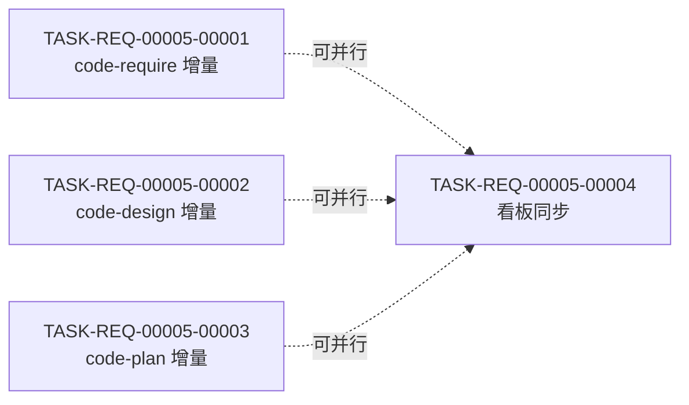

# 设计笔记 — REQ-00005(plan 阶段)

更新时间:2026-06-04 16:30
版本:V0.0.2

> 本文件是 `code-plan` 阶段的实施细节笔记,记录任务拆分 / 依赖 / 里程碑 / 状态管理细节。

## 1. 任务拆分思路

### 1.1 拆分原则
- **最小可执行单元**:每条任务 0.3-0.5 天内可完成
- **单一职责**:每条任务只修改 1 个 SKILL.md(或 1 个看板区段)
- **可独立验证**:每条任务有清晰的"完成定义"(`Edit` 验证 + `Grep` 验证)
- **顺序友好**:T-001 ~ T-003 可并行(T-001 是 `code-require`,T-002 是 `code-design`,T-003 是 `code-plan`,互不依赖);T-004 依赖 T-001 ~ T-003 完成(因末尾兜底 commit 涉及 T-001 ~ T-003 产生的 dirty 文件)

### 1.2 任务粒度权衡

| 候选 | 优势 | 劣势 | 选定 |
| --- | --- | --- | --- |
| **方案 A(选定):3 任务按 SKILL.md 拆分** + 1 任务看板同步 = **4 任务** | 单一职责;可并行;失败易回退(单文件) | 任务数略多 | ✅ |
| 方案 B:1 任务一次性改 3 个 SKILL.md | 任务数少(1) | 单任务多文件;回退粒度粗;不利于评审 | ❌ |
| 方案 C:按"步骤 0a / 0b / N"拆分 = 9 任务 | 粒度细 | 任务数过多;同 1 个 SKILL.md 改 3 次易冲突 | ❌ |
| 方案 D:按"FR-1 / FR-2 / FR-3"功能维度 = 3 任务 | 跨 SKILL.md 维度 | 跨文件,回退粒度粗 | ❌ |

### 1.3 编号分配
- **依据**:`encoding-conventions.md §规则 1 + 3` 嵌套式 5+5 位
- **分配**:
  - T-001 = `code-require`(步骤 0a + 0b + N 一并改,因属于同一文件,避免分 3 次改同 1 文件)
  - T-002 = `code-design`(步骤 0a + N)
  - T-003 = `code-plan`(步骤 0a + N)
  - T-004 = 看板同步(依赖 T-001 ~ T-003 完成)
- **理由**:虽然 T-001 包含 3 个步骤的插入,但都是同一文件的 Edit,合并为 1 任务便于跟踪状态(避免"同一文件,3 个开发状态")

## 2. 任务依赖图

> 严格依赖:T-004 **等待** T-001 ~ T-003 全部完成开发状态=已完成
> 软依赖:T-001 ~ T-003 之间**无**依赖,可并行

## 3. 里程碑

### M1:本需求可发布
- **包含任务**:T-001 + T-002 + T-003 + T-004
- **完成定义**:
  - 开发状态:全部 `已完成`
  - 测试状态:全部 `不适用`(纯文档任务,本仓库无可测代码 — REQ-00009 守卫判定)
  - 真正可发布数 = 4 / 4
- **预期时间**:2026-06-04 17:00(本计划完成后 30 分钟内,因任务量小)
- **验证**:
  - `git diff <commit>~1:plugins/code-skills/skills/code-require/SKILL.md` 与新版对比:frontmatter 字节级一致 + 步骤 0a/0b/N 已插入
  - 同上对 `code-design` / `code-plan` SKILL.md
  - `git status` 为空
  - V0.0.2/RESULT.md 看板"任务清单" 4 任务 + "详细设计与任务计划汇总" 1 行 + "里程碑" 1 行 + "变更记录" 1 条

> **不设 M2 / M3**:本需求 4 任务体量小,1 个 M1 足够。M1 完成 = 本需求完成。

## 4. 状态管理细节

### 4.1 双状态初始化

| 任务 | 类型 | 开发状态初值 | 测试状态初值 | 不适用理由 |
| --- | --- | --- | --- | --- |
| T-001 | 修改 | 待开始 | 不适用 | 纯 Markdown 编辑任务,无可测代码 |
| T-002 | 修改 | 待开始 | 不适用 | 同上 |
| T-003 | 修改 | 待开始 | 不适用 | 同上 |
| T-004 | 文档 | 待开始 | 不适用 | 看板同步任务,无可测代码 |

### 4.2 测试状态 = `不适用` 的依据
- **`code-unit` 阶段会按 REQ-00009 守卫判定"项目可测性"**:本仓库无构建/测试文件(`package.json` / `pyproject.toml` / `Cargo.toml` / `go.mod` / `pom.xml` / `build.gradle` / `test/` 目录均不存在)→ 守卫判定"不可测"
- **本计划所有任务测试状态 = `不适用`**:在 `code-plan` 阶段显式设定,符合 `code-plan` 步骤 10A 任务双状态初始化规则
- **`code-unit` 阶段不写 `test/<任务编码>/RESULT.md`**:符合 REQ-00009 Q-3 锁定 A("不可测时跳过单测过程,仅看板写一行")
- **`code-dashboard` 看板"任务清单" 测试状态列**:显示 `不适用`,**不**显示 `未编写`(`code-dashboard` 已适配 REQ-00009,Q-2 锁定 A)

### 4.3 状态推进责任

| 字段 | 主要更新方 | 触发时机 |
| --- | --- | --- |
| 开发状态(待开始→进行中) | `code-it` | 任务开始时 |
| 开发状态(进行中→已完成) | `code-it` | 任务完成时(含末尾兜底 commit 成功) |
| 测试状态 | (本计划不变化) | 保持 `不适用` |
| 提交哈希 | `code-it` | commit 完成后回填 |
| 完成时间 | `code-it` | 任务完成时填入 |

## 5. 风险与回退(详细见 `risk-analysis.md`)

### 5.1 主要风险(plan 阶段视角)

1. **T-001 ~ T-003 末尾兜底 commit 失败**:`code-it` 阶段触发 E-10
   - 缓解:`module-details.md §1.4.2` 给出 commit message 模板 + 透传 stderr
   - 回退:用户手动 `git commit` 或 `git reset`
2. **3 技能步骤 0a 实现不一致**:`code-review` 阶段可能发现
   - 缓解:`interface-specs.md §步骤 0a` 给出统一伪代码;`module-details.md §1.2.2 / §2.2.1 / §3.2.1` 给出统一 Markdown
   - 回退:派生"统一实现"任务
3. **`.current-version` 在 3 任务末尾兜底时频繁变更**:`code-design` / `code-plan` 步骤 0a 拉取后,`.current-version` 可能改变
   - 缓解:`.current-version` 由 `code-version` 自身 commit,本计划不感知
   - 回退:N/A
4. **`code-unit` 守卫判定本仓库"不可测"**:本计划所有任务测试状态 = `不适用`
   - 缓解:已在 `PLAN.md §1.4` 显式说明
   - 回退:N/A

### 5.2 不需要本计划处理的风险(下游阶段)

| 风险 | 归属 |
| --- | --- |
| `git pull` 冲突 / 网络 / 凭据 | `code-it` 阶段按 E-2/E-3/E-4 处理 |
| 用户取消 commit | `code-it` 阶段按 E-9 处理 |
| `git commit` 失败 | `code-it` 阶段按 E-10 处理 |
| 末尾兜底误纳文件 | `code-it` 阶段用户取消 + `git reset` |
| 3 技能实现不一致 | `code-review` 阶段评审 + 派生"统一实现"任务 |
| `code-unit` 守卫判定 | `code-unit` 阶段执行(本计划仅记录结果 = `不适用`) |

## 6. 与下游的衔接

### 6.1 `code-it REQ-00005` 阶段输入
- 本计划 `PLAN.md` 4 个任务详情
- 本计划 `RESULT.md` 详细设计
- 本计划 7 个过程文档
- 看板"任务清单"中本计划的 4 个任务行

### 6.2 `code-it REQ-00005` 阶段产出
- `code/<TASK-REQ-00005-NNNNN>/RESULT.md` × 4(每个任务 1 个)
- 每个任务末尾兜底 commit(由 `code-it` 自动完成,因本计划 §1 已说明)
- V0.0.2/RESULT.md 看板"执行的开发命令记录" 追加 git pull / git status / git add / git commit 等命令
- V0.0.2/RESULT.md 看板"任务清单" 4 任务开发状态推进 + 提交哈希回填

### 6.3 `code-unit REQ-00005` 阶段输入
- 本计划 `PLAN.md` 4 个任务的"测试状态 = `不适用`"标记

### 6.4 `code-unit REQ-00005` 阶段产出
- 守卫判定"不可测" → 跳过单测 → **不**写 `test/<任务编码>/RESULT.md`
- V0.0.2/RESULT.md 看板"任务清单" 测试状态保持 `不适用`(已由本计划初始化)
- V0.0.2/RESULT.md 看板"执行的开发命令记录" 追加 7 项守卫检查命令

### 6.5 `code-review REQ-00005` 阶段输入
- 本计划 4 个任务的"完成"状态 + 提交哈希
- 概要设计 / 详细设计 / 7 过程文档

### 6.6 `code-review REQ-00005` 阶段产出
- REVIEW-REPORT.md(本需求独立评审)
- 派生任务(可能):3 技能步骤 0a 不一致 / commit message 格式不对 / frontmatter 字节级差异 / 任务编号格式不对 等

## 7. 关键不变量(本计划严禁破坏)

| 不变量 | 来源 | 验证方式 |
| --- | --- | --- |
| 3 个 SKILL.md frontmatter 字节级保留 | `skill-conventions.md §规则 1` + FR-6 | `git diff` 顶部 ~10 行无变化 |
| 4 个未触达技能(`code-version` / `code-it` / `code-unit` / `code-review`)SKILL.md 不变 | FR-4 + FR-5 | `git diff` 该 4 个文件无输出 |
| `marketplace.json` / `plugin.json` 不变 | FR-6 + `marketplace-protocol.md §规则 1` | 同上 |
| `commit-conventions.md` 不被填充 | NFR-6 | `git diff commit-conventions.md` 无输出 |
| `code-dashboard` / `code-publish` / `code-auto` 等其他技能 SKILL.md 不变 | 各需求边界继承 | 那些文件不在 `git diff` 范围 |
| 任务编号严格 5+5 位 | `encoding-conventions.md §规则 1 + 3` | `grep "TASK-REQ-00005" PLAN.md` → 4 个 5+5 位编号 |
| `code-require` 步骤 0b 仅专属 | FR-2 显式 | 4 个任务中只有 T-001 含步骤 0b |
| 末尾兜底与 `code-it` 内部 commit 并存 | FR-4 + Q-4 锁定 B | 4 个任务的"边界与异常"小节显式列出 |

## 8. 计划阶段无新增 follow-up

- 本计划**未**新增 follow-up 项
- 全部 follow-up 项(Q-5 / Q-7 / Q-9 / Q-10 / Q-11)由 `code-review` 阶段派生,详见 `design/.../clarifications.md`
