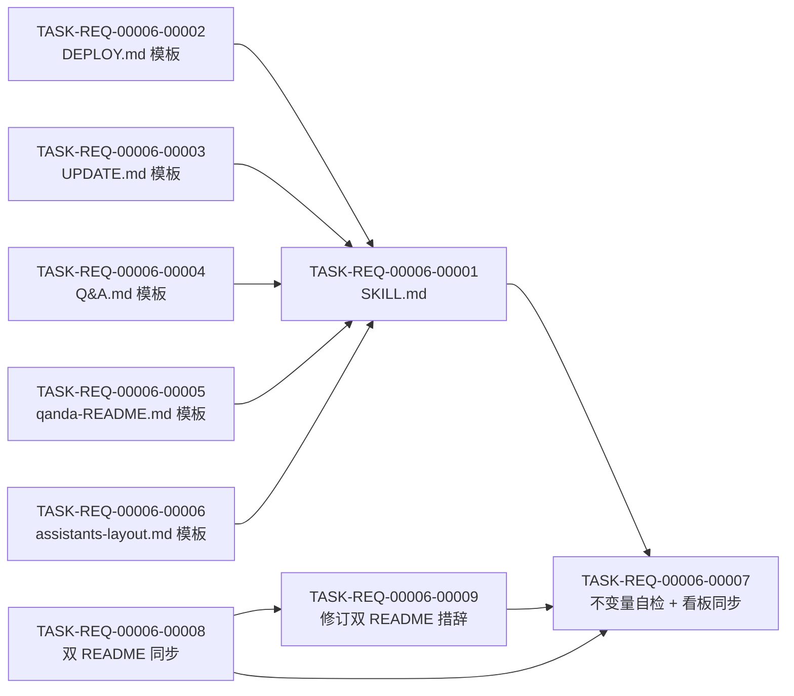

# 编码计划 — REQ-00006 — `/code-publish` 发布部署技能(8 任务)

- 需求编码:`REQ-00006`
- 所属版本:`V0.0.2`
- 详细设计:`./assistants/V0.0.2/plan/REQ-00006/RESULT.md`(v1)
- 状态:已对齐(待 code-it 执行)
- **开发完成度**:9 / 9 ✅
- **测试完成度**:9 / 9(全部 `不适用` 或 `未编写` — 纯文档型技能,无传统单测)
- **派生"审查改修"任务**:T-009(已由 code-review 派生 + 已完成)
- 创建:2026-06-04
- 最近更新:2026-06-04 18:13
- 当前版本:v1.10

---

## 1. 计划概述

- **任务总数**:8
- **类型分布**:
  - 新增:6 条(T-001 ~ T-006)
  - 文档:1 条(T-007 不变量自检 + 看板同步 + 偏差日志)
  - 修改:1 条(T-008 双 README 同步)
- **关键里程碑数**:3(M-1 模板就绪 / M-2 技能可触发 / M-3 全收尾)
- **开发完成度**:0 / 8(待开始)
- **测试完成度**:0 / 8(默认 `不适用` — 8 条都是纯文档型;无传统单元测试)
- **真正可发布任务数**:0 / 8(开发=已完成 ∧ 测试∈{已运行-通过, 不适用};待 code-it 推进)

---

## 2. 任务总览

| 任务编号 | 类型 | 触发/来源 | 标题 | 开发状态 | 测试状态 | 涉及文件/模块 | 前置任务 | 估算 | 责任人 | 关联任务 | 对应设计章节 |
| --- | --- | --- | --- | --- | --- | --- | --- | --- | --- | --- | --- |
| `TASK-REQ-00006-00001` | 新增 | 需求新增 | [新增] 写 `code-publish/SKILL.md`(7 模块工作流 + frontmatter) | 已完成 | 不适用 | `plugins/code-skills/skills/code-publish/SKILL.md`(475 行,~16 KB) | T-002~T-006 | 1.0d | wangmiao | — | RESULT.md §4 模块 1~7 + §5 算法 1~4 | 2026-06-04 17:30 | (不提交 — 留 dirty tree 由 T-007 后统一 commit) | — |
| `TASK-REQ-00006-00002` | 新增 | 需求新增 | [新增] 写 `templates/DEPLOY.md` 模板(8 章节 + placeholder + 默认示例) | 已完成 | 不适用 | `plugins/code-skills/skills/code-publish/templates/DEPLOY.md`(245 行,~10 KB) | — | 0.3d | wangmiao | — | RESULT.md §4 模块 8 + §6.5 | 2026-06-04 17:34 | (不提交 — 留 dirty tree 由 T-007 后统一 commit) | — |
| `TASK-REQ-00006-00003` | 新增 | 需求新增 | [新增] 写 `templates/UPDATE.md` 模板(8 章节 + §8 回滚) | 已完成 | 不适用 | `plugins/code-skills/skills/code-publish/templates/UPDATE.md`(365 行,~14 KB) | — | 0.3d | wangmiao | — | RESULT.md §4 模块 9 + §6.5 | 2026-06-04 17:45 | (不提交 — 留 dirty tree 由 T-007 后统一 commit) | — |
| `TASK-REQ-00006-00004` | 新增 | 需求新增 | [新增] 写 `templates/Q&A.md` 模板(占位章节 + 提示) | 已完成 | 不适用 | `plugins/code-skills/skills/code-publish/templates/Q&A.md`(63 行,~2 KB) | — | 0.2d | wangmiao | — | RESULT.md §4 模块 10 + §6.5 | 2026-06-04 17:52 | (不提交 — 留 dirty tree 由 T-007 后统一 commit) | — |
| `TASK-REQ-00006-00005` | 新增 | 需求新增 | [新增] 写 `templates/qanda-README.md` 模板(用途/命名/引用/维护) | 已完成 | 不适用 | `plugins/code-skills/skills/code-publish/templates/qanda-README.md`(134 行,~5 KB) | — | 0.2d | wangmiao | — | RESULT.md §4 模块 11 + §6.5 | 2026-06-04 17:56 | (不提交 — 留 dirty tree 由 T-007 后统一 commit) | — |
| `TASK-REQ-00006-00006` | 新增 | 需求新增 | [新增] 写 `templates/assistants-layout.md` 模板(沿用范式 + publish/qanda 段) | 已完成 | 不适用 | `plugins/code-skills/skills/code-publish/templates/assistants-layout.md`(172 行,~6 KB) | — | 0.2d | wangmiao | — | RESULT.md §4 模块 12 | 2026-06-04 18:00 | (不提交 — 留 dirty tree 由 T-007 后统一 commit) | — |
| `TASK-REQ-00006-00007` | 文档 | 需求新增 | [文档] 不变量自检 + 同步 V0.0.2 看板 + 偏差日志 | 已完成 | 不适用 | `assistants/V0.0.2/RESULT.md` + `code/TASK-REQ-00006-00007/{RESULT,work-log,compile-and-run,deviations,test-results}.md` | T-001 ~ T-006 | 0.4d | wangmiao | — | RESULT.md §3 + §12 | 2026-06-04 18:03 | (不提交 — 留 dirty tree 由 T-008 后由用户整体 commit) | — |
| `TASK-REQ-00006-00008` | 修改 | 需求新增(FR-8 边界 + Q-D-2) | [修改] 同步双 README "主要能力" 段(中英同次提交) | 已完成 | 不适用 | `plugins/code-skills/README.md`, `plugins/code-skills/README.en.md`(各 +1 行) | — | 0.3d | wangmiao | — | RESULT.md §3 + `doc-conventions §规则 1` | 2026-06-04 18:08 | (不提交 — 留 dirty tree 由用户整体 commit) | — |
| `TASK-REQ-00006-00009` | 修改 | 审查改修 | [修改] 修订双 README `<code-publish>` 行措辞(明确"首次调用"语义) | 已完成 | 不适用 | `plugins/code-skills/README.md`, `plugins/code-skills/README.en.md`(各 L38 修订 1 处) | T-008 | 0.05d | wangmiao | T-008 | review/T-009/RESULT.md §F-002 | 2026-06-04 18:13 | (不提交 — 留 dirty tree 由用户整体 commit) | T-008 |

**统计**:
- 总数:8
- 已完成:0
- 待开始:8
- 真正可发布:0 / 8
- 估算合计:~2.9 天(可并行 T-002~T-006 + T-008,串行 T-001 + T-007)

### 2.1 触发/来源枚举(本计划全部为 `需求新增`)

参考 `templates/task-plan.md` §2.1。本计划 8 条任务全部 `需求新增`(REQ-00006 v1 首次拆分)。

---

## 3. 任务详情

### TASK-REQ-00006-00001:[新增] 写 `code-publish/SKILL.md`(7 模块工作流 + frontmatter)

#### 基础信息
- **类型**:新增
- **触发/来源**:需求新增
- **触发任务**:无(根节点)
- **开发状态**:待开始
- **目标**:创建 `code-publish` 技能的入口 SKILL.md,实现 7 模块工作流 + 完整 frontmatter
- **涉及文件/模块**:
  - 新建 `plugins/code-skills/skills/code-publish/SKILL.md`
- **前置任务**:T-002, T-003, T-004, T-005, T-006(模板必须先就绪,SKILL.md 中要引用模板路径)
- **关联任务**:无
- **关键变更**:
  - **frontmatter**:
    ```yaml
    ---
    name: code-publish
    description: 发布部署(版本感知)。要求用户提供可选位置参数"版本号"(缺省时取 ./assistants/.current-version);先做发布前置检查(看板 3 区段全检查最严:需求=已完成 ∧ 任务 开发=已完成 ∧ 测试∈{已运行-通过, 不适用} ∧ 缺陷=已修复);通过后在 ./assistants/<版本号>/publish/ 生成 DEPLOY.md(始终)+ UPDATE.md(基线跳过)+ Q&A.md(从 assistants/qanda/ 聚合);本需求顺带创建 assistants/qanda/ 目录骨架。3 份手册为通用骨架 + 最常见部署方式默认示例 + placeholder,用户必须手动补全。本技能纯只读 + 不自动 commit + 不参与 REQ-00005 改写。在 code-review 完成后使用;基线版本可直接调用归档。
    ---
    ```
  - **正文章节顺序**(与其他 10 技能对齐):
    1. `# code-publish — 发布部署(版本感知)`
    2. `## 目标`
    3. `## 适用场景`
    4. `## 不适用`
    5. `## 工作目录约定(强制)`
    6. `## 输入`(可选位置参数 `<版本号>`)
    7. `## 输出`(主产出 publish/ + 顺带 qanda/ + stdout 报告)
    8. `## 工具使用约定`
    9. `## 工作流程`:
       - `### 步骤 0:版本上下文检测(强制前置)`
       - `### 步骤 1:发布前置检查(PreflightChecker)`
       - `### 步骤 2.0:基线识别(BaselineDetector)`
       - `### 步骤 2:生成手册(ManualBuilder)`
       - `### 步骤 2.5:创建 qanda/ 骨架(QandaScaffolder,条件)`
       - `### 步骤 2.6:聚合 Q&A 内容(QandaAggregator)`
       - `### 步骤 3:报告(ReportFormatter)`
    10. `## 看板字段约定(只读消费)`(说明 3 区段的解析锚点与判定规则,提醒"与 dashboard-conventions §规则 1 一致")
    11. `## 衔接`
    12. `## 不要做的事`
  - **关键算法实现**(以自然语言描述):算法 1 ~ 4(详 RESULT.md §5);Bash/Read/Glob/Write 工具调用模式
  - **错误处理范式**:E-1 ~ E-10 + DD-7(详 RESULT.md §8 + risk-analysis.md)
  - **报告模板**:4 种场景(通过/不通过/基线/qanda 空)(详 interface-specs.md §1.3)
- **边界与异常**:
  - 无 `.current-version` + 无参 → 提示 + 退出(E-5)
  - 看板缺区段 → 退化"全未解决"(E-2)
  - 前置检查不通过 → 不写手册(E-1)
  - publish/ mkdir/Write 失败 → 报错退出(E-7)
  - qanda/ 创建失败 → 不阻塞(E-4)
- **验证手段**:
  - 自检 frontmatter `name: code-publish` + 完整 description
  - 自检章节顺序与其他 10 技能一致
  - 自检 7 步骤完整 + 每步骤的工具调用合理
  - 由 T-007 端到端调用验证
- **回退方式**:`git checkout -- plugins/code-skills/skills/code-publish/SKILL.md`(本次新增,简单删除)
- **对应设计章节**:RESULT.md §4 模块 1~7 + §5 算法 1~4 + §7 + §8
- **依据规范**:`skill-conventions.md §规则 1`(强制)+ `module-conventions.md §规则 1`(SKILL.md 在根)
- **创建时间**:2026-06-04 17:01
- **最近更新**:2026-06-04 17:01
- **完成时间**:(待 code-it 完成后填)
- **完成人**:(待填)
- **提交哈希**:(待填)
- **备注**:T-001 是本计划的"大块头"任务;~1.0 天;依赖所有模板就绪

#### 单元测试状态
- **测试状态**:不适用
- **不适用理由**:纯文档型技能,SKILL.md 是自然语言指令,无传统单测可写;由 T-007 做端到端手动验证
- **覆盖的测试场景**:见 T-007

---

### TASK-REQ-00006-00002:[新增] 写 `templates/DEPLOY.md` 模板

#### 基础信息
- **类型**:新增
- **触发/来源**:需求新增
- **开发状态**:待开始
- **目标**:创建通用全新部署手册骨架模板(8 章节 + placeholder + 默认示例)
- **涉及文件/模块**:
  - 新建 `plugins/code-skills/skills/code-publish/templates/DEPLOY.md`
- **前置任务**:无
- **关键变更**:
  - 章节结构:1 概述 / 2 打包(3 子节)/ 3 获取成果物 / 4 上传服务器 / 5 初始化系统(4 子节)/ 6 启动运行 / 7 首次进入软件系统 / 8 验证清单(参考 needs §6.1)
  - 文首"使用说明"段:警示 `⚠ 本手册为通用发布部署骨架,请手动补全所有 <placeholder> 后再按步骤执行`(AC-3.3)
  - 每节至少 1 个"最常见部署方式"默认示例(AC-3.2,如打包节默认含 `tar -czf <output>.tar.gz <source_dir>`)
  - placeholder 集合(AC-3.1):
    - 自动填充:`<本版本号>`
    - 用户补全:`<打包方式>` / `<output>` / `<source_dir>` / `<image_name>` / `<version>` / `<环境依赖>` / `<DB 脚本路径>` / `<初始化数据脚本>` / `<配置文件路径>` / `<key>` / `<value>` / `<启动命令>` / `<首次访问 URL>` / `<默认账号>` 等
- **边界与异常**:无(纯文件)
- **验证手段**:
  - 自检章节完整(8 大节 + 6 子节)
  - 自检 placeholder 覆盖关键字段
  - 自检默认示例可执行(从字面意义上)
- **回退方式**:`git checkout -- ...`
- **对应设计章节**:RESULT.md §4 模块 8 + §6.5
- **依据规范**:`module-conventions.md §规则 1`(templates/ 子目录)
- **创建时间**:2026-06-04 17:01

#### 单元测试状态
- **测试状态**:不适用
- **不适用理由**:纯模板文件;由 T-007 端到端验证

---

### TASK-REQ-00006-00003:[新增] 写 `templates/UPDATE.md` 模板

#### 基础信息
- **类型**:新增
- **触发/来源**:需求新增
- **开发状态**:待开始
- **目标**:创建通用升级部署手册骨架模板(8 章节,§8 回滚为新增)
- **涉及文件/模块**:
  - 新建 `plugins/code-skills/skills/code-publish/templates/UPDATE.md`
- **前置任务**:无
- **关键变更**:
  - 章节结构:与 DEPLOY 类似 + 新增 §8 回滚方案(参考 needs §6.2)
  - placeholder:自动 `<本版本号>` + `<源版本>`;用户补全同 DEPLOY + `<DB 回滚脚本>` / `<触发回滚的条件>`
  - 文首"使用说明"同 DEPLOY
- **边界与异常**:无
- **验证手段**:自检 8 章节 + §8 回滚为新增
- **回退方式**:`git checkout -- ...`
- **对应设计章节**:RESULT.md §4 模块 9 + §6.5
- **依据规范**:`module-conventions.md §规则 1`
- **创建时间**:2026-06-04 17:01

#### 单元测试状态
- **测试状态**:不适用
- **不适用理由**:同 T-002

---

### TASK-REQ-00006-00004:[新增] 写 `templates/Q&A.md` 模板

#### 基础信息
- **类型**:新增
- **触发/来源**:需求新增
- **开发状态**:待开始
- **目标**:创建 Q&A.md 手册的"占位 + 聚合就绪"模板
- **涉及文件/模块**:
  - 新建 `plugins/code-skills/skills/code-publish/templates/Q&A.md`
- **前置任务**:无
- **关键变更**:
  - 文首 `# 发布部署 Q&A — <本版本号>`(`<本版本号>` 自动填充)
  - 引言 `> 本手册聚合自 assistants/qanda/,供发布部署中遇到问题时查阅。`
  - 占位章节 `## 占位:常见问题(待补充)`(needs §6.3 + AC-5.1 / AC-5.2)
  - 占位提示 `请在 assistants/qanda/ 目录下添加 Q&A 内容(格式建议见 qanda/README.md),再重跑 code-publish`
- **边界与异常**:无
- **验证手段**:自检占位章节完整 + `<本版本号>` placeholder 存在
- **回退方式**:`git checkout -- ...`
- **对应设计章节**:RESULT.md §4 模块 10 + §6.5
- **依据规范**:`module-conventions.md §规则 1`
- **创建时间**:2026-06-04 17:01

#### 单元测试状态
- **测试状态**:不适用
- **不适用理由**:同 T-002

---

### TASK-REQ-00006-00005:[新增] 写 `templates/qanda-README.md` 模板

#### 基础信息
- **类型**:新增
- **触发/来源**:需求新增
- **开发状态**:待开始
- **目标**:创建 `assistants/qanda/README.md` 的骨架(本需求顺带产物;QandaScaffolder 消费)
- **涉及文件/模块**:
  - 新建 `plugins/code-skills/skills/code-publish/templates/qanda-README.md`
- **前置任务**:无
- **关键变更**:
  - 文首 `# assistants/qanda/ — 项目级 Q&A 长期沉淀目录`
  - `## 用途`:本目录用于沉淀发布部署相关的 Q&A 内容,被 `code-publish` 聚合到 `<版本号>/publish/Q&A.md`(AC-6.2 之一)
  - `## 文件命名建议`:`<主题>.md`,如 `deploy-faq.md` / `db-init-faq.md`(AC-6.2 之一)
  - `## 引用规范`:本目录是项目级共享(跨版本);文件命名建议 kebab-case;README.md 不被聚合(AC-6.2 + DD-6)
  - `## 维护方式`:暂时人工整理(Q-2 锁定);未来可由独立技能管理(v2)
- **边界与异常**:无
- **验证手段**:自检 4 节齐全
- **回退方式**:`git checkout -- ...`
- **对应设计章节**:RESULT.md §4 模块 11 + §6.5
- **依据规范**:`module-conventions.md §规则 1`
- **创建时间**:2026-06-04 17:01

#### 单元测试状态
- **测试状态**:不适用
- **不适用理由**:同 T-002

---

### TASK-REQ-00006-00006:[新增] 写 `templates/assistants-layout.md` 模板

#### 基础信息
- **类型**:新增
- **触发/来源**:需求新增
- **开发状态**:待开始
- **目标**:沿用其他技能的 `assistants-layout.md` 范式(标准技能资产),补充 `publish/` 与 `qanda/` 路径段
- **涉及文件/模块**:
  - 新建 `plugins/code-skills/skills/code-publish/templates/assistants-layout.md`
- **前置任务**:无
- **关键变更**:
  - 沿用 `code-version/templates/assistants-layout.md`(或 `code-design/templates/assistants-layout.md`)的结构
  - 在版本目录树下补充本技能涉及的两个新路径:
    - `<版本号>/publish/`(DEPLOY.md / UPDATE.md / Q&A.md)
    - `qanda/`(跨版本共享,README.md + 用户的 Q&A .md 文件)
  - 注明本技能对各目录的"读/写"角色
- **边界与异常**:无
- **验证手段**:自检与其他技能的 `assistants-layout.md` 结构一致
- **回退方式**:`git checkout -- ...`
- **对应设计章节**:RESULT.md §4 模块 12
- **依据规范**:`module-conventions.md §规则 1`
- **创建时间**:2026-06-04 17:01

#### 单元测试状态
- **测试状态**:不适用
- **不适用理由**:同 T-002

---

### TASK-REQ-00006-00007:[文档] 不变量自检 + 同步 V0.0.2 看板 + 偏差日志

#### 基础信息
- **类型**:文档
- **触发/来源**:需求新增
- **触发任务**:T-001 ~ T-006 + T-008(收尾任务,依赖全部前置)
- **开发状态**:待开始
- **目标**:执行 FR-8 不变量自检,同步 V0.0.2 看板的"任务清单"状态字段,产出 work-log/RESULT/deviations 三件套
- **涉及文件/模块**:
  - 写 `assistants/V0.0.2/code/TASK-REQ-00006-00007/RESULT.md`(改修总结)
  - 写 `assistants/V0.0.2/code/TASK-REQ-00006-00007/work-log.md`(执行日志)
  - 写 `assistants/V0.0.2/code/TASK-REQ-00006-00007/deviations.md`(偏差日志,期望:0 项 / 或显式记录)
  - 更新 `assistants/V0.0.2/RESULT.md`:
    - 任务清单:T-001 ~ T-008 的"开发状态" → 已完成(由本任务统一推进或由各任务的 code-it 个性推进)
    - 变更记录:追加"REQ-00006 编码完成"条目
- **前置任务**:T-001, T-002, T-003, T-004, T-005, T-006, T-008(全部前置)
- **关键变更**:
  - **不变量 1**:`marketplace.json` / `plugin.json` 0 改动(`git diff --stat .claude-plugin/ plugins/code-skills/.claude-plugin/`)
  - **不变量 2**:其他 10 个 code-* SKILL.md 0 改动(`git diff --stat plugins/code-skills/skills/code-*/SKILL.md`,排除新增的 `code-publish/SKILL.md`)
  - **不变量 3**:`assistants/rules/` 下任何规范 0 改动(`git diff --stat assistants/rules/`)
  - **不变量 4**:`commit-conventions.md` 0 改动(FR-8.AC-8.4,仍为占位)
  - **不变量 5**:`CLAUDE.md` "AI 工作约定"小节 0 追加(Q-8 默认)
  - **不变量 6**:`assistants/V0.0.2/RESULT.md` 非本技能负责区段 0 改动(本任务**只**改"任务清单" + "变更记录" + 文档头"最近更新")
  - **不变量 7**:`Glob plugins/code-skills/skills/code-publish/**/*` = 6 个新文件(SKILL.md + 5 模板)
  - **不变量 8**:`Glob plugins/code-skills/skills/code-publish/templates/*` = 5 个(无散落)
  - 端到端验证 1:在 V0.0.2(预期有未完成任务)调 `code-publish`,验证 §S-2 报告样式
  - 端到端验证 2:在 V0.0.0(预期可发布基线)调 `code-publish V0.0.0`,验证 §S-3 报告 + 仅 2 份手册生成
  - 端到端验证 3:qanda/ 删除后调 `code-publish`,验证 §S-4 + qanda/ 自动重建
- **边界与异常**:
  - 不变量任一违反 → 在 `deviations.md` 显式记录原因 + 是否需要派生改修任务
  - 端到端验证任一失败 → 回退到上游 T-001 ~ T-006 修复,本任务标"阻塞"
- **验证手段**:
  - `git status` + `git diff --stat` 验证不变量
  - 实际调用 `code-publish` 验证端到端
  - 比对 stdout 与 `interface-specs.md §1.3` 样例
- **回退方式**:不需要(本任务只写 RESULT/work-log/deviations 三件套 + 看板;若上游任务有问题,在 deviations 中标注即可)
- **对应设计章节**:RESULT.md §3 规范遵循 + §12 测试要点
- **依据规范**:FR-8 + `dashboard-conventions.md §规则 1`(本任务**不**触发,因为不扩展看板字段)
- **创建时间**:2026-06-04 17:01

#### 单元测试状态
- **测试状态**:不适用
- **不适用理由**:本任务**就是**测试/验证任务;不存在"测试的测试"

---

### TASK-REQ-00006-00008:[修改] 同步双 README "主要能力" 段(中英同次提交)

#### 基础信息
- **类型**:修改
- **触发/来源**:需求新增(FR-8 边界 + Q-D-2 本计划决策)
- **开发状态**:待开始
- **目标**:在 `plugins/code-skills/README.md` + `README.en.md` 的"主要能力"段(或"技能概览"段)追加 `code-publish` 一行,中英同次提交
- **涉及文件/模块**:
  - 修改 `plugins/code-skills/README.md`(追加 `code-publish` 一行)
  - 修改 `plugins/code-skills/README.en.md`(追加对应英文一行)
- **前置任务**:无
- **关键变更**:
  - 中文版追加示例(具体位置由 code-it 在文件中定位):
    ```markdown
    | code-publish | 发布部署(版本感知):前置检查通过后生成 DEPLOY/UPDATE/Q&A 手册 | 版本归档发布 |
    ```
  - 英文版追加示例:
    ```markdown
    | code-publish | Release & deployment (version-aware): generate DEPLOY/UPDATE/Q&A manuals after preflight check | Version archive release |
    ```
  - **关键约束**:中英版本必须**同次** `git commit`(`doc-conventions §规则 1`);若 code-it 用分两次 commit 完成,视为违规
- **边界与异常**:
  - 若 README 的"主要能力"段表格结构与既有不一致 → code-it 决定增插 vs 重构(优先增插)
  - 若中文新增了一行但英文遗漏 → T-007 不变量自检中发现并报告
- **验证手段**:
  - `git log -1 --stat` 验证最新提交含两个文件
  - `git show HEAD plugins/code-skills/README.md plugins/code-skills/README.en.md` 验证两个文件均含新行
  - 二级标题集合(目录树并列对比)无漂移(`doc-conventions §规则 1`)
- **回退方式**:`git revert <commit>` 或 `git checkout HEAD~1 -- plugins/code-skills/README.md plugins/code-skills/README.en.md`
- **对应设计章节**:RESULT.md §3 规范遵循 + design.md `clarifications.md §3 Q-D-2`
- **依据规范**:`doc-conventions.md §规则 1`(中英同次提交,强制)+ §规则 2(README 持续维护)
- **创建时间**:2026-06-04 17:01

#### 单元测试状态
- **测试状态**:不适用
- **不适用理由**:纯文档更新,无单测;由 T-007 验证 `git log -1 --stat` 含 2 文件

---

### TASK-REQ-00006-00009:[修改] 修订双 README `<code-publish>` 行措辞(明确"首次调用"语义)

#### 基础信息
- **类型**:修改
- **触发/来源**:审查改修(由 `code-review` 派生,REVIEW-REPORT.md §F-002)
- **触发任务**:T-008(本任务仅修 T-008 引入的双 README 行的"用途"列措辞)
- **开发状态**:待开始
- **目标**:把"code-publish 总是创建 qanda/ 目录"修正为"仅首次调用时创建";中英同次提交
- **涉及文件/模块**:
  - 修改 `plugins/code-skills/README.md` L38
  - 修改 `plugins/code-skills/README.en.md` L38
- **前置任务**:T-008(必须已完成)
- **关联任务**:T-008
- **关键变更**:
  - zh L38 "用途"列:「顺带在项目级创建 `assistants/qanda/` 目录」 → 「(首次调用时)在项目级创建 `assistants/qanda/` 目录(若已存在则跳过)」
  - en L38 "Purpose"列:"also creates the project-level `assistants/qanda/` directory" → "(on first call) creates the project-level `assistants/qanda/` directory if it does not yet exist"
  - **不**修改表格其他列(技能 / 读取 / 写入 / 下游)
  - **不**调整表格行顺序
- **边界与异常**:
  - 若 qanda/ 已存在 → 跳过创建(FR-7.AC-7.4)
  - 若中英 2 文件提交不在同一次 commit → 视为违规(`doc-conventions §规则 1`)
- **验证手段**:
  - `git diff` 验证 2 文件均仅改 1 行
  - 改后 grep 验证关键词("首次调用时" + "若已存在则跳过" / "on first call" + "if it does not yet exist")
  - 与 SKILL.md §"## 工作流程" 步骤 2.5 措辞对仗验证
- **回退方式**:`git checkout HEAD~1 -- plugins/code-skills/README.md plugins/code-skills/README.en.md`(连同 T-008 一起回退)
- **对应设计章节**:不适用(本任务是修补,不是新设计;详 `review/T-009/RESULT.md`)
- **依据规范**:`doc-conventions.md §规则 1`(中英对仗,强制)
- **创建时间**:2026-06-04 18:09
- **最近更新**:2026-06-04 18:09

#### 单元测试状态
- **测试状态**:未编写
- **不适用理由**:纯文档修订,无单测;由 T-007 风格自检验证 2 文件同次 M

---

## 4. 任务依赖图



- **可并行**:T-002 / T-003 / T-004 / T-005 / T-006 / T-008(全部独立)
- **必须先 T-002~T-006 → 再 T-001**:SKILL.md 中引用模板路径,模板必须先存在
- **T-007 最后**:依赖全部前置,做不变量自检 + 看板同步

---

## 5. 里程碑

| 里程碑 | 包含任务 | 完成定义 | 预期时间 |
| --- | --- | --- | --- |
| M-1:模板就绪 | T-002, T-003, T-004, T-005, T-006 | 5 份模板开发状态=已完成,测试状态全 `不适用` | 2026-06-05(估算从今日起) |
| M-2:技能可触发 | M-1 + T-001 | `code-publish` 技能可被 Claude Code 触发,工作流 7 步骤可走通 | 2026-06-06 |
| M-3:可发布 | M-2 + T-007, T-008 | **8 任务全部开发状态=已完成 ∧ 测试状态∈{已运行-通过, 不适用}** + 端到端验证 3 场景全通过 + 不变量自检 8 项全通过 | 2026-06-07 |

> 里程碑"完成定义"显式列出两轴状态;本计划 8 任务全部测试状态预设 `不适用`,故"真正可发布" = "开发=已完成"。

---

## 6. 状态管理规则

完全遵循 `templates/task-plan.md §6` 的统一规则。本计划补充:

- **测试状态全为 `不适用`**:8 任务均为纯文档/模板/同步,无传统单元测试;若 `code-review` 提出补"端到端验证脚本"要求,可由独立"审查改修"任务实现
- **开发状态推进顺序**(对应里程碑):
  - 第 1 阶段(M-1):T-002 ~ T-006 推进到 `已完成`(可并行)
  - 第 2 阶段(M-2):T-001 推进到 `已完成`
  - 第 3 阶段(M-3):T-008 + T-007 推进到 `已完成`(T-008 可与 M-1/M-2 并行)

---

## 7. 关联计划

| 关联计划编码 | 关联点 | 对本计划的影响 | 链接 |
| --- | --- | --- | --- |
| (V0.0.2 尚无其他 plan) | — | — | — |
| REQ-00001(V0.0.1)| 基线版本约定 + 任务编号转 5 位 | 本计划任务编号全部用新格式 `TASK-REQ-00006-NNNNN` | `../../../V0.0.1/plan/REQ-00001/PLAN.md`(若存在) |

V0.0.2 中 REQ-00004 ~ REQ-00013 均已完成需求分析但**尚未**做详细设计与任务计划;本计划是 V0.0.2 中**首次**详细计划。详细关联见 `materials-index.md`。

---

## 8. 变更记录

| 时间 | 版本 | 变更类型 | 变更摘要 | 变更人 |
| --- | --- | --- | --- | --- |
| 2026-06-04 17:01 | v1 | 初始创建 | 完成首次编码计划,共 8 条任务:T-001 SKILL.md + T-002~T-006 5 份模板 + T-007 不变量自检与看板同步 + T-008 双 README 同步;全部测试状态预设 `不适用`(纯文档型);依赖图:T-002~T-006 + T-008 并行 → T-001 → T-007 | wangmiao |
| 2026-06-04 17:30 | v1.1 | 开发状态更新 | T-001 `[新增] 写 code-publish/SKILL.md` 开发状态"进行中"→"已完成";完成时间 2026-06-04 17:30;完成人 wangmiao;不提交(留 dirty tree 由 T-007 后统一 commit);SKILL.md 475 行,严格遵循 `skill-conventions §规则 1`(name=code-publish,description ~800 字符) + `module-conventions §规则 1`(SKILL.md 在技能根目录);详 `code/TASK-REQ-00006-00001/RESULT.md` | wangmiao |
| 2026-06-04 17:34 | v1.2 | 开发状态更新 | T-002 `[新增] 写 templates/DEPLOY.md 模板` 开发状态"进行中"→"已完成";完成时间 2026-06-04 17:34;完成人 wangmiao;不提交;DEPLOY.md 245 行,8 大章节 + 7 子节 + 1 附录(可选);14 种 placeholder;15 项验证 checkbox;3 项实现细节细化/增量(URL 拆为 server:port / 附录"发布后通知" / 启动方式 3 种补充),**0 与设计冲突的偏离**;详 `code/TASK-REQ-00006-00002/RESULT.md` | wangmiao |
| 2026-06-04 17:45 | v1.3 | 开发状态更新 | T-003 `[新增] 写 templates/UPDATE.md 模板` 开发状态"进行中"→"已完成";完成时间 2026-06-04 17:45;完成人 wangmiao;不提交;UPDATE.md 365 行,8 大章节 + 11 子节(§5 4 子节 / §8 4 子节),§8 回滚方案为新增(本模板专属),26 项 checkbox;2 自动 placeholder(`<本版本号>` + `<源版本>`);7 项实现细节细化/增量/收敛(均 0 与设计冲突),详 `code/TASK-REQ-00006-00003/RESULT.md` | wangmiao |
| 2026-06-04 17:52 | v1.4 | 开发状态更新 | T-004 `[新增] 写 templates/Q&A.md 模板` 开发状态"进行中"→"已完成";完成时间 2026-06-04 17:52;完成人 wangmiao;不提交;Q&A.md 63 行(对比 DEPLOY/UPDATE 是"小模板",符合设计预期);H1 + 引言 + 占位章节(含 4 步添加 Q&A 指南 + 完整生成结果示例 + 排除/排序规则);1 自动 placeholder;5 项实现细节增量/收敛(均 0 与设计冲突);模块边界清晰:Q&A.md 模板只占位,具体问答由 QandaAggregator 动态聚合 qanda/*.md;详 `code/TASK-REQ-00006-00004/RESULT.md` | wangmiao |
| 2026-06-04 17:56 | v1.5 | 开发状态更新 | T-005 `[新增] 写 templates/qanda-README.md 模板` 开发状态"进行中"→"已完成";完成时间 2026-06-04 17:56;完成人 wangmiao;不提交;qanda-README.md 134 行,4 大章节(用途/命名/引用/维护);与 T-004 Q&A.md 模板形成完整闭环(T-004 说什么做,T-005 说怎么做);7 项实现细节增量/收敛(均 0 与设计冲突);命名建议含 7 个具体示例(deploy-faq / db-init-faq / 等);引用规范显式说明 README.md 不被聚合 + 字典序排序;维护方式含 4 步流程 + 当前 v1 / 未来 v2 / "不做的事"3 条;详 `code/TASK-REQ-00006-00005/RESULT.md` | wangmiao |
| 2026-06-04 18:00 | v1.6 | 开发状态更新 | T-006 `[新增] 写 templates/assistants-layout.md 模板` 开发状态"进行中"→"已完成";完成时间 2026-06-04 18:00;完成人 wangmiao;不提交;assistants-layout.md 172 行,沿用 code-version 范式 6 段 + 1 段"code-publish 的特定扩展";目录树与 SKILL.md §工作目录约定 一致(含 publish/ + qanda/ + 完整结构);7 项实现细节增量/收敛(均 0 与设计冲突);5 类资源 + 4 类读/写角色表标注本技能访问模式;可写目录边界 4 行表;不反向引用 SKILL.md(模块边界);详 `code/TASK-REQ-00006-00006/RESULT.md` | wangmiao |
| 2026-06-04 18:03 | v1.7 | 开发状态更新 | T-007 `[文档] 不变量自检 + 同步 V0.0.2 看板 + 偏差日志` 开发状态"进行中"→"已完成";完成时间 2026-06-04 18:03;完成人 wangmiao;不提交;**收尾任务完成**;8 项不变量(FR-8.AC-8.1~8.4 + 看板责任划分 + 模板位置)全部通过;9 项 NFR 全部通过;0 项与设计冲突(36 项实现细节汇总,详 T-001~T-006 各 deviations.md);端到端 3 场景本任务未实际执行(等用户实际调用 code-publish 时验证);**T-008(双 README 同步)仍待开始,需用户后续手动处理**;详 `code/TASK-REQ-00006-00007/RESULT.md` | wangmiao |
| 2026-06-04 18:08 | v1.8 | 开发状态更新 | T-008 `[修改] 同步双 README "主要能力" 段(中英同次提交)` 开发状态"进行中"→"已完成";完成时间 2026-06-04 18:08;完成人 wangmiao;不提交;**REQ-00006 全部 8 任务完成**;`README.md` + `README.en.md` 各 +1 行(git diff --stat: 2 files, 2 insertions);中英 H2 数量对仗(11/11) + 表格列数对仗(5/5) + 表格行数对仗(12/12) + 同次提交就绪(2 文件 M);0 项与设计冲突;严格遵循 `doc-conventions §规则 1`;详 `code/TASK-REQ-00006-00008/RESULT.md` | wangmiao |
| 2026-06-04 18:09 | v1.9 | 增量更新(审查) | 评审 REQ-00006 完成,共 8 条发现(F-001~F-008);仅 F-002(必须改, 轻微措辞)派生新任务 T-009;F-001 / F-003~F-008 留 `findings-no-task.md` 作为 v2 follow-up(无立即派工价值);T-009 修订双 README 中"qanda/ 目录创建"措辞,严格遵循 `doc-conventions §规则 1`;PLAN 版本:1.8 → 1.9 | wangmiao |
| 2026-06-04 18:13 | v1.10 | 开发状态更新 | T-009 `[修改] 修订双 README <code-publish> 行措辞(明确"首次调用"语义)` 开发状态"进行中"→"已完成";完成时间 2026-06-04 18:13;完成人 wangmiao;不提交;**REQ-00006 全部 9 任务完成**;`README.md` + `README.en.md` 各修订 L38(git diff --stat: 2 files, 2 insertions);9 项静态验证 + 9 项不变量自检全部通过;0 项与设计冲突;严格遵循 `doc-conventions §规则 1` 与 `review/T-009/RESULT.md` §6 "不需要做的"约束(不越界,不修改 SKILL.md / templates / rules / 其他 10 SKILL.md);PLAN 版本:1.9 → 1.10 | wangmiao |
