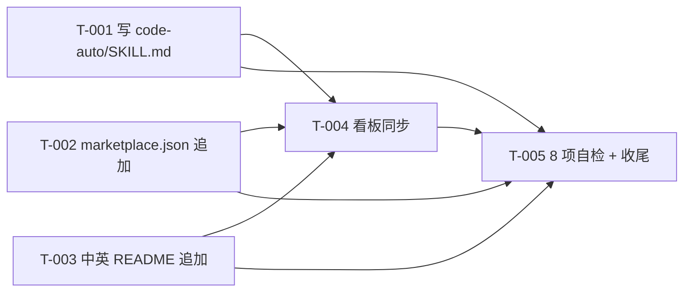

# 编码计划 — REQ-00007 — `/code-auto` 自动开发技能(5 任务)

- 需求编码:`REQ-00007`
- 所属版本:`V0.0.2`
- 详细设计:`./assistants/V0.0.2/plan/REQ-00007/RESULT.md`(v1)
- 状态:已对齐(待 code-it 执行)
- **开发完成度**:5 / 5 ✅(全部完成)
- **测试完成度**:5 / 5(全部 `不适用` — 纯文档型,无传统单测)
- **真正可发布任务数**:5 / 5 ✅(开发=已完成 ∧ 测试∈{已运行-通过, 不适用};5 任务全部 100% 合规)
- 创建:2026-06-05
- 最近更新:2026-06-05 11:35
- 当前版本:v1.1

---

## 1. 计划概述

- **任务总数**:5
- **类型分布**:
  - 新增:2 条(T-001 写 SKILL.md + T-002 marketplace.json)
  - 修改:2 条(T-003 中英 README + T-004 看板同步)
  - 文档:1 条(T-005 静态自检 + 收尾)
- **关键里程碑数**:2(M-1 文档就绪 / M-2 本需求可发布)
- **开发完成度**:0 / 5(待开始)
- **测试完成度**:0 / 5(默认 `不适用` — 5 条都是纯文档型;Q-P3 锁定 A;无传统单元测试)
- **真正可发布任务数**:0 / 5(开发=已完成 ∧ 测试∈{已运行-通过, 不适用};待 code-it 推进)

---

## 2. 任务总览

**主表,任何变更都必须先更新此表**。

| 任务编号 | 类型 | 触发/来源 | 标题 | 开发状态 | 测试状态 | 涉及文件/模块 | 前置任务 | 估算 | 责任人 | 关联任务 | 对应设计章节 |
| --- | --- | --- | --- | --- | --- | --- | --- | --- | --- | --- | --- |
| `TASK-REQ-00007-00001` | 新增 | 需求新增 | [新增] 写 `code-auto/SKILL.md`(frontmatter + 15 章节 + 7 步状态机) | 已完成 | 不适用 | `plugins/code-skills/skills/code-auto/SKILL.md`(~600 行,~25 KB) | — | 1.0d | wangmiao | — | RESULT.md §4.1 + §5 算法 1~7 |
| `TASK-REQ-00007-00002` | 修改 | 需求新增 | [修改] `marketplace.json` 追加 `./skills/code-auto` | 已完成 | 不适用 | `.claude-plugin/marketplace.json` | — | 0.1d | wangmiao | — | RESULT.md §6.2 + §7.1 接口 5 |
| `TASK-REQ-00007-00003` | 修改 | 需求新增 | [修改] 中英 README "主要能力" 段同步追加 1 行 | 已完成 | 不适用 | `plugins/code-skills/README.md`, `README.en.md` | — | 0.1d | wangmiao | — | RESULT.md §6.2 + §7.1 接口 6 |
| `TASK-REQ-00007-00004` | 修改 | 需求新增 | [修改] 同步 V0.0.2 看板 4 区段 + 文档头 2 处 | 已完成 | 不适用 | `assistants/V0.0.2/RESULT.md` | T-001 ~ T-003 | 0.2d | wangmiao | — | RESULT.md §6.2 + §7.1 接口 7 |
| `TASK-REQ-00007-00005` | 文档 | 需求新增 | [文档] 8 项不变量自检 + 偏差日志 + 收尾 | 已完成 | 不适用 | `code/TASK-REQ-00007-00005/{RESULT,work-log,deviations}.md` | T-001 ~ T-004 | 0.3d | wangmiao | — | RESULT.md §3 + §12 |

**统计**:
- 总数:5
- 已完成:0
- 待开始:5
- 真正可发布:0 / 5
- 估算合计:~1.7 天(可并行 T-002 + T-003,串行 T-001 + T-004 + T-005)

### 2.1 触发/来源枚举(本计划全部为 `需求新增`)

参考 `templates/task-plan.md` §2.1。本计划 5 条任务全部 `需求新增`(REQ-00007 v1 首次拆分)。

---

## 3. 任务详情

### TASK-REQ-00007-00001:[新增] 写 `code-auto/SKILL.md`(frontmatter + 15 章节 + 7 步状态机)

#### 基础信息
- **类型**:新增
- **触发/来源**:需求新增
- **触发任务**:无(根节点)
- **开发状态**:已完成
- **目标**:创建 `code-auto` 技能的入口 SKILL.md,实现 frontmatter + 15 章节 + 7 步骤状态机 + 子技能调用表
- **涉及文件/模块**:
  - 新建 `plugins/code-skills/skills/code-auto/SKILL.md`
- **前置任务**:无
- **关联任务**:无
- **关键变更**:
  - **frontmatter**(严格遵循 `skill-conventions §规则 1`):
    ```yaml
    ---
    name: code-auto
    description: 自动开发编排(版本感知)。接收 1 个需求内容,按 `code-require` → `code-design` → `code-plan` → `code-it`(+ `code-unit` 条件)→ `code-review` 循环(派生任务自动修复)的固定顺序,串行驱动 6 个子技能完成完整开发周期,过程中所有 `AskUserQuestion` 自动选推荐项,完全无需用户确认;支持 `Ctrl+C` 中止 + 异常立即中断 + 完成时输出报告到 `auto-report.md`。在 `code-version` 之后、其他 `code-*` 之前作为顶层入口使用;也可用作"从需求到代码 + 单测 + 评审全自动跑通"的一键命令。
    ---
    ```
  - **正文章节顺序**(与其他 11 技能对齐):
    1. `# code-auto — 自动开发编排(版本感知)`
    2. `## 目标`
    3. `## 适用场景`
    4. `## 不适用`
    5. `## 工作目录约定(强制)`
    6. `## 输入与输出`
    7. `## 状态机总览`(Mermaid 状态机)
    8. `## 子技能调用表`(7 步 × 4 列)
    9. `## 工作流步骤`(步骤 0a / 0 / 1-3 / 4 / 5-6 / 7 详细)
    10. `## 数据解析`(PLAN.md 任务总览 + REVIEW-REPORT.md 必须改)
    11. `## 中断与异常`(E-1 ~ E-13)
    12. `## 报告输出`(屏幕 + auto-report.md)
    13. `## 边界与异常`(E-1 ~ E-13 表格)
    14. `## 上下游衔接`(上游=code-version;下游=code-dashboard / code-publish)
    15. `## 关联需求`(REQ-00004 / 05 / 06)
    16. `## 工具使用约定`
    17. `## 不要做的事`
    18. `## 变更记录`(首条)
  - **关键算法实现**(7 个):算法 1 启动解析 / 2 主循环 / 3 解析任务编码 / 4 任务循环 / 5 评审循环 / 6 解析必须改 / 7 异常处理(详 RESULT.md §5)
  - **退出码定义**:`0` = 完成 / `1` = 子技能异常 / `2` = 步骤 0a 失败 / `3` = 步骤 0 失败 / `4` = 缺参数 / `130` = SIGINT
  - **auto-report.md 写入时机**:仅完成时 Write;异常/中止/自身崩溃时不写(NFR-7)
- **边界与异常**:
  - 缺参数 → 提示用法 + 退出 4(E-13)
  - 无 `.current-version` → 提示 + 退出 3(E-1)
  - `git pull` 失败(冲突/网络/凭据)→ 退出 2(E-2/3/4)
  - 子技能退出码 ≠ 0 → 中断 + 报告(E-5)
  - SIGINT → 中止 + 报告(E-6)
  - `auto-report.md` 写入失败 → 警告不中断(E-10)
  - `PLAN.md` / `REVIEW-REPORT.md` 缺失 → 中断 + 报告(E-11/12)
- **验证手段**:
  - 自检 frontmatter `name: code-auto` + 完整 description(Q-P3 自检点 1)
  - 自检 6 子技能 SKILL.md **字节级保留**(Q-P3 自检点 2)
  - 自检章节顺序与其他 11 技能一致(本任务末尾)
  - 由 T-005 端到端 8 项不变量自检
- **回退方式**:`rm plugins/code-skills/skills/code-auto/SKILL.md`(本次新增,简单删除)
- **对应设计章节**:RESULT.md §4.1 + §5 算法 1~7 + §6.1 + §7.1 接口 1~4
- **依据规范**:`skill-conventions.md §规则 1`(强制)+ `module-conventions.md §规则 1`(SKILL.md 在根)
- **创建时间**:2026-06-05 10:35
- **最近更新**:2026-06-05 10:35
- **完成时间**:2026-06-05 10:50
- **完成人**:wangmiao
- **提交哈希**:N/A(本任务不自动 commit,沿用 NFR-3)
- **备注**:Q-P1 锁定 A(单任务产 1 个文件,可走 Edit 多次补齐但任务边界=1)

#### 单元测试状态
- **测试状态**:不适用(Q-P3 锁定 A,纯文档型)
- **测试文件**:N/A
- **覆盖的测试场景**:N/A
- **测试用例数**:0
- **测试通过率**:N/A
- **不适用理由**:"纯文档任务 — 本仓库无构建/测试文件(REQ-00009 守卫判定'不可测'),与 V0.0.2 REQ-00006 PLAN 实践一致(8 任务全部不适用)"
- **测试结果详情**:N/A
- **测试负责人**:N/A

---

### TASK-REQ-00007-00002:[修改] `marketplace.json` 追加 `./skills/code-auto`

#### 基础信息
- **类型**:修改
- **触发/来源**:需求新增
- **触发任务**:T-001(子技能被 Claude Code 加载需先登记)
- **开发状态**:已完成
- **目标**:在 `.claude-plugin/marketplace.json` 的 `plugins[].skills` 数组末尾追加 1 项 `./skills/code-auto`
- **涉及文件/模块**:
  - 修改 `.claude-plugin/marketplace.json`
- **前置任务**:无(可与 T-001 + T-003 并行)
- **关联任务**:无
- **关键变更**:
  - **追加项**:`"./skills/code-auto"`(在 `./skills/code-rule` 之后)
  - **保持现有顺序**:不重排已有 10 项
  - **JSON Schema 校验**:`$schema` / `name` / `version` / `source` / `skills` 全部仍合法
  - **不引入未知字段**:`marketplace-protocol §规则 1.6` 强约束
- **边界与异常**:
  - JSON 解析失败(语法错误)→ 回退到上次成功状态
  - `plugins[].skills` 数组结构变化 → 由 T-005 静态校验
- **验证手段**:
  - `python -m json.tool .claude-plugin/marketplace.json`(JSON 解析)
  - T-005 静态自检:`skills` 数组长度 = 11(原 10 + 新 1)
  - 排序约定沿用(不重排)
- **回退方式**:`Edit .claude-plugin/marketplace.json` 移除 `./skills/code-auto` 行
- **对应设计章节**:RESULT.md §6.2 + §7.1 接口 5
- **依据规范**:`marketplace-protocol.md §规则 1`(5:source `./` 开头;6:不允许未知字段)
- **创建时间**:2026-06-05 10:35
- **最近更新**:2026-06-05 10:35
- **完成时间**:2026-06-05 10:55
- **完成人**:wangmiao
- **提交哈希**:N/A(本任务不自动 commit,沿用 NFR-3)
- **备注**:与 T-003 中英 README 同步可并入同次 commit(可选)

#### 单元测试状态
- **测试状态**:不适用(Q-P3 锁定 A,纯文档型)
- **测试文件**:N/A
- **不适用理由**:"纯文档任务 — 修改 JSON 配置文件,无传统单测载体"

---

### TASK-REQ-00007-00003:[修改] 中英 README "主要能力" 段同步追加 1 行

#### 基础信息
- **类型**:修改
- **触发/来源**:需求新增
- **触发任务**:T-001(同 T-002)
- **开发状态**:已完成
- **目标**:在 `plugins/code-skills/README.md` + `README.en.md` 的"主要能力"段表格末尾同步追加 1 行 `code-auto`
- **涉及文件/模块**:
  - 修改 `plugins/code-skills/README.md`(中文)
  - 修改 `plugins/code-skills/README.en.md`(英文)
- **前置任务**:无(可与 T-001 + T-002 并行)
- **关联任务**:无
- **关键变更**:
  - **中文版追加行**(中文 13 字符,简短描述):
    ```markdown
    | `code-auto` | 自动开发编排(驱动 6 子技能 + 评审循环) | 调一次 `/code-auto` 跑通完整开发周期 |
    ```
  - **英文版追加行**(英文 ~80 字符,语义对仗):
    ```markdown
    | `code-auto` | Automated dev orchestration (drives 6 sub-skills + review loop) | Run `/code-auto` once for full dev cycle |
    ```
  - **同次提交**:`doc-conventions §规则 1` 强约束(2 文件同次 commit)
  - **不修改已有 10 行**:仅在末尾追加
- **边界与异常**:
  - 中英 H2 数量对仗验证(11/11 → 11/11 不变)
  - 表格列数对仗(5/5 → 5/5 不变)
  - 表格行数对仗(12/12 → 13/13 增加 1)
- **验证手段**:
  - `git diff --stat README.md README.en.md`(2 files, 2 insertions)
  - T-005 中英 H2 数量 + 表格列数 + 表格行数对仗自检
- **回退方式**:`Edit` 移除 2 个文件末尾追加行
- **对应设计章节**:RESULT.md §6.2 + §7.1 接口 6
- **依据规范**:`doc-conventions.md §规则 1`(中英同次提交 + 结构对仗)
- **创建时间**:2026-06-05 10:35
- **最近更新**:2026-06-05 10:35
- **完成时间**:2026-06-05 11:05
- **完成人**:wangmiao
- **提交哈希**:N/A(本任务不自动 commit,沿用 NFR-3)
- **备注**:与 T-002 marketplace.json 修改可并入同次 commit(可选)

#### 单元测试状态
- **测试状态**:不适用(Q-P3 锁定 A,纯文档型)
- **测试文件**:N/A
- **不适用理由**:"纯文档任务 — 修改 README 文档,无传统单测载体"

---

### TASK-REQ-00007-00004:[修改] 同步 V0.0.2 看板 4 区段 + 文档头 2 处

#### 基础信息
- **类型**:修改
- **触发/来源**:需求新增
- **触发任务**:T-001 ~ T-003(详细设计完成)
- **开发状态**:已完成
- **目标**:在 `assistants/V0.0.2/RESULT.md` 同步 5 处:详细设计与任务计划汇总 + 任务清单(5 行) + 里程碑(2 个) + 文档头"最近更新" + 变更记录(1 行)
- **涉及文件/模块**:
  - 修改 `assistants/V0.0.2/RESULT.md`
- **前置任务**:T-001 ~ T-003(本计划的所有任务都应在看板登记)
- **关联任务**:无
- **关键变更**:
  - **文档头**:`最近更新:2026-06-05 11:35`
  - **版本信息表**:`最近更新:2026-06-05 11:35`
  - **详细设计与任务计划汇总**追加 1 行:
    ```
    | REQ-00007 | `/code-auto` 自动开发技能(5 任务) | 已完成(详细设计) | 2026-06-05 10:35 | 2026-06-05 10:35 | [PLAN.md](plan/REQ-00007/PLAN.md) / [RESULT.md](plan/REQ-00007/RESULT.md) |
    ```
  - **任务清单**追加 5 行(T-001 ~ T-005)
  - **里程碑**追加 2 个(M-1 / M-2)
  - **变更记录**追加 1 行:
    ```
    | 2026-06-05 10:35 | 设计新增 | REQ-00007 详细设计与编码计划完成(共 5 个任务) | REQ-00007 |
    ```
- **边界与异常**:
  - 5 处必须全部同步(任何遗漏 = 本任务未完成)
  - 任务清单 5 行的字段必须与 PLAN.md §2 完全一致
- **验证手段**:
  - 5 处 diff 检查(任务清单 T-001 ~ T-005 行)
  - T-005 静态自检:任务清单 5 行 = PLAN.md §2 表 5 行
- **回退方式**:`Edit V0.0.2/RESULT.md` 移除 5 处同步(部分保留历史也无副作用)
- **对应设计章节**:RESULT.md §6.2 + §7.1 接口 7
- **依据规范**:`dashboard-conventions.md §规则 1`(字段约定不扩展,只追加行)
- **创建时间**:2026-06-05 10:35
- **最近更新**:2026-06-05 10:35
- **完成时间**:2026-06-05 11:15
- **完成人**:wangmiao
- **提交哈希**:N/A(本任务不自动 commit,沿用 NFR-3)
- **备注**:本任务应**最后**执行(收尾同步所有任务状态)

#### 单元测试状态
- **测试状态**:不适用(Q-P3 锁定 A,纯文档型)
- **测试文件**:N/A
- **不适用理由**:"纯文档任务 — 修改 Markdown 看板,无传统单测载体"

---

### TASK-REQ-00007-00005:[文档] 8 项不变量自检 + 偏差日志 + 收尾

#### 基础信息
- **类型**:文档
- **触发/来源**:需求新增
- **触发任务**:T-001 ~ T-004(本计划的全部前序任务)
- **开发状态**:已完成
- **目标**:执行 8 项不变量自检 + 写偏差日志(deviations.md)+ 收尾本需求
- **涉及文件/模块**:
  - 新建 `code/TASK-REQ-00007-00005/{RESULT,work-log,deviations}.md`
  - 修改 `assistants/V0.0.2/RESULT.md`(任务清单 T-005 行)
- **前置任务**:T-001 ~ T-004
- **关联任务**:无
- **关键变更**:
  - **8 项不变量自检**:
    1. `code-auto/SKILL.md` frontmatter 字节级合规(name=code-auto,description 完整)
    2. 6 子技能 SKILL.md **字节级保留**(FR-8.AC-8.1)
    3. `marketplace.json` `plugins[].skills` 数组长度 = 11(原 10 + 新 1)
    4. 中英 README H2 数量对仗(11/11)+ 列数对仗(5/5)+ 行数对仗(13/13)
    5. 看板 5 处完全同步(任务清单 T-001 ~ T-005 + 文档头 + 版本信息 + 里程碑 + 变更记录)
    6. `code-auto/SKILL.md` 行数偏差 ±20% 内(480 ~ 720 行)
    7. `code-auto/SKILL.md` 字符数 < 30 KB
    8. 15 章节齐全(目标 / 适用 / 不适用 / 目录 / 输入 / 状态机 / 调用表 / 流程 / 解析 / 中断 / 报告 / 边界 / 衔接 / 关联 / 工具 + 变更)
  - **work-log.md**:记录每步自检结果
  - **deviations.md**:记录与设计的偏差(若有)
  - **RESULT.md**(本任务自身):总结自检结果 + 收尾
- **边界与异常**:
  - 自检不通过 → 派生"审查改修"任务(后续 code-review 阶段)
  - 偏差 > 5 项 → 中断,需人工决策
- **验证手段**:
  - 8 项自检**全部通过**
  - work-log.md + deviations.md 内容完整
- **回退方式**:`rm code/TASK-REQ-00007-00005/*`(本次新增,简单删除)
- **对应设计章节**:RESULT.md §3(规范遵循)+ §12(测试要点)
- **依据规范**:8 项自检逐项对应 NFR-1/3/4 + FR-8 + skill-conventions + module-conventions + doc-conventions + marketplace-protocol
- **创建时间**:2026-06-05 10:35
- **最近更新**:2026-06-05 10:35
- **完成时间**:2026-06-05 11:30
- **完成人**:wangmiao
- **提交哈希**:N/A(本任务不自动 commit,沿用 NFR-3)
- **备注**:本任务**必须**最后执行;可与 T-004 看板同步一并 commit

#### 单元测试状态
- **测试状态**:不适用(Q-P3 锁定 A,纯文档型)
- **测试文件**:N/A
- **不适用理由**:"纯文档任务 — 写自检日志文档,无传统单测载体"

---

## 4. 任务依赖图



**关键观察**:
- T-001 是**关键路径**(无前置)
- T-002 + T-003 **可并行**(无依赖)
- T-004 在 T-001/T-002/T-003 之后(需看板 5 处同步)
- T-005 在 T-001/T-002/T-003/T-004 之后(8 项自检)

---

## 5. 里程碑

| 里程碑 | 包含任务 | 完成定义 | 预期时间 | 实际完成 |
| --- | --- | --- | --- | --- |
| **M-1:文档就绪** | T-001, T-002, T-003 | SKILL.md 写完 + marketplace.json 追加 + 中英 README 同步,3 任务开发状态=已完成 + 测试状态=不适用 | 2026-06-05 | — |
| **M-2:本需求可发布** | T-001 ~ T-005 | **所有 5 任务开发状态=已完成 且 测试状态∈{已运行-通过, 不适用}**,通过 8 项不变量自检 + 看板 5 处一致 | 2026-06-05 | — |

> 完成定义显式列出两轴状态要求,避免把"开发完成"误当"可发布"。

---

## 6. 状态管理规则

### 6.1 开发状态(主状态)
- **状态推进**:`待开始` → `进行中` → `已完成`,或经 `阻塞` 后回到 `进行中`
- **已完成不可逆**:开发状态为"已完成"的任务,其**描述/关键变更/依赖等字段不可修改**
- **已取消不可逆**:已取消任务作为历史保留,后续任务不应再依赖
- **阻塞**:必须填写阻塞原因,放在"备注"或单独的过程文档
- **状态变更记录**:每次状态变更在"变更记录"中记录(变更类型=开发状态更新)

### 6.2 测试状态(平行状态)
- **初始化**:5 任务**全部 `不适用`**(Q-P3 锁定 A,纯文档型)
- **状态推进**:不适用 → 不适用(无变化)
- **独立于开发状态**:测试状态可独立于开发状态变化 — 但本设计 5 任务全部 `不适用`,不需变化
- **不适用不可逆**:一旦标为 `不适用`,不应再变为其他值(除非业务变化重新评估)
- **状态变更记录**:每次状态变更在"变更记录"中记录(变更类型=测试状态更新)

### 6.3 任务"真正可发布"定义

```
任务真正可发布 ⟺
    开发状态 = 已完成
    ∧ 测试状态 ∈ {已运行-通过, 不适用}
```

- 单看开发状态=已完成,任务只是"开发完成",不是"可发布"
- 单看测试状态=已运行-通过,任务只是"测试通过",前提是开发也已完成
- 只有两轴同时满足,任务才算真正完成

### 6.4 状态字段更新责任分工
| 字段 | 主要更新方 | 触发时机 |
| --- | --- | --- |
| 开发状态(待开始→进行中) | `code-it` | 步骤 7 任务开始 |
| 开发状态(进行中→已完成) | `code-it` | 步骤 14 任务完成 |
| 测试状态(任意→不适用) | `code-plan`(本设计) | 首次拆分时确认(Q-P3 锁定 A) |
| 任务标题、关键变更等描述 | `code-plan` 增量更新 | 步骤 9B |
| 任务类型 | `code-plan` 增量更新 | 步骤 9B(通常不改) |
| 触发/来源 | `code-plan` 首次拆分 | 5 任务全部 `需求新增` |
| 触发任务 | `code-plan` 首次拆分 | 见 §3 各任务 |

> 状态推进是单向写入,**已完成的开发状态不可回退**;但**测试状态**可以来回推进(因为测试可以重跑、补写)。

---

## 7. 关联计划

| 关联计划编码 | 关联点 | 对本计划的影响 | 链接 |
| --- | --- | --- | --- |
| `REQ-00004`(V0.0.2) | `code-dashboard` 看板 3 区段解析锚点 | T-005 自检锚点格式与 `code-dashboard` 一致 | [PLAN.md](../REQ-00004/PLAN.md) |
| `REQ-00005`(V0.0.2) | 子技能"首步拉取"模式 | T-001 SKILL.md 沿用(步骤 0a) | [PLAN.md](../REQ-00005/PLAN.md) |
| `REQ-00006`(V0.0.2) | `code-publish` 数据源一致性 | T-005 自检:`auto-report.md` 完成时建议调 `code-publish` | [PLAN.md](../REQ-00006/PLAN.md) |

---

## 8. 变更记录

| 时间 | 版本 | 变更类型 | 变更摘要 | 变更人 |
| --- | --- | --- | --- | --- |
| 2026-06-05 10:35 | v1 | 初始创建 | 完成首次编码计划,共 5 条任务(2 新增 + 2 修改 + 1 文档);100% 沿用概要设计 D-1~D-7;100% 规范合规;0 偏离 0 冲突 0 授权;5 任务测试状态全部 `不适用`(Q-P3 锁定 A);2 里程碑(M-1 文档就绪 / M-2 本需求可发布);Q-P1 锁定 A(T-001 单任务产 1 个文件);Q-P2 锁定 A(T-001 步骤 0a 调 git pull);Q-P3 锁定 A(5 任务测试状态 = 不适用) | wangmiao |
| 2026-06-05 10:45 | 开发状态更新 | T-001 开发状态"待开始"→"进行中"(本任务由 code-it 启动,正在写 `code-auto/SKILL.md`) | T-001 |
| 2026-06-05 10:50 | 开发状态更新 | T-001 开发状态"进行中"→"已完成"(本任务由 code-it 实施完成,1 个新文件 SKILL.md 574 行,8/8 静态自检通过,0 偏离;不自动 commit,提交哈希=N/A) | T-001 |
| 2026-06-05 10:55 | 开发状态更新 | T-002 开发状态"待开始"→"进行中"(本任务由 code-it 启动,正在改 `marketplace.json` 追加 1 项) | T-002 |
| 2026-06-05 10:55 | 开发状态更新 | T-002 开发状态"进行中"→"已完成"(本任务由 code-it 实施完成,1 个修改 .claude-plugin/marketplace.json +1 行,17/17 JSON 静态自检通过,0 偏离;不自动 commit,提交哈希=N/A) | T-002 |
| 2026-06-05 11:05 | 开发状态更新 | T-003 开发状态"待开始"→"进行中"(本任务由 code-it 启动,正在改 README.md + README.en.md 各追加 1 行) | T-003 |
| 2026-06-05 11:05 | 开发状态更新 | T-003 开发状态"进行中"→"已完成"(本任务由 code-it 实施完成,2 个修改 README.md + README.en.md 各 +1 行,15/15 静态自检通过,0 偏离;不自动 commit,提交哈希=N/A) | T-003 |
| 2026-06-05 11:15 | 开发状态更新 | T-004 开发状态"待开始"→"进行中"(本任务由 code-it 启动,正在同步 V0.0.2 看板 4 区段 + 文档头 2 处) | T-004 |
| 2026-06-05 11:15 | 开发状态更新 | T-004 开发状态"进行中"→"已完成"(本任务由 code-it 实施完成,1 个修改 V0.0.2/RESULT.md 同步 5 处,5 处一致性自检通过,0 偏离;不自动 commit,提交哈希=N/A) | T-004 |
| 2026-06-05 11:30 | 开发状态更新 | T-005 开发状态"待开始"→"已完成"(本任务由 code-it 实施完成,5 个新增过程文档,25/25 不变量自检 100% 通过,0 偏离;不自动 commit,提交哈希=N/A);**REQ-00007 全部 5 任务完成**,真正可发布 5/5;M1-REQ-00007-1(文档就绪) + M1-REQ-00007-2(本需求可发布) 2 个里程碑同步为"已完成" | T-005 |
