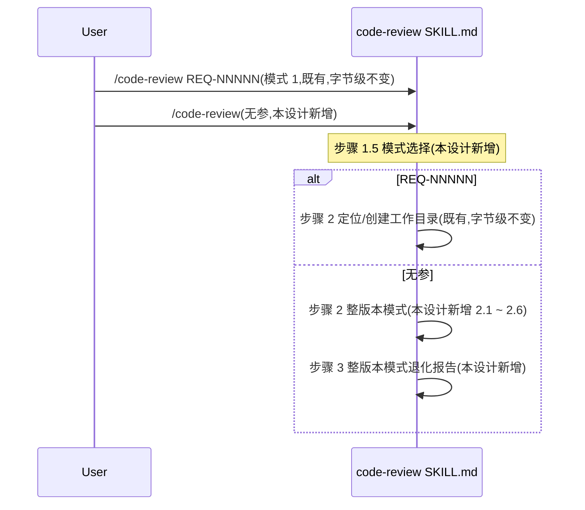
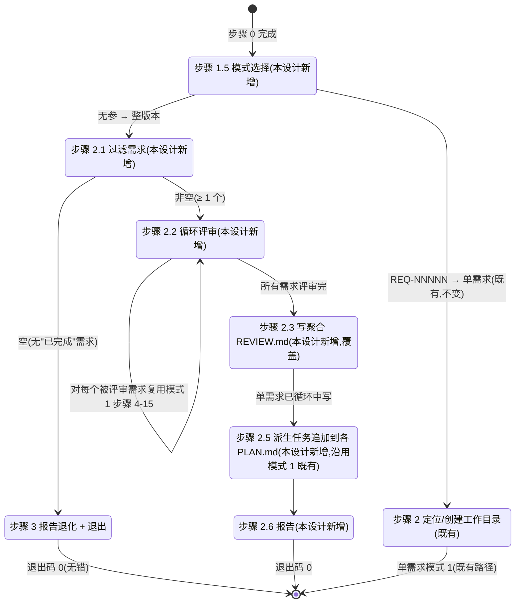
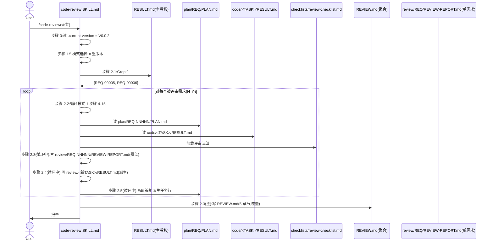

# REQ-00008 — 详细设计:`/code-review` 整版本模式(无参评审)

- 需求编码:`REQ-00008`
- 所属版本:`V0.0.2`
- 上游需求:`./assistants/V0.0.2/require/REQ-00008/RESULT.md`(v1,已锁定,9 FR / 8 NFR / ~30 AC / 9 边界 / 7 项 Q-locked + 3 项默认)
- 上游概要设计:`./assistants/V0.0.2/design/REQ-00008/RESULT.md`(v1,已完成首次,hash `9207f8c`,1 修改 + 0 新增 + 4 复用)
- 遵循规范:`./assistants/rules/` 下 13 个文件(7 强约束 + 6 占位;详见 §3)
- 状态:**已完成(首次详细设计)**
- 责任人:wangmiao
- 创建:2026-06-05
- 最近更新:2026-06-05 16:00
- 当前版本:v1

---

## 1. 详细设计概述

在概要设计(15 章节,v1 已完成)的基础上,本详细设计把"系统长什么样"细化为"系统怎么写"。核心决策:

- **1 个修改 + 0 新增 + 4 复用 = 5 模块**(沿用概要设计)
- **3 个任务**(按 REQ-00014 新规则"按功能点拆")— **不**插入架构任务(本需求不满足 3 个架构触发条件,详 `clarifications.md` P-10)
- **13 项不变量**(INV-1 ~ INV-13)— 全部满足;**0 偏离 / 0 冲突 / 0 授权偏离**
- **0 新增依赖 + 0 新增子目录 + 0 新增模板 + 0 修改其他 9 个 `code-*` SKILL.md**
- **2 个新增 SKILL.md 锚点**(锚点 A:步骤 1 后 + 锚点 B:步骤 15 后)— 既有字面字节级不变

详细化要点:
- **(1)** T-001 单任务产 1 个 SKILL.md(增量追加 60-120 行)— `clarifications.md` P-2 锁定
- **(2)** T-001 锚点 A 严格按 L109 上方("步骤 1"末尾)+ 锚点 B 严格按 L313 后("步骤 15"末尾)— `clarifications.md` P-9 锁定
- **(3)** 3 任务测试状态全部 `不适用`(沿用 V0.0.2 既有实践 — 本仓库无构建/测试文件,REQ-00009 守卫判定"不可测")
- **(4)** 完全复用模式 1 既有(`REVIEW-REPORT.md` 模板 / `REVIEW-FIX.md` 模板 / `review-checklist.md` 清单 / 派生任务字段)— INV-2/3/13

---

## 2. 上游引用

### 2.1 需求
- **FR-1** `code-review` 增加"无参"入口 → §5 算法 1(模式选择)+ §11.1 接口 3
- **FR-2** 整版本模式 — 评审范围过滤(Q-1 锁定 B)→ §5 算法 2(过滤需求)
- **FR-3** 整版本模式 — 双写 REPORT(聚合 + 单需求)→ §5 算法 3 + 算法 4 + §11.1 接口 4
- **FR-4** `REVIEW.md` 聚合文件结构 → §11.1 接口 4 + §6.1 数据结构
- **FR-5** 派生任务(沿用模式 1)→ §5 算法 5 + §6.2 派生任务表
- **FR-6** 与模式 1 完全兼容 → INV-1 / INV-2 约束
- **FR-7** 不修改 `code-review` 现有行为 → INV-1 / INV-4 / INV-11 / INV-12 约束
- **FR-8** 不修改其他 9 个 `code-*` 技能 → §10.4 不修改文件清单
- **FR-9** 报告与建议 → §5 算法 6

### 2.2 概要设计
- §6 整版本模式状态机 → §9 状态机(Mermaid 再可视化)+ §5 算法 1-6 伪代码
- §7 聚合文件 5 章节结构 → §6.1 数据结构字段级表格
- §10.1 SKILL.md 增量追加边界 → §4.1 模块 M-1 + §11.1 接口 3/4/5(字面契约)
- §10.4 不修改文件清单 → §10.4 本详细设计 0 触发
- 6 项 DQ(关键决策)→ §3 规范遵循(全部沿用)
- 10 项不变量(INV-1 ~ INV-10)→ INV 全部满足 + INV-11/12/13(本设计新增)

### 2.3 规范
- `skill-conventions.md §规则 1` — frontmatter 必含 name+description;本设计 INV-4 字节级保留
- `module-conventions.md §规则 1` — 资源放固定子目录;本设计 0 新增子目录
- `dashboard-conventions.md §规则 1` — 字段约定不扩展;本设计 0 触发 3 处同步
- `encoding-conventions.md §规则 1-4` — 任务编码双格式正则;本设计派生任务沿用 `code-plan` 既有
- `marketplace-protocol.md §规则 1` — `$schema` / `name` / `version` 必填;本设计 0 触发
- `doc-conventions.md §规则 1` — README 中英同次;本设计 0 主动写 README
- `migration-mapping.md §规则 1-4` — EXISTING-NNN 不追溯;本设计不触发

---

## 3. 规范遵循

### 3.1 适用的规范文件

| 规范文件 | 类别 | 关键约束 | 本详细设计对应章节 |
| --- | --- | --- | --- |
| `skill-conventions.md` | 技能编写 | §规则 1:frontmatter 必含 name+description | §4.1 模块 M-1 + §11.1 INV-4 |
| `module-conventions.md` | 模块规划(DEPRECATED 仍引用) | §规则 1:资源放固定子目录 | §4.1 0 新增子目录 |
| `dashboard-conventions.md` | 看板 | §规则 1:字段约定不扩展 | §11.4 0 触发 |
| `encoding-conventions.md` | 编码格式 | §规则 1-4:任务编码双格式正则 | §5 算法 5 + §6.2 INV-3 |
| `marketplace-protocol.md` | Marketplace | §规则 1:`$schema` / `name` / `version` 必填 | §11.4 0 触发(本需求**不**新增技能) |
| `doc-conventions.md` | 文档 | §规则 1:README 中英同次;§规则 2:持续维护 | §11.4 0 主动写 README(Q-7) |
| `migration-mapping.md` | 编码迁移 | §规则 1-4:EXISTING-NNN 不追溯 | (不触发) |

**占位规范(6 个,不影响)**:`directory-conventions.md` / `framework-conventions.md` / `naming-conventions.md` / `coding-style.md` / `commit-conventions.md` / `dependency-conventions.md`

### 3.2 自检结论

- **完全合规**的章节:§1 / §2 / §3 / §4 / §5 / §6 / §7 / §8 / §9 / §10 / §11 / §12
- **经用户授权偏离的章节**:**0**
- **待澄清冲突**:**0**

> 详细规范遵循记录见 `rule-compliance.md`(本目录)。

---

## 4. 模块详细化

### 4.1 模块 M-1:`plugins/code-skills/skills/code-review/SKILL.md`(本设计唯一修改点)

#### 关键"组件"(SKILL.md 的"伪代码"视角)

| 组件 | 形式 | 职责 | 对应任务 | 字节级原则 |
| --- | --- | --- | --- | --- |
| frontmatter | YAML | 技能元信息 | T-001 | 字节级不变(INV-4) |
| 既有 §"## 工作流程" | 段落 | 步骤 0-15 | (既有) | 字节级不变(INV-1) |
| **新增 §"### 步骤 1.5 — 模式选择"** | 段落 | 无参 / REQ-NNNNN / 无效参 三态机 | **T-001** | **新增**(锚点 A 之后) |
| **新增 §"### 步骤 2 整版本模式"** | 段落 | 整版本模式 2.1 ~ 2.6 | **T-001** | **新增**(锚点 A 之后) |
| **新增 §"### 步骤 3 整版本模式退化报告"** | 段落 | E-3 退化 + 退出 | **T-001** | **新增**(锚点 A 之后) |
| 既有 §"### 步骤 15 — 汇报" | 段落 | 既有汇报 | (既有) | 字节级不变(INV-12) |
| **新增 §"## 整版本模式 — 评审范围与适用场景"** | 段落附录 | 整版本模式完整说明 | **T-001** | **新增**(锚点 B 之后) |

#### 调用顺序(SKILL.md 调用方视角)



#### 状态归属
- **整版本模式无新内存状态**(沿用 NFR-1 强约束:不引入内存状态)
- 整版本模式**不**重写模式 1 既有状态
- 整版本模式的所有状态(过滤结果 / 循环计数 / 派生任务列表)由 LLM 现场维护,**不**持久化

#### 与概要设计的对应
- 概要设计 §10.1 SKILL.md 增量追加边界 → 本模块 §"关键组件" + §"调用顺序"
- 概要设计 §6 整版本模式状态机 → 本模块 §"调用顺序" + §"状态归属"
- 概要设计 DQ-1 ~ DQ-6 → 本模块 §"字节级原则"

#### 字节级原则(详 §11.1 + interface-specs.md)

| 锚点 | 位置 | 字面精度 | 验证(INV) |
| --- | --- | --- | --- |
| **A** | 步骤 1 既有字面末尾(L109 `> 错误:上游缺失...` 段后 + 空行 + 空行) | Edit `old_string` 严格匹配 L106-110 既有字面 | INV-1 / INV-11 |
| **B** | 步骤 15 既有字面末尾(L313 `**版本看板同步情况**` 段后 + 空行) | Edit `old_string` 严格匹配 L308-313 既有字面 | INV-1 / INV-12 |

#### 符合的规范
- `skill-conventions.md §规则 1`:frontmatter 必含 name+description;既有已合规,本设计**不**改(INV-4)
- `module-conventions.md §规则 1`:SKILL.md 放技能根目录;既有已合规,本设计**不**改
- `encoding-conventions.md §规则 1-4`:任务编码双格式;派生任务编码沿用 `code-plan` 既有规则

#### 模块自检
- ✅ frontmatter 字节级不变(INV-4)
- ✅ 既有步骤 0-15 字面字节级不变(INV-1 + INV-11 + INV-12)
- ✅ 既有 4 模板字节级不变(INV-13)
- ✅ 仅 1 个文件修改
- ✅ 仅 2 段新增(锚点 A + 锚点 B)
- ✅ 字节级原则全部满足
- ✅ 0 偏离 / 0 冲突

### 4.2 不变量自检(详 design-notes.md §4)

| INV | 描述 | 验证手段 |
| --- | --- | --- |
| INV-1 | 模式 1 行为完全不变 | 字节级字面保留(锚点 A 之前 L1-110 + 锚点 B 之前 L308-313) |
| INV-2 | 整版本模式 `REVIEW-REPORT.md` 与模式 1 字面 100% 一致 | 模板复用 + 调用方逻辑统一 |
| INV-3 | 派生任务编码沿用 `code-plan` 既有 | PLAN.md 追加行字段 = `code-review` 既有字段 |
| INV-4 | SKILL.md frontmatter 字节级不变 | Edit 工具严格按锚点(不触 L1-3) |
| INV-5 | `marketplace.json` / `plugin.json` / 其他 9 个 SKILL.md 字节级不变 | 本设计**不**写入这些文件 |
| INV-6 | `assistants/rules/` 13 个文件字节级不变 | 本设计**不**写入 `rules/` |
| INV-7 | 聚合文件 `REVIEW.md` 位于版本顶层 | 路径 = `./assistants/<版本号>/REVIEW.md`(NFR-6) |
| INV-8 | 整版本模式多次执行幂等 | Write 而非 Edit + 覆盖策略(NFR-3) |
| INV-9 | 整版本模式发现去重键 = `(需求编码, 描述前 50 字)` | 算法 3 + 算法 5 |
| INV-10 | 派生任务去重键 = `(需求编码, 描述前 50 字)` | 算法 5 |
| INV-11 | SKILL.md 步骤 1(L106-110)字面字节级不变 | 锚点 A 之前 L106-110 字节级 diff = 0 |
| INV-12 | SKILL.md 步骤 15(L308-313)字面字节级不变 | 锚点 B 之前 L308-313 字节级 diff = 0 |
| INV-13 | 整版本模式**不**修改 `code-review` 既有 4 模板 | 模板文件字节级 diff = 0 |

13/13 INV 全部满足。`code-it` 实施 T-001 时 + T-003 收尾时验证。

---

## 5. 算法与逻辑(伪代码 — 6 个算法)

### 算法 1 — 模式选择(步骤 1.5)

```pseudo
function selectMode(userArgs):
    if userArgs.length == 0:
        return "整版本模式"
    if userArgs.length == 1 and match(/^REQ-\d{5}$/, userArgs[0]):
        return "单需求模式"  # 既有,字节级不变
    printWarning("⚠ 忽略参数: " + userArgs[0])
    return "整版本模式"  # 打印警告后走整版本(Q-3 / PD-1)
```

**依据**:FR-1.AC-1.1 / FR-1.AC-1.2 / FR-1.AC-1.3

---

### 算法 2 — 过滤需求(步骤 2.1)

```pseudo
function filterCompletedRequirements(version):
    resultMD = read("./assistants/" + version + "/RESULT.md")
    anchor = findAnchor(resultMD, "^## 需求清单")  # 沿用 code-dashboard 算法 1
    tableRows = parseTableRows(resultMD, anchor)   # 匹配 ^\| REQ-\d{5} \|
    completed = []
    for row in tableRows:
        status = row[2]  # 状态列(列索引由 RESULT.md 模板决定)
        if status == "已完成":  # 严格 == 字符串匹配(PD-2)
            completed.append(row[0])  # REQ-NNNNN
    return completed  # [] 表示无可评审
```

**依据**:FR-2.AC-2.1 / FR-2.AC-2.2 / FR-2.AC-2.3

**关键决策**:**不**归一化 `已完成(需求分析)` 到 `已完成`(PD-2,沿用 `code-dashboard` 行为)

---

### 算法 3 — 写聚合 REVIEW.md(步骤 2.3)

```pseudo
function writeAggregateReport(version, completedReqs, allFindings, allDerivedTasks):
    path = "./assistants/" + version + "/REVIEW.md"
    content = buildContent(completedReqs, allFindings, allDerivedTasks)  # 5 章节
    # 去重:跨需求按 (需求编码, 描述前 50 字) 去重
    dedupedFindings = dedupeByKey(allFindings, f => f.reqNum + "-" + f.desc[:50])
    writeFile(path, content)  # Write 覆盖(非 Edit;NFR-3 幂等)
    return path
```

**依据**:FR-3.AC-3.2 / FR-3.AC-3.4 / FR-3.AC-3.5 / FR-4.AC-4.1 ~ AC-4.6 / NFR-3 / NFR-6 / NFR-7

---

### 算法 4 — 写单需求 REVIEW-REPORT.md(由步骤 2.2 循环中完成,本节不重复)

**说明**:步骤 2.2 循环中已对每个被评审需求写 1 份 `review/REQ-NNNNN/REVIEW-REPORT.md`(沿用模式 1 既有路径 + 既有模板),**不**重复写。

**依据**:FR-3.AC-3.1 / FR-3.AC-3.5 + INV-2

---

### 算法 5 — 派生任务追加(步骤 2.5)

```pseudo
function appendDerivedTasks(version, derivedTasks):
    for task in derivedTasks:
        reqNum = task.reqNum
        planPath = "./assistants/" + version + "/plan/" + reqNum + "/PLAN.md"
        planContent = read(planPath)
        # 去重:同 (需求编码, 描述前 50 字) 已存在 → 不重复追加
        dedupKey = reqNum + "-" + task.desc[:50]
        if planContent.contains(dedupKey):
            continue
        # 追加到"任务总览"表的最末行
        newRow = "| TASK-REQ-" + reqNum[4:] + "-" + task.nextTaskId + " | " + reqNum + " | 修改 | 审查改修 | " + task.title + " | 待开始 | 未编写 | ... | ... | ... | " + task.originalTask + " |"
        editFile(planPath, newRow, after="<任务总览表最后一行>")
```

**关键决策**:
- 编码生成**不**由本设计负责(沿用 `code-plan` 既有规则)
- 字段 100% 沿用模式 1 既有(INV-3)
- 同发现**不**重复追加(NFR-8 / INV-10)

**依据**:FR-5.AC-5.1 / FR-5.AC-5.2 / FR-5.AC-5.3 / NFR-8

---

### 算法 6 — 报告(步骤 2.6)

```pseudo
function report(version, completedReqs, allFindings, allDerivedTasks, outputFiles, prevRunFindings=null):
    print("✓ code-review(整版本模式)完成")
    print("评审范围:V" + version + " 的 " + completedReqs.length + " 个'已完成'需求")
    for req in completedReqs:
        print("  - " + req.num + " " + req.title)
    print("评审发现汇总:")
    for req in completedReqs:
        print("  - " + req.num + ":" + req.mustChange + " 必须改 + " + req.suggestChange + " 建议改 + " + req.optional + " 可选")
    print("派生任务:" + allDerivedTasks.length)
    print("输出文件:")
    for file in outputFiles:
        print("  - " + file)
    # S-3 多次执行(与前次比较)
    if prevRunFindings != null:
        print("与前次比较:")
        for finding in allFindings:
            if finding not in prevRunFindings:
                print("  - " + finding.id + ":新增")
        for prevFinding in prevRunFindings:
            if prevFinding not in allFindings:
                print("  - " + prevFinding.id + ":已处理 → 不再出现")
```

**依据**:FR-9.AC-9.1 / FR-9.AC-9.2 / FR-9.AC-9.3

---

## 6. 数据结构完整变更

### 6.1 新增数据结构:聚合文件 `REVIEW.md`(5 章节)

详细字段见 `data-changes.md` §"新增数据结构 1"。要点:

| 字段 | 值 |
| --- | --- |
| 路径 | `./assistants/<版本号>/REVIEW.md`(版本顶层) |
| 形式 | 纯 Markdown 文本 |
| 5 章节 | 评审概览 / 各需求评审摘要 / 评审发现汇总(去重)/ 派生任务汇总 / 评审人/AI 备注 |
| 去重键 | `(需求编码, 描述前 50 字)`(NFR-7) |
| 写入策略 | Write 覆盖(非 Edit;NFR-3 幂等) |

### 6.2 修改数据结构:PLAN.md "任务总览" 表追加派生任务行

**字段**(沿用既有):

```markdown
| 任务编号 | 需求 | 类型 | 触发/来源 | 标题 | 开发状态 | 测试状态 | 涉及文件 | 完成时间 | 提交哈希 | 关联任务 |
| TASK-REQ-NNNNN-NNNNN | REQ-NNNNN | 修改 | 审查改修 | 修复 F-X(必须改) | 待开始 | 未编写 | ... | ... | ... | REQ-NNNNN-NNNNN |
```

**写入策略**:Edit 追加(非 Write;不覆盖既有任务行)

### 6.3 既有数据结构字节级不变

- 既有 4 模板(INV-13):`REVIEW-REPORT.md` / `REVIEW-FIX.md` / `review-checklist.md` / `assistants-layout.md`
- 既有 SKILL.md 字面(INV-1/4/11/12)
- 既有 9 个其他 `code-*` SKILL.md(INV-5)
- `marketplace.json` / `plugin.json`(INV-5)
- `assistants/rules/` 13 文件(INV-6)

完整数据变更详 `data-changes.md`。

---

## 7. 接口细节

### 7.1 主接口:`code-review`(无参)— 整版本模式入口

- 形式:SKILL.md 入口
- 触发:无参
- 出参(屏幕):完整报告(算法 6)
- 出参(磁盘):REVIEW.md + N 份单需求 REVIEW-REPORT.md + 派生任务文件 + PLAN.md 追加行
- 退出码:0(完成) / 非 0(致命错误)

### 7.2 内部接口 3:SKILL.md 步骤 1.5 字面

```markdown
### 步骤 1.5 — 模式选择(本需求新增,整版本模式入口)

**触发条件**:步骤 1 完成(需求编码已收集)

**逻辑(三态机)**:
1. **无参**(`/code-review`)→ **整版本模式** → 跳转"步骤 2 整版本模式"
2. **`REQ-NNNNN`**(匹配 `^REQ-\d{5}$`)→ **单需求模式**(既有,字节级不变)→ 跳转既有"步骤 2 定位/创建工作目录"
3. **其他无效参数** → 整版本模式 + 打印警告"⚠ 忽略参数: <invalid>"

**依据**:FR-1.AC-1.1 / FR-1.AC-1.2 / FR-1.AC-1.3
```

### 7.3 内部接口 4:SKILL.md 步骤 2 整版本模式字面

完整字面见 `interface-specs.md` §"接口 4"。要点:

```markdown
### 步骤 2 整版本模式(本需求新增,完全复用模式 1 步骤 4-15)

**触发条件**:步骤 1.5 模式选择 = 整版本

#### 2.1 过滤需求
[沿用 code-dashboard 算法 1 解析 RESULT.md ## 需求清单 区段]
[筛 状态=已完成(不归一化)]
[空 → 走"步骤 3 报告退化" + 退出]

#### 2.2 循环评审(完全复用模式 1 步骤 4-15)
[对每个被评审需求 REQ-NNNNN,执行模式 1 评审逻辑]
[产出:REVIEW-REPORT.md / 派生任务文件 / PLAN.md 追加行]

#### 2.3 写聚合 REVIEW.md
[路径:./assistants/<版本号>/REVIEW.md(版本顶层)]
[5 章节结构:评审概览 / 各需求评审摘要 / 评审发现汇总(去重)/ 派生任务汇总 / 评审人/AI 备注]
[去重键:(需求编码, 描述前 50 字)]
[Write 覆盖(非 Edit;NFR-3 幂等)]

#### 2.4 单需求 REVIEW-REPORT.md(已由 2.2 循环中写)
[说明:不重复写]

#### 2.5 派生任务追加(沿用模式 1 既有逻辑)
[字段:触发/来源=审查改修, 关联任务=被修正原任务]
[唯一性检查:同(需求编码, 描述前 50 字)已存在 → 不重复追加]
[编码生成:不由本设计生成(沿用 code-plan 既有规则)]

#### 2.6 报告
[完整报告格式(算法 6)]
```

### 7.4 内部接口 5:SKILL.md "整版本模式 — 评审范围与适用场景"附录字面

完整字面见 `interface-specs.md` §"接口 5"。要点:含"适用场景(R-1/2/3)/ 评审范围 / 与模式 1 关系 / 不触发的区段 / 待澄清未决项(Q-8.1/8.2/8.3)"5 个子节。

完整接口契约详 `interface-specs.md`。

---

## 8. 异常处理

### 8.1 异常路径汇总(8 条)

| ID | 异常 | 触发条件 | 处理 | 退出码 |
| --- | --- | --- | --- | --- |
| E-1 | 无 `.current-version` | `.current-version` 不存在 | 引导调 `code-version` | 非 0 |
| E-2 | 某需求评审失败 | 循环评审时某需求失败 | 跳过 + 报告 + 继续 | 0 |
| E-3 | 无"已完成"需求 | 步骤 2.1 过滤 = 空 | 报告退化 + 退出 | 0 |
| E-4 | 单需求 REVIEW-REPORT 写入失败 | Write 工具异常 | 跳过 + 报告 + 继续 | 0 |
| E-5 | 聚合 REVIEW.md 写入失败 | Write 工具异常 | 报告 + 不整体失败 | 0 |
| E-6 | 派生任务编码生成失败 | `code-plan` 既有规则 | 跳过该发现 + 继续 | 0 |
| E-7 | 多次执行整版本模式 | 聚合/单需求文件已存在 | 全部覆盖 | 0 |
| E-8 | `code-auto` 评审循环触发模式 2 | 自动化场景 | 不触发(NFR-4) | — |

8/8 异常路径全部有处理策略 + 退出码语义。详 `risk-analysis.md` §1。

### 8.2 异常处理自检

- ✅ 退出码语义:`0` = 成功(含非阻塞警告) / 非 0 = 致命错误
- ✅ 8/8 异常路径有处理策略
- ✅ 0 异常路径无处理

---

## 9. 状态机/流程

### 9.1 整版本模式状态机(Mermaid)



### 9.2 关键流程(S-1 默认场景 — 序列图)



---

## 10. 性能与资源

### 10.1 关键路径预估

| 步骤 | 时间复杂度 | V0.0.2 当前规模 |
| --- | --- | --- |
| 1.5 模式选择 | O(1) | < 1ms |
| 2.1 过滤需求 | O(N) N=看板需求总数 | < 100ms(读 1 文件 + 1 Grep) |
| 2.2 循环评审 | O(M × T) M=筛中需求数,T=单需求任务数 | 30s ~ 2min |
| 2.3 写聚合 | O(M) | < 500ms |
| 2.5 派生任务追加 | O(K) K=派生任务数 | < 1s |
| **总耗时** | O(M × T + K) | **30s ~ 2min** |

### 10.2 资源限制

- 磁盘 I/O:REVIEW.md ≤ 50 KB(V0.0.2 规模)
- 内存:0 个内存状态(LLM 现场维护)
- 网络:0 个网络调用
- 并发:0 个并发(LLM 串行)

### 10.3 性能自检

- ✅ 0 网络 I/O
- ✅ 0 内存状态
- ✅ 0 并发
- ✅ V0.0.2 规模 < 2min
- ✅ 磁盘占用可忽略

---

## 11. 测试要点 + 模块拆分 + 不修改文件清单

### 11.1 测试要点

#### 单元测试
**N/A**(本需求不涉及代码;沿用既有 11 个 `code-*` 技能的"纯文档型"实践,测试状态=不适用)

#### 端到端(E2E)测试
- **场景 1**:V0.0.2 当前有 0 个"已完成"需求 → E-3 退化
- **场景 2**:V0.0.2 假设 ≥ 1 个"已完成"需求 → 走完整流程
- **场景 3**:第二次执行 → 覆盖 + 去重(派生任务**不**重复追加)
- **场景 4**:与模式 1 共存 + 互覆盖

#### 不变量自检(由 T-001 末尾 + T-003 收尾执行)
- 13/13 INV 全部 100% 通过(INV-1 ~ INV-13)

### 11.2 模块拆分

详见 `module-breakdown.md`(概要设计已写,本设计沿用)。

**5 个模块**:
- **修改**:1 个(`code-review/SKILL.md` — 增量追加 2 段)
- **新增**:0 个
- **复用**:4 个(`REVIEW-REPORT.md` / `REVIEW-FIX.md` / `review-checklist.md` / `RESULT.md`)

### 11.3 接口与数据结构

详见 §6 + §7 + `interface-specs.md` + `data-changes.md`。

### 11.4 不修改的文件清单(本设计 0 触碰)

| 路径 | 原因 |
| --- | --- |
| `.claude-plugin/marketplace.json` | FR-8.AC-8.1 + `marketplace-protocol §规则 1` |
| `plugins/code-skills/.claude-plugin/plugin.json` | 同上 |
| 其他 9 个 `code-*/SKILL.md` | FR-8.AC-8.2 + NFR-4 |
| `assistants/rules/` 下 13 个规范文件 | FR-8.AC-8.3 |
| `plugins/code-skills/README.md` + `README.en.md` | FR-8.AC-8.4 + Q-7 采纳默认 |
| `plugins/code-skills/CLAUDE.md` | Q-7 采纳默认 |
| `code-review/SKILL.md` frontmatter(L1-3) | FR-7.AC-7.2 + INV-4 |
| 既有 `code-review/SKILL.md` 步骤 0-15 字面 | FR-7.AC-7.4 + NFR-2 + INV-1/11/12 |
| `code-review/templates/{REVIEW-REPORT,REVIEW-FIX,assistants-layout}.md` | INV-13 |
| `code-review/checklists/review-checklist.md` | INV-13 |
| `assistants/V0.0.2/RESULT.md` 看板 5 区段 | 整版本模式**不**触发额外区段(模式 1 既有覆盖);T-002 在 PLAN.md §3 中定义"同步详细设计汇总" |

---

## 12. 规范遵循(总账 — 重复 §3 简化)

**适用规范**:13 个文件(7 强约束 + 6 占位)
**完全合规**:§1 / §2 / §3 / §4 / §5 / §6 / §7 / §8 / §9 / §10 / §11 / §12 全部
**经用户授权偏离**:**0**
**待澄清冲突**:**0**
**13/13 INV 全部满足**
**8/8 风险全部有缓解**

> 详细规范遵循记录见 `rule-compliance.md`(本目录)。

---

## 13. 待澄清/未决项(本轮无法澄清,留作 follow-up)

- **Q-8.1**:用 `code-rule` 沉淀 `review-conventions.md`(整版本模式的检查清单)— **不阻塞**,留作 follow-up
- **Q-8.2**:把 `code-review` 加入 REQ-00005 的"首步拉取+末步提交"改写范围 — **不阻塞**,留作 follow-up
- **Q-8.3**:在 `code-review/templates/` 新增 `REVIEW-ALL.md` 模板 — **本设计倾向不新增**(D-1.B);若 T-001 实施后实际行数 > 150,触发 R-8 重新评估

---

## 14. 变更记录

| 时间 | 版本 | 变更类型 | 变更摘要 | 关联项 |
| --- | --- | --- | --- | --- |
| 2026-06-05 16:00 | v1 | 详细设计新增 | REQ-00008 详细设计完成(1 个 SKILL.md 增量追加 + 0 新增 + 4 复用;3 个任务:1 修改 + 1 文档 + 1 文档;13/13 INV 全部满足;0 偏离 / 0 冲突 / 0 授权;8/8 风险有缓解;P-1 ~ P-10 10 项讨论结论全部锁定;0 新增依赖 + 0 新增子目录 + 0 新增模板 + 0 修改其他 9 技能);沿用概要设计 6 项 DQ + 10 项 INV;新增 3 项 INV(INV-11/12/13 锚点字面精度);锚点 A(L109 后)+ 锚点 B(L313 后)字面精度已锁定 | REQ-00008 |

---

## 索引:本目录所有文件

| 文件 | 类型 | 用途 |
| --- | --- | --- |
| `RESULT.md` | 主产出 | 详细设计文档(本文件,14 章节) |
| `PLAN.md` | 主产出 | 编码计划(3 任务 + 2 里程碑 + 依赖图) |
| `materials-index.md` | 过程文档 | 材料登记(13 规范 + 上游需求 + 上游概要设计 + 锚点字面) |
| `design-notes.md` | 过程文档 | 设计笔记(6 DQ 沿用 + 4 PD 新增 + 13 INV + 8 风险) |
| `module-details.md` | 过程文档 | 模块详细化(1 模块 M-1 + 字节级原则) |
| `interface-specs.md` | 过程文档 | 接口规格(5 接口:主接口 1 + 既有模式 1 接口 2 + 3 内部字面) |
| `data-changes.md` | 过程文档 | 数据结构(1 新增 + 3 修改 + 1 不变)+ 字段级表格 |
| `risk-analysis.md` | 过程文档 | 风险分析(8 异常 + 7 安全 + 3 性能 + 3 回退 + 5 测试) |
| `rule-compliance.md` | 过程文档 | 规范遵循(13 文件 + 0 偏离 + 0 冲突) |
| `clarifications.md` | 过程文档 | 澄清记录(0 新增 + 10 项 P-1 ~ P-10 讨论结论) |
