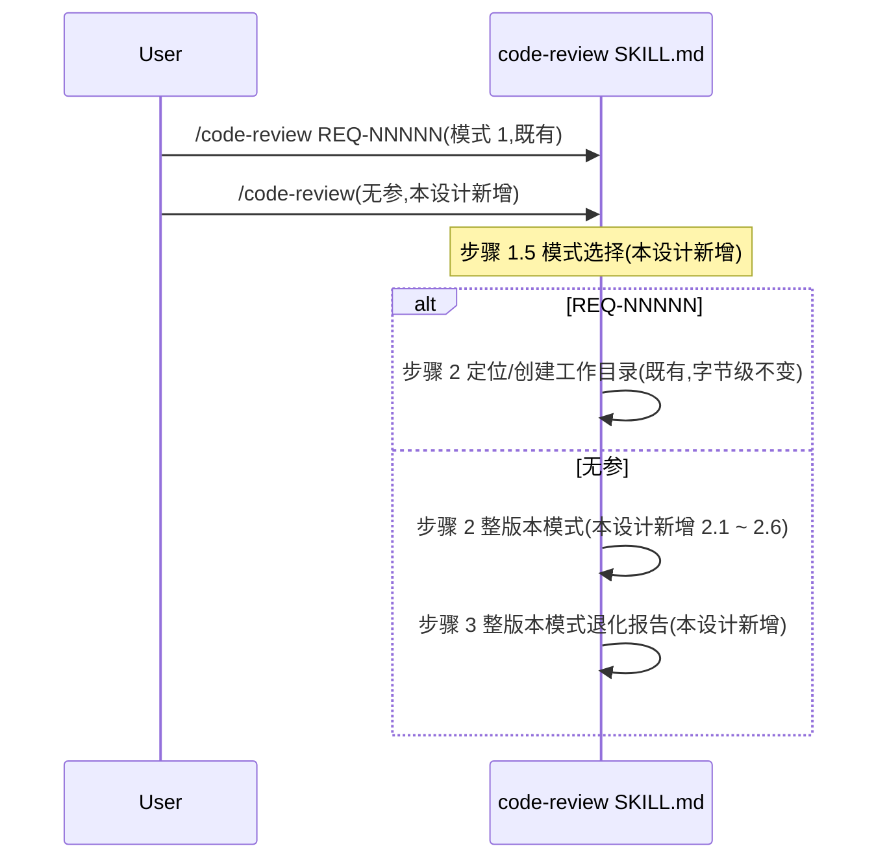

# 模块详细化 — REQ-00008
更新时间:2026-06-05 16:00
版本:V0.0.2
需求编码:REQ-00008

---

## 模块 M-1:`plugins/code-skills/skills/code-review/SKILL.md`(本设计唯一修改点)

### 路径
- `plugins/code-skills/skills/code-review/SKILL.md`(既有,本次**修改**)
- 字节级原则:**不**改 frontmatter(L1-3)/ **不**改既有 1-15 步骤字面(L106-110 / L111-114 / L308-313)

### 关键"组件"(SKILL.md 的"伪代码"视角)

| 组件 | 形式 | 职责 | 对应任务 | 字节级原则 |
| --- | --- | --- | --- | --- |
| frontmatter | YAML | 技能元信息 | T-001 | 字节级不变(INV-4) |
| 既有 §"## 工作目录约定" | 段落 | 版本工作空间约定 | (既有) | 字节级不变(INV-1) |
| 既有 §"## 工作流程" | 段落 | 步骤 0-15 | (既有) | 字节级不变(INV-1) |
| **新增 §"步骤 1.5 模式选择"** | 段落 | 无参 / REQ-NNNNN / 无效参 三态机 | **T-001** | **新增** |
| **新增 §"步骤 2 整版本模式"** | 段落 | 整版本模式 6 个子步骤(2.1 ~ 2.6) | **T-001** | **新增** |
| **新增 §"步骤 3 整版本模式退化报告"** | 段落 | E-3 退化 + 退出 | **T-001** | **新增** |
| 既有 §"## 工作流程 / ### 步骤 15 — 汇报" | 段落 | 既有汇报 | (既有) | 字节级不变(INV-12) |
| **新增 §"## 整版本模式 — 评审范围与适用场景"** | 段落附录 | 整版本模式完整说明 | **T-001** | **新增**(锚点 B 之后) |

### 调用顺序(SKILL.md 调用方视角)

### 状态归属

- **整版本模式无新内存状态**(沿用 NFR-1 强约束:不引入内存状态)
- 整版本模式**不**重写模式 1 既有状态
- 整版本模式的所有状态(过滤结果 / 循环计数 / 派生任务列表)由 LLM 现场维护,**不**持久化

### 与概要设计的对应

- 概要设计 §10.1 SKILL.md 增量追加边界 → 本模块 §"关键组件" + §"调用顺序"
- 概要设计 §6 整版本模式状态机 → 本模块 §"调用顺序" + §"状态归属"
- 概要设计 DQ-1 ~ DQ-6 → 本模块 §"字节级原则"

### 符合的规范

- `skill-conventions.md §规则 1`:frontmatter 必含 `name` + `description`;既有已合规,本设计**不**改(INV-4)
- `module-conventions.md §规则 1`:SKILL.md 放技能根目录(不放在 templates/ 等子目录);既有已合规,本设计**不**改
- `encoding-conventions.md §规则 1-4`:任务编码双格式;派生任务编码沿用 `code-plan` 既有规则
- 概要设计 NFR-1(零新增依赖)+ NFR-2(增量修改 SKILL.md)

### 模块自检

- ✅ frontmatter 字节级不变(INV-4)
- ✅ 既有步骤 0-15 字面字节级不变(INV-1 + INV-11 + INV-12)
- ✅ 既有 4 模板字节级不变(INV-13)
- ✅ 仅 1 个文件修改
- ✅ 仅 2 段新增(锚点 A + 锚点 B)
- ✅ 字节级原则全部满足
- ✅ 0 偏离 / 0 冲突
