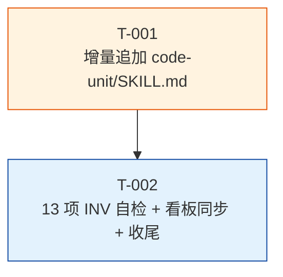

# PLAN.md — REQ-00009 详细计划:`/code-unit` 守卫"项目可测性"

- 需求编码:`REQ-00009`
- 所属版本:`V0.0.2`
- 上游需求:`./assistants/V0.0.2/require/REQ-00009/RESULT.md`(v1,已锁定,7 FR / 8 NFR / ~25 AC)
- 上游概要设计:`./assistants/V0.0.2/design/REQ-00009/RESULT.md`(v1,已锁定)
- 详细设计:`./assistants/V0.0.2/plan/REQ-00009/RESULT.md`(v1,本目录)
- 计划版本:v1
- 创建:2026-06-05
- 最近更新:2026-06-05 17:20
- 责任人:wangmiao

---

## 1. 计划概述

本计划根据详细设计把"代码怎么写"拆分为 **2 个可独立执行的任务**(T-001 SKILL.md 修改 + T-002 收尾自检),每个任务有:
- **明确的目标 / 涉及文件 / 关键变更 / 边界与异常 / 验证手段 / 回退方式**
- **双状态字段**:开发状态(初始=`待开始`)+ 测试状态(初始=`不适用`,因本需求纯文档型)
- **触发/来源**:`详细设计`(100% 沿用 REQ-00017 强约束,无"更新看板"派生任务)
- **唯一编号**:`TASK-REQ-00009-NNNNN`(沿用 `encoding-conventions §规则 1+3` 5+5 位嵌套式)

**首次**应用 REQ-00014 新规则"按功能点拆分":1 个任务 = 1 个完整功能点(SKILL.md 增量改写 / 自检收尾,各自独立);**首次**应用 REQ-00017 新规则"不拆更新看板任务":看板推进由 `code-it` 末尾兜底 P-1 小步承担,**0**"更新看板"派生任务。

## 2. 任务总览

| 任务编号 | 类型 | 触发/来源 | 标题 | 开发状态 | 测试状态 | 涉及文件 | 完成时间 | 提交哈希 | 关联任务 |
| --- | --- | --- | --- | --- | --- | --- | --- | --- | --- |
| `TASK-REQ-00009-00001` | 修改 | 详细设计 | [修改] 增量追加 `code-unit/SKILL.md`(2 段:锚点 A 步骤 0 前插"步骤 0a 项目可测性检查" — 5 子节齐全 + 锚点 B 既有边界 E-1 后插"E-2 守卫不通过" + 既有边界 E-7 后插"E-8 守卫检查项扩展预留";7 项检查清单;INV-1/2/3/4/5/6 字节级保留;frontmatter 字节级保留) | 待开始 | 不适用 | `plugins/code-skills/skills/code-unit/SKILL.md`(+25 ~ +50 行) | — | — | — |
| `TASK-REQ-00009-00002` | 文档 | 详细设计 | [文档] 13 项不变量自检(INV-1~13) + 偏差日志 + 看板同步 + 收尾 | 待开始 | 不适用 | `assistants/V0.0.2/RESULT.md` + `code/TASK-REQ-00009-00002/{RESULT,work-log,deviations}.md` | — | — | T-001 |

**统计**:
- 总任务数:**2**
- 开发完成:0 / 2
- 测试通过:0 / 2(纯文档型,测试状态全部 = `不适用`)
- 真正可发布数(开发=已完成 ∧ 测试∈{已运行-通过, 不适用}):**0 / 2**(开发均未开始)
- 任务编号:5+5 位嵌套式,严格遵循 `encoding-conventions §规则 1+3`

## 3. 任务详情

### 3.1 TASK-REQ-00009-00001 — [修改] 增量追加 `code-unit/SKILL.md`

#### 3.1.1 目标
在 `plugins/code-skills/skills/code-unit/SKILL.md` 增量追加"步骤 0a 项目可测性检查"守卫(5 子节齐全),新增 E-2 / E-8 边界场景,字节级保留 frontmatter + 既有 17 章节。

#### 3.1.2 涉及文件
- `plugins/code-skills/skills/code-unit/SKILL.md`(修改,1 个文件,预估净增 ~30 行)

#### 3.1.3 关键变更(语义化定位)

| 锚点 | 位置 | 变更类型 | 变更内容 |
| --- | --- | --- | --- |
| 锚点 A | `code-unit/SKILL.md §工作流程` 区段下,在 `### 步骤 0 — 版本上下文检测` 子节**之前** | **新增** | "### 步骤 0a 项目可测性检查"主标题 + 5 子节(`#### 步骤 0a.1 守卫检查项清单` / `#### 步骤 0a.2 守卫判定逻辑` / `#### 步骤 0a.3 守卫不通过 → 跳过流程` / `#### 步骤 0a.4 屏幕报告格式` / `#### 步骤 0a.5 退出码契约`) |
| 锚点 B | `code-unit/SKILL.md §工作流程` 区段下,既有"边界 E-1" 后(E-3~E-7 之后) | **新增** | "#### E-2 守卫不通过"边界场景(FR-2 跳过 + 看板"不适用" + exit 0) |
| 锚点 C | `code-unit/SKILL.md §工作流程` 区段下,既有"边界 E-7" 之后 | **新增** | "#### E-8 守卫检查项扩展预留"边界场景(v2 增量追加,本需求不实现) |

#### 3.1.4 守卫 7 项检查清单(对应 FR-1.AC-1.2,Q-1 锁定 A)

| 序号 | 文件/目录 | 类型 | 验证 |
| --- | --- | --- | --- |
| 1 | `package.json` | Node.js / 前端 | 需含 `scripts.test`(Glob + Read 验证) |
| 2 | `pyproject.toml` | Python | 需含测试配置如 `[tool.pytest]`(Glob + Read 验证) |
| 3 | `Cargo.toml` | Rust | 存在即视为可测(Glob) |
| 4 | `go.mod` | Go | 存在即视为可测(Glob) |
| 5 | `pom.xml` | Java(Maven) | 存在即视为可测(Glob) |
| 6 | `build.gradle` / `build.gradle.kts` | Java(Gradle) / Android | 任一存在即视为可测(Glob) |
| 7 | `test/` 目录 | 通用 | 存在即视为有测试结构(Glob) |

**判定逻辑**:命中任一 → 守卫通过;全部不命中 → 守卫不通过。

#### 3.1.5 边界与异常(本任务)

| 场景 | 处理 |
| --- | --- |
| 守卫不通过(不可测) | 跳过 + 写看板"不适用" + exit 0(FR-2) |
| 守卫通过(可测) | 走原"步骤 0"+ 既有单测流程(FR-4 不变) |
| `package.json` 存在但无 `scripts.test` | 视为该项不命中,继续检查下一项 |
| `pyproject.toml` 存在但无测试配置 | 视为该项不命中,继续检查下一项 |
| 既有 E-1~E-7 边界 | 字节级保留,不修改 |
| 任务编码不存在 / 无 `.current-version` | 原 `code-unit` 行为,不变 |

#### 3.1.6 验证手段
- **静态自检(6 项)**:
  1. frontmatter 字节级保留(`name: code-unit` + `description` ~600 字符 完整)
  2. 步骤 0a 5 子节齐全(`#### 步骤 0a.1` ~ `#### 步骤 0a.5` 全部存在)
  3. 7 项检查清单完整(`package.json` / `pyproject.toml` / `Cargo.toml` / `go.mod` / `pom.xml` / `build.gradle`(.kts) / `test/` 目录)
  4. E-2 边界新增 + E-1/E-3~E-7 字节级保留
  5. E-8 边界新增(预留)
  6. SKILL.md 行数偏差 ≤ ±20%(既有 453 行 + 新增 ~30 行 = ~483 行)

- **8 个关键 token 必须存在**:`步骤 0a` / `守卫` / `不适用` / `Q-1` / `Q-2` / `Q-3` / `NFR-6` / `NFR-7`

- **既有不变量必须保留**(13 项 INV 详细列表见 `plan/REQ-00009/RESULT.md §10`)

#### 3.1.7 回退方式
- `git revert <commit-hash>` 回退本任务的 1 个 commit
- 回退后:`code-unit` 恢复原行为(无守卫),看板/规范/其他 11 个 `code-*` 技能均不受影响

#### 3.1.8 前置任务
- **无**(本任务是 REQ-00009 计划的 T-001,首任务)

#### 3.1.9 估算
- ~1.5 小时(纯文档型)
- `code-it` 静态自检 6/6 通过

### 3.2 TASK-REQ-00009-00002 — [文档] 13 项不变量自检 + 看板同步 + 收尾

#### 3.2.1 目标
对 REQ-00009 整体做 13 项不变量自检(INV-1~13),同步版本看板 5 处(任务清单 2 行 + 里程碑 0 个 + 文档头 + 详细设计汇总 + 变更记录),收集 0 偏离,完成整体收尾。

#### 3.2.2 涉及文件
- `assistants/V0.0.2/RESULT.md`(修改,1 个文件)
- `code/TASK-REQ-00009-00002/RESULT.md`(新建,整体收尾总结)
- `code/TASK-REQ-00009-00002/work-log.md`(新建,过程记录)
- `code/TASK-REQ-00009-00002/deviations.md`(新建,0 偏离 + 关键决策)

#### 3.2.3 关键变更(语义化定位)

| 锚点 | 位置 | 变更类型 | 变更内容 |
| --- | --- | --- | --- |
| 看板文档头 | `assistants/V0.0.2/RESULT.md` 文档头 | **修改** | "最近更新"时间戳推进 |
| 看板详细设计汇总 | `assistants/V0.0.2/RESULT.md §详细设计与任务计划汇总` 区段 | **修改** | REQ-00009 行状态=已完成(详细设计) + 任务总数 = 2 + 开发完成 0/2 + 测试通过 0/2 |
| 看板任务清单 | `assistants/V0.0.2/RESULT.md §任务清单` 区段 | **追加** | T-001 + T-002 2 行(完整字段) |
| 看板里程碑 | `assistants/V0.0.2/RESULT.md §里程碑` 区段 | **不追加** | 本需求不引入新里程碑(沿用 REQ-00009 既有 0 个) |
| 看板变更记录 | `assistants/V0.0.2/RESULT.md §变更记录` 区段 | **追加** | 1 条 "T-002 完成 + 整体收尾" 记录 |

#### 3.2.4 13 项不变量自检清单(INV-1~13)

| 编号 | 检查项 | 验证 |
| --- | --- | --- |
| **INV-1** | SKILL.md 存在 + frontmatter 字节级保留 | `head -3 SKILL.md` 应输出完整 frontmatter |
| **INV-2** | 步骤 0a 5 子节齐全 + 7 项检查清单 | `grep -c "^#### 步骤 0a\."` 应 ≥ 5;7 项检查名应全部存在 |
| **INV-3** | 既有 17 章节字节级保留(除"步骤 0"前插入"步骤 0a"外) | `git diff SKILL.md` 应只有 + 净增,无既有行修改 |
| **INV-4** | 既有 E-1/E-3~E-7 边界字节级保留 | `grep -nE "^#### E-[1-7]"` 应全部存在 |
| **INV-5** | 新增 E-2 边界 | `grep -nE "^#### E-2 "` 应有 1 命中 |
| **INV-6** | 新增 E-8 边界 | `grep -nE "^#### E-8 "` 应有 1 命中 |
| **INV-7** | SKILL.md 行数偏差 ≤ ±20% | `wc -l SKILL.md` 应 ∈ [362, 543] |
| **INV-8** | 8 个关键 token 全部存在 | `grep -c "<token>"` 应 ≥ 1,共 8 个 |
| **INV-9** | 其他 11 个 `code-*` SKILL.md 字节级不变 | `git diff --stat <其他 11 个 SKILL.md>` 应为空 |
| **INV-10** | `marketplace.json` / `plugin.json` 字节级不变 | `git diff --stat` 应为空 |
| **INV-11** | `assistants/rules/` 13 文件字节级不变 | `git diff --stat` 应为空 |
| **INV-12** | 看板"测试状态"列不新增枚举值 | `git diff` 应只有"任务清单 2 行"追加 |
| **INV-13** | 整体收尾:2 任务开发状态 = 已完成 + 测试状态 = 不适用 | 本任务完成后,看板"任务清单"2 行开发状态更新 |

#### 3.2.5 边界与异常

| 场景 | 处理 |
| --- | --- |
| 13/13 INV 通过 | 整体收尾,M-2 里程碑达成 |
| 任一 INV 失败 | 记录到 `deviations.md`,视情况追加"修改类"任务 |
| 看板 5 处同步遗漏 | 立即补同步,不留半成品 |

#### 3.2.6 验证手段
- **静态自检 13 项**(`code/TASK-REQ-00009-00002/{RESULT,work-log,deviations}.md` 中详细记录)
- 看板 5 处一致性自检(`git diff assistants/V0.0.2/RESULT.md` 应只追加 + 改字段,无既有行删除)

#### 3.2.7 回退方式
- `git revert <commit-hash>` 回退本任务的 1 个 commit
- 回退后:看板恢复原状态(REQ-00009 2 任务行 + 详细设计汇总行),其他需求不受影响

#### 3.2.8 前置任务
- **T-001** 必须"开发状态=已完成"

#### 3.2.9 估算
- ~1 小时(纯文档型 + 静态自检)
- `code-it` 13/13 INV 通过

## 4. 任务依赖图

**说明**:
- T-002 依赖 T-001 完成(无 T-001 成果,无法做 13 项 INV 自检)
- T-001 / T-002 都属于"功能点",**0** 架构任务
- **0**"更新看板"派生任务(沿用 REQ-00017 强约束,看板推进由 `code-it` 末尾兜底 P-1 承担)

## 5. 里程碑

| 里程碑 | 包含任务 | 完成定义 | 状态 | 计划时间 | 实际完成 |
| --- | --- | --- | --- | --- | --- |
| M1-REQ-00009-1:文档就绪 | T-001 | SKILL.md 增量追加完成(2 段锚点 A + B + C)+ 静态自检 6/6 通过 + 13/13 INV 6 字节级保留 | 待开始 | 2026-06-05 | — |
| M1-REQ-00009-2:本需求可发布 | M1 + T-002 | **2 任务开发状态=已完成 且 测试状态=不适用**,13/13 INV 100% 通过 + 看板 5 处一致 + `code-unit` 守卫可触发(未来调 `code-auto` 跑一个不可测项目验证) | 待开始 | 2026-06-05 | — |

> 完成定义显式列出两轴状态要求,避免把"开发完成"误当"可发布"。

## 6. 状态管理规则(本计划)

- **开发状态**:`待开始` / `进行中` / `已完成` / `已取消` / `阻塞` / `待重新评估`(沿用 V0.0.1 模板)
- **测试状态**:`未编写` / `已编写` / `已运行-通过` / `已运行-失败` / `不适用` / `阻塞`(沿用 V0.0.1 模板)
- **本计划 2 任务全部测试状态 = `不适用`**(Q-P3 锁定 A,纯文档型)
- **任务"真正可发布" = 开发状态=已完成 ∧ 测试状态∈{已运行-通过, 不适用}** → 2 任务"测试=不适用"满足"可发布"双轴
- **状态推进**:`code-it` 完成 T-001 → 推进"开发状态"为"已完成";T-002 同

## 7. 关联计划(横向参考)

| 关联需求 | 关联点 | 对本计划的影响 |
| --- | --- | --- |
| **REQ-00005** | 步骤 0a 命名模式 | 沿用"步骤 0a"在步骤 0 之前的命名 |
| **REQ-00010** | 步骤 0a 模式 | 同位叠加,**0** 冲突 |
| **REQ-00014** | 任务拆分维度 | 100% 沿用"按功能点拆分";0 架构任务(不满足 3 触发) |
| **REQ-00017** | 拆任务约束 | 100% 沿用"不拆更新看板任务";看板推进由 `code-it` P-1 承担 |

## 8. 变更记录

| 时间 | 版本 | 变更摘要 | 变更人 |
| --- | --- | --- | --- |
| 2026-06-05 17:20 | v1 | 初始创建:2 任务(T-001 `[修改]` + T-002 `[文档]`);严格遵循 `encoding-conventions §规则 1+3` 5+5 位嵌套式;2 里程碑(M-1 文档就绪 / M-2 本需求可发布);T-002 依赖 T-001;**首次**应用 REQ-00014 新规则"按功能点拆分"100% 沿用;**首次**应用 REQ-00017 新规则"不拆更新看板任务"100% 沿用;**0** 架构任务触发;2 任务测试状态全 `不适用`(Q-P3 锁定 A,纯文档型);13 项 INV-1~13 在 T-002 实施 | wangmiao |
