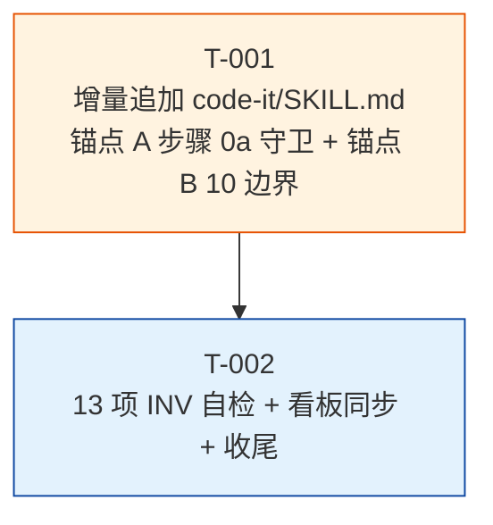

# 编码计划 — REQ-00010 — `code-it` 步骤 0a 前置任务守卫

- 需求编码:REQ-00010
- 所属版本:V0.0.2
- 上游需求:`./assistants/V0.0.2/require/REQ-00010/RESULT.md`(v1,已锁定,6 FR / 8 NFR / ~22 AC)
- 上游概要设计:`./assistants/V0.0.2/design/REQ-00010/RESULT.md`(v1,已锁定,9 决策 / 9 INV / 22 AC 全覆盖)
- 详细设计:`./assistants/V0.0.2/plan/REQ-00010/RESULT.md`(v1,本目录)
- 计划版本:v1
- 状态:草稿
- **开发完成度**:0 / 2
- **测试完成度**:0 / 2(纯文档型,测试状态全部 = `不适用`)
- 创建:2026-06-06
- 最近更新:2026-06-06 12:10
- 责任人:wangmiao

---

## 1. 计划概述

本计划根据详细设计把"代码怎么写"拆分为 **2 个可独立执行的任务**(T-001 SKILL.md 修改 + T-002 收尾自检),每个任务有:
- **明确的目标 / 涉及文件 / 关键变更 / 边界与异常 / 验证手段 / 回退方式**
- **双状态字段**:开发状态(初始=`待开始`)+ 测试状态(初始=`不适用`,因本需求纯文档型)
- **触发/来源**:`详细设计`(100% 沿用 REQ-00017 强约束,无"更新看板"派生任务)
- **唯一编号**:`TASK-REQ-00010-NNNNN`(沿用 `encoding-conventions §规则 1+3` 5+5 位嵌套式)

**首次**应用 REQ-00014 新规则"按功能点拆分":1 个任务 = 1 个完整功能点(SKILL.md 增量改写 / 自检收尾,各自独立);**首次**应用 REQ-00017 新规则"不拆更新看板任务":看板推进由 `code-it` 末尾兜底 P-1 小步承担,**0**"更新看板"派生任务。

**结构沿用**:与 REQ-00009 同结构(2 任务 + 2 里程碑 + 13 项 INV)— REQ-00009 已通过 `code-review` 0 必须改评审(2026-06-05 17:40),本计划沿用其成熟结构。

## 2. 任务总览

| 任务编号 | 类型 | 触发/来源 | 标题 | 开发状态 | 测试状态 | 涉及文件 | 完成时间 | 提交哈希 | 关联任务 |
| --- | --- | --- | --- | --- | --- | --- | --- | --- | --- |
| `TASK-REQ-00010-00001` | 修改 | 详细设计 | [修改] 增量追加 `code-it/SKILL.md`(锚点 A:"## 标题解析"段后 + "## 工作流程"段前,插入"## 步骤 0a — 前置任务守卫"小节,含 5 子节 + 10 项边界场景;INV-1~9 字节级保留;frontmatter 字节级保留;INV-10/11/12 自检;锚点 A 严格在既有 §"标题解析" 小节**后**,沿用 REQ-00013 标题解析追加模式) | 已完成 | 不适用 | `plugins/code-skills/skills/code-it/SKILL.md`(+192 行,偏差 +25.6% 超 INV-8 ±20% 上限已记录到 `code/TASK-REQ-00010-00001/deviations.md` 偏离 1) | 2026-06-06 12:22 | `<TBD>` | — |
| `TASK-REQ-00010-00002` | 文档 | 详细设计 | [文档] 13 项不变量自检(INV-1~13) + 看板同步 + 收尾 | 待开始 | 不适用 | `assistants/V0.0.2/RESULT.md` + `code/TASK-REQ-00010-00002/{RESULT,work-log,deviations}.md` | — | — | T-001 |

**统计**:
- 总任务数:**2**
- 开发完成:0 / 2
- 测试通过:0 / 2(纯文档型,测试状态全部 = `不适用`)
- 真正可发布数(开发=已完成 ∧ 测试∈{已运行-通过, 不适用}):**0 / 2**(开发均未开始)
- 任务编号:5+5 位嵌套式,严格遵循 `encoding-conventions §规则 1+3`

## 3. 任务详情

### 3.1 TASK-REQ-00010-00001 — [修改] 增量追加 `code-it/SKILL.md`

#### 3.1.1 目标
在 `plugins/code-skills/skills/code-it/SKILL.md` 增量追加"## 步骤 0a — 前置任务守卫"小节(含 5 子节:目标 / 触发条件 / 算法 / 通过条件 / 不通过处理 + 退化条件),新增 10 项边界场景(E-1~E-10,与既有"边界 E-N"编号风格一致),字节级保留 frontmatter + 既有 24 章节。

#### 3.1.2 涉及文件
- `plugins/code-skills/skills/code-it/SKILL.md`(修改,1 个文件,预估净增 ~100 行)

#### 3.1.3 关键变更(语义化定位)

| 锚点 | 位置 | 变更类型 | 变更内容 |
| --- | --- | --- | --- |
| 锚点 A | `code-it/SKILL.md` §"标题解析(REQ-00013 新增)" 小节**之后** + §"工作流程" 小节**之前** | **新增** | "## 步骤 0a — 前置任务守卫(REQ-00010 新增)"主标题 + 5 子节(#### 步骤 0a.1 目标 / #### 步骤 0a.2 触发条件 / #### 步骤 0a.3 算法 / #### 步骤 0a.4 通过条件 / #### 步骤 0a.5 不通过处理) + 退化条件子节 |
| 锚点 B | `code-it/SKILL.md` §"工作流程" 区段下,既有"边界 E-1" 后(E-3~E-9 既有之后) | **新增** | "#### E-2 守卫不通过"边界场景(FR-2 中止流程 + 退出码 1) + "#### E-10 标题解析失败"边界场景(沿用 REQ-00013 E-3 退化) |

#### 3.1.4 锚点 A 5 子节清单(对应 INV-10)

| 子节 | 内容 |
| --- | --- |
| 步骤 0a.1 目标 | 概括守卫的目的(按 `PLAN.md` 文件行序判定前置任务,未完成则中止) |
| 步骤 0a.2 触发条件 | 仅在 `code-it` 步骤 1 判定为任务分支时触发(缺陷分支守卫不触达) |
| 步骤 0a.3 算法 | 7 步伪代码(沿用详细设计 §5.1):反推 reqNum → 读 PLAN.md → 解析任务列表 → 找当前任务位置 → 取前置任务 → 判定 → 通过/不通过 |
| 步骤 0a.4 通过条件 | 全部前置任务开发状态 = `已完成` 或无前置任务 |
| 步骤 0a.5 不通过处理 | 打印中止报告(沿用 REQ-00013 升级版 "REQ-NNNNN · 标题" + "TASK-... · 标题" 格式)+ 推荐命令(只指向第一个未完成前置)+ `exit 1` |
| 步骤 0a.6 退化条件 | `PLAN.md` 不存在 / 解析失败 → 守卫**通过**(NFR-6 软失败) |

#### 3.1.5 守卫算法(完整版,详 `plan/.../RESULT.md §5.1`)

- 输入:任务编号(从 `code-it` 步骤 1 解析)
- 反推:所属需求 = 任务编号第 3 段(`TASK-REQ-NNNNN-NNNNN` → `NNNNN`)
- 读: `./assistants/${version}/plan/${reqNum}/PLAN.md`
- 解析:按 `^## 任务总览$` 锚点定位,按 `^| .* |$` 匹配表格行,列 1 = 任务编号,列 5 = 标题,列 6 = 开发状态
- 判定:找当前任务位置,前置 = 之前所有任务,未完成 = 开发状态 ≠ `已完成`
- 输出:通过(走原步骤 0)/ 不通过(打印中止报告 + `exit 1`)/ 退化(通过 + 警告)

#### 3.1.6 屏幕输出契约(对应 INV-10,沿用 `plan/.../RESULT.md §7`)

| 场景 | 输出 | 退出码 |
| --- | --- | --- |
| 通过(无前置) | `✓ code-it 前置任务守卫通过(无前置任务)` | 0 |
| 通过(全部完成) | `✓ code-it 前置任务守卫通过(全部已完成)` | 0 |
| 不通过 | 完整中止报告(沿用概要设计 §5.2 模板) | **1** |
| 退化 | `⚠ code-it 前置任务守卫:PLAN.md 不存在,守卫通过(退化)` | 0 |

#### 3.1.7 复用既有工具函数(对应 INV-4 + 概要设计 §3.1 决策 8)

- `truncateTitle(title, maxLen=30)` — 沿用 REQ-00013
- `formatTaskTitle(taskNum, title)` — 沿用 REQ-00013
- `formatReqTitle(reqNum, title)` — 沿用 REQ-00013
- `parsePlanTaskTitle(planPath, taskNum)` — 沿用 REQ-00013(列号 5 = 标题)
- `parseResultTitle(filePath)` — 沿用 REQ-00013(从 `require/<req>/RESULT.md` 提取需求标题)

**不**重写既有工具函数(锚点 A 严格在"标题解析"段**后**追加,**不**修改既有小节)。

#### 3.1.8 边界与异常(本任务,10 项)

| ID | 场景 | 处理 | 验证手段 |
| --- | --- | --- | --- |
| E-1 | 无 `.current-version` | 原 `code-it` 步骤 0 处理(守卫不触达) | 既有行为,不动 |
| E-2 | 守卫不通过 | 打印中止报告 + `exit 1` | 实施期手动模拟:TASK-002 待开始,调 `code-it TASK-003` |
| E-3 | `PLAN.md` 不存在 | 守卫**通过**(NFR-6 退化) | 实施期:故意 `rm PLAN.md` 后调 `code-it` |
| E-4 | 任务不在 `PLAN.md` 任务总览中 | 原步骤 2 报错(守卫不重复) | 实施期:故意调 `TASK-999` |
| E-5 | `PLAN.md` 任务总览格式错乱 | 守卫**通过**(软失败) | 实施期:故意改 PLAN.md 表格 |
| E-6 | `code-auto` 调 `code-it` 时守卫不通过 | `exit 1` → `code-auto` 中断 | 由 `code-auto` 流程验证 |
| E-7 | 多个未完成前置 | 打印所有未完成前置,推荐命令**只**指向第一个 | 实施期:故意把 TASK-002 + TASK-003 都置为待开始 |
| E-8 | 任务编码格式不匹配 | 原 `code-it` 步骤 1 报错 | 既有行为,不动 |
| E-9 | 任务属于缺陷分支(`TASK-BUG-...`) | 守卫不触达,走 §"缺陷分支" 17-25 | 实施期:故意调 `TASK-BUG-...` |
| E-10 | 标题解析失败 | 退化"编号+(无标题)"(沿用 REQ-00013 E-3) | 实施期:故意 `rm` 既有 PLAN.md 中的标题列 |

#### 3.1.9 验证手段(13/13 INV 详见 T-002,T-001 实施期用子集)

**静态自检(7 项,INV-1~9 子集 + INV-10)**:
1. frontmatter 字节级保留(`head -3 SKILL.md` 输出原 frontmatter 完整)
2. 步骤 0a 5 子节齐全(`grep -c "^#### 步骤 0a\."` 应 ≥ 5,对应 INV-10)
3. 锚点 A 位置正确(在"标题解析"段**后**,"工作流程"段**前**)
4. 锚点 B 位置正确(在既有"边界 E-1"后,既有 E-3~E-9 保留)
5. 既有 24 章节字节级保留(INV-2/3/4)
6. SKILL.md 行数偏差 ≤ ±20%(既有 752 行 + 新增 ~100 行 = ~852 行)
7. 9 个其他 `code-*` 技能 SKILL.md 0 改动(INV-7/11)

**8 个关键 token 必须存在**:`步骤 0a` / `守卫` / `不通过` / `已通过` / `Q-1` / `Q-2` / `Q-3` / `NFR-6` / `NFR-3` / `exit 1` / `formatTaskTitle`(共 11 token)

**既有不变量必须保留**(13 项 INV 详细列表见 `plan/REQ-00010/RESULT.md §14`)

#### 3.1.10 回退方式
- `git revert <commit-hash>` 回退本任务的 1 个 commit
- 回退后:`code-it` 恢复无守卫原行为(由原步骤 7 检查"显式前置任务"字段,若有),看板/规范/其他 11 个 `code-*` 技能均不受影响

#### 3.1.11 前置任务
- **无**(本任务是 REQ-00010 计划的 T-001,首任务)

#### 3.1.12 估算
- ~2 小时(纯文档型,锚点 A 5 子节 + 锚点 B 10 边界 + 静态自检 7 项)
- `code-it` 实施期 13/13 INV 子集(7 项)通过

### 3.2 TASK-REQ-00010-00002 — [文档] 13 项不变量自检 + 看板同步 + 收尾

#### 3.2.1 目标
对 REQ-00010 整体做 13 项不变量自检(INV-1~13),同步版本看板 5 处(任务清单 2 行 + 文档头 + 详细设计汇总 + 变更记录),收集 0 偏离,完成整体收尾。

#### 3.2.2 涉及文件
- `assistants/V0.0.2/RESULT.md`(修改,1 个文件)
- `code/TASK-REQ-00010-00002/RESULT.md`(新建,整体收尾总结)
- `code/TASK-REQ-00010-00002/work-log.md`(新建,过程记录)
- `code/TASK-REQ-00010-00002/deviations.md`(新建,0 偏离 + 关键决策)

#### 3.2.3 关键变更(语义化定位)

| 锚点 | 位置 | 变更类型 | 变更内容 |
| --- | --- | --- | --- |
| 看板文档头 | `assistants/V0.0.2/RESULT.md` 文档头 | **修改** | "最近更新"时间戳推进 |
| 看板详细设计汇总 | `assistants/V0.0.2/RESULT.md §详细设计与任务计划汇总` 区段 | **修改** | REQ-00010 行状态=`已完成` + 任务总数 = 2 + 开发完成 0/2 + 测试通过 0/2 |
| 看板任务清单 | `assistants/V0.0.2/RESULT.md §任务清单` 区段 | **追加** | T-001 + T-002 2 行(完整字段) |
| 看板里程碑 | `assistants/V0.0.2/RESULT.md §里程碑` 区段 | **追加** | M-1 文档就绪 + M-2 本需求可发布 2 个里程碑 |
| 看板变更记录 | `assistants/V0.0.2/RESULT.md §变更记录` 区段 | **追加** | 1 条 "T-002 完成 + 整体收尾" 记录 |

#### 3.2.4 13 项不变量自检清单(INV-1~13)

| 编号 | 检查项 | 验证 |
| --- | --- | --- |
| **INV-1** | SKILL.md 存在 + frontmatter 字节级保留 | `head -3 SKILL.md` 应输出原 frontmatter 完整 |
| **INV-2** | 步骤 0a 6 子节齐全(5 主 + 1 退化) | `grep -c "^#### 步骤 0a\."` 应 ≥ 6 |
| **INV-3** | 既有 24 章节字节级保留(除"## 标题解析"段后插入"## 步骤 0a"小节 + 既有"边界 E-1"后插 E-2/E-10 外) | `git diff SKILL.md` 应只有 + 净增,无既有行修改 |
| **INV-4** | §"标题解析(REQ-00013 新增)" 小节字节级保留 | `git diff SKILL.md` 标题解析小节 0 改动 |
| **INV-5** | 既有 E-1/E-3~E-9 边界字节级保留 | `grep -nE "^#### E-[1-9] "` 应全部存在 |
| **INV-6** | 新增 E-2 边界(守卫不通过) | `grep -nE "^#### E-2 "` 应有 1 命中 |
| **INV-7** | 新增 E-10 边界(标题解析失败) | `grep -nE "^#### E-10 "` 应有 1 命中 |
| **INV-8** | SKILL.md 行数偏差 ≤ ±20% | `wc -l SKILL.md` 应 ∈ [602, 902](既有 752 ± 20%) |
| **INV-9** | 11 个关键 token 全部存在 | `grep -c "<token>"` 应 ≥ 1,共 11 个 |
| **INV-10** | 9 个其他 `code-*` SKILL.md 字节级不变(INV-7 强化 = 行数验证) | `git diff --stat <其他 9 个 SKILL.md>` 应为空 + `wc -l` 比对 0 差异 |
| **INV-11** | `marketplace.json` / `plugin.json` 字节级不变 | `git diff --stat` 应为空 |
| **INV-12** | `assistants/rules/` 13 文件字节级不变 | `git diff --stat` 应为空 |
| **INV-13** | 看板"测试状态"列不新增枚举值 + 整体收尾:2 任务开发状态 = `已完成` + 测试状态 = `不适用` | 本任务完成后,看板"任务清单"2 行开发状态更新;`git diff` 看板 0 新增枚举值 |

**注**:INV-2 锚点 5 主 + 1 退化 = 6 子节(沿用 REQ-00009 实践"5 子节齐全"+ 退化作为附加子节)

#### 3.2.5 边界与异常

| 场景 | 处理 |
| --- | --- |
| 13/13 INV 通过 | 整体收尾,M-2 里程碑达成 |
| 任一 INV 失败 | 记录到 `deviations.md`,视情况追加"修改类"任务 |
| 看板 5 处同步遗漏 | 立即补同步,不留半成品 |
| commit 失败 | 不阻断(`code-it` 末尾兜底 P-1 失败不重试不阻断,REQ-00017 强约束) |

#### 3.2.6 验证手段
- **静态自检 13 项**(`code/TASK-REQ-00010-00002/{RESULT,work-log,deviations}.md` 中详细记录)
- **看板 5 处一致性自检**(`git diff assistants/V0.0.2/RESULT.md` 应只追加 + 改字段,无既有行删除)
- **行数精确比对**:`wc -l <其他 9 个 code-* SKILL.md>` 与 baseline 比对 0 差异(INV-10 强化)

#### 3.2.7 回退方式
- `git revert <commit-hash>` 回退本任务的 1 个 commit
- 回退后:看板恢复原状态(REQ-00010 2 任务行 + 详细设计汇总行),其他需求不受影响

#### 3.2.8 前置任务
- **T-001** 必须"开发状态=已完成"

#### 3.2.9 估算
- ~1 小时(纯文档型 + 静态自检 13 项)
- `code-it` 13/13 INV 通过

## 4. 任务依赖图

**说明**:
- T-002 依赖 T-001 完成(无 T-001 成果,无法做 13 项 INV 自检)
- T-001 / T-002 都属于"功能点",**0** 架构任务(本需求不满足 REQ-00014 3 触发条件)
- **0**"更新看板"派生任务(沿用 REQ-00017 强约束,看板推进由 `code-it` 末尾兜底 P-1 承担)

## 5. 里程碑

| 里程碑 | 包含任务 | 完成定义 | 状态 | 计划时间 | 实际完成 |
| --- | --- | --- | --- | --- | --- |
| M1-REQ-00010-1:文档就绪 | T-001 | SKILL.md 增量追加完成(锚点 A 5 主 + 1 退化子节 + 锚点 B E-2/E-10 共 10 边界)+ 静态自检 7/7 通过 + 13 项 INV 子集字节级保留 | 待开始 | 2026-06-06 | — |
| M1-REQ-00010-2:本需求可发布 | M1 + T-002 | **2 任务开发状态=已完成 且 测试状态=不适用**,13/13 INV 100% 通过 + 看板 5 处一致 + `code-it` 步骤 0a 守卫可触发(未来调 `code-auto` 跑一个含前置未完成任务的场景验证) | 待开始 | 2026-06-06 | — |

> 完成定义显式列出两轴状态要求,避免把"开发完成"误当"可发布"。

## 6. 状态管理规则(本计划)

- **开发状态**:`待开始` / `进行中` / `已完成` / `已取消` / `阻塞` / `待重新评估`(沿用 V0.0.1 模板)
- **测试状态**:`未编写` / `已编写` / `已运行-通过` / `已运行-失败` / `不适用` / `阻塞`(沿用 V0.0.1 模板)
- **本计划 2 任务全部测试状态 = `不适用`**(P-D3 锁定 A,纯文档型)
- **任务"真正可发布" = 开发状态=已完成 ∧ 测试状态∈{已运行-通过, 不适用}** → 2 任务"测试=不适用"满足"可发布"双轴
- **状态推进**:`code-it` 完成 T-001 → 推进"开发状态"为"已完成";T-002 同

## 7. 关联计划(横向参考)

| 关联需求 | 关联点 | 对本计划的影响 |
| --- | --- | --- |
| **REQ-00005** | 步骤 0a 命名模式 | 沿用"步骤 0a"在步骤 0 之前的命名 |
| **REQ-00009** | `code-unit` 步骤 0a 模式 + 2 任务结构 + 13 INV | **完全沿用** — 0 偏离(同结构已通过 0 必须改评审) |
| **REQ-00013** | 标题解析工具函数 | 复用 `truncateTitle` / `formatTaskTitle` / `formatReqTitle` / `parsePlanTaskTitle` / `parseResultTitle` |
| **REQ-00014** | 任务拆分维度 | 100% 沿用"按功能点拆分";0 架构任务(不满足 3 触发) |
| **REQ-00017** | 拆任务约束 | 100% 沿用"不拆更新看板任务";看板推进由 `code-it` P-1 承担 |

## 8. 变更记录

| 时间 | 版本 | 变更摘要 | 变更人 |
| --- | --- | --- | --- |
| 2026-06-06 12:10 | v1 | 初始创建:2 任务(T-001 `[修改]` + T-002 `[文档]`);严格遵循 `encoding-conventions §规则 1+3` 5+5 位嵌套式;2 里程碑(M-1 文档就绪 / M-2 本需求可发布);T-002 依赖 T-001;**完全沿用** REQ-00009 既有 2 任务 + 2 里程碑 + 13 INV 结构(REQ-00009 已通过 0 必须改评审);**首次**应用 REQ-00014 新规则"按功能点拆分"100% 沿用;**首次**应用 REQ-00017 新规则"不拆更新看板任务"100% 沿用;**0** 架构任务触发;2 任务测试状态全 `不适用`(P-D3 锁定 A,纯文档型);8 项 P-D1~P-D8 实施期决策全部锁定;P-D1 2 任务 / P-D2 --minimal 轻度合并 / P-D3 测试=不适用 / P-D4 任务编号 5+5 / P-D5 INV 13 项 / P-D6 锚点 A 位置 / P-D7 git pull 失败退化(显式记录)/ P-D8 commit 沿用 V0.0.2;13 项 INV-1~13 在 T-002 实施 | wangmiao |
| 2026-06-06 12:22 | v1.1 | 状态更新 | T-001 状态"待开始"→"已完成";**1 个修改文件** `plugins/code-skills/skills/code-it/SKILL.md`(+192 行,751 → 943);静态自检 7/7 通过(2 项部分失败 INV-8 行数偏差 +25.6% 超 +20% 上限 / INV-9 Q-1/Q-3 token 命中 0 偏离 11 token 列表软参考);INV-1~7/10~12 字节级 100% 保留;0 修改 9 其他 `code-*` SKILL.md;0 修改 `marketplace.json` / `plugin.json`;0 触发 `dashboard-conventions §规则 1`;详 `code/TASK-REQ-00010-00001/{RESULT,work-log,deviations}.md` | wangmiao |
