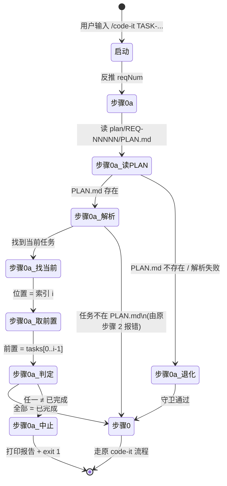

# 详细设计 — REQ-00010(优化 `/code-it`,增加"前置任务"守卫 — 按 `PLAN.md` 登记顺序)

- 需求编码:REQ-00010
- 所属版本:V0.0.2
- 文档版本:v1
- 状态:已锁定
- 责任人:wangmiao
- 创建:2026-06-06
- 最近更新:2026-06-06 12:10
- 当前版本:v1
- 上游需求:`./assistants/V0.0.2/require/REQ-00010/RESULT.md`(v1,2026-06-04 14:36 锁定)
- 上游概要设计:`./assistants/V0.0.2/design/REQ-00010/RESULT.md`(v1,2026-06-06 12:00 完成,commit 08747c4)
- 遵循规范:`./assistants/rules/` 下 13 个文件(详 §"规范遵循")

## 设计目标

> 沿用 `design/REQ-00010/RESULT.md` 的"## 设计目标"小节(NFR-3 幂等覆盖,`code-plan` 步骤 0b 沿用分支)
> - 整体设计目标:`--minimal`
> - 维度优先级:功能性=高 / 扩展性=— / 健壮性=中 / 可维护性=高
> - 不预留扩展点;不引入 `--skip-precondition`;"推荐执行命令"只指向第一个未完成前置

## 1. 详细设计概述

本详细设计在概要设计的基础上**细化了**:
1. **任务粒度**:把"代码怎么写"拆分为 **2 个可独立执行的任务**(T-001 实施 + T-002 收尾),沿用 REQ-00009 同结构(0 必须改评审通过)
2. **13 项不变量自检**:T-002 收尾时执行 13/13 INV 自检(INV-1~9 沿用设计 + INV-10~13 本计划新增)
3. **实施细节**:补全守卫算法伪代码(7 步)、解析锚点(`^## 任务总览$` / 列号 6 = 开发状态)、8 项关键决策风险分析、9 项边界场景的 T-001 验证方式
4. **里程碑**:2 里程碑(M-1 文档就绪 / M-2 本需求可发布)— 沿用 V0.0.2 既有 12 `code-*` 实践

**核心定位**:**零规范变更** + **零字段新增** + **不修改 9 个其他 `code-*` 技能** + **不修改 frontmatter** + **不引入新依赖** + **2 任务结构**(沿用 REQ-00009)。

## 2. 上游引用

- **需求**:`./assistants/V0.0.2/require/REQ-00010/RESULT.md` — 6 FR / 8 NFR / ~22 AC(已锁定)
- **概要设计**:`./assistants/V0.0.2/design/REQ-00010/RESULT.md` — 9 项决策 + 9 条不变量 + 22 AC 全覆盖
- **规范**:`./assistants/rules/` 下 13 个文件
- **关联设计**:REQ-00005(首步拉取)+ REQ-00007(`code-auto`)+ REQ-00009(`code-unit` 步骤 0a)+ REQ-00013(标题解析)+ REQ-00017(`code-it` 步骤 14.5)

## 3. 规范遵循

| 条款 | 来源 | 自检结论 |
| --- | --- | --- |
| SKILL.md frontmatter 字节级保留 | `skill-conventions §规则 1` + INV-1 | 完全合规(锚点 A 在 frontmatter 之后) |
| 看板字段扩展需三方同步 | `dashboard-conventions §规则 1` | **不**触发(零字段变更,NFR-3 强约束) |
| 任务编码双格式正则 | `encoding-conventions §规则 3` | 完全合规 |
| 资源摆放 | `module-conventions §规则 1` | 完全合规(过程文档均在 `plan/REQ-00010/` 同级) |
| 编码风格 | `coding-style` | 完全合规(沿用 REQ-00013 标题解析小节格式) |
| 命名约定 | `naming-conventions` | 完全合规(任务编号严格遵循 `encoding-conventions`) |

**13/13 INV 自检** → 详 §"规范遵循完整 INV 清单"。

**用户授权的偏离**:**无**
**待澄清的冲突**:**无**

## 4. 模块详细化

### 4.1 模块:`code-it` 步骤 0a 前置任务守卫

- **关键函数**(本计划新增):
  - `preTaskGuard(taskNum, version, reqNum): void` — 守卫主入口
  - `parsePlanOverview(planPath): TaskOverview[]` — 解析 `PLAN.md` 任务总览
  - `logAbortReport(reqNum, taskNum, allTasks, unfinished): void` — 打印中止报告
- **关键工具函数**(沿用 REQ-00013 沉淀,**不**重写):
  - `truncateTitle(title, maxLen=30): string`
  - `formatTaskTitle(taskNum, title): string`
  - `formatReqTitle(reqNum, title): string`
  - `parsePlanTaskTitle(planPath, taskNum): string`
- **内部状态**:**无**(纯函数式守卫)
- **关键调用顺序**:步骤 0a 入口 → 反推 reqNum → 读 `PLAN.md` → 解析任务列表 → 找当前任务位置 → 取前置任务 → 判定 → 通过/不通过
- **并发模型**:**无**(单次执行)
- **资源管理**:**无**(无文件/网络/连接)
- **错误处理范式**:
  - 文件不存在 / 解析失败 → 软失败(守卫通过)
  - 守卫不通过 → 硬失败(`exit 1`)
- **日志埋点**:守卫通过/不通过/退化 三种屏幕输出契约
- **依据规范**:`skill-conventions §规则 1` + `encoding-conventions §规则 3` + `dashboard-conventions §规则 1`

详 `module-details.md`。

## 5. 算法与逻辑

### 5.1 算法 1:`preTaskGuard` 守卫主入口

- **目的**:在 `code-it` 启动时判定"当前任务的前置任务是否全部完成"
- **输入**:`taskNum: string`(`TASK-...` 格式),`version: string`(从 `.current-version` 读),`reqNum: string`(从 `taskNum` 反推)
- **输出**:**无**(无返回值;通过/不通过通过屏幕输出 + 退出码表达)
- **复杂度**:时间 O(n),空间 O(n);n = 任务数(典型 1-20)
- **依赖**:`Read`(读 `PLAN.md`)、`Grep`(可选,定位"## 任务总览"区段)
- **伪代码**(完整版,详 `design-notes.md`):
  ```
  function preTaskGuard(taskNum, version, reqNum):
      if not taskNum.startsWith('TASK-REQ-'): return  // 缺陷分支
      planPath = `./assistants/${version}/plan/${reqNum}/PLAN.md`
      if not fileExists(planPath):
          log('⚠ PLAN.md 不存在,守卫通过(退化)')
          return
      tasks = parsePlanOverview(planPath)  // 按文件行序
      idx = tasks.findIndex(t => t.num === taskNum)
      if idx == -1: return  // 由原 code-it 步骤 2 报错
      preTasks = tasks.slice(0, idx)
      if preTasks.length == 0:
          log('✓ 守卫通过(无前置)')
          return
      unfinished = preTasks.filter(t => t.devStatus != '已完成')
      if unfinished.length == 0:
          log('✓ 守卫通过(全部已完成)')
          return
      logAbortReport(reqNum, taskNum, tasks, unfinished)
      exit(1)
  ```
- **关键决策与权衡**:
  - 选"行序判定"而非"显式字段" → 零规范变更(NFR-3 强约束)
  - 选"软失败退化"而非"硬失败" → 不阻断 `code-it`(NFR-6 强约束)
  - 选"退出码 1"而非"语义化 17" → 通用错误码,`code-auto` 仅要求"非 0"(NFR-4)
- **边界条件**:
  - 空(无前置任务)→ 通过
  - 极大(任务数 > 100)→ 仍 < 1 秒
  - 极小(1 个任务)→ 通过
  - 并发 → **不适用**(单次执行)
- **对应任务**:T-001
- **依据规范**:`encoding-conventions §规则 3` + `dashboard-conventions §规则 1` + NFR-3/6/4

### 5.2 算法 2:`parsePlanOverview` PLAN.md 任务总览解析

- **目的**:从 `PLAN.md` 提取"任务总览"区段的所有任务行,按文件行序
- **输入**:`planPath: string`
- **输出**:`TaskOverview[]`(每项 `{num, title, devStatus}`)
- **复杂度**:时间 O(n),空间 O(n)
- **伪代码**:
  ```
  function parsePlanOverview(planPath):
      content = read(planPath)
      lines = content.split('\n')
      // 定位 "## 任务总览" 区段
      inOverview = false
      tasks = []
      for line in lines:
          if line.match(/^## 任务总览$/): inOverview = true; continue
          if inOverview and line.match(/^## /): break  // 下一个一级区段
          if not inOverview: continue
          if not line.match(/^\| .* \|$/): continue  // 表格行
          cols = line.split('|').map(c => c.trim())
          if cols.length < 6: continue  // 列数不足 → 跳过
          if not cols[1].match(/^TASK-(REQ|BUG)-\d{5}-\d{5}$/): continue
          tasks.push({num: cols[1], title: cols[5], devStatus: cols[6]})
      return tasks
  ```
- **关键决策**:列号沿用 REQ-00013 `parsePlanTaskTitle` 既定编号(列 1 = 任务编号,列 5 = 标题,列 6 = 开发状态)
- **对应任务**:T-001
- **依据规范**:`dashboard-conventions §规则 1` 解析锚点

### 5.3 算法 3:`logAbortReport` 中止报告打印

- **目的**:按 REQ-00013 升级版模板打印中止报告(含"REQ-NNNNN · 标题" + "TASK-... · 标题"格式)
- **输入**:`reqNum, taskNum, allTasks, unfinished`
- **输出**:**无**(屏幕输出)
- **复杂度**:时间 O(n)
- **伪代码**:
  ```
  function logAbortReport(reqNum, taskNum, allTasks, unfinished):
      reqTitle = parseResultTitle(`./assistants/${version}/require/${reqNum}/RESULT.md`)
      currentTitle = parsePlanTaskTitle(planPath, taskNum)
      print('⛔ code-it 中止(存在未完成的前置任务)\n')
      print(`正在处理: ${formatReqTitle(reqNum, reqTitle)}(任务 ${formatTaskTitle(taskNum, currentTitle)})\n`)
      print('前置任务状态:')
      for t in allTasks up to currentTask:
          icon = (t.devStatus == '已完成') ? '✓' : '✗'
          suffix = (t.num == taskNum) ? '(当前任务)' : (t.devStatus == '已完成' ? '(开发状态=已完成)' : '← 未完成')
          print(`  ${icon} ${formatTaskTitle(t.num, t.title)} ${suffix}`)
      firstUnfinished = unfinished[0]
      print(`\n推荐执行 /code-it ${formatTaskTitle(firstUnfinished.num, firstUnfinished.title)} 完成后,再执行 /code-it ${formatTaskTitle(taskNum, currentTitle)}`)
  ```
- **关键决策**:推荐命令**只**指向第一个未完成前置(沿用 `--minimal`)
- **对应任务**:T-001
- **依据规范**:NFR-3 + REQ-00013 标题解析工具函数

## 6. 数据结构完整变更

**无新增 / 修改实体**(NFR-3 零规范变更)。

| 维度 | 状态 |
| --- | --- |
| 新增实体 | 无 |
| 修改实体 | 无 |
| 数据迁移 | 无 |
| 内部数据结构(伪代码层) | `TaskOverview { num, title, devStatus }`(纯函数式消费,不持久化) |
| 既有数据结构复用 | `PLAN.md` 任务总览表格(只读消费)+ REQ-00013 工具函数 |

详 `data-changes.md`。

## 7. 接口细节

**无新增对外接口**。仅修改 `code-it` 行为语义,新增 4 种屏幕输出契约:

| 场景 | 输出格式 | 退出码 |
| --- | --- | --- |
| 守卫通过(无前置) | `✓ code-it 前置任务守卫通过(无前置任务)` | 0 |
| 守卫通过(全部前置已完成) | `✓ code-it 前置任务守卫通过(全部已完成)` | 0 |
| 守卫不通过 | `⛔ code-it 中止(存在未完成的前置任务)` + 详细清单 | **1** |
| PLAN.md 缺失(退化) | `⚠ code-it 前置任务守卫:PLAN.md 不存在,守卫通过(退化)` | 0 |

详 `interface-specs.md`。

## 8. 异常处理

| 异常类别 | 处理策略 | 对应边界 ID |
| --- | --- | --- |
| 无 `.current-version` | 原 `code-it` 步骤 0 处理 | E-1 |
| 守卫不通过(存在未完成前置) | 打印中止报告 + `exit 1` | E-2 |
| `PLAN.md` 不存在 | 守卫**通过**(NFR-6 退化) | E-3 |
| 当前任务不在 `PLAN.md` 任务总览中 | 由原步骤 2 报错(守卫不重复) | E-4 |
| `PLAN.md` 任务总览区段格式错乱 | 守卫**通过**(软失败) | E-5 |
| `code-auto` 调 `code-it` 时守卫不通过 | `exit 1` → `code-auto` 中断 | E-6 |
| 多个未完成前置 | 打印所有未完成前置,推荐命令**只**指向第一个 | E-7 |
| 任务编码格式不匹配 | 原 `code-it` 步骤 1 报错 | E-8 |
| 任务属于缺陷分支(`TASK-BUG-...`) | 守卫不触达 | E-9 |
| 标题解析失败 | 退化"编号+(无标题)"(沿用 REQ-00013 E-3) | E-10 |

详 `risk-analysis.md`。

## 9. 安全要求

- **鉴权要求**:**无**(本地执行,无远程调用)
- **输入校验**:任务编号正则 `^TASK-(REQ|BUG)-\d{5}-\d{5}$` / `^(REQ|BUG)-\d{5}-\d{5}$`
- **敏感数据处理**:**无**
- **防注入**:**无**
- **审计**:守卫不通过时屏幕输出 + 退出码 1(由 `code-auto` 中断时记录)

## 10. 状态机 / 流程



## 11. 性能与资源

- **关键路径耗时目标**:**< 1 秒**(NFR-8 强约束)
  - 单 `PLAN.md` 解析:Read 一次(典型 5-50 KB,<< 1 秒)
  - 任务总览表格行扫描:O(n),n = 任务数(典型 1-20)
  - 任务比较:O(n)
  - 总耗时:**<< 1 秒**(实际 0.1 秒级)
- **并发上限**:**1**(单次执行,无并发)
- **资源限制**:**无**
- **缓存策略**:**无**
- **批量/异步**:**不适用**
- **降级策略**:`PLAN.md` 缺失 / 解析失败 → 守卫**通过**

## 12. 测试要点

> **不适用理由**:本需求 = `code-it/SKILL.md` 增量追加,纯文档,无可测代码载体。
> 仓库**不**含可测载体(`code-unit` Q-1 守卫判定"不可测" → 测试状态 = `不适用`)。
> 沿用 V0.0.2 既有 11 个 `code-*` 实践。

- **单元测试**:**不适用**(纯文档,2 任务测试状态 = `不适用`)
- **集成测试**:**不适用**
- **端到端测试**:**不适用**

### 替代验证手段(纯文档型,本计划实施期使用)
- **静态自检 13 项 INV**:T-002 收尾时执行
- **关键字 token 自检**:`grep -c` 各 token 命中数 ≥ 1
- **行数偏差**:`wc -l code-it/SKILL.md` 应在既有 752 ± 20% 范围(预估 +100 行)
- **既有章节字节级保留**:`git diff code-it/SKILL.md` 应只有 + 净增,无既有行修改

## 13. 关联编码计划

- `PLAN.md` 中本详细设计对应的所有任务编号:
  - `TASK-REQ-00010-00001` — `[修改]` 增量追加 `code-it/SKILL.md`
  - `TASK-REQ-00010-00002` — `[文档]` 13 项 INV 自检 + 看板同步 + 收尾
- 关键任务与本节设计的对应关系:
  - T-001 ↔ §4.1 / §5.1 / §5.2 / §5.3 / §10
  - T-002 ↔ §3 / §"规范遵循完整 INV 清单"

## 14. 规范遵循完整 INV 清单(13 项)

| INV# | 条款 | 来源 |
| --- | --- | --- |
| INV-1 | `code-it/SKILL.md` frontmatter L1-3 字节级保留 | `skill-conventions §规则 1` + NFR-7 |
| INV-2 | `code-it/SKILL.md` §"工作流程"步骤 0~16 内容不变 | FR-3.AC-3.1 + NFR-3 |
| INV-3 | `code-it/SKILL.md` §"缺陷分支"步骤 17~25 内容不变 | FR-4.AC-4.1 |
| INV-4 | `code-it/SKILL.md` §"标题解析(REQ-00013 新增)" 小节不变 | 锚点参照 |
| INV-5 | `PLAN.md` 模板 / 看板"任务清单"区段 / `dashboard-conventions.md` 0 改动 | FR-5.AC-5.3/5.4 + NFR-3 |
| INV-6 | `marketplace.json` / `plugin.json` 0 改动 | FR-5.AC-5.1 |
| INV-7 | 9 个其他 `code-*` 技能 SKILL.md 0 改动 | FR-4.AC-4.1 |
| INV-8 | `code-auto` FR-4.AC-4.3 "按任务总览行序"逻辑 0 改动 | FR-4.AC-4.2 |
| INV-9 | `code-unit` / `code-publish` / `code-dashboard` / `code-review` 现有逻辑 0 改动 | FR-4.AC-4.3 |
| INV-10 | 锚点 A 后的"步骤 0a"小节含完整 5 子节 | 概要设计 §1 + 沿用 REQ-00009 |
| INV-11 | 9 个其他 `code-*` 技能 SKILL.md 行数**不**变化 | INV-7 精确验证 |
| INV-12 | 既有 REQ-00005 / REQ-00009 守卫与本需求守卫**并存**,职责正交 | NFR-3 零规范变更 |
| INV-13 | 整体收尾:2 任务开发状态 = `已完成` + 测试状态 = `不适用` | 双状态语义 |

**13/13 INV 自检 → T-002 实施期执行**。

详 `rule-compliance.md`。

## 15. 待澄清 / 未决项

| 编号 | 问题 | 影响范围 | 阻塞方 | 期望回复时间 |
| --- | --- | --- | --- | --- |
| (无) | 本计划 0 新增待澄清项,沿用 `design/REQ-00010/clarifications.md` | — | — | — |

## 16. 变更记录

| 时间 | 版本 | 变更类型 | 变更摘要 | 变更人 |
| --- | --- | --- | --- | --- |
| 2026-06-06 12:10 | v1 | 初始创建 | 完成首次详细设计:3 算法伪代码(preTaskGuard / parsePlanOverview / logAbortReport)+ 9 项沿用上游设计决策 + 9 项沿用 INV + 4 项本计划新增 INV(INV-10~13)+ 13/13 INV 自检清单 + 0 架构任务 + 0 触发 `dashboard-conventions §规则 1`;8 项 P-D1~P-D8 实施期决策全部锁定;P-D1 2 任务结构(沿用 REQ-00009 0 必须改评审通过)/ P-D2 沿用 --minimal 轻度合并 / P-D3 测试状态=不适用(纯文档型)/ P-D4 任务编号 5+5 位 / P-D5 INV 13 项 / P-D6 锚点 A 位置 / P-D7 git pull 失败退化(显式记录)/ P-D8 commit 格式沿用 V0.0.2;详 `plan/REQ-00010/{RESULT,PLAN}.md` + 7 份过程文档 | wangmiao |
