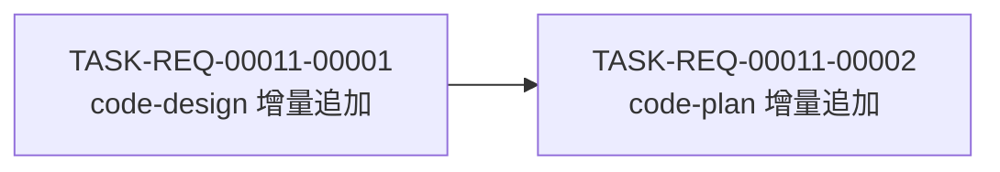

# 编码计划 — REQ-00011 — code-design / code-plan 步骤 0b 设计目标确认

- 需求编码:REQ-00011
- 所属版本:V0.0.2
- 详细设计:./assistants/V0.0.2/plan/REQ-00011/RESULT.md (v1)
- 状态:执行中
- **开发完成度**:0 / 2
- **测试完成度**:0 / 2(全部不适用)
- 创建:2026-06-05
- 最近更新:2026-06-05
- 当前版本:v1

## 1. 计划概述
- 任务总数:2
- 类型分布:修改 × 2
- 关键里程碑数:2(M-1 文档就绪 / M-2 本需求可发布)
- **开发完成度**:0 / 2
- **测试完成度**:0 / 2(全部任务测试状态=`不适用`)
- **真正可发布任务数**:0 / 2

## 2. 任务总览

| 任务编号 | 类型 | 触发/来源 | 标题 | 开发状态 | 测试状态 | 涉及文件/模块 | 前置任务 | 估算 | 责任人 | 关联任务 | 对应设计章节 |
| --- | --- | --- | --- | --- | --- | --- | --- | --- | --- | --- | --- |
| `TASK-REQ-00011-00001` | 修改 | 详细设计 | `[修改] code-design/SKILL.md 增量追加"步骤 0b 设计目标确认" + 模板顶部预留 + 步骤 0a 小注更新` | 待开始 | 不适用 | `plugins/code-skills/skills/code-design/SKILL.md §步骤 0a 小注 + §步骤 0b 新增`;`plugins/code-skills/skills/code-design/templates/design.md §文档头后` | — | 0.5d | wangmiao | — | RESULT.md §4 模块 1+3+4,§5 算法 1+2 |
| `TASK-REQ-00011-00002` | 修改 | 详细设计 | `[修改] code-plan/SKILL.md 增量追加"步骤 0b 设计目标确认"+ 任务粒度调整段 + 模板顶部预留 + 步骤 0a 小注更新` | 待开始 | 不适用 | `plugins/code-skills/skills/code-plan/SKILL.md §步骤 0a 小注 + §步骤 0b 新增 + §步骤 10A 任务粒度调整段`;`plugins/code-skills/skills/code-plan/templates/plan.md §文档头后` | T-001 | 0.7d | wangmiao | — | RESULT.md §4 模块 2+3+4,§5 算法 2+3+4 |

> **任务粒度决策说明**(FR-4 锁定 + 步骤 10A 规则):本设计"设计目标=--balanced"(code-auto 选推荐项),故**不**插入"扩展架构设计"等扩展性任务,2 任务按"功能点"切分 — T-001 = `code-design` 完整改动(增量追加 + 模板 + 步骤 0a 小注);T-002 = `code-plan` 完整改动(增量追加 + 任务粒度段 + 模板 + 步骤 0a 小注)。

> **双状态语义**:任务"真正可发布" = 开发状态=已完成 ∧ 测试状态 ∈ {`已运行-通过`, `不适用`}。本项目所有 12 个 `code-*` 技能任务沿用 V0.0.2 既有实践 = `不适用`。

## 3. 任务详情

### `TASK-REQ-00011-00001`:[修改] code-design/SKILL.md 增量追加"步骤 0b 设计目标确认" + 模板顶部预留 + 步骤 0a 小注更新

#### 基础信息
- **类型**:修改
- **触发/来源**:详细设计(本需求详细设计落地)
- **触发任务**:—
- **开发状态**:待开始
- **目标**:在 `code-design/SKILL.md` 步骤 0a 之后增量追加"步骤 0b 设计目标确认"章节,在 `design.md` 模板顶部预留"## 设计目标"占位,更新步骤 0a 既有"不含步骤 0b"小注
- **涉及文件/模块**:
  - `plugins/code-skills/skills/code-design/SKILL.md`:
    - §步骤 0a 既有内容(锚点 A,见 L106-117)末尾"进入既有'步骤 0 — 版本上下文检测'"后追加§步骤 0b 章节
    - §步骤 0a L107 既有"`code-design` **不**含步骤 0b(FR-2 显式仅 `code-require` 专属)"小注更新(详见下方"关键变更"项 3)
  - `plugins/code-skills/skills/code-design/templates/design.md`:
    - "## 文档头"模板区段(锚点 B)之后 + "## 1. 设计概述"(锚点 C)之前插入"## 设计目标"占位
- **前置任务**:—
- **关联任务**:—
- **关键变更**:
  1. **§步骤 0b 章节内容(新增,锚点 A 后)**:
     ```markdown
     ### 步骤 0b — 设计目标确认(本需求 REQ-00011 新增,FR-1)
     1. 评估需求规模(小/中/大),自适应问题数:
        - 小需求:1 个 `AskUserQuestion`(Q1 整体设计目标)
        - 中等需求:3 个 `AskUserQuestion`(Q1 + Q2 功能性 + Q3 扩展性)
        - 大需求:5 个 `AskUserQuestion`(Q1 + Q2 + Q3 + Q4 健壮性 + Q5 可维护性),可对不同细节功能分开提问(AC-6.3)
     2. 收集用户回答 → 调 `writeDesignGoalsSection(designResultPath, goals, "code-design")` 写入 `design/.../RESULT.md` 顶部"## 设计目标"小节(算法 2)
     3. 屏显:
        ```
        === code-design 设计目标确认 ===
        [整体/4 维度摘要]
        已回写至 design/<REQ>/RESULT.md "## 设计目标" 小节
        ```
     4. 用户取消 `AskUserQuestion` → 中止 + 回写空"## 设计目标"小节(E-3)
     5. **不**修改 frontmatter(INV-1)
     6. **不**修改"步骤 0"及之后的原有内容(INV-2)
     ```
  2. **模板顶部"## 设计目标"占位(新增,锚点 B 与 C 之间)**:
     ```markdown
     ## 设计目标
     <!-- 本节由 code-design / code-plan 步骤 0b 自动生成(写入或沿用),记录用户确认的设计目标;如需手动编辑,保留该注释以便步骤 0b 识别 -->
     ```
  3. **§步骤 0a L107 小注更新**:
     - 原内容(整句):"`code-design` **不**含步骤 0b(FR-2 显式仅 `code-require` 专属)。"
     - 删除该整句
     - 在原位置插入(替代):"步骤 0a 成功后,`code-design` 进入'步骤 0b 设计目标确认'(本需求 REQ-00011 新增,FR-1)。"
- **边界与异常**:
  - 用户取消 `AskUserQuestion` → 中止 + 回写空"## 设计目标"小节(E-3)
  - 写文件失败 → 透传 stderr,中断退出
- **验证手段**:
  - 手动跑 `/code-design REQ-00011`(自验证)— 用户实际触发步骤 0b
  - 屏显输出符合 §6.1 模板
  - `design/.../RESULT.md` 顶部"## 设计目标"小节正确写入
  - frontmatter(L1-3)字节级保留(INV-1)
  - 既有"步骤 0 ~ 步骤 15A / 步骤 7B ~ 10B"章节字节级保留(INV-2)
- **回退方式**:`git revert <commit-hash>` 回退本次提交
- **对应设计章节**:RESULT.md §4 模块 1+3+4,§5 算法 1+2
- **依据规范**:`skill-conventions.md §规则 1`(frontmatter 不变)+ NFR-2(增量修改)+ INV-1 / INV-2 / INV-3 / INV-5
- **创建时间**:2026-06-05
- **最近更新**:2026-06-05
- **完成时间**:(开发完成后填写)
- **完成人**:wangmiao
- **提交哈希**:(完成后填写)
- **备注**:本任务完成后,**不**触发 `code-auto` 升级(沿用现行"总选推荐项");**不**触发 `dashboard-conventions §规则 1` 3 处同步(NFR-4)

#### 单元测试状态
- **测试状态**:不适用
- **测试文件**:—
- **覆盖的测试场景**:—
- **测试用例数**:—
- **测试通过率**:—
- **最近测试运行时间**:—
- **最近测试运行命令**:—
- **不适用理由**:纯 Markdown 技能(SKILL.md 增量追加 + 模板占位);沿用 V0.0.2 既有 12 个 `code-*` 实践;`code-unit` 守卫"项目根 7 项"判定本项目为"不可测"
- **测试结果详情**:—
- **测试提交哈希**:—
- **测试负责人**:—

### `TASK-REQ-00011-00002`:[修改] code-plan/SKILL.md 增量追加"步骤 0b 设计目标确认"+ 任务粒度调整段 + 模板顶部预留 + 步骤 0a 小注更新

#### 基础信息
- **类型**:修改
- **触发/来源**:详细设计(本需求详细设计落地)
- **触发任务**:—
- **开发状态**:待开始
- **目标**:在 `code-plan/SKILL.md` 步骤 0a 之后增量追加"步骤 0b 设计目标确认"章节(含沿用/退化 + 任务粒度调整),在 `plan.md` 模板顶部预留"## 设计目标"占位,更新步骤 0a 既有"不含步骤 0b"小注
- **涉及文件/模块**:
  - `plugins/code-skills/skills/code-plan/SKILL.md`:
    - §步骤 0a 既有内容(锚点 A,见 L117-128)末尾"进入既有'步骤 0 — 版本上下文检测'"后追加§步骤 0b 章节
    - §步骤 0a L118 既有"`code-plan` **不**含步骤 0b(FR-2 显式仅 `code-require` 专属)"小注更新(详见下方"关键变更"项 3)
    - §步骤 10A"任务拆分"(锚点 D)末尾,追加"按'## 设计目标'小节调整任务粒度"段
  - `plugins/code-skills/skills/code-plan/templates/plan.md`:
    - "## 文档头"模板区段(锚点 E)之后 + "## 1. ..."(锚点 F)之前插入"## 设计目标"占位
- **前置任务**:T-001(因 T-001 完成后 `design.md` 模板才有占位位,`code-plan` 步骤 0b 才能正确写入 — 实际上是软依赖,因算法 2 锚点不依赖模板预留位,但任务粒度同步更清晰)
- **关联任务**:—
- **关键变更**:
  1. **§步骤 0b 章节内容(新增,锚点 A 后)**:
     ```markdown
     ### 步骤 0b — 设计目标确认(本需求 REQ-00011 新增,FR-2 / FR-3)
     1. 读 `design/<REQ>/RESULT.md` 的"## 设计目标"小节(算法 3):
        - 存在 → 屏显"沿用 design 的设计目标:<摘要>" + 复制到 `plan/.../RESULT.md` 顶部"## 设计目标"小节(`writeDesignGoalsSection(... "code-plan")`)
        - 不存在(E-1 / E-5)→ 屏显"⚠ 未检测到 design/<REQ>/RESULT.md" + 触发 `AskUserQuestion` 1-5 问(同 T-001 §步骤 0b 步骤 1)+ 写 `plan/.../RESULT.md`(**不**写 `design/`,FR-3.AC-3.3)
     2. 据"## 设计目标"小节,**调整**任务拆分粒度(FR-4,详下方"按设计目标调整任务粒度"段)
     3. 屏显(沿用/退化分支):
        ```
        === code-plan 设计目标确认 ===
        [沿用 design 的设计目标 / 用户回答摘要]
        已沿用 / 已回写至 plan/<REQ>/RESULT.md "## 设计目标" 小节
        ```
     4. **不**修改 frontmatter(INV-1)
     5. **不**修改"步骤 0"及之后的原有内容(INV-2)
     ```
  2. **§步骤 10A 末尾"按'## 设计目标'小节调整任务粒度"段(新增,锚点 D 后)**:
     ```markdown
     #### 按"## 设计目标"小节调整任务粒度(FR-4,本需求 REQ-00011 新增)
     读取本需求步骤 0b 写入的"## 设计目标"小节,据此调整任务总览(算法 4):

     | 整体设计目标 | 扩展性优先级 | 任务粒度调整 |
     | --- | --- | --- |
     | `--minimal` | * | 合并同类任务,粒度粗化 |
     | `--balanced` | 高/中/低 | 默认粒度(无调整) |
     | `--extensible` | * | 加"扩展架构设计" / "设计模式使用"等任务(至少 1 个) |
     | `--extensible` | 高 | 至少 3 个扩展性相关任务 |
     ```
  3. **模板顶部"## 设计目标"占位(新增,锚点 E 与 F 之间)**:
     ```markdown
     ## 设计目标
     <!-- 本节由 code-design / code-plan 步骤 0b 自动生成(写入或沿用),记录用户确认的设计目标;如需手动编辑,保留该注释以便步骤 0b 识别 -->
     ```
  4. **§步骤 0a L118 小注更新**:
     - 原内容(整句):"`code-plan` **不**含步骤 0b(FR-2 显式仅 `code-require` 专属)。"
     - 删除该整句
     - 在原位置插入(替代):"步骤 0a 成功后,`code-plan` 进入'步骤 0b 设计目标确认'(本需求 REQ-00011 新增,FR-2)。"
- **边界与异常**:
  - 读 `design/.../RESULT.md` 不存在 → 退化(FR-3)
  - 读 `design/.../RESULT.md` 存在但无"## 设计目标"小节 → 退化(E-5)
  - 用户取消 `AskUserQuestion` → 中止
  - 写文件失败 → 透传 stderr,中断退出
- **验证手段**:
  - 手动跑 `/code-plan REQ-00011`(自验证)— 用户实际触发步骤 0b
  - 屏显输出符合 §6.2 / §6.3 模板
  - `plan/.../RESULT.md` 顶部"## 设计目标"小节正确写入或沿用
  - 任务粒度调整(本次 = `--balanced` + 扩展性=中 → 默认粒度,无变化;后续若选 `--extensible` 应插入 1 个扩展性任务)
  - frontmatter(L1-3)字节级保留(INV-1)
  - 既有"步骤 0 ~ 步骤 18A / 步骤 7B ~ 13B"章节字节级保留(INV-2)
  - 既有"步骤 10A 任务拆分"主体(L219-300)字节级保留
- **回退方式**:`git revert <commit-hash>` 回退本次提交
- **对应设计章节**:RESULT.md §4 模块 2+3+4,§5 算法 2+3+4
- **依据规范**:NFR-5(`code-auto` 0 冲突)+ FR-3(退化行为)+ INV-1 / INV-2 / INV-3 / INV-4 / INV-5 / INV-6
- **创建时间**:2026-06-05
- **最近更新**:2026-06-05
- **完成时间**:(开发完成后填写)
- **完成人**:wangmiao
- **提交哈希**:(完成后填写)
- **备注**:本任务完成后,**不**触发 `code-auto` 升级(沿用现行"总选推荐项");**不**触发 `dashboard-conventions §规则 1` 3 处同步(NFR-4);**不**触发 `code-review` 升级(FR-7.AC-7.3)

#### 单元测试状态
- **测试状态**:不适用
- **测试文件**:—
- **覆盖的测试场景**:—
- **测试用例数**:—
- **测试通过率**:—
- **最近测试运行时间**:—
- **最近测试运行命令**:—
- **不适用理由**:纯 Markdown 技能(SKILL.md 增量追加 + 模板占位);沿用 V0.0.2 既有 12 个 `code-*` 实践;`code-unit` 守卫"项目根 7 项"判定本项目为"不可测"
- **测试结果详情**:—
- **测试提交哈希**:—
- **测试负责人**:—

## 4. 任务依赖图



> **说明**:T-002 在执行时会调 `readDesignGoalsFromDesign(design/.../RESULT.md)` 读 T-001 写的"## 设计目标"小节;若 T-001 未完成,T-002 走退化路径(读不到 → 退化)也能完成。**软依赖**,不强制串行,但顺序执行更自然。

## 5. 里程碑

| 里程碑 | 包含任务 | 完成定义 | 预期时间 |
| --- | --- | --- | --- |
| M-1:文档就绪 | T-001 | `code-design/SKILL.md` 步骤 0b 章节 + `design.md` 模板占位 + 步骤 0a 小注更新 完成;开发状态=已完成 | 2026-06-05 |
| M-2:本需求可发布 | T-001, T-002 | **所有任务开发状态=已完成 且 测试状态 ∈ {不适用}**,2/2 任务 INV-1~8 自检 100% 通过 + 看板同步完成 | 2026-06-05 |

> 里程碑的"完成定义"显式列出两轴状态要求,避免把"开发完成"误当"可发布"。

## 6. 状态管理规则

### 6.1 开发状态(主状态)
- **状态推进**:`待开始` → `进行中` → `已完成`
- **已完成不可逆**:开发状态为"已完成"的任务,其**描述/关键变更/依赖等字段不可修改**
- **状态变更记录**:每次状态变更在"变更记录"中记录(变更类型=开发状态更新)

### 6.2 测试状态(平行状态)
- **初始化**:本计划 2 任务均初始化为 `不适用`(纯 Markdown 技能,无构建/测试框架)
- **不适用不可逆**:一旦标为 `不适用`,不应再变为其他值

### 6.3 任务"真正可发布"定义
```
任务真正可发布 ⟺
    开发状态 = 已完成
    ∧ 测试状态 ∈ {已运行-通过, 不适用}
```

### 6.4 状态字段更新责任分工
| 字段 | 主要更新方 | 触发时机 |
| --- | --- | --- |
| 开发状态(待开始→进行中) | `code-it` | 步骤 7 任务开始 |
| 开发状态(进行中→已完成) | `code-it` | 步骤 14 任务完成 |
| 测试状态(任意→不适用) | `code-plan`(本计划已初始化) | 首次拆分时确认 |

## 7. 关联计划

| 关联计划编码 | 关联点 | 对本计划的影响 | 链接 |
| --- | --- | --- | --- |
| REQ-00017(V0.0.2)— `code-plan` 拆分任务逻辑:更新看板下沉至 `code-it` | `code-plan` 步骤 4A 拆任务约束(候选集 6 项)+ `code-it` 末尾兜底后 P-1 推进看板 | 本计划 T-002 在 `code-plan/SKILL.md` §步骤 10A 任务拆分主体**后**追加"按设计目标调整任务粒度"段(锚点 D),与 REQ-00017 锚点 A 不重叠;T-001 / T-002 完成时**不**触发看板推进(`code-it` P-1 由实际 `code-it` 执行时承担) | [PLAN.md](../REQ-00017/PLAN.md) |
| REQ-00016(V0.0.2)— `code-design` / `code-plan` 快模式 | 步骤 0.5 + 步骤 N 步骤 3.5 增量追加 | 本计划 T-001 / T-002 在 §步骤 0b 位置(新增)在快模式跳过的步骤范围**之外**(快模式仅跳 §7A-8A+11A-12A+13A 核心;§步骤 0b 仍执行);T-002 §步骤 10A 任务粒度段叠加在 §步骤 10A 末尾(快模式不调 §步骤 10A 完整流程) | [PLAN.md](../REQ-00016/PLAN.md) |
| REQ-00009(V0.0.2)— `code-unit` 项目可测性守卫 | 步骤 0a 守卫(7 项文件/目录检查) | 本计划 2 任务测试状态=`不适用`(沿用 V0.0.2 既有 12 个 `code-*` 实践;`code-unit` 守卫"项目根 7 项"判定本项目为"不可测") | [PLAN.md](../REQ-00009/PLAN.md) |
| REQ-00005(V0.0.2)— 3 技能首步拉取与末步提交 | §步骤 0a 既有内容(锚点 A) | 本计划 T-001 / T-002 在 §步骤 0a 既有"不含步骤 0b"小注位置(L107 / L118)**更新**为"步骤 0b 设计目标确认",与 REQ-00005 既有的"步骤 0a 拉取"协同;**不**触发末尾兜底变化 | [PLAN.md](../REQ-00005/PLAN.md) |

## 8. 变更记录

| 时间 | 版本 | 变更类型 | 变更摘要 | 变更人 |
| --- | --- | --- | --- | --- |
| 2026-06-05 | v1 | 初始创建 | 完成首次编码计划,共 **2 条任务**(T-001 `code-design/SKILL.md` 增量追加 + T-002 `code-plan/SKILL.md` 增量追加);**0**"更新看板"派生任务(REQ-00017 强约束);**0**架构任务(`code-auto` 选 `--balanced` 不触发 FR-4 加扩展性任务);2 任务测试状态全 `不适用`(纯 Markdown 技能 + 沿用 V0.0.2 既有 12 个 `code-*` 实践);100% 沿用概要设计 8 决策 + 8 不变量;0 触发 `dashboard-conventions §规则 1` 3 处同步(NFR-4);7 份过程文档已写完;2 里程碑(M-1 文档就绪 / M-2 本需求可发布) | wangmiao |
