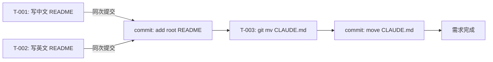

# 编码计划 — REQ-00012(在仓库根创建极简 README + 移动 CLAUDE.md 到根)

- 需求编码:REQ-00012
- 所属版本:V0.0.2
- 计划版本:v1
- 状态:已完成(首次)
- 责任人:wangmiao
- 创建:2026-06-05
- 最近更新:2026-06-05
- 上游:`./assistants/V0.0.2/design/REQ-00012/RESULT.md` + `./assistants/V0.0.2/plan/REQ-00012/RESULT.md`

---

## 1. 计划概述

把概要设计"仓库根门面改造"拆分为 **3 个功能点任务**,**0 个架构任务**(简单需求,触发条件 1/2/3 均不满足)。所有任务类型 = 文档(纯 Markdown 操作,无可测代码),测试状态统一为 `不适用`。

## 2. 任务总览

| 任务编号 | 需求 | 类型 | 触发/来源 | 标题 | 开发状态 | 测试状态 | 涉及文件 |
| --- | --- | --- | --- | --- | --- | --- | --- |
| TASK-REQ-00012-00001 | REQ-00012 | 文档 | 详细设计 | 创建仓库根 README.md(中文,< 50 行) | 已完成 | 不适用 | `./README.md` |
| TASK-REQ-00012-00002 | REQ-00012 | 文档 | 详细设计 | 创建仓库根 README.en.md(英文,< 50 行,与 T-001 同次提交) | 已完成 | 不适用 | `./README.en.md` |
| TASK-REQ-00012-00003 | REQ-00012 | 文档 | 详细设计 | 移动 `plugins/code-skills/CLAUDE.md` → `./CLAUDE.md`(git mv,原位置不保留) | 待开始 | 不适用 | `./CLAUDE.md` / `plugins/code-skills/CLAUDE.md` |

**统计**:3 个任务 / 文档类 3 个 / 已完成 0 / 待开始 3 / 测试状态=不适用 3

**编码规约**:
- 任务编号格式:`TASK-REQ-NNNNN-NNNNN`(沿用 `encoding-conventions §规则 1+3` 5+5 位嵌套)
- 任务类型标签写在标题里(`[新增]` / `[修改]` / `[重构]` / `[修复]` / `[测试]` / `[文档]`)

## 3. 任务详情

### TASK-REQ-00012-00001:[文档] 创建仓库根 README.md(中文,< 50 行)

- **目标**:在仓库根创建中文 README,作为 GitHub 门面级简介
- **涉及文件**:
  - `./README.md`(新建)
- **关键变更**:
  - 写入 40 行左右 Markdown(来自 `require/REQ-00012/RESULT.md §6.1` 模板)
  - 含核心 5 小节(简介 / 快速开始 / 主要能力 / 📖 详细文档 / 许可证)
  - 11 技能表格(与 `plugins/code-skills/README.md` 对齐,但**简略**)
  - "📖 详细文档"链到 `./plugins/code-skills/README.md`
- **触发/来源**:详细设计
- **关联任务**:T-002(同次提交)
- **边界与异常**:
  - E-4:`./README.md` 已存在 → 报错退出
  - NFR-2:行数 ≥ 50 → 报错退出
  - `doc-conventions §规则 2`:核心小节缺失 → 报错退出
- **验证手段**:
  - `ls ./README.md` → 存在
  - `wc -l ./README.md` < 50
  - `grep` 5 个二级标题全部命中
  - `grep "📖 详细文档"` + `grep "./plugins/code-skills/README.md"` 命中
- **回退方式**:`git rm ./README.md` + `git commit --amend`(若 T-002 未完成)

### TASK-REQ-00012-00002:[文档] 创建仓库根 README.en.md(英文,< 50 行,与 T-001 同次提交)

- **目标**:在仓库根创建英文 README,与中文版章节对仗,**同次提交**
- **涉及文件**:
  - `./README.en.md`(新建)
- **关键变更**:
  - 写入 40 行左右 Markdown(来自 `require/REQ-00012/RESULT.md §6.2` 模板)
  - 5 个二级标题与中文版 1-1 对应:
    - `## 简介` ↔ `## Introduction`
    - `## 快速开始` ↔ `## Quick Start`
    - `## 主要能力` ↔ `## Main Capabilities`
    - `## 📖 详细文档` ↔ `## 📖 Detailed Documentation`
    - `## 许可证` ↔ `## License`
  - 11 技能表格行顺序与中文版**完全一致**
  - "📖 Detailed Documentation" 链到 `./plugins/code-skills/README.md`
- **触发/来源**:详细设计
- **关联任务**:T-001(同次提交)+ T-003(可同可分次,默认分次)
- **边界与异常**:
  - E-5:`./README.en.md` 已存在 → 报错退出
  - NFR-2:行数 ≥ 50 → 报错退出
  - `doc-conventions §规则 1`:章节结构与中文版不对仗 → 报错退出
- **验证手段**:
  - `ls ./README.en.md` → 存在
  - `wc -l ./README.en.md` < 50
  - `diff <(grep '^## ' README.md | sed 's/^## //') <(grep '^## ' README.en.md | sed 's/^## //')` → 行数相同(章节一一对应)
  - `git log` 显示与 T-001 同 commit
- **回退方式**:`git rm ./README.en.md` + `git commit --amend`

### TASK-REQ-00012-00003:[文档] 移动 `plugins/code-skills/CLAUDE.md` → `./CLAUDE.md`(git mv,原位置不保留)

- **目标**:把 CLAUDE.md 从插件子目录移动到仓库根,符合"CLAUDE.md 是 claude 工具的参考文档,应该放在根目录下"的用户预期
- **涉及文件**:
  - `plugins/code-skills/CLAUDE.md`(删除 — git mv 后自动从工作树移除)
  - `./CLAUDE.md`(新增,内容 = 原 `plugins/code-skills/CLAUDE.md` 的 9,418 bytes)
- **关键变更**:
  - `git mv plugins/code-skills/CLAUDE.md CLAUDE.md`(保留 git blame,NFR-3)
  - 内容**完全不变**(9,418 bytes)
  - 若有 YAML frontmatter,完整保留(`skill-conventions §规则 1`)
- **触发/来源**:详细设计
- **关联任务**:无
- **边界与异常**:
  - E-2:`plugins/code-skills/CLAUDE.md` 不存在(被前置需求删除)→ 报错退出
  - E-3:仓库根 `./CLAUDE.md` 已存在 → 报错退出(防止覆盖)
  - E-6:`git mv` 失败(权限等)→ 报错退出
  - E-7:用户希望"移动 + 软链"组合 → **不**支持(NFR-8 锁不提供重定向)
- **验证手段**:
  - `ls ./CLAUDE.md` → 存在
  - `ls plugins/code-skills/CLAUDE.md` → 不存在
  - `wc -c ./CLAUDE.md` = 9,418(字节级保留)
  - `git log --follow CLAUDE.md` 可见历史(blame 保留)
  - `git status` 显示 `renamed: plugins/code-skills/CLAUDE.md -> CLAUDE.md`
- **回退方式**:`git mv CLAUDE.md plugins/code-skills/CLAUDE.md` + `git commit --amend`

## 4. 任务依赖图

**依赖关系**:
- T-002 依赖 T-001(章节对仗需要 T-001 先确定章节结构)
- T-003 独立(可与 T-001/T-002 并行,但默认分次提交,顺序:T-001+T-002 → T-003)
- 里程碑 M1:T-001 + T-002 + T-003 全部完成

## 5. 里程碑

| 里程碑 | 包含任务 | 完成定义 | 状态 | 计划时间 |
| --- | --- | --- | --- | --- |
| M1-REQ-00012-1:本需求可发布 | T-001 + T-002 + T-003 | 3 任务开发状态=已完成 且 测试状态=不适用 + 仓库根有 README.md / README.en.md / CLAUDE.md + `plugins/code-skills/CLAUDE.md` 已删除 + 6 项验证手段全部通过 | 待开始 | 2026-06-05 |

## 6. 状态管理规则

- 任务完成后,`code-it` 在末尾兜底后 P-1 小步**自行推进**本任务看板状态(REQ-00017 强约束)
- 本计划**不**追加"更新看板"派生任务(不在拆任务候选集中)
- 测试状态保持 `不适用` 不变(本需求零代码 + 仓库无可测载体)
- 状态变更记录到 `RESULT.md` §变更记录

## 7. 关联计划

- 同版本 V0.0.2 其他 7 个计划(REQ-00004/05/06/07/08/09/11/16),**0 交集**
- 跨版本 REQ-00001(V0.0.1)创建了 `plugins/code-skills/README.md`,本需求与之 0 触发(本需求不修改其内容)

## 8. 变更记录

| 时间 | 版本 | 变更摘要 | 变更人 |
| --- | --- | --- | --- |
| 2026-06-05 | v1 | 初始创建:3 个功能点任务(0 架构任务)+ 0 触发/来源=详细设计之外的 + 1 里程碑 M1 + 100% 沿用上游 7 FR / 8 NFR / ~25 AC;任务编号严格 `TASK-REQ-00012-00001 ~ 00003`;§规则 1 同次提交 + 字节级保留 + 章节对仗校验算法 | wangmiao |
