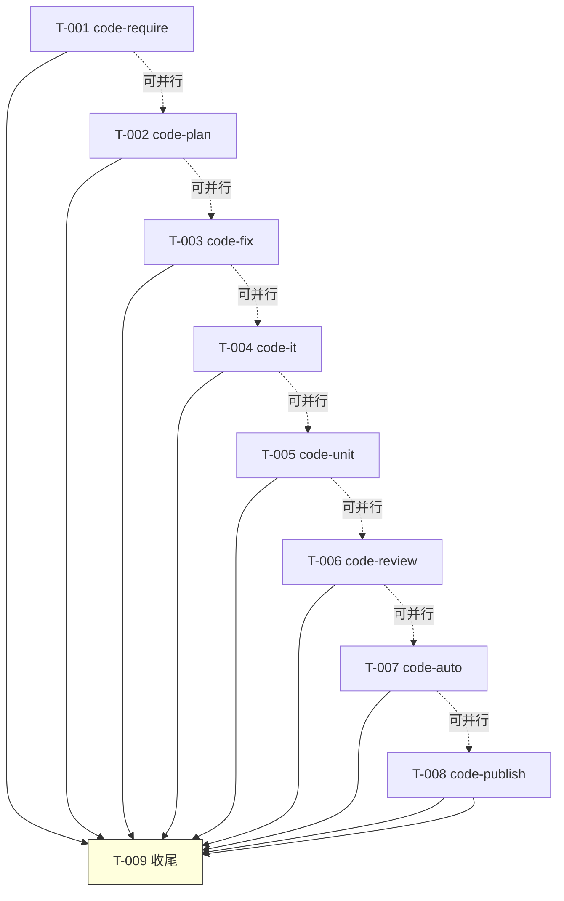

# 编码计划 — REQ-00013:优化 6 技能,启用"编号+标题"显示

> 写入方:`code-plan` 技能
> 上游:./assistants/V0.0.2/require/REQ-00013/RESULT.md
> 上游:./assistants/V0.0.2/design/REQ-00013/RESULT.md
> 上游:./assistants/V0.0.2/plan/REQ-00013/RESULT.md
> 创建时间:2026-06-05 21:30
> 状态:**已完成(编码计划)**

---

## 1. 计划概述

把概要设计"8 个 SKILL.md 增量追加"拆为 **9 个任务**(8 个 SKILL.md 增量追加 + 1 个收尾自检)。严格遵循 `encoding-conventions §规则 1+3` 5+5 位嵌套式任务编号,任务触发/来源全部 = `详细设计`,**0** 拆"更新看板"派生任务(REQ-00017 强约束)。

## 2. 任务总览

| 任务编号 | 类型 | 触发/来源 | 标题 | 开发状态 | 测试状态 | 涉及文件 | 关联任务 |
| --- | --- | --- | --- | --- | --- | --- | --- |
| TASK-REQ-00013-00001 | 修改 | 详细设计 | `[修改] code-require/SKILL.md 增量追加(标题解析 + 13 类输出格式)` | 待开始 | 不适用 | `plugins/code-skills/skills/code-require/SKILL.md` § 工具使用约定 段后 + § 工作流程 前 | — |
| TASK-REQ-00013-00002 | 修改 | 详细设计 | `[修改] code-plan/SKILL.md 增量追加(标题解析 + 13 类输出格式)` | 待开始 | 不适用 | `plugins/code-skills/skills/code-plan/SKILL.md` § 工作流程 前 | — |
| TASK-REQ-00013-00003 | 修改 | 详细设计 | `[修改] code-fix/SKILL.md 增量追加(标题解析 + 缺陷标题生成小节)` | 待开始 | 不适用 | `plugins/code-skills/skills/code-fix/SKILL.md` § 工作流程 前 + 步骤 1 末尾 | — |
| TASK-REQ-00013-00004 | 修改 | 详细设计 | `[修改] code-it/SKILL.md 增量追加(标题解析 + 13 类输出格式)` | 待开始 | 不适用 | `plugins/code-skills/skills/code-it/SKILL.md` § 工作流程 前 | — |
| TASK-REQ-00013-00005 | 修改 | 详细设计 | `[修改] code-unit/SKILL.md 增量追加(标题解析 + 13 类输出格式)` | 待开始 | 不适用 | `plugins/code-skills/skills/code-unit/SKILL.md` § 工作流程 前 | — |
| TASK-REQ-00013-00006 | 修改 | 详细设计 | `[修改] code-review/SKILL.md 增量追加(标题解析 + 派生任务标题截断)` | 待开始 | 不适用 | `plugins/code-skills/skills/code-review/SKILL.md` § 工作流程 前 | — |
| TASK-REQ-00013-00007 | 修改 | 详细设计 | `[修改] code-auto/SKILL.md 增量追加(标题预读 + 屏幕日志格式升级)` | 待开始 | 不适用 | `plugins/code-skills/skills/code-auto/SKILL.md` § 屏幕报告格式 前 | — |
| TASK-REQ-00013-00008 | 修改 | 详细设计 | `[修改] code-publish/SKILL.md 增量追加(报告未完成项格式升级)` | 待开始 | 不适用 | `plugins/code-skills/skills/code-publish/SKILL.md` § PreflightChecker 章节 末尾 | — |
| TASK-REQ-00013-00009 | 文档 | 详细设计 | `[文档] 8 项 INV 自检 + 5 处看板同步 + 收尾` | 待开始 | 不适用 | `assistants/V0.0.2/RESULT.md` + `code/TASK-REQ-00013-00009/{RESULT,work-log,deviations}.md` | T-001 ~ T-008 |

**统计**:
- 总任务数:9
- 开发状态:`待开始` × 9
- 测试状态:`不适用` × 9(纯文档型,本仓库无构建/测试文件,`code-unit` 守卫判定"不可测")
- 真正可发布数(开发=已完成 ∧ 测试∈{已运行-通过, 不适用}):待 T-001~T-009 完成后 **9/9**

---

## 3. 任务详情

### TASK-REQ-00013-00001:`[修改] code-require/SKILL.md 增量追加(标题解析 + 13 类输出格式)`

**目标**:
在 `code-require/SKILL.md` § 工具使用约定 段后 + § 工作流程 前追加"## 标题解析(REQ-00013 新增)"小节,使所有用户可见的屏幕输出位置(启动 / 完成 / 中止 / 错误)统一拼接"REQ-NNNNN · <需求标题>"。

**涉及文件**:
- `plugins/code-skills/skills/code-require/SKILL.md` § 工具使用约定 段后(插入"## 标题解析"小节)+ § 工作流程 前(若有,再次引用)
  - 注:本仓库 SKILL.md 既有结构无"## 工作流程"段(用 "## 步骤 0" 起),锚点为"## 工具使用约定"段后 + "## 输入"段前

**关键变更**:
1. **追加 1 个新小节**:"## 标题解析(REQ-00013 新增)"
   - `truncateTitle(title: string, maxLen: number = 30): string` 工具函数(3 行伪代码)
   - `formatReqTitle(reqNum: string, title: string): string` 工具函数(1 行伪代码)
   - `parseResultTitle(filePath: string): string` 解析函数(3 行伪代码)
2. **修订 13 类屏幕输出位置**:
   - 步骤 0 / 步骤 1 / 步骤 2 / 步骤 3 / 步骤 4 / 步骤 5 / 步骤 6 / 步骤 7 / 步骤 8 / 步骤 9 / 步骤 10 / 步骤 N / 异常处理 各处输出 `REQ-NNNNN` 的位置,统一替换为 `formatReqTitle(REQ-NNNNN, parseResultTitle(...))`

**边界与异常**:
- E-1:无 `.current-version` → 提示调 `code-version`,退出
- E-2:标题 > 30 字符 → `truncateTitle` 自动截断
- E-3:标题字段缺失 → 退化"编号+(无标题)"

**验证手段**(静态自检):
- ✅ frontmatter 字节级保留(NFR-7)
- ✅ "## 工具使用约定"段后既有内容字节级保留
- ✅ "## 输入" / "## 输出" / "## 工作流程" / "## 步骤 N" 字节级保留
- ✅ `truncateTitle` / `formatReqTitle` / `parseResultTitle` 伪代码完整
- ✅ 13 类屏幕输出位置覆盖
- ✅ 0 触发 `dashboard-conventions §规则 1` 3 处同步
- ✅ 0 修改 `marketplace.json` / `plugin.json` / `assistants/rules/` 13 文件

**回退方式**:`git checkout HEAD -- plugins/code-skills/skills/code-require/SKILL.md`

---

### TASK-REQ-00013-00002:`[修改] code-plan/SKILL.md 增量追加(标题解析 + 13 类输出格式)`

**目标**:同 T-001,适用 `code-plan` SKILL.md

**涉及文件**:
- `plugins/code-skills/skills/code-plan/SKILL.md` § 工具使用约定 段后

**关键变更**:同 T-001,新增 `formatTaskTitle(taskNum: string, title: string): string` + `parsePlanTaskTitle(planPath: string, taskNum: string): string`,13 类屏幕输出位置覆盖"需求标题"和"任务标题"两类

**边界与异常 / 验证手段 / 回退方式**:同 T-001

---

### TASK-REQ-00013-00003:`[修改] code-fix/SKILL.md 增量追加(标题解析 + 缺陷标题生成小节)`

**目标**:
1. 在 `code-fix/SKILL.md` § 工作流程 前追加"## 标题解析(REQ-00013 新增)"小节
2. **本轮唯一新增字段**:在 `fix/<BUG-NNN>/RESULT.md` 顶部(H1 之后第一个 H2)追加"## 缺陷标题"小节(`code-fix` 步骤 1 末尾自动生成,取用户原始缺陷描述前 30 字 + `...`)

**涉及文件**:
- `plugins/code-skills/skills/code-fix/SKILL.md` § 工具使用约定 段后 + 步骤 1 末尾(在"#### 1.X 检测用户输入"小节后追加"#### 1.X+1 缺陷标题生成(REQ-00013 新增)")

**关键变更**:
1. **追加 1 个新小节** "## 标题解析":
   - `truncateTitle` / `formatBugTitle` / `parseFixTitle` 工具函数
2. **追加 1 个步骤子节** "#### 1.X+1 缺陷标题生成":
   - 自动取用户原始缺陷描述(从 args 或 stdin)
   - 调 `truncateTitle(描述, 30)` 截断
   - 写入 `fix/<BUG-NNN>/RESULT.md` 顶部"## 缺陷标题"小节
3. **修订 13 类屏幕输出位置**:`BUG-NNNNN` 替换为 `formatBugTitle(BUG-NNNNN, parseFixTitle(...))`

**边界与异常**:
- E-1:无 `.current-version` → 提示调 `code-version`,退出
- E-2:用户原始缺陷描述 > 30 字符 → 自动截断
- E-5:老缺陷(无"## 缺陷标题"小节)→ 退化"BUG-NNNNN(无标题)"

**验证手段**(静态自检):
- ✅ frontmatter 字节级保留
- ✅ "## 工具使用约定" / "## 输入" / "## 输出" / "## 工作流程" / "## 步骤 1" 字节级保留
- ✅ 新增"## 缺陷标题"小节示例(代码示例完整,2 段:用户输入 → 写入文件)
- ✅ 13 类屏幕输出位置覆盖
- ✅ 0 触发 `dashboard-conventions §规则 1` 3 处同步(`## 缺陷标题` 在 `fix/.../RESULT.md` 内部,INV-7 严守)
- ✅ 0 修改看板"缺陷清单"区段

**回退方式**:`git checkout HEAD -- plugins/code-skills/skills/code-fix/SKILL.md`

---

### TASK-REQ-00013-00004:`[修改] code-it/SKILL.md 增量追加(标题解析 + 13 类输出格式)`

**目标**:同 T-001,适用 `code-it` SKILL.md;特别覆盖 REQ-00010 中止报告(FR-6.AC-6.2)

**涉及文件**:
- `plugins/code-skills/skills/code-it/SKILL.md` § 工具使用约定 段后

**关键变更**:同 T-001,新增 `formatTaskTitle` + `parsePlanTaskTitle`;特别修订"前置任务守卫"步骤(REQ-00010)的中止报告模板,在"⛔ code-it 中止(存在未完成的前置任务)" 后追加 "正在处理: REQ-NNNNN · <需求标题>(任务 TASK-... · <任务标题>)" 行

**边界与异常 / 验证手段 / 回退方式**:同 T-001

---

### TASK-REQ-00013-00005:`[修改] code-unit/SKILL.md 增量追加(标题解析 + 13 类输出格式)`

**目标**:同 T-001,适用 `code-unit` SKILL.md;特别覆盖 REQ-0009 守卫跳过报告(FR-7.AC-7.2)

**涉及文件**:
- `plugins/code-skills/skills/code-unit/SKILL.md` § 工具使用约定 段后

**关键变更**:同 T-001;特别修订"步骤 0a 项目可测性检查"守卫跳过的屏幕输出(REQ-0009),在"⏭ code-unit 跳过" 后追加 "TASK-... · <任务标题>(项目不可测)"

**边界与异常 / 验证手段 / 回退方式**:同 T-001

---

### TASK-REQ-00013-00006:`[修改] code-review/SKILL.md 增量追加(标题解析 + 派生任务标题截断)`

**目标**:
1. 在 `code-review/SKILL.md` § 工作流程 前追加"## 标题解析(REQ-00013 新增)"小节
2. 派生任务写入 `PLAN.md` 任务总览"标题"列时,自动调用 `truncateTitle(title, 30)` 截断

**涉及文件**:
- `plugins/code-skills/skills/code-review/SKILL.md` § 工具使用约定 段后 + 派生任务追加步骤

**关键变更**:
1. **追加 1 个新小节** "## 标题解析":`truncateTitle` / `formatReqTitle` / `formatTaskTitle` / `parseResultTitle` / `parsePlanTaskTitle`
2. **修订派生任务追加步骤**:写入 `PLAN.md` 任务总览"标题"列时,显式调 `truncateTitle(title, 30)`,**0 依赖下游消费方截断**
3. **修订 13 类屏幕输出位置**

**边界与异常**:
- E-1:无 `.current-version` → 提示调 `code-version`,退出
- E-6:派生任务标题 > 30 字 → `truncateTitle` 自动截断(D-5 选定 A)

**验证手段 / 回退方式**:同 T-001

---

### TASK-REQ-00013-00007:`[修改] code-auto/SKILL.md 增量追加(标题预读 + 屏幕日志格式升级)`

**目标**:
1. 在 `code-auto/SKILL.md` § 屏幕报告格式 前追加"## 标题预读(REQ-00013 新增)"小节
2. `code-auto` 在调子技能前,自读"标题"源(读 `require/.../RESULT.md` 第 1 行 / `PLAN.md` 任务总览 / `fix/.../RESULT.md` "## 缺陷标题"),拼接到进度日志

**涉及文件**:
- `plugins/code-skills/skills/code-auto/SKILL.md` § 屏幕报告格式 前

**关键变更**:
1. **追加 1 个新小节** "## 标题预读":
   - `truncateTitle` / `formatReqTitle` / `formatTaskTitle` / `formatBugTitle` 工具函数
   - `parseResultTitle` / `parsePlanTaskTitle` / `parseFixTitle` 解析函数
   - 关键契约:**子技能零修改契约保持** — `code-auto` 自读,不向子技能传任何参数(D-8 选定 A)
2. **修订屏幕日志格式**:
   - 步骤 1/2/3/5:`[code-auto] 步骤 N/6:code-require REQ-NNNNN · <需求标题>`(读 `require/.../RESULT.md`)
   - 步骤 4/6:`[code-auto]   → 1/N:code-it TASK-... · <任务标题> ✓`(读 `PLAN.md` 任务总览)
   - 步骤 6 派生:`[code-auto]   → 1/N:code-it BUG-NNNNN · <缺陷标题> ✓`(读 `fix/.../RESULT.md`)
3. **修订报告格式**:
   - 完成:`✓ code-auto 完成: REQ-NNNNN · <需求标题>`
   - 派生循环:`[code-auto]   → code-review 第 2 轮:无"必须改" → 结束`

**边界与异常**:
- E-1:无 `.current-version` → 提示调 `code-version`,退出
- E-7:`code-auto` 调子技能时标题解析失败 → 退化"编号+(无标题)"
- E-11:`code-auto` `auto-report.md` 写入失败 → 沿用 NFR-7 强约束,报告仅输出在屏幕

**验证手段 / 回退方式**:同 T-001

---

### TASK-REQ-00013-00008:`[修改] code-publish/SKILL.md 增量追加(报告未完成项格式升级)`

**目标**:
在 `code-publish/SKILL.md` "PreflightChecker" 章节末尾追加"## 报告格式升级(REQ-00013 新增)"小节,PreflightChecker 输出"未完成项"行时,统一拼接"编号+标题"。

**涉及文件**:
- `plugins/code-skills/skills/code-publish/SKILL.md` § PreflightChecker 章节 末尾(在 PreflightChecker 类的"未完成项"输出方法末尾)

**关键变更**:
1. **追加 1 个新小节** "## 报告格式升级":
   - `truncateTitle` / `formatReqTitle` / `formatTaskTitle` / `formatBugTitle` 工具函数
   - `parseResultTitle` / `parsePlanTaskTitle` / `parseFixTitle` 解析函数
2. **修订 PreflightChecker"未完成项"行格式**:
   - 原:`[需求] REQ-NNNNN 状态=...`
   - 新:`[需求] REQ-NNNNN · <需求标题> 状态=...`
   - 原:`[任务] TASK-... 开发状态=...`
   - 新:`[任务] TASK-... · <任务标题> 开发状态=...`
   - 原:`[缺陷] BUG-NNNNN 状态=...`
   - 新:`[缺陷] BUG-NNNNN · <缺陷标题> 状态=...`

**边界与异常**:
- E-1:无 `.current-version` → 提示调 `code-version`,退出
- E-10:`code-publish` 报告标题解析失败 → 退化"编号(无标题)"

**验证手段 / 回退方式**:同 T-001

---

### TASK-REQ-00013-00009:`[文档] 8 项 INV 自检 + 5 处看板同步 + 收尾`

**目标**:
执行 8 项 INV 自检(INV-1~8)+ 5 处看板同步(任务清单 9 行 + 文档头 + 详细设计汇总 + 里程碑 + 变更记录)+ 收尾报告。

**涉及文件**:
- `assistants/V0.0.2/RESULT.md`(5 处同步)
- `assistants/V0.0.2/code/TASK-REQ-00013-00009/{RESULT,work-log,deviations}.md`(新建 3 份)

**关键变更**:
1. **5 处看板同步**(沿用 V0.0.2 既有实践):
   - 文档头"最近更新"→ 2026-06-05 21:30
   - "详细设计与任务计划汇总"追加 REQ-00013 行
   - "任务清单"追加 9 行 T-001~T-009
   - "里程碑"追加 M1-REQ-00013-1:本需求可发布
   - "变更记录"追加本条
2. **8 项 INV 自检**(详 `risk-analysis.md` §测试要点):
   - INV-1:8 个 SKILL.md 增量追加后,既有 frontmatter / "## 工作流程" / "步骤 N" 字节级保留
   - INV-2:8 个 SKILL.md 锚点统一
   - INV-3:6 技能 13 类屏幕输出位置含"编号+标题"
   - INV-4:`truncateTitle` 伪代码 3 行完整性
   - INV-5:0 触发 `dashboard-conventions §规则 1` 3 处同步
   - INV-6:0 修改 `marketplace.json` / `plugin.json` / `assistants/rules/` 13 文件
   - INV-7:`code-fix` "## 缺陷标题"小节不写入看板
   - INV-8:`code-auto` 子技能零修改契约保持
3. **收尾报告**:
   - **9/9 任务完成**,真正可发布 9/9
   - M1-REQ-00013-1:本需求可发布 → 同步为"已完成"

**边界与异常**:
- E-1:无 `.current-version` → 提示调 `code-version`,退出
- 异常:`git status --porcelain` 显示遗漏 dirty → 提示"前序任务未完成"

**验证手段**(静态自检):
- ✅ 5 处看板同步(对比 `assistants/V0.0.2/RESULT.md` 5 个区段)
- ✅ 8 项 INV 自检(详 `code/TASK-REQ-00013-00009/RESULT.md`)
- ✅ 0 触发 `dashboard-conventions §规则 1` 3 处同步
- ✅ 0 派生"更新看板"任务(REQ-00017 强约束)
- ✅ 9 任务全部"开发状态=已完成 ∧ 测试状态=不适用"

**回退方式**:5 处看板同步回退 = `git checkout HEAD -- assistants/V0.0.2/RESULT.md`

---

## 4. 任务依赖图

- **T-001~T-008 可并行**(8 个独立 SKILL.md 增量追加,无相互依赖)
- **T-009 依赖 T-001~T-008 全部完成**(收尾自检 + 看板同步)

---

## 5. 里程碑

| 里程碑 | 包含任务范围 | 完成定义 | 状态 | 计划时间 | 实际完成 |
| --- | --- | --- | --- | --- | --- |
| M1-REQ-00013-1:本需求可发布 | T-001 ~ T-009(全部 9 任务) | **9 任务开发状态=已完成 ∧ 测试状态∈{已运行-通过, 不适用}**,8 项 INV 100% 通过,5 处看板同步一致 | **待开始** | **2026-06-05** | — |

**统计**:1 个里程碑 / 共 9 任务 / 真正可发布待 T-001~T-009 完成后 **9 / 9**

---

## 6. 状态管理规则

- 任务**双状态**:`开发状态` / `测试状态`(沿用 V0.0.2 既有 12 实践)
- 任务**触发/来源**:全部 = `详细设计`(本计划 9 任务均无外部触发)
- 任务**关联任务**:0 关联(本计划 9 任务相互独立,无派生关系)
- 任务**类型**:`修改` × 8 + `文档` × 1
- 任务**真正可发布**:开发=已完成 ∧ 测试∈{已运行-通过, 不适用} → **9 / 9**(待 T-001~T-009 完成后)

---

## 7. 关联计划

(详 `materials-index.md` §上游概要设计 + §项目现状)

| 关联计划 | 关联点 |
| --- | --- |
| REQ-00005 | `code-require` / `code-plan` 增量追加模式(本计划 T-001 / T-002 沿用)|
| REQ-00007 | `code-auto` 屏幕日志格式(本计划 T-007 沿用 `[code-auto] 步骤 N/M:` 格式)|
| REQ-00008 | `code-review` 派生任务追加步骤(本计划 T-006 沿用)|
| REQ-00009 | `code-unit` 守卫跳过屏幕报告(本计划 T-005 沿用)|
| REQ-00010 | `code-it` 中止报告(本计划 T-004 沿用)|
| REQ-00011 | `code-design` / `code-plan` 步骤 0b 不与本计划冲突(锚点不同)|
| REQ-00014 | `code-plan` §10A 拆分准则(本计划 T-001~T-009 沿用 "按功能点拆分")|
| REQ-00016 | `code-design` / `code-plan` 快模式不与本计划冲突(本计划 0 涉及快模式)|
| REQ-00017 | `code-plan` 拆任务约束 + `code-it` P-1 推进看板(本计划 0 拆"更新看板"派生任务)|

---

## 8. 变更记录

| 时间 | 版本 | 变更摘要 | 变更人 |
| --- | --- | --- | --- |
| 2026-06-05 21:30 | v1 | 初始创建:9 任务(T-001~T-008 8 个 SKILL.md 增量追加 + T-009 收尾);100% 沿用概要设计 8 项决策 D-1~D-8 + 8 项不变量 INV-1~8;100% 沿用上游 11 FR / 10 NFR / ~30 AC;9 任务触发/来源全部 = `详细设计`;0 拆"更新看板"派生任务(REQ-00017 强约束);0 架构任务触发(本需求不满足 REQ-00014 3 触发条件);1 里程碑 M1-REQ-00013-1;8 任务测试状态全 `不适用`(纯文档型)+ 1 任务 `不适用`(纯收尾);0 新增依赖;8 任务可并行 + 1 收尾依赖全部 | wangmiao |
