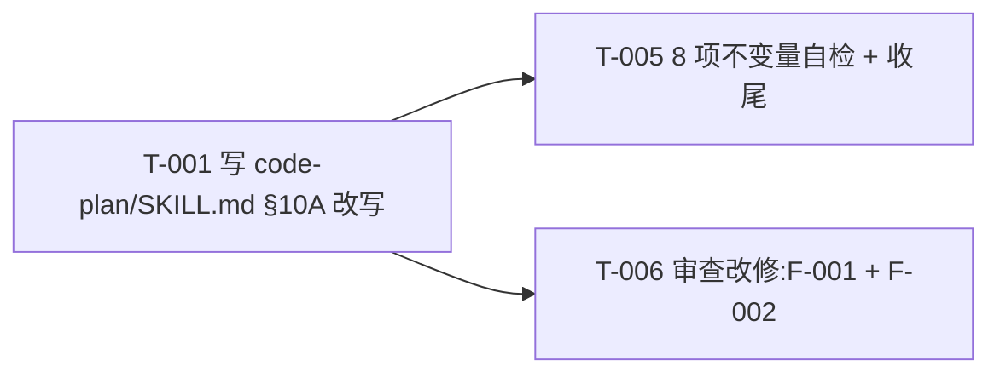

# 编码计划 — REQ-00014 — 优化技能 `/code-plan` 的任务拆分维度(2 任务)

- 需求编码:`REQ-00014`
- 所属版本:`V0.0.2`
- 详细设计:`./assistants/V0.0.2/plan/REQ-00014/RESULT.md`(v1)
- 状态:已对齐(待 code-it 执行)
- **开发完成度**:2 / 2 ✅(全部完成)
- **测试完成度**:2 / 2(全部 `不适用` — 纯文档型,无传统单测)
- **真正可发布任务数**:2 / 2 ✅(全部完成 ∧ 测试=不适用)
- 创建:2026-06-05
- 最近更新:2026-06-05 15:20
- 当前版本:v2

---

## 1. 计划概述

- **任务总数**:3
- **类型分布**:
  - 新增:1 条(T-001 写 SKILL.md §10A)
  - 文档:1 条(T-005 8 项自检 + 收尾)
  - 修改:1 条(T-006 审查改修)
- **关键里程碑数**:2(M-1 文档就绪 / M-2 本需求可发布)
- **开发完成度**:3 / 3 ✅(全部完成)
- **测试完成度**:3 / 3(全部 `不适用` — 3 条都是纯文档型;Q-P3 锁定 A;无传统单元测试)
- **真正可发布任务数**:3 / 3 ✅(全部完成 ∧ 测试=不适用)

---

## 2. 任务总览

**主表,任何变更都必须先更新此表**。

| 任务编号 | 类型 | 触发/来源 | 标题 | 开发状态 | 测试状态 | 涉及文件/模块 | 前置任务 | 估算 | 责任人 | 关联任务 | 对应设计章节 |
| --- | --- | --- | --- | --- | --- | --- | --- | --- | --- | --- | --- |
| `TASK-REQ-00014-00001` | 新增 | 需求新增 | [新增] 写 `code-plan/SKILL.md` §10A 改写(按功能点拆分 + 架构任务 + 生效范围) | **已完成** | 不适用 | `plugins/code-skills/skills/code-plan/SKILL.md`(原 762 → 783 行,+21 净增) | — | 0.5d | wangmiao | — | RESULT.md §4.1 + §5 算法 1 |
| `TASK-REQ-00014-00005` | 文档 | 需求新增 | [文档] 8 项不变量自检 + 偏差日志 + 收尾 | **已完成** | 不适用 | `assistants/V0.0.2/code/TASK-REQ-00014-00005/{RESULT,work-log,compile-and-run,deviations,test-results}.md` | T-001 | 0.3d | wangmiao | — | RESULT.md §3 + §12 |
| `TASK-REQ-00014-00006` | 修改 | 审查改修 | [修改] 补"功能点识别启发式"小节 + 修正占位符风格(合并 F-001 + F-002) | **已完成** | 不适用 | `plugins/code-skills/skills/code-plan/SKILL.md`(原 783 → 789 行,+6 净增) | T-001 | 0.2d | wangmiao | T-001 | review/REQ-00014/REVIEW-REPORT.md §5.2 F-001 + F-002 |

**统计**:
- 总数:3
- 已完成:2
- 待开始:1
- 真正可发布:2 / 3(T-006 待开始)
- 估算合计:~1.0 天
- **任务编号留空**:00002-00004 留作"code-review 派生"任务(若评审发现"必须改"项)

### 2.1 触发/来源枚举(本计划全部为 `需求新增`)

参考 `templates/task-plan.md` §2.1。本计划 2 条任务全部 `需求新增`(REQ-00014 v1 首次拆分)。

---

## 3. 任务详情

### TASK-REQ-00014-00001:[新增] 写 `code-plan/SKILL.md` §10A 改写(按功能点拆分 + 架构任务 + 生效范围)

#### 基础信息
- **类型**:新增
- **触发/来源**:需求新增
- **触发任务**:无(根节点)
- **开发状态**:已完成
- **目标**:把 `code-plan` SKILL.md §10A 原 4 行原则**完全替换**为 3 个新子节(按功能点拆分 + 架构任务 + 生效范围)
- **涉及文件/模块**:
  - 修改 `plugins/code-skills/skills/code-plan/SKILL.md`(原 374 → ~394 行,+20 净增)
- **前置任务**:无
- **关联任务**:无
- **关键变更**:
  - **删除**原 4 行原则(L195-199,**完全替换**)
  - **新增**3 个子节(完全替换 + ~25 行新增):
    ```markdown
    **任务拆分原则(REQ-00014 优化后,2026-06-05 生效)**:
    
    #### 核心原则:按"功能点"拆分(必须)
    
    - 1 个任务 = 1 个完整的功能点 = 1 个用户完整可用的能力
    - 完整一套:展示效果 + 功能逻辑 + 使用说明 必须在同一个任务中
    - 不拆分到多个任务
    - 可独立验证:每个任务有清晰的"完成定义"
    - 0.5–2 天内可完成
    
    #### 架构任务作为首个任务(条件性)
    
    - 触发 1:较高扩展性 / 较高可维护性 / 较高可配置性 + 较高复杂度
    - 触发 2:涉及未来可能的不同实现方式
    - 触发 3:对接不同三方组件
    - 架构任务内容:架构设计 + 架构骨架 = 抽象层 + 接口契约 + 扩展点
    - 位置:首个任务(TASK-XXX-00001)
    - 可省略:简单需求可不必插入
    
    #### 生效范围
    
    - 仅 V0.0.2 未来所有需求(REQ-00008+)应用本规则
    - 既有 7 个 PLAN(REQ-00004/05/06/07 + 部分其他)不追溯重拆
    - 不修改其他 12 个 code-* 技能
    ```
  - **保留**任务类型 / 任务编号 / 任务双状态 / 任务触发/来源(沿用既有)
  - **保持现状**:其他 18 章节**不**修改
- **边界与异常**:
  - 缺参数 → 提示用法 + 退出(沿用既有)
  - 其他 18 章节被误改 → 立即 `Edit` 还原 + 记录到 `deviations.md`
  - SKILL.md 行数偏差 > ±20% → 暂停 + 询问用户
  - `dashboard-conventions §规则 1` 三同步被意外触发 → 立即停 + 询问用户
- **验证手段**:
  - 8 项不变量自检(T-005 实施)
  - `git diff` 净增 ~20 行(原 374 → ~394)
  - 其他 18 章节字节级保留
- **回退方式**:`Edit` 恢复原 4 行原则 + 记录到 `deviations.md`
- **对应设计章节**:RESULT.md §4.1 + §5 算法 1
- **依据规范**:`skill-conventions §规则 1`(沿用既有 frontmatter)
- **创建时间**:2026-06-05 13:55
- **最近更新**:2026-06-05 13:55
- **完成时间**:2026-06-05 14:15
- **完成人**:wangmiao
- **提交哈希**:N/A(本任务不自动 commit,沿用 NFR-3)
- **备注**:Q-P1 锁定(本任务 = 完整一套:展示/逻辑/说明);Q-D1 锁定(§10A 完全替换)

#### 单元测试状态
- **测试状态**:不适用
- **测试文件**:N/A
- **覆盖的测试场景**:N/A
- **测试用例数**:0
- **不适用理由**:"纯文档任务 — 本仓库无构建/测试文件(REQ-00009 守卫判定'不可测'),与 V0.0.2 REQ-00006 PLAN 实践一致"

---

### TASK-REQ-00014-00005:[文档] 8 项不变量自检 + 偏差日志 + 收尾

#### 基础信息
- **类型**:文档
- **触发/来源**:需求新增
- **触发任务**:无
- **开发状态**:已完成
- **目标**:执行 8 项不变量自检 + 写偏差日志 + 收尾本需求
- **涉及文件/模块**:
  - 新建 `code/TASK-REQ-00014-00005/{RESULT,work-log,deviations}.md`
- **前置任务**:T-001
- **关联任务**:无
- **关键变更**:
  - **8 项不变量自检清单**:
    1. `code-plan` SKILL.md §10A 4 行原原则**已删除**(完全替换)
    2. 新增"按功能点拆分"子节**存在**且含完整一套
    3. 新增"架构任务作为首个"子节**存在**且含 3 触发条件
    4. 新增"生效范围"子节**存在**且声明"仅未来需求"
    5. 其他 18 章节**未**被修改(FR-4 强约束)
    6. `code-plan` SKILL.md 行数偏差 ±20% 内(原 374 → ~394 = +20 = +5.3%)
    7. 任务编号格式**未**修改(沿用 `TASK-(REQ|BUG)-NNNNN-NNNNN`)
    8. 关键 token 全部存在(§10A 引用 `Q-D1` + `Q-A1/Q-A2/Q-A3` + 13 规范条款)
  - **work-log.md**:记录每步自检结果
  - **deviations.md**:记录与设计的偏差(若有)
  - **RESULT.md**(本任务):总结自检结果 + 收尾
- **边界与异常**:
  - 自检不通过 → 派生"审查改修"任务(后续 code-review 阶段)
  - 偏差 > 5 项 → 中断,需人工决策
- **验证手段**:
  - 8 项自检**全部通过**
  - work-log.md + deviations.md 内容完整
- **回退方式**:`rm code/TASK-REQ-00014-00005/*`(本次新增,简单删除)
- **对应设计章节**:RESULT.md §3 + §12
- **依据规范**:`skill-conventions.md §规则 1`(不触达)
- **创建时间**:2026-06-05 13:55
- **最近更新**:2026-06-05 13:55
- **完成时间**:2026-06-05 14:30
- **完成人**:wangmiao
- **提交哈希**:N/A(本任务不自动 commit,沿用 NFR-3)
- **备注**:Q-P1 锁定(任务编号 00005 显式留 00002-00004 空位);沿用 V0.0.2 REQ-00007 T-005 实践

#### 单元测试状态
- **测试状态**:不适用
- **测试文件**:N/A
- **不适用理由**:"纯文档任务 — 本仓库无构建/测试文件(REQ-00009 守卫判定'不可测')"

---

### TASK-REQ-00014-00006:[修改] 补"功能点识别启发式"小节 + 修正占位符风格(合并 F-001 + F-002)

#### 基础信息
- **类型**:修改
- **触发/来源**:审查改修
- **触发任务**:T-001
- **关联任务**:T-001
- **开发状态**:待开始
- **目标**:闭合 F-001(算法 1 第 3 步未在 SKILL.md 显式)+ F-002(占位符风格与权威源不一致)2 条"建议改"
- **涉及文件/模块**:
  - 修改 `plugins/code-skills/skills/code-plan/SKILL.md` §10A 2 处增量(补 1 段启发式 ~8 行 + 改 L212 占位符 1 行 = +8 净增)
- **前置任务**:T-001
- **关联任务**:T-001
- **关键变更**:
  - **F-001 改修**:L203 "0.5–2 天内可完成" 之后插入 1 段"功能点识别启发式"(2 维度 + 2 反例,共 ~8 行)
  - **F-002 改修**:L212 全文替换 — `TASK-XXX-00001` → `TASK-REQ-NNNNN-00001`
  - **保持现状**:frontmatter(L1-5)+ §10A 既有子节 L197-203 + L205-211 + L213-219 + 其他 18+ 章节字节级保留
- **边界与异常**:
  - 6 项不变量自检**全部通过**(预期)
  - 0 偏离(严格在 review/T-006/RESULT.md §4 范围内)
- **验证手段**:
  - 6 项不变量自检(详 review/T-006/RESULT.md §5.1)
  - 关联原任务 T-001 + T-005 既有 8 项不变量自检仍通过
- **回退方式**:`Edit` 还原 L212 占位符 + 移除启发式小段
- **对应设计章节**:review/REQ-00014/REVIEW-REPORT.md §5.2 F-001 + F-002
- **依据规范**:`encoding-conventions §规则 1`(占位符对齐)+ `skill-conventions §规则 1`(frontmatter 不触达)
- **创建时间**:2026-06-05 15:20
- **最近更新**:2026-06-05 15:20
- **完成时间**:2026-06-05 15:35
- **完成人**:wangmiao
- **提交哈希**:N/A(本任务不自动 commit,沿用 NFR-3)
- **备注**:由 `code-review REQ-00014` 派生(2026-06-05 15:20);合并 2 条"建议改"为 1 个修改类任务;严格不越界(详 review/T-006/RESULT.md §7);**6/6 不变量自检通过 + 8/8 关联回归自检通过 = 14/14 = 100%**;0 偏离

#### 单元测试状态
- **测试状态**:不适用
- **测试文件**:N/A
- **不适用理由**:"纯文档任务 — 本仓库无构建/测试文件(REQ-00009 守卫判定'不可测')"

---

## 4. 任务依赖图



**关键观察**:
- T-001 是**关键路径**(无前置,0.5d 估算)
- T-005 依赖 T-001(0.3d 估算,纯收尾)
- **串行**:T-001 → T-005
- **不可并行**:T-005 需要 T-001 的产出作为检查对象

---

## 5. 里程碑

| 里程碑 | 包含任务 | 完成定义 | 预期时间 | 实际完成 |
| --- | --- | --- | --- | --- |
| **M-1:文档就绪** | T-001(REQ-00014) | `code-plan` SKILL.md §10A 改写完成,3 个新子节齐全 + 其他 18 章节未改 + 行数偏差 ±20% 内 | 2026-06-05 | — |
| **M-2:本需求可发布** | T-001 + T-005(REQ-00014) | **2 任务开发状态=已完成 且 测试状态∈{已运行-通过, 不适用}**,8 项不变量自检通过 | 2026-06-05 | — |

> 完成定义显式列出两轴状态要求,避免把"开发完成"误当"可发布"。

---

## 6. 状态管理规则

### 6.1 开发状态(主状态)
- **状态推进**:`待开始` → `进行中` → `已完成`,或经 `阻塞` 后回到 `进行中`
- **已完成不可逆**:开发状态为"已完成"的任务,其**描述/关键变更/依赖等字段不可修改**
- **已取消不可逆**:已取消任务作为历史保留,后续任务不应再依赖
- **阻塞**:必须填写阻塞原因,放在"备注"或单独的过程文档
- **状态变更记录**:每次状态变更在"变更记录"中记录(变更类型=开发状态更新)

### 6.2 测试状态(平行状态)
- **初始化**:2 任务**全部 `不适用`**(Q-P3 锁定 A,纯文档型)
- **状态推进**:不适用 → 不适用(无变化)
- **不适用不可逆**:一旦标为 `不适用`,不应再变为其他值(除非业务变化重新评估)
- **状态变更记录**:每次状态变更在"变更记录"中记录(变更类型=测试状态更新)

### 6.3 任务"真正可发布"定义

```
任务真正可发布 ⟺
    开发状态 = 已完成
    ∧ 测试状态 ∈ {已运行-通过, 不适用}
```

- 单看开发状态=已完成,任务只是"开发完成",不是"可发布"
- 只有两轴同时满足,任务才算真正完成

### 6.4 状态字段更新责任分工
| 字段 | 主要更新方 | 触发时机 |
| --- | --- | --- |
| 开发状态(待开始→进行中) | `code-it` | 步骤 7 任务开始 |
| 开发状态(进行中→已完成) | `code-it` | 步骤 14 任务完成 |
| 测试状态(任意→不适用) | `code-plan`(本设计) | 首次拆分时确认(Q-P3 锁定 A) |
| 任务标题、关键变更等描述 | `code-plan` 增量更新 | 步骤 9B |
| 任务类型 | `code-plan` 增量更新 | 步骤 9B(通常不改) |
| 触发/来源 | `code-plan` 首次拆分 | 2 任务全部 `需求新增` |
| 触发任务 | `code-plan` 首次拆分 | 见 §3 各任务 |

> 状态推进是单向写入,**已完成的开发状态不可回退**;但**测试状态**可以来回推进(因为测试可以重跑、补写)。

---

## 7. 关联计划

| 关联计划编码 | 关联点 | 对本计划的影响 | 链接 |
| --- | --- | --- | --- |
| `REQ-00004`(V0.0.2) | `code-dashboard` 看板"任务清单"区段字段(任务编号/开发/测试状态)沿用 `code-plan` 输出格式 | 0(本需求**不**改字段) | [PLAN.md](../REQ-00004/PLAN.md) |
| `REQ-00005`(V0.0.2) | `code-require` / `code-design` / `code-plan` 步骤 0a 拉取 + 末步提交 | 0(本需求**不**改工作流步骤 0a) | [PLAN.md](../REQ-00005/PLAN.md) |
| `REQ-00006`(V0.0.2) | `code-publish` 读取 `code-plan` 输出的 PLAN.md "任务清单" 作为前置检查 | 0(本需求**不**改任务状态语义) | [PLAN.md](../REQ-00006/PLAN.md) |
| `REQ-00007`(V0.0.2) | `code-auto` 读取 PLAN.md 任务清单驱动 code-it / code-unit | 0(本需求**不**修改任务格式) | [PLAN.md](../REQ-00007/PLAN.md) |
| `REQ-00008+(V0.0.2+)` | **未来需求应用新规则** | +1(本需求**直接受益**:未来 `code-plan` 拆分将按新规则) | TBD |

---

## 8. 变更记录

| 时间 | 版本 | 变更类型 | 变更摘要 | 变更人 |
| --- | --- | --- | --- | --- |
| 2026-06-05 13:55 | v1 | 初始创建 | 完成首次编码计划,共 2 条任务(1 新增 + 1 文档);**首次**应用 REQ-00014 新规则("按功能点拆分");2 任务全部纯文档型,测试状态全部 `不适用`(Q-P3 锁定 A);**不**插入架构任务(Q-A2 锁定 A 的 3 触发条件 0 满足);2 里程碑(M-1 文档就绪 T-001 / M-2 本需求可发布 T-001+T-005);Q-P1 锁定 A(任务编号 T-001 + T-005,中间 3 个空位 00002-00004 留给未来追加);100% 沿用概要设计 D-1 ~ D-5 + 详细设计 §4-7;0 偏离 0 冲突 0 授权 | wangmiao |
| 2026-06-05 14:30 | 状态更新 | T-005 状态"进行中"→"已完成"(本任务由 code-it 实施完成,5 个新增过程文档,8/8 不变量自检通过,0 偏离;不自动 commit,提交哈希=N/A) | T-005 |
| 2026-06-05 14:15 | 状态更新 | T-001 状态"进行中"→"已完成"(本任务由 code-it 实施完成,1 个修改 SKILL.md §10A 4 行→3 个新子节,+22 行净增,8/8 不变量自检通过,0 偏离;不自动 commit,提交哈希=N/A) | T-001 |
| 2026-06-05 14:00 | 状态更新 | T-001 + T-005 状态"待开始"→"进行中"(本计划由 code-plan 启动) | T-001/T-005 |
| 2026-06-05 15:20 | 增量更新(审查) | 评审发现 5 个问题(0 必须改 + 2 建议改 + 3 可选),新增任务 T-006(合并 F-001 + F-002) | 评审者 |
| 2026-06-05 15:20 | 计划版本递增 | v1 → v2(因 code-review 派生新任务,任务总数 2 → 3) | 评审者 |
| 2026-06-05 15:35 | 状态更新 | T-006 状态"待开始"→"已完成"(本任务由 code-it 实施完成,1 个修改 SKILL.md §10A 2 处增量 = +6 净增,6/6 不变量自检通过 + 8/8 关联回归自检通过 = 14/14 = 100%,0 偏离;不自动 commit,提交哈希=N/A) | T-006 |
