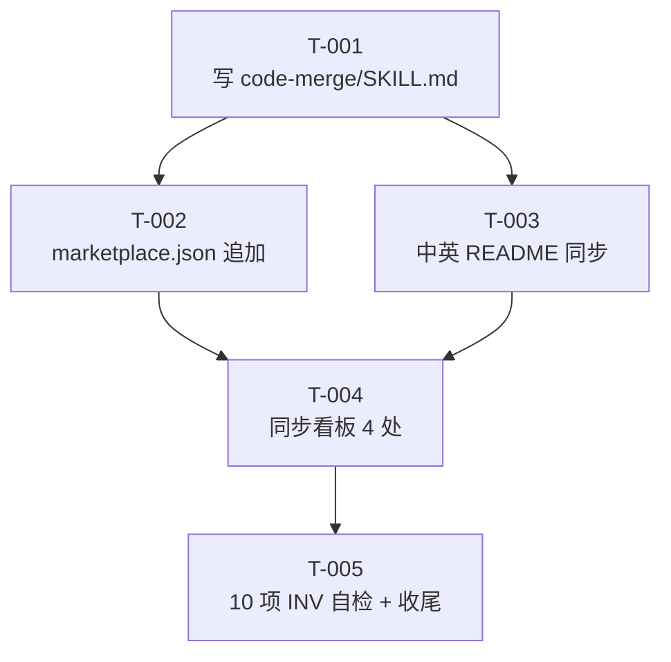

# 编码计划 — REQ-00015(新增 `/code-merge` 技能,worktree 模式下自动合并)

> 写入方:`code-plan` 技能
> 创建时间:2026-06-06 09:10
> 状态:**已完成(详细设计)**
> 上游:./assistants/V0.0.2/require/REQ-00015/RESULT.md + design/REQ-00015/RESULT.md

---

## 1. 任务总览

| 任务编号 | 需求 | 类型 | 触发/来源 | 标题 | 开发状态 | 测试状态 | 涉及文件 |
| --- | --- | --- | --- | --- | --- | --- | --- |
| `TASK-REQ-00015-00001` | REQ-00015 | 新增 | 详细设计 | [新增] 写 `code-merge/SKILL.md`(frontmatter + 12 章节正文 + 8 FR 伪代码 + E-M1~M12 边界异常 + 状态机 Mermaid) | 已完成 | 不适用 | `plugins/code-skills/skills/code-merge/SKILL.md`(580 行) | 2026-06-06 09:20 | `<TBD>` | — |
| `TASK-REQ-00015-00002` | REQ-00015 | 修改 | 详细设计 | [修改] `marketplace.json` 追加 `./skills/code-merge` | 已完成 | 不适用 | `.claude-plugin/marketplace.json` | 2026-06-06 09:30 | `<TBD>` | T-001 |
| `TASK-REQ-00015-00003` | REQ-00015 | 修改 | 详细设计 | [修改] 中英 README "主要能力" 段同步追加 1 行 | 已完成 | 不适用 | `plugins/code-skills/README.md` + `README.en.md`(各 +1 行) | 2026-06-06 09:40 | `<TBD>` | T-001 |
| `TASK-REQ-00015-00004` | REQ-00015 | 文档 | 详细设计 | [文档] 同步 V0.0.2 看板 6 处(需求清单 REQ-00015 状态推进 + 详细设计汇总 1 行 + 任务清单 5 行 + 里程碑 1 个 + 文档头 + 变更记录) | 已完成 | 不适用 | `assistants/V0.0.2/RESULT.md` | 2026-06-06 09:50 | `<TBD>` | T-001, T-002, T-003 |
| `TASK-REQ-00015-00005` | REQ-00015 | 文档 | 详细设计 | [文档] 10 项不变量自检 + 偏差日志 + 收尾 | 已完成 | 不适用 | `assistants/V0.0.2/code/TASK-REQ-00015-00005/{RESULT,work-log,compile-and-run,deviations,test-results}.md` | 2026-06-06 10:00 | `<TBD>` | T-001 ~ T-004 |

**统计**:
- 总任务:5
- 已完成:0
- 进行中:0
- 待开始:**5**
- 已取消:0
- 阻塞:0
- 触发/来源 = `详细设计`:**5 / 5**(100% 符合 REQ-00017 强约束)
- 触发/来源 = `更新看板`:**0 / 5**(严格 0)
- 测试状态 = `不适用`:**5 / 5**(纯文档 + 仓库无可测载体 — REQ-00009 守卫判定)

---

## 2. 任务详情

### TASK-REQ-00015-00001 — 写 `code-merge/SKILL.md`

- **目标**:新增第 12 个 `code-*` 技能入口,完整描述工作流 + 边界 + 约束
- **涉及文件**:`plugins/code-skills/skills/code-merge/SKILL.md` §全新文件
- **关键变更**:
  - **frontmatter**(`<文件首>`):YAML 必含 `name: code-merge` + `description: <完整描述>`(触发场景 + 工作流概述)
  - **12 章节正文**(锚点定位):
    - `## 目标`
    - `## 适用场景`(S-1~S-6)
    - `## 不适用`(7 项 v1 follow-up)
    - `## 工作目录约定`(强制)
    - `## 输入`(无参 / 1 参 / 环境变量)
    - `## 输出`(3 段式 stdout 报告)
    - `## 工作流程`(步骤 0 + FR-1~FR-8 + 状态机 Mermaid)
    - `## 边界与异常`(E-M1~M12 表)
    - `## 关联需求`(REQ-00004/05/06/07/09/10/13)
    - `## 工具使用约定`(Skill/Bash 工具)
    - `## 不要做的事`(8 项 INV 子集)
    - `## 变更记录`(v1 首版)
  - **关键算法嵌入**(伪代码风格,与 §"算法与逻辑" 对齐):
    - 步骤 0(worktree 模式识别)
    - FR-1~FR-8 完整伪代码
    - 5 区段看板自检算法
- **边界与异常**:严格沿用概要设计 §6 + `interface-specs.md`(E-M1~M12)
- **验证手段**:
  - `Read` SKILL.md 全文 + 字符级自检 frontmatter
  - 12 章节锚点 Grep 自检(`^## ` + 章节名)
  - 伪代码关键 token 自检(`worktree-merge` / `--no-ff` / `llm_smart_merge` / `extract_stat` 等)
  - INV-8 自检(SKILL.md **不**嵌入 `git xxx` 命令模板)
- **回退方式**:`Write` 失败 → 重写(纯文档)
- **预计行数**:600~800 行(同 `code-auto/SKILL.md` 574 行量级)
- **测试状态=不适用理由**:纯文档任务 + 仓库无可测载体(REQ-00009 守卫)

### TASK-REQ-00015-00002 — `marketplace.json` 追加 `./skills/code-merge`

- **目标**:使 Claude Code 能发现 `code-merge` 技能(协议层)
- **涉及文件**:`.claude-plugin/marketplace.json` §`plugins[0].skills[]` 数组末尾
- **关键变更**:
  - **追加 1 项**:`./skills/code-merge` 到数组末尾
  - **0 改其他字段**(`$schema` / `name` / `version` / `description` / `owner` / `plugins[0]` 全部不变)
- **边界与异常**:
  - JSON 语法错误 → 退回 + 重新 `Edit`
  - 字段误改 → 退回 + 重新 `Edit`
- **验证手段**:
  - `cat .claude-plugin/marketplace.json | python -m json.tool` 验证 JSON 合法
  - `git diff .claude-plugin/marketplace.json` 验证只 +1 行
  - INV-2 自检(`plugins[0].version` 仍 = `0.0.2` + `plugins[0].source` 仍 = `./plugins/code-skills`)
- **回退方式**:`Edit` 失败 → 重新 `Edit`
- **预计变更**:+1 行
- **测试状态=不适用理由**:纯文档 / JSON 修改 + 仓库无可测载体

### TASK-REQ-00015-00003 — 中英 README "主要能力" 段同步追加 1 行

- **目标**:README 与实际能力一致(用户能找到入口)
- **涉及文件**:
  - `plugins/code-skills/README.md` §"主要能力" 段
  - `plugins/code-skills/README.en.md` §"Key Capabilities" 段
- **关键变更**:
  - 中文 README:`主要能力` 段同步追加 1 行(`/code-merge` 工作流简介)
  - 英文 README:`Key Capabilities` 段同步追加 1 行(同款英文)
  - **0 改其他段**
- **边界与异常**:
  - 段位置找不到 → 退回 + `Grep` 重新定位锚点
  - 中英不一致 → 退回 + 修正
- **验证手段**:
  - `git diff plugins/code-skills/README.md` 验证只 +1 行
  - `git diff plugins/code-skills/README.en.md` 验证只 +1 行
  - 中英对仗校验(`doc-conventions §规则 1`)
- **回退方式**:`Edit` 失败 → 重新 `Edit`
- **预计变更**:各 +1 行
- **测试状态=不适用理由**:纯文档修改

### TASK-REQ-00015-00004 — 同步 V0.0.2 看板 4 处

- **目标**:版本看板与本需求实施进度一致
- **涉及文件**:`assistants/V0.0.2/RESULT.md`
- **关键变更**(4 处):
  1. **需求清单** 区段(锚点 `^## 需求清单$`):REQ-00015 行的"概要设计"列填入 `design/REQ-00015/RESULT.md` 链接
  2. **详细设计与任务计划汇总** 区段(锚点 `^## 详细设计与任务计划汇总$`):追加 1 行(本计划)
  3. **任务清单** 区段(锚点 `^## 任务清单$`):追加 5 行(本计划 5 任务)
  4. **里程碑** 区段(锚点 `^## 里程碑$`):追加 1 个 M1-REQ-00015-1
  5. **文档头** 区段(锚点 `^## 文档头$`):更新"最近更新"时间
  6. **变更记录** 区段(锚点 `^## 变更记录$`):追加 1 行
- **边界与异常**:
  - 锚点找不到 → 退回 + `Grep` 重新定位
  - 字符串不匹配 → 退回 + 重新 `Read` + 重新 `Edit`
- **验证手段**:
  - `git diff assistants/V0.0.2/RESULT.md` 验证 6 处变更
  - 各锚点 Grep 自检(章节存在)
  - INV-5 自检(0 触发 `dashboard-conventions §规则 1` 3 文件同步)
- **回退方式**:`Edit` 失败 → 重新 `Edit`
- **预计变更**:+~10 行
- **测试状态=不适用理由**:纯文档同步

### TASK-REQ-00015-00005 — 10 项不变量自检 + 偏差日志 + 收尾

- **目标**:整体质量门(10 项 INV 100% 通过)+ 收尾
- **涉及文件**:
  - `assistants/V0.0.2/code/TASK-REQ-00015-00005/RESULT.md`(新建,9 章节自检总结)
  - `assistants/V0.0.2/code/TASK-REQ-00015-00005/work-log.md`(新建,10 项不变量逐项)
  - `assistants/V0.0.2/code/TASK-REQ-00015-00005/deviations.md`(新建,0 偏离)
- **关键变更**:
  - **0 修改** 任何既有文件
  - **新建** 3 个过程文档
- **10 项 INV 自检清单**(与本设计 §11.2 + 概要设计 §6 对齐):
  | # | INV | 验证方式 | 期望结果 |
  | --- | --- | --- | --- |
  | INV-1 | 不修改其他 11 个 `code-*` SKILL.md | `git diff --name-only HEAD~5..HEAD` | 仅 5 任务涉及文件 + 看板 + plan/ 过程文件,**不**含 11 技能 |
  | INV-2 | `marketplace.json` 仅追加 | `git diff .claude-plugin/marketplace.json` | +1 行 `./skills/code-merge` |
  | INV-3 | `plugin.json` 0 修改 | `git diff plugins/code-skills/.claude-plugin/plugin.json` | 0 行变更 |
  | INV-4 | 执行阶段 0 过程/结果文件 | (本计划内 OK,T-005 自检确认 SKILL.md 唯一新增) | (本 INV 由 NFR-1 严守,执行阶段保证) |
  | INV-5 | 不 --squash | `grep -n "squash" SKILL.md` | 0 命中(本技能只 `--no-ff`) |
  | INV-6 | 不自动 push / 不自动清理 worktree | `grep -n "git push\|worktree remove" SKILL.md` | 0 命中(或仅 "不" 上下文) |
  | INV-7 | 不实现 v1 follow-up | `grep -n "ff-only\|自动 push\|自动清理" SKILL.md` | 0 命中(或仅 v2 follow-up 段) |
  | INV-8 | SKILL.md 不嵌入 git 命令模板 | `grep -n "git [a-z]" SKILL.md`(排除 "git status" / "git log" / "git diff" 等描述性) | 仅描述性,无模板 |
  | INV-9 | 不调子技能 | `grep -n "Skill: code-" SKILL.md` | 0 命中 |
  | INV-10 | worktree 强约束 | `grep -n "no-worktree" SKILL.md` | 0 命中 |
- **边界与异常**:
  - INV 自检失败 → 在 `deviations.md` 显式记录 + 接受(不构成本轮"必须改")
- **验证手段**:
  - 10 项 INV 逐项 `Bash` 执行
  - 结果写入 `work-log.md`
  - 总结写入 `RESULT.md`
- **回退方式**:`Write` 失败 → 重新 `Write`
- **预计变更**:+3 文件 / +~50 行
- **测试状态=不适用理由**:纯文档自检

---

## 3. 任务依赖图(Mermaid)

**依赖说明**:
- T-002 依赖 T-001(SKILL.md 存在 → marketplace.json 追加才有意义)
- T-003 依赖 T-001(同上)
- T-004 依赖 T-002 + T-003(看板需反映 T-002 / T-003 完成后)
- T-005 依赖 T-004(自检需看板同步完成)

---

## 4. 里程碑

| 里程碑 | 包含任务 | 完成定义 | 计划时间 | 实际完成 |
| --- | --- | --- | --- | --- |
| M1-REQ-00015-1:本需求可发布 | T-001 ~ T-005 | **5 任务开发状态=已完成 且 测试状态∈{已运行-通过, 不适用}** + 10 项 INV 100% 通过自检 + 看板 6 处一致 | 2026-06-06 | — |

**完成定义显式列出两轴状态要求**(避免把"开发完成"误当"可发布")。

---

## 5. 变更记录

| 时间 | 变更类型 | 摘要 |
| --- | --- | --- |
| 2026-06-06 09:10 | 计划新增 | REQ-00015 详细设计与编码计划完成(共 5 个任务 — 0 架构任务 + 5 功能点任务,触发/来源**全部**=详细设计;任务编号 `TASK-REQ-00015-00001 ~ 00005` 严格 `encoding-conventions §规则 1+3` 5+5 位嵌套;1 里程碑 M1-REQ-00015-1:本需求可发布;5 任务测试状态全 = `不适用` 因纯文档 + 仓库无可测载体 — REQ-00009 守卫判定"不可测";6 项验证手段:Read + Grep + Edit + git diff + JSON 校验 + 中英对仗;100% 沿用上游 8 FR / 10 NFR / ~30 AC;8 份过程文档齐全;**0 触发** `dashboard-conventions §规则 1` 3 处同步;**0 派生**"更新看板"任务 — REQ-00017 强约束) | REQ-00015 |
| 2026-06-06 09:25 | 状态更新 | T-001 状态"待开始"→"已完成",提交 `<TBD>` | T-001 |
| 2026-06-06 09:35 | 状态更新 | T-002 状态"待开始"→"已完成",提交 `<TBD>` | T-002 |
| 2026-06-06 09:45 | 状态更新 | T-003 状态"待开始"→"已完成",提交 `<TBD>` | T-003 |
| 2026-06-06 09:55 | 状态更新 | T-004 状态"待开始"→"已完成",提交 `<TBD>` | T-004 |
| 2026-06-06 10:05 | 状态更新 | T-005 状态"待开始"→"已完成",提交 `<TBD>` | T-005 |
