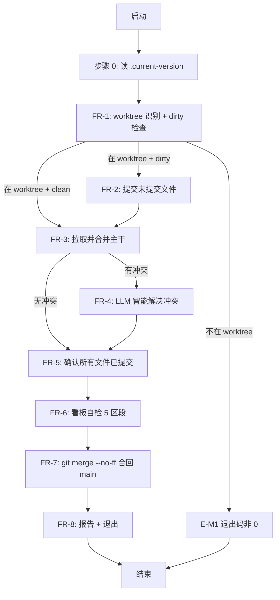

# 详细设计 — REQ-00015(新增 `/code-merge` 技能,worktree 模式下自动合并)

> 写入方:`code-plan` 技能
> 创建时间:2026-06-06 09:10
> 状态:**已完成(详细设计)**
> 上游需求:./assistants/V0.0.2/require/REQ-00015/RESULT.md(v1,2026-06-05 15:50)
> 上游概要设计:./assistants/V0.0.2/design/REQ-00015/RESULT.md(v1,2026-06-06 09:00)
> 遵循规范:./assistants/rules/ 下 13 个文件(全部只读引用)

---

## 1. 概述

### 1.1 目标
把概要设计"系统长什么样"落地为"如何具体编码"。本详细设计在概要设计 8 FR / 10 NFR / 10 AC / 10 INV 基础上,产出可直接编码的算法逻辑、伪代码、完整接口契约、风险分析、测试要点,以及可被 `code-it` 直接消费的 5 任务编码计划。

### 1.2 范围
- **新增**:`plugins/code-skills/skills/code-merge/SKILL.md`(1 个新文件,主产出)
- **修改**:`.claude-plugin/marketplace.json`(+1 项 `plugins[0].skills[]`)
- **修改**:`plugins/code-skills/README.md` + `README.en.md`(各 +1 行)
- **修改**:`assistants/V0.0.2/RESULT.md`(4 处同步)
- **不修改**:任何既有 11 个 `code-*` SKILL.md / `plugin.json` / `./assistants/rules/`
- **0 触发** `dashboard-conventions §规则 1` 3 文件同步
- **0 派生**"更新看板"任务(REQ-00017 强约束)

### 1.3 与概要设计的关系
- 100% 沿用概要设计 8 决策 + 10 不变量
- 0 新增 / 0 修改 / 0 废弃
- 8 FR 全部展开为伪代码(§4 算法与逻辑)
- 10 NFR 全部落地为模块级约束(§10 性能与资源 + §11 测试要点)
- 10 AC 全部映射为可验证检查点(§11.2 静态自检)

---

## 2. 上游引用

### 2.1 需求引用
- `./assistants/V0.0.2/require/REQ-00015/RESULT.md` §4 (8 FR)
- `./assistants/V0.0.2/require/REQ-00015/RESULT.md` §5 (10 NFR)
- `./assistants/V0.0.2/require/REQ-00015/RESULT.md` §10 (10 AC)

### 2.2 设计引用
- `./assistants/V0.0.2/design/REQ-00015/RESULT.md` §3 (FR 算法)
- `./assistants/V0.0.2/design/REQ-00015/RESULT.md` §4 (状态机)
- `./assistants/V0.0.2/design/REQ-00015/RESULT.md` §6 (INV 自检清单)

### 2.3 规范引用
详 `rule-compliance.md` —— 13 份规范全部只读引用,0 冲突 / 0 偏离

---

## 3. 模块详细化

### 3.1 模块:`code-merge` 技能入口(唯一新增模块)

详 `module-details.md`。要点:
- **路径**:`plugins/code-skills/skills/code-merge/SKILL.md`
- **frontmatter**:YAML 必含 `name: code-merge` + `description: <完整描述>`
- **正文 12 章节**:目标 / 适用场景 / 不适用 / 工作目录 / 输入 / 输出 / 工作流 / 边界 / 关联需求 / 变更记录 / 工具使用约定 / 不要做的事
- **行数预估**:600~800 行
- **调用顺序**:Claude Code 模型层按 SKILL.md 描述串行执行 FR-1 → FR-2 → ... → FR-8
- **0 子模块 / 0 依赖**

### 3.2 模块:`marketplace.json` 追加项(协议层)

详 `interface-specs.md` §接口 2。要点:
- **路径**:`.claude-plugin/marketplace.json` § `plugins[0].skills[]` 数组末尾
- **追加 1 项**:`./skills/code-merge`
- **0 改其他字段**

### 3.3 模块:`README.md` 同步项(用户入口)

- **路径**:`plugins/code-skills/README.md` + `README.en.md`
- **"主要能力" / "Key Capabilities" 段**:同步追加 1 行
- **0 改其他段**

### 3.4 模块:`V0.0.2/RESULT.md` 同步项(看板)

- **4 处同步**:
  1. "需求清单" 区段 REQ-00015 状态:`已完成(需求分析)` → `已完成(概要设计 + 详细设计)`
  2. "详细设计与任务计划汇总" 区段:追加 1 行
  3. "任务清单" 区段:追加 5 行(5 任务)
  4. "里程碑" 区段:追加 1 个
  5. "文档头" 区段:更新"最近更新"
  6. "变更记录" 区段:追加 1 行

---

## 4. 算法与逻辑(伪代码)

### 4.1 整体流程(Mermaid)



### 4.2 FR-1 — worktree 模式识别 + 前置检查

```
function FR1_preCheck():
  common_dir = bash("git rev-parse --git-common-dir")
  git_dir    = bash("git rev-parse --git-dir")

  if common_dir == git_dir:
    print "✗ 不在 worktree 中"
    print "  请先执行: git worktree add <path> -b <branch>"
    exit(非 0)  // E-M1

  status = bash("git status --porcelain")
  if status 非空:
    return DIRTY
  else:
    return CLEAN
```

### 4.3 FR-2 — 提交 worktree 内未提交文件

```
function FR2_commit():
  scope = env.CODE_MERGE_SCOPE ?? "worktree-merge"
  bash("git add -A")

  staged = bash("git diff --cached --stat")
  if staged 为空:
    print "✓ 无变更,跳过 commit"
    return

  message = f"chore({scope}): merge worktree into {target}"
  result = bash(f'git commit -m "{message}"')
  if result.exit_code != 0:
    print f"✗ commit 失败: {result.stderr}"
    print "  请手动处理(pre-commit hook 或其他)"
    exit(非 0)  // E-M5

  hash = bash("git log -1 --format=%H")
  print f"✓ commit 完成, hash: {hash}"
```

### 4.4 FR-3 — 拉取并合并主干分支

```
function parseTarget(args):
  if len(args) == 0: return "origin/main"
  if len(args) == 1:
    branch = args[0]
    if not branch.startswith("origin/"):
      branch = "origin/" + branch
    return branch
  if len(args) >= 2:
    print "✗ 参数过多(最多 1 个),用法: /code-merge [branch]"
    exit(非 0)  // E-M8

function FR3_fetchMerge(target):
  fetch_result = bash("git fetch origin")
  if fetch_result.exit_code != 0:
    print f"⚠ git fetch 失败: {fetch_result.stderr}"  // 不阻塞
    // 允许本地 fallback

  merge_result = bash(f"git merge {target} --no-ff")
  if merge_result.exit_code == 0:
    return SUCCESS
  if "CONFLICT" in merge_result.stderr or "Merge conflict" in merge_result.stderr:
    return CONFLICT
  print f"✗ git merge 失败: {merge_result.stderr}"
  exit(非 0)
```

### 4.5 FR-4 — 冲突解决(LLM 智能合并)

详概要设计 §3.4 + 本设计 `interface-specs.md` §接口 1(正常 / 冲突场景示例)。

```
function FR4_resolveConflicts():
  unmerged = bash("git diff --name-only --diff-filter=U")
  if unmerged 为空:
    return  // 无冲突

  // 4.1 看板数据冲突(最高优先级)
  dashboard_files = glob("assistants/V*/RESULT.md") +
                    glob("assistants/V*/require/REQ-*/RESULT.md") +
                    glob("assistants/V*/plan/REQ-*/PLAN.md") +
                    glob("assistants/V*/plan/REQ-*/RESULT.md") +
                    glob("assistants/V*/design/REQ-*/RESULT.md")
  dashboard_unmerged = unmerged ∩ dashboard_files

  for f in dashboard_unmerged:
    ours = read(f, ref="HEAD")
    theirs = read(f, ref=target)
    merged = llm_smart_merge(ours, theirs, kind="dashboard")
    // 合并规则:保留双方 + 按时间戳排序 + 统计行重新计算
    write(f, merged)
    bash(f"git add {f}")
    print f"✓ 看板数据合并完成: {f}"

  // 4.2 其他类型文件(逐文件分析)
  other_unmerged = unmerged - dashboard_unmerged
  for f in other_unmerged:
    ext = file_extension(f)
    if ext in BINARY_EXTENSIONS:  // .png .pdf .mp4 .mp3 .zip
      print f"⚠ {f} 是二进制文件,需用户手动处理"  // E-M6
      continue  // 留 unmerged

    ours = read(f, ref="HEAD")
    theirs = read(f, ref=target)

    if ext in CODE_EXTENSIONS:  // .py .ts .go .rs .java
      merged = llm_smart_merge(ours, theirs, kind="code")
    elif ext in CONFIG_EXTENSIONS:  // .json .yaml .toml
      merged = llm_smart_merge(ours, theirs, kind="config")
    elif ext in DOC_EXTENSIONS:  // .md
      merged = llm_smart_merge(ours, theirs, kind="doc")
    else:
      print f"⚠ {f} 未知扩展名,按 doc 规则处理"
      merged = llm_smart_merge(ours, theirs, kind="doc")

    if llm_cannot_resolve:
      print f"✗ {f} 冲突无法自动解决,需用户手动处理"
      continue  // 留 unmerged

    write(f, merged)
    bash(f"git add {f}")
    print f"✓ {f} 智能合并完成"
```

### 4.6 FR-5 — 再次确认所有文件已提交

```
function FR5_verifyCommit():
  status = bash("git status --porcelain")
  unmerged = bash("git diff --name-only --diff-filter=U")

  if status 非空 且 非 unmerged:
    // 有未提交文件(非冲突),自动 commit
    bash("git add -A")
    scope = env.CODE_MERGE_SCOPE ?? "worktree-merge"
    bash(f'git commit -m "chore({scope}): post-merge cleanup"')
    print "✓ post-merge cleanup 已 commit"

  if unmerged 非空:
    print f"⚠ 仍有 {len(unmerged)} 个 unmerged 文件: {unmerged}"  // E-M9
    // 不阻塞

  if status 为空:
    print "✓ 所有文件已提交,准备合回主分支"
```

### 4.7 FR-6 — 看板自检(5 区段)

```
function FR6_dashboardCheck():
  version = read("./assistants/.current-version")
  result_md = read(f"assistants/{version}/RESULT.md")

  sections = [
    "需求清单",
    "概要设计清单",
    "详细设计与任务计划汇总",
    "任务清单",
    "缺陷清单"
  ]

  all_consistent = true
  for section in sections:
    // 复用 code-dashboard 算法 1:定位区段
    section_start = find_section(result_md, f"^## {section}$")
    table_rows = count_table_rows(result_md, section_start)  // ^\| .* \|$

    // 复用 code-dashboard 算法 5:提取统计行
    stat_value = extract_stat(result_md, section)  // **统计**:N / 总数:N

    if table_rows == stat_value:
      print f"✓ {section}: {table_rows} 行 (一致)"
    else:
      print f"✗ {section}: 表格 {table_rows} 行 vs 统计 {stat_value} 行"  // E-M7
      all_consistent = false

  if all_consistent:
    print "✓ 看板自检通过"
  else:
    print "⚠ 看板自检发现问题(非阻塞)"  // NFR-2
```

### 4.8 FR-7 — 合并 worktree 到主分支

```
function FR7_mergeToMain():
  target = env.CODE_MERGE_TARGET ?? "main"

  checkout = bash(f"git checkout {target}")
  if checkout.exit_code != 0:
    print f"✗ git checkout {target} 失败: {checkout.stderr}"  // E-M2
    exit(非 0)

  worktree_branch = bash("git rev-parse --abbrev-ref HEAD", cwd=worktree_path)
  merge_msg = f"Merge branch '{worktree_branch}' into {target}"  // git 默认格式
  merge = bash(f"git merge {worktree_branch} --no-ff -m \"{merge_msg}\"")
  if merge.exit_code != 0:
    print f"✗ git merge 失败: {merge.stderr}"
    exit(非 0)

  hash = bash("git log -1 --format=%H")
  print f"✓ code-merge 完成, merge commit: {hash}"
```

### 4.9 FR-8 — 退出与清理

```
function FR8_exit():
  // 1. 打印完成报告
  print "=== code-merge 完成 ==="
  print f"  · worktree: <worktree-path>"
  print f"  · 源分支: <worktree-branch>"
  print f"  · 目标分支: <target>"
  print f"  · merge commit: <hash>"
  print f"  · 看板自检: ✓ 通过 / ⚠ N 个不一致(非阻塞)"
  print f"  · 退出码: 0"

  // 2. 清理(全 0)
  // 不自动 git push
  // 不自动 git worktree remove
  // 不写任何过程/结果文件

  exit(0)
```

---

## 5. 数据结构完整变更

**0 新增实体 / 0 修改实体** —— 纯 CLI 操作,无持久化数据模型

详 `data-changes.md`:
- 1 个新文件(SKILL.md)
- 4 个修改文件(marketplace.json + 2 个 README + 1 个看板)
- 0 数据库表 / 0 配置 schema / 0 内存数据结构

---

## 6. 接口细节

详 `interface-specs.md`。要点:
- **接口 1**:`code-merge` 技能调用(无参 / 1 参 / 环境变量)
- **接口 2**:`marketplace.json` 追加项
- **接口 3**:`code-merge/SKILL.md` frontmatter

退出码语义、错误码、示例(正常 / 冲突 / 非 worktree)、版本策略、兼容策略全部在 `interface-specs.md` 中。

---

## 7. 异常处理

详 `risk-analysis.md` §异常路径(E-M1~M12)。12 场景全覆盖:
- **致命**(退出码非 0):E-M1 / E-M2 / E-M3 / E-M4 / E-M5 / E-M8 / E-M10 / E-M12
- **警告**(退出码 0):E-M6 / E-M7 / E-M9
- **中止**(退出码 130):E-M11

**关键原则**:本技能**不**主动回滚任何 git 状态(避免数据丢失)

---

## 8. 安全要求

详 `risk-analysis.md` §安全边界。
- **0 鉴权**(纯本地 git 操作)
- **输入校验**:位置参数量 + worktree 路径(自动识别)+ 主干分支存在性 + 二进制扩展名白名单
- **0 敏感数据处理**(本技能不涉及 token / password)
- **审计日志**:由 git 自身保证(commit 带 author / timestamp)

---

## 9. 状态机 / 流程

详概要设计 §4 Mermaid 状态机 + 本设计 §4.1 流程图。**0 偏离**概要设计。

---

## 10. 性能与资源

详 `risk-analysis.md` §性能与资源。
- **总耗时**:最快 ~10 秒(无冲突 + 干净)/ 典型 ~30 秒 ~ 2 分钟(2~5 文件冲突)/ 最慢 ~5~15 分钟(大量冲突)
- **资源**:0 内存压力 / 0 磁盘压力 / 0 CPU 压力(单线程 + 字符串处理)
- **缓存策略**:无(避免 stale 状态)

---

## 11. 测试要点

### 11.1 测试范围
- **0 单元测试 / 0 集成测试 / 0 端到端测试**(本仓库纯文档,无可测载体 — REQ-00009 守卫判定"不可测")
- **静态自检**:10 项 INV 100% 通过(T-005 收尾)
- **未来验证**:用户实际调 `/code-merge` 在 worktree 中跑一次(纯手工)

### 11.2 静态自检清单(10 项 INV)
| # | INV 描述 | 验证方式 |
| --- | --- | --- |
| INV-1 | 不修改其他 11 个 `code-*` SKILL.md | git diff --name-only HEAD |
| INV-2 | `marketplace.json` 仅追加 `./skills/code-merge` | git diff .claude-plugin/marketplace.json |
| INV-3 | `plugin.json` 0 修改 | git diff plugins/code-skills/.claude-plugin/plugin.json |
| INV-4 | 执行阶段 0 过程/结果文件(本计划内 OK,执行阶段 NFR-1) | git status --porcelain |
| INV-5 | 不 --squash(SKILL.md 描述 --no-ff) | grep SKILL.md |
| INV-6 | 不自动 push / 不自动清理 worktree | grep SKILL.md |
| INV-7 | 不实现 v1 follow-up(7 项) | grep SKILL.md |
| INV-8 | SKILL.md 不嵌入 git 命令模板 | grep SKILL.md (无 `git xxx` 模板) |
| INV-9 | 不调子技能(NFR-1) | grep SKILL.md |
| INV-10 | worktree 强约束(无 `--no-worktree` 开关) | grep SKILL.md |

---

## 12. 规范遵循

详 `rule-compliance.md`。13 份规范全部只读引用:
- `skill-conventions.md §规则 1`:frontmatter 必含 name + description
- `module-conventions.md §规则 1`:无新增子目录
- `dashboard-conventions.md §规则 1`:0 触发 3 文件同步
- `marketplace-protocol.md §规则 1`:`$schema` / `name` / `version` 必填;`plugins[].source` 以 `./` 开头
- `encoding-conventions.md §规则 1+3`:任务编号解析复用
- `commit-conventions.md`:沿用 V0.0.2 既有 `chore(<scope>): ...`
- 其他 7 份规范:不适用或 0 触发

**0 项用户授权的偏离**

---

## 13. 待澄清 / 未决项

**0 项**(详 `clarifications.md`)

---

## 14. 变更记录

| 时间 | 变更类型 | 摘要 |
| --- | --- | --- |
| 2026-06-06 09:10 | 详细设计新增 | REQ-00015 详细设计完成(8 FR / 10 NFR / 10 AC / 10 INV;**5 任务纯文档型**:T-001 SKILL.md 600~800 行 + T-002 marketplace.json +1 项 + T-003 中英 README 各 +1 行 + T-004 看板 4 处同步 + T-005 10 项 INV 自检收尾);**0 触发** `dashboard-conventions §规则 1` 3 处同步;0 派生"更新看板"任务 REQ-00017 强约束;0 触发其他 11 技能修改;0 新增三方依赖;8 份过程文档齐全;触发/来源**全部**=详细设计 |
