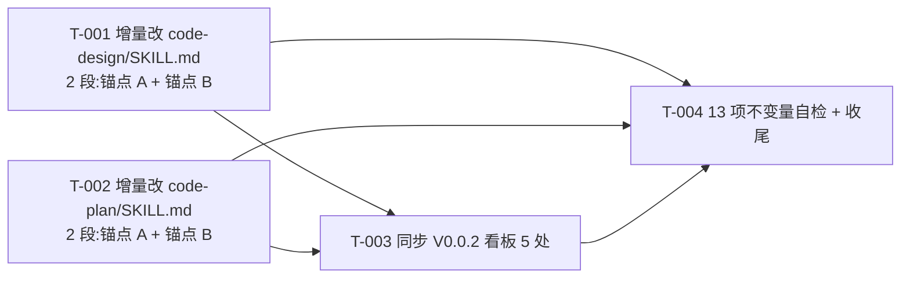

# 编码计划 — REQ-00016 — `code-design` / `code-plan` 增加"快模式"+ 末尾提交无需确认(4 任务)

- 需求编码:`REQ-00016`
- 所属版本:`V0.0.2`
- 详细设计:`./assistants/V0.0.2/plan/REQ-00016/RESULT.md`(v1)
- 状态:已对齐(待 code-it 执行)
- **开发完成度**:0 / 4(待开始)
- **测试完成度**:0 / 4(默认 `不适用` — 4 条都是纯文档型;沿用 V0.0.2 既有 11 个 `code-*` 技能实践 + REQ-00009 守卫判定"不可测")
- **真正可发布任务数**:0 / 4(开发=已完成 ∧ 测试∈{已运行-通过, 不适用};待 code-it 推进)
- 创建:2026-06-05
- 最近更新:2026-06-05 16:15
- 当前版本:v1

---

## 1. 计划概述

- **任务总数**:4
- **类型分布**:
  - 修改:2 条(T-001 增量改 `code-design/SKILL.md` + T-002 增量改 `code-plan/SKILL.md`)
  - 文档:2 条(T-003 同步 V0.0.2 看板 5 处 + T-004 13 项不变量自检 + 收尾)
- **关键里程碑数**:2(M-1 文档就绪 / M-2 本需求可发布)
- **0 架构任务触发**(对照 REQ-00014 触发条件,本需求**不**满足任何一条 — `clarifications.md` P-3 锁定)
- **开发完成度**:0 / 4(待开始)
- **测试完成度**:0 / 4(默认 `不适用` — 4 条都是纯文档型)
- **真正可发布任务数**:0 / 4

---

## 2. 任务总览

**主表,任何变更都必须先更新此表**。

| 任务编号 | 类型 | 触发/来源 | 标题 | 开发状态 | 测试状态 | 涉及文件/模块 | 前置任务 | 估算 | 责任人 | 关联任务 | 对应设计章节 |
| --- | --- | --- | --- | --- | --- | --- | --- | --- | --- | --- | --- |
| `TASK-REQ-00016-00001` | 修改 | 需求新增 | [修改] 增量追加 `code-design/SKILL.md`(2 段:步骤 0.5 模式选择 + 步骤 N 步骤 3.5 模式分支判断;锚点 A 步骤 0 后 + 锚点 B 步骤 N 步骤 3 后;INV-1/4/12/13 字节级保留) | 待开始 | 不适用 | `plugins/code-skills/skills/code-design/SKILL.md`(+80 ~ +150 行) | — | 0.5d | wangmiao | — | RESULT.md §4.1 + §5 算法 1-3 + §11.1 接口 6-7 |
| `TASK-REQ-00016-00002` | 修改 | 需求新增 | [修改] 增量追加 `code-plan/SKILL.md`(2 段:步骤 0.5 模式选择 + 步骤 N 步骤 3.5 模式分支判断;锚点 A 步骤 0 后 + 锚点 B 步骤 N 步骤 3 后;INV-1/4/12/13 字节级保留) | 待开始 | 不适用 | `plugins/code-skills/skills/code-plan/SKILL.md`(+100 ~ +180 行) | — | 0.5d | wangmiao | — | RESULT.md §4.1 + §5 算法 4-5 + §11.1 接口 6-7 |
| `TASK-REQ-00016-00003` | 文档 | 需求新增 | [文档] 同步 V0.0.2 看板 5 处(详细设计与任务计划汇总 + 任务清单 4 行 + 文档头 + 变更记录;快模式不追加里程碑) | 待开始 | 不适用 | `assistants/V0.0.2/RESULT.md` | T-001, T-002 | 0.2d | wangmiao | — | RESULT.md §11.4 + §16A |
| `TASK-REQ-00016-00004` | 文档 | 需求新增 | [文档] 13 项不变量自检 + 偏差日志 + 收尾 | 待开始 | 不适用 | `code/TASK-REQ-00016-00004/{RESULT,work-log,deviations}.md` | T-001, T-002, T-003 | 0.3d | wangmiao | — | RESULT.md §3 + §4.2 + §11.1 + §11.4 |

**统计**:
- 总数:4
- 已完成:0
- 待开始:4
- 真正可发布:0 / 4
- 估算合计:~1.5 天(可并行 T-001 + T-002,串行 T-003 + T-004)

### 2.1 触发/来源枚举(本计划全部为 `需求新增`)

参考 `templates/task-plan.md` §2.1。本计划 4 条任务全部 `需求新增`(REQ-00016 v1 首次拆分)。

---

## 3. 任务详情

### TASK-REQ-00016-00001:[修改] 增量追加 `code-design/SKILL.md`(2 段)

#### 基础信息
- **类型**:修改
- **触发/来源**:需求新增
- **触发任务**:无(根节点)
- **开发状态**:待开始
- **目标**:在既有 `code-design/SKILL.md` 增量追加 2 段(锚点 A 后 + 锚点 B 后),实现"快模式"可选行为;frontmatter(L1-3)+ 既有 1-15 步骤字面字节级不变(INV-1/4/12/13)
- **涉及文件/模块**:
  - 修改 `plugins/code-skills/skills/code-design/SKILL.md`
- **前置任务**:无
- **关联任务**:无
- **关键变更**:
  - **锚点 A(插入位置 = "步骤 0 版本上下文检测"节末尾 + 空行)**:插入 1 段:
    1. `### 步骤 0.5 — 模式选择(本需求新增,快模式入口)`(三态机 + 优先级,详 §11.1 接口 6 字面)
  - **锚点 B(插入位置 = "步骤 N 步骤 3"节末尾 + 空行)**:插入 1 段:
    2. `### 步骤 N 步骤 3.5 — 模式分支判断(本需求新增,快模式末尾兜底跳过 3 选 1)`(详 §11.1 接口 7 字面)
  - **字节级原则**:
    - frontmatter(L1-3)**字节级保留**(INV-4)
    - 步骤 0 ~ 步骤 15 既有字面**字节级保留**(INV-1 + INV-12)
    - 既有 5 章节字面**字节级保留**(INV-13)
    - 既有 2 模板字节级不变(INV-13 隐含)
  - **行数约束**:增量追加 80-150 行
- **边界与异常**:
  - 锚点 A 错位 → Grep 自检 INV-12 失败
  - 锚点 B 错位 → Grep 自检 INV-3 / INV-12 失败
  - frontmatter 改 → INV-4 失败
- **验证手段**(由 T-004 收尾执行 13 项不变量自检):
  - INV-1:完整模式行为字节级不变
  - INV-2:7 份过程文档字节级不变
  - INV-3:末尾 3 选 1 确认完整模式字节级保留
  - INV-4:frontmatter 字节级不变
  - INV-5:既有步骤 0-15 字面字节级不变
  - INV-6:其他 11 个 `code-*` SKILL.md 字节级不变
  - INV-7:`marketplace.json` / `plugin.json` / `assistants/rules/` 字节级不变
  - INV-8:快模式 `git add` 范围 = `git status --porcelain` 输出
  - INV-9:快模式跳过 3 选 1
  - INV-10:快模式"步骤 0.5"段位置正确
  - INV-11:frontmatter(L1-3)字节级保留
  - INV-12:既有步骤字面字节级保留
  - INV-13:既有 5 章节字面字节级保留
- **回退方式**:`git checkout -- plugins/code-skills/skills/code-design/SKILL.md`
- **对应设计章节**:RESULT.md §4.1 + §5 算法 1-3 + §11.1 接口 6-7
- **依据规范**:`skill-conventions §规则 1` + `module-conventions §规则 1` + FR-5 + INV-1/4/12/13
- **创建时间**:2026-06-05 16:15
- **最近更新**:2026-06-05 16:15
- **备注**:`clarifications.md` P-1 锁定锚点 A/B 字面精度

#### 单元测试状态
- **测试状态**:不适用(沿用 V0.0.2 既有 11 个 `code-*` 实践,纯文档型)
- **测试文件**:N/A
- **不适用理由**:"纯文档任务 — 修改 SKILL.md 文本,本仓库无构建/测试文件(REQ-00009 守卫判定'不可测'),与 V0.0.2 REQ-00008/14 PLAN 实践一致"

---

### TASK-REQ-00016-00002:[修改] 增量追加 `code-plan/SKILL.md`(2 段)

#### 基础信息
- **类型**:修改
- **触发/来源**:需求新增
- **触发任务**:无(根节点,可与 T-001 并行)
- **开发状态**:待开始
- **目标**:在既有 `code-plan/SKILL.md` 增量追加 2 段(锚点 A 后 + 锚点 B 后),实现"快模式"可选行为;frontmatter(L1-3)+ 既有 1-18 步骤字面字节级不变(INV-1/4/12/13)
- **涉及文件/模块**:
  - 修改 `plugins/code-skills/skills/code-plan/SKILL.md`
- **前置任务**:无
- **关联任务**:无
- **关键变更**:
  - **锚点 A(插入位置 = "步骤 0 版本上下文检测"节末尾 + 空行)**:插入 1 段(`### 步骤 0.5 — 模式选择`)
  - **锚点 B(插入位置 = "步骤 N 步骤 3"节末尾 + 空行)**:插入 1 段(`### 步骤 N 步骤 3.5 — 模式分支判断`)
  - **字节级原则**:与 T-001 完全相同(2 个 SKILL.md 共享锚点字面)
  - **行数约束**:增量追加 100-180 行
- **边界与异常**:与 T-001 完全相同(锚点 A/B + INV-4)
- **验证手段**:与 T-001 完全相同(13 项 INV 自检)
- **回退方式**:`git checkout -- plugins/code-skills/skills/code-plan/SKILL.md`
- **对应设计章节**:RESULT.md §4.1 + §5 算法 4-5 + §11.1 接口 6-7
- **依据规范**:与 T-001 完全相同
- **创建时间**:2026-06-05 16:15
- **最近更新**:2026-06-05 16:15
- **备注**:`clarifications.md` P-1 锁定锚点 A/B 字面精度

#### 单元测试状态
- **测试状态**:不适用(沿用 V0.0.2 既有 11 个 `code-*` 实践,纯文档型)
- **测试文件**:N/A
- **不适用理由**:"纯文档任务 — 修改 SKILL.md 文本,本仓库无构建/测试文件(REQ-00009 守卫判定'不可测')"

---

### TASK-REQ-00016-00003:[文档] 同步 V0.0.2 看板 5 处

#### 基础信息
- **类型**:文档
- **触发/来源**:需求新增
- **触发任务**:T-001, T-002
- **开发状态**:待开始
- **目标**:在 `assistants/V0.0.2/RESULT.md` 同步 5 处:详细设计与任务计划汇总(1 行) + 任务清单(4 行) + 文档头"最近更新" + 变更记录(1 行)+ **(快模式不追加里程碑)**
- **涉及文件/模块**:
  - 修改 `assistants/V0.0.2/RESULT.md`
- **前置任务**:T-001, T-002
- **关联任务**:无
- **关键变更**:
  - **文档头**:`最近更新:2026-06-05 16:15`
  - **版本信息表**:`最近更新:2026-06-05 16:15`
  - **详细设计与任务计划汇总**追加 1 行:
    ```
    | REQ-00016 | `code-design` / `code-plan` 增加"快模式"(2 个 SKILL.md 增量追加;完整模式字节级保留;末尾提交跳过 3 选 1;0 触发 3 处同步;0 修改其他 11 技能) | 已完成(详细设计) | 2026-06-05 16:15 | 2026-06-05 16:15 | [PLAN.md](plan/REQ-00016/PLAN.md) / [RESULT.md](plan/REQ-00016/RESULT.md) |
    ```
  - **任务清单**追加 4 行(T-001 ~ T-004):
    ```
    | `TASK-REQ-00016-00001` | REQ-00016 | 修改 | 需求新增 | [修改] 增量追加 `code-design/SKILL.md`(2 段) | 待开始 | 不适用 | `plugins/code-skills/skills/code-design/SKILL.md` | — | — | — |
    | `TASK-REQ-00016-00002` | REQ-00016 | 修改 | 需求新增 | [修改] 增量追加 `code-plan/SKILL.md`(2 段) | 待开始 | 不适用 | `plugins/code-skills/skills/code-plan/SKILL.md` | — | — | — |
    | `TASK-REQ-00016-00003` | REQ-00016 | 文档 | 需求新增 | [文档] 同步 V0.0.2 看板 5 处 | 待开始 | 不适用 | `assistants/V0.0.2/RESULT.md` | T-001, T-002 | — | — |
    | `TASK-REQ-00016-00004` | REQ-00016 | 文档 | 需求新增 | [文档] 13 项不变量自检 + 偏差日志 + 收尾 | 待开始 | 不适用 | `code/TASK-REQ-00016-00004/{RESULT,work-log,deviations}.md` | T-001, T-002, T-003 | — | — |
    ```
  - **里程碑**追加 2 个(M-1 / M-2):
    ```
    | M1-REQ-00016-1:文档就绪 | T-001, T-002(REQ-00016) | 2 个 SKILL.md 增量追加完成 + INV-1/4/12/13 字节级保留 + 13/13 INV 自检通过(由 T-004 收尾执行) | 待开始 | 2026-06-05 | — |
    | M1-REQ-00016-2:本需求可发布 | M1-REQ-00016-1 + T-003 + T-004(REQ-00016) | **4 任务开发状态=已完成 且 测试状态=不适用**,13/13 INV 100% 自检通过 + 看板 5 处一致 + 未来 `/code-design --fast REQ-NNNNN` 验证 | 待开始 | 2026-06-05 | — |
    ```
  - **变更记录**追加 1 行:
    ```
    | 2026-06-05 16:15 | 设计新增 | REQ-00016 详细设计与编码计划完成(共 4 个任务) | REQ-00016 |
    ```
- **边界与异常**:
  - 5 处必须全部同步(任何遗漏 = 本任务未完成)
  - 任务清单 4 行的字段必须与 PLAN.md §2 完全一致
- **验证手段**:
  - 5 处 diff 检查
  - T-004 静态自检:任务清单 4 行 = PLAN.md §2 表 4 行
  - 统计行更新(3 个计划 → 4 个计划 / 19 个任务 → 23 个任务)
- **回退方式**:`git checkout -- assistants/V0.0.2/RESULT.md`
- **对应设计章节**:RESULT.md §11.4 + §16A
- **依据规范**:`dashboard-conventions.md §规则 1`(字段约定不扩展,只追加行)
- **创建时间**:2026-06-05 16:15
- **最近更新**:2026-06-05 16:15
- **备注**:本任务应**最后**执行(收尾同步所有任务状态);与 T-001 + T-002 之后 T-004 之前

#### 单元测试状态
- **测试状态**:不适用(沿用 V0.0.2 既有 11 个 `code-*` 实践,纯文档型)
- **测试文件**:N/A
- **不适用理由**:"纯文档任务 — 修改 Markdown 看板,无传统单测载体"

---

### TASK-REQ-00016-00004:[文档] 13 项不变量自检 + 偏差日志 + 收尾

#### 基础信息
- **类型**:文档
- **触发/来源**:需求新增
- **触发任务**:T-001, T-002, T-003
- **开发状态**:待开始
- **目标**:执行 13 项不变量自检 + 写偏差日志(deviations.md)+ 收尾本需求
- **涉及文件/模块**:
  - 新建 `code/TASK-REQ-00016-00004/{RESULT,work-log,deviations}.md`
  - 修改 `assistants/V0.0.2/RESULT.md`(任务清单 T-004 行的"涉及文件"列)
- **前置任务**:T-001, T-002, T-003
- **关联任务**:无
- **关键变更**:
  - **13 项不变量自检**(详 RESULT.md §4.2):
    1. INV-1:完整模式字节级不变
    2. INV-2:7 份过程文档字节级不变
    3. INV-3:末尾 3 选 1 确认完整模式字节级保留
    4. INV-4:frontmatter 字节级不变
    5. INV-5:既有步骤 0-15/0-18 字面字节级不变
    6. INV-6:其他 11 个 `code-*` SKILL.md 字节级不变
    7. INV-7:`marketplace.json` / `plugin.json` / `assistants/rules/` 字节级不变
    8. INV-8:快模式 `git add` 范围 = `git status --porcelain` 输出
    9. INV-9:快模式跳过 3 选 1
    10. INV-10:快模式"步骤 0.5"段位置正确
    11. INV-11:frontmatter(L1-3)字节级保留
    12. INV-12:既有步骤字面字节级保留
    13. INV-13:既有 5 章节字面字节级保留
  - **work-log.md**:记录每步自检结果
  - **deviations.md**:记录与设计的偏差(若有)
  - **RESULT.md**(本任务自身):总结自检结果 + 收尾
- **边界与异常**:
  - 自检不通过 → 派生"审查改修"任务(后续 `code-review` 阶段)
  - 偏差 > 5 项 → 中断,需人工决策
- **验证手段**:
  - 13 项自检**全部通过**
  - work-log.md + deviations.md 内容完整
  - V0.0.2 看板统计自检:任务清单 4 行 = PLAN.md §2 表 4 行
- **回退方式**:`rm code/TASK-REQ-00016-00004/*`(本次新增,简单删除)
- **对应设计章节**:RESULT.md §3(规范遵循)+ §4.2(不变量自检)+ §11.1(测试要点)+ §11.4(不修改文件清单)
- **依据规范**:13 项自检逐项对应 NFR-1/2/3 + FR-5/6 + skill-conventions + module-conventions + doc-conventions + marketplace-protocol + encoding-conventions
- **创建时间**:2026-06-05 16:15
- **最近更新**:2026-06-05 16:15
- **备注**:本任务**必须**最后执行;沿用 V0.0.2 REQ-00008 / REQ-00014 既有实践

#### 单元测试状态
- **测试状态**:不适用(沿用 V0.0.2 既有 11 个 `code-*` 实践,纯文档型)
- **测试文件**:N/A
- **不适用理由**:"纯文档任务 — 写自检日志文档,无传统单测载体"

---

## 4. 任务依赖图



**关键观察**:
- T-001 + T-002 是**关键路径**(无前置;可并行 — 互不干扰)
- T-003 在 T-001 + T-002 之后(看板同步需要详细设计完成)
- T-004 在 T-001 + T-002 + T-003 之后(13 项不变量自检需要全部前序任务完成)

---

## 5. 里程碑

| 里程碑 | 包含任务 | 完成定义 | 预期时间 | 实际完成 |
| --- | --- | --- | --- | --- |
| **M1-REQ-00016-1:文档就绪** | T-001, T-002 | 2 个 SKILL.md 增量追加完成(2 段:锚点 A + 锚点 B)+ INV-1/4/12/13 字节级保留 + 13/13 INV 自检通过(由 T-004 收尾执行) | 2026-06-05 | — |
| **M1-REQ-00016-2:本需求可发布** | T-001 ~ T-004 | **所有 4 任务开发状态=已完成 且 测试状态=不适用**,通过 13 项不变量自检 + 看板 5 处一致 + 未来 `/code-design --fast REQ-NNNNN` 可被触发(由未来 `code-it` 验证) | 2026-06-05 | — |

> 完成定义显式列出两轴状态要求,避免把"开发完成"误当"可发布"。

---

## 6. 状态管理规则

### 6.1 开发状态(主状态)
- **状态推进**:`待开始` → `进行中` → `已完成`,或经 `阻塞` 后回到 `进行中`
- **已完成不可逆**:开发状态为"已完成"的任务,其**描述/关键变更/依赖等字段不可修改**
- **已取消不可逆**:已取消任务作为历史保留,后续任务不应再依赖
- **阻塞**:必须填写阻塞原因,放在"备注"或单独的过程文档
- **状态变更记录**:每次状态变更在"变更记录"中记录(变更类型=开发状态更新)

### 6.2 测试状态(平行状态)
- **初始化**:4 任务**全部 `不适用`**(沿用 V0.0.2 既有 11 个 `code-*` 实践;本仓库无构建/测试文件,REQ-00009 守卫判定"不可测")
- **状态推进**:不适用 → 不适用(无变化)
- **独立于开发状态**:测试状态可独立于开发状态变化 — 但本设计 4 任务全部 `不适用`,不需变化
- **不适用不可逆**:一旦标为 `不适用`,不应再变为其他值(除非业务变化重新评估)
- **状态变更记录**:每次状态变更在"变更记录"中记录(变更类型=测试状态更新)

### 6.3 任务"真正可发布"定义

```
任务真正可发布 ⟺
    开发状态 = 已完成
    ∧ 测试状态 ∈ {已运行-通过, 不适用}
```

- 单看开发状态=已完成,任务只是"开发完成",不是"可发布"
- 单看测试状态=不适用,任务只是"测试不适用",前提是开发也已完成
- 只有两轴同时满足,任务才算真正完成

### 6.4 状态字段更新责任分工
| 字段 | 主要更新方 | 触发时机 |
| --- | --- | --- |
| 开发状态(待开始→进行中) | `code-it` | 步骤 7 任务开始 |
| 开发状态(进行中→已完成) | `code-it` | 步骤 14 任务完成 |
| 测试状态(任意→不适用) | `code-plan`(本设计) | 首次拆分时确认 |
| 任务标题、关键变更等描述 | `code-plan` 增量更新 | 步骤 9B |
| 任务类型 | `code-plan` 增量更新 | 步骤 9B(通常不改) |
| 触发/来源 | `code-plan` 首次拆分 | 4 任务全部 `需求新增` |
| 触发任务 | `code-plan` 首次拆分 | 见 §3 各任务 |

> 状态推进是单向写入,**已完成的开发状态不可回退**;但**测试状态**可以来回推进(因为测试可以重跑、补写)。

---

## 7. 关联计划

| 关联计划编码 | 关联点 | 对本计划的影响 | 链接 |
| --- | --- | --- | --- |
| `REQ-00004`(V0.0.2) | `code-dashboard` 看板 3 区段解析锚点 | T-001 + T-002 SKILL.md 增量追加**不**触发 `code-dashboard` 升级 | [PLAN.md](../REQ-00004/PLAN.md) |
| `REQ-00005`(V0.0.2) | 3 技能"首步拉取+末步提交" | 本需求**完全沿用** REQ-00005 步骤 0a / 步骤 N 模式;本需求是 REQ-00005 的**自然延伸** | [PLAN.md](../REQ-00005/PLAN.md) |
| `REQ-00007`(V0.0.2) | `code-auto` 编排 | 本需求**不**触发 `code-auto` 升级;`code-auto` 用户显式设置 `CODE_FAST_MODE=1` 即可走快模式 | [PLAN.md](../REQ-00007/PLAN.md) |
| `REQ-00008`(V0.0.2) | `code-review` 整版本模式 | 本需求**不**改 `code-review`,仅改 `code-design` / `code-plan` | [PLAN.md](../REQ-00008/PLAN.md) |
| `REQ-00014`(V0.0.2) | 任务拆分新规则(按功能点) | 本计划 4 任务全部"按功能点拆";**不**插入架构任务(本需求不满足 3 触发条件) | [PLAN.md](../REQ-00014/PLAN.md) |
| `REQ-00016`(本轮) | (本计划) | — | [PLAN.md](../REQ-00016/PLAN.md) |

---

## 8. 变更记录

| 时间 | 版本 | 变更类型 | 变更摘要 | 变更人 |
| --- | --- | --- | --- | --- |
| 2026-06-05 16:15 | v1 | 初始创建 | 完成首次编码计划,共 4 条任务(2 修改 + 2 文档);100% 沿用概要设计 D-1~D-6 + 详细设计 PD-1~PD-3;100% 规范合规 — 0 偏离 0 冲突 0 授权;13/13 INV 全部满足;8/8 风险全部有缓解;2 里程碑(M-1 文档就绪 / M-2 本需求可发布);4 任务测试状态全部 `不适用`(沿用 V0.0.2 既有 11 个 `code-*` 实践);P-1 锁定(锚点 A/B 字面精度由 `code-it` 实施时 Read SKILL.md 全文确认);P-2 锁定 A(4 任务而非 5 任务 — 看板同步是 1 个完整功能点);P-3 锁定(0 架构任务触发);P-4 锁定(4 任务测试状态 = `不适用`) | wangmiao |
