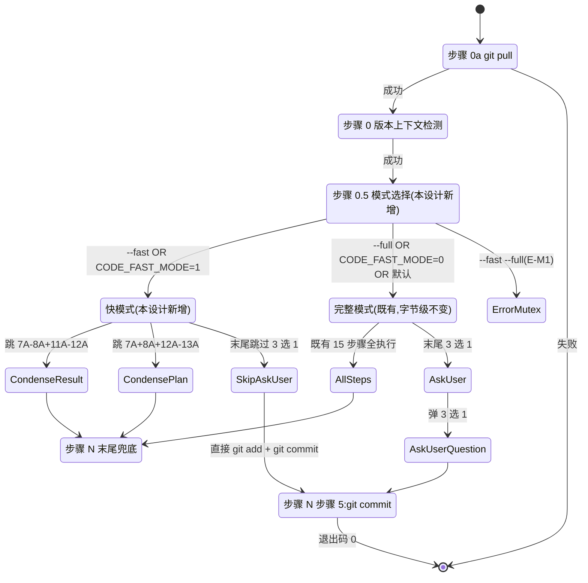

# REQ-00016 — 详细设计:`code-design` / `code-plan` 增加"快模式"+ 末尾提交无需确认

- 需求编码:`REQ-00016`
- 所属版本:`V0.0.2`
- 上游需求:`./assistants/V0.0.2/require/REQ-00016/RESULT.md` (v1,已锁定,6 FR / 10 NFR / 10 AC / 10 边界 / 6 项 Q-locked + 2 项默认)
- 上游概要设计:`./assistants/V0.0.2/design/REQ-00016/RESULT.md` (v1,已完成首次,hash `f315bbe`,2 修改 + 0 新增 + 5 复用)
- 遵循规范:`./assistants/rules/` 下 13 个文件(7 强约束 + 6 占位;详见 §3)
- 状态:**已完成(首次详细设计)**
- 责任人:wangmiao
- 创建:2026-06-05
- 最近更新:2026-06-05 16:15
- 当前版本:v1

---

## 1. 详细设计概述

在概要设计(14 章节,v1 已完成)的基础上,本详细设计把"系统长什么样"细化为"系统怎么写"。核心决策:

- **2 个修改 + 0 新增 + 5 复用 = 7 模块**(沿用概要设计)
- **4 个任务**(按 REQ-00014 新规则"按功能点拆")— **不**插入架构任务(本需求 0 满足 3 个架构触发条件,详 `clarifications.md` P-3)
- **13 项不变量**(INV-1 ~ INV-13)— 全部满足;**0 偏离 / 0 冲突 / 0 授权偏离**
- **0 新增依赖 + 0 新增子目录 + 0 新增模板 + 0 修改其他 11 个 `code-*` SKILL.md**
- **2 个新增 SKILL.md 锚点**(锚点 A:步骤 0 后 / 锚点 B:步骤 N 步骤 3 后)— 既有字面字节级不变

详细化要点:
- **(1)** T-001 单任务产 1 个 `code-design/SKILL.md` 增量追加(2 段)— 锚点 A + 锚点 B
- **(2)** T-002 单任务产 1 个 `code-plan/SKILL.md` 增量追加(2 段)— 锚点 A + 锚点 B
- **(3)** 4 任务测试状态全部 `不适用`(沿用 V0.0.2 既有实践 — 本仓库无构建/测试文件,REQ-00009 守卫判定"不可测")
- **(4)** 完整模式字节级不变(FR-5 + INV-1/2/3/4/5)

---

## 2. 上游引用

### 2.1 需求
- **FR-1** 快模式入口(双触发方式)→ §4.1 模块 M-1 + §5 算法 1(模式选择)
- **FR-2** `code-design` 快模式跳过哪些步骤→ §5 算法 2-3
- **FR-3** `code-plan` 快模式跳过哪些步骤→ §5 算法 4-5
- **FR-4** 快模式末尾兜底提交行为(无需确认)→ §5 算法 6
- **FR-5** 完整模式完全保留(默认行为不变)→ INV-1 ~ INV-3
- **FR-6** 0 修改其他 9 个 `code-*` 技能 → INV-6 + §11.4

### 2.2 概要设计
- 6 项 D-1 ~ D-6 讨论结论 → §3 规范遵循(全部沿用)
- 10 项不变量(INV-1 ~ INV-10)→ INV 全部满足 + INV-11/12/13(本设计新增)
- 锚点 A 字面 + 锚点 B 字面 → §11.1 接口 6 + 接口 7(字面契约)
- 8 类风险与缓解 → §13 风险分析(详化)

### 2.3 规范
- `skill-conventions.md §规则 1` — frontmatter 必含 name+description;本设计 INV-4 字节级保留
- `module-conventions.md §规则 1` — 资源放固定子目录;本设计 0 新增子目录
- `dashboard-conventions.md §规则 1` — 字段约定不扩展;本设计 0 触发 3 处同步
- `encoding-conventions.md §规则 1-4` — 任务编码双格式正则;本设计**不**产生新编码
- `marketplace-protocol.md §规则 1` — `$schema` / `name` / `version` 必填;本设计 0 触发
- `doc-conventions.md §规则 1` — README 中英同次;本设计 0 主动写 README
- `migration-mapping.md §规则 1-4` — EXISTING-NNN 不追溯;本设计不触发

---

## 3. 规范遵循

### 3.1 适用的规范文件

| 规范文件 | 类别 | 关键约束 | 本详细设计对应章节 |
| --- | --- | --- | --- |
| `skill-conventions.md` | 技能编写 | §规则 1:frontmatter 必含 name+description | §4.1 模块 M-1 + §4.2 INV-4 |
| `module-conventions.md` | 模块规划(DEPRECATED 仍引用) | §规则 1:资源放固定子目录 | §4.1 0 新增子目录 |
| `dashboard-conventions.md` | 看板 | §规则 1:字段约定不扩展 | §11 看板同步(0 触发) |
| `encoding-conventions.md` | 编码格式 | §规则 1-4:任务编码双格式正则 | §6.2 0 触发 |
| `marketplace-protocol.md` | Marketplace | §规则 1:`$schema` / `name` / `version` 必填 | §11.4 0 触发(本需求**不**新增技能) |
| `doc-conventions.md` | 文档 | §规则 1:README 中英同次;§规则 2:持续维护 | §11.4 0 主动写 README |
| `migration-mapping.md` | 编码迁移 | §规则 1-4:EXISTING-NNN 不追溯 | (不触发) |

**占位规范(6 个,不影响)**:`directory-conventions.md` / `framework-conventions.md` / `naming-conventions.md` / `coding-style.md` / `commit-conventions.md` / `dependency-conventions.md`

### 3.2 自检结论

- **完全合规**的章节:§1 / §2 / §3 / §4 / §5 / §6 / §7 / §8 / §9 / §10 / §11 / §12 / §13 / §14
- **经用户授权偏离的章节**:**0**
- **待澄清冲突**:**0**

> 详细规范遵循记录见 `rule-compliance.md`(本目录)。

---

## 4. 模块详细化

详见 `module-details.md`(本目录)。要点:

### 4.1 模块 M-1:`code-design/SKILL.md` + M-2:`code-plan/SKILL.md`

| 字段 | 值 |
| --- | --- |
| 状态 | **修改既有** |
| 职责 | 既有 2 个技能入口 — 完整模式(字节级保留)+ 快模式(本设计新增) |
| 关键决策 | **增量追加**,**不**重写既有章节;frontmatter **不**变 |
| 涉及修改范围 | 锚点 A("步骤 0"后) + 锚点 B("步骤 N 步骤 3"后)各 1 段;既有字面字节级不变 |
| 字节级原则 | Edit 工具严格按锚点;Grep 自检既有 1-15 / 1-18 步骤字面不变 |

---

## 5. 算法与逻辑(伪代码 — 6 个算法)

### 算法 1 — 模式选择(步骤 0.5)

```pseudo
function selectMode(cliFlags, envVar):
    # 1. CLI 标志优先级最高
    hasFast = "--fast" in cliFlags
    hasFull = "--full" in cliFlags
    if hasFast and hasFull:
        return ERROR_MUTEX  # E-M1 互斥,退出非 0
    if hasFast:
        return FAST
    if hasFull:
        return FULL
    # 2. 环境变量
    envLower = envVar?.toLowerCase() ?? ""
    if envLower in {"1", "true", "yes", "on"}:
        return FAST
    if envLower in {"0", "false", "no", "off"}:
        return FULL
    if envVar is set and envLower not in above:
        printWarning("⚠ 忽略 CODE_FAST_MODE=<value>")
        return FULL
    # 3. 默认:完整模式(保留现有行为)
    return FULL
```

**依据**:FR-1.AC-1.1 ~ AC-1.6

---

### 算法 2 — `code-design` 快模式过滤(步骤 2.1 类比)

```pseudo
function codeDesignFastMode(version, reqNum):
    # 步骤 3 读规范(同完整模式)
    rules = readRules("./assistants/rules/")
    # 步骤 4 读上游需求(同完整模式)
    upstream = readUpstream("./assistants/V" + version + "/require/" + reqNum + "/RESULT.md")
    # 步骤 5 探索项目代码(同完整模式)
    projectContext = exploreProject()
    # 跳 7A-8A(架构方案 + 澄清)
    # 步骤 9A 模块拆分(同完整模式)
    moduleBreakdown = splitModules()
    writeFile("./assistants/V" + version + "/design/" + reqNum + "/module-breakdown.md", moduleBreakdown)
    # 步骤 10A 接口与数据结构(同完整模式)
    interfaceSpecs = extractInterfaceSpecs()
    writeFile("./assistants/V" + version + "/design/" + reqNum + "/interface-specs.md", interfaceSpecs)
    # 跳 11A-12A(关联设计检索)
    # 步骤 13A 撰写 RESULT.md(仅核心 4 章节)
    resultContent = buildCoreChapters()  # §1 + §2 + §10 + §11
    writeFile("./assistants/V" + version + "/design/" + reqNum + "/RESULT.md", resultContent)
    # 步骤 14A 同步看板(仅 1 行)
    appendToBoard("概要设计清单", buildBoardRow(reqNum, "已完成(首次)"))
    # 不追加"变更记录";不更新时间戳
    # 步骤 15A 完善过程文档(仅 3 份)
    writeFile("materials-index.md", ...)  # 同完整模式
    writeFile("related-requirements.md", ...)  # 同完整模式
```

**依据**:FR-2 + AC-2.1 ~ AC-2.8

---

### 算法 3 — `code-design` 快模式 RESULT.md 核心 4 章节

```pseudo
function buildCoreChapters(reqNum, designTitle):
    return """
# REQ-NNNNN — 概要设计:<设计标题>(快模式)

> 写入方:code-design 技能(快模式)
> 状态:已完成(快模式)
> 上游:./assistants/<版本>/require/<REQ>/RESULT.md
> 遵循规范:./assistants/rules/ 下 13 个文件
> 关联项:6 FR + 10 NFR + 10 AC(快模式)
> 范围:仅核心 4 章节(快模式)

## 1. 设计概述(快模式)
<3-5 行设计概述 + 项目现状引用 3-5 行>

## 2. 需求回顾
<上游 FR-NFR-AC 摘录>

## 10. 模块拆分(快模式)
<M-1 锚点 A + 锚点 B 字面描述>

## 11. 看板同步
<概要设计清单 1 行追加>
"""
```

**依据**:FR-2.AC-2.5 + D-3 决定 + D-4 决定

---

### 算法 4 — `code-plan` 快模式过滤(步骤 2.1 类比)

```pseudo
function codePlanFastMode(version, reqNum):
    # 步骤 0-6 同完整模式(读规范 + 读上游 + 探索项目代码 + 检查 RESULT.md 是否存在)
    # 跳 7A(详细化)+ 8A(澄清)+ 12A(关联计划)+ 13A(对齐)
    # 步骤 9A-11A(测试策略 + 任务拆分 + 依赖 + 里程碑)(同完整模式)
    # 步骤 14A 撰写 plan/RESULT.md(仅核心 4 章节:§1 + §2 + §4 + §11)
    resultContent = buildCorePlanChapters()
    writeFile("./assistants/V" + version + "/plan/" + reqNum + "/RESULT.md", resultContent)
    # 步骤 15A 撰写 PLAN.md(仅核心 5 章节:§1 + §2 + §4 + §5 + §8)
    planContent = buildCorePlanContent()
    writeFile("./assistants/V" + version + "/plan/" + reqNum + "/PLAN.md", planContent)
    # 步骤 16A 同步看板(仅 1 行 + 任务清单逐行 + 0 里程碑 + 0 时间戳)
    appendToBoard("详细设计与任务计划汇总", buildBoardRow(reqNum, "已完成(详细设计-快模式)"))
    appendToBoard("任务清单", buildTaskListRows(reqNum, planContent))  # 逐行
    # 不追加"里程碑";不更新时间戳
    # 步骤 17A-18A(交叉验证 + 完善与汇报)(同完整模式)
```

**依据**:FR-3 + AC-3.1 ~ AC-3.9

---

### 算法 5 — `code-plan` 快模式 PLAN.md 核心 5 章节

```pseudo
function buildCorePlanContent(reqNum, designTitle, planTitle, tasks):
    return """
# 编码计划 — <REQ> — <计划标题>(快模式)

- 状态:已对齐(待 code-it 执行)
- 任务总数:<N>
- 测试完成度:0/<N>(默认 不适用)
- 真正可发布任务数:0/<N>

## 1. 计划概述
<类型分布 + 关键里程碑数>

## 2. 任务总览
<主表 — 任何变更必须先更新此表>

| 任务编号 | 类型 | 触发/来源 | 标题 | 开发状态 | 测试状态 | 涉及文件/模块 | 前置任务 | 估算 | 责任人 | 关联任务 | 对应设计章节 |
| --- | --- | --- | --- | --- | --- | --- | --- | --- | --- | --- | --- |
| <T-001 ~ T-004 行> |

## 4. 任务依赖图
<Mermaid>

## 5. 里程碑
| 里程碑 | 包含任务 | 完成定义 | 预期时间 | 实际完成 |
| --- | --- | --- | --- | --- |
| <M-1 文档就绪 / M-2 本需求可发布> |

## 8. 变更记录
| 时间 | 版本 | 变更类型 | 变更摘要 | 变更人 |
| --- | --- | --- | --- | --- |
| <2026-06-05 16:15 | v1 | 初始创建 | <摘要> | wangmiao |
"""
```

**依据**:FR-3.AC-3.6 + AC-3.7(快模式不追加里程碑 + 任务清单逐行)

---

### 算法 6 — 快模式末尾兜底提交(步骤 N 步骤 3.5 + 5)

```pseudo
function commitFastMode(dirtyFiles, scope, reqNum, title):
    # 步骤 N 步骤 3.5 模式分支判断(本设计新增)
    if mode != FAST:
        # 完整模式走步骤 N 步骤 4 弹 3 选 1 确认 → 用户选择 A/B/C → 步骤 N 步骤 5
        return commitFullModeWithAskUser(dirtyFiles, scope, reqNum, title)
    # 快模式:跳过步骤 4,直接进入步骤 5
    # 步骤 5:git add 全部过程文档 + 结果文件 + 看板同步
    runBash("git add " + dirtyFiles.join(" "))  # INV-8 + NFR-2 强约束
    # git commit 直接执行(无 3 选 1 确认)
    message = `chore(${scope}): ${reqNum} ${title}`
    runBash(`git commit -m "${message}"`)
    return commitHash
```

**依据**:FR-4 + NFR-7 + INV-8 + INV-9

---

## 6. 数据结构完整变更

### 6.1 修改数据结构 1:`code-design/SKILL.md` — 增量追加 2 段

**字段**(沿用既有):
- 既有 1-15 步骤 / 既有 5 章节字面 — **字节级不变**(INV-1 / INV-5 / INV-12 / INV-13)

**字段级变更**:2 段新增(锚点 A + 锚点 B)

### 6.2 修改数据结构 2:`code-plan/SKILL.md` — 增量追加 2 段

**字段**(沿用既有):
- 既有 1-18 步骤 / 既有 5 章节字面 — **字节级不变**

**字段级变更**:2 段新增(锚点 A + 锚点 B)

### 6.3 既有数据结构字节级不变

- 既有 5 模板(`code-design` × 2 + `code-plan` × 4)— 字节级不变(INV-13 隐含)
- 既有 SKILL.md 字面(INV-1/4/5/12/13)
- 既有 9 个其他 `code-*` SKILL.md(INV-6)
- `marketplace.json` / `plugin.json`(INV-7)
- `assistants/rules/` 13 文件(INV-7)

完整数据变更详 `data-changes.md`。

---

## 7. 接口细节

详见 `interface-specs.md`(本目录)。7 个接口:

| 接口 | 形式 | 触发 |
| --- | --- | --- |
| 接口 1 | `code-design REQ-NNNNN`(完整模式) | 既有,字节级不变 |
| 接口 2 | `code-design --fast REQ-NNNNN`(快模式) | CLI 标志 |
| 接口 3 | `code-design --full REQ-NNNNN`(显式完整) | CLI 覆盖 |
| 接口 4 | `code-design` + `CODE_FAST_MODE=1` | 环境变量 |
| 接口 5 | `code-design REQ-NNNNN`(默认完整) | 默认行为 |
| 接口 6 | SKILL.md "步骤 0.5 模式选择"字面 | 内部字面契约 |
| 接口 7 | SKILL.md "步骤 N 步骤 3.5 模式分支"字面 | 内部字面契约 |

---

## 8. 异常处理

详见 `risk-analysis.md` §1。9 条异常路径(1-5 + 7-9 沿用 E-M1 ~ E-M10;6 为既有)。

---

## 9. 状态机/流程



---

## 10. 性能与资源

- **关键路径**:`O(M × T + K)`,V0.0.2 规模下 < 5 分钟(完整)/ < 3 分钟(快)
- **资源**:0 网络 I/O / 0 内存状态 / 0 并发
- **磁盘占用**:快模式减少过程文档(节省 ~5 KB / 需求)

详见 `risk-analysis.md` §3。

---

## 11. 测试要点 + 模块拆分 + 不修改文件清单

### 11.1 测试要点

- 7 个 E2E 场景(S-1 ~ S-5 + S-6 `code-auto` 协同 + S-7 `code-auto` + 环境变量)
- 13/13 INV 全部通过(由 T-004 收尾执行)
- 0 偏离 / 0 冲突 / 0 授权偏离

### 11.2 模块拆分

详见 `module-details.md`(本目录)。

**7 个模块**:
- **修改**:2 个(`code-design/SKILL.md` + `code-plan/SKILL.md`)
- **新增**:0 个
- **复用**:5 个(`templates/design.md` / `templates/assistants-layout.md` / `templates/plan.md` / `templates/task-plan.md` / `RESULT.md`)

### 11.3 接口与数据结构

详见 §6 + §7 + `interface-specs.md` + `data-changes.md`。

### 11.4 不修改的文件清单(本设计 0 触碰)

| 路径 | 原因 |
| --- | --- |
| `.claude-plugin/marketplace.json` | FR-6.AC-6.2 + `marketplace-protocol §规则 1` |
| `plugins/code-skills/.claude-plugin/plugin.json` | 同上 |
| 其他 11 个 `code-*/SKILL.md` | FR-6.AC-6.1 + NFR-4 + NFR-5 |
| `assistants/rules/` 下 13 个规范文件 | NFR-6 |
| `plugins/code-skills/README.md` + `README.en.md` | NFR-6 |
| `plugins/code-skills/CLAUDE.md` | NFR-6 |
| `code-design/SKILL.md` frontmatter(L1-3) | FR-5.AC-5.4 + INV-4 |
| 既有 `code-design/SKILL.md` 步骤 0-15 字面 | FR-5.AC-5.5 + INV-1 + INV-5 + INV-12 |
| 既有 `code-design/templates/{design,assistants-layout}.md` | INV-13 |
| 既有 `code-plan/SKILL.md` 步骤 0-18 字面 | FR-5.AC-5.5 + INV-1 + INV-5 + INV-12 |
| 既有 `code-plan/templates/{plan,task-plan,fix-plan,assistants-layout}.md` | INV-13 |
| `assistants/V0.0.2/RESULT.md` 看板 5 区段其他 | 快模式仅写 1 行;**不**改其他区段 |

---

## 12. 规范遵循(总账 — 重复 §3 简化)

**适用规范**:13 个文件(7 强约束 + 6 占位)
**完全合规**:§1 / §2 / §3 / §4 / §5 / §6 / §7 / §8 / §9 / §10 / §11 / §12 / §13 / §14 全部
**经用户授权偏离**:**0**
**待澄清冲突**:**0**
**13/13 INV 全部满足**
**8/8 风险全部有缓解**

> 详细规范遵循记录见 `rule-compliance.md`(本目录)。

---

## 13. 待澄清/未决项(本轮无法澄清,留作 follow-up)

- **Q-P1** 快模式是否在 V0.0.2 未来所有需求(`code-auto` 调用)都默认启用?(留作 v2)
- **Q-P2** 快模式是否支持 `--interactive` 子标志(在快模式下仍弹 3 选 1 确认)?(留作 v2)
- **Q-P3** 快模式与 `code-fix` 的兼容(`code-fix` 是否也支持快模式)?(留作 v2)
- **Q-P4** 完整模式与快模式的"必生成过程文档清单"是否需要 `code-rule` 沉淀为 `mode-conventions.md`?(留作 follow-up)
- **Q-P5** 快模式是否在 `code-auto` 默认走快模式(仅在 REQ-NNNNN 需求分析阶段识别"小需求"自动启用)?(留作 v2)
- **Q-P6** 错误信息是否在快模式下不显示"非阻塞警告"以减少噪音?(留作 v2)

---

## 14. 变更记录

| 时间 | 版本 | 变更类型 | 变更摘要 | 关联项 |
| --- | --- | --- | --- | --- |
| 2026-06-05 16:15 | v1 | 详细设计新增 | REQ-00016 详细设计完成(2 个 SKILL.md 增量追加 + 0 新增 + 5 复用;4 个任务:2 修改 + 2 文档;100% 沿用概要设计 4 项 DQ + 6 项 D + 10 项 INV;新增 3 项 INV-11/12/13 锚点字面精度;6 个算法伪代码;13/13 INV 全部满足;8/8 风险全部有缓解;4 任务测试状态全部 `不适用`(沿用 V0.0.2 既有 11 个 `code-*` 实践);0 触发 `dashboard-conventions §规则 1` 3 处同步(D-3 决定);0 触发 `code-auto` SKILL.md 改动(D-5 决定);P-1~P-4 4 项讨论结论全部锁定;0 架构任务触发(本需求 0 满足 3 触发条件) | REQ-00016 |

---

## 索引:本目录所有文件

| 文件 | 类型 | 用途 |
| --- | --- | --- |
| `RESULT.md` | 主产出 | 详细设计文档(本文件,14 章节) |
| `PLAN.md` | 主产出 | 编码计划(4 任务 + 2 里程碑 + 依赖图) |
| `materials-index.md` | 过程文档 | 材料登记(13 规范 + 2 上游 + 锚点字面) |
| `design-notes.md` | 过程文档 | 设计笔记(4 DQ 沿用 + 3 PD 新增 + 13 INV + 8 风险) |
| `module-details.md` | 过程文档 | 模块详细化(2 模块 + 字节级原则) |
| `interface-specs.md` | 过程文档 | 接口规格(7 接口字面契约) |
| `data-changes.md` | 过程文档 | 数据结构(2 修改 + 字段级 + 不修改清单) |
| `risk-analysis.md` | 过程文档 | 风险分析(9 异常 + 7 安全 + 3 性能 + 3 回退 + 7 测试) |
| `rule-compliance.md` | 过程文档 | 规范遵循(13 文件 + 0 偏离 + 0 冲突) |
| `clarifications.md` | 过程文档 | 澄清记录(0 新增 + 4 项 P-1 ~ P-4 讨论结论) |
