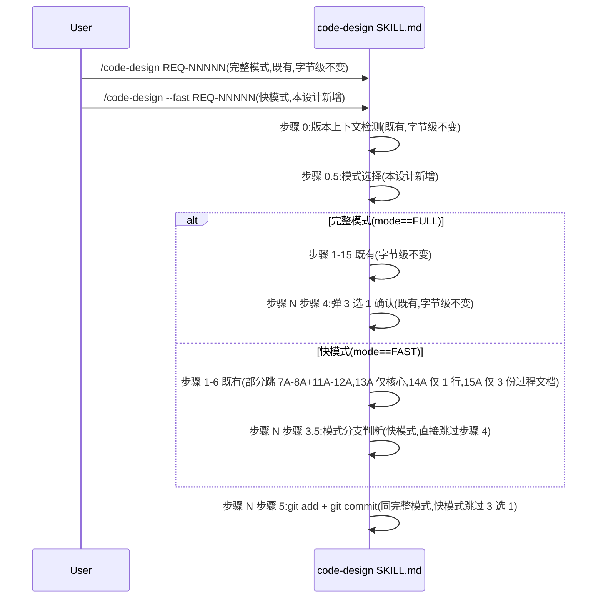

# 模块详细化 — REQ-00016
更新时间:2026-06-05 16:15
版本:V0.0.2

---

## 模块 M-1:`plugins/code-skills/skills/code-design/SKILL.md`(本设计唯一修改点 1)

### 路径
- `plugins/code-skills/skills/code-design/SKILL.md`(既有,本次**修改**)
- 字节级原则:**不**改 frontmatter(L1-3)/ **不**改既有 1-15 步骤字面

### 关键"组件"(SKILL.md 的"伪代码"视角)

| 组件 | 形式 | 职责 | 对应任务 | 字节级原则 |
| --- | --- | --- | --- | --- |
| frontmatter | YAML | 技能元信息 | T-001 | 字节级不变(INV-4) |
| 既有 §"## 工作流程" | 段落 | 步骤 0-15 | (既有) | 字节级不变(INV-1) |
| **新增 §"### 步骤 0.5 — 模式选择"** | 段落 | 环境变量 + CLI 标志三态机(优先级 CLI > 环境变量 > 默认) | **T-001** | **新增**(锚点 A 之后) |
| **新增 §"### 步骤 N 步骤 3.5 — 模式分支判断"** | 段落 | 快模式跳过 3 选 1;完整模式执行 3 选 1 | **T-001** | **新增**(锚点 B 之后) |

### 调用顺序

### 状态归属
- 模式选择状态(mode = FAST / FULL)在所有步骤的条件判断中可用
- **不**引入内存状态(沿用 NFR 强约束)

### 字节级原则
- Edit 工具严格按锚点(锚点 A = "步骤 0"末尾 / 锚点 B = "步骤 N 步骤 3"末尾)
- **不**改 frontmatter
- **不**改既有 1-15 步骤字面
- **不**删任何既有章节

### 符合的规范
- `skill-conventions.md §规则 1`:frontmatter 必含 name+description;既有已合规,本设计**不**改(INV-4)
- `module-conventions.md §规则 1`:SKILL.md 放技能根目录;既有已合规,本设计**不**改
- `encoding-conventions.md §规则 1-4`:任务编码双格式;本设计**不**产生新任务编码

### 模块自检
- ✅ frontmatter 字节级不变(INV-4)
- ✅ 既有步骤 0-15 字面字节级不变(INV-1 + INV-12)
- ✅ 既有 5 章节字面字节级不变(INV-13)
- ✅ 既有 2 模板字节级不变(INV-13 隐含)
- ✅ 仅 1 个文件修改
- ✅ 仅 2 段新增(锚点 A + 锚点 B)
- ✅ 字节级原则全部满足
- ✅ 0 偏离 / 0 冲突

---

## 模块 M-2:`plugins/code-skills/skills/code-plan/SKILL.md`(本设计唯一修改点 2)

### 路径
- `plugins/code-skills/skills/code-plan/SKILL.md`(既有,本次**修改**)
- 字节级原则:**不**改 frontmatter(L1-3)/ **不**改既有 1-18 步骤字面

### 关键"组件"

| 组件 | 形式 | 职责 | 对应任务 | 字节级原则 |
| --- | --- | --- | --- | --- |
| frontmatter | YAML | 技能元信息 | T-002 | 字节级不变(INV-4) |
| 既有 §"## 工作流程" | 段落 | 步骤 0-18 | (既有) | 字节级不变(INV-1) |
| **新增 §"### 步骤 0.5 — 模式选择"** | 段落 | 环境变量 + CLI 标志三态机 | **T-002** | **新增**(锚点 A 之后) |
| **新增 §"### 步骤 N 步骤 3.5 — 模式分支判断"** | 段落 | 快模式跳过 3 选 1;完整模式执行 3 选 1 | **T-002** | **新增**(锚点 B 之后) |

### 调用顺序
- 与 M-1 类似,但锚点不同(`code-plan` 步骤 0 后 + 步骤 N 步骤 3 后)

### 状态归属 + 字节级原则 + 符合的规范
- 与 M-1 类似

### 模块自检
- ✅ frontmatter 字节级不变(INV-4)
- ✅ 既有步骤 0-18 字面字节级不变(INV-1 + INV-12)
- ✅ 既有 5 章节字面字节级不变(INV-13)
- ✅ 既有 4 模板字节级不变(INV-13 隐含)
- ✅ 仅 1 个文件修改
- ✅ 仅 2 段新增
- ✅ 字节级原则全部满足
- ✅ 0 偏离 / 0 冲突

---

## 模块拆分总览

| 类别 | 数量 |
| --- | --- |
| **新增** | 0 个 |
| **修改既有** | 2 个(M-1 `code-design/SKILL.md` + M-2 `code-plan/SKILL.md`) |
| **复用既有** | 5 个(`templates/design.md` / `templates/assistants-layout.md` / `templates/plan.md` / `templates/task-plan.md` / `RESULT.md`) |
| **总计** | 7 个 |
