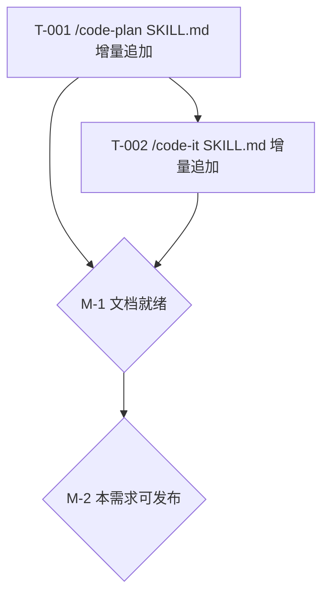

# REQ-00017 编码计划 — code-plan 拆分任务逻辑:更新看板下沉至 code-it

> 写入方:`code-plan` 技能
> 上游:./assistants/V0.0.2/plan/REQ-00017/RESULT.md
> 创建时间:2026-06-05 16:35
> 状态:**已完成(编码计划)**
> 任务总数:**2**(无"更新看板"派生任务,FR-1 强约束)

---

## 1. 任务总览

| 任务编码 | 关联需求 | 类型 | 触发/来源 | 标题 | 开发状态 | 测试状态 | 涉及文件 |
| --- | --- | --- | --- | --- | --- | --- | --- |
| `TASK-REQ-00017-00001` | REQ-00017 | 修改 | 需求新增 | [修改] `/code-plan` SKILL.md 增量追加(锚点 A 步骤 10A 拆任务约束 + 锚点 B 步骤 16A 第 2.5 款只追加真实任务) | **已完成** | 不适用 | `plugins/code-skills/skills/code-plan/SKILL.md` |
| `TASK-REQ-00017-00002` | REQ-00017 | 修改 | 需求新增 | [修改] `/code-it` SKILL.md 增量追加(锚点 C 末尾兜底后 P-1 推进看板小步) | **已完成** | 不适用 | `plugins/code-skills/skills/code-it/SKILL.md` |

**统计**:
- 总数:2
- 按类型:修改 × 2
- 按触发/来源:需求新增 × 2
- 测试状态:不适用 × 2(纯 SKILL.md 文档/规则改动,无被测代码)

## 2. 任务详情

### T-001 `[修改]` /code-plan SKILL.md 增量追加

- **目标**:把"拆任务约束(实际产出候选集 6 项,看板更新不在内)"和"步骤 16A 第 2.5 款只追加真实任务"两段插入到 `/code-plan` SKILL.md 的精确锚点位置
- **涉及文件**:
  - `plugins/code-skills/skills/code-plan/SKILL.md`
- **关键变更**(语义化定位,详 `plan/REQ-00017/RESULT.md` §3.1 + §3.2):
  - 锚点 A:`plugins/code-skills/skills/code-plan/SKILL.md` §步骤 10A 任务拆分 → "#### 任务类型"小节前 → 插入"#### 拆任务约束(REQ-00017 强约束,2026-06-05 起生效)"小节
  - 锚点 B:`plugins/code-skills/skills/code-plan/SKILL.md` §步骤 16A 同步版本看板(强制) → 第 3 款前 → 插入"2.5. **只追加真实任务**(REQ-00017 强约束,2026-06-05 起生效)"小节
- **边界与异常**:
  - 既有 5 段核心小节(核心原则/架构任务/生效范围/任务类型/任务编号等)字节级保留
  - INV-1:拆任务约束写明"实际产出候选集 6 项,看板更新不在内"
  - INV-4:步骤 16A 第 2.5 款写明"触发/来源列全部=详细设计,不出现=更新看板"
- **验证手段**:
  - Read SKILL.md → Grep "拆任务约束" → 字面精度匹配
  - Read SKILL.md → Grep "2.5. **只追加真实任务**" → 字面精度匹配
  - Read SKILL.md → 确认 5 段核心小节字节级不变(行号不变 + 内容不变)
- **回退方式**:`git revert` 即可(2 处增量追加,无既有内容修改)
- **开发状态**:待开始
- **测试状态**:不适用(纯 SKILL.md 文档改动,无被测代码)

### T-002 `[修改]` /code-it SKILL.md 增量追加

- **目标**:在 `/code-it` SKILL.md 末尾兜底"步骤 5 commit 成功"后插入"步骤 P-1 推进看板(REQ-00017 新增,2026-06-05 起生效)"小段,含算法伪代码 + 失败处理 + 幂等性 + 边界
- **涉及文件**:
  - `plugins/code-skills/skills/code-it/SKILL.md`
- **关键变更**(语义化定位,详 `plan/REQ-00017/RESULT.md` §3.3):
  - 锚点 C:`plugins/code-skills/skills/code-it/SKILL.md` §末尾兜底提交 → 步骤 5 执行 commit 成功判断后 → 插入"#### 步骤 P-1 推进看板"小节
- **边界与异常**:
  - 既有"步骤 1-5"末尾兜底 5 个步骤字节级保留
  - INV-2:P-1 推进本任务看板"开发状态"从"待开发"→"已完成"
  - INV-3:P-1 失败时**不重试**,**不阻断**(stderr 告警即可)
  - INV-4:P-1 **不**改"触发/来源"列(保持"详细设计")
  - INV-6:P-1 沿用既有解析锚点(`^## 任务清单$`)
  - INV-7:P-1 **不**改"测试状态"列(留给 `/code-unit`)
- **验证手段**:
  - Read SKILL.md → Grep "步骤 P-1 推进看板" → 字面精度匹配
  - Read SKILL.md → 确认既有"步骤 1-5"末尾兜底字节级不变
  - Read SKILL.md → 确认 P-1 步骤串行约束(commit 失败时不执行)
- **回退方式**:`git revert` 即可(1 处增量追加,无既有内容修改)
- **开发状态**:待开始
- **测试状态**:不适用(纯 SKILL.md 文档改动,无被测代码)

## 3. 任务依赖图

- T-001 不依赖 T-002(可独立完成)
- T-002 依赖 T-001(本任务在步骤 16A 同步看板时需要"步骤 10A 拆任务约束"已就绪,以便"任务清单"中"触发/来源"列全部=详细设计)
- M-1 里程碑:2 个 SKILL.md 增量追加完成
- M-2 里程碑:本需求可发布(端到端验证通过)

## 4. 里程碑

| 里程碑 | 任务集合 | 验收 |
| --- | --- | --- |
| M-1:文档就绪 | T-001 + T-002 | 2 个 SKILL.md 增量追加完成,INV-1~7 全部满足,2 任务开发状态=已完成 且 测试状态=不适用 |
| M-2:本需求可发布 | M-1 + 端到端验证 | code-auto 跑一个完整需求(从 code-require 到 code-review),验证 code-auto 步骤 4 任务循环无冗余"看板更新"任务,看板推进逻辑对既有任务不产生误推进 |

## 5. 变更记录

| 时间 | 版本 | 变更摘要 | 变更人 |
| --- | --- | --- | --- |
| 2026-06-05 16:35 | v1 | 初始创建:2 任务(T-001 + T-002,无"更新看板"派生);2 里程碑(M-1 + M-2);100% 沿用概要设计 8 决策 + 7 不变量;3 处 SKILL.md 增量追加(/code-plan 步骤 10A + 步骤 16A + /code-it 末尾兜底后 P-1);P-1~P-4 4 项讨论结论锁定(P-1 Read SKILL.md 全文 + Grep 自检锚点字面;P-2 锁定 A(2 任务而非 3 任务 — FR-1 强约束);P-3 锁定 0 架构任务(本需求不满足 REQ-00014 3 触发条件);P-4 锁定 2 任务测试状态 = `不适用`) | wangmiao |
