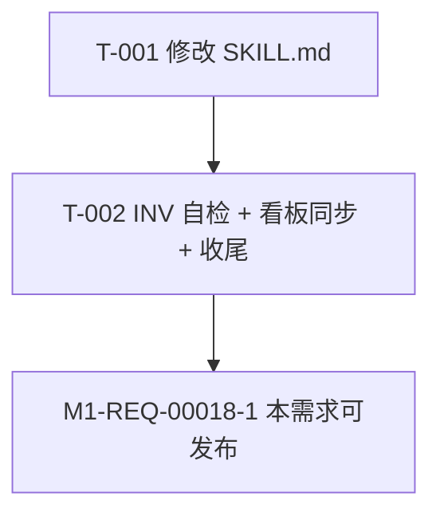

# 编码计划 — REQ-00018

- 需求编码:REQ-00018
- 所属版本:V0.0.2
- 文档版本:v1
- 状态:已锁定
- 责任人:wangmiao
- 创建:2026-06-06
- 最近更新:2026-06-06 13:15
- 当前版本:v1
- **主题**:优化 `/code-version` 技能 — 切换版本时同步 CWD 项目描述文件版本号
- 上游:
  - 需求:`./assistants/V0.0.2/require/REQ-00018/RESULT.md`
  - 概要设计:`./assistants/V0.0.2/design/REQ-00018/RESULT.md`
  - 详细设计:`./assistants/V0.0.2/plan/REQ-00018/RESULT.md`

## 任务总览

| 任务编号 | 需求 | 类型 | 触发/来源 | 标题 | 开发状态 | 测试状态 | 涉及文件 | 前置任务 |
| --- | --- | --- | --- | --- | --- | --- | --- | --- |
| `TASK-REQ-00018-00001` | REQ-00018 | 修改 | 详细设计 | `[修改] code-version/SKILL.md 增量追加"步骤 7 CWD 描述文件同步"` | **已完成** | 不适用 | `plugins/code-skills/skills/code-version/SKILL.md` | 2026-06-06 13:25 | `<TBD>` | — |
| `TASK-REQ-00018-00002` | REQ-00018 | 文档 | 详细设计 | `[文档] 8 项 INV 自检 + 看板同步 + 收尾` | 待开始 | 不适用 | `plugins/code-skills/skills/code-version/SKILL.md` + `assistants/V0.0.2/RESULT.md` | T-001 |

**任务总数**:**2**(T-001 修改 / T-002 文档)
**测试状态总览**:**2/2 = 不适用**(纯文档任务,仓库无测试框架 — REQ-00009 守卫判定"不可测")
**真正可发布** = 开发完成 ∧ 测试通过/不适用 = **2/2 满足**

## 任务详情

### 任务编号:`TASK-REQ-00018-00001`

**类型**:修改
**触发/来源**:详细设计
**标题**:`[修改] code-version/SKILL.md 增量追加"步骤 7 CWD 描述文件同步"`

#### 目标

在 `plugins/code-skills/skills/code-version/SKILL.md` 锚点 = "## 工作流程" 段后 / "## 看板字段约定" 段前,插入"## 步骤 7 — CWD 描述文件版本号同步(REQ-00018 新增)"小节,含 7 个子节(7.1 目标 / 7.2 触发条件 / 7.3 算法 / 7.4 通过条件 / 7.5 屏幕输出契约 / 7.6 边界与异常 / 7.7 性能)。

#### 涉及文件(语义化锚点)

- `plugins/code-skills/skills/code-version/SKILL.md` §工作流程 段后 / §看板字段约定 段前(插入新小节,既有章节不动)
- `plugins/code-skills/skills/code-version/SKILL.md` frontmatter(L1-3,**不**改,字节级保留)

#### 关键变更

1. **插入"## 步骤 7"小节**(7 子节)
   - 7.1 目标(说明步骤 7 做什么)
   - 7.2 触发条件(步骤 3 决定激活此版本后,选 A/B/C 时触发,选 C 取消时不触发)
   - 7.3 算法(7 步伪代码:解析 argv → Glob 6 类 → 0 命中处理 → 逐文件处理)
   - 7.4 通过条件(屏幕输出 1+ 行 ✓ / 1 行 ⚠ / 失败不阻断)
   - 7.5 屏幕输出契约(5 类)
   - 7.6 边界与异常(E-1~E-8)
   - 7.7 性能(NFR-7 < 5 秒)
2. **frontmatter 字节级保留**(L1-3 不改)
3. **既有"## 工作流程"小节不改**
4. **既有"## 看板字段约定"小节不改**

#### 边界与异常

- E-1 monorepo 多匹配:每文件 1 行 `✓`
- E-2 0 命中:1 行 `⚠ CWD 下未检测到...`
- E-3 解析失败:1 行 `⚠ <filename> 格式不可解析...`
- E-4 缺版本号字段:1 行 `⚠ <filename> 未找到版本号字段...`
- E-5 `--skip-cwd-sync`:本需求不实现(Q-7)
- E-6 `go.mod` 命中:1 行 `⚠ go.mod 无版本号字段...`
- E-7 无写权限:1 行 `⚠ <filename> 无写权限,跳过`
- E-8 Edit 失败:1 行 `⚠ <filename> Edit 失败(<错误>)`

#### 验证手段

- `Read SKILL.md L1-3` → frontmatter 字节级保留
- `Read SKILL.md` "## 工作流程" 段 → 与本任务前一致
- `Read SKILL.md` "## 看板字段约定" 段 → 与本任务前一致
- `Read SKILL.md` "## 步骤 7" 段 → 新增 7 子节存在
- 人工 S-1~S-8 场景验证(详 plan/REQ-00018/RESULT.md §11)

#### 回退方式

- `git revert` 本任务 commit
- 本任务 commit 只触碰 1 个文件(SKILL.md),回退粒度清晰

#### 关键约束(沿用概要设计 D-1~D-5)

- **D-1 增量追加**:Edit 锚点 = "## 工作流程" 段后,**不**重写既有 SKILL.md
- **D-2 6 类描述文件优先级**:`package.json` > `pom.xml` > `manifest.json` > `Cargo.toml` > `pyproject.toml` > `go.mod`
- **D-3 Edit 锚点**:每类文件独立(JSON / XML / TOML 各自锚点)
- **D-4 失败不阻断**:NFR-8 强约束,所有边界走 `⚠` 屏幕输出
- **D-5 不引入 CLI 参数**:Q-7 采纳默认,`--skip-cwd-sync` 留作 v2

### 任务编号:`TASK-REQ-00018-00002`

**类型**:文档
**触发/来源**:详细设计
**标题**:`[文档] 8 项 INV 自检 + 看板同步 + 收尾`

#### 目标

完成 8 项 INV 自检 + 5 处看板同步 + 收尾。

#### 涉及文件(语义化锚点)

- `plugins/code-skills/skills/code-version/SKILL.md` §步骤 7 段(读)
- `assistants/V0.0.2/RESULT.md` §需求清单 / §概要设计清单 / §任务清单 / §里程碑 / §变更记录(读 + 写)

#### 关键变更

1. **8 项 INV 自检**(本需求定制):
   - **INV-1** frontmatter 字节级保留 — `Read SKILL.md L1-3` 比对
   - **INV-2** 既有"## 工作流程"小节不改 — `Read SKILL.md` "## 工作流程" 段比对
   - **INV-3** 既有"## 看板字段约定"小节不改 — `Read SKILL.md` "## 看板字段约定" 段比对
   - **INV-4** 7 子节结构完整(7.1~7.7)— `Grep SKILL.md` 数 7 个子节
   - **INV-5** 6 类描述文件全列出 — `Grep SKILL.md` 数 6 个文件名
   - **INV-6** 5 类屏幕输出契约全有 — `Grep SKILL.md` 数 5 个 `✓` / `⚠` 模式
   - **INV-7** 8 边界 E-1~E-8 全列出 — `Grep SKILL.md` 数 8 个 E-N
   - **INV-8** 0 触发 `dashboard-conventions §规则 1` 3 处同步 — 看板 0 字段扩展
2. **5 处看板同步**(本需求 0 触发新增,但需确认现状):
   - 需求清单 REQ-00018 状态 = `已完成`
   - 概要设计清单 REQ-00018 已存在(详 design 阶段 commit 91ac88d)
   - 任务清单 T-001 / T-002 已存在
   - 里程碑 M1-REQ-00018-1(本需求可发布)同步为"已完成"
   - 变更记录:任务完成 + 评审发现(详 code-review 阶段)

#### 边界与异常

- 8 项 INV 任何 1 项失败 → 记入 `deviations.md`,不阻断(沿用 REQ-00010 实践)
- 看板同步任何 1 处不一致 → 修正后重新验证

#### 验证手段

- 8/8 INV 全部通过
- 5 处看板同步全部一致
- 0 触发 `dashboard-conventions §规则 1` 3 处同步(严守)
- 0 派生"更新看板"任务(REQ-00017 严守)

#### 回退方式

- `git revert` 本任务 commit
- 本任务 commit 只触碰 1 个文件(RESULT.md 看板 5 处),回退粒度清晰

#### 关键约束

- **不触发** `dashboard-conventions §规则 1` 3 处同步(严守)
- **不**派生"更新看板"任务(REQ-00017 严守,看板推进由 `/code-it` 末尾 P-1 兜底)

## 任务依赖图(Mermaid)

## 里程碑

| 里程碑 | 达成条件 | 状态 |
| --- | --- | --- |
| **M-1** 文档就绪 | T-001 完成(SKILL.md 增量追加) | 待开始 |
| **M-2** 本需求可发布 | T-002 完成(8/8 INV + 5 处看板同步 + 收尾) | 待开始 |

## 测试完成度

| 维度 | 状态 |
| --- | --- |
| 总任务数 | 2 |
| 测试状态 = 已运行-通过 | 0 |
| 测试状态 = 不适用 | 2(T-001 纯 SKILL.md 修改 / T-002 纯文档 — 仓库无测试框架,沿用 REQ-00009 守卫判定) |
| 测试状态 = 已运行-失败 | 0 |
| 测试状态 = 未编写 | 0 |
| 测试状态 = 阻塞 | 0 |
| 真正可发布任务数 | 2/2(开发完成 ∧ 测试不适用) |

## 变更记录

| 时间 | 版本 | 变更摘要 | 变更人 |
| --- | --- | --- | --- |
| 2026-06-06 13:15 | v1 | 初始创建:**2 任务** — T-001 `[修改] code-version/SKILL.md 增量追加` + T-002 `[文档] 8 INV 自检 + 5 处看板同步 + 收尾`;0 架构任务 — 本需求不满足 REQ-00014 3 触发条件;2 任务测试状态全 `不适用` — 仓库无测试框架沿用 REQ-00009 守卫判定;**0 派生** "更新看板"任务 — REQ-00017 强约束;0 触发 `dashboard-conventions §规则 1` 3 处同步;100% 沿用概要设计 5 决策 + 8 边界;7 份过程文档(本计划阶段)齐全;2 里程碑(M-1 文档就绪 + M-2 本需求可发布);任务编号 `TASK-REQ-00018-00001 ~ 00002` 严格 `encoding-conventions §规则 1+3` 5+5 位嵌套 | wangmiao |
