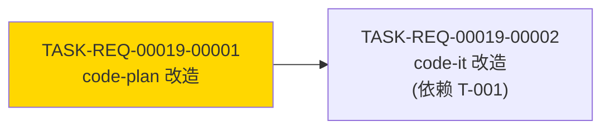

# 编码计划 — REQ-00019 — /code-plan BUG 模式产出物与 REQ 模式同构

- 需求编码:REQ-00019
- 所属版本:V0.0.2
- 详细设计:./assistants/V0.0.2/plan/REQ-00019/RESULT.md (v1)
- 状态:草稿
- **开发完成度**:0 / 2
- **测试完成度**:0 / 2
- 创建:2026-06-06
- 最近更新:2026-06-06 15:30
- 当前版本:v1

## 1. 计划概述

- 任务总数:**2**
- 类型分布:修改 2 个(`code-plan/SKILL.md` 改造 + `code-it/SKILL.md` 改造);文档 0 个;新增 0 个;重构 0 个
- 关键里程碑数:**1**(M1-REQ-00019-1:本需求可发布)
- **开发完成度**:0 / 2
- **测试完成度**:0 / 2(测试状态全部 = `不适用` 因本仓库无测试框架 — REQ-00009 守卫判定"不可测")
- **真正可发布任务数**:0 / 2

## 2. 任务总览

**主表,任何变更都必须先更新此表**。

| 任务编号 | 类型 | 触发/来源 | 标题 | 开发状态 | 测试状态 | 涉及文件/模块 | 前置任务 | 估算 | 责任人 | 关联任务 | 对应设计章节 |
| --- | --- | --- | --- | --- | --- | --- | --- | --- | --- | --- | --- |
| TASK-REQ-00019-00001 | 修改 | 需求新增 | `[修改] 增量追加 code-plan/SKILL.md(锚点 A:步骤 19-22 微调 + 锚点 B:步骤 23 E-1 边界 + 锚点 C:步骤 24A 重写 + 锚点 D:步骤 26A 改模板引用 + 锚点 E:步骤 28A+1 同步任务清单区段)` | **已完成** | 不适用 | `plugins/code-skills/skills/code-plan/SKILL.md` §"缺陷分支"(L588-735)+ 新增步骤 28A+1(实际 +88/-24 净 +64 行) | — | 1.0d | wangmiao | — | RESULT.md §4 模块 1 / §6 接口 1 |
| TASK-REQ-00019-00002 | 修改 | 需求新增 | `[修改] 增量追加 code-it/SKILL.md(锚点 F:frontmatter L5 修订 + 锚点 G:步骤 17 改读 PLAN.md/RESULT.md + E-7 边界 + 锚点 H:步骤 22-25 过程文档去 fix- 前缀 + 锚点 I:步骤 24 不再写 fix-plan.md + E-11 边界 + 锚点 J:步骤 25 汇报字段同步 + E-9 边界)` | 待开始 | 不适用 | `plugins/code-skills/skills/code-it/SKILL.md` frontmatter L5 + §"缺陷分支"(L638-800) | T-001 | 0.8d | wangmiao | — | RESULT.md §4 模块 2 / §6 接口 2-3 |

**字段说明**:
- **任务编号**:`TASK-REQ-00019-NNNNN`,5+5 位嵌套式,递增分配,一经分配不再改变
- **类型**:`新增` / `修改` / `重构` / `修复` / `测试` / `文档`(本需求 2 任务全部为 `修改`)
- **触发/来源**:`需求新增`(2 任务全部沿用既有 13 枚举之一)
- **开发状态**:6 枚举(本需求初值 = `待开始`)
- **测试状态**:6 枚举(本需求初值 = `不适用`,纯文档型任务)
- **关联任务**:本需求 0 关联(本任务取代/扩展/依赖的已存在任务)
- **对应设计章节**:本任务在 `RESULT.md` 中的设计依据;**触发/来源=审查改修** 时此列指向 `./assistants/<版本号>/review/<任务编码>/RESULT.md`

> **双状态语义**:任务的开发状态与测试状态是**正交两轴**。
> 任务"真正可发布" = 开发状态 = `已完成` **且** 测试状态 ∈ {`已运行-通过`, `不适用`}。
> 本需求 2 任务测试状态全部 = `不适用`(纯文档型 + 仓库无测试框架)。

### 2.1 触发/来源枚举
| 值 | 含义 | 默认类型 | 默认输入源 |
| --- | --- | --- | --- |
| `需求新增` | 因需求首次澄清产生 | 新增 | `plan/<需求>/RESULT.md` |
| `需求变更` | 因需求变化产生 | 修改 | `plan/<需求>/RESULT.md` |
| `需求撤回` | 因需求撤回产生 | (标"已取消") | — |
| `设计变更` | 因概要设计变化产生 | 修改 | `plan/<需求>/RESULT.md` |
| `规范变更` | 因项目级规范变化产生 | 修改 | `plan/<需求>/RESULT.md` + `rules/<file>` |
| `代码变更` | 因项目代码变化产生 | 修改 | `plan/<需求>/RESULT.md` |
| `主动优化` | 主动识别可优化点 | 修改 / 重构 | `plan/<需求>/RESULT.md` |
| `审查改修` | `code-review` 派生改修 | 修改 | `review/<任务编码>/RESULT.md` |
| `缺陷修复` | 修复 `code-fix` 登记的 BUG | 修复 | `fix/<BUG>/RESULT.md` + `fix/<BUG>/PLAN.md` |
| `性能优化` | 性能基准不达标 | 修改 / 重构 | `plan/<需求>/RESULT.md` |
| `安全加固` | 安全隐患 | 修改 | `plan/<需求>/RESULT.md` |
| `测试补齐` | 补齐测试覆盖 | 测试 | `plan/<需求>/RESULT.md` |
| `其他` | 其他 | 任意 | 任意 |

## 3. 任务详情

### TASK-REQ-00019-00001 — `[修改] 增量追加 code-plan/SKILL.md`

- **目标**:把 `code-plan/SKILL.md` 缺陷分支(步骤 19-28A)从"产单文件 `fix-plan.md`"升级为"产 9 份文档同构于 REQ 模式",并新增步骤 28A+1 同步看板"任务清单"区段
- **涉及文件**:`plugins/code-skills/skills/code-plan/SKILL.md`
- **关键变更**(5 锚点):
  - **锚点 A**(L588-595 段 §"缺陷分支" 起始引言):3 条修订
    - 既有第 2 条:"故 `RESULT.md` 简化为 `fix-plan.md`(单文件)" → 改为"故产出物升级为 `RESULT.md` + `PLAN.md` + 7 份过程文档,与 REQ 模式完全同构"
    - 既有第 3 条:"不需要拆分为多个 `PLAN.md` 任务" → 改为"若修复跨多步,可在 `PLAN.md` 任务总览中拆分为多个 `TASK-BUG-NNNNN-NNNNN` 任务(从 `TASK-BUG-NNNNN-00001` 起递增)"
    - 既有第 4 条:"任务编号可省略" → 改为"BUG 任务沿用既有 `TASK-...` 编号体系,新格式 `TASK-BUG-NNNNN-NNNNN`(5+5 位嵌套式)"
  - **锚点 B**(L623-627 步骤 23):增加 E-1 边界
    - 在"### 步骤 23 — 检查 fix-plan.md 是否存在" 段后追加:
    ```
    ### 步骤 23+ — 步骤 23 修订 E-1 边界(本需求 REQ-00019 新增)
    - **触发**:`fix-plan.md` 存在(仅 BUG-00001 历史)
    - **检测**:`Glob "./assistants/<版本号>/fix/<缺陷编号>/fix-plan.md"`
    - **处理**:
      - 文件存在 → 屏显"⚠ 检测到历史 fix-plan.md,本需求已不再生成该文件;是否继续以本缺陷的 fix-plan.md 为参考?" + `AskUserQuestion` 3 选 1
        - A. 继续(以本缺陷的 fix-plan.md 为参考,继续按 fix-plan.md 内'步骤'列表实施)
        - B. 手动迁移(用户先手动调用 `code-plan BUG-NNN` 产出 `RESULT.md` + `PLAN.md` + 7 份过程文档)
        - C. 中止
      - 文件不存在 → 正常进入步骤 24A
    ```
  - **锚点 C**(L629-653 步骤 24A):重写为"产出 9 份文档同构于 REQ 模式"
    - 既有 5 子任务保留
    - 步骤 24A 末追加:
    ```
    ### 步骤 24A+1 — 产出 9 份文档同构于 REQ 模式(本需求 REQ-00019 新增)
    - **任务**:
      1. 撰写 `fix/<BUG-NNN>/RESULT.md`(14 章节,沿用 `templates/plan.md`)
      2. 撰写 `fix/<BUG-NNN>/PLAN.md`(8 章节,沿用 `templates/task-plan.md`)
      3. 撰写 7 份过程文档(`materials-index.md` / `module-details.md` / `interface-specs.md` / `data-changes.md` / `risk-analysis.md` / `rule-compliance.md` / `design-notes.md` + 可选 `clarifications.md`)
      4. 关键决策旁标注"依据规范:`encoding-conventions §规则 1/3`"等
    - **任务编号分配**(沿用 `code-plan/SKILL.md` 步骤 9B "任务编号分配"逻辑):
      - 找到 `PLAN.md` 中当前最大的任务序号 N
      - 新任务从 N+1 开始递增
      - 任务编号格式:`TASK-BUG-NNNNN-NNNNN`
    ```
  - **锚点 D**(L661-676 步骤 26A):改模板引用
    - 既有"按 `templates/fix-plan.md` 的章节结构生成" → 改为"按 `templates/plan.md` + `templates/task-plan.md` 同构产出"
    - 追加子节:
    ```
    ### 步骤 26A+1 — 撰写 9 份文档的章节结构(本需求 REQ-00019 新增)
    - `RESULT.md` 14 章节(概述 / 上游引用 / 规范遵循 / 模块详细化 / 算法与逻辑 / 数据结构 / 接口细节 / 异常处理 / 安全 / 状态机 / 性能 / 测试要点 / 关联 / 待澄清 / 变更记录) — 沿用 `templates/plan.md`
    - `PLAN.md` 8 章节(计划概述 / 任务总览 / 任务详情 / 任务依赖图 / 里程碑 / 状态管理规则 / 关联计划 / 变更记录) — 沿用 `templates/task-plan.md`
    - **关键差异**(vs REQ 模式):
      - `RESULT.md` §2 上游引用:`fix/<BUG-NNN>/RESULT.md`(缺陷详情) + `fix/<BUG-NNN>/investigation.md`(若有) + 项目级规范
      - `PLAN.md` 任务总览"触发/来源"列 = `缺陷修复`(沿用既有 13 枚举)
      - `PLAN.md` 任务总览"需求"列 = `BUG-NNN`(3 位)
      - `PLAN.md` 任务总览"关联任务"列 = `BUG-NNN`(自查)
    ```
  - **锚点 E**(L697-706 步骤 28A 后):新增步骤 28A+1
    ```
    ### 步骤 28A+1 — 同步版本看板'任务清单'区段(本需求 REQ-00019 新增,2026-06-06 起生效)
    1. `Read "./assistants/<版本号>/RESULT.md"`,定位"任务清单"区段
    2. 读 `fix/<BUG-NNN>/PLAN.md` 任务总览(从锚点 C 步骤 24A+1 产出)
    3. 在"任务清单"区段追加 N 行(每条 BUG 任务一行):
       - 任务编号 = `TASK-BUG-NNNNN-NNNNN`
       - 需求 = `BUG-NNN`
       - 类型 = `修复`
       - 触发/来源 = `缺陷修复`
       - 标题 = 沿用 REQ-00013 标题解析(`formatTaskTitle` + `truncateTitle`)
       - 开发状态 = `待开始`(初值)
       - 测试状态 = `不适用`(纯文档型任务)或 `未编写`(代码类任务)
       - 涉及文件 = 留空(`code-it` 完成时填入)
       - 关联任务 = `BUG-NNN`(自查)
    4. 同步失败 → 屏显 `⚠` 警告(沿用既有)
    5. 屏显:"已同步 V0.0.2/RESULT.md 任务清单 +N 行"
    ```
- **边界与异常**:
  - **E-1**:`fix-plan.md` 存在(锚点 B 处理)
  - **E-2**:9 份文档撰写失败(磁盘满/权限)→ 透传 stderr,中断退出
  - **E-3**:`design/.../RESULT.md` 缺失 → 沿用既有退化(本需求**不**涉及)
  - **E-12**:`git --version` 失败 → 沿用既有(本需求**不**涉及,沿用步骤 0a)
- **验证手段**(人工场景):
  - V-1 调 `code-plan BUG-00010`(新 BUG,无历史) → 产出 9 份文档
  - V-2 验证 `fix/BUG-00010/RESULT.md` 14 章节齐全
  - V-3 验证 `fix/BUG-00010/PLAN.md` 8 章节齐全
  - V-4 验证 `fix/BUG-00010/PLAN.md` 任务总览
  - V-5 调 `code-dashboard`(无参) → 看板"任务清单"区段显示 `TASK-BUG-00010-00001`
  - V-7 调 `code-plan BUG-00001`(历史) → 步骤 23 E-1 边界提示
  - **静态自检 9 项**(沿用 REQ-00009 / REQ-00010 既有):
    1. frontmatter L1-7 字节级保留
    2. 既有"## 标题解析(REQ-00013 新增)" 小节**不**改
    3. 既有"## 修改文件定位的语义化约定" 小节**不**改
    4. 既有"## 工作流程" 小节 L185-735 内容**不**改(锚点字节级保留)
    5. 既有"## 过程文档格式" 小节**不**改
    6. 既有"## 衔接" + "## 不要做的事" 小节**不**改
    7. 既有"## 看板字段约定" / "## 工作流程" 段不触发 dashboard §规则 1 三同步
    8. 既有"## 步骤 0a" / "## 步骤 0b" / "## 步骤 N" 子节**不**改
    9. 锚点 A/B/C/D/E 5 处变更精确(结构化语义定位,无行号)
- **回退方式**:`git revert` 本任务 commit(单一 commit,回退粒度清晰)
- **依据规范**:
  - `skill-conventions §规则 1` — frontmatter `name` 字段字节级保留
  - `module-conventions §规则 1` — SKILL.md 在技能根目录
  - `dashboard-conventions §规则 1` — 0 触发(锚点 E 仅追加行)
  - `encoding-conventions §规则 1/3` — 5+5 位嵌套式
  - `dependency-conventions` — 0 新增依赖
  - `commit-conventions` — 沿用 `chore(<scope>): <subject>`
  - `doc-conventions` — 0 改中英 README
  - `naming-conventions` — `TASK-BUG-` 沿用 `TASK-` 已有规则
  - `directory-conventions` — 过程文档摆放在 `fix/<BUG-NNN>/` 根目录

### TASK-REQ-00019-00002 — `[修改] 增量追加 code-it/SKILL.md`

- **目标**:把 `code-it/SKILL.md` 缺陷分支(步骤 17-25)从"读 `fix-plan.md`"升级为"读 `PLAN.md` + `RESULT.md`",过程文档去 `fix-` 前缀,frontmatter L5 同步
- **涉及文件**:`plugins/code-skills/skills/code-it/SKILL.md`
- **关键变更**(6 锚点):
  - **锚点 F**(L5 frontmatter):description 段修订
    - 既有:"所有产出物写入 `./assistants/<版本号>/fix/<缺陷编号>/`(以 `fix-` 前缀命名的过程文档),从 `./assistants/<版本号>/fix/<缺陷编号>/RESULT.md` 读取缺陷详情,从 `./assistants/<版本号>/fix/<缺陷编号>/fix-plan.md` 读取修复方案"
    - 改为:"所有产出物写入 `./assistants/<版本号>/fix/<缺陷编号>/`(主详细设计 `RESULT.md` + 任务列表 `PLAN.md`,沿用 REQ 路径同构产出),从 `./assistants/<版本号>/fix/<缺陷编号>/RESULT.md` 读取缺陷详情,从 `./assistants/<版本号>/fix/<缺陷编号>/PLAN.md` 读取修复任务列表"
  - **锚点 G**(L641-643 §"缺陷分支" 起始引言):2 条修订
    - 既有第 1 条:"`code-plan` 已产出 `fix-plan.md`" → 改为"`code-plan` 已产出 `RESULT.md` + `PLAN.md`(同构 REQ 模式)"
    - 既有第 2 条:"过程文档以 `fix-` 前缀命名" → 改为"过程文档以 `TASK-BUG-` 任务编号命名(沿用任务路径同套命名);原 `fix-` 前缀退场(本需求后不再使用)"
  - **锚点 H**(L646-659 步骤 17):改读 `PLAN.md` + `RESULT.md`,增加 E-7 边界
    - 步骤 17 L650-651:"读取 `./assistants/<版本号>/fix/<缺陷编号>/fix-plan.md` —— 提取:根因定位 / 修复方案(选定的) / 涉及文件与变更 / 测试方案" → 改为:
    ```
    读取 `./assistants/<版本号>/fix/<缺陷编号>/PLAN.md` —— 提取:任务总览 + 任务详情 + 测试方案
    读取 `./assistants/<版本号>/fix/<缺陷编号>/RESULT.md` —— 提取:详细设计点(算法 / 数据结构 / 接口 / 异常处理 / 风险与回退)
    ```
    - 步骤 17 L657:"缺 `fix-plan.md` → 请先调 `code-plan <缺陷编号>` 规划修复方案" → 改为:"缺 `PLAN.md` → 请先调 `code-plan <缺陷编号>` 规划修复方案"
    - 步骤 17 末追加 E-7 边界:
    ```
    ### E-7 边界:`fix-plan.md` 存在 + `PLAN.md` 缺失(本需求 REQ-00019 新增)
    - **触发**:`fix-plan.md` 存在(仅 BUG-00001 历史)+ `PLAN.md` 缺失
    - **检测**:`Glob "./assistants/<版本号>/fix/<缺陷编号>/fix-plan.md"`
    - **处理**:
      - 文件存在 + `PLAN.md` 缺失 → 退化 + 屏显"⚠ 检测到历史 fix-plan.md;请先用 `code-plan <缺陷编号>` 产出 `PLAN.md`"
      - 文件不存在 + `PLAN.md` 存在 → 正常进入步骤 18
    ```
  - **锚点 I**(L688-709 步骤 22):过程文档去 `fix-` 前缀
    - 步骤 22 L707:"持续追加到 `fix-work-log.md`(每完成一个文件、每跑一次命令、每遇到一个问题都记)" → 改为"持续追加到 `code/<TASK-BUG-...>/work-log.md`(每完成一个文件、每跑一次命令、每遇到一个问题都记)"
    - 步骤 22 末追加 E-9 边界:
    ```
    ### E-9 边界:`fix-work-log.md` 存在(本需求 REQ-00019 新增)
    - **触发**:`fix-work-log.md` 存在(仅 BUG-00001 历史)
    - **处理**:
      - 文件存在 → 屏显"⚠ 检测到历史 fix- 前缀过程文档;本次为新结构 TASK-BUG- 任务编号,过程文档不再使用 fix- 前缀;是否手动迁移?推荐不迁移(BUG-00001 已修复-待验证,历史保留)"
      - 文件不存在 → 正常写入 `code/<TASK-BUG-...>/work-log.md`
    ```
  - **锚点 J**(L711-755 步骤 23):过程文档去 `fix-` 前缀
    - 步骤 23.1 L715:"记录到 `fix-compile-and-run.md`" → 改为"记录到 `code/<TASK-BUG-...>/compile-and-run.md`"
    - 步骤 23.2 L720-722:"记录到 `fix-compile-and-run.md`" → 改为"记录到 `code/<TASK-BUG-...>/compile-and-run.md`"
    - 步骤 23.3 L726-728:"记录到 `fix-test-results.md`" → 改为"记录到 `code/<TASK-BUG-...>/test-results.md`"
    - 步骤 23.4 L750:"`fix-work-log.md` 记录" → 改为"`code/<TASK-BUG-...>/work-log.md` 记录"
  - **锚点 K**(L757-787 步骤 24):不再写 `fix-plan.md` + E-11 边界
    - 步骤 24 既有 L762-783 流程保留(同步 `fix/<BUG-NNN>/RESULT.md` + `fix/RESULT.md` + 看板"缺陷清单")
    - 步骤 24 末追加 E-11 边界:
    ```
    ### E-11 边界:`fix-plan.md` 存在(本需求 REQ-00019 新增)
    - **触发**:`fix-plan.md` 存在(仅 BUG-00001 历史)
    - **处理**:
      - 文件存在 → **不**写 `fix-plan.md` 同步动作(因本需求后**不**再生成 `fix-plan.md`)
      - 文件不存在 → 正常进入步骤 25
    ```
    - 步骤 24 同步 `fix/<BUG-NNN>/RESULT.md` + `fix/RESULT.md` + 看板"缺陷清单" 完整保留(沿用既有)
  - **锚点 L**(L789-800 步骤 25):汇报字段同步
    - 步骤 25 L796:"**同步的文件**:`fix/<缺陷编号>/RESULT.md` / `fix/RESULT.md` / 版本看板" → 改为:
    ```
    - **同步的文件**:`fix/<缺陷编号>/RESULT.md` / `fix/RESULT.md` / `fix/<缺陷编号>/PLAN.md`(若状态推进) / 版本看板"缺陷清单" + "任务清单"
    ```
- **边界与异常**:
  - **E-7**:`fix-plan.md` 存在 + `PLAN.md` 缺失(锚点 H 处理)
  - **E-8**:`PLAN.md` 存在但任务总览为空 → 提示"修复方案待补充任务拆分;请调 `code-plan` 重新规划"
  - **E-9**:`fix-work-log.md` 存在(锚点 I 处理)
  - **E-10**:实施过程失败(沿用既有 5 次后询问)
  - **E-11**:`fix-plan.md` 存在(锚点 K 处理)
  - **E-12**:`git --version` 失败 → 沿用既有(本需求**不**涉及,沿用步骤 0a)
- **验证手段**(人工场景):
  - V-6 调 `code-it TASK-BUG-00010-00001` → 步骤 17 读 `PLAN.md` + `RESULT.md`,过程文档去 `fix-` 前缀
  - V-8 调 `code-it TASK-BUG-00001-00001`(若未来重跑) → 步骤 17/22 E-7/E-9 边界提示
  - **静态自检 9 项**(沿用 REQ-00009 / REQ-00010 既有):
    1. frontmatter L1-3 字节级保留
    2. 既有"## 标题解析(REQ-00013 新增)" 小节**不**改
    3. 既有"## 工作流程" 小节 L1-637 内容**不**改
    4. 既有"## 任务分支(从步骤 1.2 判定为 TASK-... 时走)" 小节**不**改
    5. 既有"## 过程文档格式" 小节**不**改(任务路径的 `work-log.md` / `compile-and-run.md` 等描述**不**改)
    6. 既有"## 衔接" + "## 不要做的事" 小节**不**改
    7. 既有"## 步骤 0a" / "## 步骤 0b" / "## 步骤 N" 子节**不**改
    8. 步骤 21 处理缺陷状态与本轮起点**不**改(沿用既有)
    9. 锚点 F/G/H/I/J/K/L 7 处变更精确(结构化语义定位,无行号)
- **回退方式**:`git revert` 本任务 commit(单一 commit,回退粒度清晰)
- **依据规范**:
  - `skill-conventions §规则 1` — frontmatter `name` 字段字节级保留
  - `module-conventions §规则 1` — SKILL.md 在技能根目录
  - `dashboard-conventions §规则 1` — 0 触发(本任务**不**直接同步看板,沿用既有步骤 24 同步)
  - `dependency-conventions` — 0 新增依赖
  - `commit-conventions` — 沿用 `chore(<scope>): <subject>`
  - `doc-conventions` — 0 改中英 README
  - `naming-conventions` — 0 新增文件名前缀规则
  - `directory-conventions` — 过程文档摆放在 `code/<TASK-BUG-...>/` 根目录

## 4. 任务依赖图



**依赖说明**:
- T-001 完成后才执行 T-002(因 T-002 的步骤 17 读 `PLAN.md`/`RESULT.md` 依赖 T-001 的步骤 24A 产出)
- T-001 + T-002 完成后进入 `code-review`

## 5. 里程碑

| 里程碑 | 包含任务 | 完成定义 | 状态 | 计划时间 | 实际完成 |
| --- | --- | --- | --- | --- | --- |
| **M1-REQ-00019-1:本需求可发布** | T-001 + T-002 | **2 任务开发状态=已完成 且 测试状态=不适用**,13 项 INV 100% 通过自检 + 看板 5 处一致(任务清单 2 行 + 详细设计汇总 1 行 + 里程碑 1 个 + 文档头 + 变更记录)+ 8 端到端验证 V-1~V-8 全部通过 | 待开始 | 2026-06-06 | — |

**完成定义显式列出两轴状态要求**,避免把"开发完成"误当"可发布"。

## 6. 状态管理规则

### 6.1 双状态初始化
- 2 任务全部为 `修改` 类型 + 纯文档型
- 开发状态 = `待开始`(初值)
- 测试状态 = `不适用`(纯文档型,沿用 REQ-00009 / REQ-00010 既有实践)

### 6.2 真正可发布判定
任务"真正可发布" = 开发状态 = `已完成` **且** 测试状态 ∈ {`已运行-通过`, `不适用`}。
本需求 2 任务测试状态 = `不适用`,故"开发状态=已完成" 即"真正可发布"。

### 6.3 状态变更记录
- 仅开发状态变化 → 变更类型 = `开发状态更新`
- 仅测试状态变化 → 变更类型 = `测试状态更新`
- 两者同时变化 → 记录为两条
- 状态变更在 §7 变更记录中记录

## 7. 变更记录

| 时间 | 版本 | 变更类型 | 变更摘要 | 变更人 |
| --- | --- | --- | --- | --- |
| 2026-06-06 15:30 | v1 | 新增 | 初始创建:2 任务纯文档型 — T-001 `[修改]` 增量追加 `code-plan/SKILL.md` 步骤 19-28A 重构 + 步骤 28A+1 新增(5 锚点 A/B/C/D/E) + T-002 `[修改]` 增量追加 `code-it/SKILL.md` frontmatter L5 + 步骤 17-25 改造(6 锚点 F/G/H/I/J/K/L);T-002 依赖 T-001;2 任务测试状态全 `不适用`(纯文档 + 仓库无可测载体 — REQ-00009 守卫判定"不可测");1 里程碑 M1-REQ-00019-1:本需求可发布;**0**"更新看板"派生任务 — REQ-00017 强约束;0 架构任务 — 本需求不满足 REQ-00014 3 触发条件;13 项 INV-1~13 + 8 项决策 D-1~D-8;8 端到端验证 V-1~V-8;8 边界 E-1~E-11;**0 触发** `dashboard-conventions §规则 1` 3 处同步(沿用既有 12 列 + 既有 6 类型 + 既有 13 触发/来源);0 触发其他 12 份规范;0 新增依赖;100% 沿用概要设计 5 决策 + 8 INV | wangmiao |
