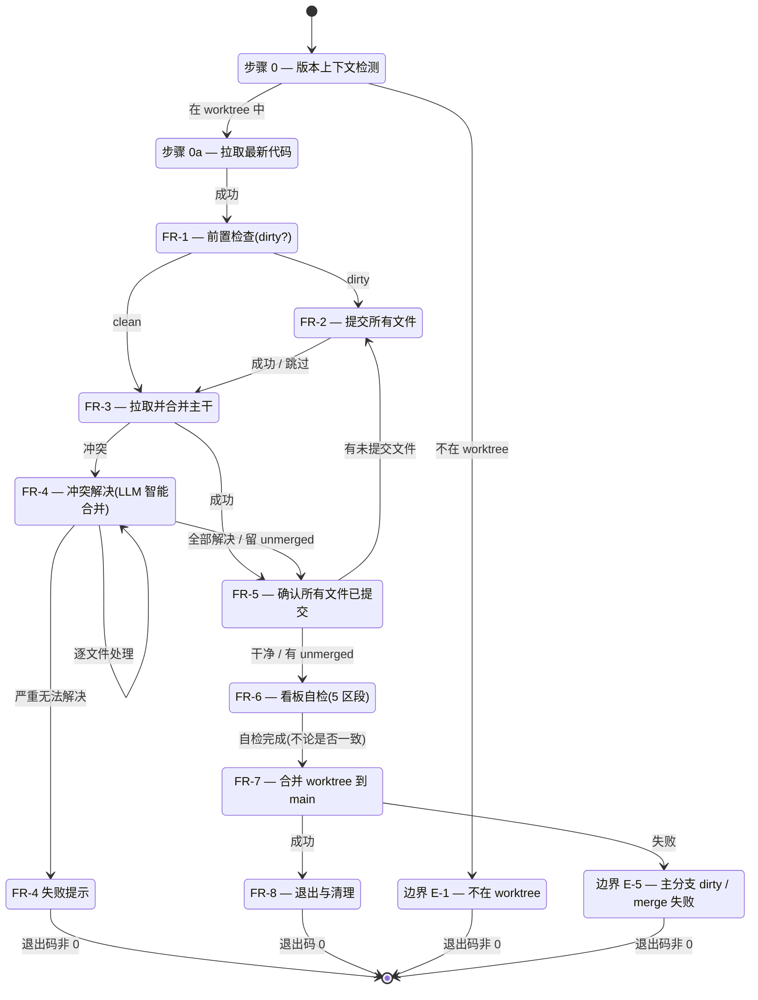

# REQ-00015 需求提示词 — 新增 `/code-merge` 技能(worktree 模式下自动合并)

> 写入方:`code-require` 技能
> 创建时间:2026-06-05 15:50
> 状态:**已完成(需求分析)**
> 关联:`encoding-conventions §规则 1/3` / `skill-conventions §规则 1` / `marketplace-protocol §规则 1` / `dashboard-conventions §规则 1`

---

## 1. 需求概述

新增第 **12** 个 `code-*` 技能 `/code-merge`,在 git worktree 模式下使用,执行以下完整流程:

1. **提交**当前 worktree 中的所有未提交文件(走 `chore(<scope>):` 格式)
2. **拉取并合并**最新的主干分支(默认 `origin/main`,用户可指定)上的代码到当前 worktree
3. **自动解决冲突**:
   - 看板数据冲突 → 保留双方数据 + 保持顺序一致 + 统计数据最终一致
   - 其他类型文件 → 根据各自功能**逐文件**分析合并
   - **不**使用脚本/工具自动解决(防止出错)
4. **再次扫描各层级看板**确保统计数据正确(全自动自检,5 区段)
5. **再次确认**所有文件已提交(无 dirty state)
6. **将 worktree 内的所有提交**合并回主分支(`git merge` 默认,保留历史)
7. **整个技能执行过程不产生任何新的过程文件、不记录结果文件**(SKILL.md 必产,因 `skill-conventions §规则 1` 强制要求;其他全部不写)

(来源:用户调用 `code-require` 时直接给出的需求描述)

---

## 2. 背景与目标

### 2.1 背景

当前 `code-skills` 仓库的 11 个 `code-*` 技能(`code-version` / `code-require` / `code-design` / `code-plan` / `code-it` / `code-unit` / `code-review` / `code-fix` / `code-publish` / `code-auto` / `code-dashboard` / `code-rule`)都是**单一文件操作**或**纯编排驱动**技能,没有专门处理 **git worktree 模式下的分支合并 + 冲突解决**的技能。

在实际开发中,用户经常:
- 在 worktree 中独立开发某条 REQ
- 完成开发后,需要把 worktree 分支合回 `main`
- 合并时经常遇到看板数据冲突(两个 REQ 都改了 `RESULT.md`)
- 手动 `git merge` 后,需要逐个文件解决冲突 — 容易出错

**痛点**:手动合并耗时 + 易错(尤其看板数据)+ 缺乏"合并后看板统计自检"能力。

### 2.2 目标

- 把"worktree → 主分支"合并 + 冲突解决流程**完全自动化**(LLM 智能合并)
- 看板数据冲突有**明确的合并规则**(保留双方 + 顺序 + 统计一致),消除歧义
- 合并后**自动**自检 5 个看板区段,确保统计数据无矛盾
- 整个执行过程**不污染**工作空间(不产生新过程文件 / 结果文件)

### 2.3 非目标

- **不**实现"自动新建 worktree"能力(由用户手动 `git worktree add`)
- **不**实现"自动删除 worktree"能力(由用户手动 `git worktree remove`)
- **不**实现"跨多个 worktree 同时合并"能力(本需求只处理 1 个 worktree)
- **不**实现"PUSH 到 origin"能力(本需求只合本地 main,推送由用户决定)
- **不**实现"自动创建 PR"能力(属 GitHub CLI 范畴)

---

## 3. 用户角色与场景

### 3.1 用户角色

- **主用户**:`code-skills` 开发者 wangmiao(基于 git config)
- **触发方**:
  - **直接调用**:用户在工作区中执行 `/code-merge` 命令
  - **间接调用**:未来 `code-auto` 在自动开发循环完成后,可能引导用户调用(本需求**不**实现自动调用)

### 3.2 典型场景

| 场景 | 描述 | 触发条件 |
| --- | --- | --- |
| **S-1** worktree 模式常规合并 | 用户在 `worktree-REQ-00015/` 中完成 REQ-00015 开发,工作区有 dirty 文件,需合回 main | `/code-merge`(无参) |
| **S-2** 指定主干分支 | 用户希望从 `develop` 分支(而非 main)拉取最新代码合并 | `/code-merge develop` |
| **S-3** 远端主干拉取 | 用户不指定分支,默认拉 `origin/main` 最新 | `/code-merge`(无参) |
| **S-4** 看板数据冲突 | 两个 REQ 都改了 `assistants/V0.0.2/RESULT.md`,合并时冲突 | 自动触发合并规则 |
| **S-5** 代码冲突 | 两个 REQ 都改了同一代码文件,合并时冲突 | LLM 逐文件分析合并 |
| **S-6** 自检发现不一致 | 合并后扫描发现任务清单统计行与实际表格行数不匹配 | 自检提示 + 不阻塞 |

---

## 4. 功能需求(FR)

### FR-1 — worktree 模式识别与前置检查

`code-merge` 启动时必须:
1. **识别**当前是否在 git worktree 中(检查 `git rev-parse --git-common-dir` 与 `git rev-parse --git-dir` 是否相同 — 不相同则说明在 worktree 中)
2. **不在 worktree** → 报错并提示:"`code-merge` 必须在 git worktree 中运行,请先 `git worktree add <path> -b <branch>`"
3. **在 worktree** → 检查当前工作区是否 dirty(`git status --porcelain` 输出非空)
4. **dirty** → 走 FR-2(提交所有文件)
5. **clean** → 跳过 FR-2,直接走 FR-3

(来源:用户需求"在 worktree 模式下使用" + REQ-00005 步骤 0a 拉取的同款 git 检查模式)

### FR-2 — 提交 worktree 内所有未提交文件

`code-merge` 必须:
1. **执行** `git add -A`(添加所有未跟踪 + 修改的文件)
2. **生成 commit message**,格式:
   ```
   chore(<scope>): <description>

   <可选 body>
   ```
   - `<scope>` 默认 `worktree-merge`,可被环境变量 `CODE_MERGE_SCOPE` 覆盖
   - `<description>` 形如 "merge worktree into <target-branch>" 或 "prepare worktree for merge"
3. **执行** `git commit -m "<message>"`
4. **失败处理**:
   - pre-commit hook 失败 → 打印 stderr,**不重试**,提示用户手动处理
   - 空提交(无变更)→ 跳过 commit,直接走 FR-3
5. **成功后**打印 `commit 完成, hash: <hash>`

(来源:用户需求"提交当前 worktree 中的所有文件" + REQ-00005 步骤 N 末尾兜底提交同款 commit 逻辑 + 用户 clarifications.md 第 3 轮问题 7)

### FR-3 — 拉取并合并主干分支

`code-merge` 必须:
1. **解析主干参数**:
   - 用户传 1 个参 `<branch>` → 取该分支(可省略 `origin/` 前缀,自动补全)
   - 用户传 0 个参 → **默认 `origin/main`**(自动 `git fetch origin` 后取 `origin/main`)
   - 用户传 2+ 个参 → 报错并提示用法
2. **执行** `git fetch origin`(拉取远端最新,即使指定本地分支也 fetch,确保冲突检测基于最新)
3. **执行** `git merge <target-branch> --no-ff`(强制产生 merge commit,保留历史)
   - 用户可通过 `--ff-only` 切换(留作 v2,本需求 v1 不实现)
4. **冲突检测**:
   - 退出码 0 + 无冲突 → 走 FR-5
   - 退出码非 0 + stderr 含 "CONFLICT" / "Merge conflict" → 走 FR-4(冲突解决)

(来源:用户需求"合并最新的主干分支(可指定)上的代码" + 用户 clarifications.md 第 2 轮问题 5 锁定 origin/main)

### FR-4 — 冲突解决(LLM 智能合并,全自动)

`code-merge` 必须按以下**优先级**处理冲突:

#### 4.1 看板数据冲突(最高优先级)

**触发条件**:冲突文件路径匹配以下任一(走 `Glob "assistants/V0.0.2/RESULT.md"` + `Glob "assistants/V0.0.2/require/REQ-*/RESULT.md"` + `Glob "assistants/V0.0.2/plan/REQ-*/PLAN.md"` + `Glob "assistants/V0.0.2/plan/REQ-*/RESULT.md"` + `Glob "assistants/V0.0.2/design/REQ-*/RESULT.md"` 预扫描):

合并规则:
1. **保留双方数据** — 不删除任何一侧的记录
2. **保持顺序一致** — 按时间戳(创建时间列)升序排列;时间戳相同按需求/任务编号升序
3. **统计数据最终一致** — 合并后必须重新计算区段"统计"行(需求清单 / 概要设计清单 / 详细设计汇总 / 任务清单 / 缺陷清单),使其与实际表格行数完全一致
4. **完成后**:打印 "✓ 看板数据合并完成, 涉及 N 个文件, 统计行已重新计算"

#### 4.2 其他类型文件(逐文件分析)

**触发条件**:非 4.1 列出的冲突文件。

合并规则:
1. **逐文件**分析(`code-merge` 不得用 `git checkout --ours` / `--theirs` 批量处理)
2. **按各自功能**决定合并方式:
   - **代码文件**(.py / .ts / .go / .rs / .java 等)→ 读双侧 + LLM 智能合并,优先保留双侧独有逻辑
   - **配置文件**(.json / .yaml / .toml)→ 优先保留双侧字段并集(去重)
   - **文档文件**(.md)→ 同 4.1 看板数据规则(保留双方 + 顺序)
   - **二进制文件**(.png / .pdf 等)→ **不自动合并**,提示用户手动处理
3. **每个文件合并后**:`git add <file>` 标记已解决
4. **所有冲突文件处理完后**:`git status` 确认无未解决冲突

(来源:用户需求"其他类型的文件根据各自功能分析合并,请逐个文件解决冲突,不要使用脚本解决" + 用户 clarifications.md 第 1 轮问题 1 锁定 LLM 智能合并)

#### 4.3 失败兜底

若某个文件合并**无法 LLM 解决**(语义冲突严重 + 无明显保留规则):
- 打印 `✗ <file> 冲突无法自动解决,需用户手动处理`
- **不**自动 `git add <file>`(留 unmerged 状态)
- **不阻塞**整体流程(继续处理其他文件)
- 最终 `git status` 报告所有 unmerged 文件清单
- **不退出**(用户后续手动 `Edit` 解决 + `git add`)

### FR-5 — 再次确认所有文件已提交

`code-merge` 必须:
1. **执行** `git status --porcelain` + `git diff --cached --stat`
2. **若有未提交文件**:
   - 自动 `git add -A` + 走 FR-2 的 commit 逻辑,生成 commit message:`chore(<scope>): post-merge cleanup`
3. **若仍有未解决冲突**:
   - 打印 `✗ 仍有 N 个 unmerged 文件: <list>`,提示用户手动处理
   - **不阻塞**,走 FR-6
4. **若一切就绪**:
   - 打印 `✓ 所有文件已提交, 准备合回主分支`

(来源:用户需求"解决冲突后再次确认所有文件的提交状态,确保提交了所有文件")

### FR-6 — 看板自检(全自动)

`code-merge` 必须扫描 5 个区段,检查统计一致性:

| # | 区段 | 路径 | 检查项 |
| --- | --- | --- | --- |
| 1 | 需求清单 | `assistants/V<版本>/RESULT.md` ## 需求清单 | 表格行数 = 统计行的"总数" |
| 2 | 概要设计清单 | `## 概要设计清单` | 表格行数 = 统计行 |
| 3 | 详细设计与任务计划汇总 | `## 详细设计与任务计划汇总` | 表格行数 = 统计行 |
| 4 | 任务清单 | `## 任务清单` | 表格行数 = 统计行的"总任务数" |
| 5 | 缺陷清单 | `## 缺陷清单` | 表格行数 = 统计行 |

**检查算法**(复用 `code-dashboard` 算法 1 + 算法 5):
1. 读 `RESULT.md`
2. 用正则 `^## ` 定位 5 个区段
3. 在每个区段内数 `^\| .* \|$` 行(过滤 `^\| ---`)
4. 与该区段"统计"行(行内形如 "**统计**:N" 或 "总数:N")对比
5. **不一致** → 打印 `✗ <区段> 统计不一致: 表格 X 行 vs 统计行 N`,**不修复**(留给用户走 `code-rule`),仅打印
6. **一致** → 打印 `✓ <区段> 统计一致 (N 行)`
7. **5 区段全部一致** → 打印 `✓ 看板自检通过`
8. **任一不一致** → 打印 `⚠ 看板自检发现问题(非阻塞), 详见上述 ✗ 行`

(来源:用户需求"可再次扫描各层级看板确保统计数据正确" + 用户 clarifications.md 第 3 轮问题 6 锁定内部自检)

### FR-7 — 合并 worktree 到主分支

`code-merge` 必须:
1. **执行** `git checkout main`(切到主分支)
   - 主分支名默认 `main`,可通过环境变量 `CODE_MERGE_TARGET` 覆盖
2. **执行** `git merge <worktree-branch> --no-ff -m "Merge branch '<worktree-branch>' into main"`
   - 走 git 默认 merge commit 消息格式(用户 clarifications.md 第 3 轮问题 7 锁定)
3. **失败处理**:
   - main 分支 dirty → 提示用户先 `git stash` 或 `git commit`,**不自动处理**
   - 合并冲突(理论上 worktree 已与 origin/main 同步后不应再有冲突)→ 走 FR-4
4. **成功后**打印:
   ```
   ✓ code-merge 完成
     · worktree: <worktree-path>
     · 源分支: <worktree-branch>
     · 目标分支: main
     · merge commit: <hash>
     · 看板自检: ✓ 通过 / ⚠ N 个不一致(非阻塞)
   ```

(来源:用户需求"再将当前 worktree 中的所有提交记录合并到主分支上" + 用户 clarifications.md 第 1 轮问题 2 锁定 git merge)

### FR-8 — 退出与清理

`code-merge` 必须:
1. **不**自动删除 worktree(留给用户手动 `git worktree remove`)
2. **不**自动 `git push`(留给用户)
3. **不**写任何过程文件 / 结果文件(SKILL.md 除外,在首次创建时产)
4. **退出码语义**:
   - 0 = 全部成功(含非阻塞警告)
   - 非 0 = 致命错误(git 命令失败 / 不在 worktree / 参数错)

---

## 5. 非功能需求(NFR)

### NFR-1 — 不产生过程文件 / 结果文件(执行阶段)

`code-merge` 在**执行阶段**不得产生任何过程文件(work-log.md / deviations.md / test-results.md 等)或结果文件(RESULT.md / PLAN.md 等)。SKILL.md 必产(在**首次创建**时,作为技能入口,符合 `skill-conventions §规则 1`);执行阶段**不**产 SKILL.md。

(强制级别:必须;来源:用户需求"整个技能过程不产生任何新的过程文件、不记录结果文件" + 用户 clarifications.md 第 2 轮问题 4 锁定)

### NFR-2 — 看板自检是核心执行步骤,非可选

`code-merge` 的看板自检(FR-6)是**核心**执行步骤,不是可选项。即使自检发现不一致,**不阻塞**整体流程,但**必须**打印详细报告。

(强制级别:必须;来源:用户 clarifications.md 第 3 轮问题 6 锁定)

### NFR-3 — LLM 智能合并的边界

`code-merge` 的 LLM 智能合并**仅**用于代码文件 + 文档文件 + 配置文件;**不**用于二进制文件(图片 / PDF / 视频 / 音频等)。二进制文件冲突必须留 unmerged 状态 + 提示用户手动。

(强制级别:必须;来源:用户需求"不要使用脚本解决,防止出错" + FR-4.2)

### NFR-4 — worktree 模式是强约束

`code-merge` **必须**在 git worktree 中运行。若在主工作区调用,直接报错并退出(退出码非 0)。不接受 `--no-worktree` 等开关(本需求 v1 不实现)。

(强制级别:必须;来源:用户需求"在 worktree 模式下使用" + FR-1)

### NFR-5 — 不修改其他 11 个 `code-*` SKILL.md

`code-merge` 的产出**不**触碰其他 11 个 `code-*` SKILL.md 的 frontmatter(符合既有 `code-auto` 风格的 NFR-6 边界)。

(强制级别:必须;来源:对齐 V0.0.2 既有 11 个 `code-*` 的强约束)

### NFR-6 — 不修改 marketplace.json / plugin.json 的字段

`code-merge` 首次创建时**需**追加 `marketplace.json` 的 `./skills/code-merge` 项(以使 Claude Code 能发现),但**不**修改其他字段(`$schema` / `name` / `version` / `description` / `owner` / 既有 skills 列表顺序)。

(强制级别:必须;来源:`marketplace-protocol §规则 1` + `code-auto` REQ-00007 T-002 同款)

### NFR-7 — 兼容 worktree 内已有 commit 历史

`code-merge` **不**回退 worktree 内已有 commit(用户的工作可能横跨多个 commit)。`git merge --no-ff` 在主分支产生一个 merge commit,**不**用 `--squash`。

(强制级别:必须;来源:用户 clarifications.md 第 1 轮问题 2 锁定 git merge)

### NFR-8 — 错误信息可读

`code-merge` 的所有错误信息必须:
- 显式打印 `✗` 前缀(失败) / `✓` 前缀(成功) / `⚠` 前缀(警告)
- 包含失败的具体 git 命令 + 退出码 + 关键 stderr 摘要
- 给出**可操作**的下一步建议(用户可读懂)

(强制级别:必须;来源:对齐 `code-dashboard` / `code-it` 既有错误信息风格)

### NFR-9 — 不在 SKILL.md 中嵌入"git 命令模板"

`code-merge` 的 SKILL.md **不**嵌入具体 git 命令模板(避免与 git 自身版本变化冲突);**只**描述工作流 + 算法,具体命令在执行时由 LLM 现场拼装。

(强制级别:建议;来源:对齐 V0.0.2 既有 11 个 `code-*` 的 SKILL.md 风格 — 描述工作流而非命令)

### NFR-10 — 不实现 v1 follow-up 项

以下功能**不**在本需求 v1 范围内,留作 v2:
- `--squash` 开关(用户已锁定 `git merge`)
- `--no-worktree` 开关(用户已锁定 worktree 模式强约束)
- `--target <branch>` 显式主分支参数(默认 `main` 通过环境变量覆盖)
- `--ff-only` 开关
- 自动 PUSH 到 origin
- 自动 `git worktree remove` 清理
- 跨多个 worktree 同时合并

(强制级别:必须;来源:本需求 §2.3 非目标)

---

## 6. 页面与界面

**无 UI 界面** — `code-merge` 是 CLI 工具,通过 stdout 输出报告,无 GUI。

### 6.1 命令语法

```bash
# 默认(无参)
/code-merge

# 指定主干分支(可省略 origin/ 前缀)
/code-merge develop
/code-merge origin/develop

# 通过环境变量配置(高级)
/code-merge  # + CODE_MERGE_SCOPE=my-scope / CODE_MERGE_TARGET=develop
```

### 6.2 stdout 输出模板

```
=== code-merge 启动 ===
worktree 路径: <worktree-path>
源分支: <worktree-branch>
默认目标分支: origin/main
[FR-1] 前置检查 ... ✓ 在 worktree 中 / ✗ dirty N 文件
[FR-2] 提交 worktree 内文件 ...
  git add -A → ✓
  git commit -m "chore(worktree-merge): ..." → ✓ hash: <hash>
[FR-3] 拉取并合并主干 ...
  git fetch origin → ✓
  git merge origin/main --no-ff → ✓ / ✗ CONFLICT
[FR-4] 冲突解决(LLM 智能合并)...
  · <file-1>: 看板数据 → ✓ 保留双方 + 统计一致
  · <file-2>: 代码 → ✓ 智能合并
  · <file-3>: 二进制 → ✗ 需用户手动
[FR-5] 再次确认提交状态 ...
  git status --porcelain → ✓ 干净 / ⚠ N unmerged
[FR-6] 看板自检(5 区段)...
  · 需求清单: ✓ 11 行 (一致)
  · 概要设计清单: ✗ 表格 3 行 vs 统计 4 行
  · 详细设计汇总: ✓ 5 行
  · 任务清单: ✓ 18 行
  · 缺陷清单: ✓ 0 行
  → ⚠ 1 个不一致(非阻塞)
[FR-7] 合并 worktree 到 main ...
  git checkout main → ✓
  git merge <worktree-branch> --no-ff -m "..." → ✓ hash: <hash>
[FR-8] 退出与清理 ...
  ✓ code-merge 完成
    · worktree: <path>
    · 源分支: <branch>
    · 目标分支: main
    · merge commit: <hash>
    · 看板自检: ⚠ 1 个不一致(非阻塞)
    · 退出码: 0
```

---

## 7. 交互逻辑(状态机)

### 7.1 状态机(Mermaid)



### 7.2 关键流程(S-1 默认场景)

```
用户 /code-merge
  ↓
步骤 0: 读 .current-version = V0.0.2
  ↓
步骤 0a: git pull
  ↓
FR-1: git rev-parse --git-common-dir ≠ --git-dir → 在 worktree 中
       git status --porcelain → dirty (3 文件)
  ↓
FR-2: git add -A → git commit -m "chore(worktree-merge): ..."
       → commit <hash-1>
  ↓
FR-3: git fetch origin → git merge origin/main --no-ff
       → CONFLICT in assistants/V0.0.2/RESULT.md
  ↓
FR-4: 识别为看板数据冲突(路径匹配)
       LLM 读双方 → 保留所有需求行 + 重新排序 + 重新计算统计行
       → git add assistants/V0.0.2/RESULT.md
  ↓
FR-5: git status --porcelain → 干净(无 unmerged)
  ↓
FR-6: 扫描 5 区段 → 全部一致 → ✓ 看板自检通过
  ↓
FR-7: git checkout main → git merge <worktree-branch> --no-ff
       → merge commit <hash-2>
  ↓
FR-8: 打印完成报告 → 退出码 0
```

---

## 8. 数据与状态

### 8.1 实体

| 实体 | 字段 | 说明 |
| --- | --- | --- |
| **Worktree** | path, branch, commit | git worktree 自身信息 |
| **Dirty 文件** | path, status(M/A/D/??) | `git status --porcelain` 输出 |
| **冲突文件** | path, type(看板/代码/二进制) | `git diff --name-only --diff-filter=U` |
| **Commit** | hash, message, author, time | `git log -1 --format=%H` 等 |
| **看板区段统计** | section_name, table_rows, stat_value | 5 个区段各一组 |

### 8.2 状态机状态

| 状态 | 进入条件 | 退出条件 | 持久化 |
| --- | --- | --- | --- |
| 启动中 | 调用 `/code-merge` | 步骤 0 完成 | 无 |
| 拉取中 | 步骤 0a 开始 | git pull 完成 | 无 |
| 前置检查 | FR-1 开始 | 检查完成 | 无 |
| 提交中 | FR-2 开始 | git commit 完成 | 无 |
| 合并中 | FR-3 开始 | git merge 完成(成功 / 冲突) | 无 |
| 冲突解决中 | FR-4 开始 | 所有冲突文件处理完 | 无 |
| 自检中 | FR-6 开始 | 5 区段扫描完 | 无 |
| 合回主分支中 | FR-7 开始 | merge commit 完成 | 无 |
| 退出中 | FR-8 开始 | 报告打印完 | 无 |

(全程**不**持久化到任何文件;NFR-1 强约束)

---

## 9. 边界与异常

| ID | 场景 | 触发条件 | 行为 | 退出码 |
| --- | --- | --- | --- | --- |
| **E-M1** | 不在 worktree | `git rev-parse --git-common-dir == --git-dir` | 打印 `✗ code-merge 必须在 git worktree 中运行`,提示 `git worktree add` | 非 0 |
| **E-M2** | 主分支 dirty(FR-7) | `git status --porcelain` 在 main 上非空 | 打印 `✗ main 分支 dirty, 请先 git stash 或 git commit`,不自动处理 | 非 0 |
| **E-M3** | worktree 路径不存在 | 用户传的 `--worktree` 路径无效 | 打印 `✗ worktree 路径 <path> 不存在` | 非 0 |
| **E-M4** | 主干分支不存在 | `git rev-parse --verify origin/main` 失败 | 打印 `✗ 主干分支 <branch> 不存在, 请检查远端` | 非 0 |
| **E-M5** | pre-commit hook 失败 | FR-2 `git commit` 退出码非 0 | 打印 stderr,不重试,提示用户手动 | 非 0 |
| **E-M6** | 二进制文件冲突 | FR-4 识别为二进制(.png/.pdf/.mp4 等) | 留 unmerged + 提示用户手动,**不阻塞** | 0(警告) |
| **E-M7** | 看板自检不一致 | FR-6 5 区段中任一不一致 | 打印详细 ✗ 行,**不修复**,不阻塞 | 0(警告) |
| **E-M8** | 参数错 | 用户传 2+ 个非空参 | 打印用法 + 退出 | 非 0 |
| **E-M9** | 主干分支冲突后无法合并(FR-4 全 unmerged) | 所有冲突文件都无法 LLM 解决 | 打印 `✗ 仍有 N 个 unmerged`,提示用户手动 | 0(警告) |
| **E-M10** | git 命令不可用 | `git --version` 失败 | 打印 `✗ 未检测到 git` | 非 0 |
| **E-M11** | `Ctrl+C` 中止 | 用户在执行中按 Ctrl+C | 立即停止,**不**回滚已 commit(commit 是 git 原子的);打印 `⛔ code-merge 中止` | 130(SIGINT) |
| **E-M12** | worktree 已被 prune | `git worktree list` 中无当前 path | 打印 `✗ 当前 worktree 已被 prune` | 非 0 |

---

## 10. 验收标准(AC)

### AC-1 — 基本流程

- [ ] **AC-1.1** 在 worktree 中 dirty 状态下调用 `/code-merge`,能完成 FR-1 → FR-2 → FR-3 → FR-5 → FR-6 → FR-7 完整流程
- [ ] **AC-1.2** worktree 干净(无 dirty)时,FR-2 自动跳过
- [ ] **AC-1.3** 合并无冲突时,FR-4 不触发,直接走 FR-5
- [ ] **AC-1.4** 合并有冲突时,FR-4 触发并按 4.1/4.2 规则处理

### AC-2 — 看板数据冲突

- [ ] **AC-2.1** 当冲突文件路径匹配 `assistants/V<版本>/RESULT.md` / `require/REQ-*/RESULT.md` / `plan/REQ-*/PLAN.md` 等 4.1 列出的"看板类"路径,自动按"保留双方 + 顺序 + 统计一致"规则合并
- [ ] **AC-2.2** 合并后,该文件的"统计"行(形如 `**统计**:N`)与实际表格行数完全一致
- [ ] **AC-2.3** 合并后,需求按"创建时间"升序排列,时间戳相同按编码升序

### AC-3 — 其他文件冲突

- [ ] **AC-3.1** 代码文件冲突时,LLM 读双方 + 智能合并 + 保留双侧独有逻辑
- [ ] **AC-3.2** 配置文件冲突时,优先保留双侧字段并集
- [ ] **AC-3.3** 二进制文件冲突时,**不**自动合并,留 unmerged + 提示
- [ ] **AC-3.4** **不**使用 `git checkout --ours` / `--theirs` 批量处理(必须逐文件分析)

### AC-4 — 看板自检

- [ ] **AC-4.1** 合并完成后,自动扫描 5 个区段(需求清单 / 概要设计清单 / 详细设计汇总 / 任务清单 / 缺陷清单)
- [ ] **AC-4.2** 每个区段打印 `✓ N 行 (一致)` 或 `✗ 表格 X 行 vs 统计 N 行`
- [ ] **AC-4.3** 5 区段全部一致时,打印 `✓ 看板自检通过`
- [ ] **AC-4.4** 任一不一致时,打印 `⚠ 看板自检发现问题(非阻塞)`,**不修复**
- [ ] **AC-4.5** 自检结果不影响退出码(总为 0,除非有 E-M1/M2/M3/M4/M5/M8/M10/M11/M12 级别的致命错误)

### AC-5 — 合并回主分支

- [ ] **AC-5.1** 走 `git merge <worktree-branch> --no-ff` 而非 `--squash`
- [ ] **AC-5.2** 主分支产生一个 merge commit(消息格式 `Merge branch '<x>' into main` 由 git 自动生成)
- [ ] **AC-5.3** worktree 内已有 commit 历史保留(主分支历史可看到 worktree 完整 commit 链)
- [ ] **AC-5.4** 默认目标分支 `main`,可通过环境变量 `CODE_MERGE_TARGET` 覆盖

### AC-6 — 不产生过程/结果文件

- [ ] **AC-6.1** 执行完成后,worktree 目录与 main 目录都**不**新增 `.md` 文件(除 `git merge` 自动产生的 merge commit 元数据)
- [ ] **AC-6.2** **不**写 `work-log.md` / `deviations.md` / `test-results.md` 等过程文件
- [ ] **AC-6.3** **不**写 `RESULT.md` / `PLAN.md` 等结果文件(看板数据冲突时**修改**现有 RESULT.md 算"修改"不算"新增")
- [ ] **AC-6.4** SKILL.md **仅在首次创建**时产,执行阶段**不**写 SKILL.md
- [ ] **AC-6.5** `git status` 在合并完成后应保持**干净**(主分支上无 uncommitted 变更)

### AC-7 — worktree 模式

- [ ] **AC-7.1** 在主工作区(非 worktree)调用时,打印 `✗ 不在 worktree 中`,退出码非 0
- [ ] **AC-7.2** 自动识别当前是否在 worktree(`git rev-parse --git-common-dir`)
- [ ] **AC-7.3** 不接受 `--no-worktree` 开关(v1 不实现)

### AC-8 — 主干默认值

- [ ] **AC-8.1** 不传参时,默认 `origin/main`
- [ ] **AC-8.2** 传 1 个参 `<branch>` 时,取该分支(自动补全 `origin/` 前缀)
- [ ] **AC-8.3** 传 2+ 个非空参时,报错并打印用法
- [ ] **AC-8.4** `git fetch origin` 失败时,打印网络错误 + 不阻塞(允许本地 fallback)

### AC-9 — 错误处理

- [ ] **AC-9.1** 所有错误信息显式前缀 `✗` / `✓` / `⚠`
- [ ] **AC-9.2** 致命错误退出码非 0,警告退出码 0
- [ ] **AC-9.3** `Ctrl+C` 中止时,立即停止,已 commit 不回滚,退出码 130
- [ ] **AC-9.4** 错误信息含"可操作的下一步建议"

### AC-10 — 与既有规范兼容

- [ ] **AC-10.1** 首次创建时,产 `plugins/code-skills/skills/code-merge/SKILL.md`,frontmatter 字节级符合 `skill-conventions §规则 1`
- [ ] **AC-10.2** 首次创建时,`marketplace.json` 追加 `./skills/code-merge`,**不**触碰其他字段
- [ ] **AC-10.3** **不**修改其他 11 个 `code-*` SKILL.md
- [ ] **AC-10.4** 任务编号解析复用 `encoding-conventions §规则 1/3`(用于看板自检时识别 TASK-REQ-NNNNN-NNNNN)

---

## 11. 关联需求(详 `related-requirements.md`)

- **REQ-00004**(添加 `/code-dashboard`)— 看板自检复用其算法 1/4/5
- **REQ-00005**(首步拉取+末步提交)— commit 逻辑同源
- **REQ-00006**(添加 `/code-publish`)— 自检不阻塞 publish 流程
- **REQ-00007**(添加 `/code-auto`)— code-auto **不**调用 code-merge
- **REQ-00010**(优化 `/code-it` 前置任务守卫)— 看板自检的"任务清单"区段检查与 code-it 同源

---

## 12. 待澄清 / 未决项(本轮无法澄清,留作 v2)

- **Q-P1** `--ff-only` 开关是否实现?(v1 否)
- **Q-P2** `--target <branch>` 显式主分支参数是否实现?(v1 否,仅环境变量 `CODE_MERGE_TARGET`)
- **Q-P3** 自动 `git push` 到 origin?(v1 否)
- **Q-P4** 自动 `git worktree remove` 清理?(v1 否)
- **Q-P5** 跨多个 worktree 同时合并?(v1 否)
- **Q-P6** 看板自检是否支持"自动修复统计行"?(v1 否,仅打印报告)
- **Q-P7** `code-auto` 是否在自动循环完成后**自动**调用 `code-merge`?(v1 否,仅在 `code-auto` 完成报告中引导用户手动调)

---

## 13. 变更记录

| 时间 | 变更类型 | 变更摘要 | 关联项 |
| --- | --- | --- | --- |
| 2026-06-05 15:50 | 需求新增 | REQ-00015 需求分析完成(共 8 FR / 10 NFR / 10 大类 AC / 12 边界场景 / 7 项已锁定 + 2 项采纳默认 / 7 项 v1 follow-up)。范围:**新增第 12 个 `code-*` 技能 `code-merge`**,在 git worktree 模式下自动执行完整合并流程(FR-1 → FR-2 → FR-3 → FR-4 → FR-5 → FR-6 → FR-7 → FR-8),含 LLM 智能合并冲突解决 + 看板 5 区段自检 + `git merge --no-ff` 合回 main + 不产生过程/结果文件(SKILL.md 必产);用户原文 0 处笔误 | REQ-00015 |
