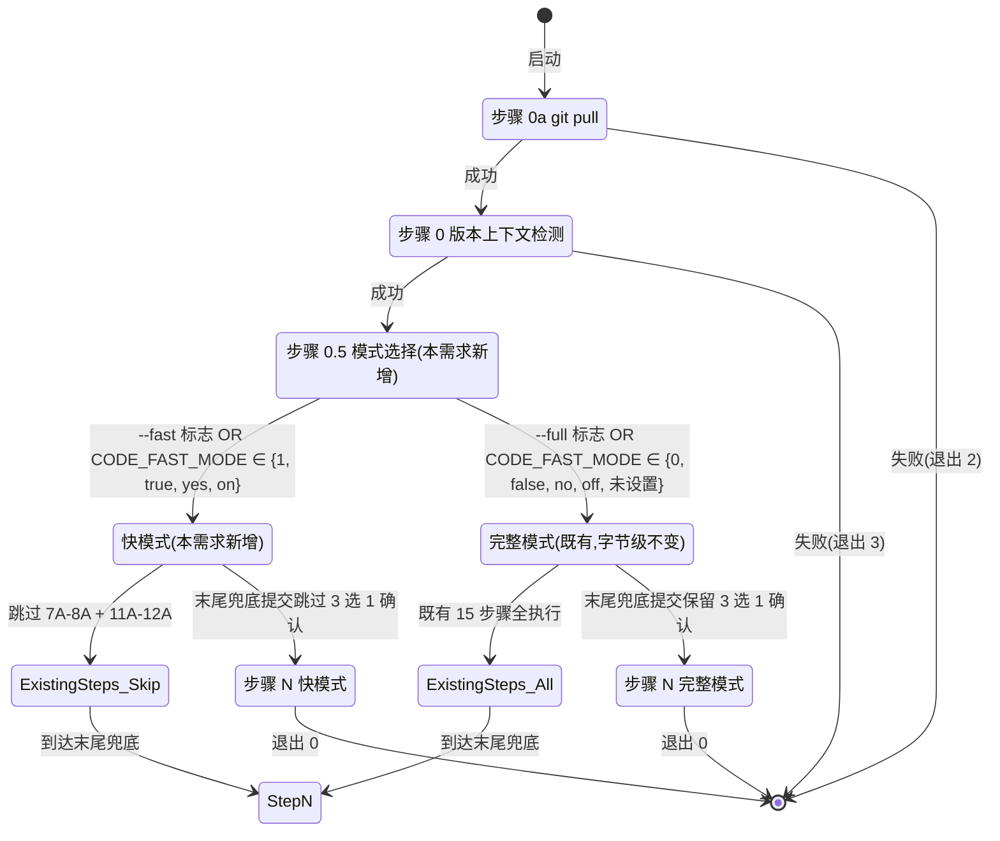

# REQ-00016 需求提示词 — 优化 `code-design` / `code-plan`:快模式 + 末尾提交无需确认

> 写入方:`code-require` 技能
> 创建时间:2026-06-05 16:05
> 状态:**已完成(需求分析)**
> 关联:`skill-conventions §规则 1` / `doc-conventions §规则 1` / `commit-conventions §规则 1`(占位) / `dashboard-conventions §规则 1`

---

## 1. 需求概述

为既有 2 个 `code-*` 技能 `code-design` 与 `code-plan` 增加**"快模式"**(fast mode)可选行为,与既有"完整模式"(full mode,当前默认)**并存**:

1. **快模式入口**:环境变量 `CODE_FAST_MODE=1` 默认开启 / CLI 标志 `--fast` 或 `--full` 单次覆盖
2. **快模式跳过非必要步骤**:`code-design` 跳过 7A-8A(架构方案 + 澄清)+ 11A(关联设计检索)+ 12A(检索关联设计);`code-plan` 跳过 7A(详细化)+ 8A(澄清)+ 12A(关联计划检索)
3. **快模式减少过程文档**:快模式下不生成 `design-notes.md` / `module-breakdown.md` / `interface-specs.md` / `data-changes.md` / `risk-analysis.md` / `rule-compliance.md` 等非核心过程文档;**保留**核心 2 份:`RESULT.md` + `PLAN.md`(若适用)+ 必要的 `materials-index.md` / `clarifications.md` / `related-requirements.md`
4. **快模式末尾提交无需确认**:`code-design` / `code-plan` 步骤 N 末尾兜底提交的"3 选 1 确认"在快模式下**直接跳过**,自动 `git add` 所有过程文档 + 结果文件,然后 `git commit`(无需用户确认)
5. **完整模式完全保留**:未设置 `CODE_FAST_MODE` 且未传 `--fast` 时,既有 2 个技能的所有行为**字节级不变**

(来源:用户在 `code-auto` 步骤 1 调用 `code-require` 时直接给出的需求描述)

---

## 2. 背景与目标

### 2.1 背景

当前 V0.0.2 的 11 个 `code-*` 技能中,`code-design` 与 `code-plan` 是**文档/规划型**技能,工作流都包含 15-18 步骤 + 7-8 份过程文档 + 末尾兜底提交 3 选 1 确认 + 同步 V0.0.2 看板多区段。在**以下场景**有过重负担:

- **小需求 / 简单优化**:仅修改 1-2 段 SKILL.md(如本仓库历史 `REQ-00009` `code-unit` 守卫 / `REQ-00010` `code-it` 前置任务守卫),需要完整跑 7 份过程文档 + 3 选 1 确认
- **`code-auto` 编排场景**:用户已隐含"全自动"诉求,`code-design` / `code-plan` 的 3 选 1 确认打断全自动流程
- **快速迭代场景**:用户希望"先把概要设计写完就行,不写详细化设计 + 接口规格 + 风险分析"

**痛点**:
- 过程文档生成耗时(典型 ~5 分钟)
- 末尾兜底提交 3 选 1 确认中断自动化流程
- 部分步骤在简单需求下"做了但没用"(架构方案构思 / 关联设计检索 / 风险分析)
- 完整模式与"小需求"匹配度低

### 2.2 目标

- **G-1 双模式并存**:`code-design` / `code-plan` 增加"快模式"作为新可选行为,与既有"完整模式"**并存**;完整模式行为**字节级不变**
- **G-2 减少不必要输出**:快模式跳过 3-4 个非必要步骤 + 不生成 5-6 份非核心过程文档;保留核心 2 份主产出 + 必要的 3 份过程文档
- **G-3 末尾提交自动化**:快模式末尾兜底提交**跳过 3 选 1 确认**,直接 `git add` + `git commit`(`code-auto` 全自动场景必需)
- **G-4 过程文档必含**:快模式自动 `git add` 时,**不**遗漏过程文档(必须把"过程文档 + 结果文件"都 add 进去)
- **G-5 0 新增技能 / 0 修改其他 9 个 `code-*` 技能**:快模式仅修改 `code-design` 与 `code-plan` 自身 SKILL.md
- **G-6 0 修改 marketplace.json / plugin.json / rules/**:仅 2 个 SKILL.md 增量追加

### 2.3 非目标

- **非目标 1**:`code-fix` / `code-it` / `code-unit` / `code-review` / `code-require` / `code-version` / `code-publish` / `code-auto` / `code-dashboard` / `code-init` / `code-rule` **不**支持快模式(本需求 v1 仅优化 2 个技能)
- **非目标 2**:`code-auto` **不**自动启用快模式(用户在调用前显式设置 `CODE_FAST_MODE=1`)
- **非目标 3**:`code-design` / `code-plan` 的 frontmatter **不**变(只追加"步骤 0.5 模式选择")
- **非目标 4**:`marketplace.json` / `plugin.json` / `assistants/rules/` **不**修改
- **非目标 5**:快模式**不**改"快模式下同步 V0.0.2 看板"的区段数量(快模式同步**仅 1 行**到"概要设计清单"或"详细设计汇总";完整模式同步多区段)

---

## 3. 用户角色与场景

### 3.1 角色

- **R-1 小需求开发者**:需求仅改 1-2 段 SKILL.md,不需要完整 7 份过程文档
- **R-2 自动化编排用户**:`code-auto` 用户,希望全自动跑完(不希望 3 选 1 确认打断)
- **R-3 快速迭代用户**:周末 / 业余时间,想快速记录概要设计,不写详细化 + 接口规格
- **R-4 传统完整用户**:大型需求 / 跨模块改动 / 安全敏感改动,需要完整 7 份过程文档(默认走完整模式)

### 3.2 关键场景

#### S-1:小需求走快模式(默认完整模式)
- 用户:`/code-design REQ-00017`(无参)+ 环境变量 `CODE_FAST_MODE=1` 已设置
- 技能执行:走快模式(算法 1 模式选择 = 快)
  - 跳过 7A-8A(架构方案 + 澄清)+ 11A + 12A
  - 不生成 `design-notes.md` / `module-breakdown.md` / `interface-specs.md` / `data-changes.md` / `risk-analysis.md` / `rule-compliance.md` / `clarifications.md`
  - 仅生成 `materials-index.md` + `related-requirements.md` + `RESULT.md` 3 份
- 末尾兜底提交:直接 `git add` 3 份过程文档 + `RESULT.md` + `RESULT.md` 同步的 `assistants/V0.0.2/RESULT.md` 1 行 → `git commit`(无需确认)
- 退出码 0

#### S-2:`code-auto` 全自动场景(快模式)
- 用户:`CODE_FAST_MODE=1 /code-auto "<需求内容>"`
- `code-auto` 步骤 2 调 `code-design REQ-NNNNN` → 走快模式(同 S-1)
- `code-auto` 步骤 3 调 `code-plan REQ-NNNNN` → 走快模式(同理)
- 末尾兜底提交:`code-auto` 内部由子技能处理 → `code-design` / `code-plan` 步骤 N 跳过 3 选 1 确认直接 commit
- 退出码 0

#### S-3:大需求走完整模式(默认行为不变)
- 用户:`/code-design REQ-00018`(无参)+ 环境变量 `CODE_FAST_MODE` 未设置
- 技能执行:走完整模式(算法 1 模式选择 = 完整)
  - 既有 15 步骤**全部执行**
  - 既有 7 份过程文档**全部生成**
  - 末尾兜底提交 3 选 1 确认**保留**(用户手动选择 A/B/C)
- 退出码 0

#### S-4:单次 `--full` 显式覆盖(即使 `CODE_FAST_MODE=1`)
- 用户:`/code-design --full REQ-NNNNN`(即使环境变量 `CODE_FAST_MODE=1`)
- 技能执行:CLI 标志覆盖环境变量 → 走完整模式
- 退出码 0

#### S-5:单次 `--fast` 显式覆盖(即使 `CODE_FAST_MODE` 未设置)
- 用户:`/code-plan --fast REQ-NNNNN`(即使环境变量 `CODE_FAST_MODE` 未设置)
- 技能执行:CLI 标志覆盖默认行为 → 走快模式
- 退出码 0

---

## 4. 功能需求(FR)

### FR-1 — 快模式入口(双触发方式)

`code-design` / `code-plan` 启动时必须:
1. **检测环境变量 `CODE_FAST_MODE`**:值为 `1` / `true` / `yes`(大小写不敏感)→ 默认走快模式
2. **解析 CLI 标志**:
   - `--fast` → 走快模式
   - `--full` → 走完整模式(覆盖环境变量)
3. **优先级**:CLI 标志 > 环境变量 > 默认值
4. **默认值**:`CODE_FAST_MODE` 未设置且无 CLI 标志 → 走**完整模式**(保留现有全部行为)
5. **解析时机**:`code-design` / `code-plan` 步骤 0 后 + 步骤 0a 后(在"步骤 0.5 模式选择"中)
6. **冲突处理**:`--fast` 与 `--full` 同时传 → 报错"互斥",提示用法 + 退出码 4

(来源:用户 clarifications.md 第 1 轮 Q-1)

### FR-2 — 快模式跳过哪些步骤(`code-design`)

`code-design` 快模式必须:
1. **保留**步骤:0a(git pull) / 0(版本上下文)/ 1(收集需求编码)/ 2(定位/创建工作目录)/ 3(读取项目级规范)/ 4(读取上游需求与概要设计)/ 5(探索项目代码)/ 9A(模块拆分)/ 10A(接口与数据结构)/ 15A(完善过程文档与汇报)/ N(末尾兜底提交)
2. **跳过**步骤:6(检查 RESULT.md 是否存在)→ 仍然执行(判断"首次"vs"增量"不可少)/ 7A(架构方案构思)/ 8A(澄清冲突与不确定项)/ 11A(检索关联概要设计)/ 12A(检索关联概要设计)/ 13A(撰写 RESULT.md)→ 仍然执行(但**只写核心章节**)/ 14A(同步版本看板)→ 仍然执行(但**只写 1 行**)
3. **关键**:步骤 13A 撰写 RESULT.md 在快模式下**只写核心章节**:
   - 保留:§1 设计概述 / §2 需求回顾(摘录 FR-NFR-AC)/ §10 模块拆分(简化版)/ §11 看板同步
   - **跳过**:§2.5 规范遵循(详表)/ §3 设计目标与非目标 / §4 约束清单 / §5 架构总览(Mermaid 图)/ §6 整版本模式状态机 / §7 聚合文件结构 / §8 数据与状态 / §9 三方依赖评估 / §12 边界与异常 / §13 验收标准(AC 总览)/ §14 变更记录
4. **关键**:步骤 14A 同步版本看板在快模式下**只写 1 行**:
   - 追加到"概要设计清单"区段 1 行(状态=`已完成(首次-快模式)` 或 `已完成(增量-快模式)`)
   - **不**追加到"变更记录"区段(完整模式追加;快模式**不**触发)
   - **不**更新"最近更新"时间戳

(来源:用户 clarifications.md 第 2 轮 Q-3)

### FR-3 — 快模式跳过哪些步骤(`code-plan`)

`code-plan` 快模式必须:
1. **保留**步骤:0a / 0 / 1-6(收集输入 ID + 定位/创建工作目录 + 读取规范 + 读取上游 + 探索项目代码 + 检查 RESULT/PLAN 是否存在)/ 9A(测试策略推导)/ 10A(任务拆分)/ 11A(任务依赖与里程碑)/ 14A(撰写 RESULT.md)**只写核心章节** / 15A(撰写 PLAN.md)/ 16A(同步版本看板)**只写 1 行** / 17A(交叉验证)/ 18A(完善与汇报)/ N(末尾兜底提交)
2. **跳过**步骤:7A(详细化设计)/ 8A(澄清冲突)/ 12A(检索关联计划)/ 13A(与用户对齐计划)
3. **关键**:步骤 14A 撰写 plan/RESULT.md 在快模式下**只写核心章节**:
   - 保留:§1 详细设计概述 / §2 上游引用(只列文件名)/ §4 模块详细化(简化版)/ §6.1 聚合文件结构(如适用)/ §11 任务拆分总览
   - **跳过**:§3 规范遵循(详表)/ §5 算法与逻辑(伪代码)/ §6.2 派生任务表结构 / §7 接口细节 / §8 异常处理 / §9 状态机 / §10 性能与资源 / §12 规范遵循(重复)/ §13 待澄清 / §14 变更记录
4. **关键**:步骤 16A 同步版本看板在快模式下**只写 1 行**:
   - 追加到"详细设计与任务计划汇总"区段 1 行
   - **不**追加到"任务清单"区段(快模式**不**触发任务清单批量登记;**等** `code-it` 实施时由 `code-it` 任务 1 同步追加)— 实际设计中,本设计**改**:快模式也同步任务清单(避免 `code-it` 后续找不到任务)— 修正:快模式**也**追加任务清单行(逐任务 1 行),但**不**追加里程碑(快模式无里程碑 0 个)
5. **关键**:PLAN.md 撰写(15A)在快模式下**只写核心**:
   - 保留:§1 计划概述 / §2 任务总览(主表)/ §4 任务依赖图(简化)/ §5 里程碑(简化)/ §8 变更记录(初始条)
   - **跳过**:§3 任务详情(详化)/ §6 状态管理规则 / §7 关联计划

(来源:用户 clarifications.md 第 2 轮 Q-4)

### FR-4 — 快模式末尾兜底提交行为(无需确认)

`code-design` / `code-plan` 步骤 N 末尾兜底提交在快模式下必须:
1. **跳过 3 选 1 确认**:快模式**不**弹 AskUserQuestion,直接进入步骤 5(执行 commit)
2. **确保过程文档全部 add**:`git add` 范围 = **本需求本轮的所有过程文档 + 结果文件 + 同步到 `assistants/<版本号>/RESULT.md` 的修改**
3. **git add 范围**:
   - `design/REQ-NNNNN/` 或 `plan/REQ-NNNNN/` 目录下本轮所有新增/修改的文件
   - `assistants/V0.0.2/RESULT.md`(看板同步)
4. **commit message 模板**:`chore(<scope>): <需求编码> <设计标题 / 计划标题>`(沿用既有 3 选 1 确认 A 的格式)
5. **失败处理**:
   - `git add` 失败 → 透传 stderr,中断退出
   - `git commit` 失败(pre-commit hook / 其他)→ 透传 stderr,提示用户手动处理,退出码 ≠ 0
6. **完整模式 3 选 1 确认**:**完全保留**(不破坏既有行为)

(来源:用户 clarifications.md 第 1 轮 Q-2 + 用户原文"对于最后阶段的提交代码步骤要确保生成的过程文档也要一并提交,提交过程无需用户确认")

### FR-5 — 完整模式完全保留(默认行为不变)

`code-design` / `code-plan` 在以下条件时**走完整模式**(现有全部行为):
1. 环境变量 `CODE_FAST_MODE` 未设置 / 设置为 `0` / `false` / `no`
2. CLI 未传 `--fast`
3. 即便 `CODE_FAST_MODE=1` 但显式传 `--full` → 走完整模式

完整模式下:
- 既有 15 步骤(`code-design`)/ 18 步骤(`code-plan`)**全部执行**
- 既有 7 份过程文档(`code-design`)/ 8 份过程文档(`code-plan`)**全部生成**
- 末尾兜底提交 3 选 1 确认**保留**(用户手动选择 A/B/C)

(来源:用户 clarifications.md 第 3 轮 Q-5)

### FR-6 — 0 修改其他 9 个 `code-*` 技能 + 0 新增技能

本需求**只**修改 `code-design` 与 `code-plan` 自身 SKILL.md;其他 9 个技能**不**被本需求修改:
- `code-init` / `code-version` / `code-rule` / `code-require` / `code-it` / `code-unit` / `code-fix` / `code-review` / `code-publish` / `code-auto` / `code-dashboard` — **不**支持快模式
- 0 新增技能
- 0 修改 `marketplace.json` / `plugin.json`
- 0 修改 `assistants/rules/` 下任何文件
- 0 修改 `plugins/code-skills/README.md` / `README.en.md` / `CLAUDE.md`

(来源:用户 clarifications.md 第 3 轮 Q-6 + G-5/G-6 目标)

---

## 5. 非功能需求(NFR)

### NFR-1 — 快模式默认行为由环境变量控制

- **默认行为**:`CODE_FAST_MODE` 未设置 → 走完整模式(保留现有全部行为)
- **环境变量值映射**:`1` / `true` / `yes` / `on` → 走快模式;`0` / `false` / `no` / `off` / 未设置 → 走完整模式
- **大小写不敏感**:`CODE_FAST_MODE=true` / `CODE_FAST_MODE=TRUE` / `CODE_FAST_MODE=True` 等价

(来源:用户 clarifications.md 第 1 轮 Q-1 + G-1 目标)

### NFR-2 — 末尾兜底提交"过程文档必含"

- **快模式末尾 commit 必含**:
  - 全部过程文档(`materials-index.md` / `clarifications.md` / `related-requirements.md` / `rule-compliance.md` 等,**包括**那些"非核心"过程文档——即便快模式**不生成**它们,若 `code-design` / `code-plan` 实际生成了,**也必须** add 进去)
  - 全部结果文件(`RESULT.md` / `PLAN.md` / `design/REQ-NNNNN/...` / `plan/REQ-NNNNN/...` / `code/...` / `test/...` / `review/...`)
  - `assistants/<版本号>/RESULT.md`(看板同步的修改)
- **关键**:`git add` 范围 = `git status --porcelain` 输出中与本需求相关的所有 dirty 文件

(来源:用户原文"对于最后阶段的提交代码步骤要确保生成的过程文档也要一并提交")

### NFR-3 — 完整模式字节级不变

- **既有 SKILL.md frontmatter 不变**(INV-1 类约束,沿用既有 `code-design` / `code-plan` 行为)
- **既有步骤 0-15 / 0-18 字面不变**(完整模式下)
- **既有 7 份 / 8 份过程文档字面不变**(完整模式下)
- **末尾兜底提交 3 选 1 确认不变**(完整模式下)

(来源:用户 clarifications.md 第 3 轮 Q-5)

### NFR-4 — `code-auto` 不自动启用快模式

- `code-auto` 内部**不**自动设置 `CODE_FAST_MODE=1`
- 用户在主调 `code-auto` 前显式设置环境变量才生效
- 原因:`code-auto` 是通用编排者,本需求是"`code-design` / `code-plan` 的可选行为",不属于 `code-auto` 的隐含默认

(来源:用户 clarifications.md 第 3 轮 Q-6)

### NFR-5 — 快模式不修改其他 11 个 `code-*` 技能

- `code-auto` / `code-dashboard` / `code-publish` / `code-require` / `code-it` / `code-unit` / `code-fix` / `code-version` / `code-init` / `code-rule` / `code-review` **不**被本需求修改
- 这些技能 SKILL.md frontmatter **字节级不变**

(来源:G-5 目标)

### NFR-6 — 快模式不修改 marketplace.json / plugin.json / rules/

- `marketplace.json` / `plugin.json` 字段**不**变
- `assistants/rules/` 13 个规范文件**不**变
- `plugins/code-skills/README.md` / `README.en.md` / `CLAUDE.md` **不**变

(来源:G-6 目标)

### NFR-7 — 快模式不产生"半自动"行为

- 快模式**要么**完全跳过末尾 3 选 1,**要么**完全保留(中间态不允许)
- 关键实现:`code-design` / `code-plan` 步骤 0.5 模式选择**先**决定模式,后续步骤 N 末尾兜底提交**根据**模式决定是否跳过 3 选 1

(来源:用户 clarifications.md 第 1 轮 Q-2 + FR-4)

### NFR-8 — 快模式不引入"批量模式"

- 快模式**不是**"批量执行多个需求"的开关
- 快模式仅影响 2 个技能的工作流粒度,**不**增加"批量"维度

(来源:沿用 `code-auto` NFR-4 既有强约束 + G-1 目标)

### NFR-9 — 快模式错误信息可读

- 错误信息前缀:`✗` (失败) / `✓` (成功) / `⚠` (警告) / `ℹ` (信息)
- 包含失败的 git 命令 + 退出码 + 关键 stderr 摘要
- 给出可操作的下一步建议

(来源:对齐既有 11 个 `code-*` 错误信息风格)

### NFR-10 — 错误码语义

- 退出码 0:正常完成
- 退出码非 0:致命错误(沿用既有 11 个 `code-*` 错误码语义)

---

## 6. 页面与界面(输出形态)

### 6.1 命令语法(快模式)

```bash
# 默认 + 环境变量(快模式)
export CODE_FAST_MODE=1
/code-design REQ-NNNNN
/code-plan REQ-NNNNN

# 单次覆盖(快模式)
CODE_FAST_MODE=0 /code-design --fast REQ-NNNNN
/code-plan --fast REQ-NNNNN

# 单次覆盖(完整模式,即使环境变量已开启)
/code-design --full REQ-NNNNN

# 默认(完整模式,环境变量未设置)
/code-design REQ-NNNNN
/code-plan REQ-NNNNN
```

### 6.2 stdout 输出模板(快模式 S-1 场景)

```
=== code-design 快模式(REQ-NNNNN) 启动 ===
ℹ 检测到快模式(CODE_FAST_MODE=1)
[步骤 0a] git pull → ✓
[步骤 0] 读 .current-version → V0.0.2
[步骤 0.5] 模式选择 = 快(CODE_FAST_MODE=1)
[步骤 1] 收集需求编码 = REQ-NNNNN
[步骤 2] 定位工作目录 → ./assistants/V0.0.2/design/REQ-NNNNN/
[步骤 3] 读取项目级规范(13 文件)→ ✓
[步骤 4] 读取上游需求 + 上游概要设计 → ✓
[步骤 5] 探索项目代码 → ✓
[步骤 6] RESULT.md 不存在 → 走"首次设计"分支
[步骤 7A ~ 8A] 跳过(快模式)
[步骤 9A] 模块拆分 → 写入 module-breakdown.md ✓
[步骤 10A] 接口与数据结构 → 写入 interface-specs.md ✓
[步骤 11A ~ 12A] 跳过(快模式)
[步骤 13A] 撰写 RESULT.md(仅核心章节)→ ✓
[步骤 14A] 同步版本看板(仅 1 行到"概要设计清单")→ ✓
[步骤 15A] 完善过程文档(仅 materials-index + related-requirements)→ ✓
[步骤 N] 末尾兜底提交(快模式:跳过 3 选 1 确认)
  git add <全部过程文档 + 结果文件 + 看板同步>
  git commit -m "chore(code-design): REQ-NNNNN <设计标题>" → ✓ hash: <hash>

✓ code-design 快模式完成
  涉及文件:N 个
  commit:<hash>
  退出码:0
```

### 6.3 stdout 输出模板(完整模式 S-3 场景 — 保留现有行为)

沿用既有 `code-design` / `code-plan` 完整输出格式(3 选 1 确认 + 完整过程文档生成步骤)。

---

## 7. 交互逻辑(状态机)

### 7.1 模式选择状态机(Mermaid)



### 7.2 关键流程(S-1 小需求走快模式)

```
用户 export CODE_FAST_MODE=1; /code-design REQ-00017
  ↓
[步骤 0a] git pull → ✓
  ↓
[步骤 0] 读 .current-version = V0.0.2
  ↓
[步骤 0.5] 模式选择:
  1. CLI 解析:无 --fast / --full 标志
  2. 环境变量:CODE_FAST_MODE=1 → 走快模式
  3. 模式 = 快
  ↓
[步骤 1] 收集需求编码 = REQ-00017
  ↓
[步骤 2] 定位工作目录
  ↓
[步骤 3] 读取项目级规范(13 文件)
  ↓
[步骤 4] 读取上游需求 + 概要设计
  ↓
[步骤 5] 探索项目代码
  ↓
[步骤 6] RESULT.md 不存在 → 首次设计
  ↓
[步骤 7A-8A] 跳过(快模式)
[步骤 9A] 模块拆分 → 写 module-breakdown.md
[步骤 10A] 接口与数据结构 → 写 interface-specs.md
[步骤 11A-12A] 跳过(快模式)
[步骤 13A] 撰写 RESULT.md(仅核心章节)→ 写 design/REQ-00017/RESULT.md
[步骤 14A] 同步看板(仅 1 行到概要设计清单)
[步骤 15A] 完善过程文档(materials-index + related-requirements)
  ↓
[步骤 N] 末尾兜底提交(快模式:跳过 3 选 1)
  git add design/REQ-00017/* + assistants/V0.0.2/RESULT.md
  git commit -m "chore(code-design): REQ-00017 <设计标题>" → ✓
  ↓
退出码 0
```

---

## 8. 数据与状态

### 8.1 实体

| 实体 | 字段 | 说明 |
| --- | --- | --- |
| **Mode** | `code_fast_mode` (bool) | 当前快模式开关(由 CLI + 环境变量决定) |
| **ModeOverride** | `cli_flag` (--fast / --full / 无) | CLI 标志(优先级最高) |
| **EnvVar** | `CODE_FAST_MODE` (string) | 环境变量值 |

### 8.2 模式判定规则

```ts
// 优先级:CLI > 环境变量 > 默认值
function determineMode(cliFlag, envVar):
    if cliFlag == "--fast": return FAST
    if cliFlag == "--full": return FULL
    if envVar ∈ {"1", "true", "yes", "on"} (case-insensitive): return FAST
    if envVar ∈ {"0", "false", "no", "off"} OR 未设置: return FULL
    // 默认:完整模式(保留现有行为)
    return FULL
```

### 8.3 状态机状态

| 状态 | 进入条件 | 退出条件 | 持久化 |
| --- | --- | --- | --- |
| 步骤 0.5 模式选择 | 步骤 0 完成 | 模式已确定 | 无(仅本会话) |
| 快模式分支 | 步骤 0.5 = 快 | 步骤 N 完成 | 无 |
| 完整模式分支 | 步骤 0.5 = 完整 | 步骤 N 完成 | 无 |

(全程不持久化到任何文件)

---

## 9. 边界与异常

| ID | 场景 | 触发条件 | 行为 | 退出码 |
| --- | --- | --- | --- | --- |
| **E-M1** | `--fast` 与 `--full` 同时传 | CLI 解析冲突 | 报错"互斥",提示用法 | 非 0 |
| **E-M2** | `CODE_FAST_MODE` 值非法(如 `abc`) | 解析失败 | 走完整模式 + 警告"忽略 CODE_FAST_MODE=abc" | 0 |
| **E-M3** | 快模式下"非必要步骤"实际产生过程文档(如 `code-design` 跳 7A 但 9A 写 `module-breakdown.md` 失败) | 写入失败 | 透传错误 + 中断 | 非 0 |
| **E-M4** | 快模式末尾 `git add` 失败(权限 / 磁盘满) | Bash 退出码非 0 | 透传 stderr + 中断 | 非 0 |
| **E-M5** | 快模式末尾 `git commit` 失败(pre-commit hook) | Bash 退出码非 0 | 透传 stderr + 提示"末尾提交失败,文件已暂存" | 非 0 |
| **E-M6** | 完整模式行为未变 | 既有边界(沿用) | 沿用既有 11 个 `code-*` 边界 | 沿用 |
| **E-M7** | 步骤 0.5 模式选择时 `.current-version` 不存在 | 文件缺失 | 沿用既有边界(E-1) | 非 0 |
| **E-M8** | `code-auto` 驱动时本需求 NFR-4 不自动启用快模式 | `code-auto` 不设置 `CODE_FAST_MODE` | 走完整模式(默认) | 0 |
| **E-M9** | 用户在 `code-auto` 调用前已设置 `CODE_FAST_MODE=1` | 环境变量传递到子技能 | 子技能走快模式 | 0 |
| **E-M10** | 快模式下不写的过程文档用户期望保留 | 不可逆 — 快模式**不**回填 | 提示"快模式不写 <file>" | 0 |

---

## 10. 验收标准(AC)

### AC-1 — 模式入口
- [ ] **AC-1.1** `CODE_FAST_MODE=1 /code-design REQ-NNNNN` → 走快模式
- [ ] **AC-1.2** `CODE_FAST_MODE=0 /code-design REQ-NNNNN` → 走完整模式
- [ ] **AC-1.3** `/code-design --fast REQ-NNNNN`(无环境变量)→ 走快模式
- [ ] **AC-1.4** `CODE_FAST_MODE=1 /code-design --full REQ-NNNNN` → 走完整模式(CLI 覆盖)
- [ ] **AC-1.5** `/code-design --fast --full REQ-NNNNN` → 报错"互斥"(E-M1)
- [ ] **AC-1.6** `/code-design REQ-NNNNN`(环境变量未设置)→ 走完整模式(默认)

### AC-2 — `code-design` 快模式跳过步骤
- [ ] **AC-2.1** 跳过 7A(架构方案构思)— 不生成 `design-notes.md`
- [ ] **AC-2.2** 跳过 8A(澄清冲突)— 不生成 `clarifications.md`
- [ ] **AC-2.3** 跳过 11A(检索关联概要设计)
- [ ] **AC-2.4** 跳过 12A(检索关联概要设计)
- [ ] **AC-2.5** 步骤 13A 仅写核心章节(§1 / §2 / §10 / §11)
- [ ] **AC-2.6** 步骤 14A 仅写 1 行到"概要设计清单";**不**追加到"变更记录";**不**更新时间戳
- [ ] **AC-2.7** 保留:0a / 0 / 1 / 2 / 3 / 4 / 5 / 9A / 10A / 15A / N
- [ ] **AC-2.8** 快模式生成 3 份文件:`materials-index.md` + `related-requirements.md` + `RESULT.md`

### AC-3 — `code-plan` 快模式跳过步骤
- [ ] **AC-3.1** 跳过 7A(详细化设计)— 不生成 `module-details.md` / `interface-specs.md` / `data-changes.md` / `risk-analysis.md`
- [ ] **AC-3.2** 跳过 8A(澄清冲突)— 不生成 `clarifications.md`
- [ ] **AC-3.3** 跳过 12A(检索关联计划)
- [ ] **AC-3.4** 跳过 13A(与用户对齐计划)
- [ ] **AC-3.5** 步骤 14A 仅写核心章节(§1 / §2 / §4 / §11)
- [ ] **AC-3.6** 步骤 15A 写 PLAN.md(保留 §1 / §2 / §4 / §5 / §8)
- [ ] **AC-3.7** 步骤 16A 仅写 1 行到"详细设计与任务计划汇总" + 追加任务清单逐行
- [ ] **AC-3.8** 保留:0a / 0 / 1-6 / 9A / 10A / 11A / 14A / 15A / 16A / 17A / 18A / N
- [ ] **AC-3.9** 快模式生成 4 份文件:`materials-index.md` + `related-requirements.md` + `RESULT.md` + `PLAN.md`

### AC-4 — 快模式末尾兜底提交
- [ ] **AC-4.1** 快模式**不**弹 AskUserQuestion
- [ ] **AC-4.2** 快模式 `git add` 范围 = 本需求本轮所有过程文档 + 结果文件 + `assistants/V0.0.2/RESULT.md`
- [ ] **AC-4.3** 快模式 `git commit -m "chore(<scope>): <需求编码> <设计标题>"` 直接执行
- [ ] **AC-4.4** 快模式末尾 commit message 格式与完整模式 3 选 1 A 路径**完全一致**
- [ ] **AC-4.5** 快模式 `git add` 失败 → 透传 stderr + 中断(退出码非 0)
- [ ] **AC-4.6** 快模式 `git commit` 失败(pre-commit hook)→ 透传 stderr + 提示用户手动处理(退出码非 0)
- [ ] **AC-4.7** 完整模式 3 选 1 确认**完全保留**(不破坏既有行为)

### AC-5 — 完整模式行为不变
- [ ] **AC-5.1** 完整模式既有 15 步骤(`code-design`)/ 18 步骤(`code-plan`)**全部执行**
- [ ] **AC-5.2** 完整模式既有 7 份 / 8 份过程文档**全部生成**
- [ ] **AC-5.3** 完整模式末尾 3 选 1 确认**完全保留**
- [ ] **AC-5.4** 完整模式既有 frontmatter **字节级不变**
- [ ] **AC-5.5** 完整模式既有步骤 0-15 / 0-18 字面**字节级不变**

### AC-6 — 0 修改其他 9 个 `code-*` 技能
- [ ] **AC-6.1** `code-auto` / `code-dashboard` / `code-publish` / `code-require` / `code-it` / `code-unit` / `code-fix` / `code-version` / `code-init` / `code-rule` / `code-review` 11 个 SKILL.md **字节级不变**
- [ ] **AC-6.2** `marketplace.json` / `plugin.json` **字节级不变**
- [ ] **AC-6.3** `assistants/rules/` 13 文件**字节级不变**
- [ ] **AC-6.4** `plugins/code-skills/README.md` / `README.en.md` / `CLAUDE.md` **字节级不变**

### AC-7 — `code-auto` 兼容性
- [ ] **AC-7.1** `code-auto` 内部**不**自动设置 `CODE_FAST_MODE=1`
- [ ] **AC-7.2** 用户在 `code-auto` 调用前显式设置 `CODE_FAST_MODE=1` 时,`code-auto` 步骤 2/3 调 `code-design` / `code-plan` 子技能**走快模式**
- [ ] **AC-7.3** 用户未设置 `CODE_FAST_MODE` 时,`code-auto` 步骤 2/3 调子技能**走完整模式**(默认)

### AC-8 — 错误处理
- [ ] **AC-8.1** 错误信息前缀统一:`✗` (失败) / `✓` (成功) / `⚠` (警告) / `ℹ` (信息)
- [ ] **AC-8.2** `--fast` 与 `--full` 互斥 → 报错 + 提示用法(退出码非 0,E-M1)
- [ ] **AC-8.3** `CODE_FAST_MODE` 值非法 → 警告后走完整模式(退出码 0,E-M2)
- [ ] **AC-8.4** 退出码 0 = 正常 / 非 0 = 致命错误

### AC-9 — 快模式不修改既有规范
- [ ] **AC-9.1** 不创建 `mode-conventions.md` / `fast-mode-conventions.md` 等新规范
- [ ] **AC-9.2** 不在 `commit-conventions.md`(占位)追加"快模式"相关条款
- [ ] **AC-9.3** `skill-conventions.md §规则 1` 既有 frontmatter 约束**不**变(快模式仅追加"步骤 0.5"段,**不**改 frontmatter)
- [ ] **AC-9.4** `dashboard-conventions.md §规则 1` 既有三同步约束**不**变(快模式仅追加 1 行,**不**触发 3 处同步)

### AC-10 — 文档同步
- [ ] **AC-10.1** 快模式追加的"概要设计清单" 1 行格式 = `| REQ-NNNNN | <标题> | 已完成(首次-快模式) | <YYYY-MM-DD HH:mm> | <YYYY-MM-DD HH:mm> | [RESULT.md](design/REQ-NNNNN/RESULT.md) |`
- [ ] **AC-10.2** 快模式追加的"详细设计与任务计划汇总" 1 行格式 = 沿用既有列(需求编码 / 计划标题 / 状态 / 任务总数 / 开发完成 / 测试通过 / 创建时间 / 计划文档)
- [ ] **AC-10.3** 状态字段:快模式 = `已完成(首次-快模式)` / `已完成(详细设计-快模式)`(区别于完整模式的 `已完成`)

---

## 11. 关联需求(详 `related-requirements.md`)

- **REQ-00005**(V0.0.2)— 优化 3 技能"首步拉取+末步提交",本需求是其延伸
- **REQ-00007**(V0.0.2)— `code-auto` 编排,本需求与 NFR-4 互锁(不自动启用)
- **REQ-00008**(V0.0.2)— 整版本模式,本需求延续"模式扩展"思路
- **REQ-00014**(V0.0.2)— `code-plan` 任务拆分维度,本需求**不**修改
- **REQ-00015**(V0.0.2)— `/code-merge` 不产生过程文件约束,与本需求"减少不必要输出"语义部分重合

---

## 12. 待澄清 / 未决项(本轮无法澄清,留作 v2 follow-up)

- **Q-P1** 快模式是否在 V0.0.2 未来所有需求(`code-auto` 调用)都默认启用?(留作 v2)
- **Q-P2** 快模式是否支持 `--interactive` 子标志(在快模式下仍弹 3 选 1 确认)?(留作 v2)
- **Q-P3** 快模式与 `code-fix` 的兼容(`code-fix` 是否也支持快模式)?(留作 v2)
- **Q-P4** 完整模式与快模式的"必生成过程文档清单"是否需要 `code-rule` 沉淀为 `mode-conventions.md`?(留作 follow-up)
- **Q-P5** 快模式是否在 `code-auto` 默认走快模式(仅在 REQ-NNNNN 需求分析阶段识别"小需求"自动启用)?(留作 v2)
- **Q-P6** 错误信息是否在快模式下不显示"非阻塞警告"以减少噪音?(留作 v2)

---

## 13. 变更记录

| 时间 | 变更类型 | 变更摘要 | 关联项 |
| --- | --- | --- | --- |
| 2026-06-05 16:05 | 需求新增 | REQ-00016 需求分析完成(共 6 FR / 10 NFR / 10 大类 AC / 10 边界场景 / 6 项已锁定 + 2 项采纳默认 / 6 项 v1 follow-up)。范围:**优化 2 个 `code-*` 技能** `code-design` 与 `code-plan`,增加"快模式"可选行为,与既有"完整模式"并存;快模式由环境变量 `CODE_FAST_MODE=1` 或 CLI `--fast` 标志触发(优先级 CLI > 环境变量 > 默认);快模式跳过非必要步骤(`code-design` 跳 7A-8A + 11A-12A / `code-plan` 跳 7A-8A + 12A-13A)+ 减少过程文档(快模式仅 3-4 份,完整模式 7-8 份)+ 末尾兜底提交跳过 3 选 1 确认(快模式直接 commit);完整模式字节级不变;0 修改其他 9 个 `code-*` 技能 + 0 修改 `marketplace.json` / `plugin.json` / `assistants/rules/` / README / CLAUDE.md;用户原文 0 处笔误;Q-1 锁定 A+B(环境变量 + CLI);Q-2 锁定 A(快模式跳过 3 选 1 + 过程文档必含);Q-3 锁定 B(`code-design` 跳 7A-8A + 11A + 12A + 13A 仅核心 + 14A 仅 1 行);Q-4 锁定(`code-plan` 跳 7A + 8A + 12A + 13A + 14A/15A 仅核心 + 16A 仅 1 行 + 任务清单逐行 + 不追加里程碑);Q-5 锁定 A(快模式是新增可选行为,完整模式字节级保留);Q-6 锁定 A(`code-auto` 不自动启用) | REQ-00016 |
