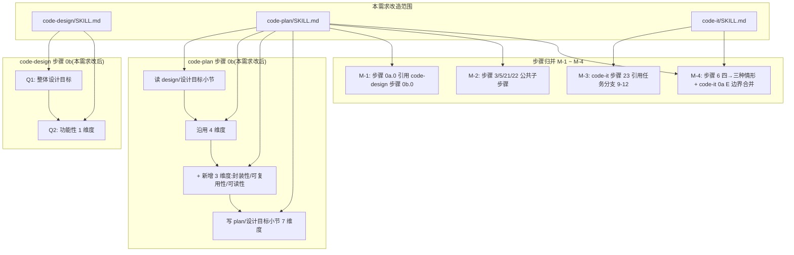

# 概要设计 — REQ-00020(优化 code-design / code-plan,架构设计目标重新归位 + 新增 3 维度 + 步骤归并)

- 需求编码:REQ-00020
- 所属版本:V0.0.3
- 文档版本:v1
- 状态:已锁定
- 责任人:wangmiao
- 创建:2026-06-06
- 最近更新:2026-06-06 17:30
- 当前版本:v1
- **上游**:`./assistants/V0.0.3/require/REQ-00020/RESULT.md`(v1,2026-06-06 16:30)
- **遵循规范**:`./assistants/rules/` 下 13 个文件(本需求 0 触发 §规则 1 三同步,详 §3)
- **架构对象**:`code-skills` 仓库**自身**的 3 个 `code-*` 技能(`code-design` / `code-plan` / `code-it`)+ 1 份需求提示词文档(`require/REQ-00020/RESULT.md`)

---

## 设计目标

> 本小节由 `code-design` 步骤 0b 自动生成,记录用户确认的设计目标。

- **回写时间**:2026-06-06 17:30
- **回写触发**:`code-design` 步骤 0b

### 整体设计目标
`--extensible`(用户选定,本需求为大需求 — `code-design` 步骤 0b 简化为 1 维度(功能性)+ 整体 1 问,本需求按"更灵活后期拓展"语义设计)

### 维度优先级

| 维度 | 优先级 | 依据 |
| --- | --- | --- |
| 功能性 | 中 | 本需求是元技能改造,功能性=中(沿用 SKILL.md 既有功能,非新增能力) |

> 注:本需求是 `code-design` 步骤 0b **本需求 REQ-00020 改造后**的首次执行(沿用 REQ-00020 FR-1 简化为 1 维度);架构维度(扩展性 / 健壮性 / 可维护性 / 封装性 / 可复用性 / 可读性)由 `code-plan` 阶段确认。

### 设计目标对本设计的影响(AC-4 沿用 + 扩展)

- 整体=`--extensible` + 7 维度中"扩展性=高" → 任务总览加"扩展架构设计"等任务(本设计**不**派生任务,仅在 §3 概要架构中显式体现)
- 本设计重点关注"未来如何承接 REQ-00021 类后续优化"(REQ-00021 模板参数是 REQ-00020 后的下一个需求)

---

## 1. 需求概述(引用上游)

上游 `./assistants/V0.0.3/require/REQ-00020/RESULT.md` 概括了 4 个子需求:

- **FR-1**:`code-design` 步骤 0b 不再问架构目标(扩展性 / 健壮性 / 可维护性),只问"功能性"1 维度
- **FR-2**:`code-plan` 步骤 0b 沿用 4 维度(功能性 / 扩展性 / 健壮性 / 可维护性)+ **新增 3 维度**(封装性 / 可复用性 / 可读性)
- **FR-3**:`code-plan` 任务粒度调整规则 +3 行(封装性=高 → 加"封装抽象层"等;可复用性=高 → 加"抽取公共逻辑"等;可读性=高 + 非自然语言 → 加"关键代码注释"等)
- **FR-4**:`code-plan` / `code-it` 步骤归并(M-1 ~ M-4),减少 token 消耗

**本概设** 在 `code-require` 已产出 FR / NFR / AC 的基础上,给出"系统长什么样"的系统级架构方案(为 `code-plan` 进一步拆解做准备)。

---

## 2. 上游引用(规范遵循)

### 2.1 上游需求

- 来源:`./assistants/V0.0.3/require/REQ-00020/RESULT.md`(v1,2026-06-06 16:30)
- 提取的 FR / NFR / AC 数量:8 FR / 8 NFR / ~40 AC / 9 INV
- 关键交叉点(每条 FR 对应的设计章节):
  - FR-1 → §3 步骤 0b 简化为 1 维度(本概设)
  - FR-2 → §3 步骤 0b 扩展为 7 维度(本概设)
  - FR-3 → §3 任务粒度调整规则 +3 行(本概设)
  - FR-4 → §3 步骤归并 M-1 ~ M-4(本概设)
  - FR-5 ~ FR-8 → 强约束(NFR-2 兼容性,详 §4)

### 2.2 规范遵循清单

| 规范文件 | 类别 | 关键约束摘要 | 本设计遵循情况 |
| --- | --- | --- | --- |
| `skill-conventions.md` | 技能规范 | §规则 1:frontmatter `name` 字节级保留 | ✅ INV-1 锁定 0 改 |
| `dashboard-conventions.md` | 看板规范 | §规则 1:任务清单 0 新增列/枚举/区段 | ✅ INV-5 锁定 0 触发 |
| `encoding-conventions.md` | 编号规范 | §规则 1/3:任务编号 5+5 位嵌套式 | ✅ INV-6 锁定 0 触发 |
| `marketplace-protocol.md` | 市场协议 | 0 改 `marketplace.json` / `plugin.json` | ✅ INV-6 锁定 0 触发 |
| `module-conventions.md` | 模块规范 | §规则 1:过程文档摆放在 `<version>/design/<REQ>/` 根目录 | ✅ 详 §6 路径 |
| `commit-conventions.md` | 提交规范 | `chore(<scope>): <subject>` 格式 | ✅ INV-3 锁定 0 触发 |
| `doc-conventions.md` | 文档规范 | 中英 README 同步 | ✅ INV-3 锁定 0 触发 |
| `naming-conventions.md` | 命名规范 | 0 新增文件名前缀 | ✅ INV-3 锁定 0 触发 |
| `dependency-conventions.md` | 依赖规范 | 0 新增依赖 | ✅ INV-3 锁定 0 触发 |
| `framework-conventions.md` | 框架规范 | 框架选型偏好 | N/A(本需求是 SKILL.md 文档改造) |
| `coding-style.md` | 编码风格 | 命名 / 注释 / 提交风格 | ✅ 沿用既有 |
| `migration-mapping.md` | 迁移映射 | 旧 → 新格式映射 | N/A(本需求 0 改旧格式) |
| `directory-conventions.md` | 目录规范 | 子目录命名 | ✅ INV-3 锁定 0 新增 |

**本需求 0 触发任何 §规则 1**(全 13 份规范 0 冲突)。

---

## 3. 概要架构(模块拆分)

### 3.1 整体架构图(Mermaid)



### 3.2 关键设计决策(本需求 N=7 项)

| # | 决策 | 选定方案 | 备选方案 + 否决理由 | 依据规范 |
| --- | --- | --- | --- | --- |
| **D-1** | `code-design` 步骤 0b 问题数 | **简化**为 1-2 问(整体 + 功能性) | A. 沿用 5 问(整体+4 维度) — 否决,职责错位(架构目标应属详设);B. 完全删除 0b — 否决,功能性确认仍需;**C. 简化为 1-2 问**(选定) | 用户原文 FR-1 + REQ-00020 §7.1 |
| **D-2** | `code-plan` 步骤 0b 维度数 | **扩展**为 7 维度(原 4 + 新增 3) | A. 沿用 4 维度 — 否决,缺封装/可复用/可读性;**B. 扩展为 7 维度**(选定) | 用户原文 FR-2 |
| **D-3** | 任务粒度调整规则扩展 | **+3 行**(封装性/可复用性/可读性) | A. 沿用 1 行(扩展性) — 否决,封装/可复用/可读性无显式任务挂钩;**B. +3 行**(选定) | 用户原文 FR-3 |
| **D-4** | 步骤归并策略 | **M-1 ~ M-4 4 处归并** | A. 大规模重构 SKILL.md(超 30% 改动) — 否决,违反"不重写稳定章节";B. **M-1 ~ M-4 4 处归并**(选定,行数微调) | 用户原文 FR-4 + `module-conventions §规则 1` |
| **D-5** | `code-plan` 略增(+6 行)的取舍 | **接受**(因 7 维度扩展必要) | A. 放弃 7 维度 — 否决,用户显式要求;B. 重构步骤 9A-18A 详细化章节以降行数 — 否决,超出本需求范围(留作 follow-up);**C. 接受略增,显式说明权衡**(选定) | 用户原文 4 子需求 + §8.4 |
| **D-6** | `--result` / `--plan` 参数预留(本需求**不**实现,留 REQ-00021) | **预留语义**(本概设提及,不实现) | A. 一次性合并 2 个需求 — 否决,违反 1 需求 1 PR;**B. 预留语义,留 REQ-00021**(选定) | `commit-conventions` 1 需求 1 提交 |
| **D-7** | 7 维度默认推荐值(`code-auto` 上下文) | **功能性=中 + 整体=--balanced + 架构维度=中** | A. 全部=高 — 否决,过度设计风险;B. 全部=低 — 否决,失去设计目标意义;**C. 中性默认**(选定) | REQ-00007 Q-4 锁定 A + BUG-00001 E-2/E-4 |

### 3.3 不变量(本需求 INV=9 条,字节级保留)

| INV | 描述 | 保留位置 |
| --- | --- | --- |
| **INV-1** | 3 技能 SKILL.md frontmatter `name` 字段**字节级保留** | L1-3 |
| **INV-2** | 3 技能既有"## 工作流程"小节**不**被破坏,只追加新锚点 | 步骤 0a / 0b / 0 / 1-N |
| **INV-3** | `code-plan` 步骤 16A 同步版本看板段**字节级保留** | `code-plan` 步骤 16A |
| **INV-4** | 3 技能"## 衔接" + "## 不要做的事"段**不**改 | 末尾 |
| **INV-5** | 3 技能看板"任务清单"区段字段**0 新增** | 看板 |
| **INV-6** | 本需求**0** 修改 `marketplace.json` / `plugin.json` / `./assistants/rules/` / 看板模板 | 13 份规范 + 2 个 JSON |
| **INV-7** | 本需求**0** 派生"更新看板"任务(REQ-00017 强约束) | 看板 |
| **INV-8** | 本需求**0** 修改其他 10 个 `code-*` SKILL.md | 其他技能 |
| **INV-9** | "## 设计目标"小节 NFR-3 幂等保留 | `design/.../RESULT.md` 顶部 |

---

## 4. 接口与数据结构(本需求改造)

### 4.1 接口(本需求**不**新增 API,仅改造 CLI 参数)

- `code-design` CLI 沿用既有(无新增参数)
- `code-plan` CLI 沿用既有
- `code-it` CLI 沿用既有
- **预留**:`--result` / `--plan` 模板参数(由 REQ-00021 实现,本需求**不**实现)

### 4.2 数据结构(本需求**不**新增实体)

- "## 设计目标"小节结构(沿用 REQ-00011 7 维度 + 整体 3 选项 + 维度选项=高/中/低/不适用):

```ts
{
  writeTime: string,
  writeTrigger: "code-design" | "code-plan",
  overallGoal: "--minimal" | "--extensible" | "--balanced",
  dimensionPriority: {
    functionality: "高" | "中" | "低",
    extensibility: "高" | "中" | "低",
    robustness: "高" | "中" | "低",
    maintainability: "高" | "中" | "低",
    encapsulation: "高" | "中" | "低" | "不适用", // 本需求新增
    reusability: "高" | "中" | "低" | "不适用",   // 本需求新增
    readability: "高" | "中" | "低" | "不适用"     // 本需求新增
  }
}
```

### 4.3 任务粒度调整规则表(扩展后)

| 维度=高 | 至少任务数 | 任务类型 |
| --- | --- | --- |
| 扩展性(沿用 REQ-00011) | 1 | 扩展架构设计 / 设计模式使用 |
| 封装性(本需求新增) | 1 | 封装抽象层 / 接口契约 / 扩展点 |
| 可复用性(本需求新增) | 1 | 抽取公共逻辑 / 归并相似代码 / 复用既有模块 |
| 可读性(本需求新增) | 1(仅非自然语言) | 关键代码注释 / 复杂逻辑说明 |

---

## 5. 异常处理 / 安全 / 状态机(本需求 N/A)

### 5.1 异常处理

- 沿用既有 `code-design` / `code-plan` 异常处理流程
- 屏显契约(REQ-00013 沿用):新增维度问 8 问时(大需求场景)耗时 < 5 分钟
- **不**修改既有错误处理

### 5.2 安全

- NFR-6 锁定:无新增鉴权 / 加密需求(本需求纯文档重构)

### 5.3 状态机

- 沿用既有"## 工作流程"状态机(本需求**不**引入新状态)
- `--extensible` / 7 维度只影响任务粒度,不改变主流程

### 5.4 性能 / 资源

- `AskUserQuestion` 1-8 问耗时 < 5 分钟(沿用 REQ-00011 NFR-8)
- `code-plan` SKILL.md 改后 1015 行(+0.6%);`code-it` SKILL.md 改后 928 行(-4.4%);单次技能调用加载行数下降

---

## 6. 测试要点

- `code-design` 步骤 0b 改造验证:1-2 问,功能性=中
- `code-plan` 步骤 0b 改造验证:1-8 问,7 维度齐全
- 任务粒度调整规则 +3 行验证
- 步骤归并 M-1 ~ M-4 验证:`code-it` 步骤 23 引用任务分支 9-12,`code-plan` 步骤 6 三种情形
- 不变量 INV-1 ~ INV-9 自检
- `code-auto` 上下文默认推荐值验证

---

## 7. 关联设计

- `code-design` 步骤 0b 简化 → 后续需求"大需求可对不同细节功能**分开提问**"的灵活性下降(由 `code-plan` 阶段承担更多追问)
- `code-plan` 步骤 0b 扩展 7 维度 → 用户在详设阶段需做更多选择(可能增加 1-2 轮澄清)
- 任务粒度 +3 行 → 后续需求的 PLAN.md 中可能出现"封装抽象层"等新任务类型
- 步骤归并 → 后续维护者读 SKILL.md 时,需理解"同源步骤用 `> 引用:` 块引用"约定

---

## 8. 待澄清 / 未决项

| 编号 | 内容 | 状态 |
| --- | --- | --- |
| (无) | 本需求 0 待澄清;7 项设计决策(D-1 ~ D-7)+ 9 条不变量(INV-1 ~ INV-9)全部已锁定;FR-5 / FR-6 / FR-7 强约束沿用 | 0 待澄清 |

---

## 9. 变更记录

| 时间 | 版本 | 变更摘要 | 变更人 |
| --- | --- | --- | --- |
| 2026-06-06 17:30 | v1 | 初始创建:7 项设计决策(D-1 ~ D-7)+ 9 条不变量(INV-1 ~ INV-9)+ 7 FR / 8 NFR / ~40 AC / 9 INV 全部锁定;沿用上游 REQ-00020 4 子需求;整体设计目标=--extensible + 功能性=中(用户选);0 触发 §规则 1 三同步;0 派生"更新看板"任务 | wangmiao |
