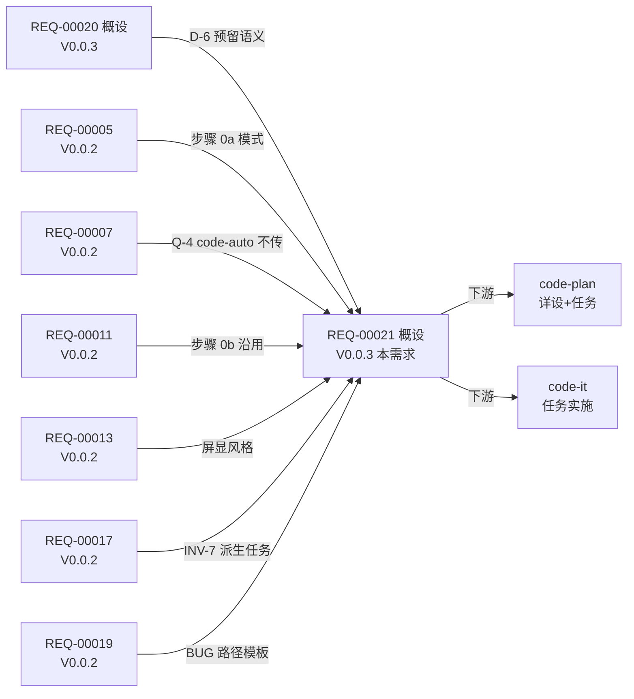

# 关联设计 — REQ-00021

更新时间:2026-06-06 17:35
版本:V0.0.3

## 关联点扫描

### 本版本(V0.0.3)其他设计

| 关联设计 | 关联点 | 对本设计的影响 | 链接 |
| --- | --- | --- | --- |
| **REQ-00020**(V0.0.3) | 架构设计目标重新归位 + 3 新维度(封装性/可复用性/可读性)+ 步骤归并 M-1~M-4 | 本需求**沿用** REQ-00020 的 7 维度设计目标写入;**不**与 REQ-00020 冲突;0 改步骤 0b 流程(只追加 2 个新小节) | [RESULT](../REQ-00020/RESULT.md) |

**关键点**:REQ-00020 是本版本 V0.0.3 的"前序"需求,**本需求 REQ-00021 是 REQ-00020 后的"承接"需求**。REQ-00020 概设 §3.2 D-6 已**显式提及** REQ-00021:
> D-6 | `--result` / `--plan` 参数预留(本需求**不**实现,留 REQ-00021) | **预留语义**(本概设提及,不实现)

### 跨版本(V0.0.2)设计

| 关联设计 | 关联点 | 对本设计的影响 | 链接 |
| --- | --- | --- | --- |
| **REQ-00005**(V0.0.2) | 首步拉取 + 末步兜底提交 | 本需求参数解析在步骤 0a 拉取**前**;末步兜底提交沿用(NFR-3.4) | V0.0.2/design/REQ-00005/RESULT.md |
| **REQ-00007**(V0.0.2) | `code-auto` 自动开发 | 本需求 `code-auto` 调 3 技能时**不**传 `--result` / `--plan`(沿用 Q-4 + E-4) | V0.0.2/design/REQ-00007/RESULT.md |
| **REQ-00011**(V0.0.2) | `code-design` / `code-plan` 步骤 0b 设计目标确认 | 本需求**不**改步骤 0b 流程;`--result` / `--plan` 解析在步骤 0 之前 | V0.0.2/design/REQ-00011/RESULT.md |
| **REQ-00013**(V0.0.2) | 6 技能启用"编号+标题" 显示 | 本需求模板填充屏显沿用 `formatReqTitle` 风格 | V0.0.2/design/REQ-00013/RESULT.md |
| **REQ-00017**(V0.0.2) | `code-plan` 不再为"更新看板"拆派生任务 | INV-7 沿用;模板产出物**不**是任务,**不**触发 `dashboard-conventions §规则 1` 三同步 | V0.0.2/design/REQ-00017/RESULT.md |
| **REQ-00019**(V0.0.2) | `code-plan` BUG 模式同构 | 本需求模板填充对 BUG 路径同样生效,输出目录为 `fix/<BUG-NNN>/` 而非 `plan/<REQ>/` | V0.0.2/design/REQ-00019/RESULT.md |

## 关键引用关系图(Mermaid)

## 关键依赖关系

1. **REQUIRES**:步骤 0a 拉取(`code-require` 步骤 0 沿用 REQ-00005)
2. **REQUIRES**:本需求 `--result` / `--plan` 解析**不**影响 3 技能既有步骤 0b 设计目标确认(REQ-00011)
3. **REQUIRES**:本需求屏显**不**与 REQ-00013"编号+标题"格式冲突
4. **REQUIRES**:本需求 INV-7 沿用 REQ-00017"0 派生任务"
5. **REQUIRES**:本需求 BUG 路径同构 REQ-00019
6. **REQUIRES**:本需求 `code-auto` 不传参数沿用 REQ-00007 Q-4
7. **CONSISTENT_WITH**:REQ-00020 概设 D-6 显式提及 REQ-00021 是"承接需求"
