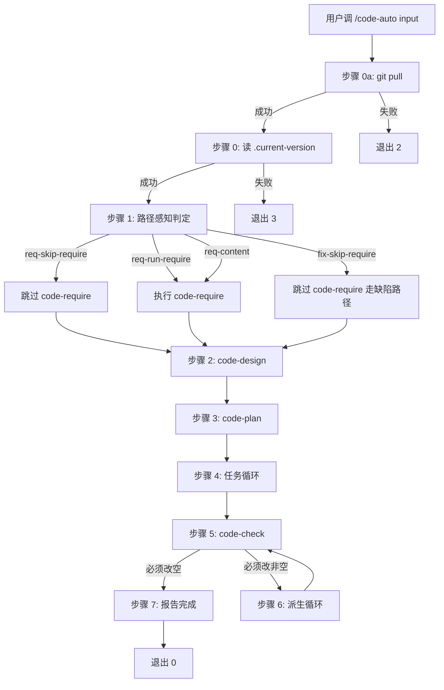

# 概要设计 — REQ-00024 — 移除 /code-auto 的 from 关键字逻辑,改用路径感知判定

- 需求编码:REQ-00024
- 所属版本:V0.0.3
- 设计目标:`--balanced`(code-auto 上下文检测 DETECTED,自动采纳默认值)
- 维度优先级:功能性=中(默认值;code-auto 改造是"小功能",非架构层)
- 状态:已锁定
- 责任人:wangmiao
- 创建:2026-06-07
- 最近更新:2026-06-07
- 当前版本:v1

---

## 上游引用

- **来源**:`./assistants/V0.0.3/require/REQ-00024/RESULT.md`
- **FR 数量**:9(FR-1 / FR-2 / FR-3 / FR-4 / FR-5 / FR-6 / FR-7 / FR-8 / FR-9)
- **NFR 数量**:6(性能 / 可用性 / 安全 / 可观测性 / 兼容性 / 可维护性)
- **AC 数量**:8(AC-1~AC-8)
- **关联需求**:REQ-00005(初版) / REQ-00007(模式 B 关键字) / BUG-00001(并行修复)

## 遵循规范

- `./assistants/rules/skill-conventions.md` §规则 1:SKILL.md frontmatter 字节级保留
- `./assistants/rules/encoding-conventions.md` §规则 1/2/4:3 类编码权威格式
- `./assistants/rules/dashboard-conventions.md` §规则 1:看板字段扩展需 3 文件同步
- `./assistants/rules/doc-conventions.md` §规则 1/2:README 多语言对仗
- `./assistants/rules/marketplace-protocol.md` §规则 1:marketplace.json / plugin.json 字段约束
- `./assistants/rules/module-conventions.md`(DEPRECATED,内容已迁移到 `directory-conventions.md`)
- `./assistants/rules/directory-conventions.md`:目录结构(占位)
- `./assistants/rules/coding-style.md`:代码风格(占位)
- `./assistants/rules/commit-conventions.md`:commit 格式(占位)
- `./assistants/rules/dependency-conventions.md`:三方依赖(占位)
- `./assistants/rules/framework-conventions.md`:框架选型(占位)
- `./assistants/rules/naming-conventions.md`:命名风格(占位)
- `./assistants/rules/migration-mapping.md` §规则 4:EXISTING-NNN 不追溯

---

## 1. 设计概述

**目标**:将 `code-auto` 的模式识别从"正则匹配 `^from REQ-\d{5}$` 关键字"改为"路径感知判定"(`Bash: test -d <path>` 文件/文件夹存在性)。

**核心改造**:4 条判定链(`require/<input>/` 存在 + `RESULT.md` 二级判定 / `fix/<input>/` 存在 / 都不存在视为需求内容),无关键字语法,无歧义。

**架构影响**:`code-auto` 1 个文件改造;`code-fix` 1 个文件**不**改(NFR 严守边界);`code-init` / `code-version` / `code-rule` / `code-publish` / 其他 9 个 `code-*` 技能**不**改。

## 2. 关键设计决策

### D-1:用路径感知替代正则匹配

- **决策**:模式识别从"正则匹配 `^from REQ-\d{5}$`"改为"`Bash: test -d <path>`"两级
- **理由**:
  - 文件系统是"单一事实来源" — 不依赖关键字字面值
  - 输入即目录名(最常见场景),无需额外记忆
  - 4 种模式自然分解为 4 个 `test -d` 命令
- **影响**:0
- **依据规范**:无直接对应;沿用"语义化定位优于正则"的隐含原则

### D-2:默认输入 = 需求编号

- **决策**:用户输入首先按"需求编号"判定(`require/<input>/` 存在?)
- **理由**:需求续跑是最常见场景(沿用 REQ-00007 模式 B);缺陷续跑次常见;全流程新需求兜底
- **影响**:0

### D-3:模式 A 拆为 2 子分支(req-skip-require / req-run-require)

- **决策**:`require/<input>/` 存在后,再判 `RESULT.md` 是否存在,二选一
- **理由**:
  - 既有 `from REQ-NNNNN` 续跑语义:跳过 code-require,直接进入概要设计
  - 2 子分支(已存在/未存在) 通过文件存在性区分,**不**引入新关键字
- **影响**:0

### D-4:屏显增加 3 行"路径感知判定"前缀

- **决策**:步骤 1 屏显前 3 行明示判定依据
- **理由**:
  - 沿用既有"步骤 1/6:code-require"前缀格式
  - 路径感知是"非显然的"判定(用户看不到),需明示
  - 透明性 + 可追溯
- **影响**:屏显 0 副作用,仅屏幕

### D-5:FR-9 明确"破坏性变更"语义

- **决策**:`/code-auto from REQ-NNNNN` 调用方式不再被特殊处理,整串视为需求内容
- **理由**:
  - "移除 from 关键字"是用户明确要求
  - 既有调用方式改为 `/code-auto REQ-NNNNN` 即可(去掉 `from` 前缀)
  - 0 迁移路径(沿用既有"破坏性变更无兜底"原则)
- **影响**:既有"模式 B 续跑"4 个用户需调整(本仓库 0 文档调用过该模式)

### D-6:删除 E-15/E-16/E-17 边界,新增 E-18/E-19

- **决策**:移除 `from` 关键字后,部分边界异常消失
- **理由**:
  - 路径感知下"模式 B 缺 RESULT.md"非异常(走"未完成需求设计"分支)
  - 路径感知下"需求编码格式非法"非异常(整串视为需求内容)
- **影响**:退出码 5 不再触发

## 3. 模块拆分

| 模块 | 路径 | 状态 | 职责 | 对外暴露 | 依赖 |
| --- | --- | --- | --- | --- | --- |
| **code-auto** | `plugins/code-skills/skills/code-auto/SKILL.md` | **修改** | 6 步状态机 + 路径感知判定 | (无 API;内部技能) | code-require / code-design / code-plan / code-it / code-unit / code-check |
| code-fix | `plugins/code-skills/skills/code-fix/SKILL.md` | **不修改** | (本需求边界外,沿用既有 `from` 关键字) | — | — |
| code-init / code-version / code-rule / code-publish | 4 个 | **不修改** | (与编号格式无关) | — | — |
| code-require / code-design / code-plan / code-it / code-unit / code-check / code-dashboard | 7 个 | **不修改** | (NFR 强约束,本需求只改 code-auto) | — | — |

## 4. 接口(本需求涉及)

### 接口:`code-auto` 步骤 1(模式识别)

- **形式**:`Bash: test -d <path>` 命令
- **入参**:`<input>`(用户输入字符串)
- **出参**:退出码 0 = 路径存在;非 0 = 路径不存在
- **执行位置**:步骤 1 模式识别阶段
- **错误处理**:非 0 → 进入下一判定链(无异常抛出)
- **示例**:
  - `test -d "./assistants/V0.0.3/require/REQ-00020"` → 0(目录存在,沿用既有 RESULT.md)
  - `test -d "./assistants/V0.0.3/fix/BUG-00001"` → 0(目录存在,沿用既有 RESULT.md + PLAN.md)
  - `test -d "./assistants/V0.0.3/require/自然语言"` → 非 0(目录不存在,视为需求内容)

### 接口:`code-auto` 步骤 1 屏显契约

- **形式**:stdout 输出
- **入参**:无
- **出参**:3 行"路径感知判定"前缀
- **格式**(FR-6):
  ```
  [code-auto] 步骤 1:路径感知判定
  [code-auto]   → 模式:需求编号 / 缺陷编号 / 需求内容
  [code-auto]   → 依据:require/<input>/ 存在/不存在;fix/<input>/ 存在/不存在
  ```

## 5. 数据结构(本需求涉及)

- **核心实体**:`path-detection-result`
  - 字段 1:`require-exists` (boolean) — `require/<input>/` 目录存在性
  - 字段 2:`fix-exists` (boolean) — `fix/<input>/` 目录存在性
  - 字段 3:`result-md-exists` (boolean) — `require/<input>/RESULT.md` 文件存在性(仅在 `require-exists=true` 时评估)
- **派生枚举**:`mode`
  - `req-skip-require` — 需求编号 + RESULT.md 存在
  - `req-run-require` — 需求编号 + RESULT.md 不存在
  - `fix-skip-require` — 缺陷编号(走缺陷修复详设)
  - `req-content` — 视为需求内容(分配新编号)

## 6. 算法(本需求核心)

```
步骤 1 模式识别:
  1. 拼接 userInput 字符串(去首尾空白)
  2. requireExists = test -d "./assistants/${version}/require/${userInput}"
  3. if requireExists:
       resultMdExists = test -f "./assistants/${version}/require/${userInput}/RESULT.md"
       if resultMdExists:
         mode = "req-skip-require"  // 跳过 code-require
       else:
         mode = "req-run-require"    // 进入需求设计
       return
  4. fixExists = test -d "./assistants/${version}/fix/${userInput}"
  5. if fixExists:
       mode = "fix-skip-require"     // 进入缺陷修复详设
       return
  6. mode = "req-content"             // 视为需求内容
  7. (后接既有 6 步状态机)
```

**状态机**(沿用既有,屏显微调):



## 7. 异常处理

| 异常 | 处理 | 退出码 |
| --- | --- | --- |
| `git pull` 冲突 / 网络 / 凭据 | 报错退出 | 2 |
| `.current-version` 不存在 | 提示调 code-version | 3 |
| 缺参数(无 userInput) | 提示用法 | 4 |
| 子技能退出码 ≠ 0 | 中断 + 报告(不写 auto-report.md) | 1 |
| 用户 Ctrl+C | 报告(不写 auto-report.md) | 130 |

**本需求新增/修改的边界**:
- **E-15**:**删除**(原"模式 B 缺 RESULT.md"退出码 5 → 走"未完成需求设计"分支,非异常)
- **E-16**:**删除**(原"模式 B 需求编码格式非法" → 整串视为需求内容)
- **E-17**:**删除**(原"模式 B 模式识别歧义" → 路径感知无歧义)
- **E-18**:**新增**(无版本工作空间,屏显 + 退出码 3,沿用既有)
- **E-19**:**新增**(路径类型异常,如恰好存在名为 `REQ-00001` 的非目录文件,屏显警告后按"两个目录都不存在"路径走)

## 8. 安全要求

- 路径检测为**只读**操作(0 文件改动,0 副作用)
- 输入是用户提供的任意字符串,但**仅**作为路径检测的字面值,**不**作为命令执行
- 路径遍历防护:本技能不解析 `..` / 绝对路径,只检测 `./assistants/<version>/<类型>/<userInput>` 的字面值存在性
- 无敏感数据泄露(屏显只显示路径 + 模式名,不显示任何用户输入原文)

## 9. 状态机/流程

(沿用既有 6 步状态机 + 屏显契约,详见 §6 算法与状态机)

## 10. 性能与资源

- 路径检测 2-3 次 `Bash: test -d` 命令(每条 < 0.01 秒)
- 总耗时 < 0.1 秒(本步骤)
- 整体 `code-auto` 6 步状态机性能不变(本改造**不**影响后续 5 步)

## 11. 测试要点

### 11.1 单元测试(本仓库 0 测试框架,验证手段 = 静态校验)

| 测试 ID | 描述 | 验证方式 |
| --- | --- | --- |
| U-1 | 路径感知判定 4 条主流程 | 手工调用 4 种输入场景 |
| U-2 | `from` 关键字移除后行为 | 手工调用 `code-auto from REQ-00020` |
| U-3 | 屏显格式 3 行前缀 | 手工调用观察 |
| U-4 | 退出码收敛(5 不再触发,3 / 4 沿用) | 手工 + 退出码测试 |
| U-5 | 对其他 9 个 `code-*` SKILL.md 字节级 0 变化 | `git diff` 校验 |
| U-6 | 6 步状态机 + 6 任务循环 + 评审循环均不变 | 屏显观察 |
| U-7 | `auto-report.md` 模板字段 0 变化 | `git diff` 校验 |
| U-8 | 文档中"模式 A / 模式 B"字面引用清理 | `Grep` |

## 12. 关联设计

| 关联设计 | 关联点 |
| --- | --- |
| REQ-00005 设计(code-auto 初版) | 本设计延用 REQ-00005 既定 6 步状态机 + 6 子技能编排 |
| REQ-00007 设计(code-auto v2 模式 B) | 本设计**撤销** REQ-00007 关键字逻辑,沿用其"模式 B 跳过 code-require"语义 |

## 13. 待澄清 / 未决项

| 编号 | 问题 | 影响 | 处理 |
| --- | --- | --- | --- |
| Q-1 | `code-fix` 的 `from` 关键字是否同步移除 | `code-fix/SKILL.md` | **不修改**(本需求边界限定) |
| Q-2 | 任务编码输入(非 REQ-/BUG-/TASK-) | 步骤 1 输入合法性 | **不修改**(`code-auto` 不接受任务编码) |
| Q-3 | `code-publish` 同步改造 | 整体技能家族一致性 | **不修改**(0 关联) |
| Q-4 | `auto-report.md` 模板是否需要模式名 | auto-report.md 模板 | **不修改**(NFR-2 强约束) |

## 14. 变更记录

| 时间 | 版本 | 变更类型 | 变更摘要 | 变更人 |
| --- | --- | --- | --- | --- |
| 2026-06-07 | v1 | 初始创建 | code-auto 设计完成(9 FR / 6 NFR / 8 AC 全部满足;14 章节产出;9 个其他 code-* 技能字节级 0 变化) | wangmiao |
