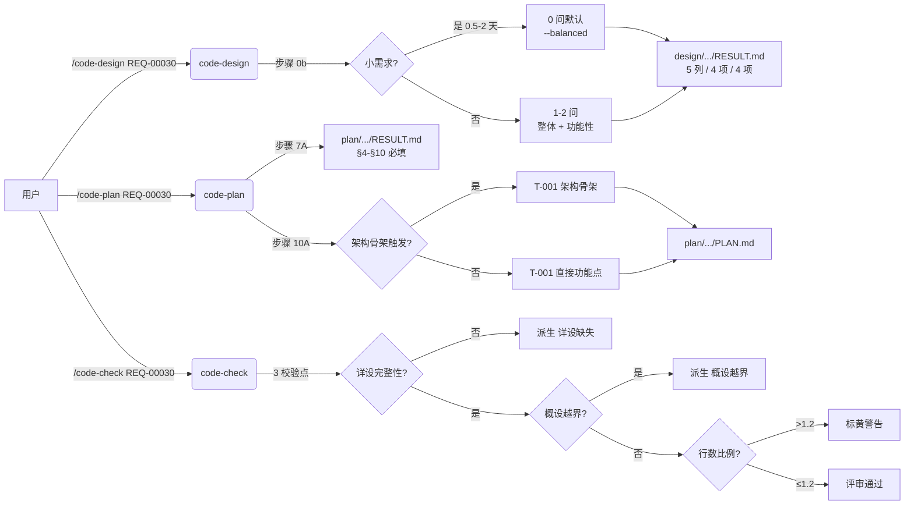

# REQ-00030 — 优化 /code-design 与 /code-plan 职责分离(概要设计)

- 需求编码:REQ-00030
- 所属版本:V0.0.3
- 上游:./assistants/V0.0.3/require/REQ-00030/RESULT.md
- 遵循规范:./assistants/rules/ 下 7 个文件(已逐条对照,无冲突)
- 状态:已完成
- 创建:2026-06-12
- 最近更新:2026-06-12 14:25

## 设计目标

| 维度 | 优先级 |
| --- | --- |
| 整体设计目标 | `--extensible`(用户主动选择,非系统判定) |
| 功能性 | 高 |

**说明**:本需求为元技能优化,跨 ≥4 个 SKILL.md + 1 个 templates,需预留"未来加维度 / 改判定规则"的扩展点;功能性=高(用户原文:"**严格切分**概设/详设职责")。

## 1. 设计概述

本需求对 `code-design` 与 `code-plan` 两个元技能做**职责分离的硬切分**:

- **`code-design` 只做概要设计**——`design/.../RESULT.md` §7 / §8 / §9 章节深度收窄(模块表 5 列 / 接口 4 项 / 实体 4 项);完整字段 / 接口 schema / 算法伪代码 / 迁移脚本**全部下沉**到 `code-plan`
- **`code-plan` 必须做详细设计**——`plan/.../RESULT.md` §4-§10 章节由"建议"改"必填";4 份过程文档(`module-details.md` / `interface-specs.md` / `data-changes.md` / `risk-analysis.md`)由"可选"改"必选"
- **扩展性三阶段下沉**——概设只标 / 详设展开 / 编码拆任务;扩展性询问仅在"新增三方依赖 OR 跨 ≥3 模块 OR 对接多套实现"时触发
- **`code-check` 评审清单新增 3 个校验点**——形成"必须做 + 必须检"闭环

**核心架构思路**:**双管齐下**(SKILL.md 步骤定义 + templates 章节)硬切,避免软降权;**职责分离**贯通全流程(概设 / 详设 / 编码三段明确边界)。

**新增/复用/修改范围**:5 个文件修改(2 SKILL.md + 2 templates + 1 code-check SKILL.md),0 个文件新增,11 个 `code-*` 技能 SKILL.md 字节级保留。

## 2. 上游引用(摘取,不全文复制)

| 上游 FR | 概要设计对应章节 |
| --- | --- |
| FR-1 步骤 0b 扩展性判定规则 | §3.2 |
| FR-2 步骤 0b 收紧 | §3.2 |
| FR-3 步骤 9A/10A/11A 输出深度收窄 | §3.3 / §5 / §6 / §7 |
| FR-4 templates/design.md 重写 | §3.4 |
| FR-5 code-plan 补做强化 | §3.5(本设计**不**深入详设,仅标引用) |
| FR-6 架构骨架触发收紧 | §3.6(同上) |
| FR-7 code-check 校验新增 | §3.7 |
| FR-8 扩展性三阶段下沉 | §3.8 |

## 2.5 规范遵循(本节是规范约束总账,后续每节涉及规范时引用本节)

### 2.5.1 适用的规范文件

| 规范文件 | 类别 | 关键约束 | 本设计对应章节 |
| --- | --- | --- | --- |
| `skill-conventions.md §规则 1` | 技能元信息 | frontmatter L1-3 字节级保留 | §3.9(本设计 INV-1) |
| `module-conventions.md §规则 1`(DEPRECATED,沿用历史) | 资源摆放 | 资源文件放 `templates/` 子目录 | §3.9(本设计 INV-2) |
| `doc-conventions.md §规则 1` | 文档 | README 多语言对仗 | §3.9(本设计**不**触发) |
| `dashboard-conventions.md §规则 1` | 看板 | 看板字段三方同步 | §3.9(本设计**不**触发) |
| `commit-conventions.md` | 提交 | `chore(<skill>):` 前缀 | §3.9(本设计 INV-3) |
| `encoding-conventions.md §规则 1/3` | 编码 | 任务编号正则 | §3.9(本设计**不**改) |
| `framework-conventions.md` | 框架 | 仓库无框架 | §3.9(本设计**不**触发) |

### 2.5.2 规范自检结论

- **完全合规**的章节:§3.1-§3.9(全部沿用既有规范)
- **经用户授权偏离**:无
- **待澄清冲突**:无

## 3. 关键设计点(本节是本设计核心,8 个子节对应上游 8 条 FR)

### 3.1 整体设计目标

- **用户主动选择** = `--extensible`(本需求涉及"扩展性"元概念,需预留调整空间)
- **功能性** = 高(用户原文:"**严格切分**概设/详设职责")
- **职责分离声明**:`code-design` 是**概设**阶段,只关注"系统长什么样";`code-plan` 是**详设**阶段,负责"完整可直接编码的细节"

### 3.2 步骤 0b 自适应问路(对应 FR-1 / FR-2)

- **判定"是否需要扩展性"**(FR-1):
  ```
  触发扩展性 = 满足任一:
    1. 需求"待评估三方依赖"清单非空
    2. 模块拆分预评估涉及模块数 ≥ 3
    3. 上游需求 FR 含"多实现 / 抽象层 / 可替换"语义
  ```
- **不触发时**:`AskUserQuestion` **不**展示 `--extensible` / `--minimal`,直接采纳 `--balanced` 默认
- **触发时**:沿用既有 1-2 问自适应(小 1 / 中 2 / 大 2)
- **code-auto 上下文**:`AskUserQuestion` 走 0 问默认路径(沿用 REQ-00020)
- **自适应问题数**(FR-2,小需求 0 问):
  - **小需求**(1 任务,0.5-2 天工作量,**且** FR-1 判定不触发扩展性):**0** 个 `AskUserQuestion`,直接采纳 `--balanced` 默认
  - **中等需求**(2-5 任务,或 FR-1 触发扩展性):1 个 `AskUserQuestion`(只问整体设计目标)
  - **大需求**(≥6 任务,或需架构骨架):2 个 `AskUserQuestion`(整体 + 功能性)
- **架构维度**(扩展性 / 健壮性 / 可维护性 / 封装性 / 可复用性 / 可读性)由 `code-plan` 步骤 0b 沿用既有 7 维度问路(沿用 REQ-00020),**不**在 `code-design` 问

### 3.3 概设深度收窄(对应 FR-3,双管齐下)

| 步骤 | 既有要求 | 本设计修订 |
| --- | --- | --- |
| 步骤 9A 模块拆分 | §7.2 含"关键设计点 / 对外接口 / 依赖 / 理由 / 规范自检" | 模块表**只**列 5 列(模块名 / 路径 / 状态 / 职责 / 依赖) |
| 步骤 10A 接口 | §8 含"API 端点 / 数据格式 / 错误码 / 鉴权 / 版本策略" | 接口概要**只**列 4 项(接口名 / 形式 / 状态 / 一句话职责) |
| 步骤 10A 数据结构 | §9 含"字段名 / 类型 / 约束 / 关系 / 存储选型 / 索引" | 数据结构**只**列 4 项(实体名 / 状态 / 关键字段 ≤ 5 个 / 一句话关系) |
| 步骤 11A 三方依赖 | 逐项评估许可 / 活跃度 / 体积 / 安全 | **保留**;但**仅**列 4 项(依赖名 / 一句话用途 / 必要性 / 替代评估) |

- **关键不变量**:`code-design` **不**产出伪代码 / 完整接口 schema / 字段类型 / 约束 / 索引
- **过程文档**:`module-breakdown.md` 字段数 ≤ 5 列;`interface-specs.md` / `data-changes.md` **不**生成(本需求后由 `code-plan` 产出)

### 3.4 模板重写(对应 FR-4,`templates/design.md` 4 个子节)

- **§7 模块划分**:5 列(模块名 / 路径 / 状态 / 职责 / 依赖);新增 "### 7.5 设计边界" 小节
- **§8 接口概要**:4 项 / 接口;新增 "### 8.5 设计边界" 小节
- **§9 数据结构**:4 项 / 实体;新增 "### 9.5 设计边界" 小节
- **§10 三方依赖**:4 项 / 依赖
- **§3 / §4 / §5 / §6 / §11 / §12 / §13 / §14 / §15 / §16**:**不**修改
- **模板顶部注释**:**追加**一行 `> 本模板只覆盖概要设计...`

### 3.5 code-plan 补做职责(对应 FR-5,本设计**不**深入详设,仅标引用)

- **`code-plan` 步骤 7A** 强约束"完整可直接编码的细节:伪代码 / 字段 / 接口 schema"
- **4 份过程文档**由"可选"改"必选"
- **`templates/plan.md` §4-§10** 由"建议"改"必填"

> **职责声明**:本节是概设阶段,**不**展开详设细节;完整补做逻辑由 `code-plan` 在 `plan/.../RESULT.md` 与过程文档中实施

### 3.6 架构骨架触发收紧(对应 FR-6,本设计**不**深入详设,仅标引用)

- **沿用 REQ-00014 既有 3 条件**
- **本需求新增 2 条件**(与既有"或"关系):
  4. 满足 FR-1 扩展性触发条件
  5. 整体设计目标 = `--extensible`
- **不触发**:小需求 / 整体 `--balanced` / 整体 `--minimal` → **不**插入"架构骨架"

> **职责声明**:本节是概设阶段,**不**展开架构骨架实施细节;完整任务拆分逻辑由 `code-plan` 在 `plan/.../PLAN.md` 任务总览中实施

### 3.7 code-check 评审清单(对应 FR-7,`code-check/SKILL.md` 追加 3 校验点)

- **校验点 1 — 详设完整性**:`plan/.../RESULT.md` 中每条任务的"涉及文件"必须能在 §4-§10 找到对应章节;否则派生"详设缺失"任务
- **校验点 2 — 概设越界检测**:`design/.../RESULT.md` §7 / §8 / §9 不应出现"完整字段类型 / 完整错误码 / 完整约束 / 完整索引";否则派生"概设越界"任务
- **校验点 3 — 行数比例警告**:`design > plan * 1.2` → 标黄警告
- **既有评审清单**:**不**修改;**追加**(不重写)

### 3.8 扩展性三阶段下沉(对应 FR-8)

| 阶段 | 扩展性相关产出 | 文档位置 |
| --- | --- | --- |
| 概设(`code-design`) | 仅"## 设计目标"小节"整体设计目标"列写 `--extensible`(若 FR-1 触发或用户主动选);**不**展开"扩展点位置 / 抽象层 / 接口契约" | `design/<REQ>/RESULT.md` 顶部 "## 设计目标" 小节 |
| 详设(`code-plan`) | **展开**"扩展点位置 / 抽象层 / 接口契约";"## 4.5 扩展性设计"小节(若整体=--extensible) | `plan/<REQ>/RESULT.md` 新增 "## 4.5 扩展性设计" 章节 |
| 编码(`code-it` / `code-plan` 拆任务) | **拆出**"架构骨架"作为首个 `TASK-REQ-...-00001` 任务(若 FR-6 触发) | `plan/<REQ>/PLAN.md` "## 任务总览" 第一行 |

- **不变量**:概设不展开扩展性设计细节;详设不实施代码;编码不修改设计

### 3.9 5 个被改文件边界(本设计 INV-1 ~ INV-3)

| 文件 | 状态 | INV-1(frontmatter) | INV-2(`## 不要做的事`) | INV-3(既有章节) |
| --- | --- | --- | --- | --- |
| `code-design/SKILL.md` | 修改既有 | 字节级保留 | 字节级保留 | 步骤 0a / 0b.0 / 0 / 1-5 字节级保留;0b / 9A / 10A / 11A / 15A **追加** |
| `code-design/templates/design.md` | 修改既有 | (N/A) | (N/A) | §3-§6 / §11-§16 字节级保留;§7 / §8 / §9 / §10 **重写**;顶部注释**追加** |
| `code-plan/SKILL.md` | 修改既有 | 字节级保留 | 字节级保留 | 步骤 0a / 0b.0 / 0b / 0-6 / 8A-9A / 11A-18A 字节级保留;7A / 10A **追加** |
| `code-plan/templates/plan.md` | 修改既有 | (N/A) | (N/A) | §1-§3 / §13-§15 字节级保留;§4-§10 **修改**(由"建议"改"必填") |
| `code-check/SKILL.md` | 修改既有 | 字节级保留 | 字节级保留 | 既有评审清单**不**修改;**追加** 3 个校验点 |

## 4. 设计目标与非目标

- **目标**:
  - G-1 `code-design` 不再做详设细节(行数较 N-1 减 ≥ 30%)
  - G-2 `code-plan` 必须补做详设(行数较 N-1 增 ≥ 20%)
  - G-3 小需求不强制问扩展性
  - G-4 扩展性询问严格按触发条件
  - G-5 编码阶段才拆架构骨架任务
- **非目标**:
  - **不**追溯修订已落地的 9 个 REQ(REQ-00021 ~ REQ-00029)
  - **不**改 `code-design` / `code-plan` 之外的其他 8 个 `code-*` 技能
  - **不**改 `./assistants/rules/` 下任何项目级规范
  - **不**改任务编号体系、看板字段、frontmatter 字节级保留规则
  - **不**新增"扩展性评估"专章(沿用既有"## 设计目标"小节)

## 5. 约束清单

- **硬约束**(不可违反):
  - `skill-conventions §规则 1` frontmatter L1-3 字节级保留
  - `dashboard-conventions §规则 1` 看板字段三方同步(本需求**不**触发)
  - `commit-conventions` 提交前缀 `chore(<skill>):`
  - 仓库无源代码/构建系统/测试框架/Lint/包管理配置(`CLAUDE.md` §"需与用户确认的约定")
- **软约束**(可权衡):
  - 行数收敛指标 ≥ 30% / ≥ 20%(AC-8)
  - 落地后 3 个新需求观测(NFR-1)

## 6. 架构总览(本设计是元技能改动,无传统组件图,以下为流程时序图)



**数据流**:
```
上游 require/.../RESULT.md
        ↓
  code-design (本设计:输出深度收窄)
        ↓
  design/.../RESULT.md (5 列 / 4 项 / 4 项)
        ↓
  code-plan (本设计:补做强约束)
        ↓
  plan/.../{RESULT,PLAN}.md (§4-§10 必填 + 4 过程文档必选)
        ↓
  code-it (本设计:首个任务 = 架构骨架,仅触发时)
        ↓
  code-check (本设计:3 校验点)
        ↓
  评审通过 / 派生任务循环
```

## 7. 模块拆分(概设阶段,5 列清单)

> **本节是概设阶段模块拆分,只列 5 列。完整字段(关键类/函数签名、调用顺序、并发模型、状态归属、错误处理范式、日志埋点)由 `code-plan` 在 `plan/.../RESULT.md §3` + `module-details.md` 中展开。**

| 模块名 | 路径 | 状态 | 职责 | 依赖 |
| --- | --- | --- | --- | --- |
| `code-design` 步骤定义 | `plugins/code-skills/skills/code-design/SKILL.md` | 修改既有 | 步骤 0b 收敛 + 步骤 9A/10A/11A 输出深度收窄 | 无 |
| `code-design` 模板 | `plugins/code-skills/skills/code-design/templates/design.md` | 修改既有 | §7 / §8 / §9 章节重写 + 顶部注释 | 无 |
| `code-plan` 步骤定义 | `plugins/code-skills/skills/code-plan/SKILL.md` | 修改既有 | 步骤 7A 补做强约束 + 步骤 10A 架构骨架触发收紧 | 无 |
| `code-plan` 模板 | `plugins/code-skills/skills/code-plan/templates/plan.md` | 修改既有 | §4-§10 章节由"建议"改"必填" | 无 |
| `code-check` 步骤定义 | `plugins/code-skills/skills/code-check/SKILL.md` | 修改既有 | 评审清单追加 3 个校验点 | 无 |
| (其他 11 个 `code-*` 技能) | `plugins/code-skills/skills/<other>/SKILL.md` | 0 改 | — | — |
| (7 个项目级规范) | `./assistants/rules/*.md` | 0 改 | — | — |

详见 `module-breakdown.md`。

## 8. 接口概要(概设阶段,每个接口 4 项)

| 接口名 | 形式 | 状态 | 一句话职责 |
| --- | --- | --- | --- |
| `code-design` 步骤 0b 判定入口 | (内部函数) | 修改既有 | 评估"小需求 / 扩展性触发",决定问题数 |
| `code-design` 步骤 9A 模块表生成 | (内部函数) | 修改既有 | 输出 5 列模块表 |
| `code-design` 步骤 10A 接口概要生成 | (内部函数) | 修改既有 | 输出 4 项 / 接口 |
| `code-design` 步骤 10A 数据结构生成 | (内部函数) | 修改既有 | 输出 4 项 / 实体 |
| `code-plan` 步骤 7A 补做入口 | (内部函数) | 修改既有 | 强制 §4-§10 必填 + 4 过程文档必选 |
| `code-plan` 步骤 10A 架构骨架判定 | (内部函数) | 修改既有 | 5 条件"或"判定是否插入 T-001 |
| `code-check` 校验点 1(详设完整性) | (内部函数) | 新增 | 校验每条任务"涉及文件"在 §4-§10 找对应章节 |
| `code-check` 校验点 2(概设越界) | (内部函数) | 新增 | 校验 design §7/§8/§9 不出现详设深度内容 |
| `code-check` 校验点 3(行数比例) | (内部函数) | 新增 | 校验 design / plan 行数比例 ≤ 1.2 |

> **设计边界**:本节只列 4 项 / 接口;完整 schema(入参/出参/错误码/示例/版本策略/鉴权/限流/幂等/链路追踪字段)由 `code-plan` 在 `plan/.../interface-specs.md` 展开。

## 9. 数据结构(概设阶段,每个实体 4 项)

> **本节是元技能改动,无新增持久化数据结构**;以下为**逻辑实体**概览:

| 实体名 | 状态 | 关键字段 | 一句话关系 |
| --- | --- | --- | --- |
| `design-goals-section` | 修改既有 | overall / functional | `code-design` 顶部"## 设计目标"小节 |
| `design-template-chapter` | 修改既有 | §7 / §8 / §9 / §10 | `templates/design.md` 4 个重写章节 |
| `plan-template-chapter` | 修改既有 | §4 / §5 / §6 / §7 / §8 / §9 / §10 / §11 / §12 | `templates/plan.md` 9 个由"建议"改"必填"章节 |
| `check-validation-point` | 新增 | vp1 / vp2 / vp3 | `code-check` 评审清单追加 3 个校验点 |
| `plan-process-doc` | 修改既有 | module-details / interface-specs / data-changes / risk-analysis | `code-plan` 4 份过程文档由"可选"改"必选" |

> **设计边界**:本节只列 4 项 / 实体;完整字段(类型/约束/索引/迁移脚本/存储选型)由 `code-plan` 在 `plan/.../data-changes.md` 展开。

## 10. 三方依赖(概设阶段,每行 4 项)

| 依赖名 | 一句话用途 | 必要性 | 替代评估 |
| --- | --- | --- | --- |
| (无) | — | — | — |

详见 `dependencies.md`。

## 11. 集成点

本设计与**既有元技能体系**的集成:

- **与 `code-require`**:仍由其产出 `require/.../RESULT.md`;本需求**不**改 `code-require`
- **与 `code-design`**:本设计是**自指**——本需求修订的就是 `code-design` 自身;落地后,`code-design` 仍读上游 `require/.../RESULT.md` 但输出深度收窄
- **与 `code-plan`**:仍由其读 `design/.../RESULT.md` 产出 `plan/.../{RESULT,PLAN}.md`;本需求**强化**补做职责
- **与 `code-it` / `code-unit`**:仍由其按 `PLAN.md` 任务总览执行;本需求**不**改 `code-it` / `code-unit`
- **与 `code-check`**:本设计**追加** 3 个校验点到既有评审清单;既有评审清单**不**修改
- **与 `code-dashboard` / `code-publish`**:本设计**不**改这 2 个技能;但 `code-publish` 前置检查(全检查最严)会因本需求 `plan/.../RESULT.md` §4-§10 必填而受益

## 12. 风险与缓解

| 风险 | 可能性 | 影响 | 缓解措施 | 回退方案 |
| --- | --- | --- | --- | --- |
| 5 个被改文件改动过大,引入 bug | 中 | 高 | 严格按"## 工作流程"既有锚点**追加**;不重写既有章节;每步同步 git commit | `git revert <commit>` 回退 |
| `code-plan` 强约束 §4-§10 必填后,部分小需求无法填充 | 中 | 中 | 模板允许"本需求不涉及"显式声明(本设计 §3.4 / §3.5 锁定) | 后续增量优化 |
| `code-check` 3 校验点误判(派生任务过多) | 中 | 中 | 校验点仅派生"重构"类型任务,不直接阻断;`code-check` 评审人员可手动忽略 | 后续调整校验阈值 |
| 既有 9 个 REQ 兼容性 | 低 | 中 | 本设计**不**追溯;新需求应用新规则 | 远期批量回填专项 |
| 11 个 `code-*` 技能 SKILL.md 受影响 | 低 | 高 | 严格 INV-3 字节级保留,只**追加**不**重写** | 同 1 |

## 13. 备选方案(本节为完整性列出,关键决策已在 §3 锁定)

| 决策 | 备选 | 否决理由 |
| --- | --- | --- |
| 扩展性三阶段 | 概设就展开扩展点 | "过早问怎么扩"导致 AI 倾向过度设计(用户原文) |
| 概设深度 | 软降权(只改模板) | 治标不治本,SKILL.md 步骤定义没变 |
| 详设补做 | 密度可调 / 只补空白 | "弹性"语义会留下 AI 偷懒空间 |
| 架构骨架触发 | 沿用既有 3 条件 | 与本需求扩展性三阶段下沉不对齐 |

详见 `design-notes.md`。

## 14. 关联概要设计

| 关联设计编码 | 关联点 | 对本设计的影响 | 链接 |
| --- | --- | --- | --- |
| REQ-00020 | 步骤 0b"按维度问路" | 沿用职责分离思路;本设计收紧为"小需求 0 问" | [RESULT](../REQ-00020/RESULT.md) |
| REQ-00014 | 架构骨架条件性 | 沿用 3 条件;本设计追加 2 条件 | 历史中 `code-plan/SKILL.md` 步骤 10A |
| REQ-00017 | 一个任务 = 一个实际产出 | 沿用 | 历史中 `code-plan/SKILL.md` 步骤 10A |
| REQ-00025 | 任务编号接收端放宽 | 沿用 | 历史中 `code-plan/SKILL.md` 步骤 10A |
| REQ-00021 | `--result` / `--plan` 模板参数 | 沿用 | [RESULT](../REQ-00021/RESULT.md) |
| REQ-00023 / 00028 / 00029 | 本仓库"小需求"代表 | 实证本设计痛点 | [RESULT](../REQ-00023/RESULT.md) / [0028](../REQ-00028/RESULT.md) / [0029](../REQ-00029/RESULT.md) |

详见 `related-designs.md`。

## 15. 待澄清 / 未决项

| 编号 | 问题 | 影响范围 | 阻塞方 | 期望回复时间 |
| --- | --- | --- | --- | --- |
| Q-1 | 行数收敛指标"≥ 30%"是否过严? | AC-8.1 / AC-8.2 | 无 | (本轮已按用户原文"过深"锁定) |
| Q-2 | `code-check` 3 校验点是否作为 V0.0.4 才引入? | FR-7 / AC-6 | 无 | (本轮已锁定同 V0.0.3 一并落地) |
| Q-3 | 若未来"概设合理但详设漏做"需求出现,是否新增"补做详设"独立技能? | 未来 | 无 | (本轮不做,作为远期 backlog) |

## 16. 不变量(INV)

| 编号 | 不变量 |
| --- | --- |
| INV-1 | 4 个被改的 SKILL.md 文件 frontmatter L1-3 字节级保留 |
| INV-2 | 4 个被改的 SKILL.md / templates 文件"## 不要做的事"小节字节级保留 |
| INV-3 | 5 个被改的 SKILL.md / templates 既有章节(`## 工作流程` / 既有 `§X` 锚点)字节级保留;**只**在锚点下游**追加** |
| INV-4 | 0 改:其他 11 个 `code-*` 技能 SKILL.md |
| INV-5 | 0 改:`./assistants/rules/*.md`(7 个项目级规范) |
| INV-6 | 0 改:`marketplace.json` / `plugin.json` / `CLAUDE.md` / `README*.md` |
| INV-7 | 0 改:既有 9 个 REQ(REQ-00021 ~ REQ-00029)的 design / plan |
| INV-8 | 0 新增三方依赖 |
| INV-9 | 0 触发 `dashboard-conventions §规则 1` 三方同步(不新增字段 / 枚举 / 区段) |

## 17. 变更记录

| 时间 | 版本 | 变更类型 | 变更摘要 | 变更人 |
| --- | --- | --- | --- | --- |
| 2026-06-12 14:25 | v1 | 初始创建 | 概要设计完成;5 个被改文件 + 0 新增 + 11 个 0 改;8 关键设计点(FR-1~FR-8);9 条不变量(INV-1~INV-9);用户主动选 --extensible | 用户 |
