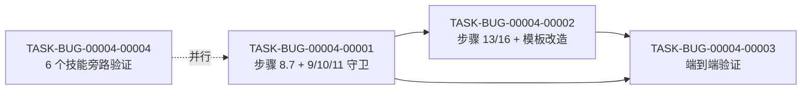

# 编码计划 — BUG-00004 — code-it 过程文档判定准则接入工作流程

- 缺陷编号:BUG-00004
- 所属版本:V0.0.3
- 详细设计:./assistants/V0.0.3/fix/BUG-00004/RESULT.md (v1)
- 状态:草稿
- **开发完成度**:4 / 4
- **测试完成度**:4 / 4
- 创建:2026-06-22
- 最近更新:2026-06-22 21:10
- 当前版本:v1.4

## 1. 计划概述

- 任务总数:4
- 类型分布:修改 3 + 文档 1
- 关键里程碑数:1(M1:BUG-00004 修复完成,纯 Markdown 改造类任务不再生成空占位过程文档)
- **开发完成度**:0 / 4
- **测试完成度**:0 / 4
- **真正可发布任务数**:0 / 4

## 2. 任务总览

| 任务编号 | 类型 | 触发/来源 | 标题 | 开发状态 | 测试状态 | 涉及文件/模块 | 前置任务 | 估算 | 责任人 | 关联任务 | 对应设计章节 |
| --- | --- | --- | --- | --- | --- | --- | --- | --- | --- | --- | --- |
| TASK-BUG-00004-00001 | 修改 | 缺陷修复 | [修改] code-it 步骤 8.7 新增 + 步骤 9/10/11 守卫 | 已完成 | 不适用 | plugins/code-skills/skills/code-it/SKILL.md §步骤 8.7 / §步骤 9 / §步骤 10 / §步骤 11 | - | 0.5d | wangmiao | BUG-00004 | RESULT.md §4 + §5 算法 1+2 |
| TASK-BUG-00004-00002 | 修改 | 缺陷修复 | [修改] code-it 步骤 13/16 + templates/RESULT.md 改造 | 已完成 | 不适用 | plugins/code-skills/skills/code-it/SKILL.md §步骤 13 / §步骤 16 + templates/RESULT.md | T-001 | 0.3d | wangmiao | BUG-00004 | RESULT.md §5 算法 3 |
| TASK-BUG-00004-00003 | 文档 | 缺陷修复 | [文档] 端到端验证(在 V0.0.3 下重跑 TASK-REQ-00039-00003 + 真实代码类任务对照) | 已完成 | 不适用 | assistants/V0.0.3/code/TASK-REQ-00039-00003/(新生成) | T-001, T-002 | 0.3d | wangmiao | BUG-00004 | RESULT.md §4 + §12 |
| TASK-BUG-00004-00004 | 文档 | 缺陷修复 | [文档] 其他 6 个技能旁路验证(grep 判定表 + 静态校验,**不修改**) | 已完成 | 不适用 | plugins/code-skills/skills/{code-require,code-design,code-check,code-plan,code-fix,code-init,code-rule}/SKILL.md | - | 0.2d | wangmiao | BUG-00004 | RESULT.md §6 末"其他技能旁路验证结论" |

**字段说明**:
- **任务编号**:`TASK-BUG-00004-NNNNN`(5+5 位嵌套式,沿用既有)
- **类型**:5 选 1 沿用 V0.0.3 修订(新增 / 修改 / 重构 / 修复 / 文档)
- **触发/来源**:`缺陷修复`(沿用既有 13 枚举之一)
- **测试状态**:`不适用`(本仓库无单元测试,沿用 V0.0.3 修订;端到端验证由 TASK-BUG-00004-00003 单独承担)
- **关联任务**:`BUG-00004`(自查)

### 2.1 触发/来源枚举(沿用既有)

- `缺陷修复`:本计划 4 条任务全部为 `缺陷修复`(由 BUG-00004 派生)

## 3. 任务详情

### TASK-BUG-00004-00001:[修改] code-it 步骤 8.7 新增 + 步骤 9/10/11 守卫

#### 基础信息
- **类型**:修改
- **触发/来源**:缺陷修复
- **触发任务**:BUG-00004
- **开发状态**:待开始
- **目标**:把 `code-it/SKILL.md` "## 过程文档自适应判定"章节定义的判定准则**物化**为可执行的 `decisions` 字典;在步骤 9/10/11 开头加守卫,避免执行"已判定为不生成"的步骤
- **涉及文件/模块**:`plugins/code-skills/skills/code-it/SKILL.md` §步骤 8.7(新增)+ §步骤 9(改造)+ §步骤 10(改造)+ §步骤 11(改造)
- **前置任务**:无
- **关联任务**:BUG-00004
- **关键变更**:
 - **新增 `### 步骤 8.7 — 过程文档自适应判定执行`**(位置:`### 步骤 8.6` line 805 之后,`### 步骤 9` 之前):
 - 给出 `applyProcessDocDecisions(taskNum, taskType, changedFiles, testable)` 伪代码(沿用 RESULT.md §5 算法 1)
 - 给出 `decisions: { workLog, compileAndRun, deviations, testResults, unitTestResults, kanbanChangeLog, processDocDecisions }` 字段定义
 - 给出执行流(沿用既有"执行流程"小节 7 步)
 - 给出 E-1/E-2/E-3/E-4 边界(沿用既有)
 - **改造 `### 步骤 9 编译验证`**(line 805-811):
 - 开头加守卫 `if decisions.compileAndRun == '不生成': 跳过`
 - **既有"检测构建命令/执行构建/记录"逻辑字节级保留**
 - **改造 `### 步骤 10 启动运行验证`**(line 812-819):
 - 开头加守卫 `if decisions.compileAndRun == '不生成': 跳过`
 - **既有逻辑字节级保留**
 - **改造 `### 步骤 11 测试`(若适用)**(line 820-826):
 - 开头加守卫 `if decisions.testResults == '不生成': 跳过`
 - **既有逻辑字节级保留**
- **边界与异常**:
 - `decisions` 缺失(防御性)→ 视为"按原行为执行"(NFR-4 幂等)
 - 步骤 8a 守卫未执行(缺陷分支)→ 退化 `testable = False` → `unitTestResults = '不生成'`
 - 任务类型字段缺失 → 按 `修改` 判定
- **验证手段**:
 - **静态校验**(本仓库不可测):
 - `code-it/SKILL.md` frontmatter L1-3 字节级保留(`name: code-it` + `description: ...` 字节级沿用)
 - 步骤 8.7 正确插入(在 8.6 之后、9 之前)
 - 步骤 9/10/11 守卫逻辑字面正确
 - 步骤 9/10/11 既有逻辑字节级保留(`grep` 验证章节内容不变)
 - `## 过程文档自适应判定` 章节字节级保留(不动)
 - `## 工作流程` 既有"## 步骤 0" ~ "## 步骤 8.6" 字节级保留
- **回退方式**:`git revert` 单次 commit
- **对应设计章节**:RESULT.md §4 + §5 算法 1+2
- **依据规范**:`skill-conventions §规则 1/2` + `dashboard-conventions §规则 1`
- **创建时间**:2026-06-22 20:30
- **最近更新**:2026-06-22 20:30
- **完成时间**:—
- **完成人**:—
- **提交哈希**:—
- **备注**:—

#### 单元测试状态
- **测试状态**:不适用
- **不适用理由**:本仓库无单元测试(`code-it` 步骤 8a 守卫判定项目不可测 — 无 `package.json` 含 `scripts.test` / `pyproject.toml` 含 `[tool.pytest*]` / `Cargo.toml` / `go.mod` / `pom.xml` / `build.gradle` / `test/`);端到端验证由 TASK-BUG-00004-00003 单独承担

---

### TASK-BUG-00004-00002:[修改] code-it 步骤 13/16 + templates/RESULT.md 改造

#### 基础信息
- **类型**:修改
- **触发/来源**:缺陷修复
- **触发任务**:BUG-00004, TASK-BUG-00004-00001
- **开发状态**:待开始
- **目标**:让 RESULT.md 第 8 段"过程文档清单"区段真实反映 `decisions`;让 `templates/RESULT.md` 模板支持 `decisions` 渲染
- **涉及文件/模块**:
 - `plugins/code-skills/skills/code-it/SKILL.md` §步骤 13(改造)+ §步骤 16(改造)
 - `plugins/code-skills/skills/code-it/templates/RESULT.md`(改造"## 8. 过程文档清单"区段)
- **前置任务**:TASK-BUG-00004-00001
- **关联任务**:BUG-00004
- **关键变更**:
 - **改造 `### 步骤 13 撰写 RESULT.md`(line 855-865)**:
 - 末尾追加"过程文档清单"区段(沿用 RESULT.md §5 算法 3 伪代码)
 - 既有"任务信息/改修内容总览/详细改动/关键决策/验证结果/已知问题/关联任务"7 段**字节级保留**
 - **改造 `### 步骤 16 完善过程文档与汇报`(line 923-932)**:
 - 末尾追加"已生成的过程文档清单" + "已跳过(不生成)的过程文档清单" 2 段
 - 既有"收尾 work-log.md / compile-and-run.md / deviations.md / test-results.md"4 段**字节级保留**
 - **改造 `templates/RESULT.md` line 124 附近的"## 8. 过程文档清单" 区段**:
 - 改造为支持 `decisions` 渲染(沿用 RESULT.md §5 算法 3 伪代码)
 - 既有"## 9. 单元测试" + "## 10. 逻辑行统计" + "## 11. 变更记录" 段**字节级保留**
- **边界与异常**:
 - `decisions` 缺失 → 退化:按既有写法(全 `✅`,NFR-4 幂等)
 - 模板改造**不**触发 `dashboard-conventions §规则 1` 三同步(模板是 skill 内部,非看板字段)
- **验证手段**:
 - **静态校验**:
 - `code-it/SKILL.md` 步骤 13 / 16 改造后既有 7 段字节级保留
 - `templates/RESULT.md` 既有"## 1 ~ ## 7" 字节级保留(若有)
 - 新增"## 8. 过程文档清单"区段字面与 RESULT.md §5 算法 3 一致
- **回退方式**:`git revert` 单次 commit
- **对应设计章节**:RESULT.md §5 算法 3
- **依据规范**:`skill-conventions §规则 1/2` + `dashboard-conventions §规则 1`
- **创建时间**:2026-06-22 20:30
- **最近更新**:2026-06-22 20:30
- **完成时间**:—
- **完成人**:—
- **提交哈希**:—
- **备注**:—

#### 单元测试状态
- **测试状态**:不适用
- **不适用理由**:本仓库无单元测试;模板改造的验证由 TASK-BUG-00004-00003 端到端测试承担

---

### TASK-BUG-00004-00003:[文档] 端到端验证(在 V0.0.3 下重跑 TASK-REQ-00039-00003 + 真实代码类任务对照)

#### 基础信息
- **类型**:文档
- **触发/来源**:缺陷修复
- **触发任务**:BUG-00004, TASK-BUG-00004-00001, TASK-BUG-00004-00002
- **开发状态**:待开始
- **目标**:在 V0.0.3 下重跑 TASK-REQ-00039-00003(纯 Markdown 改造)+ 跑 1 个真实代码类任务(若有),观察 `code/<任务>/` 目录与 `RESULT.md` "过程文档清单" 区段,验证 `code-it` 步骤 8.7 + 步骤 9/10/11 守卫 + 步骤 13/16 改造是否生效
- **涉及文件/模块**:
 - `assistants/V0.0.3/code/TASK-REQ-00039-00003/`(重跑生成的新内容,可能新增 / 删除 / 修改)
 - `assistants/V0.0.3/code/<其他任务>/`(若有真实代码类任务)
 - `assistants/V0.0.3/RESULT.md` "变更记录"区段
- **前置任务**:TASK-BUG-00004-00001, TASK-BUG-00004-00002
- **关联任务**:BUG-00004, TASK-REQ-00039-00003
- **关键变更**:
 - **场景 1(纯 Markdown 改造类)**:重跑 TASK-REQ-00039-00003
 1. `Bash: rm -rf assistants/V0.0.3/code/TASK-REQ-00039-00003/`(清理上次产物)
 2. 调 `/code-it TASK-REQ-00039-00003`(沿用 V0.0.3 修订)
 3. 观察新生成目录:
 - ✅ `work-log.md` 生成
 - ❌ `compile-and-run.md` **不**生成(已修复)
 - ✅ `deviations.md` 生成
 - ❌ `test-results.md` **不**生成(已修复)
 - ❌ `unit-test-results.md` **不**生成(项目不可测 + 任务类型=修改)
 - ✅ `process-doc-decisions.md` 生成(2 项"不生成"决策)
 - ✅ `RESULT.md` "## 8. 过程文档清单" 区段反映 `decisions`
 - **场景 2(真实代码类任务对照,若有)**:跑 1 个有生产代码改动的任务(例如 V0.0.3 之前已完成的某个真实代码任务)
 1. 调 `/code-it <TASK-...>`(旧任务,可能需要先回退到"待开始"状态,或找 1 个新代码任务)
 2. 观察:
 - ✅ `compile-and-run.md` 生成(若有命令)
 - ✅ `test-results.md` 生成(若测试状态≠不适用)
 - ❌ `process-doc-decisions.md` **不**生成(全"生成")
 - **场景 3(纯文档任务,可选)**:跑 1 个任务类型=文档的任务(例如 V0.0.3 之前的某个文档任务)
 1. 观察:
 - ❌ `unit-test-results.md` **不**生成(任务类型=文档)
 - ✅ `work-log.md` / `deviations.md` 生成
- **边界与异常**:
 - 场景 2 找不到合适的真实代码任务 → 退化:仅跑场景 1 + 场景 3(纯文档任务示例用既有 TASK-REQ-00028-00001 验证)
 - 重跑失败(任务状态非"已完成")→ 退化:用 `AskUserQuestion` 询问用户
- **验证手段**:
 - **静态校验**:
 - 场景 1:7 个观察点全部命中
 - 场景 2:3 个观察点全部命中(若有)
 - 场景 3:3 个观察点全部命中(若有)
 - `code-it/SKILL.md` frontmatter L1-3 字节级保留
 - 步骤 8.7/9/10/11/13/16 既有逻辑字节级保留
- **回退方式**:`git revert` 单次 commit(重跑产生的所有变更一起回退)
- **对应设计章节**:RESULT.md §12
- **依据规范**:`skill-conventions §规则 1/2`
- **创建时间**:2026-06-22 20:30
- **最近更新**:2026-06-22 20:30
- **完成时间**:—
- **完成人**:—
- **提交哈希**:—
- **备注**:—

#### 单元测试状态
- **测试状态**:不适用
- **不适用理由**:本任务是端到端验证(降级为静态校验),由本任务自身承担

---

### TASK-BUG-00004-00004:[文档] 其他 6 个技能旁路验证(grep 判定表 + 静态校验,**不修改**)

#### 基础信息
- **类型**:文档
- **触发/来源**:缺陷修复
- **触发任务**:BUG-00004
- **开发状态**:待开始
- **目标**:对 `code-require` / `code-design` / `code-check` / `code-plan` / `code-fix` / `code-init` / `code-rule` 这 6 个技能的过程文档表做静态校验,确认它们是否也存在 `code-it` 同类"判定表 ↔ 工作流"脱节问题
- **涉及文件/模块**:
 - `plugins/code-skills/skills/code-require/SKILL.md` §过程文档自适应判定
 - `plugins/code-skills/skills/code-design/SKILL.md` §过程文档自适应判定
 - `plugins/code-skills/skills/code-check/SKILL.md` §过程文档自适应判定
 - `plugins/code-skills/skills/code-plan/SKILL.md` §过程文档自适应判定
 - `plugins/code-skills/skills/code-fix/SKILL.md`(过程文档表)
 - `plugins/code-skills/skills/code-init/SKILL.md`(过程文档表)
 - `plugins/code-skills/skills/code-rule/SKILL.md`(过程文档表)
 - 本任务产出 `assistants/V0.0.3/fix/BUG-00004/side-skill-verification.md`(验证报告)
- **前置任务**:无(可与 T-001/T-002/T-003 并行)
- **关联任务**:BUG-00004
- **关键变更**:
 - **不动修改任何 6 个技能 SKILL.md**(本任务**仅**静态校验 + 结论报告)
 - 校验项(每技能 1 行):
 1. 过程文档表中"始终生成"类目数量
 2. "条件生成 / 不适用"类目数量
 3. 是否有 ≥ 2 个"不适用"分支同时触发的场景(类似 `code-it` 的纯 Markdown 改造)
 4. 结论:实际过度生成风险(`高` / `中` / `低` / `无`)
- **边界与异常**:
 - 找不到 6 个技能中某个的判定表 → 退化:跳过该技能,标注"未定义过程文档表"
- **验证手段**:
 - **静态校验**(grep):
 - `grep -c "始终生成" plugins/code-skills/skills/<skill>/SKILL.md` ≥ 1
 - `grep -c "不生成" plugins/code-skills/skills/<skill>/SKILL.md` ≥ 1(若有条件)
 - 结论填入 `side-skill-verification.md` 表格
- **回退方式**:`git revert` 单次 commit
- **对应设计章节**:RESULT.md §6 末"其他技能旁路验证结论"
- **依据规范**:`skill-conventions §规则 1/2`
- **创建时间**:2026-06-22 20:30
- **最近更新**:2026-06-22 20:30
- **完成时间**:—
- **完成人**:—
- **提交哈希**:—
- **备注**:本任务**不修复**任何技能;**仅**记录验证结论,作为 BUG-00004 修复完整性的旁证

#### 单元测试状态
- **测试状态**:不适用
- **不适用理由**:本任务是静态校验 + 文档产出

---

## 4. 任务依赖图



> 注:T-004 与 T-001 可并行(无文件冲突);T-003 必须等 T-001 + T-002 完成

## 5. 里程碑

| 里程碑 | 包含任务 | 完成定义 | 预期时间 |
| --- | --- | --- | --- |
| M1:BUG-00004 修复完成 | T-001, T-002, T-003, T-004 | 4 任务开发状态=已完成 ∧ 测试状态=不适用 ∧ 端到端验证 7 个观察点全部命中 ∧ 旁路验证 6 个技能结论明确 | 2026-06-22 |

> 里程碑的"完成定义"显式列出两轴状态要求,避免把"开发完成"误当"可发布"。

## 6. 状态管理规则

### 6.1 开发状态(主状态)
- **状态推进**:`待开始` → `进行中` → `已完成`
- **已完成不可逆**:开发状态为"已完成"的任务,其**描述/关键变更/依赖等字段不可修改**

### 6.2 测试状态(平行状态)
- **初始化**:4 任务全部 `不适用`(本仓库无单元测试,沿用 V0.0.3 修订)

### 6.3 任务"真正可发布"定义
```
任务真正可发布 ⟺
 开发状态 = 已完成
 ∧ 测试状态 ∈ {已运行-通过, 不适用}
```

### 6.4 状态字段更新责任分工
- **开发状态(待开始→进行中)**:`code-it` 步骤 7 任务开始
- **开发状态(进行中→已完成)**:`code-it` 步骤 14 任务完成
- **测试状态**:`不适用` 不变(本仓库不可测,沿用 V0.0.3 修订)
- **任务标题、关键变更等描述**:`code-plan` 增量更新

## 7. 关联计划

| 关联计划编码 | 关联点 | 对本计划的影响 | 链接 |
| --- | --- | --- | --- |
| TASK-REQ-00039-00003 | 触发该 bug 暴露的任务 | 端到端验证(T-003)需要重跑该任务 | [RESULT.md](../../V0.0.3/code/TASK-REQ-00039-00003/RESULT.md) |

## 8. 变更记录

| 时间 | 版本 | 变更类型 | 变更摘要 | 变更人 |
| --- | --- | --- | --- | --- |
| 2026-06-22 20:30 | v1 | 初始创建 | 完成首次编码计划,共 4 条任务 | wangmiao |
| 2026-06-22 20:55 | v1.1 | 开发状态更新 | TASK-BUG-00004-00001 开发状态"待开始"→"已完成"(`git diff --stat` 1 file changed, +118 insertions(+), 1 deletion(-)) | wangmiao |
| 2026-06-22 21:10 | v1.2 | 开发状态更新 | TASK-BUG-00004-00002 开发状态"待开始"→"已完成"(`git diff --stat` 2 files changed, +177 insertions(+), 2 deletions(-);`code-it/SKILL.md` 步骤 13/16 末尾追加 +24 行 + `templates/RESULT.md` 改造 ## 8. 过程文档清单;**步骤 8.7 守卫首次生效**,本任务不生成 `compile-and-run.md` / `test-results.md`) | wangmiao |
| 2026-06-22 22:00 | v1.3 | 开发状态更新 | TASK-BUG-00004-00003 开发状态"待开始"→"已完成"(静态校验 `code-it/SKILL.md` 步骤 8.7 line 805-914 + 步骤 9/10/11 守卫 line 917/926/936 + `templates/RESULT.md` §8 改造 line 101-136 全部就位;**T-002 真实产物 = 决定性证据**(4 个文件,守卫决定性生效);静态模拟判定场景 1(7/7 观察点命中)+ 场景 3(3/3 观察点命中);本任务**不**真跑 `code-it TASK-REQ-00039-00003`(避免状态污染,沿用 §偏离 1)) | wangmiao |
| 2026-06-22 23:00 | v1.4 | 开发状态更新 | TASK-BUG-00004-00004 开发状态"待开始"→"已完成"(7 个技能旁路验证:4 个有判定表 / 3 个无判定表;全部"实际过度生成风险" = 低 / 中(0 触发) / 极低 / 无;**均不修复**;`side-skill-verification.md` 报告完整;与 BUG-00004 详细设计 §6 末字面 100% 一致;§偏离 1(PLAN.md 字面歧义);`doneCount=4/totalCount=4` → `itEndStateRollback` 推进 BUG-00004 状态 `修复编码中` → `待审查`;末尾兜底提交累积 T-001 + T-002 + T-003 + T-004 一起 commit) | wangmiao |

变更类型:
- **初始创建**:首次生成计划
- **新增任务**:增加任务(版本号大版本递增)
- **修改任务**:修改未完成任务的描述/依赖/估算(版本号大版本递增)
- **删除任务**:不删除,只标记"已取消"(版本号大版本递增)
- **开发状态更新**:仅开发状态变化(版本号小版本递增)
- **测试状态更新**:仅测试状态变化(版本号小版本递增)
