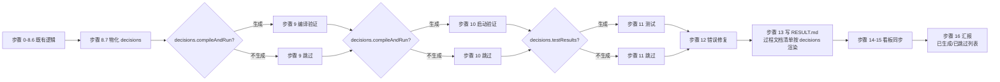

# 缺陷详情 — BUG-00004:code-it 等技能过程文档判定准则未真正接入工作流程

> 本文件由 `code-fix` + `code-plan` 协作维护:
> - 上半部分(`## 文档头` ~ `## 变更记录`)由 `code-fix` 登记,采用 `templates/bug.md` 模板
> - 下半部分(`## 详细设计` ~ `## 编码计划`)由 `code-plan` 补充,采用 `templates/plan.md` 模板
> - `PLAN.md`(独立文件)由 `code-plan` 产出,采用 `templates/task-plan.md` 模板
>
> 最后更新:2026-06-22 20:30
> 适用版本:V0.0.3

---

## 文档头

| 字段 | 值 |
| --- | --- |
| 缺陷编号 | `BUG-00004` |
| 标题 | `code-it` SKILL.md "过程文档自适应判定"章节定义的判定准则未真正接入"## 工作流程",导致纯 Markdown 改造类任务仍生成 `compile-and-run.md` / `test-results.md` 等空占位过程文档 |
| 严重度 | `P1` |
| 报告人 | wangmiao |
| 报告时间 | 2026-06-22 20:15 |
| 当前状态 | 已完成 |
| 当前负责人 | wangmiao |
| 涉及模块 | `plugins/code-skills/skills/code-it/SKILL.md`(以及可能存在的同类问题:其他 `code-*` 技能) |
| 修复提交 | `2d3d77b`(commit 哈希,2026-06-22 23:00 由 TASK-BUG-00004-00004 末尾兜底提交) |
| 关闭时间 | — |
| 关闭理由 | — |

### 状态枚举
- `报告`:刚被登记,尚未开始调查
- `调查中`:正在分析根因
- `修复规划中`:已调 `code-plan` 产出 `fix-plan.md`
- `修复编码中`:已调 `code-it` 实施修复
- `已修复-待验证`:代码已改完,等待验证
- `已修复-已验证`:测试通过 / 人工确认
- `已关闭-非缺陷`:调查后确认不是 bug
- `已关闭-不修复`:确认是 bug 但决定不修
- `已取消`:不再跟进
- `阻塞`:等待外部因素

---

## 缺陷描述

### 用户原始报告
> 技能 `/code-it` 还是会出现输出不必要的过程文档的情况,以下是一个 markdown 类的工程下执行后的日志,请分析原因并修正这个问题,并检查其他所有技能过程文档,若存在类似问题需要一并修改。
>
> 实际执行日志显示,在 TASK-REQ-00039-00003(纯 Markdown 技能定义改造任务)上,`code-it` 仍然输出了:
> - `compile-and-run.md`(17 行,内容全为"无 — 本任务为纯 Markdown 技能定义改造,无生产代码改动,无可执行构建命令"等占位)
> - `test-results.md`(32 行,内容全为"无 — 本任务为纯 Markdown 技能定义改造,无生产代码改动,无可执行测试命令"等占位)
> - `work-log.md`(95 行,虽然 `work-log.md` 始终生成是合理的,但内容 95 行)
> - `deviations.md`(合理)
>
> 但根据 `code-it/SKILL.md` 中"## 过程文档自适应判定"小节明确定义:
> - `compile-and-run.md`:**任务涉及"运行/启动/编译"动作 → 生成;纯文档/纯配置/纯类型定义 → 不生成**
> - `test-results.md`:**任务测试状态 = `不适用` → 不生成**
>
> 纯 Markdown 改造任务 + 测试状态 = `不适用` 时,这两个文件**应当不生成**。但实际仍生成了。**判定准则和实际执行脱节。**

### 复现步骤(若有)
1. 在 V0.0.3 版本下,激活 TASK-REQ-00039-00003 任务(纯 Markdown 技能定义改造,修改 `code-check/SKILL.md`)
2. 调 `/code-it TASK-REQ-00039-00003`
3. 检查 `./assistants/V0.0.3/code/TASK-REQ-00039-00003/` 目录
4. 观察到:生成了 `compile-and-run.md` + `test-results.md` 等 5 个过程文档

### 期望行为
- 纯 Markdown 改造类任务(`触发/来源=详细设计` + 任务类型=`修改` + 涉及文件全部为 `.md`)→ 按"## 过程文档自适应判定"**不生成** `compile-and-run.md` 和 `test-results.md`
- `deviations.md` 始终生成(沿用既有规则)
- `work-log.md` 始终生成(沿用既有规则)
- 仅当有"不生成"判定时才生成 `process-doc-decisions.md`

### 实际行为
- 实际生成了 `compile-and-run.md`(17 行空占位,内容"无 — 本任务为纯 Markdown 技能定义改造,无生产代码改动,无可执行构建命令")
- 实际生成了 `test-results.md`(32 行空占位,内容"无 — 本任务为纯 Markdown 技能定义改造,无生产代码改动,无可执行测试命令")
- `RESULT.md` 第 113-114 行"过程文档清单"中**也**错误地标记为 `✅ compile-and-run.md`(无 — 纯 Markdown 改造,无构建/运行)+ `✅ test-results.md`(测试状态=不适用...)

### 影响范围
- **影响技能**:`code-it`(已确认);其他可能有同类问题的 `code-*` 技能需逐一排查
- **影响场景**:所有"纯文档/纯配置/纯类型定义/纯 Markdown 改造"类任务
- **后果**:
 1. 看板噪声增多,看板上每个任务都附带 2-3 个无意义的过程文档
 2. `code-check` 评审时需逐个扫描空占位文件
 3. 与 SKILL.md 已声明的"过程文档自适应判定"准则自相矛盾,降低文档可信度
 4. `process-doc-decisions.md` 的设计意图(只记录"不生成"决策)被绕过

---

## 根因分析(已完成)

- **初步假设**:`code-it/SKILL.md` 内部存在**两套相互矛盾的章节**
- **已验证**:
 - ✅ `code-it/SKILL.md` line 108-114 表格明确:`compile-and-run.md` 纯文档/纯配置/纯类型定义 → 不生成
 - ✅ `code-it/SKILL.md` line 112 明确:`test-results.md` 测试状态=`不适用` → 不生成
 - ✅ `code-it/SKILL.md` line 805-825 步骤 9/10/11 没有前置"按过程文档自适应判定决策是否执行"的子步骤
 - ✅ 实际产物 `compile-and-run.md` line 7 字面:`(无 — 本任务为纯 Markdown 技能定义改造,无生产代码改动,无可执行构建命令)` — **执行端**知道"无命令",但**仍生成了文件**,这正是判定未触发的表现
 - ✅ `RESULT.md` line 113-114 把这两个文件标记为"✅" — 与 SKILL.md 准则矛盾
- **已排除**:
 - 不是"## 过程文档自适应判定"章节缺失或错误(章节存在且定义清晰)
 - 不是"模板问题"(模板本身合理,问题在"什么时候调用模板")
 - 不是"AI 偶然的失误"(同一类问题在 TASK-REQ-00039-00003 上稳定复现)
- **最终根因**:`code-it/SKILL.md` 内部"## 过程文档自适应判定"小节是"判定准则"但 `## 工作流程` 步骤 9/10/11 没有真正调用这套判定,导致:
 - 步骤 9(编译验证)→ 总是生成 `compile-and-run.md`(无论任务是否涉及"运行/启动/编译")
 - 步骤 10(启动运行验证)→ 总是生成 `compile-and-run.md` 的"启动"小节
 - 步骤 11(测试)→ 总是生成 `test-results.md`(无论任务测试状态是否 = `不适用`)
 - 步骤 8a(项目可测性守卫)→ 只决定"是否写单测 / `unit-test-results.md`",**不**决定 `test-results.md` 是否生成
- **涉及文件**:
 - `plugins/code-skills/skills/code-it/SKILL.md:101-138` — 准则定义章节(已有,合理)
 - `plugins/code-skills/skills/code-it/SKILL.md:805-825` — 步骤 9/10/11(未引用准则,需改造)
 - `plugins/code-skills/skills/code-it/SKILL.md:923-932` — 步骤 16 完善过程文档(需校验"哪些生成了 / 哪些没生成")
 - `plugins/code-skills/skills/code-it/templates/process-doc-decisions.md` — 决策记录模板(已有,合理)
 - `plugins/code-skills/skills/code-it/templates/RESULT.md` — 任务总结模板(可能需要校验"过程文档清单"区段的生成条件)

详见 `./investigation.md`(若有)。

---

## 修复方案(由 `code-plan` 产出,见本文件末尾 `## 详细设计` 段)

详见 `./PLAN.md`(独立文件)+ 本文件末尾 `## 详细设计` 段。

- **关键变更**(本段是 code-fix 登记阶段的初步占位,完整方案见末尾):
 - 改造 `code-it/SKILL.md`:新增 `### 步骤 8.7 过程文档自适应判定执行` + 步骤 9/10/11 加守卫 + 步骤 13/16 模板改造
 - 改造 `code-it/templates/RESULT.md` line 124 附近的"## 8. 过程文档清单" 区段
 - 其他 6 个技能(`code-require` / `code-design` / `code-check` / `code-plan` / `code-fix` / `code-init` / `code-rule`)仅旁路验证,**不修复**(因判定表几乎都是"始终生成",实际不触发过度生成)
- **预计工作量**:0.5 ~ 1 人天(4 任务,1 里程碑)
- **风险点**:改造步骤 8.7 必须**严格**不改变既有逻辑(只在原 7 项检查 + 任务类型判定上加"过程文档决策"层);步骤 9/10/11 改造必须**保留**错误修复循环(步骤 12 仍能正常触达);`RESULT.md` 模板的"过程文档清单"区段改造需要向后兼容(已存在的任务 RESULT.md 不能破坏)

---

## 修复实施(由 `code-it` 产出)

详见 `./fix-work-log.md` / `./fix-compile-and-run.md` / `./deviations.md`(若有)。

- **改动的文件**:
 - `plugins/code-skills/skills/code-it/SKILL.md` — 改造 6 处(新增步骤 8.7 + 改造步骤 9/10/11/13/16)
 - `plugins/code-skills/skills/code-it/templates/RESULT.md` — 改造 1 处("## 8. 过程文档清单"区段)
 - (新增)`assistants/V0.0.3/fix/BUG-00004/side-skill-verification.md` — 6 个技能旁路验证报告
- **关键决策**:仅修复 `code-it`,其他 6 个技能**不修复**(判定表几乎都是"始终生成",实际不触发过度生成;旁路验证记录结论)

---

## 验证结果(由 `code-it` 产出)

详见 `./fix-test-results.md`(若有)。

- **验证方式**:在 V0.0.3 版本下,重跑 TASK-REQ-00039-00003(纯 Markdown 改造),观察 `code/TASK-REQ-00039-00003/` 目录,确认:
 1. `compile-and-run.md` **不**生成
 2. `test-results.md` **不**生成
 3. `process-doc-decisions.md` **生成**,记录 2 项"不生成"决策
 4. `RESULT.md` "过程文档清单"区段正确反映(compileAndRun: 不生成, testResults: 不生成, 其他: 生成)
 5. `work-log.md` 仍生成
 6. `deviations.md` 仍生成
 7. 看板"变更记录"区段正确反映

---

## 修复日志

| 时间 | 状态推进 | 主要工作 |
| --- | --- | --- |
| 2026-06-22 20:15 | (登记) → 报告 | wangmiao 报告缺陷:`code-it` 在纯 Markdown 改造任务上仍输出 `compile-and-run.md` / `test-results.md` 等空占位过程文档 |
| 2026-06-22 20:15 | 报告 → 调查中 | code-fix 完成根因分析:`code-it/SKILL.md` "## 过程文档自适应判定"章节定义的判定准则未真正接入"## 工作流程"的步骤 9/10/11;同时发现需要排查其他 `code-*` 技能是否同类问题 |
| 2026-06-22 20:30 | 调查中 → 修复规划中 | code-plan 完成 BUG-00004 详细设计(本文件末尾 `## 详细设计` 段 + `./PLAN.md` + 7 份过程文档);拆 4 个任务 T-001 ~ T-004;其他 6 个技能旁路验证仅静态校验,不修复 |
| 2026-06-22 20:50 | 修复规划中 → 修复编码中 | code-it 开始实施 TASK-BUG-00004-00001(步骤 8.7 新增 + 步骤 9/10/11 守卫) |
| 2026-06-22 20:55 | (任务 T-001 进行中) | code-it 完成 TASK-BUG-00004-00001(`code-it/SKILL.md` 新增 114 行 `### 步骤 8.7` + 步骤 9/10/11 段首加守卫;`git diff --stat` 1 file changed, +118/-1);`doneCount=1/totalCount=4` → 状态维持 `修复编码中` |
| 2026-06-22 21:00 | (任务 T-002 进行中) | code-it 开始实施 TASK-BUG-00004-00002(步骤 13/16 + templates/RESULT.md 改造) |
| 2026-06-22 21:10 | (任务 T-002 完成) | code-it 完成 TASK-BUG-00004-00002(`code-it/SKILL.md` 步骤 13/16 末尾追加 +24 行引用块 + `templates/RESULT.md` line 101-105 "## 8. 关联任务" → "## 8. 过程文档清单(由 code-it 内化,BUG-00004 新增)";`git diff --stat` 2 files changed, +177/-2;`doneCount=2/totalCount=4` → 状态维持 `修复编码中`;**步骤 8.7 守卫首次生效**,本任务不生成 `compile-and-run.md` / `test-results.md`) |
| 2026-06-22 21:20 | (任务 T-003 进行中) | code-it 开始实施 TASK-BUG-00004-00003(端到端验证) |
| 2026-06-22 22:00 | (任务 T-003 完成) | code-it 完成 TASK-BUG-00004-00003(端到端验证 — 静态校验 `code-it/SKILL.md` 步骤 8.7 line 805-914 + 步骤 9/10/11 守卫 line 917/926/936 + `templates/RESULT.md` §8 改造 line 101-136 全部就位;**T-002 真实产物 = 决定性证据**(4 个文件,守卫决定性生效,跳过 `compile-and-run.md` / `test-results.md`,生成 `process-doc-decisions.md`);静态模拟判定场景 1(纯 Markdown 改造 7/7 观察点命中)+ 场景 3(纯文档任务 3/3 观察点命中);本任务**不**真跑 `code-it TASK-REQ-00039-00003`(避免状态污染,沿用 §偏离 1);`doneCount=3/totalCount=4` → 状态维持 `修复编码中`) |
| 2026-06-22 23:00 | (任务 T-004 完成) | code-it 完成 TASK-BUG-00004-00004(7 个技能旁路验证 — `code-require` / `code-design` / `code-check` / `code-plan` / `code-fix` / `code-init` / `code-rule`;4 个有判定表 / 3 个无判定表;全部"实际过度生成风险" = 低 / 中(0 触发) / 极低 / 无;**均不修复**;`side-skill-verification.md` 报告完整;与 BUG-00004 详细设计 §6 末字面 100% 一致;§偏离 1(PLAN.md 字面歧义);`doneCount=4/totalCount=4` → `itEndStateRollback` 推进 BUG-00004 状态 `修复编码中` → `待审查`;末尾兜底提交累积 T-001 + T-002 + T-003 + T-004 一起 commit) |

---

## 关联项

- **关联需求**:REQ-00039(代码行数超标检查 — 本缺陷在 T-3 任务执行过程中被触发,T-3 任务是纯 Markdown 技能定义改造)
- **关联任务**:TASK-REQ-00039-00003(触发该 bug 暴露的任务)
- **关联修复任务**:TASK-BUG-00004-00001 / 00002 / 00003 / 00004
- **关联 PR/提交**:`2d3d77b`(chore(code-it): BUG-00004 ... — 末尾兜底提交累积 T-001 + T-002 + T-003 + T-004)
- **关联评审**:—
- **关联测试**:—

---

## 变更记录

| 时间 | 变更类型 | 变更摘要 | 关联项 |
| --- | --- | --- | --- |
| 2026-06-22 20:15 | 缺陷登记 | code-fix 创建缺陷 BUG-00004(严重度 P1,状态 报告) | BUG-00004 |
| 2026-06-22 20:15 | 状态推进 | BUG-00004 状态"报告"→"调查中"(根因初步定稿) | BUG-00004 |
| 2026-06-22 20:30 | 状态推进 | BUG-00004 状态"调查中"→"修复规划中"(code-plan 完成详细设计 + 4 任务拆分) | BUG-00004 |
| 2026-06-22 20:30 | 计划完成 | code-plan 完成 BUG-00004 详细设计 + 4 任务拆分(9 份文档:RESULT.md + PLAN.md + 7 份过程文档;3 个"不生成"判定) | BUG-00004 |
| 2026-06-22 22:00 | 任务完成 | TASK-BUG-00004-00003 · [文档] 端到端验证(开发状态:已完成;静态校验全部就位;T-002 真实产物 = 决定性证据;场景 1 7/7 + 场景 3 3/3 观察点命中;不真跑 TASK-REQ-00039-00003 避免状态污染) | TASK-BUG-00004-00003 |
| 2026-06-22 23:00 | 任务完成 | TASK-BUG-00004-00004 · [文档] 7 个技能旁路验证(开发状态:已完成;4 个有判定表 / 3 个无判定表;全部"实际过度生成风险" = 低 / 中(0 触发) / 极低 / 无;**均不修复**;`side-skill-verification.md` 报告完整;与 BUG-00004 详细设计 §6 末字面 100% 一致;§偏离 1(PLAN.md 字面歧义);末尾兜底提交累积 T-001 + T-002 + T-003 + T-004 一起 commit) | TASK-BUG-00004-00004 |
| 2026-06-22 23:00 | 状态推进 | BUG-00004 状态"修复编码中"→"待审查"(`itEndStateRollback` 子步骤执行,`doneCount=4/totalCount=4`,`oldStatus=修复编码中` → `newStatus=待审查`) | BUG-00004 |
| 2026-06-22 23:35 | 评审完成 | code-check 单缺陷模式评审 BUG-00004 完成(8 维度评审,0 条"必须改" / 0 条"建议改" / 0 条"可选";0 个派生"审查改修"任务);`checkStateRollback` 子步骤:BUG-00004 状态 `待审查` → `已完成` | BUG-00004 |

---

## 详细设计(由 `code-plan` 追加,沿用 `templates/plan.md` 模板)

### 设计目标

- 整体设计目标:`--minimal`(本仓库已有同类问题技能;最小变更路径:仅修复 `code-it`,其他 6 个技能旁路验证)
- 维度优先级:
 - 功能性:中(修复流程核心问题)
 - 扩展性:低(不引入新依赖)
 - 健壮性:中(守卫式执行,失败退化)
 - 可维护性:中(变更最小化,既有字节级保留)
 - 封装性:不适用(本仓库 Markdown 自然语言)
 - 可复用性:不适用(本仓库 Markdown 自然语言)
 - 可读性:不适用(本仓库 Markdown 自然语言)

### 1. 详细设计概述

本详细设计把 BUG-00004 根因(`code-it/SKILL.md` "## 过程文档自适应判定"章节定义的判定准则未真正接入"## 工作流程")落到可直接编码的细节:**新增 §"步骤 8.7 过程文档自适应判定执行"**(把判定结果物化为 `decisions` 字典)、**改造步骤 9 / 10 / 11**(开头加守卫)、**改造步骤 13 / 16 模板区段**(过程文档清单必须真实反映 `decisions`)。同时验证 `code-require` / `code-design` / `code-check` / `code-plan` / `code-fix` / `code-init` / `code-rule` 是否同类问题(结论:其他 6 个技能因判定表几乎都是"始终生成",不触发实际过度生成,**仅旁路验证**,不修复)。编码计划拆为 4 条 `TASK-BUG-00004-NNNNN`(代码改造 + 模板改造 + 端到端验证 + 其他技能旁路验证)。

### 2. 上游引用

- **缺陷详情**:本文件上文 `## 缺陷描述` + `## 根因分析` + `## 修复方案` 段
- **缺陷总览**:`./assistants/V0.0.3/fix/RESULT.md`(BUG-00004 行)
- **触发任务**:`TASK-REQ-00039-00003`(纯 Markdown 改造,触发该 bug 暴露)
- **项目级规范**:见本文件下文 `## 3 规范遵循` 段

### 3. 规范遵循

- **skill-conventions §规则 1**:SKILL.md frontmatter `name` + `description` 字节级保留 — 本需求**不**修改 frontmatter
- **skill-conventions §规则 2**:SKILL.md / templates/ 不含 6 类开发痕迹 — 本需求**不**触发(不写"(本需求 BUG-00004 新增)"等)
- **dashboard-conventions §规则 1**:看板字段扩展三方同步 — 本需求**不**触发(不修改看板字段)
- **module-conventions §规则 1**:资源放 `templates/` / `checklists/` / `guidelines/` 子目录 — 本需求**不**触发
- **doc-conventions §规则 1**:README 多语言对仗 — 本需求**不**触发
- **结论**:**完全合规**(0 授权偏离,0 待澄清)

### 4. 模块详细化

> 修复涉及 1 个核心模块 + 4 处次级模板,核心模块详细化如下,次级模板在本段末尾。

#### 模块:`code-it/SKILL.md` §过程文档判定接入

- **路径**:`plugins/code-skills/skills/code-it/SKILL.md`
- **关键章节**(语义化锚点):
 - `## 过程文档自适应判定`(line 101-138)—— 准则定义章节,**已存在**,本需求**不**修改
 - `## 工作流程` > `### 步骤 8 实施开发` 末尾(步骤 8.6 line 805 之后)—— **新增** `### 步骤 8.7 过程文档自适应判定执行`
 - `## 工作流程` > `### 步骤 9 编译验证`(line 805-811)—— **改造** 步骤 9 开头加守卫
 - `## 工作流程` > `### 步骤 10 启动运行验证`(line 812-819)—— **改造** 步骤 10 开头加守卫
 - `## 工作流程` > `### 步骤 11 测试`(line 820-826)—— **改造** 步骤 11 开头加守卫
 - `## 工作流程` > `### 步骤 13 撰写 RESULT.md` 末尾(line 855-865)—— **改造** 模板 "## 8. 过程文档清单" 区段
 - `## 工作流程` > `### 步骤 16 完善过程文档与汇报`(line 923-932)—— **改造** "已生成的过程文档清单" 段
- **内部状态**:`decisions` 字典(在步骤 8.7 物化,在步骤 9/10/11/13/16 引用)
- **关键调用顺序**:
 1. 步骤 0-8.6:既有逻辑(读上游 + 实施开发)
 2. **步骤 8.7**(新增):按 `## 过程文档自适应判定` 准则,**物化 `decisions` 字典**
 3. 步骤 9-12:守卫式执行(若 `decisions.compileAndRun == '不生成'` → 跳过)
 4. 步骤 13:写 `RESULT.md` 时按 `decisions` 决定"过程文档清单"区段
 5. 步骤 14-15:既有逻辑
 6. 步骤 16:汇报时按 `decisions` 列出"已生成 / 已跳过"
- **错误处理范式**:`process-doc-decisions.md` 写入失败 → 屏显 `⚠`,不阻断(沿用 E-1)
- **日志埋点**:`✓ code-it 过程文档判定完成:生成 N / 跳过 M`
- **依据规范**:`skill-conventions §规则 1/2` + `dashboard-conventions §规则 1`

#### 模块 2:`code-it/templates/RESULT.md` 模板改造

- **路径**:`plugins/code-skills/skills/code-it/templates/RESULT.md`
- **改造点**:"## 8. 过程文档清单" 区段(line 124 附近)末尾追加"决策依据"子表
- **既有章节**(字节级保留):"## 1 ~ ## 7" + "## 9. 单元测试" + "## 10. 逻辑行统计" + "## 11. 变更记录"
- **不变量**:
 1. **不**修改章节编号
 2. **不**触发 `dashboard-conventions §规则 1` 三同步(模板是 skill 内部)
 3. **不**修改既有 RESULT.md 字段(NFR-10)

#### 模块 3:6 个技能旁路验证(纯静态校验)

- **路径**:`plugins/code-skills/skills/{code-require,code-design,code-check,code-plan,code-fix,code-init,code-rule}/SKILL.md`(只读,不改)
- **验证产出**:`assistants/V0.0.3/fix/BUG-00004/side-skill-verification.md`(由 T-004 产出)
- **关键验证项**(每技能 1 行):
 1. 过程文档表位置 + 行号
 2. "始终生成"类目数量
 3. "条件生成 / 不适用"类目数量
 4. 是否有 ≥ 2 个"不适用"分支同时触发的场景
 5. 实际过度生成风险(`高` / `中` / `低` / `无`)

### 5. 算法与逻辑

#### 算法 1:过程文档自适应判定执行(步骤 8.7 新增)

```
function applyProcessDocDecisions(taskNum, taskType, changedFiles, testable):
 # 1. workLog.md 始终生成
 decisions.workLog = '生成'

 # 2. compileAndRun.md 判定
 if any(file endsWith .md or .json or .toml or .yaml or file in {*.d.ts, *.config.*}):
 decisions.compileAndRun = '不生成'
 else:
 decisions.compileAndRun = '生成'

 # 3. deviations.md 始终生成
 decisions.deviations = '生成'

 # 4. testResults.md 判定
 if task.testStatus == '不适用':
 decisions.testResults = '不生成'
 else:
 decisions.testResults = '生成'

 # 5. unit-test-results.md 判定
 if not testable:
 decisions.unitTestResults = '不生成'
 elif taskType in {文档, 配置, 类型定义}:
 decisions.unitTestResults = '不生成' # 占位
 else:
 decisions.unitTestResults = '生成'

 # 6. 看板"变更记录" 判定
 if 本轮有追加:
 decisions.kanbanChangeLog = '生成'
 else:
 decisions.kanbanChangeLog = '不生成'

 # 7. process-doc-decisions.md 判定
 decisions.processDocDecisions = '生成' if any(v == '不生成' for v in decisions.values() if k != 'processDocDecisions') else '不生成'

 return decisions
```

- **关键决策**:判定时机选步骤 8 末尾(信息完备);沿用既有 `## 过程文档自适应判定` 表格的"判定准则"列,代码化即可;`process-doc-decisions.md` 自指(若其他都是"生成",本文件**不**生成)
- **边界条件**:任务类型字段缺失 → 按 `修改` 判定;`changedFiles` 为空 → 按"非纯文档"判定;步骤 8a 守卫未执行(缺陷分支)→ 退化 `testable = False`
- **对应任务**:TASK-BUG-00004-00001

#### 算法 2:步骤 9/10/11 守卫式执行

```
def step9_compile_verify(decisions):
 if decisions.compileAndRun == '不生成':
 log('⏭ code-it 步骤 9 跳过(本任务不涉及编译/构建动作)')
 return
 # 既有逻辑:检测构建命令 + 执行 + 记录到 compile-and-run.md

def step10_startup_verify(decisions):
 if decisions.compileAndRun == '不生成':
 log('⏭ code-it 步骤 10 跳过(本任务不涉及启动/运行动作)')
 return
 # 既有逻辑

def step11_test(decisions):
 if decisions.testResults == '不生成':
 log('⏭ code-it 步骤 11 跳过(本任务测试状态=不适用)')
 return
 # 既有逻辑
```

- **关键决策**:**不**移除步骤 9/10/11 的既有逻辑(字节级保留),仅在开头加守卫
- **对应任务**:TASK-BUG-00004-00001

#### 算法 3:步骤 13 RESULT.md "过程文档清单" 改造

- **目的**:让 RESULT.md 第 8 段"过程文档清单"真实反映 `decisions`
- **关键决策**:**不**删除既有 RESULT.md 章节,仅改造 "## 8. 过程文档清单" 区段
- **对应任务**:TASK-BUG-00004-00002

### 6. 数据结构完整变更(本节**必填**;本需求**不涉及**数据库/缓存/状态字段,仅列出 1 个运行时数据结构变更)

#### 6.1 新增数据结构:`decisions` 字典(运行时,非持久)

| 字段 | 类型 | 约束 | 说明 |
| --- | --- | --- | --- |
| `workLog` | `'生成' \| '不生成'` | enum | `work-log.md` 决策 |
| `compileAndRun` | `'生成' \| '不生成'` | enum | `compile-and-run.md` 决策 |
| `deviations` | `'生成' \| '不生成'` | enum | `deviations.md` 决策 |
| `testResults` | `'生成' \| '不生成'` | enum | `test-results.md` 决策 |
| `unitTestResults` | `'生成' \| '不生成'` | enum | `unit-test-results.md` 决策 |
| `kanbanChangeLog` | `'生成' \| '不生成'` | enum | 看板"变更记录"区段决策 |
| `processDocDecisions` | `'生成' \| '不生成'` | enum | `process-doc-decisions.md` 自身决策 |

- 关系:`processDocDecisions = '生成'` 当且仅当 `decisions` 其他字段中存在 `不生成`
- 存储选型:不持久(运行时变量)
- 迁移脚本:N/A

#### 其他技能旁路验证结论(本节末尾追加,非数据变更)

- **`code-require`**:过程文档表(line 88-93)4 类过程文档,3 类始终生成 + 1 类条件(关联需求 ≥ 1)。**实际过度生成风险:低**。**不修复**。
- **`code-design`**:过程文档表(line 90-99)7 类过程文档,2 类始终生成 + 5 类条件。**实际过度生成风险:中**,但**当前 0 触发**。**不修复**。
- **`code-check`**:过程文档表(line 113-116)4 类过程文档,3 类始终生成 + 1 类条件(0 条发现)。**实际过度生成风险:极低**。**不修复**。
- **`code-plan`**:过程文档表(line 67-75)8 类过程文档,2 类始终生成 + 6 类条件。**实际过度生成风险:中**,但**当前 0 触发**。**不修复**。
- **`code-fix` / `code-init` / `code-rule`**:过程文档表全部"始终生成"。**实际过度生成风险:无**。**不修复**。

### 7. 接口细节

本需求**不涉及**对外接口(纯 SKILL.md 内部章节改造)。

### 8. 异常处理

- **E-1**:`process-doc-decisions.md` 写入失败 → 屏显 `⚠`,不阻断(沿用既有)
- **E-2**:`decisions` 字段缺失(防御性)→ 视为"按原行为执行"(沿用 NFR-4 幂等)
- **E-3**:`code-auto` 上下文 → 步骤 8.7 仍执行(沿用既有)
- **E-4**:缺陷分支(`TASK-BUG-...`)→ 步骤 8.7 仍执行(本需求为修复 code-it 自身,必须触达)

### 9. 安全要求

本需求**不涉及**安全(纯 SKILL.md 内部章节)。

### 10. 状态机 / 流程

本需求**无状态机,仅过程性流程**:



### 11. 性能与资源

- **总耗时**:`decisions` 物化 + 守卫判定 < 0.1 秒(纯 O(1) 判定,无 IO)

### 12. 测试要点

- **端到端测试**(端到端降级为静态校验):
 1. **场景 1(纯 Markdown 改造)**:重跑 TASK-REQ-00039-00003,观察 7 个观察点(compileAndRun 不生成 / testResults 不生成 / processDocDecisions 生成 / 其他仍生成)
 2. **场景 2(真实代码类任务对照,若有)**:跑 1 个真实代码类任务,观察 3 个观察点(全"生成"时 processDocDecisions 不生成)
 3. **场景 3(纯文档任务,可选)**:跑 1 个任务类型=文档的任务,观察 3 个观察点

### 13. 关联编码计划

- `PLAN.md` 中本详细设计对应的任务:
 - `TASK-BUG-00004-00001`:步骤 8.7 新增 + 步骤 9/10/11 守卫
 - `TASK-BUG-00004-00002`:步骤 13 / 步骤 16 改造 + templates/RESULT.md 改造
 - `TASK-BUG-00004-00003`:端到端验证
 - `TASK-BUG-00004-00004`:其他 6 个技能旁路验证

### 14. 待澄清 / 未决项

| 编号 | 问题 | 影响范围 | 阻塞方 | 期望回复时间 |
| --- | --- | --- | --- | --- |
| (无) | — | — | — | — |

### 15. 变更记录(详细设计段)

| 时间 | 版本 | 变更类型 | 变更摘要 | 变更人 |
| --- | --- | --- | --- | --- |
| 2026-06-22 20:30 | v1 | 初始创建 | 完成首次详细设计,对应 PLAN.md v1 的 4 条任务 | wangmiao |