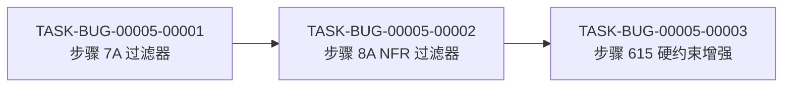

# BUG-00005 修复编码计划

- 缺陷编号:BUG-00005
- 所属版本:V0.0.3
- 详细设计:./assistants/V0.0.3/fix/BUG-00005/RESULT.md (v1)
- 状态:待开始
- 开发完成度:0 / 3
- 测试完成度:0 / 3
- 创建:2026-06-22 15:00
- 最近更新:2026-06-22 15:00
- 当前版本:v1

## 1. 计划概述

本编码计划包含 3 个任务,采用方案 B(步骤 7A + 8A 双重过滤),目标是在 `code-require/SKILL.md` 中添加技术选型过滤机制,确保 REQ-00033 硬约束得到正确执行。

- **任务总数**:3
- **类型分布**:3 个修改类任务
- **关键里程碑**:M1-BUG-00005(3 任务全部开发=已完成 ∧ 测试=不适用)
- **开发完成度**:0 / 3
- **测试完成度**:0 / 3
- **真正可发布任务数**:0 / 3

## 2. 任务总览

| 任务编号 | 需求 | 类型 | 触发/来源 | 标题 | 开发状态 | 测试状态 | 涉及文件/模块 | 前置任务 | 估算 | 责任人 | 关联任务 | 对应设计章节 |
| --- | --- | --- | --- | --- | --- | --- | --- | --- | --- | --- | --- | --- |
| TASK-BUG-00005-00001 | BUG-00005 | 修改 | 缺陷修复 | [修改] code-require 步骤 7A 添加技术选型过滤器 | 已完成 | 不适用 | plugins/code-skills/skills/code-require/SKILL.md §步骤 7A(L322-333) | — | 0.5d | wangmiao | BUG-00005 | RESULT.md §4.1 + §5.1 |
| TASK-BUG-00005-00002 | BUG-00005 | 修改 | 缺陷修复 | [修改] code-require 步骤 8A 添加 NFR 技术选型过滤器 | 已完成 | 不适用 | plugins/code-skills/skills/code-require/SKILL.md §步骤 8A(L337-353) | T-1 | 0.5d | wangmiao | T-1, BUG-00005 | RESULT.md §4.2 + §5.2 |
| TASK-BUG-00005-00003 | BUG-00005 | 修改 | 缺陷修复 | [修改] code-require 步骤 615 硬约束增强(引用步骤 7A/8A) | 已完成 | 不适用 | plugins/code-skills/skills/code-require/SKILL.md §步骤 615(L619-620) | T-1, T-2 | 0.3d | wangmiao | T-1, T-2, BUG-00005 | RESULT.md §4.3 |

## 3. 任务详情

### 3.1 TASK-BUG-00005-00001:[修改] code-require 步骤 7A 添加技术选型过滤器

#### 基础信息
- **类型**:修改
- **触发/来源**:缺陷修复
- **触发任务**:BUG-00005
- **开发状态**:待开始
- **测试状态**:不适用
- **目标**:在步骤 7A 添加技术选型类问题过滤逻辑,自动跳过并记录到 clarifications.md
- **涉及文件/模块**:`plugins/code-skills/skills/code-require/SKILL.md` §步骤 7A(L322-333)
- **前置任务**:无
- **关联任务**:BUG-00005
- **关键变更**:
  - 在步骤 7A 的"每轮问答"逻辑后,添加子步骤:"过滤技术选型类问题"
  - 若问题涉及"技术选型 / 实现方式 / 框架 / 库"等关键词,自动跳过并记录到 `clarifications.md` 的 `deferred-to-code-design` 区段
- **边界与异常**:
  - 边界 1:空问题列表 → 返回 `{ validQuestions: [], deferredQuestions: [] }`
  - 异常 1:过滤失败 → 记录警告,回退到不过滤模式
- **验证手段**:静态校验(步骤 7A 字面改写正确)+ 旁路验证(7 个技能不受影响)
- **回退方式**:`git revert <commit>` 撤回本任务
- **对应设计章节**:RESULT.md §4.1 + §5.1
- **依据规范**:`skill-conventions §规则 2`(不引入新字段)
- **创建时间**:2026-06-22 15:00
- **最近更新**:2026-06-22 15:00
- **完成时间**:2026-06-23
- **完成人**:wangmiao
- **提交哈希**:5250a54
- **备注**:纯 Markdown 改造,无代码改动

#### 单元测试状态
- **测试状态**:不适用
- **不适用理由**:纯文档任务(步骤 7A 字面改写)

### 3.2 TASK-BUG-00005-00002:[修改] code-require 步骤 8A 添加 NFR 技术选型过滤器

#### 基础信息
- **类型**:修改
- **触发/来源**:缺陷修复
- **触发任务**:BUG-00005
- **开发状态**:待开始
- **测试状态**:不适用
- **目标**:在步骤 8A 添加技术选型类 NFR 过滤逻辑,标记为 `defer-to-code-design` 并记录到 clarifications.md
- **涉及文件/模块**:`plugins/code-skills/skills/code-require/SKILL.md` §步骤 8A(L335-351)
- **前置任务**:T-1
- **关联任务**:T-1, BUG-00005
- **关键变更**:
  - 在步骤 8A 的"NFR 记录"逻辑中,添加过滤条件:若 NFR 涉及"技术选型 / 实现方式"等关键词,标记为 `defer-to-code-design` 并在 `clarifications.md` 中记录
- **边界与异常**:
  - 边界 1:空 NFR 列表 → 返回 `{ validNFRs: [], deferredNFRs: [] }`
  - 异常 1:过滤失败 → 记录警告,回退到不过滤模式
- **验证手段**:静态校验(步骤 8A 字面改写正确)+ 旁路验证(7 个技能不受影响)
- **回退方式**:`git revert <commit>` 撤回本任务
- **对应设计章节**:RESULT.md §4.2 + §5.2
- **依据规范**:`skill-conventions §规则 2`(不引入新字段)
- **创建时间**:2026-06-22 15:00
- **最近更新**:2026-06-22 15:00
- **完成时间**:2026-06-23
- **完成人**:wangmiao
- **提交哈希**:a94bda2
- **备注**:纯 Markdown 改造,无代码改动

#### 单元测试状态
- **测试状态**:不适用
- **不适用理由**:纯文档任务(步骤 8A 字面改写)

### 3.3 TASK-BUG-00005-00003:[修改] code-require 步骤 615 硬约束增强(引用步骤 7A/8A)

#### 基础信息
- **类型**:修改
- **触发/来源**:缺陷修复
- **触发任务**:BUG-00005
- **开发状态**:待开始
- **测试状态**:不适用
- **目标**:在步骤 615 硬约束后添加引用,确保所有步骤都尊重"不涉及技术选型"约束
- **涉及文件/模块**:`plugins/code-skills/skills/code-require/SKILL.md` §步骤 615
- **前置任务**:T-1, T-2
- **关联任务**:T-1, T-2, BUG-00005
- **关键变更**:
  - 在步骤 615 的硬约束后,添加引用:"步骤 7A / 步骤 8A 中的技术选型类问题应自动跳过并记录到 clarifications.md"
- **边界与异常**:
  - 边界 1:无(纯约束声明)
- **验证手段**:静态校验(步骤 615 字面改写正确)+ 旁路验证(7 个技能不受影响)
- **回退方式**:`git revert <commit>` 撤回本任务
- **对应设计章节**:RESULT.md §4.3
- **依据规范**:`skill-conventions §规则 2`(不引入新字段)
- **创建时间**:2026-06-22 15:00
- **最近更新**:2026-06-22 15:00
- **完成时间**:2026-06-23
- **完成人**:wangmiao
- **提交哈希**:待回填(本轮末尾 git commit 后回填)
- **备注**:纯 Markdown 改造,无代码改动

#### 单元测试状态
- **测试状态**:不适用
- **不适用理由**:纯文档任务(步骤 615 字面改写)

## 4. 任务依赖图



## 5. 里程碑

| 里程碑 | 包含任务 | 完成定义 | 预期时间 |
| --- | --- | --- | --- |
| M1-BUG-00005 | T-001, T-002, T-003 | 3 任务开发=已完成 ∧ 测试=不适用;步骤 7A + 8A + 615 字面改写完成;旁路验证通过;0 改 frontmatter / 0 改既有章节;末尾兜底 1 次 commit | 2026-06-22 |

## 6. 状态管理规则

### 6.1 开发状态(主状态)
- **状态推进**:`待开始` → `进行中` → `已完成`,或经 `阻塞` 后回到 `进行中`
- **已完成不可逆**:开发状态为"已完成"的任务,其**描述/关键变更/依赖等字段不可修改**
- **已取消不可逆**:已取消任务作为历史保留,后续任务不应再依赖
- **阻塞**:必须填写阻塞原因,放在"备注"或单独的过程文档
- **状态变更记录**:每次状态变更在"变更记录"中记录(变更类型=开发状态更新)

### 6.2 测试状态(平行状态)
- **初始化**:本计划 3 任务全部为 `不适用`(纯 Markdown 改造)
- **状态推进**:N/A(本计划不规划单元测试)
- **独立于开发状态**:测试状态可独立于开发状态变化
- **不适用不可逆**:一旦标为 `不适用`,不应再变为其他值
- **阻塞**:N/A
- **状态变更记录**:N/A

### 6.3 任务"真正可发布"定义
```
任务真正可发布 ⟺
  开发状态 = 已完成
  ∧ 测试状态 ∈ {已运行-通过, 不适用}
```

本计划 3 任务全部为纯 Markdown 改造,测试状态 = `不适用`,因此开发完成后即为"真正可发布"。

### 6.4 状态字段更新责任分工

| 字段 | 主要更新方 | 触发时机 |
| --- | --- | --- |
| 开发状态(待开始→进行中) | `code-it` | 步骤 7 任务开始 |
| 开发状态(进行中→已完成) | `code-it` | 步骤 14 任务完成 |
| 测试状态(不适用) | `code-plan` | 首次拆分时确认(本计划 3 任务全部不适用) |
| 任务标题、关键变更等描述 | `code-plan` 增量更新 | 步骤 9B |
| 任务类型 | `code-plan` 增量更新 | 步骤 9B(通常不改) |
| 触发/来源 | `code-plan` | 首次拆分(本计划 3 任务全部=缺陷修复) |

## 7. 关联计划

| 关联计划编码 | 关联点 | 对本计划的影响 | 链接 |
| --- | --- | --- | --- |
| REQ-00033 | 上游需求(技术选型约束) | 本计划修复 REQ-00033 硬约束未正确执行的问题 | [PLAN.md](../../plan/REQ-00033/PLAN.md) |
| BUG-00004 | 过程文档自适应判定 | 本计划不涉及过程文档判定(纯 Markdown 改造) | [PLAN.md](./BUG-00004/PLAN.md) |

## 8. 变更记录

| 时间 | 版本 | 变更类型 | 变更摘要 | 变更人 |
| --- | --- | --- | --- | --- |
| 2026-06-22 15:00 | v1 | 初始创建 | 完成首次编码计划,3 个任务(方案 B:步骤 7A + 8A 双重过滤);开发=待开始,测试=不适用;里程碑 M1-BUG-00005 | wangmiao |
| 2026-06-23 | v1 | 状态更新 | TASK-BUG-00005-00001 开发状态"待开始"→"已完成"(步骤 7A 末尾追加"过滤技术选型类问题"子节,L334 空行 + L335 新子节,既有 L322-333 字面 0 改;步骤 8A / 615 顺移,内容字面 0 改) | wangmiao |
| 2026-06-23 | v1 | 状态更新 | TASK-BUG-00005-00002 开发状态"待开始"→"已完成"(步骤 8A 末尾追加"过滤技术选型类 NFR"子节,L352 空行 + L353 新子节,既有 L337-L351 字面 0 改,"要求:" 段顺移 +1,步骤 9A / 10A / 615 顺移 +2);14 关键词与详细设计 §5.2 字节级一致;与 T-1 末段 + 步骤 615 形成完整三链 | wangmiao |
| 2026-06-23 | v1 | 状态更新 | TASK-BUG-00005-00003 开发状态"待开始"→"已完成"(步骤 615 下方追加新 `- 列表项`,L619 原字面 0 改,选项 C 实施);新列表项完整复述触发动作 + 引用 T-1 / T-2 子节 + 详细设计 §5.1 + §5.2;完整三链(7A + 8A + 615)显式声明;3 任务全部完成,等 code-check 评审推进 BUG 状态 | wangmiao |
