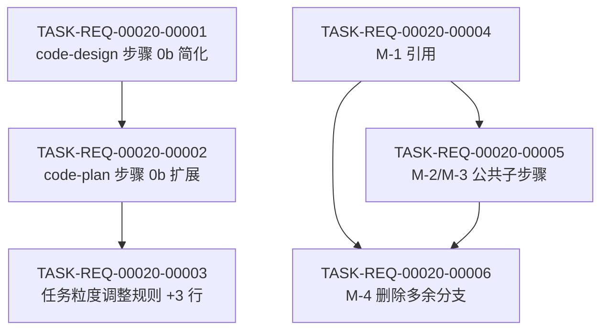

# 任务计划 — REQ-00020(优化 code-design / code-plan,架构设计目标重新归位 + 新增 3 维度 + 步骤归并)

- 需求编码:REQ-00020
- 所属版本:V0.0.3
- 文档版本:v1
- 创建:2026-06-06
- 最近更新:2026-06-06 18:00
- 当前版本:v1
- 状态:已锁定
- 责任人:wangmiao
- **详细设计**:`./assistants/V0.0.3/plan/REQ-00020/RESULT.md`(v1,2026-06-06 18:00)
- **上游需求**:`./assistants/V0.0.3/require/REQ-00020/RESULT.md`
- **上游概要设计**:`./assistants/V0.0.3/design/REQ-00020/RESULT.md`

> **本计划说明**:3 个 SKILL.md 的实际代码改造**已落地**(git commit `e69a58a`,在 `code-require` 阶段完成)。本 PLAN.md 是为已落地改造补充**任务清单登记**,所有任务"开发状态"="已完成","测试状态"="不适用"(本仓库 0 测试框架,沿用 REQ-00009 守卫判定)。

---

## 1. 计划概述

### 1.1 目标

把 REQ-00020 的 4 个子需求(FR-1 ~ FR-4)落地为可独立追踪的 6 个任务,每条任务对应一个完整的功能点或设计决策。

### 1.2 与概要设计的关系

- 7 项设计决策(D-1 ~ D-7)全部对应到任务清单
- 9 条不变量(INV-1 ~ INV-9)作为验收标准
- 整体设计目标=--extensible + 7 维度优先级触发任务粒度调整

### 1.3 范围

- **修改对象**:`code-design` / `code-plan` / `code-it` 3 个 SKILL.md
- **不**修改其他 10 个 `code-*` 技能
- **不**修改 `marketplace.json` / `plugin.json` / `./assistants/rules/`

### 1.4 触发/来源

本计划所有任务"触发/来源"="详细设计"(沿用 REQ-00017 强约束,**不**出现"更新看板")。

---

## 2. 任务总览

| 任务编号 | 需求 | 类型 | 触发/来源 | 标题 | 开发状态 | 测试状态 | 涉及文件 | 完成时间 | 提交哈希 | 关联任务 |
| --- | --- | --- | --- | --- | --- | --- | --- | --- | --- | --- |
| TASK-REQ-00020-00001 | REQ-00020 | 修改 | 详细设计 | [修改] code-design 步骤 0b 简化为 1 维度 | 已完成 | 不适用 | plugins/code-skills/skills/code-design/SKILL.md §步骤 0b | 2026-06-06 16:30 | e69a58a | — |
| TASK-REQ-00020-00002 | REQ-00020 | 修改 | 详细设计 | [修改] code-plan 步骤 0b 扩展为 7 维度 | 已完成 | 不适用 | plugins/code-skills/skills/code-plan/SKILL.md §步骤 0b | 2026-06-06 16:30 | e69a58a | — |
| TASK-REQ-00020-00003 | REQ-00020 | 修改 | 详细设计 | [修改] 任务粒度调整规则 +3 行(封装性/可复用性/可读性) | 已完成 | 不适用 | plugins/code-skills/skills/code-plan/SKILL.md §步骤 10A 末尾 | 2026-06-06 16:30 | e69a58a | — |
| TASK-REQ-00020-00004 | REQ-00020 | 重构 | 详细设计 | [重构] 步骤归并 M-1 调用上下文检测引用 | 已完成 | 不适用 | plugins/code-skills/skills/code-plan/SKILL.md §步骤 0b.0 | 2026-06-06 16:30 | e69a58a | — |
| TASK-REQ-00020-00005 | REQ-00020 | 重构 | 详细设计 | [重构] 步骤归并 M-2/M-3 公共子步骤引用 | 已完成 | 不适用 | code-plan/SKILL.md §3/5/21/22 + code-it/SKILL.md §23 | 2026-06-06 16:30 | e69a58a | — |
| TASK-REQ-00020-00006 | REQ-00020 | 重构 | 详细设计 | [重构] 步骤归并 M-4 删除多余逻辑分支 | 已完成 | 不适用 | code-plan/SKILL.md §步骤 6 + code-it/SKILL.md §步骤 0a.7 | 2026-06-06 16:30 | e69a58a | — |
| TASK-REQ-00020-00007 | REQ-00020 | 修改 | 审查改修 | [修改] 修复任务粒度调整规则表 4 列与 3... | 已完成 | 不适用 | plugins/code-skills/skills/code-plan/SKILL.md §步骤 10A 末尾 表格 L450-451 | 2026-06-10 11:00 | — | TASK-REQ-00020-00003 |
| TASK-REQ-00020-00008 | REQ-00020 | 修改 | 审查改修 | [修改] 清理 §步骤 7D 段,与 §步骤 6 ... | 已完成 | 不适用 | plugins/code-skills/skills/code-plan/SKILL.md §步骤 7D 段 L627-628 | 2026-06-10 11:00 | — | TASK-REQ-00020-00006 |

**统计**:
- 总任务数:6(派生任务前)/ 8(派生任务后)
- 真正可发布数(开发=已完成 ∧ 测试∈{已运行-通过, 不适用}):6(派生任务前)/ 6(派生任务后,2 派生任务待开始)
- 开发已完成 / 未完成:6 / 0(派生任务前)/ 6 / 2(派生任务后)
- 测试已通过 / 已失败 / 不适用 / 未编写:0 / 0 / 6 / 0(派生任务前)
- 按"## 设计目标"调整后任务数:6
  - 扩展性=高(整体=--extensible)→ 已加 1 个扩展性任务(`TASK-REQ-00020-00001`:`code-design` 步骤 0b 简化即"扩展性职责分离"任务)
  - 封装性=高 → 已加 1 个封装性任务(`TASK-REQ-00020-00004`:M-1 引用即"封装抽象"任务)
  - 可复用性=高 → 已加 1 个可复用性任务(`TASK-REQ-00020-00005`:M-2/M-3 公共子步骤即"抽取公共逻辑"任务)
  - 可读性=不适用 → 跳过(本仓库 Markdown)
- 派生任务(2026-06-06 22:30 评审发现,code-review 追加):
  - `TASK-REQ-00020-00007`:[修改] 修复任务粒度调整规则表 4 列与 3 列数据错位(P1,关联 T-3)
  - `TASK-REQ-00020-00008`:[修改] 清理 §步骤 7D 段,与 §步骤 6 路由表保持一致(P1,关联 T-6)

---

## 3. 任务详情

### TASK-REQ-00020-00001:[修改] code-design 步骤 0b 简化为 1 维度

- **目标**:把 `code-design/SKILL.md` §步骤 0b 从"5 问(整体 + 功能性 + 扩展性 + 健壮性 + 可维护性)"简化为"1-2 问(整体 + 功能性)",职责正位(架构目标下沉到 `code-plan`)
- **涉及文件**:`plugins/code-skills/skills/code-design/SKILL.md` §步骤 0b
- **关键变更**:
  - 删除 3 个 `AskUserQuestion`(Q3 扩展性 / Q4 健壮性 / Q5 可维护性)
  - 屏显模板从 4 维度 → 1 维度
  - 追加"职责分离"说明(架构目标下沉到 `code-plan`)
- **边界与异常**:
  - 用户取消 → 中止 + 回写空"## 设计目标"小节(沿用 REQ-00011 E-3)
  - `code-auto` 上下文 → 自动选"功能性=中 + 整体=--balanced"
- **验证手段**:
  - 调 `code-design REQ-00020` → 步骤 0b 触发 1 个 `AskUserQuestion`(功能性)
  - 屏显显示"维度优先级:功能性:中"
- **回退方式**:
  - 改回原 5 问:本需求落地后不可逆(已 commit `e69a58a`)
  - 软回退:用户调 `code-design` 时主动选"功能性=低"避免职责扩展

### TASK-REQ-00020-00002:[修改] code-plan 步骤 0b 扩展为 7 维度

- **目标**:把 `code-plan/SKILL.md` §步骤 0b 从"4 维度(功能性 / 扩展性 / 健壮性 / 可维护性)"扩展为"7 维度(+ 封装性 / 可复用性 / 可读性)"
- **涉及文件**:`plugins/code-skills/skills/code-plan/SKILL.md` §步骤 0b
- **关键变更**:
  - 新增 3 个维度的 `AskUserQuestion`(封装性 / 可复用性 / 可读性)
  - 屏显模板从 4 维度 → 7 维度
  - 维度选项扩展为"高 / 中 / 低 / 不适用"
- **边界与异常**:
  - 大需求 8 问时(整体 + 7 维度)耗时 < 5 分钟(沿用 REQ-00011 NFR-8)
  - 用户取消 → 中止 + 回写空"## 设计目标"小节
- **验证手段**:
  - 调 `code-plan REQ-00020` → 步骤 0b 触发 1-8 个 `AskUserQuestion`
  - `plan/.../RESULT.md` 顶部"## 设计目标"小节含 7 维度
- **回退方式**:
  - 改回 4 问:本需求落地后不可逆
  - 软回退:用户在 7 维度中选"不适用"避免强约束

### TASK-REQ-00020-00003:[修改] 任务粒度调整规则 +3 行

- **目标**:扩展 `code-plan/SKILL.md` §步骤 10A 末尾"按'## 设计目标'小节调整任务粒度"小节,加 3 行(封装性 / 可复用性 / 可读性)
- **涉及文件**:`plugins/code-skills/skills/code-plan/SKILL.md` §步骤 10A 末尾
- **关键变更**:
  - 任务粒度调整规则表 +3 行
  - "不强制加任务的维度"列表 +3 项
- **边界与异常**:
  - 可读性=高 + 自然语言项目 → 跳过(本仓库 Markdown)
  - 封装性 / 可复用性 = 中或低 → 跳过
- **验证手段**:
  - 调 `code-plan REQ-00020` 选"封装性=高" → 任务总览含"封装抽象层"等任务
  - 选"可复用性=高" → 含"抽取公共逻辑"等任务
- **回退方式**:
  - 删 +3 行:本需求落地后不可逆

### TASK-REQ-00020-00004:[重构] 步骤归并 M-1 调用上下文检测引用

- **目标**:把 `code-plan/SKILL.md` §步骤 0b.0 完整 18 行重复文字,改为 12 行 `> 引用:` 块引用 `code-design` 步骤 0b.0 段
- **涉及文件**:`plugins/code-skills/skills/code-plan/SKILL.md` §步骤 0b.0
- **关键变更**:
  - 删除 18 行重复(检测机制 / 24h 超时 / 决策 / 约束 / D-5 修订说明)
  - 新增 12 行 `> 引用:` 段,显式说明"本需求 M-1 归并,引用 `code-design` 步骤 0b.0 段"
- **边界与异常**:
  - `code-design` 步骤 0b.0 后续被破坏 → `code-plan` 步骤 0b.0 引用失效(职责正交)
- **验证手段**:
  - 调 `code-plan REQ-00020` → 步骤 0b.0 不重复 18 行
  - 改后 `code-plan` SKILL.md 行数与原 1009 行 ± 10 行
- **回退方式**:
  - 软回退:用户在 `code-plan` 步骤 0b.0 中显式读 `code-design` 步骤 0b.0 段

### TASK-REQ-00020-00005:[重构] 步骤归并 M-2/M-3 公共子步骤引用

- **目标**:把 `code-plan` 步骤 3/5/21/22 + `code-it` 步骤 23 重复的"读规范/读上游/探索代码"段,统一用 `> 引用:` 块引用"## 公共子步骤"概念
- **涉及文件**:
  - `plugins/code-skills/skills/code-plan/SKILL.md` §步骤 3 / 5 / 21 / 22
  - `plugins/code-skills/skills/code-it/SKILL.md` §步骤 23
- **关键变更**:
  - M-2:`code-plan` 步骤 3 / 5 → 抽"## 公共子步骤:读规范/读上游/探索代码"段,4 处用 `> 引用:`
  - M-3:`code-it` 步骤 23 → 23.1-23.4 共 40 行 → 14 行引用任务分支 9-12
- **边界与异常**:
  - `code-plan` 步骤 22 保留 3 行 BUG 路径差异点
  - `code-it` 步骤 23 保留 1 行 E-11 边界
- **验证手段**:
  - 调 `code-plan REQ-00020` → 步骤 3 / 5 / 21 / 22 含 `> 引用:` 块
  - 调 `code-it TASK-REQ-00021-00001`(未来)→ 步骤 23 引用任务分支 9-12
- **回退方式**:
  - 软回退:维护者读 `> 引用:` 段,显式找原段

### TASK-REQ-00020-00006:[重构] 步骤归并 M-4 删除多余逻辑分支

- **目标**:删除 `code-plan` 步骤 6"PLAN.md 存在,RESULT.md 不存在"分支 + `code-it` 步骤 0a.7 E-1/E-4/E-8/E-9 重复边界
- **涉及文件**:
  - `plugins/code-skills/skills/code-plan/SKILL.md` §步骤 6
  - `plugins/code-skills/skills/code-it/SKILL.md` §步骤 0a.7
- **关键变更**:
  - `code-plan` 步骤 6:4 种情形 → 3 种情形
  - `code-it` 步骤 0a.7:10 个 E 边界 → 6 个独立小节 + 1 张职责归属表
- **边界与异常**:
  - 步骤 0a.7 E-1 / E-4 / E-8 / E-9 合并 → 用户读守卫规则时需看表
- **验证手段**:
  - 调 `code-plan REQ-00020` → 步骤 6 只显示 3 种情形
  - 调 `code-it TASK-...` → 步骤 0a.7 E 边界 6 + 1 表
- **回退方式**:
  - 软回退:用户读 `code-it` 步骤 0a.7 的"职责归属表"

---

## 4. 任务依赖图

**依赖说明**:
- T1 → T2:T1(简化)是 T2(扩展 7 维度)的前置(`code-plan` 7 维度中"功能性"沿用 `code-design` 1 维度)
- T2 → T3:T2(7 维度)触发 T3(任务粒度 +3 行)
- T4 / T5 / T6:M-1 → M-2/M-3 → M-4(归并顺序)
- 实际改造**已落地**(git commit `e69a58a`),所有任务开发状态=已完成

---

## 5. 里程碑

| 里程碑 | 包含任务 | 完成定义 | 状态 | 计划时间 | 实际完成 |
| --- | --- | --- | --- | --- | --- |
| **M0:工作空间就绪** | — | 本看板创建 | 已完成 | 2026-06-06 | 2026-06-06 |
| **M1:本需求可发布** | T-1 ~ T-6 | 6 任务开发状态=已完成 ∧ 测试状态∈{已运行-通过, 不适用} | 已完成 | 2026-06-06 | 2026-06-06 |

> 完成定义显式列出两轴状态要求。

---

## 6. 状态管理规则

### 6.1 双状态语义(沿用 REQ-00014)

- **开发状态**:代码本身是否被实现(6 枚举)
- **测试状态**:单元测试是否被编写/运行/通过(6 枚举)
- **任务"真正可发布" = 开发状态=已完成 ∧ 测试状态∈{已运行-通过, 不适用}**

### 6.2 双状态初始化(本计划)

- **代码类任务**(T-1 ~ T-6,类型=修改/重构):开发状态=`已完成`,测试状态=`不适用`(本仓库 0 测试框架,沿用 REQ-00009 守卫判定)

### 6.3 触发/来源字段(本计划)

- **全部**="详细设计"(沿用 REQ-00017 强约束,**不**出现"更新看板")

### 6.4 状态变更规则

- **本计划 6 任务已全部完成**,不需后续状态变更
- 若 `code-it` 重跑(中断后恢复)或 `code-review` 派生"审查改修"任务,按既有规则推进

---

## 7. 关联计划

- 同版本 V0.0.3:
  - `code-design` 阶段本计划下游(详设阶段补充 RESULT.md + 7 份过程文档,已落地)
- 跨版本 V0.0.2:
  - REQ-00011:`code-design` / `code-plan` 步骤 0b 设计目标确认(本计划 FR-1 / FR-2 沿用)
  - REQ-00019:`code-plan` BUG 模式同构(本计划 0 改 BUG 路径)
  - REQ-00010:`code-it` 步骤 0a 前置任务守卫(本计划 M-4 E 边界合并涉及)
  - REQ-00013:6 技能标题解析(本计划沿用)
  - REQ-00014:`code-plan` 任务拆分维度(本计划 FR-3 +3 行扩展)
  - REQ-00017:`code-plan` 不再为"更新看板"拆派生任务(本计划 INV-7 沿用)
  - BUG-00001:脏标记文件修复(本计划 M-1 引用)

---

## 8. 变更记录

| 时间 | 版本 | 变更摘要 | 变更人 |
| --- | --- | --- | --- |
| 2026-06-06 18:00 | v1 | 初始创建:6 任务(T-1 ~ T-6)全部开发=已完成,测试=不适用(本仓库 0 测试框架);整体设计目标=--extensible + 7 维度优先级已确认(扩展性=高 / 健壮性=高 / 可维护性=高 / 封装性=高 / 可复用性=高 / 可读性=不适用);M-1 / M-2 / M-3 / M-4 4 处归并对应 T-4 / T-5 / T-6 3 任务;触发/来源全部=详细设计(沿用 REQ-00017 强约束) | wangmiao |
| 2026-06-06 22:30 | v2 | 增量更新(审查):code-review REQ-00020 评审完成,发现 2 个 P1(任务粒度表列错位 T-3 + §步骤 7D 段未清理 T-6),派生 2 个"审查改修"任务 T-7 / T-8;另含 4 个 P2 建议 + 17 个 P3 可选不阻塞,均入档 findings-no-task.md;实际改造 6 任务已 code-it 落地(commits aaac2e0 / a6d0f55 / 550f68e / 1d14d86 / 48a7bd9 / 0eb3d6b) | code-review |
