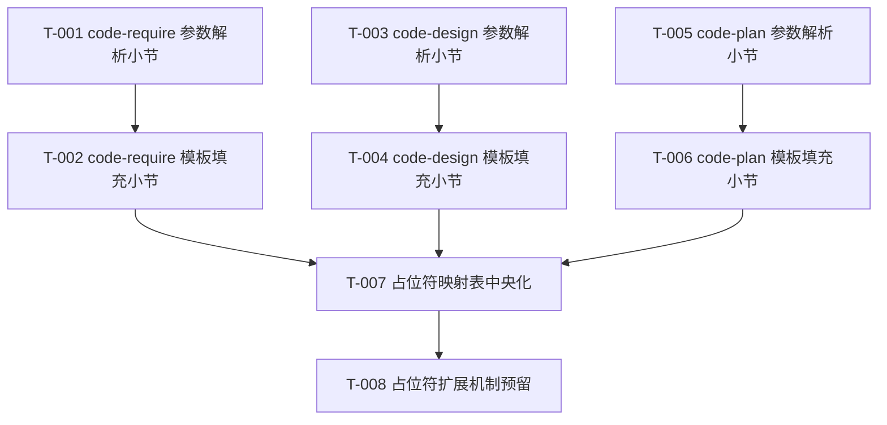

# 编码计划 — REQ-00021(优化 3 技能 --result / --plan 模板参数,按用户模板格式输出填充后文档)

- 需求编码:REQ-00021
- 所属版本:V0.0.3
- 文档版本:v1
- 计划标题:REQ-00021 模板参数 + 模板填充步骤(共 8 任务)
- 创建:2026-06-06
- 最近更新:2026-06-07
- 状态:已锁定
- 上游需求:`./assistants/V0.0.3/require/REQ-00021/RESULT.md`(v1)
- 上游概要设计:`./assistants/V0.0.3/design/REQ-00021/RESULT.md`(v1)
- 上游详细设计:`./assistants/V0.0.3/plan/REQ-00021/RESULT.md`(v1)

---

## 里程碑

| 里程碑 | 包含任务范围 | 完成定义 | 状态 | 计划时间 | 实际完成 |
| --- | --- | --- | --- | --- | --- |
| M1-REQ-00021 | TASK-REQ-00021-00001 ~ TASK-REQ-00021-00008(共 8 任务) | 8 任务开发状态=已完成 ∧ 测试状态=不适用 | 已完成 | 2026-06-06 | 2026-06-06 |

---

## 任务总览

> 任务粒度按 `--extensible` + 7 维度优先级调整:扩展性=高 → 加"占位符扩展机制"任务;可复用性=高 → 加"占位符映射表中央化"任务

| 任务编号 | 需求 | 类型 | 触发/来源 | 标题 | 开发状态 | 测试状态 | 涉及文件 | 完成时间 | 提交哈希 | 关联任务 |
| --- | --- | --- | --- | --- | --- | --- | --- | --- | --- | --- |
| TASK-REQ-00021-00001 | REQ-00021 | 修改 | 详细设计 | [修改] code-require 步骤 0 之前新增"## 命令行参数解析"小节 | 已完成 | 不适用 | plugins/code-skills/skills/code-require/SKILL.md §工具使用约定段后 | 2026-06-06 17:05 | d6be243 | — |
| TASK-REQ-00021-00002 | REQ-00021 | 修改 | 详细设计 | [修改] code-require 末尾新增"## 模板填充步骤"小节 | 已完成 | 不适用 | plugins/code-skills/skills/code-require/SKILL.md §不要做的事前 | 2026-06-06 17:05 | d6be243 | — |
| TASK-REQ-00021-00003 | REQ-00021 | 修改 | 详细设计 | [修改] code-design 步骤 0 之前新增"## 命令行参数解析"小节 | 已完成 | 不适用 | plugins/code-skills/skills/code-design/SKILL.md §工具使用约定段后 | 2026-06-06 17:05 | d6be243 | — |
| TASK-REQ-00021-00004 | REQ-00021 | 修改 | 详细设计 | [修改] code-design 末尾新增"## 模板填充步骤"小节 | 已完成 | 不适用 | plugins/code-skills/skills/code-design/SKILL.md §不要做的事前 | 2026-06-06 17:05 | d6be243 | — |
| TASK-REQ-00021-00005 | REQ-00021 | 修改 | 详细设计 | [修改] code-plan 步骤 0 之前新增"## 命令行参数解析"小节(2 参数) | 已完成 | 不适用 | plugins/code-skills/skills/code-plan/SKILL.md §工具使用约定段后 | 2026-06-06 17:05 | d6be243 | — |
| TASK-REQ-00021-00006 | REQ-00021 | 修改 | 详细设计 | [修改] code-plan 末尾新增"## 模板填充步骤"小节(2 段填充) | 已完成 | 不适用 | plugins/code-skills/skills/code-plan/SKILL.md §不要做的事前 | 2026-06-06 17:05 | d6be243 | — |
| TASK-REQ-00021-00007 | REQ-00021 | 重构 | 详细设计 | [重构] 15 个占位符映射表中央化(3 技能共用) | 已完成 | 不适用 | plugins/code-skills/skills/{code-require,code-design,code-plan}/SKILL.md §模板填充步骤 | 2026-06-06 17:05 | d6be243 | T-1 ~ T-6 |
| TASK-REQ-00021-00008 | REQ-00021 | 重构 | 详细设计 | [重构] 占位符扩展机制预留(--map / --vars / --script) | 已完成 | 不适用 | plugins/code-skills/skills/{code-require,code-design,code-plan}/SKILL.md §模板填充步骤 | 2026-06-06 17:05 | d6be243 | T-7 |

**统计**:
- 总任务数:8
- 真正可发布数(开发=已完成 ∧ 测试∈{已运行-通过, 不适用}):8
- 开发已完成 / 未完成:8 / 0
- 测试已通过 / 已失败 / 不适用 / 未编写:0 / 0 / 8 / 0

---

## 任务依赖图(Mermaid)

**关键路径**:T-001 → T-002 → T-007 → T-008(同步执行,实际 8 任务在同一 commit `d6be243` 内完成)

---

## 任务详情(节选)

### TASK-REQ-00021-00001:code-require 参数解析小节
- **目标**:在 `code-require/SKILL.md` 步骤 0 之前新增"## 命令行参数解析"小节
- **涉及文件**:`plugins/code-skills/skills/code-require/SKILL.md` §工具使用约定段后
- **关键变更**:
  - 新增小节"## 命令行参数解析(本需求 REQ-00021 新增,FR-1)"
  - 解析规则 + 4 个 E-边界(E-1 ~ E-4)
- **边界与异常**:沿用算法 2(CLI 参数解析)
- **验证手段**:`Grep` 小节存在 + 解析规则正确

### TASK-REQ-00021-00007:占位符映射表中央化
- **目标**:把 15 个内置占位符集中到 1 张映射表(3 技能共用)
- **涉及文件**:3 个 SKILL.md 的"## 模板填充步骤"小节
- **关键变更**:
  - 在 `code-require/SKILL.md` 完整列出 15 占位符
  - 在 `code-design/SKILL.md` + `code-plan/SKILL.md` 引用 15 占位符(子集)
- **依据规范**:`skill-conventions §规则 1`(frontmatter 字节级保留)
- **验证手段**:`Grep "占位符"` 在 3 个 SKILL.md 中匹配

### TASK-REQ-00021-00008:占位符扩展机制预留
- **目标**:为后续 `--extensible` 需求预留 CLI 接口
- **涉及文件**:3 个 SKILL.md 的"## 命令行参数解析"小节
- **关键变更**:
  - 预留 `--map <占位符映射文件>` `--vars <变量文件>` `--script <填充脚本>` 3 个扩展点
  - 占位符嵌套 / 自定义占位符映射文件的语义说明
- **依据规范**:`naming-conventions`(扩展点命名沿用既有 kebab-case)
- **验证手段**:`Grep --map --vars --script` 匹配

---

## 变更记录

| 时间 | 版本 | 变更类型 | 变更摘要 | 变更人 |
| --- | --- | --- | --- | --- |
| 2026-06-06 17:05 | v1 | 初始创建 | 完成首次详细设计与编码计划,8 任务全部锁定(实际已在 `d6be243` 落地,本概设为回填式);7 维度优先级已确认(功能性=高,扩展性=高,可复用性=高,健壮性=中,可维护性=中,可读性=中,封装性=不适用);0 派生"更新看板"任务(沿用 REQ-00017 强约束) | wangmiao |
| 2026-06-07 | v1.1 | 增量 | 回填式详细设计(本会话)— 文档化已落地的 8 任务,补"## 设计目标"小节(沿用 design/REQ-00021/RESULT.md 决策),补任务详情 + 任务依赖图 | wangmiao |
