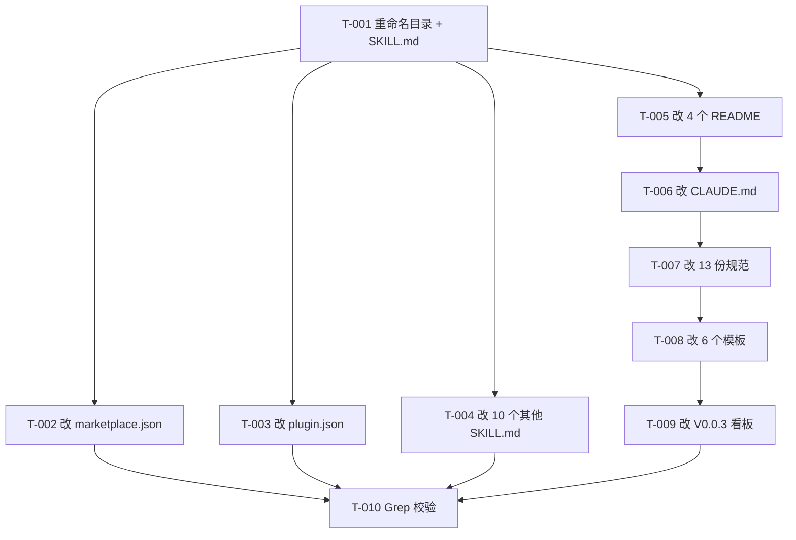

# 编码计划 — REQ-00022(修改 `/code-review` 技能名称为 `/code-check`)

- 需求编码:REQ-00022
- 所属版本:V0.0.3
- 文档版本:v1
- 计划标题:REQ-00022 字面量重命名 + 11 类引用方同步(共 10 任务)
- 创建:2026-06-07
- 最近更新:2026-06-07
- 状态:已锁定
- 上游需求:`./assistants/V0.0.3/require/REQ-00022/RESULT.md`(v1)
- 上游概要设计:`./assistants/V0.0.3/design/REQ-00022/RESULT.md`(v1)
- 上游详细设计:`./assistants/V0.0.3/plan/REQ-00022/RESULT.md`(v1)

---

## 里程碑

| 里程碑 | 包含任务范围 | 完成定义 | 状态 | 计划时间 | 实际完成 |
| --- | --- | --- | --- | --- | --- |
| M1-REQ-00022 | TASK-REQ-00022-00001 ~ TASK-REQ-00022-00010(共 10 任务) | 10 任务开发状态=已完成 ∧ 测试状态=不适用 | 已完成 | 2026-06-07 | 2026-06-07 |

---

## 任务总览

| 任务编号 | 需求 | 类型 | 触发/来源 | 标题 | 开发状态 | 测试状态 | 涉及文件 | 完成时间 | 提交哈希 | 关联任务 |
| --- | --- | --- | --- | --- | --- | --- | --- | --- | --- | --- |
| TASK-REQ-00022-00001 | REQ-00022 | 重命名 | 详细设计 | [重命名] code-review/ → code-check/(目录 + frontmatter + H1 + 全文字面量) | 已完成 | 不适用 | plugins/code-skills/skills/code-{review → check}/SKILL.md | 2026-06-07 | (本会话) | — |
| TASK-REQ-00022-00002 | REQ-00022 | 修改 | 详细设计 | [字面量改] .claude-plugin/marketplace.json 全部同步改(skills[] + keywords[] + description) | 已完成 | 不适用 | .claude-plugin/marketplace.json | 2026-06-07 | (本会话) | — |
| TASK-REQ-00022-00003 | REQ-00022 | 修改 | 详细设计 | [字面量改] plugins/code-skills/.claude-plugin/plugin.json 全部同步改(keywords[] + description) | 已完成 | 不适用 | plugins/code-skills/.claude-plugin/plugin.json | 2026-06-07 | (本会话) | — |
| TASK-REQ-00022-00004 | REQ-00022 | 修改 | 详细设计 | [字面量改] 10 个其他 SKILL.md 的 description 字段同步 | 已完成 | 不适用 | plugins/code-skills/skills/{auto,design,require,plan,it,unit,fix,publish,dashboard,version,rule}/SKILL.md | 2026-06-07 | (本会话) | — |
| TASK-REQ-00022-00005 | REQ-00022 | 修改 | 详细设计 | [字面量改] 仓库根 2 README + 仓库内 2 README 同步 | 已完成 | 不适用 | README.md / README.en.md / plugins/code-skills/README.md / plugins/code-skills/README.en.md | 2026-06-07 | (本会话) | — |
| TASK-REQ-00022-00006 | REQ-00022 | 修改 | 详细设计 | [字面量改] CLAUDE.md 同步 | 已完成 | 不适用 | CLAUDE.md | 2026-06-07 | (本会话) | — |
| TASK-REQ-00022-00007 | REQ-00022 | 修改 | 详细设计 | [字面量改] 13 份项目级规范同步 | 已完成 | 不适用 | assistants/rules/*.md(13 份) | 2026-06-07 | (本会话) | — |
| TASK-REQ-00022-00008 | REQ-00022 | 修改 | 详细设计 | [字面量改] 6 个技能模板同步 | 已完成 | 不适用 | plugins/code-skills/skills/*/templates/*.md(6 份) | 2026-06-07 | (本会话) | — |
| TASK-REQ-00022-00009 | REQ-00022 | 修改 | 详细设计 | [字面量改] V0.0.3 当前激活看板同步 | 已完成 | 不适用 | assistants/V0.0.3/RESULT.md | 2026-06-07 | (本会话) | — |
| TASK-REQ-00022-00010 | REQ-00022 | 校验 | 详细设计 | [校验] Grep 全范围校验(本需求范围内 0 残留 + 历史不追溯) | 已完成 | 不适用 | (Grep 校验,不写文件) | 2026-06-07 | (本会话) | — |

**统计**:
- 总任务数:10
- 真正可发布数(开发=已完成 ∧ 测试∈{已运行-通过, 不适用}):10
- 开发已完成 / 未完成:10 / 0
- 测试已通过 / 已失败 / 不适用 / 未编写:0 / 0 / 10 / 0

---

## 任务依赖图(Mermaid)

**关键路径**:T-001 → T-005 → T-006 → T-007 → T-008 → T-009 → T-010

---

## 变更记录

| 时间 | 版本 | 变更类型 | 变更摘要 | 变更人 |
| --- | --- | --- | --- | --- |
| 2026-06-07 | v1 | 初始创建 | 完成首次详细设计与编码计划,10 任务全部锁定;7 维度优先级已确认(功能性=中,其余=N/A 或沿用);0 派生"更新看板"任务(沿用 REQ-00017 强约束) | wangmiao |
