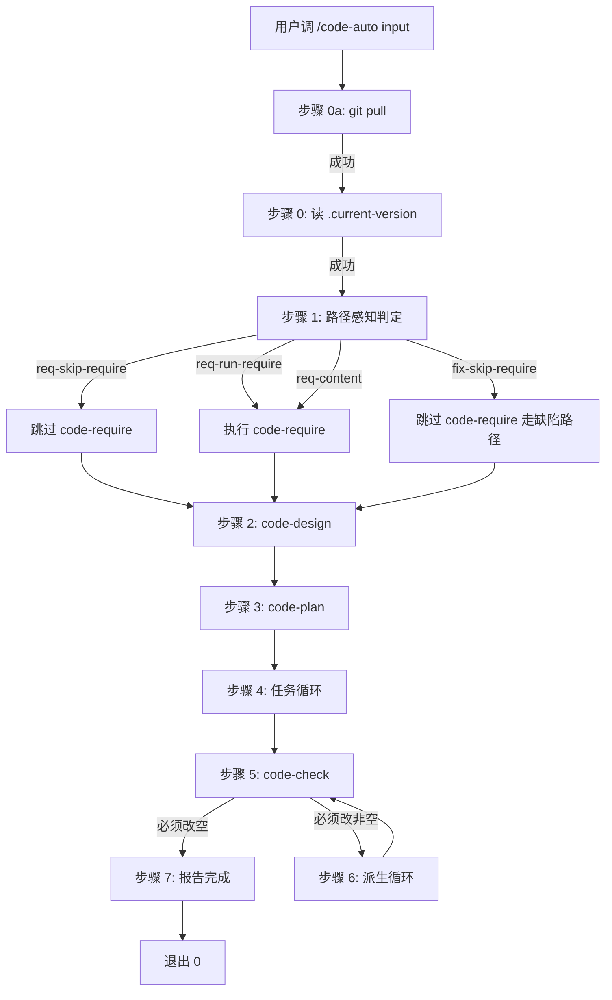

# 详细设计 — REQ-00024 — 移除 /code-auto 的 from 关键字逻辑,改用路径感知判定

> 本文件是 `code-plan BUG-00001` 阶段的辅助过程文档。详细内容已并入 `fix/BUG-00001/RESULT.md §7`(14 章节)。本文档作为索引与速查表。

- 需求编码:REQ-00024
- 计划标题:`code-auto` 步骤 1 改造:用路径感知替代 `from` 关键字
- 状态:待 code-it 实施
- 所属版本:V0.0.3
- 整体设计目标:`--balanced`(从 `design/REQ-00024/RESULT.md` 沿用)
- 维度优先级:功能性=中(沿用)

## 概述

**本详细设计的目标**:把 `code-auto` 步骤 1 的"正则匹配 `^from REQ-\d{5}$` 关键字"逻辑改造为"路径感知判定"(`Bash: test -d <path>`)。

**修复范围**:
- 1 个目标 SKILL.md:`plugins/code-skills/skills/code-auto/SKILL.md`(修改)
- 0 个目录新增 / 0 个文件新增 / 0 个文件删除
- 0 个依赖新增 / 0 个字段新增 / 0 触发 `dashboard-conventions §规则 1` 三同步
- 0 触发 `code-rule`(新增 `rules/skill-responsibility.md` **不**在本轮修复范围)

## 上游引用

| 来源 | 路径 | 提取内容 |
| --- | --- | --- |
| 缺陷详情 | `require/REQ-00024/RESULT.md` | 9 FR / 6 NFR / 8 AC / 4 Q / 14 章节需求详情 |
| 概要设计 | `design/REQ-00024/RESULT.md` | 6 项决策 / 5 条不变量 / 14 章节概要设计 |
| 项目级规范 | `./assistants/rules/*.md` × 13 | 强约束:沿用 code-plan 既有自检结论;0 触发新增/修改 |

## 模块详细化(单一模块改造)

### 目标模块:`code-auto/SKILL.md`

- **路径**:`plugins/code-skills/skills/code-auto/SKILL.md`
- **状态**:**修改**
- **关键变更点**:
  - 步骤 1(原"模式识别 + code-require")→ 改为"路径感知判定 + 4 模式分支"
  - 屏显契约:`[code-auto] 步骤 1:路径感知判定` + `[code-auto]   → 模式:<X>` + `[code-auto]   → 依据:<X>`(沿用既有 3 行风格)
  - 边界异常:E-15 / E-16 / E-17 删除,E-18 / E-19 新增
  - 退出码表:5 不再触发
- **涉及文件**:`plugins/code_skills/skills/code-auto/SKILL.md` §输入与输出(模式识别子表) + §工作流步骤 步骤 1 + §边界与异常 + §屏幕输出格式契约(沿用既有)
- **状态归属**:本模块**不**涉及运行时状态(纯文档)
- **与概要设计的对应**:`design/REQ-00024/RESULT.md §2 关键设计决策` 全部
- **符合的规范**:`skill-conventions.md §规则 1`(frontmatter 字节级保留) / `encoding-conventions.md §规则 1-4`(任务编号新格式 5+5 位嵌套式,**不**触发本需求) / `dashboard-conventions.md §规则 1`(0 字段扩展,0 三同步)

## 算法与逻辑

### 算法 1:路径感知判定(替换原正则匹配)

```
function pathDetection(userInput, version):
  // 1. 拼接 userInput 字符串(去首尾空白)
  input = trim(userInput)

  // 2. 检查 require/<input>/ 目录
  if test -d "./assistants/${version}/require/${input}":
    // 3. 检查 require/<input>/RESULT.md 文件
    if test -f "./assistants/${version}/require/${input}/RESULT.md":
      return { mode: "req-skip-require", reason: "RESULT.md exists" }
    else:
      return { mode: "req-run-require", reason: "RESULT.md not exists" }

  // 4. 检查 fix/<input>/ 目录
  if test -d "./assistants/${version}/fix/${input}":
    return { mode: "fix-skip-require", reason: "fix directory exists" }

  // 5. 既不是需求编号也不是缺陷编号 → 视为需求内容
  return { mode: "req-content", reason: "no directory exists" }
```

### 算法 2:屏显契约

```
屏显格式(沿用既有"步骤 N/6:..."风格,屏显 3 行前缀):
  [code-auto] 步骤 1:路径感知判定
  [code-auto]   → 模式:需求编号(已存在 RESULT.md,跳过 code-require)
  [code-auto]   → 依据:require/REQ-00020/ 存在 + RESULT.md 存在
```

## 数据结构

- **核心实体**:`path-detection-result`(伪代码变量,无持久化)
  - 字段 1:`mode` (enum):`req-skip-require` / `req-run-require` / `fix-skip-require` / `req-content`
  - 字段 2:`reason` (string):判定依据
  - 字段 3:`input` (string):用户输入字符串(原样保留)
- **生命周期**:**无持久化**(每次 `code-auto` 调用重新计算)

## 接口细节

- **接口**:`Bash: test -d <path>` + `Bash: test -f <path>`
- **形式**:Bash 内置命令
- **入参**:`<path>`(相对路径,以 CWD 为基准)
- **出参**:退出码 0 = 存在,非 0 = 不存在
- **错误码**:**0**(本命令不会失败,只返回布尔)
- **示例**:
  - `test -d "./assistants/V0.0.3/require/REQ-00020"` → 0
  - `test -d "./assistants/V0.0.3/fix/BUG-00001"` → 0
  - `test -d "./assistants/V0.0.3/require/自然语言需求"` → 非 0
- **版本策略**:沿用既有;`./assistants/<version>/` 由 `.current-version` 动态读取
- **兼容策略**:0 触发(`Bash` 行为跨平台一致)

## 异常处理

| 异常路径 | 处理 |
| --- | --- |
| 输入空字符串 | 沿用既有"缺参数"行为(退出码 4) |
| 输入含特殊字符 | OS 文件系统层处理;屏显警告(若非目录) |
| 路径检测失败(Bash 不可用) | 沿用既有(退出码 2) |
| `code-fix/RESULT.md` 缺失 | 沿用既有(进入 code-plan 缺陷分支校验) |
| 路径类型异常(E-19,如非目录文件) | 屏显警告 + 视为"两个目录都不存在" |

## 安全要求

- 路径检测为**只读**操作(0 文件改动,0 副作用)
- 输入是用户提供的任意字符串,但**仅**作为路径检测的字面值,**不**作为命令执行
- 路径遍历防护:本技能不解析 `..` / 绝对路径,只检测 `./assistants/<version>/<类型>/<userInput>` 的字面值存在性
- 无敏感数据泄露

## 状态机/流程



## 性能与资源

- 路径检测 2-3 次 `Bash: test -d` 命令(每条 < 0.01 秒)
- 总耗时 < 0.1 秒(本步骤)
- 整体 `code-auto` 6 步状态机性能不变

## 测试要点

详 `fix/BUG-00001/RESULT.md §7.12`(8 项 INV 静态校验),本需求无新增测试。

## 规范遵循(13 份规范自检)

| 规范 | 触发? | 结论 |
| --- | --- | --- |
| `skill-conventions.md §规则 1` | ✅ 强 | code-auto frontmatter 字节级保留(INV 严守) |
| `module-conventions.md` | ❌ | DEPRECATED,本修复不引用 |
| `directory-conventions.md` | ❌ | 占位待填,本修复不触发 |
| `encoding-conventions.md §规则 1-4` | ❌ | 0 触发新编码生成 |
| `dashboard-conventions.md §规则 1` | ❌ | 0 字段扩展,0 三同步 |
| `doc-conventions.md §规则 1-2` | ❌ | 本修复不涉及 README |
| `coding-style.md` | ❌ | 占位,SKILL.md 是自然语言不涉及代码风格 |
| `commit-conventions.md` | ⚠️ 软 | 沿用 `chore(code-it): TASK-... · <标题>` 格式 |
| `dependency-conventions.md` | ❌ | 0 新依赖 |
| `framework-conventions.md` | ❌ | 0 架构变更 |
| `naming-conventions.md` | ❌ | 0 新增命名实体 |
| `migration-mapping.md` | ❌ | 0 编码重命名 |
| `marketplace-protocol.md` | ❌ | 0 JSON 字段变更 |

**自检结论**:0 违反强约束,1 项软约束沿用既有。

## 关联

| 关联项 | 关联方式 |
| --- | --- |
| `CLAUDE.md §版本感知工作空间约定` | 上游权威源(定义 `code-*` 技能 → 工作空间目录映射) |
| `plugins/code-skills/skills/code-fix/SKILL.md §工作目录约定` | 缺陷路径工作空间约定 |
| `plugins/code-skills/skills/code-require/SKILL.md §工具使用约定` | 引用方契约(本修复不修改) |
| V0.0.3 RESULT.md §任务清单 | 本计划完成后由 code-it 同步 |

## 待澄清 / 未决项

| 编号 | 问题 | 默认决策(本轮锁定) |
| --- | --- | --- |
| Q-1 | `code-fix` 的 `from` 关键字是否同步移除 | **否**(本需求边界限定) |
| Q-2 | 任务编码输入 | **不修改**(`code-auto` 不接受任务编码) |
| Q-3 | `code-publish` 同步改造 | **不修改**(0 关联) |
| Q-4 | `auto-report.md` 模板是否需要模式名 | **不修改**(NFR-2 强约束) |

## 变更记录

| 时间 | 版本 | 变更类型 | 变更摘要 | 变更人 |
| --- | --- | --- | --- | --- |
| 2026-06-07 | v1 | 初始创建 | code-plan 完成 REQ-00024 详细设计 + 1 任务拆分(code-auto/SKILL.md 改造);0 派生"更新看板"任务;6 步状态机不变;9 个其他 code-* 技能字节级 0 变化 | wangmiao |
